# 建设工程施工管理 考试大纲考点

## 目录

- 第1章 施工组织与目标控制
- 第2章 施工招标投标与合同管理
- 第3章 施工进度管理
- 第4章 施工质量管理
- 第5章 施工成本管理
- 第6章 施工安全管理
- 第7章 绿色施工及环境管理
- 第8章 施工文件归档管理及项目管理新发展

## 第1章 施工组织与目标控制

### 1.1 工程项目投资管理与实施

#### 1.1.1 工程项目投资管理制度

  改革开放以来，我国对原有投资体制进行了一系列改革，打破了传统计划经济体制下高度集中的投资管理模式，初步形成了投资主体多元化、资金来源多渠道、投资方式多样化的新格局。1996年8月，为深化投资体制改革，建立投资风险约束机制，国务院决定对固定资产投资项目试行资本金制度，印发《国务院关于固定资产投资项目试行资本金制度的通知》（国发〔1996]35号），明确了投资项目资本金制度的实施范围，投资项目资本金的含义、出资形式、最低比例要求等。之后，国务院又分别于2009年、2015年和2019年发布相关通知，调整和完善了固定资产投资项目最低资本金比例。  

  2004年7月，为进一步深化投资体制改革，确立企业在投资活动中的主体地位，规范政府投资行为，国务院制定了深化投资体制改革的纲领性文件，印发《国务院关于投资体制改革的决定》（国发〔2004]20号），提出了深化投资体制改革的指导思想、目标和具体措施。2016年7月，为充分发挥市场在资源配置中的决定性作用和更好发挥政府作用，进一步转变政府职能，深入推进简政放权、放管结合、优化服务改革，中共中央、国务院印发《中共中央国务院关于深化投融资体制改革的意见》（中发〔2016]18号），为投融资领域推进供给侧结构性改革进行了顶层设计。2019年5月，为充分发挥政府投资作用，提高政府投资效益，规范政府投资行为，激发社会投资活力，国务院发布《政府投资条例》，标志着全面规范政府投资管理迈出重要一步。

**1. 项目资本金制度**

  《国务院关于固定资产投资项目试行资本金制度的通知》（国发【1996］35号）规定，自1996年开始，各种经营性固定资产投资项目（包括国有单位的基本建设、技术改造、房地产开发项目和集体投资项目）试行资本金制度，投资项目必须首先落实资本金才能进行建设。所谓项目资本金，是指在项目总投资中由投资者认缴的出资额。这里的总投资，是指投资项目的固定资产投资与铺底流动资金之和。项目资本金属于非债务性资金，项目法人不承担这部分资金的任何利息和债务。投资者可按其出资比例依法享有所有者权益，也可转让其出资，但不得以任何方式抽回。对于银行等金融机构或资本市场的投资者而言，项目资本金可视为项目法人进行债务融资的信用基础。

**1）项目资本金来源**

  项目资本金可以用货币出资，也可以用实物、工业产权、非专利技术、土地使用权作价出资。对作为资本金的实物、工业产权、非专利技术、土地使用权，必须经过有资格的资产评估机构依照法律法规评估作价，不得高估或低估。除国家对采用高新技术成果有特别规定外，以工业产权、非专利技术作价出资的比例不得超过投资项目资本金总额的 20% 。  

  投资者以货币方式认缴的资本金，其资金来源有：  

  （1）各级人民政府的财政预算内资金、国家批准的各种专项建设基金、经营性基本建设基金回收的本息、土地批租收入、国有企业产权转让收入、地方人民政府按国家有关规定收取的各种规费及其他预算外资金。  

  （2）国家授权的投资机构及企业法人的所有者权益（包括资本金、资本公积金、盈余公积金和未分配利润、股票上市收益资金等）、企业折旧资金及投资者按照国家规定从资本市场上筹措的资金。  

  （3）社会个人合法所有的资金。  

  （4）国家规定的其他可以用作投资项目资本金的资金。

**2）项目资本金比例**

  目前，各类投资项目最低资本金比例见表1.1-1。其中，公路（含政府收费公路）、铁路、城建、物流、生态环保、社会民生等领域的补短板基础设施项目，在投资回报机制明确、收益可靠、风险可控的前提下，可以适当降低项目最低资本金比例，但下调不得超过5个百分点。

*表1.1-1投资项目最低资本金比例*

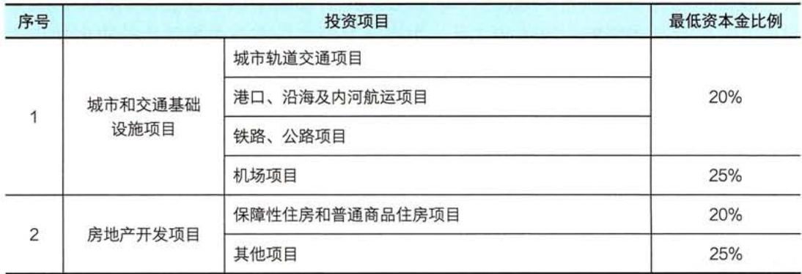

*续表*

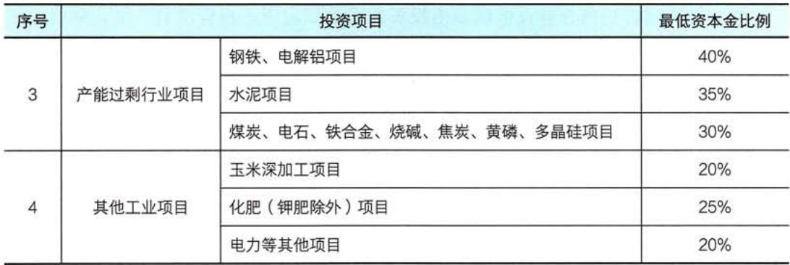

  国家鼓励依法依规筹措重大投资项目资本金。对于基础设施领域和国家鼓励发展的行业，鼓励项目法人和项目投资方通过发行权益型、股权类金融工具，多渠道规范筹措投资项目资本金。通过发行金融工具等方式筹措的各类资金，按照国家统一的会计制度应当分类为权益工具的，可以认定为投资项目资本金，但不得超过资本金总额的50% 。存在下列情形之一的，不得认定为投资项目资本金：  

  （1）存在本息回购承诺、兜底保障等收益附加条件；  
  （2）当期债务性资金偿还前，可以分红或取得收益；  
  （3）在清算时受偿顺序优先于其他债务性资金。  

  地方各级政府及其有关部门可统筹使用本级预算资金、上级补助资金等各类财政资金筹集项目资本金，可按有关规定将政府专项债券作为符合条件的重大项目资本金。

**2. 项目投资审批、核准或备案管理**

  根据《国务院关于投资体制改革的决定》（国发〔2004]20号），按照“谁投资、谁决策、谁收益、谁承担风险”的原则，政府投资项目实行审批制，对于企业不使用政府投资建设的项目，一律不再实行审批制，区别不同情况实行核准制或登记备案制。

**1）政府投资项目的审批制**

  政府投资项目是指在中国境内使用各级政府预算资金进行的固定资产投资项目，包括新建、扩建、改建、技术改造等项目。这类项目主要是社会公益服务、公共基础设施、农业农村、生态环境保护、重大科技进步、社会管理、国家安全等领域的非经营性项目。政府投资资金按项目安排，以直接投资方式为主。对确需支持的经营性项目，政府投资资金主要采取资本金注入方式投入，也可适当采取投资补助、贷款贴息等方式进行引导。  

  （1）对于采用直接投资和资本金注入方式的政府投资项目，政府投资主管部门需从投资决策角度审批项目建议书和可行性研究报告。除特殊情况外，不再审批开工报告，同时应严格政府投资项目的初步设计、概算审批工作。  

  （2）对于采用投资补助、转贷和贷款贴息方式的政府投资项目，政府投资主管部门只审批资金申请报告。  

  《政府投资条例》规定，对经济社会发展、社会公众利益有重大影响或者投资规模较大的政府投资项目，政府投资主管部门或其他有关部门应在中介服务机构评估、公众参与、专家评议、风险评估的基础上作出是否批准的决定。

**2）企业投资项目的核准制或备案制**

  企业投资项目是指企业在中国境内投资建设的固定资产投资项目。事业单位、社会团体等在中国境内投资建设的固定资产投资项目，也适用于企业投资项目的相关规定，但通过政府预算安排的固定资产投资项目除外。对于企业不使用政府投资建设的项目，一律不再实行审批制，区别不同情况实行核准制或登记备案制。  

  （1）企业投资项目核准制。根据《企业投资项目核准和备案管理条例》（中华人民共和国国务院令第673号），关系国家安全、涉及全国重大生产力布局、战略性资源开发和重大公共利益等的企业投资项目实行核准管理。具体项目范围依照国务院批准的《政府核准的投资项目目录》执行。  

  企业办理投资项目核准手续时，仅需向核准机关提交项目申请书，不再经过批准项目建议书、可行性研究报告和开工报告等程序。由国务院核准的项目，应向国务院投资主管部门提交项目申请书。项目申请书应包括下列内容： ① 企业基本情况； ② 项目情况，包括项目名称、建设地点、建设规模、建设内容等； ③ 项目利用资源情况分析及对生态环境的影响分析； ④ 项目对经济和社会的影响分析。由国务院有关部门核准的项目，企业可通过项目所在地省、自治区、直辖市和计划单列市人民政府有关部门转送项目申请书。  

  （2）企业投资项目备案制。根据《企业投资项目核准和备案管理条例》（中华人民共和国国务院令第673号），《政府核准的投资项目目录》外的企业投资项目实行备案管理。企业应根据属地原则，在开工建设前通过项目在线监管平台将下列信息告知备案机关： ① 企业基本情况； ② 项目名称、建设地点、建设规模、建设内容； ③ 项目总投资额； ④ 项目符合产业政策的声明。企业应对备案项目信息的真实性负责。

#### 1.1.2 工程建设实施程序

  工程建设实施程序是指工程项目经审批、核准或备案后，从勘察设计、施工到竣工验收、交付使用整个过程中，各项工作必须遵循的先后次序。工程建设实施程序是工程建设过程客观规律的反映，也是建设工程成功实施的重要保证。投资决策与建设实施程序如图1.1-1所示。

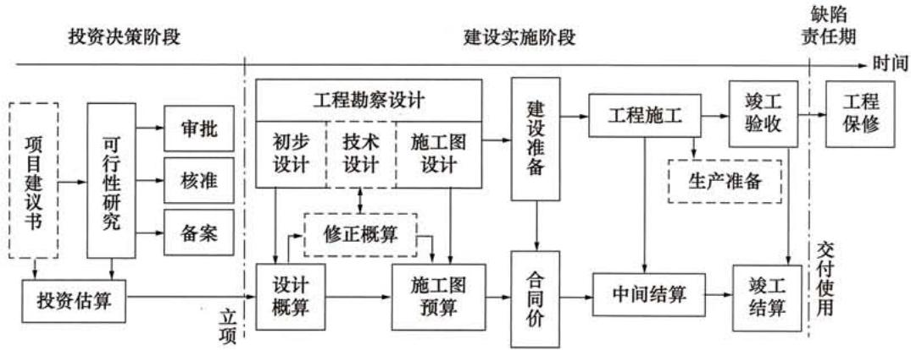

*图1.1-1 投资决策与建设实施程序*

*注：图中虚线框所代表的工作并非所有工程项目必经环节。*

**1. 工程勘察设计**

  工程勘察设计是工程建设实施阶段的首要环节，在工程建设中发挥着龙头作用。工程勘察设计的指导思想和技术水平不仅会影响建设工程质量安全，而且会对建设工程经济效益、社会效益、生态效益产生重大影响。

**1）工程勘察**

  工程勘察是指为满足工程项目可行性研究、设计及施工等需要，对地形、地质及水文等状况进行测绘、勘探、测试及综合评定，并提供相应成果资料的活动。在工程勘察设计阶段进行的勘察活动，主要是为满足工程设计需要而进行的。  

  （1）工程测量。研究工程建设场地的地形地貌特征及既有建筑物、构筑物状况，为工程设计提供准确、可靠的空间数据。  

  （2）岩土地质勘察。研究岩土滑移、活动断裂、地震液化、地面侵蚀、岩溶塌陷及各种复杂地基土等各种对工程建设有直接影响的岩土地质问题，以及由于人类活动所造成的环境地质问题（如地下采空塌陷、边坡挖填失稳、地面沉降等），提出工程设计所需的地质技术参数，并对有关技术经济指标进行评价。  

  （3）水文地质勘察。研究河流或其他水体的水文要素变化和分布规律，预估未来径流情势，以及地下水资源的补给、排泄规律等，为工程设计提供水文依据。

**2）工程设计**

  工程设计是指根据法律法规和工程建设标准，对工程建设所需技术、经济、资源、环境等条件进行综合分析论证，编制工程设计文件的活动。工程设计是确定和控制工程造价的重点阶段，也是协调工程技术与经济关系的关键环节。  

  工程设计一般分为初步设计和施工图设计两个阶段，对于重大工程和技术复杂工程，可根据需要增加技术设计阶段。  

  （1）初步设计。初步设计是指根据国家有关规定和项目可行性研究报告批复文件要求，明确工程建设内容、建设规模、建设标准、用地规模、主要材料、设备规格和技术参数等，设计具体实施方案并编制工程总概算的活动。  

  《政府投资条例》规定，政府投资项目初步设计提出的投资概算超过经批准的可行性研究报告提出的投资估算 10% 的，项目单位应当向投资主管部门或者其他有关部门报告，投资主管部门或者其他有关部门可以要求项目单位重新报送可行性研究报告。  

  （2）技术设计。技术设计是指为解决初步设计未解决的重大技术问题而进行的活动，包括工艺流程、建筑结构、设备选型等问题的解决。技术设计文件中需要包含修正概算。  

  （3）施工图设计。施工图设计是指根据已批准的初步设计或技术设计文件，结合工程现场实际情况，通过绘制施工图，完整地表现建筑物外形、内部空间分割、结构体系、构造状况及建筑群组成和周围环境的配合。施工图设计还包括各种运输、通信、管道系统、建筑设备设计等。在工艺方面，应具体确定各种设备的型号、规格及各种非标准设备的制造加工图。施工图设计还应编制施工图预算，作为工程施工依据。  

  《建设工程质量管理条例》规定，施工图设计文件需经审查批准后方可实施。施工图设计文件未经审查批准的，不得使用。

**2. 建设准备**

  在工程开工建设前，需要切实做好各项准备工作，这些准备工作包括：  

  （1）征地、拆迁和场地平整；  

  （2）完成施工用水、电、通信网络、交通道路等接通工作；  

  （3）准备必要的施工图纸；  

  （4）组织工程监理、施工及材料设备采购招标工作；  

  （5）办理施工许可、工程质量监督等手续。  

  上述建设准备工作主要应由建设单位完成。对于有些工程的施工场地平整，施工用水、电、通信网络、交通道路等接通工作，可纳入工程施工合同交由施工单位承担。在工程总承包模式下，施工图纸的准备也将由工程总承包单位完成。《建设工程质量管理条例》规定，工程质量监督手续可以与施工许可手续合并办理。  

  《中华人民共和国建筑法》规定，建设单位申请领取施工许可证，应当具备下列条件： ① 已经办理该建筑工程用地批准手续； ② 依法应当办理建设工程规划许可证的，已经取得建设工程规划许可证； ③ 需要拆迁的，其拆迁进度符合施工要求； ④ 已经确定建筑施工企业； ⑤ 有满足施工需要的资金安排、施工图纸及技术资料； ⑥ 有保证工程质量和安全的具体措施。

**3. 工程施工**

  建设工程经批准开工建设或取得施工许可证后，即可进入施工阶段。工程开工时间是指该工程设计文件中规定的任何一项永久性工程第一次正式破土开槽开始施工的时间。不需开槽的工程，正式开始打桩的时间就是开工时间。铁路、公路、水库等需要进行大量土石方工程的，以正式开始进行土方、石方工程的时间作为正式开工时间。工程地质勘察、平整场地、既有建筑物拆除、临时建筑、施工用临时道路和水、电等工程开始施工不能算作正式开工。分期建设的工程分别以各期工程开工的时间作为开工时间，如二期工程应根据工程设计文件规定的永久性工程开工时间作为开工时间。  

  工程施工活动应按照工程设计要求、施工合同及施工组织设计，在保证工程工期、质量、成本、安全、绿色等目标的前提下进行。

**4. 生产准备**

  对于直接用于物质生产或为物质生产服务的项目（即生产性项目）而言，生产准备是工程项目交付投产前由建设单位进行的一项重要工作。生产准备是衔接建设与生产的桥梁，是工程建设转入生产经营的必要条件。建设单位需要适时组成专门机构进行生产准备工作，确保工程建成后能及时投产。  

  根据工程项目种类不同，生产准备工作内容会存在差异。但一般应包括以下内容：① 组建生产管理机构，制定生产管理制度； ② 招聘和培训生产人员，组织生产人员参加设备安装、调试和工程验收工作； ③ 落实原材料、协作产品、燃料、水、电、气等来源和其他需协作配合的条件，并组织工装、器具、备品、备件等制造或订货等。

**5. 竣工验收**

  建设工程按设计文件规定内容和工程承包合同约定全部建完，达到工程竣工验收条件时，建设单位便可组织工程竣工验收。工程竣工验收是工程建设实施阶段最后一个环节，是投资成果转人生产或使用的标志，也是全面考核工程建设成果、检验工程质量的重要步骤。工程勘察、设计、施工、监理等单位应参加工程竣工验收。不同专业类别的工程峻工验收有着不同的验收标准和程序。工程峻工验收合格后方可投入使用。  

  建设工程自竣工验收合格之日起即进入缺陷责任期。施工承包单位应在缺陷责任期内对已交付使用的工程质量缺陷承担责任。缺陷责任期最长不超过2年。在缺陷责任期内发现有质量缺陷的，应及时修复，修复和查验费用由责任方承担。缺陷责任期届满时，建设单位应向工程承包单位返还工程施工过程中扣留的工程质量保证金。

#### 1.1.3 施工承包模式

  建设单位可将整个工程施工任务发包给一家综合实力强的施工单位（施工总承包单位）或若干家施工单位组成的施工承包联合体或合作体。当然，施工总承包单位也可经建设单位同意，将其所承包的部分专业工程分包给其他具备条件的施工单位（分包单位）。对于一些规模较大或包含专业类别较多的工程施工，往往会由多家施工单位承包。各家施工单位之间的关系不同，会形成不同的施工承包模式。

**1. 施工总承包模式**

  施工总承包通常是指施工总承包单位对其所承包的工程施工任务的执行和组织负总责。施工总承包单位可以独立完成其所承包的所有施工任务，也可选择若干分包单位完成其所承包工程中的部分专业工程。施工任务有分包的，施工总承包单位需要为分包单位提供和创造必要的施工条件，并组织、指挥和监督分包单位的施工活动。施工总承包合同结构如图1.1-2所示。

**1）施工总承包模式的特点**

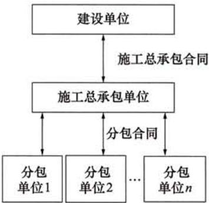

*图1.1-2施工总承包合同结构*

  采用施工总承包模式，施工单位在投标时通常以施工图设计为基础进行报价，在工程开工前即有较为明确  

  的合同价。对于采用总价合同承包的工程，有利于建设单位对工程总造价的早期控制。与平行承包模式相比，施工质量责任主体少，建设单位施工招标与合同管理、组织协调工作量小。

**2）施工总承包模式中的承包方**

  施工总承包模式中的承包方主要是指施工总承包单位和分包单位。在国际工程中，除直接执行工程施工任务的施工总承包单位外，承担施工总承包任务的还可能是施工总承包管理单位（MC，ManagingContractor），即管理型承包商。  

  （1）施工总承包管理单位。施工总承包管理单位负责其所承包施工任务的总体管理和组织协调，具体施工任务可分包给分包单位。对于有施工能力的施工总承包管理单位，也可通过投标竞争承揽部分工程施工任务。  

  施工总承包管理单位与施工总承包单位承担的施工管理任务和责任相同。因此，由业主选定的分包单位都要经施工总承包管理单位认可，否则施工总承包管理单位难以承担施工总体管理及目标控制责任。与施工总承包相比，施工总承包管理具有以下特点：  

  ① 分包合同有不同的签订方式。在通常情况下，分包单位由业主通过招标选择，并由业主与分包单位直接签订合同。但在业主要求且施工总承包管理单位同意的前提下，分包合同也可由施工总承包管理单位与分包单位签订。  

  ② 施工总承包管理单位取费及分包单位工程款支付方式不同。施工总承包管理单位只收取总包管理费，不赚取总包与分包之间的差价。对于各分包单位的工程款，可以通过施工总承包管理单位支付，也可由业主直接支付。显然，通过施工总承包管理单位支付分包工程款时，更有利于施工总承包管理单位对分包单位的管理。  

  ③ 各分包合同界面由施工总承包管理单位负责确定，这样可减轻业主的组织协调工作量。但在业主与分包单位直接签订合同的前提下，业主合同管理工作量大，造价控制风险也较大。  

  ④ 总承包管理单位负责控制分包工程质量，符合工程质量的“他人控制”原则，因而有利于控制工程质量。  

  （2）分包单位。分包单位按分包合同约定，承担其所分包工程的施工任务。无论是业主选定的分包单位，还是由业主授权施工总承包管理单位选定的分包单位，都必须接受施工总承包管理单位的工作指令，服从其组织和指挥。  

  近年来，我国大力倡导和发展工程总承包，即由工程总承包单位按照合同约定，承担工程设计、采购及施工（EPC，Engineering-Procurement-Construction）或设计、施工（DB，Design&Build）等工作，并对承包工程的质量、安全、工期和造价等全面负责。与此相对应，国际上还可采用工程总承包管理模式，即业主将工程设计和施工任务发包给专门从事工程设计和施工组织管理的工程管理公司。这类工程管理公司自己既没有设计力量，也没有施工队伍，而是将其所承接的工程设计和施工任务全部分包给其他设计单位和施工单位，工程管理公司则专心致力于工程项目管理工作。

**2. 平行承包模式**

  平行承包是指建设单位将工程项目划分为若干标段，分别发包给多家施工单位承包。平行承包合同结构如图1.1-3所示，建设单位需要与多家施工单位分别签订施工合同，各施工单位之间的关系是平行的，相互间无合同关系。  

  平行承包模式具有以下特点：  

  （1）有利于建设单位择优选择施工单位。由于合同内容比较单一、合同价值小、风险小，有利于不具备总承包能力的施工单位参与竞争。建设单位可在更大范围内选择施工单位。

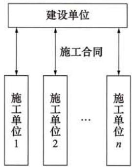

*图1.1-3平行承包合同结构*

  （2）有利于控制工程质量。整个工程经分解后分别发包给各施工单位，合同约束与相互制约使每一部分都能较好地实现其质量要求。如主体工程与装修工程分别由两家施工单位承包，当主体工程不合格时，装修单位不会同意在不合格的主体工程上进行装修，这种他控机制比自控更有约束力。  

  （3）有利于缩短建设工期。由于工程施工任务经分解后平行发包，在工艺技术及场地允许的条件下，多个标段任务并行实施，可缩短整个工程项目工期。  

  （4）组织管理和协调工作量大。由于合同数量多，使工程项目系统中合同界面（结合部）数量增加，需要建设单位具有较强的组织协调能力。  

  （5）工程造价控制难度大。由于招标任务量大，需控制多项合同价格，从而使工程造价控制难度增加。  

  （6）与总承包模式相比，平行承包模式不利于发挥那些技术水平高、综合管理能力强的总承包商综合优势。

**3. 联合体承包模式**

  当工程规模大或技术复杂，建筑市场竞争激烈，由一家施工单位总承包有困难时，可由两家及以上施工单位以联合体形式承揽施工任务，以发挥各施工单位的特长和优势。联合体通常由一家或几家单位发起，经过协商确定各自承担的义务和责任，签署联合体协议，建立联合体组织机构，产生联合体牵头单位（代表），联合体各成员单位共同与建设单位签订施工合同。联合体承包合同结构如图1.1-4所示。  

  联合体承包模式具有以下特点：  

  （1）建设单位合同结构简单，组织协调工作量小，而且有利于工程造价和工期控制。  

  （2）可以集中联合体各成员单位在资金、技术和管理等方面优势，克服一家单位力不能及的困难，不仅有利于增强竞争能力，同时有利于增强抗风险能力。

**4. 合作体承包模式**

  当工程项目包含专业工程类别多、数量大，或专业配套需要时，一家施工单位无力实行施工总承包，而建设单位又希望承包方有一个统一的协调组织时，就可能产生几家单位自愿成立一个合作体，然后以合作体名义与建设单位签订施工承包意向合同（也称基本合同）。达成协议后，各施工单位再分别与建设单位签订施工合同，并在合作体统一计划、指挥和协调下完成施工任务。合作体承包合同结构如图1.1-5所示。

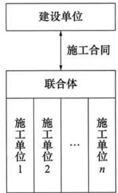

*图1.1-4联合体承包合同结构*

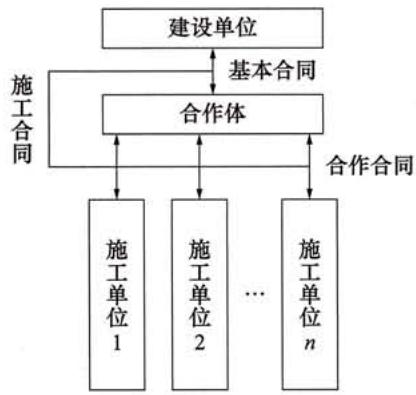

*图1.1-5合作体承包合同结构*

  合作体承包模式具有以下特点：  

  （1）建设单位组织协调工作量小，但风险较大。由于承包单位是一个合作体，各施工单位之间能相互协调，可减少建设单位组织协调工作量。当合作体内某一家施工单位倒闭破产时，其他成员单位及合作体机构不承担其施工合同的经济责任，相应风险将由建设单位承担。  

  （2）各施工单位之间有合作愿望，但又不愿意组成联合体。参加合作体的各成员单位都不具备与整体施工任务相适应的力量，又想利用合作体增强总体实力。他们之间有合作愿望，但又出于自主性要求，或彼此之间信任度不够，未采取联合体捆绑式经营方式。

#### 1.1.4 工程监理

  工程监理是我国工程建设领域实行的一项重要管理制度。根据国家标准《建设工程监理规范》GB/T50319—2013，工程监理是指工程监理单位受建设单位委托，根据法律法规、工程建设标准、勘察设计文件及合同，在施工阶段对建设工程质量、造价、进度进行控制，对合同、信息进行管理，对工程建设相关方关系进行协调，并履行建设工程安全生产管理法定职责的服务活动。由此可见，工程监理不只是“三控两管一协调”，工程监理单位还需依据《建设工程安全生产管理条例》，履行建设工程安全生产管理的法定职责。

**1. 强制实行监理的工程范围**

  《中华人民共和国建筑法》规定：“国家推行建筑工程监理制度。国务院可以规定实行强制监理的建筑工程的范围。”为此，《建设工程质量管理条例》规定，下列建设工程必须实行监理： ① 国家重点建设工程； ② 大中型公用事业工程； ③ 成片开发建设的住宅小区工程； ④ 利用外国政府或者国际组织贷款、援助资金的工程； ⑤ 国家规定必须实行监理的其他工程。  

  《建设工程监理范围和规模标准规定》（中华人民共和国建设部令第86号）又进一步细化了必须实行监理的工程范围和规模标准。

**1）国家重点建设工程**

  国家重点建设工程是指对国民经济和社会发展有重大影响的骨干项目，包括：  

  （1）基础设施、基础产业和支柱产业中的大型项目；  
  （2）高科技并能带动行业技术进步的项目；  
  （3）跨地区并对全国经济发展或者区域经济发展有重大影响的项目；  
  （4）对社会发展有重大影响的项目；  
  （5）其他骨干项目。

**2）大中型公用事业工程**

  大中型公用事业工程是指项目总投资额在3000万元以上的下列工程项目：  

  （1）供水、供电、供气、供热等市政工程项目；  
  （2）科技、教育、文化等项目；  
  （3）体育、旅游、商业等项目；  
  （4）卫生、社会福利等项目；  
  （5）其他公用事业项目。

**3）成片开发建设的住宅小区工程**

  建筑面积在5万 m² 以上的住宅建设工程必须实行监理；5万 m² 以下的住宅建设工程，可以实行监理，具体范围和规模标准由省、自治区、直辖市人民政府建设行政主管部门规定。  

  为了保证住宅质量，对高层住宅及地基、结构复杂的多层住宅应当实行监理。

**4）利用外国政府或者国际组织贷款、援助资金的工程**

  （1）使用世界银行、亚洲开发银行等国际组织贷款资金的项目；  

  （2）使用国外政府及其机构贷款资金的项目；  

  （3）使用国际组织或者国外政府援助资金的项目。

**5）国家规定必须实行监理的其他工程**

  （1）项目总投资额在3000万元以上关系社会公共利益、公众安全的下列基础设施  
  项目：① 煤炭、石油、化工、天然气、电力、新能源等项目；② 铁路、公路、管道、水运、民航以及其他交通运输业等项目；③ 邮政、电信枢纽、通信、信息网络等项目；④ 防洪、灌溉、排涝、发电、引（供）水、滩涂治理、水资源保护、水土保持等  
  水利建设项目；⑤ 道路、桥梁、地铁和轻轨交通、污水排放及处理、垃圾处理、地下管道、公共  
  停车场等城市基础设施项目；⑥ 生态环境保护项目；⑦ 其他基础设施项目。（2）学校、影剧院、体育场馆项目。  

  这就意味着我国大多数建设工程必须实施监理。对于实施监理的工程，在工程监理工作范围内，施工单位与建设单位之间涉及施工合同的联系活动应通过工程监理单位进行。

**2. 项目监理机构人员职责**

  对于实施监理的工程，工程监理单位需要在施工现场派驻项目监理机构。项目监理机构中监理人员通常由总监理工程师、专业监理工程师和监理员组成。根据工程监理工作需要，项目监理机构可设总监理工程师代表。施工单位在履行施工合同过程中，需要接受项目监理机构的监督检查。因此，包括建造师在内的施工单位人员不仅要了解项目监理机构组成，更要了解项目监理机构中各层级监理人员职责。《建设工程监理规范》GB/T50319—2013规定了总监理工程师、总监理工程师代表、专业监理工程师和监理员应履行的基本职责。

**1）总监理工程师职责**

  总监理工程师是由工程监理单位法定代表人书面任命，负责履行建设工程监理合同、主持项目监理机构工作的注册监理工程师。总监理工程师应履行下列职责：  

  （1）确定项目监理机构人员及其岗位职责；  
  （2）组织编制监理规划，审批监理实施细则；  
  （3）根据工程进展及监理工作情况调配监理人员，检查监理人员工作；  
  （4）组织召开监理例会；  
  （5）组织审核分包单位资格；  
  （6）组织审查施工组织设计、（专项）施工方案；  
  （7）审查开复工报审表，签发工程开工令、暂停令和复工令；  
  （8）组织检查施工单位现场质量、安全生产管理体系的建立及运行情况；  
  （9）组织审核施工单位的付款申请，签发工程款支付证书，组织审核竣工结算；  
  （10）组织审查和处理工程变更；  
  （11）调解建设单位与施工单位的合同争议，处理工程索赔；  
  （12）组织验收分部工程，组织审查单位工程质量检验资料；  

  （13）审查施工单位的竣工申请，组织工程竣工预验收，组织编写工程质量评估报告，参与工程竣工验收；  

  （14）参与或配合工程质量安全事故的调查和处理；  
  （15）组织编写监理月报、监理工作总结，组织整理监理文件资料。

**2）总监理工程师代表职责**

  总监理工程师代表是经工程监理单位法定代表人同意，由总监理工程师书面授权，代表总监理工程师行使其部分职责和权力的人员。总监理工程师不得将下列工作委托给总监理工程师代表：  

  （1）组织编制监理规划，审批监理实施细则；（2）根据工程进展及监理工作情况调配监理人员；（3）组织审查施工组织设计、（专项）施工方案；（4）签发工程开工令、暂停令和复工令；（5）签发工程款支付证书，组织审核竣工结算；（6）调解建设单位与施工单位的合同争议，处理工程索赔；（7）审查施工单位的竣工申请，组织工程竣工预验收，组织编写工程质量评估报，参与工程竣工验收；（8）参与或配合工程质量安全事故的调查和处理。

**3）专业监理工程师职责**

  专业监理工程师是由总监理工程师授权，负责实施某一专业或某一岗位的监理工作，有相应监理文件签发权的人员。专业监理工程师应履行下列职责：  

  （1）参与编制监理规划，负责编制监理实施细则；  
  （2）审查施工单位提交的涉及本专业的报审文件，并向总监理工程师报告；  
  （3）参与审核分包单位资格；  
  （4）指导、检查监理员工作，定期向总监理工程师报告本专业监理工作实施情况；  
  （5）检查进场的工程材料、构配件、设备的质量；  
  （6）验收检验批、隐蔽工程、分项工程，参与验收分部工程；  
  （7）处置发现的质量问题和安全事故隐患；  
  （8）进行工程计量；  
  （9）参与工程变更的审查和处理；  
  （10）组织编写监理日志，参与编写监理月报；  
  （11）收集、汇总、参与整理监理文件资料；  
  （12）参与工程竣工预验收和竣工验收。

**4）监理员职责**

  监理员是在专业监理工程师领导下从事工程检查、材料的见证取样、有关数据复核等具体监理工作的人员。监理员应履行下列职责：  

  （1）检查施工单位投入工程的人力、主要设备的使用及运行状况；  

  （2）进行见证取样；  

  （3）复核工程计量有关数据；  

  （4）检查工序施工结果；  

  （5）发现施工作业中的问题，及时指出并向专业监理工程师报告。

**3. 与项目监理机构相关的施工管理工作**

  对于实施监理的工程，施工单位在施工合同履行中与项目监理机构相关的主要工作如下。

**1）施工准备及开工报审**

  （1）参加图纸会审和设计交底会议。施工单位应组织项目团队成员熟悉工程设计文件，并参加建设单位主持召开的图纸会审和设计交底会议。图纸会审和设计交底会议纪要应由项目监理机构负责整理，建设单位、设计单位、施工单位代表及总监理工程师共同签认。  

  （2）报审施工组织设计。施工单位在工程开工前，应将经内部审查通过的施工组织设计报送项目监理机构审查。项目监理机构对施工组织设计的审查包括以下基本内容：  

  ① 编审程序是否符合相关规定；  

  ② 施工进度、施工方案及工程质量保证措施是否符合施工合同要求；  

  ③ 资源（资金、劳动力、材料、设备）供应计划是否满足工程施工需要；  

  ④ 安全技术措施是否符合工程建设强制性标准；  

  ⑤ 施工总平面布置是否科学合理。  

  经项目监理机构审查符合要求的施工组织设计，由总监理工程师签认后将会报送建设单位。  

  （3）施工现场质量安全管理组织机构、制度及人员受检。项目监理机构将会检查施工单位现场的施工质量、安全生产管理组织机构和规章制度建立情况，以及专职管理人员配备和特种作业人员的资格，还要核查施工机械和设施的安全许可验收手续。  

  （4）报送工程开工报审表及相关资料。施工单位做好施工准备后，应向项目监理机构报送工程开工报审表及相关资料申请开工。申请开工的工程具备下列条件的，总监理工程师方可在工程开工报审表签署同意开工的意见并报建设单位批准：  

  ① 设计交底和图纸会审已完成；  

  ② 施工组织设计已由总监理工程师签认；  

  ③ 施工单位现场质量、安全生产管理体系已建立，管理及施工人员已到位，施工机械具备使用条件，主要工程材料已落实；  

  ④ 进场道路及水、电、通信等已满足开工要求。  

  建设单位在工程开工报审表中签署同意开工的意见后，项目监理机构才能发出工程开工令。  

  （5）报审分包单位资格。工程有分包单位的，施工总包单位应将分包单位资格报审表及相关资料报送项目监理机构。项目监理机构将会审查施工分包单位以下内容：  

  ① 营业执照、企业资质等级证书；  

  ② 安全生产许可文件；  

  ③ 类似工程业绩；  

  ④ 专职管理人员和特种作业人员资格。  

  （6）参加第一次工地会议。施工单位应参加由建设单位主持召开的第一次工地会议。在会上，施工单位应介绍派驻现场的组织机构、人员及其职责分工，以及施工准备情况。会议纪要由项目监理机构负责整理，与会各方代表会签。

**2）施工过程中的报审报验**

  （1）施工进度计划报审。施工单位应将其编制的施工总进度计划和阶段性施工进度计划报送项目监理机构审查。项目监理机构将审查施工进度计划以下内容： ① 施工进度计划是否符合施工合同中工期的约定； ② 施工进度计划中主要工程项目有无遗漏，是否满足分批投入试运、分批动用的需要，阶段性施工进度计划是否满足总进度控制目标的要求； ③ 施工顺序的安排是否符合施工工艺要求； ④ 施工人员、工程材料、施工机械等资源供应计划是否满足施工进度计划的需要； ⑤ 施工进度计划是否符合建设单位提供的施工条件（资金、施工图纸、施工场地、物资等）。  

  （2）施工方案或专项施工方案报审。施工单位应将相应分部分项工程开工前编制的施工方案或专项施工方案报送项目监理机构审查。  

  对于施工单位报送的施工方案，项目监理机构的审查内容包括： ① 编审程序是否符合相关规定； ② 工程质量保证措施是否符合有关标准。  

  对于施工单位报送的专项施工方案，项目监理机构的审查内容包括： ① 编审程序是否符合相关规定； ② 安全技术措施是否符合工程建设强制性标准。对达到一定规模危险性较大的分部分项工程的专项施工方案，还要检查是否附具安全验算结果。对涉及深基坑、地下暗挖工程、高大模板工程的专项施工方案，还要检查施工单位组织专家进行论证、审查的情况。  

  （3）“四新”质量报审。施工单位采用新材料、新工艺、新技术、新设备时，应将相应质量认证材料和相关验收标准报送项目监理机构审查。必要时，施工单位还需要组织专题论证，并将专题论证材料一并报送项目监理机构审查。  

  （4）施工控制测量成果及保护措施报审。施工单位应将施工控制测量成果及保护措施报送的项目监理机构检查、复核。项目监理机构将会检查、复核以下内容： ① 施工单位测量人员的资格证书及测量设备鉴定证书； ② 施工平面控制网、高程控制网和临时水准点的测量成果及控制桩的保护措施。  

  （5）试验室报审。施工单位应将为所施工工程提供服务的试验室相关资料报送项目监理机构检查。项目监理机构将检查以下内容： ① 试验室的资质等级及试验范围；② 法定计量部门对试验设备出具的计量检定证明； ③ 试验室管理制度； ④ 试验人员资格证书。  

  （6）材料、构配件、设备质量报验。施工单位应将用于工程的材料、构配件、设备的质量证明文件报送项目监理机构审查。这些质量证明文件包括：出厂合格证、质量检验报告、性能检测报告及施工单位的质量抽检报告等。项目监理机构还将会按照有关规定、工程监理合同约定，对用于工程的材料进行平行检验。  

  （7）工程报验。施工单位应向项目监理机构报验隐蔽工程、检验批、分项工程和分部工程质量。项目监理机构验收其质量，并对质量合格的签署验收意见。  

  （8）提出工程计量及付款申请。施工单位应向项目监理机构提交工程款支付报审表及相应的支持性材料，申请复核实际完成工程量和应支付金额。项目监理机构审查复核后报送建设单位审批。  

  （9）提出工程变更或索赔。施工单位认为有必要进行工程变更的，可向项目监理机构提出工程变更申请。待建设单位同意工程变更后，施工单位应按建设单位和施工单位共同协商会签的工程变更单实施工程变更。  

  施工单位向建设单位索赔费用或要求工程延期，均应通过项目监理机构提出。

**3）工程暂停情形**

  工程施工有下列情形之一的，总监理工程师将会及时签发工程暂停令：  

  （1）建设单位要求暂停施工且工程需要暂停施工的；（2）施工单位未经批准擅自施工或拒绝项目监理机构管理的；（3）施工单位未按审查通过的工程设计文件施工的；（4）施工单位未按批准的施工组织设计、（专项）施工方案施工或违反工程建设强制性标准的；（5）施工存在重大质量、安全事故隐患或发生质量、安全事故的。

**4）竣工报验及结算申请**

  （1）竣工报验。单位工程完工并经自检合格后，施工单位应向项目监理机构提交单位工程竣工验收报审表及竣工资料。项目监理机构组织工程竣工预验收合格后，编写工程质量评估报告并报送建设单位。施工单位代表应参加由建设单位组织的竣工验收，并在工程竣工验收报告中签署意见。  

  （2）竣工结算申请。工程竣工验收合格后，施工单位应向项目监理机构提交竣工结算款支付申请。项目监理机构审核后报送建设单位审批。竣工结算款支付申请经建设单位审批同意后，项目监理机构将向施工单位签发竣工结算款支付证书。

#### 1.1.5 工程质量监督

  《建设工程质量管理条例》明确规定，“国家实行建设工程质量监督管理制度”“建设工程质量监督管理，可以由建设行政主管部门或者其他有关部门委托的建设工程质量监督机构具体实施。”工程实践中，政府监管部门通常会委托专门的工程质量监督机构具体实施工程质量监督管理。  

  受委托的工程质量监督机构应拥有一定数量经考核合格且专业配套的工程质量监督人员，有固定的工作场所和适应工程质量监督检查工作需要的仪器、设备和工具等，有健全的工作制度和管理制度。

**1. 工程质量监督内容**

  工程质量监督主要是指对工程质量责任主体行为和工程实体质量进行的监督检查。

**1）工程质量责任主体行为监督**

  《建设工程质量管理条例》规定，建设单位、勘察单位、设计单位、施工单位、工程监理单位依法对建设工程质量负责。因此，建设单位、勘察单位、设计单位、施工单位、工程监理单位是建设工程质量责任主体。工程质量监督机构需要从以下几方面对建设工程质量责任主体行为进行监督：  

  （1）建设单位、勘察单位、设计单位、施工单位、工程监理单位的质量行为是否符合有关法律法规及工程建设标准规定。  

  （2）建设单位、勘察单位、设计单位、施工单位、工程监理单位的质量管理体系是否健全，质量责任是否得到落实。  

  （3）建设单位、勘察单位、设计单位、施工单位、工程监理单位的主要质量管理人员是否按规定进行了培训并考核合格。  

  （4）工程质量监督手续是否依法办理，工程竣工验收报告等是否按规定备案，竣工验收过程和程序是否符合规定。  

  （5）工程质量事故、投诉举报的调查处理是否符合有关规定，相关质量问题是否按要求整改落实。

**2）工程实体质量监督**

  工程质量责任主体行为最终是由工程实体质量来体现的，而工程质量保证资料又是工程实体质量的验证依据。因此，工程质量监督机构在对工程质量责任主体行为进行监督检查的同时，必须对工程实体质量及工程质量保证资料进行监督检查。  

  （1）工程实体质量抽查。由于工程实体质量涉及专业多、监督工作量大，工程质量监督机构不可能像工程监理单位一样，在施工现场实施全天候监督检查，只能对工程施工中关键工序和重要部位的质量进行监督检查。  

  工程实体质量监督以抽查方式为主，重点检查涉及结构安全和使用功能的实体质量。应对抽查部位进行目测、实测、仪器检测及质量安全保证资料的核查，并做好监督检查记录。对工程质量有质疑的部位，应要求有关单位出具工程质量证明文件，或直接委托有资质的检测机构进行检测。  

  （2）工程质量保证资料核验。核验工程质量保证资料的目的是验证工程实体质量。为此，应将核验工程质量保证资料与抽查工程实体质量同时进行。核验工程质量保证资料时，一方面应检查工程质量保证资料是否及时、准确、完整；另一方面应将工程质量保证资料与工程实体质量进行对照，核查两者是否相符，以此来判断工程质量保证体系的运转是否正常有效，验证工程实体质量是否真实可靠。

**2. 工程质量监督程序**

  工程开工前，建设单位需申请办理工程质量监督手续。工程质量监督机构经审核办理工程质量监督手续后，应安排工程质量监督人员对建设工程施工及竣工验收开展工程质量监督工作。工程质量监督程序如图1.1-6所示。

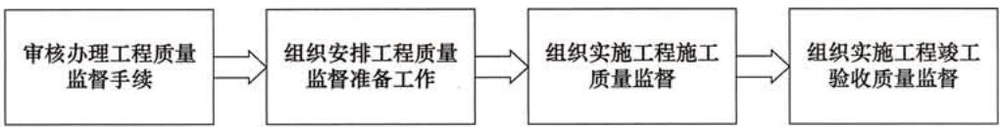

*图1.1-6工程质量监督程序*

**1）审核办理工程质量监督手续**

  工程开工前，建设单位需要到规定的工程质量监督机构办理工程质量监督手续，未按规定办理工程质量监督手续的，一律不得开工。建设单位在申请办理工程质量监督手续时，需提供下列资料：  

  （1）施工图设计文件审查报告和批准书；  
  （2）中标通知书和施工、监理合同；  
  （3）建设单位、施工单位和工程监理单位的项目负责人和机构组成；  
  （4）施工组织设计和监理规划（监理实施细则）；  

  （5）其他需要的文件资料。  

  工程质量监督机构收到工程质量监督申报资料后，对于经审核符合要求的，应办理工程质量监督登记手续，并向建设单位签发工程质量监督文件。不符合要求的，应及时告知建设单位进行补报。

**2）组织安排工程质量监督准备工作**

  （1）成立工程质量监督组，确定质量监督负责人。工程质量监督机构在审核办理工程质量监督手续时，应根据受监督工程的具体情况，成立工程质量监督组，并确定质量监督负责人及职责分工，由工程质量监督组负责实施具体工程的质量监督工作。  

  （2）编制工程质量监督计划，并转发各参建单位。工程质量监督机构应依据工程性质、建设规模、施工组织设计等，针对建设工程特点、关键部位和关键工序，编制工程质量监督计划，并转发各参建单位。工程质量监督计划应包括以下内容： ① 监督人员及联系电话； ② 监督方式； ③ 检查内容； ④ 检查频率； ⑤ 工程参建方配合要求；⑥ 工程质量问题举报方式（包括举报电话、举报地址等）； ⑦ 工程质量监督机构地址及联系电话； ⑧ 其他相关事宜。  

  （3）召开首次监督会议，明确相关职责。在办理工程质量监督手续后、工程开工前，工程质量监督机构应召开建设单位、勘察单位、设计单位、施工单位、工程监理单位等相关责任主体参加的首次监督会议，明确监督程序、监督人员、监督工作纪律、廉政要求和投诉举报受理方式，提出工程建设相关事项发生变化后及时补报等相关工作要求。首次监督会议议题包括： ① 介绍负责工程质量监督负责人和监督工程师； ② 介绍工程质量监督计划； ③ 明确必须监督的重要施工部位和重要环节； ④ 检查工程参建各方提供的有关任命文件（如总监理工程师、施工项目经理、建设单位代表任命书等）；⑤ 宣布监督工作纪律； ⑥ 公布监督举报电话。首次监督会议应形成会议纪要。  

  （4）检查各方主体行为，确认具备开工条件。包括： ① 审查工程参建各方质量保证体系； ② 审查施工组织设计、监理规划和监理实施细则等文件内容及审批手续；③ 核查工程参建各方主要管理人员资格； ④ 检查有关工程质量文件、施工技术资料是否齐全并符合规定。

**3）组织实施工程施工质量监督**

  在工程施工过程中，工程质量监督机构应按以下程序规范实施监督检查。  

  （1）制定年度、季度检查计划。根据工程质量监督计划，结合工程进展情况，制定年度、季度检查计划。每次检查前要进行认真准备，列出检查项目，确定检查内容，明确人员分工，以便有针对性地开展监督检查工作。  

  （2）实施监督检查。监督检查内容主要包括：  

  ① 工程参建各方主体质量行为。工程质量监督机构应加强对施工现场工程参建各方主体质量行为和质量保证体系的监督检查。重点检查工程参建各方资质及人员资格是否符合规定，质量保证体系、质量责任制和管理制度是否健全和有效运行，工程质量控制程序是否正确，工程质量责任人到位情况是否符合规定等。  

  ② 工程实体质量。工程质量监督机构应按工程质量监督计划实施监督检查，对影响主体结构、使用功能和施工安全的部位和关键工序，要加大抽查频率，对隐蔽工程应进行重点抽查。  

  ③ 工程质量保证资料。工程质量监督机构在抽查工程实体质量的同时，应对工程质量保证资料进行抽查，检查工程质量保证资料的完整性、准确性、真实性和及时性。同时，检查工程质量文件资料反映的质量保证措施及质量评定情况是否与工程实体相符。  

  （3）工程质量事故隐患及问题查处。工程质量监督机构发现有影响主体结构、使用功能和施工安全的质量问题和事故隐患时，应及时签发工程质量问题整改通知单，并采取摄影、摄像方式进行现场取证。对于存在严重质量事故隐患或发生质量事故的，应立即责令停工。  

  工程质量监督机构应对检查发现的质量问题、事故隐患或质量事故实行闭环管理，责成责任单位及时整改、复查并上报整改结果。对于停工后经整改符合复工条件的，应及时签发复工通知。  

  （4）投诉举报问题受理及调查。工程质量监督机构要及时受理工程质量问题投诉举报。对有明确投诉举报对象、有具体投诉举报事实且属于工程质量监督业务范围的投诉举报，应及时派专人负责投诉举报调查，查明投诉举报反映问题是否属实，形成调查报告，并将调查结论反馈举报人。  

  对于投诉举报反映问题属实的，工程质量监督机构应责成相关单位采取措施，消除隐患。构成工程质量事故的，应按照事故调查处理有关规定及时上报和处理。

**4）组织实施工程竣工验收质量监督**

  工程质量监督机构应参加建设单位组织的工程竣工验收，并对现场验收的组织形式、验收程序、执行标准规定等进行重点监督，发现有违反验收规定的行为，应责令改正。工程竣工验收工作结束后，工程质量监督机构应出具工程质量监督报告。  

  工程质量监督报告应包括以下主要内容： ① 工程概况； ② 监督工作概况； ③ 工程质量责任主体行为监督检查情况； ④ 工程实体质量抽查情况； ⑤ 投诉举报受理及调查处理情况； ⑥ 相关问题处理整改和事故调查处理情况； ⑦ 行政处罚情况； ⑧ 工程竣工验收情况； ⑨ 工程质量监督意见和建议等。  

  工程质量监督报告必须由工程质量监督负责人签认，经工程质量监督机构负责人审核同意并加盖单位公章后出具。

**3. 工程质量监督工作方式**

  工程质量监督机构的监督检查以抽查为主，实行专项检查与综合检查相结合、工程实体质量检查与工程参建各方主体质量行为检查相结合的方式。

**1）工程实体质量检查**

  （1）随机抽查。按照工程质量监督计划，工程质量监督人员随机抽查关键工点和工序、影响结构安全和使用功能的部位，采用目测、实测、仪器检测等方式检查工程实体质量。  

  （2）委托检测。工程质量监督机构应配备必要的仪器设备，以满足日常检测工作需求。对于一些影响结构安全和使用功能的关键部位，工程质量监督机构可委托具有相应资质的检测单位进行质量检测，并出具规范、科学的检测报告，以增强监督检查的科学性和权威性。

**2）工程质量文件资料核查**

  工程质量监督人员通过核查工程参建各方主体的工程质量文件资料，来分析判断工程质量行为及工程实体质量状况。这些工程质量文件资料有：工程审批手续；建设工程合同文件；企业资质证明文件，人员资格证书；质量保证体系文件及资料；原材料、构配件、设备出厂合格证和检测试验报告；施工组织设计、（专项）施工方案；混凝土及砂浆试验报告；施工原始记录（如打桩记录等）、施工日志；各种测试资料（如土质及压实度、钻孔桩动测资料等）；测量资料；隐蔽工程质量验收记录；监理日志、监理月报、监理通知等。

**3）听取现场人员汇报**

  听取施工现场相关人员关于工程质量控制措施、存在问题及处理意见，以及对分包工程管理等方面的汇报，也是工程质量监督人员的主要工作方式。

**4）进行相关数据分析**

  工程质量监督机构应通过相关数据分析，判断工程质量责任主体行为和工程实体质量。要大力推进工程质量监督管理信息化，融合应用新一代信息技术，全面建设工程质量监督基础数据库，构建工程质量监督管理信息平台，为工程质量监督工作规范、有序、高效开展提供支撑。

### 1.2 施工项目管理组织与项目经理

#### 1.2.1 施工项目管理目标和任务

  施工项目管理也即施工方项目管理，是指施工单位为履行工程施工合同，以施工项目经理责任制为核心，对工程施工全过程进行计划、组织、指挥、协调和控制的系统活动。  

  施工项目管理是基于施工合同所界定工程范围的项目管理，既可以是施工总承包单位承包的完整工程项目管理或某一特定标段的项目管理，也可以是施工分包单位分包的某一专业工程或子项工程项目管理。由此可见，施工方项目管理又可分为施工总承包项目管理和施工分包项目管理。

**1. 施工项目管理目标及其相互关系**

  施工项目管理目标也即施工项目目标，是指施工进度、施工质量、施工成本和施工安全。在绿色低碳发展形势下，绿色施工也成为施工项目目标。施工单位应科学合理地组织施工，并采取有效措施控制施工项目目标。

**1）施工项目目标内涵**

  （1）施工进度目标。施工进度目标是指在施工合同中明确规定的工程完工时间（合同工期）。施工单位应在满足工程质量、施工安全及绿色施工等要求的前提下，以合理的施工成本支出，力求使工程实际完成时间不超过合同工期。  

  （2）施工质量目标。施工质量目标是指有关法律法规、工程建设标准、设计文件及合同对工程安全、适用、经济、美观、绿色等特性的综合要求。施工单位应以合理的施工成本支出和施工进度安排，实现预定的施工质量目标。  

  （3）施工成本目标。施工成本目标是指完成工程施工所需投入的费用。施工单位应在满足工程质量、施工安全、施工进度和绿色施工要求的前提下，力求使实际施工成本不超过预定成本目标。  

  （4）施工安全目标。施工安全目标是指有关法律法规、工程建设标准对施工安全的综合要求。施工单位应严格执行工程建设标准，以合理的施工成本支出和施工进度安排，保障施工安全。  

  （5）绿色施工目标。绿色施工目标是指有关法律法规、工程建设标准对工程施工的绿色要求。施工单位应在保证工程质量、施工安全等基本要求的前提下，通过科学管理和技术进步，最大限度地节约资源和减少对环境的负面影响，实现“四节一环保”（节能、节地、节水、节材和环境保护）。

**2）施工项目目标之间相互关系**

  施工进度、施工质量、施工成本、施工安全及绿色施工五大目标相互影响、相互依存、相互制约，是一个不可分割的整体。在施工项目管理中，必须统筹考虑五大目标，实现整体目标系统最优，避免盲目追求单一目标而冲击或干扰其他目标。  

  （1）五大目标整体相关性。一般而言，五大目标中任何一个目标发生变化，都将会对其他目标产生一定影响。如果提高建设工程的功能要求和质量标准，可提高建设工程安全可靠度，或者降低建设工程运营维护费用，但会在一定程度上增加工程造价和延长工期。如果缩短建设工期，可使建设工程早日投入运营，从而尽早产生一定的经济效益，但需要采取赶工措施，这就增加了施工成本，对工程质量和施工安全也会有一定影响。施工单位可通过建立和完善质量管理体系、职业健康安全管理体系、环境管理体系，或质量、职业健康安全和环保一体化管理体系来保证施工项目管理目标的实现。  

  （2）五大目标最佳匹配性。施工单位必须考虑五大目标之间的最佳匹配，力求达到整体目标最优。有些工程片面追求工期短、成本低，致使工程质量、施工安全、绿色施工措施不到位，引发事故，造成人员伤亡、经济损失和不良社会影响。工程质量、施工安全是施工项目管理的核心，必须在确保工程质量、施工安全的前提下，协调其他目标努力实现。五大目标最佳匹配不应局限于静态，而应随着工程建设需求改变或实际进展情况变化进行必要调整，实现动态最佳匹配。

**2. 施工项目管理任务**

  施工单位作为工程建设的重要参与单位，其项目管理任务包括工程合同管理、施工组织协调、施工目标控制、施工安全管理、施工风险管理、施工信息管理和绿色施工管理。

**1）工程合同管理**

  施工单位作为工程施工承包方，要履行与建设单位签订的施工合同，也可将施工合同中所确定的工程施工、材料设备采购等部分任务委托给其他相关单位来完成，相应的合同有：施工分包合同、材料设备采购合同、运输合同、加工合同、租赁合同、劳务分包合同、保险合同等。因此，施工单位所签订的合同不仅包含施工合同，而且包含与施工单位所承包工程相关的其他合同。这些合同都是施工单位与其他相关单位之间明确责权利关系的具有法律效力的协议文件。  

  工程合同管理是指对上述各类合同的依法订立和履行过程的管理，包括合同文本选择，合同条件协商谈判，合同文件签署；合同履行、检查，变更、索赔及纠纷处理；总结评价等。

**2）施工组织协调**

  施工组织协调作为施工项目管理的基本职能，是一种基本管理技能和艺术，也是实现施工项目管理目标必不可少的方法和手段。在工程施工合同履行过程中，施工单位需要处理和调整众多复杂的组织关系。  

  （1）外部环境协调。包括：与规划、建设、市政、消防、人防、环保、城管等政府管理部门之间的协调；与供水、供电、供热、电信、网络、运输、排水等相关单位的协调；与材料、设备、劳动力和资金等生产要素供应方面的协调；与社区、媒体、相关社会组织协调等。  

  （2）工程参建单位之间协调。从施工单位视角看，工程参建单位之间协调是指：与建设单位、工程监理单位之间的协调；与工程勘察、设计单位之间的协调；与材料设备供应单位、加工单位等的协调；与其他施工单位之间的协调等。  

  （3）施工单位内部协调。主要是指施工单位内部各职能部门之间、职能部门与施工现场项目管理机构之间、施工现场项目管理机构内部各业务部门之间的协调等。

**3）施工目标控制**

  施工目标控制是指施工单位对其所承包工程施工进度、施工质量和施工成本进行的控制。施工目标控制是施工项目管理的核心任务。施工单位派驻施工现场的项目管理机构要按照动态控制原理，在工程施工过程中不断进行检查，并将工程实施状况与计划目标进行比较分析，发现有偏差时采取有效措施加以调节和纠正，从而保证施工项目既定目标的实现。

**4）施工安全管理**

  施工安全管理是施工项目管理的重要任务。施工单位要建立和完善职业健康安全管理体系，制定和实施施工现场安全生产规章制度和教育培训制度，配备专职安全生产管理人员。要保证安全生产条件所需资金投人，特种作业人员须符合相应资格要求，施工机械和设施须经安全许可验收后方可投入使用。对于危险性较大的分部分项工程，须编制专项施工方案并经施工单位技术负责人、总监理工程师签字后实施。

**5）施工风险管理**

  施工风险是指一种客观存在、损失发生具有不确定性的状态。随着工程建设规模日趋巨大、技术日益复杂，工程施工所面临的风险越来越多。为此，需要施工单位建立和实施一套完整的施工风险管理体系，严格执行风险管理程序，在综合分析识别和系统评价施工风险的基础上，采取有效的风险应对策略，避免或减少风险事件造成的损失，保证工程施工顺利进行，更好地实现施工进度、质量和成本目标。

**6）施工信息管理**

  施工信息管理是指对施工项目有关各类信息的收集、加工、整理、存储、传递及应用等一系列工作的总称。施工信息管理的主要任务是及时准确地向施工项目管理机构  

  各部门、各类人员提供相关信息，以便在施工项目实施全过程中进行科学决策和动态控制。施工信息管理是控制施工项目目标的根本保证。施工信息管理工作好坏，将会直接影响施工项目管理成败。只有不断提高信息管理水平，才能更好地进行项目管理。  

  随着大数据、云计算、物联网、区块链、人工智能等新一代信息技术的快速发展，以及建筑信息模型（BuildingInformationModeling，BIM）及地理信息系统（GeographicInformationSystem，GIS）的广泛应用，施工项目管理也会朝着数智化方向发展。

**7）绿色施工管理**

  在绿色发展理念引领下，我国建筑业已由传统施工管理模式逐步向绿色施工管理模式转变。施工单位通过建立绿色施工管理体系，明确企业各部门绿色施工管理职责，并明确施工项目经理是其所负责项目绿色施工管理的第一责任人，负责绿色施工的组织实施和目标实现。在施工组织设计中要单独编制绿色施工方案，并在绿色施工方案实施过程中要有专人进行动态监控和评价，使绿色施工得到持续改进。

#### 1.2.2 施工项目管理组织

  施工项目管理组织是指施工单位派驻施工现场履行施工合同、对施工项目进行全面管理的组织机构，工程实践中通常称为施工项目部或项目经理部。

**1. 施工项目管理组织结构形式**

  施工项目管理组织结构形式应根据施工项目规模、专业特点、地理位置及施工单位内部管理模式等因素确定。常见的施工项目管理组织结构形式如下。

**1）直线式组织结构**

  直线式组织结构是一种最简单的组织结构形式。在这种组织结构中，各种职位均按直线垂直排列，项目经理直接进行单线垂直领导。直线式组织结构如图1.2-1所示。

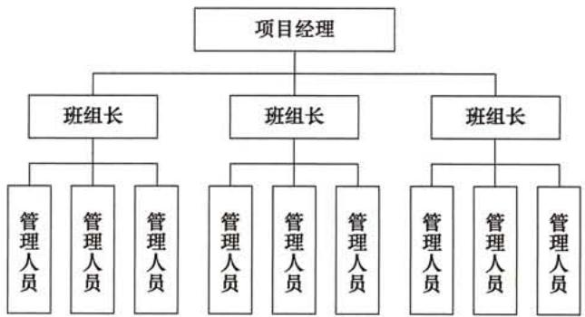

*图1.2-1直线式组织结构*

  直线式组织结构的主要优点是结构简单、权力集中、易于统一指挥、隶属关系明确、职责分明、决策迅速。但由于未设置职能部门，项目经理没有参谋和助手，需要其通晓各种业务，成为“全能式”人才。无法实现管理工作专业化，不利于提高项目管理水平。

**2）职能式组织结构**

  职能式组织结构是在各管理层设置职能部门，各职能部门分别从其业务职能角度对下级执行者进行业务管理。在职能式组织结构中，各级领导不直接指挥下级，而是指挥职能部门。各职能部门可以在上级领导授权范围内，就其所管辖业务范围向下级执行者发布命令和指示。职能式组织结构如图1.2-2所示。

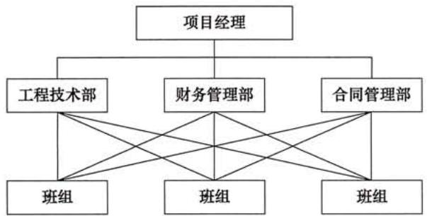

*图1.2-2职能式组织结构*

  职能式组织结构的主要优点是强调管理业务专门化，注意发挥各类专家在项目管理中的作用。由于管理人员业务工作专业化，易于提高工作质量，同时可以减轻领导者负担。但是，由于这种组织结构存在多头领导，使下级执行者接受多方指令，容易造成职责不清。

**3）直线职能式组织结构**

  直线职能式组织结构吸收直线式组织结构和职能式组织结构的优点而形成。与职能式组织结构相同的是，在各管理层设置职能部门，但职能部门只作为相应层级领导的参谋，在其所管辖业务范围内实施管理，不直接指挥下级，与下一层级职能部门构成业务指导关系。职能部门的指令，必须经过同层级领导的批准才能下达。各管理层级之间按直线式组织结构原理构成直接上下级关系。直线职能式组织结构如图1.2-3所示。

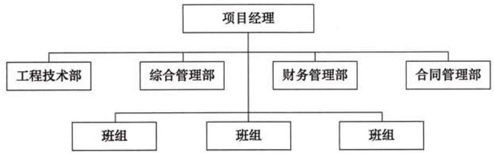

*图1.2-3直线职能式组织结构*

  直线职能式组织结构既保持了直线式组织结构统一指挥的特点，又满足了职能式组织结构对管理工作专业化分工的要求。其主要优点是集中领导、职责清楚，有利于提高管理效率。但这种组织结构中各职能部门之间的横向联系差，信息传递路线长，职能部门与指挥者之间容易产生矛盾。

**4）矩阵式组织结构**

  矩阵式组织结构是依照矩阵方式，将按职能划分的部门与按工程项目设立的管理机构有机结合起来的一种组织结构形式。这种组织结构以工程项目为对象设置，各项目管理机构的管理人员从各职能部门临时抽调，归项目经理统一管理，待工程完工交付使用后又回到原职能部门或到其他工程项目管理组织工作。矩阵式组织结构如图1.2-4所示。

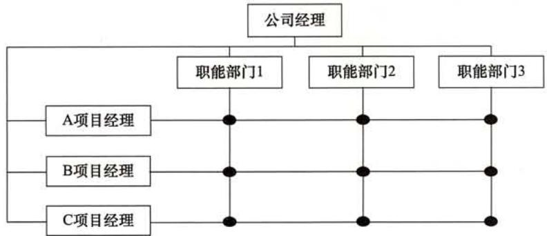

*图1.2-4矩阵式组织结构*

  矩阵式组织结构的优点是能够根据工程任务的实际情况灵活组建与之相适应的项目管理机构，实现集权与分权的最优结合，有利于调动各类人员的工作积极性，使项目管理工作顺利进行。但矩阵式组织结构的稳定性较差，尤其是业务人员的工作岗位调动频繁。此外，矩阵中每一位成员同时受项目经理和职能部门经理的双重领导，如果处理不当，会造成矛盾，产生扯皮现象。  

  按照项目经理的权限不同，矩阵式组织结构又可分为三种形式：强矩阵式组织、中矩阵式组织和弱矩阵式组织。

**（1）强矩阵式组织**

  强矩阵式组织中，项目经理由企业最高领导任命，并全权负责项目。项目经理直接向企业最高领导负责，项目组成员绩效完全由项目经理进行考核，项目组成员只对项目经理负责。强矩阵式组织结构如图1.2-5所示。

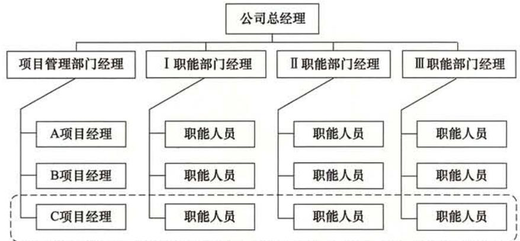

*图1.2-5强矩阵式组织结构*

  强矩阵式组织结构的特点是拥有专职的、具有较大权限的项目经理及专职项目管理人员。强矩阵式组织结构适用于技术复杂且时间紧迫的工程项目。对于技术复杂的工程项目，各职能部门之间的技术界面比较繁杂，采用强矩阵式组织结构有利于加强各职能部门之间的协调配合。  

  （2）中矩阵式组织  

  中矩阵式组织也称平衡矩阵式组织。在平衡矩阵式组织结构中，项目经理被授予一定权力，对项目整体及项目目标负责。项目组成员是从各职能部门抽调而来，并在成员中指定一人担任项目主任。一旦项目结束，项目主任的头衔随之消失。平衡矩阵式组织结构如图1.2-6所示。  

  平衡矩阵式组织结构的特点是需要精心建立管理程序和配备训练有素的协调人员。平衡矩阵制组织结构适用于中等技术复杂程度且建设周期较长的工程项目。

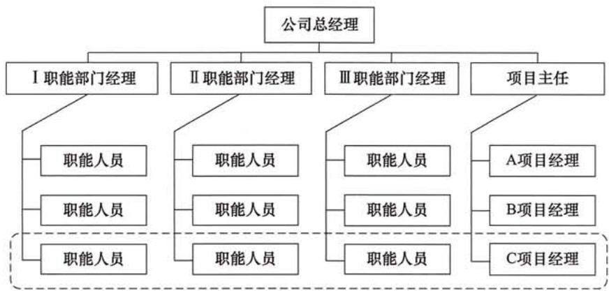

*图1.2-6平衡矩阵式组织结构*

  （3）弱矩阵式组织  

  弱矩阵式组织中，并未明确对项目目标负责的项目经理。即使有项目负责人，其角色也只是一个项目协调者或监督者，而不是一个管理者。同时，员工绩效由职能部门经理进行考核。弱矩阵式组织结构如图1.2-7所示。

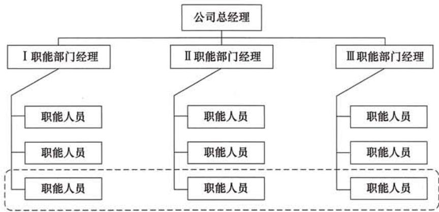

*图1.2-7弱矩阵式组织结构*

  弱矩阵式组织结构的特点是项目负责人的权限很小。弱矩阵式组织结构适用于技术简单的工程项目，因为这样的工程项目技术界面明晰或简单，跨职能部门的协调工作比较容易。

**2. 责任矩阵**

  将施工项目管理的每一项任务分配到人、职责落实到位是施工项目管理的重要环节。责任矩阵（ResponsibilityMatrix）作为项目管理的重要工具，强调每一项工作需要由谁负责，并表明每个人在整个项目中的角色地位。通过编制责任矩阵，可以清楚地表示每一个成员在项目实施过程中所承担的责任。

**1）责任矩阵的编制**

  施工项目部编制责任矩阵，可按下列程序进行：  

  （1）列出需要完成的项目管理任务。  

  （2）列出参与项目管理及负责执行项目任务的个人或职能部门名称。  

  （3）以项目管理任务为行，以执行任务的个人或部门为列，画出纵横交叉的责任矩阵图。  

  （4）在责任矩阵图的行与列交叉窗口中，用不同字母或符号表示项目管理任务与执行者的责任关系，从而建立“人”与“事”的关联。任务执行者在项目管理中通常有三种角色： ① 负责人P（Principal）； ② 支持者或参与者S（Support）； ③ 审查者R（Review）。  

  （5）检查各职能部门或人员的项目管理任务分配是否均衡适当。有过度分配或者分配不当的，则需要进行调整和优化。  

  施工项目部主要管理责任矩阵示例见表1.2-1。

*表1.2-1施工项目部主要管理责任矩阵示例*

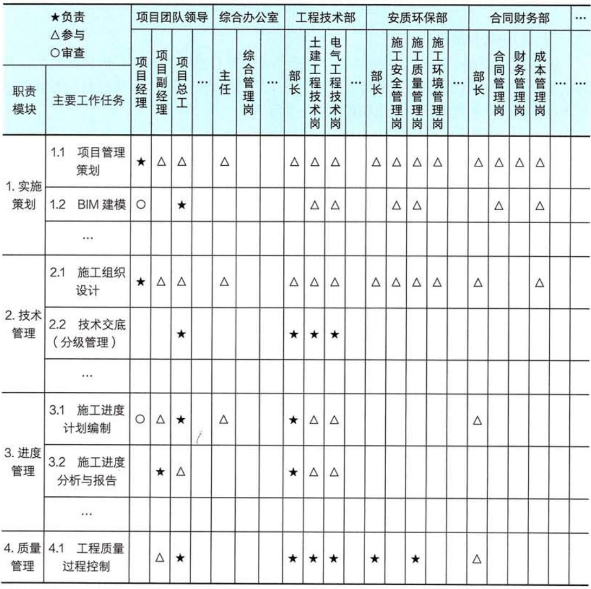

*续表*

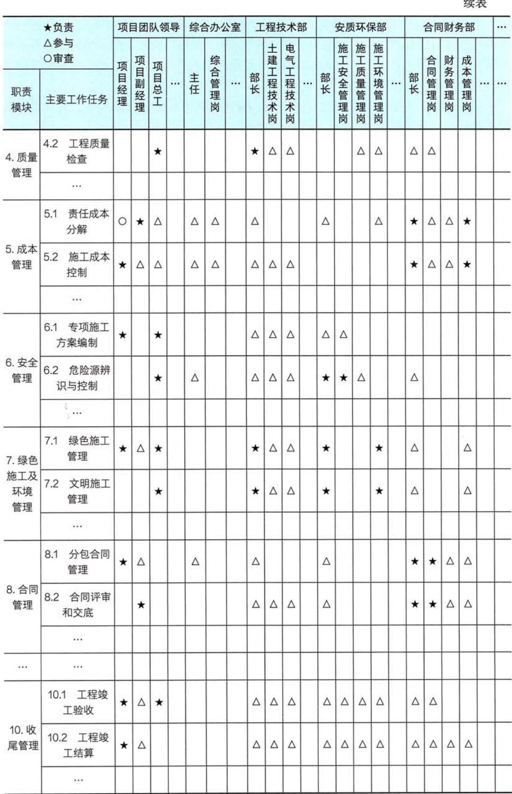

**2）责任矩阵的作用**

  责任矩阵可以非常方便地进行责任检查：横向检查可以确保每项工作有人负责；纵向检查可以确保每个人至少负责一件“事”。基于管理活动的工作量估算，还可从横向统计每个活动的总工作量，从纵向统计每个角色投入的总工作量。施工项目管理中运用责任矩阵主要有以下作用：  

  （1）将施工项目管理的具体任务分配、落实到相关职能部门或人员，使施工项目部人员分工一目了然。  

  （2）清楚地显示出施工项目部各部门或个人的角色、职责和相互关系，避免职责不清而出现推诿、扯皮现象。  

  （3）有利于项目经理从总体上分析管理任务的分配是否平衡适当，以便进行必要的调整和优化，确保最适合的人员去做最适当的事情，从而提高项目管理工作效率。

#### 1.2.3 施工项目经理职责和权限

  施工项目经理是指具备相应任职条件，由企业法定代表人授权对施工项目进行全面管理的责任人。《标准施工招标文件》通用合同条款规定，承包人应按合同约定指派项目经理，并在约定的期限内到职。承包人更换项目经理应事先征得建设单位同意，并应在更换14天前通知发包人和监理人。承包人项目经理短期离开施工场地，应事先征得监理人同意，并委派代表代行其职责。  

  根据中国建筑业协会制定的团体标准《建设工程施工项目经理岗位职业标准》T/CCIAT0010一2019，施工项目经理应具备以下条件：  

  （1）具有工程建设类相应职业资格，并应取得安全生产考核合格证书。  

  （2）具有良好的身体素质，恪守职业道德，诚实守信，不得有不良行为记录。  

  （3）具有建设工程施工现场管理经验和项目管理业绩，并应具备下列专业知识和能力： ① 施工项目管理范围内的工程技术、管理、经济、法律法规及信息化知识；② 施工项目实施策划和分析解决问题的能力； ③ 施工项目目标管理及过程控制的能力； ④ 组织、指挥、协调与沟通能力。

**1. 施工项目经理职责**

  《建设工程施工项目经理岗位职业标准》T/CCIAT0010一2019规定，项目经理应履行但不限于下列职责：  

  （1）依据企业规定组建项目经理部，组织制定项目管理岗位职责，明确项目团队成员职责分工。  

  （2）执行企业各项规章制度，组织制定和执行施工现场项目管理制度。  

  （3）组织项目团队成员进行施工合同交底和项目管理目标责任分解。  

  （4）在授权范围内组织编制和落实施工组织设计、项目管理实施规划、施工进度计划、绿色施工及环境保护措施、质量安全技术措施、施工方案和专项施工方案。  

  （5）在授权范围内进行项目管理指标分解，优化项目资源配置，协调施工现场人力资源安排，并对工程材料、构配件、施工机具设备等资源的质量和安全使用进行全程监控。  

  （6）组织项目团队成员进行经济活动分析，进行施工成本目标分解和成本计划编  

  制，制定和实施施工成本控制措施。  

  （7）建立健全协调工作机制，主持工地例会，协调解决工程施工问题。  

  （8）依据施工合同配合企业或受企业委托选择分包单位，组织审核分包工程款支付申请。  

  （9）组织与建设单位、分包单位、供应单位之间的结算工作，在授权范围内签署结算文件。  

  （10）建立和完善工程档案文件管理制度，规范工程资料管理及存档程序，及时组织汇总工程结算和竣工资料，参与工程竣工验收。  

  （11）组织进行缺陷责任期工程保修工作，组织项目管理工作总结。  

  《标准施工招标文件》通用合同条款规定，承包人项目经理可以授权其下属人员履行其某项职责，但事先应将这些人员的姓名和授权范围通知监理人。

**2. 施工项目经理权限**

  《建设工程施工项目经理岗位职业标准》T/CCIAT0010一2019规定，项目经理应具有但不限于下列权限：  

  （1）参与项目投标及施工合同签订。（2）参与组建项目经理部，提名项目副经理、项目技术负责人，选用项目团队成员。（3）主持项目经理部工作，组织制定项目经理部管理制度。（4）决定企业授权范围内的资源投入和使用。（5）参与分包合同和供货合同签订。（6）在授权范围内直接与项目相关方进行沟通。（7）根据企业考核评价办法组织项目团队成员绩效考核评价，按企业薪酬制度拟定项目团队成员绩效工资分配方案，提出不称职管理人员解聘建议。

### 1.3 施工组织设计与项目目标动态控制

#### 1.3.1 施工项目实施策划

  施工单位投标项目中标后，需要在施工调查基础上，进行施工项目实施策划。施工项目实施策划是施工项目标准化管理和精细化管理的重要表现，不仅为标后施工组织设计编制提供参考，而且为施工项目目标控制和项目管理绩效考核提供依据。

**1. 策划准备工作**

**1）成立策划领导小组，移交资料和交底**

  施工单位一旦接到中标通知书，应马上成立策划领导小组。领导小组组长由企业主管生产副总经理或技术负责人担任，有关职能部门负责人、施工项目经理及技术负责人作为策划领导小组成员。企业经营开发部门应及时将下列文件资料移交给工程管理部门： ① 中标通知书； ② 招标文件； ③ 投标文件； ④ 报价资料； ⑤ 标前调查资料；⑥ 其他相关资料。同时，企业经营开发部门应向工程管理、工程经济等部门进行书面交底。交底内容包括：建设单位情况、施工现场情况、投标过程、不平衡报价实施情况、工程变更索赔方向、相关资源情况等。

**2）编制施工调查提纲，组织进行施工调查**

  企业工程管理部门应负责编制施工调查提纲，并组织有关人员进行施工调查。施工调查包括以下主要内容：  

  （1）了解设计概况、主要技术条件、设计原则。在此基础上，通过现场调查，核对设计文件与现场实际是否相符，检查设计方面是否存在问题。  

  （2）了解工程概况、重点工程结构类型、施工方案和技术特点。  

  （3）主要工程分布情况、地形、地貌和地上、地下建筑物、地面附着物情况。调查既有设备及地下管线状况。  

  （4）调查当地交通条件，调查临时用地、施工便道、便桥，工程用水、用电、通信，材料厂、搅拌站、预制场等大型临时设施设置条件。  

  （5）调查各种工程材料（包括商品混凝土）的单价、运距、质量、供应量，调查各种运输方式、运输能力及价格，提出材料设备供应及火工品库设置意见。  

  （6）调查当地能源、通信、电力供应能力，生活、生产用水条件。  

  （7）调查气象及地质、水文资料，提出对施工的影响。气象资料调查包括当地降雨量、降雪量、常年气温变化情况；地质资料调查包括施工地段的地质结构、软土、冻土、地下水位及山体滑坡特性等；水文资料调查包括当地河水的流速和流量、最高和最低水位、常年水位，汛期、枯水期的时间和特点，通航情况。  

  （8）了解当地政府有关征（租）土地、拆迁政策和规定。  

  （9）调查当地民风民俗、社会环境、治安状况、卫生防疫、环境保护和文物保护等情况。

**2. 进行项目实施策划**

**1）主要策划内容**

  （1）确定项目管理目标、施工任务划分、组织机构建立、施工组织总体安排等事项，提出重难点工程施工方案、大型临时设施建设方案和标准，进行施工队伍部署、主要资源配置等。  

  （2）对临时工程管理、施工组织方案、施工进度管理、施工安全质量及环境管理、施工成本管理、施工机械管理、工程物资管理、工程测量管理、试验检测管理、劳务队伍管理、技术开发与管理、企业文化建设等提出要求。

**2）策划职责分工**

  建筑企业主要职能部门可按以下职责分工进行项目实施策划：  

  （1）工程管理部门负责策划的内容： ① 明确项目管理模式及施工任务划分； ② 提出工期控制目标及施工组织总体安排意见； ③ 提出重大施工技术方案初步意见； ④ 确定实施性施工组织设计和重大施工技术方案的分级管理内容及要求； ⑤ 确定临时工程标准和管理要求； ⑥ 确定工程测量管理方案； ⑦ 提出试验室设置意见及试验检测管理方案； ⑧ 提出工程施工分包管理要求。  

  （2）人力资源管理部门负责策划的内容： ① 确定施工项目组织机构核心管理人员及其职责、权限； ② 提出项目培训工作管理要求； ③ 提出劳务队伍准入管理要求。  

  （3）安全、质量、环保管理部门负责策划的内容： ① 明确安全、质量、绿色施工及环保管理目标； ② 提出施工安全、质量及绿色施工管理重点事项和管理要求； ③ 提出专项施工方案初步意见； ④ 明确应急预案编制及管理要求。  

  （4）财务管理部门负责策划的内容： ① 提出项目效益目标、增收创效目标； ② 明确施工成本管理的重点工作事项； ③ 提出施工成本管理绩效考核要求； ④ 提出工程投保管理要求。  

  （5）施工机械管理部门负责策划的内容： ① 确定施工机械设备配置方案； ② 提出施工机械设备采购、租赁及管理要求。  

  （6）工程物资管理部门负责策划的内容：明确工程物资采购供应方案、管理职责划分及物资管理工作要求。  

  （7）技术管理部门负责策划的内容： ① 提出项目科技研发初步计划和管理要求；② 明确技术管理工作要求。  

  （8）文化建设管理部门负责策划的内容： ① 提出标准化工地策划、现场文明施工及驻地建设的意见； ② 提出项目文化建设管理要求。

**3. 编制项目实施策划书**

  建筑企业有关职能部门按照职责分工进行项目实施策划后，应由工程管理部门汇总编制项目实施策划书。项目实施策划书应包括以下主要内容：  

  （1）工程概况。包括：工程水文地质情况；工程分布；重点工程情况；施工特点  
  和重难点；工程数量等。（2）施工项目管理目标及管理要求。包括：工期目标、质量目标、成本及效益目  
  标、安全目标、绿色施工及环境保护目标等，以及相应管理要求。（3）施工项目管理机构设置。（4）施工任务划分及队伍部署。包括：各施工段任务范围、主要工程数量、施工  
  队伍部署及施工内容等。（5）施工组织设计及主要施工方案建议。包括：施工组织指导意见、主要施工方  
  案、技术管理重点、主要施工技术手段等。（6）临时工程。包括：临时工程的初步方案、标准、管理要求等。（7）主要资源调配。包括：主要人力资源和主要机械设备配置及到场时间。（8）物资采购与供应。包括：物资料源情况、物资管理机构及其职责、物资采购  
  供应方案等。（9）工程试验检测安排。包括：主要试验检测机构设立、试验检测方案等。（10）工程测量管理方案。（11）施工项目科技研发计划和工作安排。

#### 1.3.2 施工组织设计

  施工组织设计是施工项目管理的重要手段，也是科学合理、均衡有序地组织施工生产的重要保障。每一工程项目均需要进行施工组织设计。设计单位要编制指导性施工组织设计，施工单位要编制实施性施工组织设计。对施工单位而言，施工投标时要编制标前施工组织设计，并依此进行投标报价；中标后要编制标后施工组织设计，进一步细化有关内容，以便于更好地指导工程施工。施工组织设计对于工程施工有着重要的规划、组织、协调和指导作用。  

  施工组织设计的编制依据有： ① 工程建设有关法律法规及政策； ② 工程建设标准和技术经济指标； ③ 工程设计文件； ④ 工程招标投标文件或施工合同文件； ⑤ 工程现场条件，工程地质及水文地质、气象等自然条件； ⑥ 与工程有关的资源供应情况；⑦ 施工单位的生产能力、机具设备状况及技术水平等。  

  按编制对象不同，施工组织设计可分为三个层次：施工组织总设计、单位工程施工组织设计和施工方案。

**1. 施工组织总设计**

  施工组织总设计是指以若干单位工程组成的群体工程或特大型工程项目为主要对象编制的施工组织设计。施工组织总设计对整个工程项目施工过程起着统筹规划、重点控制的作用。  

  施工组织总设计的基本内容包括：工程概况、总体施工部署、施工总进度计划、总体施工准备与主要资源配置计划、主要施工方法和施工总平面布置等。

**1）工程概况**

  工程概况应包括工程项目主要情况和主要施工条件。  

  （1）工程项目主要情况。包括：工程项目名称、性质、地理位置和建设规模；建设、勘察、设计、监理等相关单位情况；工程项目设计概况；工程项目承包范围及主要分包工程范围；招标文件或施工合同对工程施工的重点要求等。  

  （2）工程项目主要施工条件。包括：建设地点气象状况；施工区域地形和工程水文地质状况；施工区域地上、地下管线及相邻的地上、地下建（构）筑物情况；与工程施工有关的道路、河流等状况；当地建筑材料、设备供应和交通运输等服务能力状况；当地供水、供电、供热和通信能力状况等。

**2）总体施工部署**

  施工组织总设计应对工程施工作出下列总体部署：  

  （1）确定工程项目施工总目标，包括：施工进度、质量、成本、安全、绿色施工及环境管理目标。  

  （2）根据工程项目施工总目标要求，确定工程项目分阶段（期）交付使用计划。  

  （3）确定工程项目分阶段（期）施工的合理顺序和空间组织。  

  应对工程项目施工的重点和难点进行简要分析。对于工程项目施工中开发和使用的新技术、新工艺也应作出部署，并采取可行的技术、管理措施来满足工期、质量等要求。  

  应根据施工项目规模、复杂程度、专业特点、人员素质和地域范围确定项目管理组织结构形式，并采用框图形式表示。工程需要分包的，还应对分包单位的资质和能力提出明确要求。

**3）施工总进度计划**

  施工总进度计划是根据总体施工部署要求，用来确定各单位工程施工顺序、施工时间及相互衔接关系的计划。施工总进度计划可按以下程序编制：  

  （1）计算工程量。分别计算各单位工程主要实物工程量，以便选择施工方案和施工机械，组织主要工种工程的流水施工，计算劳动量、施工机械及建筑材料需要量。  

  （2）确定各单位工程施工期限。各单位工程施工期限应根据合同工期确定，同时应考虑建筑类型、结构特征、施工方法、施工管理水平、施工机械化程度及施工现场条件等因素。  

  （3）确定各单位工程的开竣工时间和相互搭接关系。确定各单位工程的开竣工时间和相互搭接关系应考虑以下主要因素：  

  ① 同一时期施工的项目不宜过多，以避免人力、物力过于分散。  

  ② 尽量做到均衡施工，使劳动力、施工机械和主要材料的供应在整个工期范围内达到均衡。  

  ③ 尽量提前建设可供工程施工使用的永久性工程，以节省临时工程费用。  

  ④ 急需和关键的工程先施工，以保证工程项目如期交工。对于某些技术复杂、施工周期较长、施工困难较多的工程，也应安排提前施工，以利于整个工程项目按期交付使用。  

  ⑤ 施工顺序必须与主要生产系统投人生产的先后次序相吻合。同时，还要安排好配套工程的施工时间，以保证建成的工程能迅速投入生产或交付使用。  

  ⑥ 应注意季节对施工顺序的影响，避免施工受季节影响而导致工期拖延、工程质量安全受影响。尽可能减少冬期、雨期施工的附加费用。  

  ⑦ 安排一部分附属工程或零星项目作为后备项目，用以调整主要项目的施工进度。  

  ⑧ 保证主要工种和主要施工机械能连续施工。  

  （4）编制初步施工总进度计划。施工总进度计划应以工程量大、工期长的单位工程为主导，安排全工地性流水作业。施工总进度计划既可采用横道图表示，也可采用网络图表示，并附必要说明。施工总进度计划宜优先采用网络计划。  

  初步施工总进度计划编制完成后，要检查总工期是否符合招标文件或施工合同要求，资源使用是否均衡且资源供应能否得到保证。如果不符合要求，则需对初步施工总进度计划进行调整。  

  （5）形成正式的施工总进度计划。初步施工总进度计划符合要求或经调整符合要求后，即形成正式的施工总进度计划。

**4）总体施工准备与主要资源配置计划**

  （1）总体施工准备。包括：技术准备、现场准备和资金准备等。这些准备应满足项目分阶段（期）施工需要。  

  ① 技术准备。包括：施工过程所需技术资料准备、施工方案编制计划、试验检验及设备调试工作计划等。  

  ② 现场准备。包括：现场生产、生活等临时设施，临时道路，材料堆放场，临时用水、用电和供热、供气等计划。  

  ③ 资金准备。应根据施工总进度计划编制资金使用计划。  

  （2）主要资源配置计划。包括：劳动力配置计划和物资配置计划。  

  ① 劳动力配置计划。劳动力配置计划应包括下列内容：确定各施工阶段（期）总用工量；根据施工总进度计划确定各施工阶段（期）劳动力配置计划。  

  ② 物资配置计划。物资配置计划应包括下列内容：根据施工总进度计划确定主要工程材料和设备的配置计划；根据总体施工部署和施工总进度计划确定主要施工周转材料和施工机具配置计划。

**5）主要施工方法**

  为了进行技术和资源准备，同时也是为了施工现场的合理布置，对于工程量大、施工难度大、工期长，对整个工程项目的完成起关键作用的建（构）筑物及影响全局的分部分项工程，要在施工组织总设计中简要说明其施工方法。此外，对脚手架工程、起重吊装工程、临时用水用电工程、季节性施工等专项工程所采用的施工方法也应进行简要说明。对施工方法的确定，要兼顾工艺技术的先进性、可操作性及经济合理性。

**6）施工总平面布置**

  施工总平面布置是指在施工用地范围内，对各项生产、生活设施及其他辅助设施等进行总体规划和布置。施工总平面布置应按照工程项目分期（分批）施工计划进行，并绘制施工总平面布置图。施工总平面布置图应有比例关系，各种临时设施应标注外围尺寸，并有文字说明。  

  （1）施工总平面布置原则。 ① 平面布置科学合理，施工场地占用面积少； ② 合理组织运输，减少二次搬运； ③ 施工区域划分和场地临时占用应符合总体施工部署和施工流程要求，减少相互干扰； ④ 充分利用既有建（构）筑物和既有设施为工程施工服务，降低临时设施建造费用； ⑤ 临时设施应方便生产、生活，办公区、生活区和生产区宜分离设置； ⑥ 符合节能、环保、安全和消防等要求； ⑦ 遵守工程所在地政府建设主管部门和建设单位关于施工现场安全文明施工的相关规定。  

  （2）施工总平面布置图内容。 ① 施工用地范围内的地形状况； ② 全部拟建的建（构）筑物和其他基础设施位置； ③ 施工用地范围内的加工设施、运输设施、存贮设施、供电设施、供水供热设施、排水排污设施、临时施工道路和办公、生活用房等；④ 施工现场必备的安全、消防、保卫和环境保护等设施； ⑤ 相邻地上、地下既有建（构）筑物及相关环境。

**2. 单位工程施工组织设计**

  单位工程施工组织设计是指以单位（子单位）工程为主要对象编制的施工组织设计。单位工程施工组织设计是对施工组织总设计的进一步具体化，直接指导单位工程的施工管理和技术经济活动，对单位（子单位）工程的施工过程起着指导和制约作用。  

  单位工程施工组织设计的内容包括：工程概况、施工部署、施工进度计划、施工准备与资源配置计划、主要施工方案、施工现场平面布置等。

**1）工程概况**

  工程概况包括：工程主要情况、各专业设计简介和工程施工条件等。  

  （1）工程主要情况。包括： ① 工程名称、性质和地理位置； ② 建设、勘察、设计、监理和总承包等相关单位情况； ③ 工程承包范围和分包工程范围； ④ 施工合同文件、招标文件或总承包单位对工程施工的重点要求等。  

  （2）各专业设计简介。依据建设单位提供的工程设计文件描述建筑、结构、设备等各专业设计内容及其对工程施工的基本要求。  

  （3）工程施工条件。与施工组织总设计所列内容类似。

**2）施工部署**

  施工部署是指对工程施工过程进行的统筹规划和全面安排，包括工程项目施工目标、进度安排及空间组织、施工组织安排等。施工部署是施工组织设计的纲领性内容，施工进度计划、施工准备与资源配置计划、施工方法、施工现场平面布置和主要施工管理计划等均应围绕施工部署进行编制和确定。  

  （1）工程项目施工目标。应根据施工合同文件、招标文件及施工单位自身对工程管理目标的要求确定，包括：施工进度、质量、成本、安全、绿色施工及环境管理目标。各项目标应满足施工组织总设计中确定的总体目标。  

  （2）进度安排及空间组织。施工部署中的进度安排和空间组织应符合下列要求：① 应明确说明工程主要施工内容及进度安排，施工顺序应符合工序逻辑关系； ② 施工流水段应结合工程具体情况分阶段进行合理划分，并说明划分依据及流水方向，确保均衡流水施工。  

  （3）施工重点和难点分析。包括组织管理和施工技术两个方面。  

  （4）工程管理组织结构形式。根据工程项目规模、复杂程度、专业特点、人员素质和地域范围确定工程管理组织结构形式，并确定项目经理部的工作岗位设置及职责划分。  

  （5）“四新”使用部署或要求。对于工程施工中开发和使用的新技术、新工艺应作出部署，对新材料和新设备的使用提出技术及管理要求。  

  （6）分包单位要求。简要说明主要分包工程施工单位的选择要求及管理方式。

**3）施工进度计划**

  单位工程施工进度计划是指为实现预先设定的工期目标，对各项施工过程的施工顺序、起止时间和相互衔接关系进行的统筹策划和安排。单位工程施工进度计划应按照施工部署的安排进行编制。  

  单位工程施工进度计划可按以下程序和方法编制。  

  （1）划分工作。工作是指包括一定工作内容的施工过程，是施工进度计划的基本组成单元。单位工程施工进度计划中的工作应明确到分项工程或更具体，以满足指导施工作业、控制施工进度的要求。  

  （2）确定施工顺序。施工顺序通常受施工工艺和施工组织两方面因素制约。当施工方案确定后，工作之间的工艺关系也就随之确定。如果违背这种关系，将不可能施工，或者会导致发生工程质量事故和安全事故，或者会造成返工浪费。  

  工作之间的组织关系是由于劳动力、施工机械、材料和构配件等资源的组织和安排需要而形成的。这种组织关系是一种人为关系。组织方式不同，组织关系也就不同。不同的组织关系会产生不同的经济效果，应通过调整组织关系，并将工艺关系和组织关系有机地结合起来，形成工作之间的合理顺序关系。  

  不同的工程项目，其施工顺序不同。即使是同一类工程项目，其施工顺序也难以做到完全相同。因此，在确定施工顺序时，必须根据工程特点、技术组织要求及施工方案等进行研究，不能拘泥于某种固定顺序。  

  （3）计算工程量。工程量的计算应根据施工图和工程量计算规则，针对所划分的每一项工作进行。当编制施工进度计划时已有施工图预算文件或工程量清单，且工作的划分与施工进度计划中的工作一致时，可以直接套用施工预算工程量，不必重新计算。若某些工作划分有出人且出入不大时，应结合工程实际情况进行某些必要的调整。  

  （4）计算劳动量和机械台班数。当某工作是由若干个分项工程合并而成时，则应分别根据各分项工程的时间定额及工程量，按式（1.3-1）计算出合并后的综合时间定额（综合产量定额也可采用类似方法进行计算）。

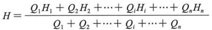

  式中 H —综合时间定额（工日 'm

3

 ，工日 /m² ，工日/…）；  

  Qi

 工作中第 i 个分项工程的工程量（ m³ ， m² ，t）；  

  Hi

 —工作中第 i 个分项工程的时间定额（工日 /m³ ，工日 /m² ，工日/…）。  

  根据工作的工程量和所采用的定额，即可按式（1.3-2）或式（1.3-3）计算出各项工作所需要的劳动量和机械台班数。  

P=Q×H
  或：  

P=Q/S
  式中 P ——工作所需要的劳动量（工日）或机械台班数（台班）；  

  Q 工作的工程量 (m³,m²,t)……  

  s -工作所采用的人工产量定额（ m³/ 工日， m²/ 工日，t/工日）或机械台班产量定额（ m³/ 台班， m²/ 台班， t/ 台班…）。  

  其他符号同前。  

  零星项目所需要的劳动量可结合实际情况，根据施工单位的经验进行估算。  

  （5）确定工作的持续时间。根据工作所需要的劳动量或机械台班数，以及该工作每天安排的工人数或配备的机械台数，即可按式（1.3-4）计算各项工作的持续时间。

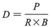

  式中 D ——完成工作所需要的时间，即持续时间（天）；  

  R 每班安排的工人数或施工机械台数；  

  B 每天工作班数。  

  其他符号同前。  

  在安排每班工人数和机械台数时，应综合考虑以下问题：  

  ① 要保证各工作中每班工人或施工机械拥有足够的工作面（不能少于最小工作面），以保证效率和施工安全。  

  ② 要使各工作中工人数量或施工机械数量不低于正常施工所必需的最低限度（不能小于最小劳动组合），以达到最高劳动生产率。  

  由此可见，最小工作面限定了每班施工人数的上限，而最小劳动组合限定了每班施工人数的下限。对于施工机械台数的确定也是如此。  

  每天的工作班数应根据工作的施工技术要求和组织要求来确定。例如浇筑大体积混凝土，要求不留施工缝连续浇筑时，就必须根据混凝土工程量决定采用双班制或三班制。  

  以上是根据安排的工人数和配备的机械台数来确定工作的持续时间。但有时需要  

  根据组织要求（如组织流水施工时）采用倒排方式来安排进度，即先确定各工作的持续时间，然后以此来确定所需要的工人数和机械台数。此时，需要将式（1.3-4）变换成式（1.3-5），以此来确定各项工作所需要的工人数和机械台数。

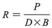

  如果根据式（1.3-5）求得的工人数或机械台数已超过施工单位现有供应条件时，除寻求其他途径增加人力、施工机械外，施工单位应从施工技术和组织管理方面采取积极措施加以解决。  

  （6）编制初始施工进度计划。施工进度计划的表达主要有横道图和网络图两种形式。横道图比较简单，且非常直观，长期以来被广泛应用。对于工程规模较大或较复杂的工程，宜采用网络图来表达施工进度计划。  

  （7）施工进度计划的调整和优化。要检查初始施工进度计划是否满足要求。检查内容包括： ① 各项工作的施工顺序和搭接关系是否合理； ② 总工期是否满足合同约定；③ 主要工种的工人是否能满足连续、均衡施工的要求； ④ 主要施工机具、材料等的利用是否均衡和充分。  

  上述四方面检查内容中，首要的是前两方面检查内容。若不满足要求，必须进行调整。只有在前两个方面均满足要求的前提下，才能进行后两个方面的检查。前者是解决可行与否的问题，后者则是施工进度计划优化问题。

**4）施工准备与资源配置计划**

  （1）施工准备。包括：技术准备、现场准备和资金准备等。  

  ① 技术准备。包括：施工所需技术资料的准备；施工方案编制计划；试验检验及设备调试工作计划；样板制作计划等。  

  ② 现场准备。应根据现场施工条件和工程实际需要，准备现场生产、生活临时设施。  

  ③ 资金准备。应根据施工进度计划编制资金使用计划。  

  （2）资源配置计划。包括：劳动力配置计划和物资配置计划。  

  ① 劳动力配置计划。劳动力配置计划应包括下列内容：确定各施工阶段用工量；根据施工进度计划确定各施工阶段劳动力配置计划。  

  ② 物资配置计划。物资配置计划应包括下列内容：主要工程材料和设备的配置计划应根据施工进度计划确定，包括各施工阶段所需主要工程材料、设备的种类和数量；工程施工主要周转材料、施工机具的配置计划应根据施工部署和施工进度计划确定，包括施工阶段所需主要周转材料、施工机具的种类和数量。

**5）主要施工方案**

  应对主要分部、分项工程制定施工方案，并对脚手架工程、起重吊装工程、临时用水用电工程、季节性施工等专项工程所采用的施工方案进行必要的验算和说明。施工方案的确定要遵循先进性、可行性和经济性兼顾的原则。

**6）施工现场平面布置**

  应结合施工组织总设计，按不同施工阶段分别绘制施工现场平面布置图。施工现场平面布置图应包括下列内容：  

  （1）工程施工场地状况。（2）拟建建（构）筑物的位置、轮廓尺寸和层数。（3）施工现场的加工设施、存贮设施、办公和生活用房等的位置和面积。（4）布置在施工现场的垂直运输设施、供电设施、供水供热设施、排水排污设施和临时施工道路等。（5）施工现场必备的安全、消防、保卫和环境保护等设施。（6）相邻地上、地下既有建（构）筑物及相关环境。

**3. 施工方案**

  施工方案是指以分部（分项）或专项工程为主要对象编制的施工技术与组织方案，用以具体指导分部（分项）或专项工程的施工过程。施工方案是施工组织设计的进一步细化，是施工组织设计的补充。  

  施工方案内容包括：工程概况、施工安排、施工进度计划、施工准备与资源配置计划、施工方法及工艺要求等。

**1）工程概况**

  工程概况包括工程主要情况、设计简介和工程施工条件等。  

  （1）工程主要情况。包括：分部（分项）或专项工程名称，工程参建单位相关情况，工程施工范围，施工合同、招标文件或总承包单位对工程施工的重点要求等。（2）设计简介。主要介绍施工范围内的工程设计内容和相关要求。（3）工程施工条件。重点说明与分部（分项）或专项工程相关的内容。

**2）施工安排**

  施工安排中应包括下列内容：  

  （1）工程施工目标。包括施工进度、质量、成本、安全、绿色施工及环境管理等目标，各项目标应符合施工合同、招标文件和总承包单位对工程施工的要求。  

  （2）工程施工顺序及施工流水段。  

  （3）工程施工的重点和难点分析，并简述主要的管理和技术措施。  

  （4）项目管理机构及其职责。根据分部（分项）或专项工程的规模、特点、复杂程度、目标控制和总承包单位的要求设置项目管理机构，配备各类专业人员，建立健全岗位责任制。

**3）施工进度计划**

  分部（分项）或专项工程的施工进度计划应按照施工安排，并结合总承包单位的施工进度计划编制。施工进度计划应能反映各施工区段或各工序之间的搭接关系，施工期限和开始、结束时间。同时，施工进度计划应能体现和落实施工总进度计划的目标控制要求，进而体现施工总进度计划的合理性。

**4）施工准备与资源配置计划**

  （1）施工准备。包括技术准备、现场准备和资金准备等。  

  ① 技术准备。包括施工所需技术资料的准备；图纸深化和技术交底的要求；试验检验和调试工作计划；样板制作计划，以及与相关单位的技术交接计划等。  

  ② 现场准备。包括生产、生活临时设施的准备，以及与相关单位进行现场交接的计划等。  

  ③ 资金准备。编制资金使用计划等。  

  （2）资源配置计划。包括劳动力配置计划和物资配置计划。  

  ① 劳动力配置计划。确定工程用工量并编制专业工种劳动力计划表。  

  ② 物资配置计划。包括工程材料和设备配置计划，周转材料和施工机具配置计划，以及计量、测量和检验仪器配置计划等。

**5）施工方法及工艺要求**

  施工方法及工艺要求应包括下列内容：  

  （1）明确分部（分项）或专项工程施工方法，并进行必要的技术核算；明确主要分项工程（工序）的施工工艺要求。  

  （2）重点说明易发生质量通病、易出现安全问题、施工难度大、技术要求高的分项工程（工序）。  

  （3）对开发和使用的新技术、新工艺及采用的新材料、新设备，应通过必要的试验或论证并编制计划。  

  （4）根据施工地点的气候条件，对季节性施工提出具体要求。

**4. 施工组织设计的编制、审批及动态管理**

**1）施工组织设计的编制和审批**

  在施工承包单位内部，施工组织设计的编制和审批应符合下列规定：  

  （1）施工组织设计应由项目负责人主持编制，可根据需要分阶段编制和审批。  

  （2）施工组织总设计应由总承包单位技术负责人审批；单位工程施工组织设计应由施工单位技术负责人或技术负责人授权的技术人员审批；施工方案应由项目技术负责人审批；重点、难点分部（分项）工程施工方案和针对危险性较大的分部分项工程专项施工方案应由施工单位技术部门组织相关专家评审，施工单位技术负责人批准。  

  （3）由专业承包单位施工的分部（分项）工程施工方案，应由专业承包单位技术负责人或技术负责人授权的技术人员审批；有总承包单位时，应由总承包单位项目技术负责人核准备案。  

  （4）规模较大的分部（分项）工程施工方案应按单位工程施工组织设计进行编制和审批。

**2）施工组织设计的动态管理**

  （1）工程施工过程中发生下列情形时，应及时对施工组织设计进行修改或补充：① 工程设计有重大修改； ② 有关法律、法规及标准实施、修订和废止； ③ 主要施工方法有重大调整； ④ 主要施工资源配置有重大调整； ⑤ 施工环境有重大改变。  

  （2）经修改或补充的施工组织设计应重新审批后实施。  

  （3）工程施工前，应进行施工组织设计的逐级交底。工程施工过程中，应对施工组织设计的执行情况进行检查、分析并适时进行调整。

#### 1.3.3 施工项目目标动态控制

  为了对施工项目目标进行有效的动态控制，需要着力解决两方面问题：一是统筹考虑施工项目进度、质量、成本目标之间的相互关系，确定并分解施工项目目标，构建  

  施工项目目标体系；二是应用动态控制原理，采取有效措施控制工程项目实施过程，确保施工项目目标的实现。

**1. 施工项目目标体系构建**

  施工项目目标体系是有效控制施工项目目标的基本前提，也是施工项目管理是否成功的重要判据。为此，需要在综合考虑施工进度、质量、成本目标之间相互关系的基础上，通过分析论证确定施工项目总目标；然后从不同角度将施工项目总目标分解成若干分目标、子目标及可执行目标，从而形成“自上而下层层展开、自下而上层层保证”的施工项目目标体系。

**1）施工项目总目标的分析论证**

  施工项目目标是一个包含施工进度、质量、成本的多目标体系，同时要考虑施工安全和绿色施工等因素，具有优先性、层次性和动态性等特点。为有效控制施工项目目标，首先需要根据施工合同及利益相关者需求，结合施工项目特点及所处环境，遵循下列基本原则分析论证施工项目总目标：  

  （1）确保工程质量、施工安全、绿色施工及环境管理目标符合工程建设强制性标准。工程建设强制性标准是有关人民生命财产安全、人体健康、环境保护和公众利益的技术要求，在追求施工项目目标间最佳匹配时，应确保工程质量、施工安全、绿色施工及环境管理目标符合工程建设强制性标准。  

  （2）定性分析与定量分析相结合。在施工项目目标体系中，质量目标通常会采用定性分析方法，而进度、成本目标则需要采用定量分析方法。对于某一具体施工项目而言，采用不同的质量标准，会有不同的进度和成本。因此，需要采用定性分析与定量分析相结合的方法来分析论证施工项目目标。  

  （3）不同施工项目的各个目标可具有不同的优先等级。施工项目的进度、质量、成本目标的优先顺序并非固定不变。由于每一个施工项目的建设背景、复杂程度、建设单位及其他利益相关者的需求等不同，决定了施工项目各个目标的重要性顺序不同。有的施工项目工期紧迫，有的施工项目资金紧张，有的施工项目技术复杂等，从而决定了进度、质量、成本目标在不同施工项目中具有不同的优先等级。  

  总之，施工项目目标之间密切联系、相互制约，需要统筹兼顾，力求达到“质量优、成本低、工期短”的最优总目标。

**2）施工项目总目标的分解**

  保证建设工程顺利建成并交付使用，是施工项目目标控制的最终目的。为有效控制施工项目目标，不能只有总目标，还要有按不同承包单位、项目组成、时间进展等划分的分目标、子目标及可执行目标，形成如图1.3-1所示的施工项目多级目标体系。在施工项目多级目标体系中，各级目标之间相互联系，上一级目标控制下一级目标，下一级目标保证上一级目标的实现，最终保证施工项目总目标的实现。

**2. 施工项目目标动态控制过程及措施**

  施工项目目标体系构建后，施工项目管理的关键在于项目目标动态控制。为此，需要通过建立和落实项目管理责任制，采取有效措施控制施工项目实施过程。

**1）施工项目目标动态控制过程**

  施工项目目标动态控制过程如图1.3-2所示。

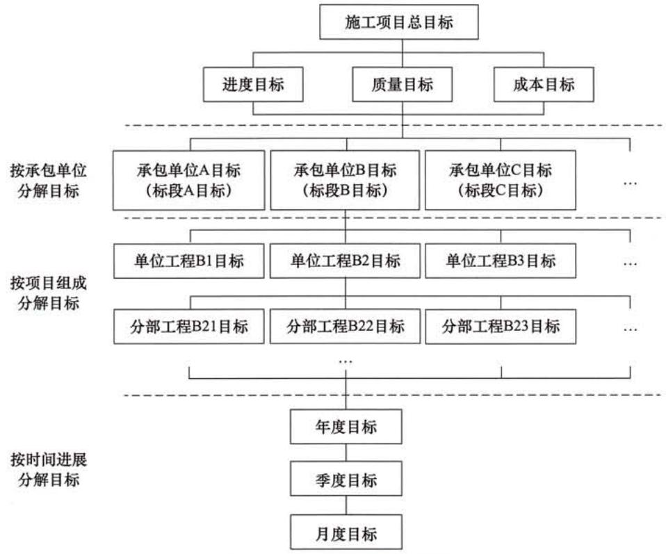

*图1.3-1施工项目多级目标体系*

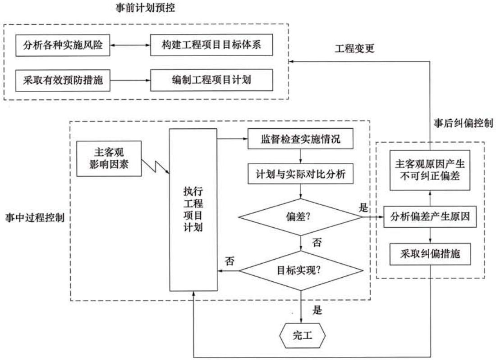

*图1.3-2施工项目目标动态控制过程*

**2）施工项目目标控制措施**

  实施施工项目目标动态控制，应从组织、技术、经济、合同等多方面采取措施。  

  （1）组织措施。包括建立健全组织机构和规章制度，配备相应管理人员并明确岗位职责分工；完善沟通机制和工作流程，促进各参建单位、各职能部门间协同工作；强化动态控制中的激励，调动和发挥员工实现项目目标的积极性和创造性；建立施工项目目标控制工作考评机制，通过绩效考核实现持续改进等。  

  （2）技术措施。施工项目目标在很大程度上需要通过采取技术措施来实现。为此，需要结合施工项目目标控制需求和工程特点，编制施工组织设计、施工方案并对其技术可行性进行审查、论证；改进施工方法和施工工艺，采用更先进的施工机具；采用新技术、新材料、新工艺、新设备等“四新”并组织专家论证其可靠性和适用性等。还要在整个项目实施过程中，采用工程网络计划技术、价值工程、挣值分析等方法和数字化、智能化技术等进行动态控制。  

  （3）经济措施。工程项目归根结底是一项投资的实现，从工程项目的提出到实施，始终伴随着资金的筹集和使用。仅就施工项目而言，倘若在目标控制中忽视经济措施，不仅会使施工成本目标难以实现，而且会影响施工项目其他目标的实现。为此，需要明确施工责任成本，落实加快施工进度所需资金，完善施工成本节约奖励措施，对工程变更方案进行技术经济分析，及时办理工程价款结算和支付手续等。  

  （4）合同措施。强化合同管理是控制施工项目目标的重要措施。就施工承包而言，在施工投标环节需要通过市场调查系统分析施工承包风险，并将其对施工承包风险的应对体现在投标报价中。在施工合同签订环节，要结合承包模式及合同计价方式，与建设单位协商确定完善的合同条款，争取有工期提前、合理化建议的奖励条款。在施工合同履行环节，要做好施工合同交底工作，动态跟踪施工合同执行情况，合理处置工程变更和利用好施工索赔。

## 第2章 施工招标投标与合同管理

### 2.1 施工招标投标

#### 2.1.1 施工招标方式与程序

**1. 施工招标方式**

  按照竞争开放程度不同，施工招标可分为公开招标和邀请招标两种方式。

**1）公开招标**

  公开招标又称无限竞争性招标，是指招标人通过新闻媒体发布招标公告，邀请具备条件的法人或组织投标竞争，然后从中确定中标者并与之签订施工合同的过程。  

  采用公开招标方式的优点是，招标人可在较广范围内选择承包商，投标竞争激烈，有利于招标人将工程项目交予可靠的承包商实施，并获得有竞争性的报价。同时，也可在较大程度上避免招标过程中的贿标行为。但其缺点是，准备招标、对投标申请者进行资格预审和评标的工作量大，招标时间长、费用高。

**2）邀请招标**

  邀请招标也称有限竞争性招标，是指招标人以投标邀请书形式邀请预先确定的若干家符合条件的法人或组织投标竞争，然后从中确定中标者并与之签订施工合同的过程。  

  采用邀请招标方式时，邀请对象以 5∼10 家为宜，但不应少于3家，否则便失去竞争意义。与公开招标方式相比，采用邀请招标方式的优点是不需要发布招标公告和设置资格预审程序，可节约招标费用、缩短招标时间。而且，由于招标人比较了解投标人以往业绩和履约能力，可减少合同履行过程中承包商违约的风险。值得注意的是，尽管采用邀请招标方式时不进行资格预审，但为了体现公平竞争和便于招标人对各投标人的综合能力进行比较，仍要求投标人按招标文件的有关要求，在投标文件中提供表明投标人资质和能力的有关证明材料，作为评标时的评审（资格后审）内容之一。  

  采用邀请招标方式的缺点是，由于邀请对象的选择面窄、范围较小，有可能会排除某些在技术上或报价上有竞争力的潜在投标人，因而使投标竞争的激烈程度相对较差，进而会提高中标合同价。

**2. 施工招标程序**

  理解施工招标程序，是做好施工投标的重要前提和基础。为了规范施工招标投标活动，促进施工招标投标活动的公开、公平和公正，国家发展和改革委员会等九部委联合发布了《标准施工招标文件》。针对工期不超过12个月、技术相对简单且设计和施工不是由同一承包人承担的小型项目施工招标，九部委还联合发布了《简明标准施工招标文件》。  

  根据上述文件，施工招标程序归纳如下。其中，公开招标与邀请招标在程序上的差异主要体现在两方面：一是潜在投标人获得招标信息的方式不同；二是对投标人资格审查的方式不同。但公开招标与邀请招标均需要经过施工招标准备、招标过程和决标成交三个阶段。

**1）施工招标准备**

  施工招标准备工作主要包括：组建招标组织、办理招标申请手续、进行招标策划、编制资格预审文件和招标文件等。  

  （1）组建招标组织。建设单位具有与招标项目规模和复杂程度相适应的技术、经济等方面的专业人员，具有编制招标文件和组织评标的能力的，可自行组织招标。建设单位不具备自行组织招标能力条件的，应委托能够编制招标文件和组织评标的相应专业力量办理招标事宜。  

  （2）办理招标申请手续。《中华人民共和国招标投标法实施条例》规定，按照国家有关规定需要履行项目审批、核准手续的依法必须进行招标的项目，其招标范围、招标方式、招标组织形式应报项目审批、核准部门审批、核准。  

  （3）进行招标策划。包括：划分施工标段、确定承包模式、选择合同计价方式等。  

  ① 划分施工标段。对于工程规模大、专业复杂的工程，建设单位管理能力有限时，应考虑采用施工总承包方式。这样，有利于减少各专业之间因配合不当造成的窝工、返工、索赔风险。但采用这种承包方式，有可能使工程报价相对较高。对于工艺成熟的一般性工程，涉及专业不多时，可考虑采用平行承包方式，分别选择各专业承包单位并签订施工合同。采用这种承包方式，建设单位一般可得到较为满意的报价，有利于控制工程造价。  

  划分施工标段时，应考虑的因素包括：工程特点、对工程造价的影响、承包单位专长的发挥、工地管理及建设资金、设计图纸供应等。  

  ② 确定承包模式。施工承包模式有施工总承包、平行承包、联合体承包、合作体承包等。在确定允许采取哪些承包模式的基础上，还需要结合工程特点和施工需求确定是否允许分包，以及哪些工程部位允许分包等。  

  ③ 选择合同计价方式。总体而言，施工合同计价方式可分为三种：总价方式、单价方式和成本加酬金方式。相应地，施工合同也称为总价合同、单价合同和成本加酬金合同。建设单位可综合考虑工程复杂程度、工程设计深度、施工技术先进程度、施工工期紧迫程度等因素，选取不同的合同计价方式或在同一施工合同中针对不同工程部位组合采用不同计价方式。  

  （4）编制资格预审文件。对于采用公开招标的施工项目，为了保证潜在投标人能够公平地获得投标竞争机会，确保投标人满足招标项目的资格条件，招标人应对投标人进行资格审查。国家发展和改革委员会等九部委联合发布的《标准施工招标资格预审文件》规定，资格预审文件包括下列内容：资格预审公告；申请人须知；资格审查办法；资格预审申请文件格式；项目建设概况等。此外，招标人对资格预审文件所作的澄清、修改，也构成资格预审文件的组成部分。  

  （5）编制招标文件。招标文件是投标人编制投标文件和投标报价的依据，其中应包括招标项目的所有实质性要求和条件。为此，招标人应根据《标准施工招标文件》，结合招标项目具体特点和实际需要编制招标文件。  

  施工招标文件包括下列内容：招标公告或投标邀请书；投标人须知；评标办法；合同条款及格式；工程量清单；图纸；技术标准和要求；投标文件格式；投标人须知前附表规定的其他材料。此外，招标人对招标文件所作的澄清、修改，也构成招标文件的组成部分。  

  ① 投标人须知。投标人须知包括前附表、正文和附表三部分。  

  A.投标人须知前附表。针对施工招标项目具体情况列明投标人须知正文中的具体要求，明确招标工作中主要环节的时间安排，以及对投标文件的要求等。  

  B.投标人须知正文。主要包括下列内容：  

  a.总则。包括项目概况；资金来源和落实情况；招标范围、计划工期和质量要求；投标人资格要求；费用承担；保密；语言文字；计量单位；踏勘现场；投标预备会；分包；偏离等。  

  b.招标文件。包括招标文件的组成、澄清和修改等。  

  c.投标文件。包括投标文件的组成；投标报价；投标有效期；投标保证金；资格审查材料；备选投标方案；投标文件的编制等。  

  d.投标。包括投标文件的密封和标记；投标文件的递交；投标文件的修改与撤回等。  

  e.开标。包括开标时间和地点；开标程序等。  

  f.评标。包括评标委员会；评标原则和评标等。  

  g.合同授予。包括定标方式；中标通知；履约担保；签订合同等。  

  h.重新招标和不再招标。包括重新招标；不再招标等  

  i.纪律和监督。包括对招标人的纪律要求；对投标人的纪律要求；对评标委员会成员的纪律要求；对与评标活动有关的工作人员的纪律要求；投诉等。  

  j.需要补充的其他内容。  

  C.附表。包括开标记录表、问题澄清通知、问题的澄清、中标通知书和中标结果通知书等文件格式。  

  ② 投标文件格式。包括投标函及投标函附录；法定代表人身份证明；授权委托书；  

  联合体协议书；投标保证金；已标价工程量清单；施工组织设计；项目管理机构；拟分包项目情况表；资格审查资料；其他材料。

**2）施工招标过程**

  正式的施工招标过程主要包括：发布招标公告或发出投标邀请书；进行资格预审；发售招标文件和组织现场踏勘；开标与评标等。  

  （1）发布招标公告或发出投标邀请书。发布招标公告或发出投标邀请书的目的是让潜在投标人获得招标信息，以便于其进行项目筛选，确定是否参与投标竞争。招标公告或投标邀请书分别适用于不同的施工招标方式。  

  ① 招标公告。招标公告适用于进行资格预审的公开招标。招标公告内容包括：招标条件、项目概况与招标范围、投标人资格要求、招标文件的获取、投标文件的递交、发布公告的媒介和联系方式等。  

  ② 投标邀请书。投标邀请书适用于进行资格后审的邀请招标。投标邀请书内容包括：招标条件、项目概况与招标范围、投标人资格要求、招标文件的获取、投标文件的递交、确认和联系方式等。  

  （2）进行资格预审。对于采用公开招标方式的施工项目，可按下列程序进行资格预审。  

  ① 发布资格预审公告。对于依法必须进行招标的项目的资格预审公告，应在国务院发展改革部门依法指定的媒介发布。资格预审公告内容包括：招标条件、项目概况与招标范围、申请人资格要求、资格预审方法、资格预审文件的获取、资格预审申请文件的递交、发布公告的媒介和联系方式等。  

  ② 发售资格预审文件。招标人应按照资格预审公告规定的时间、地点发售资格预审文件。资格预审文件的发售期不得少于5日。潜在投标人或者其他利害关系人对资格预审文件有异议的，应在提交资格预审申请文件截止时间2日前向招标人提出。招标人应自收到异议之日起3日内做出答复。做出答复前，应暂停招标投标活动。  

  ③ 资格预审文件的澄清或修改。招标人可以对已发出的资格预审文件进行必要的澄清或者修改。澄清或者修改的内容可能影响资格预审申请文件编制的，招标人应在提交资格预审申请文件截止时间至少3日前，以书面形式通知所有获取资格预审文件的潜在投标人；不足3日的，招标人应顺延提交资格预审申请文件的截止时间。  

  ④ 资格预审申请文件的递交。资格预审申请文件内容包括：资格预审申请函；法定代表人身份证明或附有法定代表人身份证明的授权委托书；联合体协议书（若有）；申请人基本情况表；近年财务状况表；近年完成的类似项目情况表；正在施工和新承接的项目情况表；近年发生的诉讼及仲裁情况；申请人须知前附表中要求提交的其他材料。  

  潜在投标人应严格按照资格预审文件要求的格式和内容，编制、装订、密封资格预审申请文件，并加写标记和加盖申请人单位章，按照规定的时间、地点、方式递交。未按要求密封和加写标记、逾期送达或者未送达指定地点的资格预审申请文件，招标人将不予受理。  

  ⑤ 组建资格审查委员会。国有资金占控股或者主导地位的依法必须进行招标的项目，招标人应组建资格审查委员会审查资格预审申请文件。资格审查委员会应由招标人代表和有关技术、经济等方面的专家组成，成员人数为5人以上单数，其中技术、经济等方面的专家不得少于成员总数的 2/3 。其他项目由招标人自行组织资格审查。  

  ⑥ 审查资格预审申请文件。审查委员会应按照资格预审文件载明的审查标准和方法，对所有已受理的资格预审申请文件进行审查。没有规定的标准和方法不得作为审查依据。  

  A.投标人资格预审分初步审查和详细审查两个环节。初步审查标准通常包括：申请人名称是否与营业执照、资质证书及安全生产许可证一致；申请函是否有法定代表人或其委托代理人签字并加盖单位章；申请文件格式是否符合要求；联合体申请人是否提交联合体协议书并明确联合体牵头人；资格预审申请文件证明材料是否齐全有效等。申请人只要有一项因素不符合审查标准的，就不能通过资格预审。详细审查标准主要包括：是否具备有效的营业执照、安全生产许可证；申请人的资质等级、财务状况、类似项目业绩、信誉、项目经理资格及联合体申请人等是否符合申请人须知中要求的条件。申请人有一项因素不符合审查标准的，不能通过资格预审。  

  B.投标人资格预审方法有两种：合格制和有限数量制。合格制是指凡符合初步审查标准和详细审查标准的申请人均通过资格预审，取得投标人资格。合格制会使投标竞争更加充分，但可能会出现投标人数多，增加招标成本。有限数量制是指审查委员会依据资格预审文件中规定的资格审查标准和程序，对通过初步审查和详细审查的资格预审申请文件进行量化打分，按得分由高到低的顺序确定通过资格预审的申请人。通过资格预审的申请人不超过资格审查办法前附表规定的数量。有限数量制可以限制投标人数量，降低招标工作量和费用。  

  合格制和有限数量制在审查标准上无本质区别，都需要进行初步审查和详细审查。两者区别就在于有限数量制需要对通过审查的资格预审申请文件进行量化打分。  

  ⑦ 资格预审申请文件的澄清或说明。在资格审查过程中，资格审查委员会可以书面形式，要求申请人对所提交的资格预审申请文件中不明确的内容进行必要的澄清或说明。申请人的澄清或说明应采用书面形式，并不得改变资格预审申请文件的实质性内容。申请人的澄清和说明内容属于资格预审申请文件的组成部分。招标人和审查委员会不接受申请人主动提出的澄清或说明。  

  ⑧ 提交审查报告。审查委员会按照规定的程序对资格预审申请文件完成审查后，确定通过资格预审的申请人名单，并向招标人提交书面审查报告。资格审查报告内容通常包括：基本情况和数据表；资格审查委员会名单；澄清、说明、补正等事项纪要；审查过程、未通过审查的情况说明及通过审查的申请人名单；其他需要说明的问题。  

  ⑨ 通知和确认。招标人应在申请人须知前附表规定的时间内以书面形式将资格预审结果通知申请人，并向通过资格预审的申请人发出投标邀请书。通过资格预审的申请人收到投标邀请书后，应在申请人须知前附表规定的时间内以书面形式明确表示是否参加投标。在申请人须知前附表规定时间内未表示是否参加投标或明确表示不参加投标的，不得再参加投标。  

  （3）发售招标文件和组织现场踏勘。《标准施工招标文件》有以下规定：  

  ① 发售招标文件。招标人应按照招标公告（未进行资格预审）或投标邀请书（邀请招标）的时间、地点发售招标文件。  

  ② 组织现场踏勘。招标人组织投标人进行施工现场踏勘的目的：一是让投标人考察和了解施工现场的自然环境、社会环境及施工条件，便于决定投标策略和报价原则，更好地结合工程实际编制投标文件；二是为避免施工合同履行中承包商以不了解现场情况为由推卸其应承担的责任。为此，招标人在组织现场踏勘时，除对工程场地和相关周边环境情况进行介绍外，不对投标人提出的有关问题作进一步说明，以免干扰投标人的判断。即使是招标人在踏勘现场中介绍的工程场地和相关周边环境情况，也仅供投标人在编制投标文件时参考，招标人不对投标人据此作出的判断和决策负责。  

  投标人须知前附表规定组织踏勘现场的，招标人应按投标人须知前附表规定的时间、地点组织投标人踏勘现场。投标人踏勘现场发生的费用自理。除招标人的原因外，投标人自行负责在踏勘现场中所发生的人员伤亡和财产损失。  

  ③ 投标预备会。投标人须知前附表规定召开投标预备会的，招标人应按投标人须知前附表规定的时间和地点召开投标预备会。招标人组织召开投标预备会的目的是澄清投标人提出的问题。  

  投标人应在投标人须知前附表规定的时间前，以书面形式将提出的问题送达招标人，以便招标人在会议期间澄清。投标预备会后，招标人在投标人须知前附表规定的时间内，将对投标人所提问题的澄清，以书面方式通知所有购买招标文件的投标人。该澄清内容为招标文件的组成部分。  

  根据《中华人民共和国招标投标法实施条例》，招标人对招标文件进行澄清或者修改的内容可能影响投标文件编制的，招标人应在投标截止时间至少15日前，以书面形式通知所有获取招标文件的潜在投标人；不足15日的，招标人应顺延提交投标文件的截止时间。  

  （4）开标与评标。投标人编制完成并按规定时间递交投标文件后，招标人便需要组织开标与评标。  

  ① 投标文件的递交和接收。投标人应严格按照招标文件要求的格式和内容，编制、装订、密封投标文件，并加写标记和加盖投标人单位章，在投标截止时间前按照规定的地点、方式递交。未按要求密封和加写标记、逾期送达或者未送达指定地点的投标文件，招标人将不予受理。招标人收到投标文件后，应向投标人出具签收凭证，并记录投标文件递交的时间、地点及密封状况，并妥善保存投标文件。在招标文件规定的开标时间前不得开启投标文件。  

  ② 组建评标委员会。招标人应负责组建评标委员会。评标委员会成员名单一般应在开标前确定，在中标结果确定前应当保密。评标委员会由招标人代表及有关技术、经济等方面的专家组成，成员人数为5人以上单数，其中技术、经济等方面的专家不得少于成员总数的2/3。  

  评标委员会的专家成员应从依法组建的专家库中，采取随机抽取或者直接确定的方式确定。对于一般项目，可以采取随机抽取的方式；对于技术复杂、专业性强或者国家有特殊要求的招标项目，采取随机抽取方式确定的专家难以保证胜任的，可以由招标人直接确定。  

  ③ 开标。招标人应按招标文件规定的投标截止时间（开标时间）和投标人须知前附表规定的地点公开开标，并邀请所有投标人的法定代表人或其委托代理人准时参加。  

  主持人按下列程序进行开标：  

  A.宣布开标纪律；B.公布在投标截止时间前递交投标文件的投标人名称，并点名确认投标人是否派  
  人到场；C.宣布开标人、唱标人、记录人、监标人等有关人员姓名；D.按照投标人须知前附表的规定检查投标文件的密封情况；E.按照投标人须知前附表的规定确定并宣布投标文件开标顺序；F.设有标底的，公布标底；G.按照宣布的开标顺序当众开标，公布投标人名称、标段名称、投标保证金的递  
  交情况、投标报价、质量目标、工期及其他内容，并记录在案；H.投标人代表、招标人代表、监标人、记录人等有关人员在开标记录上签字确认；  

  I.开标结束。  

  ④ 评标。施工评标分初步评审和详细评审两个环节。评标委员会应按照招标文件规定的方法、评审因素、标准和程序对投标文件进行评审。招标文件没有规定的方法、评审因素和标准，不得作为评标依据。  

  A.初步评审。初步评审属于对投标文件的合格性审查，评审内容包括形式评审、资格评审、响应性评审、施工组织设计和项目管理机构评审标准四个方面。  

  a.投标文件形式评审。包括：投标人名称是否与营业执照、资质证书及安全生产许可证一致；投标函是否有法定代表人或其委托代理人签字并加盖单位章；投标文件格式是否符合招标文件要求；联合体投标人（如有）是否提交联合体协议书，并明确联合体牵头人；投标报价是否具有唯一性等。  

  b.投标人资格评审。对于未进行资格预审的，需要进行资格后审，资格审查内容和方法与资格预审相同。包括：投标人是否具备有效的营业执照和有效的安全生产许可证；投标人的资质等级、财务状况、类似项目业绩、信誉、项目经理、其他要求，以及联合体投标人等，是否符合投标人须知中的要求。  

  c.投标文件对招标文件的响应性评审。包括：投标内容、工期、工程质量、投标有效期、投标保证金、权利义务、已标价工程量清单、技术标准和要求等是否符合评标办法前附表中要求。  

  已标价工程量清单有计算错误的，总价金额与依据单价计算出的结果不一致时，以单价金额为准修正总价，单价金额小数点有明显错误的除外；书写有错误的，投标文件中的大写金额与小写金额不一致时，以大写金额为准。评标委员会对投标报价的错误予以修正后，需请投标人书面确认，作为投标报价的金额。投标人不接受修正价格的，其投标作废标处理。  

  d.施工组织设计和项目管理机构设置的合理性评审。施工组织设计评审将会从内容完整性和编制水平、施工方案与技术措施、质量管理体系与措施、安全管理体系与措施、环境保护管理体系与措施、工程进度计划与措施、资源配备计划等方面进行评审。项目管理机构评审将会从项目经理任职资格与业绩、技术负责人任职资格与业绩、其他主要人员等方面进行评审。  

  评标委员会依据招标文件规定的标准对投标文件进行初步评审。有一项不符合评审标准的，作废标处理。对于已进行资格预审的，当投标人资格预审申请文件的内容发生重大变化时，评标委员会需依据招标文件规定的标准对其更新资料进行评审。  

  B.详细评审。经初步评审合格的投标文件，评标委员会应根据招标文件确定的评标标准和方法进行详细评审。评标方法通常有两种：经评审的最低投标价法和综合评估法。由于评标方法不同，详细评审标准也有所区别。采用经评审的最低投标价法评标时，详细评审主要考虑单价遗漏、付款条件等评审因素。采用综合评估法评标时，需要按评标办法前附表列明的评分标准对施工组织设计、项目管理机构、投标报价、其他因素等进行评分并汇总。  

  a.经评审的最低投标价法是指评标委员会对满足招标文件实质要求的投标文件，根据招标文件规定的量化因素及量化标准进行价格折算，形成“标价比较表”，载明投标人的投标报价及经评审的最终投标价。然后按照经评审的投标价由低到高的顺序推荐中标候选人，或根据招标人授权直接确定中标人。经评审的投标价相等时，投标报价低的优先；投标报价也相等的，由招标人自行确定。  

  b.综合评估法是指评标委员会对满足招标文件实质性要求的投标文件，按照招标文件规定的评分标准进行打分，形成“综合评估比较表”，载明投标人的投标报价、对各评审因素的评分及对最终评分结果。然后按得分由高到低顺序推荐中标候选人，或根据招标人授权直接确定中标人。综合评分相等时，以投标报价低的优先；投标报价也相等的，由招标人自行确定。  

  ⑤ 评标报告。评标委员会完成评标后，应向招标人提交书面评标报告。评标报告应如实记载以下内容：  

  A.基本情况和数据表；  
  B.评标委员会成员名单；  
  C.开标记录；  
  D.符合要求的投标一览表；  
  E.否决投标的情况说明；  
  F.评标标准、评标方法或者评标因素一览表；  
  G.经评审的价格或者评分比较一览表；  
  H.经评审的投标人排序；  
  I.推荐的中标候选人名单与签订合同前要处理的事宜；  
  J.澄清、说明、补正事项纪要。

**3）施工决标成交**

  （1）确定中标人。招标人应依据评标委员会推荐的中标候选人确定中标人。中标人确定后，招标人应在招标文件规定的投标有效期内以书面形式向中标人发出中标通知书，同时将中标结果通知未中标的投标人。  

  （2）合同谈判。这里的合同谈判是指中标人与招标人就施工合同具体内容达成一致的协商过程。作为中标人，在签订施工合同前进行谈判的主要目的：一是争取改善合同条款，澄清模糊条款，修改过于苛刻的不合理条款，增加保护自身利益的条款；二是需要协商确定未来发生工程变更时，相关工程价款的调整方法或原则等。  

  ① 谈判准备工作。合同谈判工作的成功与否，通常取决于谈判准备工作的充分程度及谈判策略或技巧的运用程度。谈判准备工作包括：收集发包人资信情况、履约能力及施工项目其他背景资料；分析发包人技术、经济实力及发包人谈判人员的身份、地位、性格、喜好、权限等；研判合同双方地位和优劣势；拟订合同谈判方案等。  

  ② 谈判内容。为避免未来产生合同纠纷，合同谈判应重点关注以下内容：  

  A.工程内容和范围。合同“标的”是合同最基本的要素，工程内容和范围即属于施工合同“标的”。在施工合同签订时要进一步确认工程内容和范围，做到工程内容明确、范围清楚。  

  B.合同价款支付。包括工程预付款、工程进度款、最终结算价款支付及工程质量保证金的扣留和返还等。  

  C.价格调整及工程量变化。对于工期较长的工程，由于人工、材料及机械使用费用上涨等因素影响，可能会给施工承包人造成较大损失。施工合同中的价格调整条款可以较好地解决这一非施工承包人可控制的风险损失。因此，施工承包人需要对施工合同中的价格调整条款给予充分重视。此外，在单价合同计价方式下，如果在原招标文件中未明确工程单价需调整的工程量变更限度，就需要在合同谈判时与发包人共同商定一个工程量“增减幅度”。当实际工程量增减超过商定的幅度时，就需要对工程单价进行调整。  

  D.不可预见的自然条件和人为障碍。应在施工合同中明确界定“不可预见的自然条件和人为障碍”的具体内容。诸如发包人提供的施工现场地质勘探资料、水文气象资料与实际情况有出入的，争取能在施工合同中有类似“遇非正常地质、水文气象情况时，由发包人给予额外补偿费用”的条款。  

  E.合同条件完善。诸如工程开工及工期、工期提前奖励和工程延误罚款；施工占地；向施工承包人移交施工现场和基础资料；工程预付款支付与扣减；隐蔽工程验收、工程竣工验收与交付等。  

  F.工程保修。应通过合同谈判明确工程保修范围、保修期限和保修责任。施工单位还要争取以保函形式替代扣留工程质量保证金方式。  

  G.争端解决及其他。应争取以协商或调解方式解决合同争端。此外，还需要考虑税务条款。对于合同价格确定后因政策变化导致发生的税务或其他费用的增加，应通过合同谈判明确补偿方式。  

  ③ 谈判策略和技巧。合同谈判不是一项简单的工作，而是一种集合谈判策略与技巧的艺术。为此，需要在合同谈判过程中充分运用各种谈判策略和技巧。  

  A.要掌握谈判进程，合理分配各项议题的谈判顺序和时间。在合作气氛良好时，提出自身所关注的议题，争取达成有利于己方的协议；在气氛紧张时，引导谈判进入双方易达成共识的议题，不仅有利于缓和气氛，也有利于减少双方分歧，推进谈判进程。同时，要注重关键问题，不要过多拘泥于细节性问题，这样可以缩短谈判时间，提高谈判效率。  

  B.要发挥专家作用，合理分配谈判角色。施工合同谈判通常会涉及多个专业领域，需要充分发挥相关专业领域专家的作用，既可在专业问题上获得技术支持，还可利用专家智慧给对方一定的心理压力。同时，还要合理分配谈判角色。根据谈判小组成员不同的职位和性格特征扮演不同的角色，这样可达到事半功倍的效果。  

  C.要善于分析谈判形势，利用拖延或休会策略打破僵局。合同谈判双方往往会存在利益冲突。当谈判遇到障碍、陷人僵局时，采用拖延或休会策略会使明智的谈判方有时间进行冷静思考，提出替代方案或迁回路径，进而弥合分歧。  

  （3）签订合同。招标人和中标人应在中标通知书发出之日起30日内，根据招标文件和中标人的投标文件订立书面合同。合同的标的、价款、质量、履行期限等主要条款应当与招标文件和中标人的投标文件的内容一致。招标人和中标人不得再行订立背离合同实质性内容的其他协议。  

  招标人最迟应在书面合同签订后5日内向中标人和未中标的投标人退还投标保证金及银行同期存款利息。中标人无正当理由拒签合同的，其投标保证金不予退还。  

  招标文件要求中标人提交履约保证金的，中标人应按照招标文件的要求提交。履约保证金不得超过中标合同金额的 10% 。

#### 2.1.2 合同计价方式

  合同计价方式不同，施工合同双方会承担不同的合同风险。

**1. 合同计价方式分类**

  施工合同计价方式可分为三种：总价、单价和成本加酬金。相应地，施工合同也称为总价合同、单价合同和成本加酬金合同。

**1）总价合同**

  总价合同是指建设单位与施工单位按照一个总价签订合同，施工单位按此价格完成合同规定的全部施工任务。根据合同总价是否可调，总价合同又可分为固定总价合同和可调总价合同。  

  （1）固定总价合同。固定总价合同是指施工单位按其投标时建设单位接受的投标报价一笔包死施工任务的计价方式。在合同履行过程中，建设单位没有要求变更原定承包内容的，施工单位在完成承包任务后，不论其实际成本如何，均应按签约合同价获得工程款支付。  

  采用固定总价合同形式，施工单位要考虑承担合同履行中的主要风险，因此在投标时会报较高价格。固定总价合同一般适用于下列情形：  

  ① 招标时已有施工图设计文件，施工任务和发包范围明确，合同履行中不会出现较大设计变更。  

  ② 工程规模较小、技术不太复杂的中小型工程或承包工作内容较为简单的工程部位，施工单位可在投标报价时合理地预见施工过程中可能遇到的各种风险。  

  ③ 工程量小、工期较短（一般为1年之内），合同双方可不必考虑市场价格浮动对承包价格的影响。  

  （2）可调总价合同。可调总价合同是指在固定总价合同的基础上，因合同履行过程中市场价格变动、工程变更及其他工程条件变化而使工程成本增加时，可按合同约定对合同总价进行调整的计价方式。  

  对于工期较长（1年以上）的工程，施工单位在投标报价时无法合理地预见合同履行过程中市场价格变动等因素的影响。因此，应在合同中明确约定合同价款的调整原则、方法和依据。常用的调价方法有：  

  ① 文件证明法。文件证明法是指在合同履行过程中，当合同约定的有关部门发布价格调整文件时，按文件规定调整合同价格。  

  ② 票据价格调整法。票据价格调整法是指在合同履行过程中，施工单位依据实际采购票据和用量，向建设单位实报实销与报价单中所报基价的差额部分。为此，需要在合同条款中明确约定允许调整价格的内容和基价。  

  ③ 公式调价法。公式调价法是指在合同履行过程中，按合同中约定的调价公式进行合同价格调整。常用的调价公式可概括为如下形式：  

=C0

(a0

+a1

⋅M/M0

+a2

⋅L/L0

+…+an

⋅T/T0

-1)
  式中  

  C 合同价格调整后应予增加或扣减的金额；  

  C 结算工程价款时，施工单位按合同约定计算的应得工程款；  

  M、L、 T ——分别代表合同约定允许调整价格项目的实际价格（如分别代表材料费、人工费、运输费等）；分母带脚标“0”的，为签订合同时该项费用的基价；分子项为支付结算价款时的基价；  

  a0

 非调价因子的加权系数，即合同价格中不受市场价格变动影响或不允许调价部分在合同价格中所占比例；  

  a1

 a2

 、、 an

 ——对应于各有关调价项的加权系数。各项加权系数之和应等于1，即：  

a0

+a1

+a2

+⋯+an

=1。

**2）单价合同**

  单价合同是指施工单位在投标时按工程量清单中的分项工作内容填报单价，然后以实际完成工程量乘以所报单价计算工程价款的合同。投标单位填报的单价应为计及各种摊销费用后的综合单价，而非直接费单价。合同履行过程中无特殊情况的，一般不得变更单价。  

  单价合同大多用于工期长、技术复杂、实施过程中发生各种不可预见因素较多的大型工程，以及建设单位为缩短工程建设周期，初步设计完成后就进行招标的工程。在单价合同中，工程量清单所列工程量为估算工程量，而非实际工程量。  

  采用单价合同形式，可以在合同双方之间较为合理地分担合同履行过程中的风险。因为施工单位在投标时据以报价的清单工程量为估算工程量，当实际完成工程量与估算工程量有较大出入时，采用单价合同可以避免建设单位有过多额外支出或施工单位有较大亏损。此外，施工单位在投标时不可能合理准确预见的风险因素可不必计人合同价，这样有利于建设单位取得较为合理的报价。  

  与总价合同类似，单价合同也可分为固定单价合同和可调单价合同。  

  （1）固定单价合同。采用固定单价合同时，无论发生哪些影响价格的因素，都不对合同约定的单价进行调整。这对施工单位而言，存在着一定风险。  

  （2）可调单价合同。采用可调单价合同时，合同双方可以估算工程量为基准，约定实际工程量的变化超过一定比例时合同单价的调整方式。合同双方也可约定，当市场价格变化达到一定程度或国家政策发生变化时，可以对哪些工程内容的单价进行调整，以及如何进行调整。由此可见，采用可调单价合同时，施工单位的风险相对较小。

**3）成本加酬金合同**

  成本加酬金合同也称为成本补酬合同，是指将施工合同价款划分为工程直接成本和施工单位完成工作后应得酬金两部分，合同履行过程中发生的直接成本由建设单位实报实销，另按合同约定的方式支付给施工单位相应报酬的合同。  

  成本加酬金合同大多适用于边设计、边施工的紧急工程或灾后修复工程。由于在签订合同时，建设单位还无法为施工单位提供据以报价的详细资料，因而在合同中只能约定酬金计取方式。根据酬金计取方式不同，成本加酬金合同又可分为成本加固定百分比酬金、成本加固定酬金、成本加浮动酬金和目标成本加奖罚四类合同形式。  

  （1）成本加固定百分比酬金合同。合同双方在签订合同时约定，酬金按实际发生的直接成本乘以某一百分比来计算。这种合同价款的计算式如下：  

C=Cd

(1+P)
  式中 C ——合同价款；  

  Cd

 实际发生的直接费；  

  从式（2.1-2）可以看出，施工单位可获得的酬金将随着直接成本的增加而增加。因此，这种合同虽在签订时简单易行，但不能激励施工单位缩短工期和降低成本。  

  （2）成本加固定酬金合同。合同双方在签订合同时约定酬金为某一固定值。这种合同价款的计算式如下：  

C=Cd

+F
  式中 F ——合同双方约定的酬金。  

  这种合同虽不能鼓励施工单位关心降低直接成本，但从尽快获得全部酬金、减少管理投入出发，施工单位会关心缩短工期。  

  （3）成本加浮动酬金合同。合同双方在签订合同时约定工程预期成本和固定酬金，以及实际发生的直接成本与预期成本有差异后的奖罚计算办法。这种合同价款的计算式如下：  

arrayrlrl&C=Cd

+F&&(Cd

=C0

)\&C=Cd

+F+ΔF&&(Cd

＜C0

)\&C=Cd

+F-ΔF&&(Cd

＞C0

)array
  式中 C0

 ——合同双方签订合同时约定的预期成本；  

  F 一合同双方约定的酬金；  

  ΔF ——酬金奖罚部分，可以是百分数，也可以是绝对数，且奖罚可采用不同的计算标准。  

  这种合同通常会规定，当实际成本超支而减少酬金时，以原定的基本酬金额为减少的最高限额。从理论上讲，这种合同形式对双方都没有太大风险，且又能促使施工单位关心成本降低和缩短工期。但在工程实践中，如何准确地估算作为奖罚标准的预期成本较为困难，这也往往是合同双方谈判的焦点。  

  （4）目标成本加奖罚合同。在仅有初步设计或工程说明书就迫切需要开工的情况下，可根据大致估算的工程量和适当的单价表编制粗略概算作为目标成本。随着工程设计的逐步深化，可对工程量和目标成本进行调整。在签订合同时，以当时估算的目标成本作为依据，并以百分比形式约定基本酬金和奖罚酬金。进行工程结算时，如果实际直接成本超过合同约定的目标成本界限（如 5% ），则应按约定百分比扣减成本超支的罚金；反之，如果实际直接成本有节约时（也应有一个幅度界限），则应按约定百分比增加酬金。这种合同价款的计算式如下：  

C=Cd

+P1

C0

+P2

(arraylC0

-Cd

array)
  式中 C0

 ——目标成本；P— -基本酬金计算百分比；P2

 1 奖罚酬金计算百分比。  

  此外，还可另行约定工期奖罚计算办法。这种合同有利于鼓励施工单位降低成本和缩短工期，建设单位和施工单位都不会承担太大风险。

**2. 合同计价方式比较与选择**

**1）合同计价方式比较**

  不同合同计价方式比较见表2.1-1。

*表2.1-1不同合同计价方式比较*

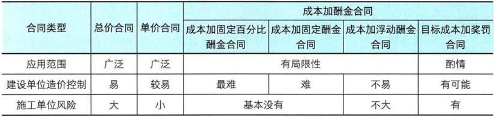

**2）合同计价方式选择**

  施工合同采用不同的计价方式，合同双方的义务和责任就不同，各自承担的风险也不尽相同。建设单位通常会综合考虑以下因素来选择合同计价方式。  

  （1）工程复杂程度。建设规模大且技术复杂的工程，承包风险较大，各项费用不易准确估算，因而不宜采用固定总价合同。最好是对有把握的部分采用固定总价合同，估算不准的部分采用单价合同或成本加酬金合同。有时，在同一施工合同中采用不同的计价方式，是建设单位和施工单位合理分担施工风险的有效办法。需要注意的是，施工合同中必须明确两种不同计价方式所限定的工程范围。  

  （2）工程设计深度。工程设计深度是选择合同计价方式的重要因素。对于已完成施工图设计的工程，施工图纸和工程量清单详细而明确，可选择总价合同；对于实际工程量与预计工程量可能有较大出入的工程，应优先选择单价合同；对于只完成初步设计，工程量清单不够明确的工程，可选择单价合同或成本加酬金合同。  

  （3）技术先进程度。对于施工中有较大部分采用新技术、新工艺的工程，建设单位和施工单位缺乏经验，又无国家标准的，不宜采用固定总价合同，而应选用成本加酬金合同。  

  （4）工期紧迫程度。对于一些紧急工程（如灾后恢复工程等），要求尽快开工且工期较紧的，可能仅有实施方案，尚无施工图纸，施工单位在投标时不可能报出合理价格，因此，选择成本加酬金合同较为合适。  

  总之，一个施工项目究竟采用何种合同计价方式并非固定不变。即使对于同一施工项目的不同工程部位或不同阶段，也可采用不同的计价方式。这需要依据工程实际情  

  况，权衡各种利弊后再作出抉择。

#### 2.1.3 基于工程量清单的投标报价

  工程量清单是指建设工程文件中载明项目编码、项目名称、项目特征、计量单位、工程数量等的明细清单。依照《建设工程工程量清单计价标准》GB/T50500—2024，使用财政资金或国有资金投资的建设工程，应按国家及行业工程量计算标准编制工程量清单，采用工程量清单计价；非使用财政资金或国有投资的建设工程，宜按国家及行业工程量计算标准编制工程量清单，采用工程量清单计价。根据用途不同，工程量清单可分为招标工程量清单和已标价工程量清单。招标工程量清单既是编制最高投标限价（招标控制价）的基础，也是建筑企业投标报价的直接依据。

**1. 招标工程量清单及计价方式**

**1）招标工程量清单**

  招标工程量清单应分别按分部分项工程项目清单、措施项目清单、其他项目清单和增值税编制。  

  （1）分部分项工程项目清单。分部分项工程项目清单应依据招标图纸、技术标准规范、相关工程国家及行业工程量计算标准及补充的工程量计算规则，确定分部分项工程项目清单及其项目特征，并计算其工程数量。清单项目按项计量的，应在其计量单位中以项表示。  

  存在发包人提供材料、承包人负责安装的清单项目，发包人应在招标文件中明确发包人提供材料的名称、档次、规格型号、交货方式及地点，并在招标工程量清单的项目特征中对发包人提供材料予以描述。发包人提供材料且材料供应方负责安装，承包人需要配合及提供协调服务时，分部分项工程项目清单中不应列项，但应在其他项目清单中计算相应的总承包服务费用。  

  施工招标时遇到暂不能按设计图纸要求确定必需使用材料的标准、规格和价格的，发包人应按预估材料到达施工现场的不含增值税价格，在工程量清单中列明材料暂估价。存在材料暂估价的清单项目，应在项目特征中明确材料暂估价额度，并在“材料暂估单价及调整表”中单独列出材料明细项目及暂估单价。  

  （2）措施项目清单。措施项目清单应依据常规施工工艺、顺序及生活、安全、环境保护、临时设施、文明施工等非工程实体方面的要求进行列项。其中，安全生产措施项目应按国家及省级、行业主管部门要求和招标工程实际情况列项。发包人提供设计图纸并要求承包人按图施工的措施项目，应列入分部分项工程项目清单中。措施项目清单的项目编码、项目名称、工作内容应按国家及行业工程量计算标准编制。  

  （3）其他项目清单。其他项目清单是指在分部分项工程项目清单、措施项目清单外，因发包人特殊要求而发生的费用项目及数量清单。  

  A.暂列金额。暂列金额是指发包人在工程量清单中暂定并包含在合同总价中，用于招标时尚未能确定或详细说明的工程、服务和工程实施中可能发生的合同价款调整等所预留的费用。暂列金额应根据工程特点按招标文件的要求列项。  

  B.专业工程暂估价。专业工程暂估价是指发包人在工程量清单中提供的，在招标时暂不能确定工程具体要求及价格而预估的含增值税的专业工程费用。专业工程暂估价应根据招标文件说明的专业工程分类别和（或）分专业列项，并列出明细表，其金额可根据项目情况，结合同类工程的合理价格或概算金额估算。  

  C.计日工。计日工是指由发包人提出、承包人完成，且不宜按合同约定的计量与计价规则进行计价的零星项目或工作。编制招标工程量清单时，应在项目特征中说明招标工程实施中可能发生的计日工性质的工种类别、材料及施工机具名称、零星工作项目、拆除修复项目等，并列出每一项目相应的名称、计量单位和合理暂估数量。  

  D.总承包服务费。总承包服务费应为完成招标文件、合同约定的总承包人承担总承包服务相关合同责任的相应清单项目不含增值税的价格，包括总承包人对发包人提供材料的供货人、专业工程暂估价的专业分包人（承包人实施的除外）和发包人直接发包的专业工程分包人履行管理、协调及配合责任等所需的服务费用。发包人提供材料与专业分包工程的总承包服务费应分别列项，可按项或费率计量。按费率计量时，宜以暂估价作为计价基础。直接发包的专业工程的总承包服务费宜以项计量，根据招标文件中发包人直接发包的各专业工程分别列项，并列出明细表。  

  （4）增值税。工程量清单中的项目对应的综合单价及合价应为不含增值税的税前全费用价格，税金应填写在增值税计价表中。但其他项目清单中的专业工程暂估价应为含增值税价格，工程量清单中的增值税中不应再计取其相应税金。

**2）工程量清单项目计价方式**

  依据《建设工程工程量清单计价标准》GB/T50500—2024，工程量清单中的项目有以下三种计价方式：  

  （1）单价计价方式。单价计价是指工程量清单中以工程数量乘以相应综合单价计算工程价款的方式。工程量清单项目的综合单价及合价应为不含增值税的税前全费用价格，由人工费、材料费、施工机具使用费、管理费、利润等组成，包括相应清单项目约定或合理范围的风险费，以及不可或缺的辅助工作所需的费用。  

  （2）总价计价方式。总价计价是指工程量清单中以项为单位采用总价计算工程价款的方式。  

  （3）费率计价方式。费率计价是指工程量清单中以计费基础乘以相应费率计算工程价款的方式。对于不宜采用单价或总价计价方式的清单项目，可采用费率计价等方式，并应在招标文件和合同文件中对计价要求、价款调整规则等予以说明。  

  分部分项工程项目清单宜采用单价计价方式；措施项目清单宜采用总价计价方式；其他项目清单中的专业工程暂估价可采用总价计价方式；暂列金额、总承包服务费可采用费率或总价计价方式；计日工可采用单价计价方式；增值税可采用费率（税率）计价方式。

**2. 最高投标限价**

  最高投标限价是指招标人根据法律法规及相关标准、政策及拟定的招标文件和招标工程量清单，结合工程实际情况编制的限定投标人投标报价的最高价格。《中华人民共和国招标投标法实施条例》规定，“招标人设有最高投标限价的，应当在招标文件中明确最高投标限价或者最高投标限价的计算方法。”  

  最高投标限价应基于合理计划工期内完成招标工程所需的费用进行编制。招标人可依据招标文件要求、工程实际情况、结合类似工程合理的施工方案及工期数据合理确定计划工期，再依据招标工程量清单及同类工程的价格信息和造价资讯等，按相关主管部门规定确定招标工程可接受的最高价格。  

  最高投标限价清单项目价格可依据招标工程技术标准规范、交付标准和招标文件要求，并结合下列工程价格信息及造价资讯进行编制：  

  （1）近期完成的类似工程最高投标限价、施工图预算、设计概算、成本估算的价格。  

  （2）近期获得的类似工程在市场竞争下的合理投标单价。  

  （3）近期确定的类似清单项目结算单价。  

  （4）近期签订的类似工程合同价格。  

  （5）通过市场询价获得的人工、材料、施工机具、清单项目综合单价等相关合理工程价格。  

  （6）近期人工、材料、施工机具使用的市场价格和相关价格指数或投标价格指数等。  

  招标工程的实际情况与上述工程价格信息及造价资讯存在差异的，应依据其建设时期、建设地点、建设规模、交付标准等差异影响，在合理调整价格后计算最高投标限价。

**3. 投标报价**

  投标报价是投标人按照招标文件要求，结合工程特点、自身施工技术装备和管理水平，依据有关计价规则在工程量清单中标明价格的过程。投标人所填报价格是其希望达成工程承包交易的期望价格。

**1）分部分项工程项目清单报价**

  分部分项工程项目清单报价应考虑下列因素： ① 工程数量对材料采购及人工价格的影响； ② 对于招标文件规定物价变化进行价格调整的清单项目，在调整的范围和波动幅度内市场物价变动及调整时段带来的承包风险影响； ③ 对于招标文件未规定物价变化进行价格调整的清单项目的材料费、人工费、施工机具使用费等市场价格波动的影响； ④ 采用单价合同时，因履行工程量清单缺陷价格调整规定和工程变更计价规定，导致工程数量变化带来的承包风险影响； ⑤ 采用总价合同时，因履行工程量清单缺陷责任及价格包干规定、履行工程变更计价规定带来的承包风险的影响； ⑥ 除按规定进行合同价格调整的情形外，按规定总价合同及单价合同中综合单价不做调整时所引起的承包风险的影响。  

  除合同另有约定外，按项计价项目报价为包干价，工程结算时不可做调整。对于分部分项工程项目清单中发包人提供材料的清单项目，投标报价的综合单价及投标总价不应包含发包人提供材料的供货人将相关材料运抵交货地点、完成卸货的费用。对于分部分项工程项目清单中载明材料暂估价的清单项目，应按招标文件提供的材料暂估价单价在“材料暂估单价及调整表”中列明报价。

**2）措施项目清单报价**

  投标人应按自身工程实施方案及投标工期，对拟定的措施项目清单进行自主报价。其中，安全生产措施费应符合政府部门有关规定。  

  投标人在提交投标文件时应提交措施项目费用分拆表，列明各项措施项目费用的初始设立费用、中期运行费用和后期拆除费用。措施项目费用分拆表可应用于工程索赔  

  计价和进度款支付。

**3）其他项目清单报价**

  （1）应按招标工程量清单中提供的暂列金额、专业工程暂估价，准确填报在相应投标总价中。  

  （2）应按计日工清单中提供的清单项目及暂定数量，对计日工清单项目进行投标报价。计日工清单项目合价可依据计日工清单项目数量乘以综合单价计算。其综合单价应为完成相应清单项目单位数量的不含增值税的价格，包括随时、少量完成相关计日工项目所需的费用。  

  （3）对总承包服务费进行报价时应满足下列要求：  

  ① 满足工程实施方案和对各专业分包工程、直接发包的专业工程的工期安排。  

  ② 满足招标文件规定的总承包服务内容及要求，包括：对发包人提供材料的供应履行管理及协调责任；对各专业分包工程履行管理和协调配合责任；对各直接发包的专业工程履行协调配合责任等。  

  ③ 满足总承包服务费计价风险的要求。

**4）增值税报价**

  投标人应将完成报价的分部分项工程项目清单、措施项目清单和其他项目清单（扣除专业工程暂估价）进行汇总后，将合计金额作为计算基础，通过税务筹划来确定增值税报价。

**5）投标报价编制注意事项**

  （1）招标工程量清单与计价表中列明的所有需要填写的单价和合价的项目，投标人均应填写且只允许有一个报价。  

  （2）未填写单价和合价的项目，视为此项费用已包含在已标价工程量清单中其他项目的单价和合价之中，竣工结算时，此项目不得重新组价予以调整。  

  （3）投标总价应当与分部分项工程费、措施项目费、其他项目费和增值税合计金额一致。

#### 2.1.4 施工投标报价策略

  投标报价策略是指施工单位在投标竞争中的系统工作部署及参与投标竞争的方式  

  和手段。对施工单位而言，投标报价策略是投标取胜的重要方式、手段和艺术。投标报价策略可分为基本策略和报价技巧两个层面。

**1. 基本策略**

  投标报价的基本策略主要是指施工单位根据招标项目的不同特点，并考虑自身优势和劣势，选择不同的报价。

**1）可选择报高价的情形**

  施工单位遇下列情形时，其报价可高一些：施工条件差的工程（如条件艰苦、场地狭小或地处交通要道等）；专业要求高的技术密集型工程且施工单位在这方面有专长，声望也较高；总价低的小工程，以及施工单位不愿做而被邀请投标，又不便不投标的工程；特殊工程，如港口码头、地下开挖工程等；投标对手少的工程；工期要求紧的工程；支付条件不理想的工程。

**2）可选择报低价的情形**

  施工单位遇下列情形时，其报价可低一些：施工条件好的工程，工作简单、工程量大而其他施工单位都可以做的工程（如大量土方工程、一般房屋建筑工程等）；施工单位急于打入某一市场、某一地区，或虽已在某一地区经营多年，但即将面临没有工程的情况，机械设备无工地转移时；附近有工程而本项目可利用该工程的机械设备、劳务或有条件短期内突击完成的工程；投标对手多，竞争激烈的工程；非急需工程；支付条件好的工程。

**2. 报价技巧**

  报价技巧是指在投标中具体采用的对策和方法，常用的报价技巧有不平衡报价法、多方案报价法、保本竞标法和突然降价法等。此外，对于计日工、暂定金额、可供选择的项目等也有相应的报价技巧。

**1）不平衡报价法**

  不平衡报价法是指在不影响工程总报价的前提下，通过调整内部各个项目的报价，以达到既不提高总报价、不影响中标，又能在结算时得到更理想收益的报价方法。不平衡报价法适用于以下几种情况：  

  （1）能够早日结算的项目（如前期措施费、基础工程、土石方工程等）可以适当提高报价，以利于资金周转，提高资金时间价值。后期工程项目（如设备安装、装饰工程等）的报价可适当降低。  

  （2）经过工程量核算，预计今后工程量会增加的项目，适当提高单价，这样在最终结算时可多盈利；而对于将来工程量有可能减少的项目，适当降低单价，这样在工程结算时不会有太大损失。  

  （3）设计图纸不明确、估计修改后工程量要增加的，可以提高单价；而工程内容说明不清楚的，则可降低一些单价，在工程实施阶段通过索赔再寻求提高单价的机会。  

  （4）对暂定项目要作具体分析。因这一类项目要在开工后由建设单位研究决定是否实施，以及由哪一家承包单位实施。如果工程不分标，不会另由一家承包单位施工，则其中肯定要施工的单价可报高些，不一定要施工的则应报低些；如果工程分标，该暂定项目也可能由其他承包单位施工时，则不宜报高价，以免抬高总报价。  

  （5）单价与包干混合制合同中，招标人要求有些项目采用包干报价时，宜报高价。  

  一来这类项目多半有风险，二来这类项目在完成后可全部按报价结算。对于其余单价项目，则可适当降低报价。  

  （6）有时招标文件要求投标人对工程量大的项目报“综合单价分析表”，投标时可将单价分析表中的人工费及机械设备费报得高一些，而材料费报得低一些。这主要是为了在今后补充项目报价时，可以参考选用“综合单价分析表”中较高的人工费和机械使用费，而材料则往往采用市场价，因而可获得较高收益。

**2）多方案报价法**

  多方案报价法是指在投标文件中报两个价：一个是按招标文件的条件报一个价；另一个是加注解的报价，即如果某条款作某些改动，报价可降低多少。这样，可降低总报价，以此吸引招标人。  

  多方案报价法适用于招标文件中的工程范围不明确，条款不清楚或不公正，或技术规范要求过于苛刻的工程。采用多方案报价法，可降低投标风险，但投标工作量较大。

**3）保本竞标法**

  对于缺乏竞争优势的施工单位，在不得已时可采用根本不考虑利润的报价方法，以获得中标机会。保本竞标法通常在下列情形时采用：  

  （1）有可能在中标后，将大部分工程分包给索价较低的一些分包商。  

  （2）对于分期建设的工程项目，先以低价获得首期工程，而后赢得机会创造第二期工程中的竞争优势，并在以后的工程实施中获得盈利。  

  （3）较长时期内，施工单位没有在建工程项目，如果再不中标，就难以维持生存。因此，虽然本工程无利可图，但只要能有一定的管理费维持企业日常运转，就可设法渡过暂时困难，以图将来东山再起。

**4）突然降价法**

  突然降价法是指先按一般情况报价或表现出自己对该工程兴趣不大，等快到投标截止时，再突然降价。采用突然降价法，可以迷惑对手，提高中标概率。但对施工单位的分析判断和决策能力要求很高，要求施工单位能全面掌握和分析信息，作出正确判断。

**5）其他报价技巧**

  （1）计日工单价的报价。如果是单纯报计日工单价，且不计入总报价中，则可报高些，以便在建设单位额外用工或使用施工机械时多盈利。但如果计日工单价要计入总报价时，则需具体分析是否报高价，以免抬高总报价。总之，要分析建设单位在开工后可能使用的计日工数量，再来确定报价策略。  

  （2）暂定金额的报价。暂定金额的报价有以下三种情形：  

  ① 招标人规定了暂定金额的分项内容和暂定总价款，并规定所有投标人都必须在总报价中加入这笔固定金额，但由于分项工程量不是很准确，允许将来按投标人所报单价和实际完成的工程量付款。这种情况下，由于暂定总价款是固定的，对各投标人总报价水平没有任何影响，因此，投标时应适当提高暂定金额的单价。  

  ② 招标人列出了暂定金额的项目和数量，但并未限制这些工程量的估算总价，要求投标人既列出单价，也应按暂定项目的数量计算总价。在未来结算付款时，可按实际完成的工程量和所报单价支付。这种情况下，投标人必须慎重考虑。如果单价定得高，与其他工程量计价一样，将会增大总报价，影响投标报价的竞争力；如果单价定得低，将来这类工程量增大时，会影响收益。一般来说，这类工程量可采用正常价格。如果投标人预计今后实际工程量肯定会增大，则可适当提高单价，以期在将来增加额外收益。  

  ③ 只有暂定金额的一笔固定总金额，将来这笔金额做什么用，由建设单位确定。这种情况对投标竞争没有实际意义，按招标文件要求将规定的暂定金额列人总报价即可。  

  （3）可供选择项目的报价。有些工程项目的分项工程，招标人可能要求按某一方案报价，然后再提供几种可供选择方案的比较报价。投标时，应对不同规格情况下的价格进行调查。对于将来有可能被选择使用的规格，应适当提高其报价；对于技术难度大或因其他原因难以实现的规格，可将价格有意抬高得更多一些，以促使招标人弃用。但是，所谓“可供选择项目”，是招标人进行选择，并非由投标单位人任意选择。因此，虽然适当提高可供选择项目的报价，并不意味着肯定可以取得较好收益，只是提供了一种可能性，一旦招标人今后选用，投标单位人才可得到额外利益。  

  （4）增加建议方案。招标文件中有时规定，可提一个建议方案，即可以修改原设计方案，提出投标人的方案。这时，投标人应抓住机会，组织专业人员仔细研究招标文件中的设计和施工方案，提出更为合理的方案以吸引招标人，促成自己的方案中标。这种新建议方案可以降低总造价或缩短工期，或使工程实施方案更为合理。但要注意，对原招标方案一定也要报价。建议方案不要写得太具体，要保留方案的技术关键，防止招标人将此方案交由其他投标人实施。同时要强调的是，建议方案一定要比较成熟，具有较强的可操作性。  

  （5）采用分包商的报价。总承包单位通常应在投标前先取得分包商的报价，并增加总承包商摊入的管理费，将其作为自己投标总价的一个组成部分一并列人报价单中。应当注意，分包商在投标前可能同意接受总承包单位压低其报价的要求，但等总承包单位中标后，常会以种种理由要求提高分包价格，这将使总承包单位处于十分被动的地位。为此，总承包单位应在投标前找几家分包商分别报价，然后选择其中一家信誉较好、实力较强和报价合理的分包商签订协议，同意该分包商作为分包工程的唯一合作者，并将该分包商列到投标文件中，同时要求该分包商提交投标保函。如果该分包商认为总承包单位确实有可能中标，也许愿意接受这一条件。这种将分包商的利益与投标人捆在一起的做法，不但可以防止分包商事后反悔和涨价，还会迫使分包商报出较合理的价格，以便共同争取中标。  

  （6）许诺优惠条件。投标报价中附带优惠条件是一种行之有效的手段。招标人在评标时，除考虑报价和技术方案外，还要分析其他条件，如工期、支付条件等。因此，在投标时主动提出提前竣工、低息贷款、赠予施工设备、免费转让新技术或某种技术专利、免费技术协作、代为培训人员等，均是吸引招标人，利于中标的辅助手段。

#### 2.1.5 施工投标文件

  施工投标人应按施工招标文件的要求编制投标文件，投标文件应对招标文件提出的实质性要求和条件作出响应，一般不带任何附加条件，否则会导致废标。

**1. 施工投标文件内容**

  施工投标文件通常包括技术标书、商务标书、投标函及其他有关文件三部分内容。

**1）技术标书**

  技术标书主要是指施工组织设计。施工组织设计需要根据施工招标文件要求，在认真调查研究的基础上，遵循经济合理原则，从时间、空间、资源、资金等方面进行综合规划和全面平衡，通过施工方案比选，对科学施工作出全面部署。施工组织设计需要包括：施工组织设计文字说明，施工项目管理组织机构及主要人员简历，拟投入的施工机械设备和试验检测设备，新材料、新技术、新工艺、新设备的应用和推广，施工总平面布置图，施工总进度计划及资源安排计划，主要工序工艺流程，施工质量和安全保证体系，施工项目拟分包情况，合理化建议等。评标委员会将以此来评价投标人的技术实力和工程经验。

**2）商务标书**

  商务标书主要包括工程报价、优惠条件、对合同条款的确认等内容。工程报价以工程量清单为主，包括已标价工程量清单、暂定金额汇总表、计日工明细表、单价分析、调价权值系数等。

**3）投标函及其他有关文件**

  这部分文件是指投标函及“投标人须知”规定必须提交的文件，包括投标函及投标函附录、投标担保、授权书、联合体协议书、资格预审更新资料或资格后审资料、投标人承揽的在建工程情况、分包人情况等。

**2. 施工投标文件编制**

  施工投标文件的编制应遵循以下原则：  

  （1）突出专业性，而且要有针对性。参与编制投标文件的人员既要有一定的专业理论知识，又要有丰富的现场施工管理经验。同时，要认真研究招标文件及工程设计图纸等相关资料，确保针对投标工程进行施工组织设计和报价。  

  （2）保证可行性，而且要经济合理。纸上谈兵的方案无法解决实际问题，为此，需要提出多个可执行、操作性强的施工方案，然后综合考虑工程进度、质量安全和施工成本等因素，对施工方案进行技术经济分析，择优选用经济合理的施工方案。  

  （3）注重规范性，而且要凸显重点。通常，招标文件对投标文件的内容及格式均有详细要求，投标人应按招标文件规定编制。层次要清晰，内容要全面，顺序要与招标文件基本吻合。同时，要突出醒目优惠条件、合理化建议、企业优势等内容，便于评标委员会进行评标。

**3. 施工投标文件校对和密封**

  （1）施工投标文件校对。施工投标文件编制完成后，在装订之前需要按招标文件要求进行全面校对。特别是对于较为关键的内容，如工程总报价、优惠条件、合理化建议、工程总工期及质量目标、项目经理部及主要组成人员简介、特殊工程施工方法等，至少应由两人各自分别校对一遍。对于特殊重大工程项目，在校对完后再交由相关负责人审核。  

  （2）施工投标文件装订。施工投标文件经校稿审核后，即可进行汇总，并核对是否有重要的漏页、页码错误等。核对完整投标文件内容并编制总目录后，还需要编制人员从头到尾浏览一遍，将可能出现的漏页或插图顺序错误等问题消灭在装订之前。同时，准备齐全企业营业执照、资质证书、安全生产许可证、委托书、授权人身份证等基本证件，以及荣誉证书、类似工程业绩证明材料等也是十分重要的环节。确认投标文件内容齐全、准确无误后，方可进行复印、装订。  

  （3）施工投标文件密封。对投标文件进行密封是保护投标人权利的基本要求，同时也是保护招标人权益的基本要求。为此，需要在投标文件密封前再次进行仔细核对检查，以防漏装或错装。在密封投标文件时，还应将报价单、投标文件电子版光盘、投标保函复印件等需要密封的放入密封袋。密封袋封口后，需要按招标文件要求加盖投标人公章，并由投标人法定代表人签名或盖章。  

  密封的施工投标文件可在投标截止日前在招标文件载明的地点递交招标人。

### 2.2 合同管理

#### 2.2.1 施工合同管理

  为规范施工合同管理行为，国家发展和改革委员会等九部委联合发布了《标准施工招标文件》和《简明标准施工招标文件》，在“合同条款及格式”中明确了施工合同文件组成及“通用合同条款”内容。这里主要介绍《标准施工招标文件》中的施工合同内容。

**1. 施工合同文件的组成及优先解释顺序**

**1）施工合同文件的组成**

  施工合同文件包括：合同协议书、中标通知书、投标函及投标函附录、专用合同条款、通用合同条款、技术标准和要求、图纸、已标价工程量清单及组成施工合同的其他文件。其中，合同协议书包括工程概况、合同工期、质量标准、签约合同价和合同价格形式、项目经理、合同文件构成、承诺及合同生效条件等重要内容，集中约定了合同当事人的基本合同权利和义务。施工发包人和承包人的法定代表人或其委托代理人在合同协议书上签字并盖单位章后，施工合同生效。

**2）施工合同文件的优先解释顺序**

  组成施工合同的各项文件应互相解释，互为说明。除专用合同条款另有约定外，解释合同文件的优先顺序如下： ① 合同协议书； ② 中标通知书； ③ 投标函及投标函附录； ④ 专用合同条款； ⑤ 通用合同条款； ⑥ 技术标准和要求； ⑦ 图纸； ⑧ 已标价工程量清单； ⑨ 其他合同文件。

**2. 施工合同订立管理**

**1）施工合同有关各方义务或职责**

  为保障施工合同的实际履行，发包人、承包人应切实履行其义务，监理人也要履行其职责。  

  （1）发包人主要义务  

  ① 发出开工通知。发包人应委托监理人发出开工通知，监理人应在开工日期7天前向承包人发出开工通知。监理人在发出开工通知前应获得发包人同意。工期自监理人发出的开工通知中载明的开工日期起计算。承包人应在开工日期后尽快施工。  

  ② 提供施工场地。发包人应按专用合同条款约定向承包人提供施工场地，以及施工场地内的地下管线和地下设施等有关资料，并保证资料的真实、准确、完整。  

  ③ 协助承包人办理证件和批件。发包人应协助承包人办理法律规定的有关施工证件和批件。除专用合同条款另有约定外，发包人应根据合同工程的施工需要，负责办理取得出人施工场地的专用和临时道路的通行权，以及取得为工程建设所需修建场外设施的权利，并承担有关费用。由承包人负责运输的超大件或超重件，应由承包人负责向交通运输管理部门办理申请手续，发包人给予协助。运输超大件或超重件所需的道路和桥梁临时加固改造费用和其他有关费用，由承包人承担。  

  ④ 组织设计交底。发包人应根据合同进度计划，组织设计单位向承包人和监理人进行设计交底。  

  ⑤ 支付合同价款。发包人应按合同约定的条件、时间和方式向承包人及时支付合同价款。  

  ⑥ 组织竣工验收。发包人应按合同约定及时组织竣工验收。  

  （2）承包人主要义务  

  ① 查勘施工现场。承包人虽在投标阶段曾踏勘过现场，但在签订合同协议书后，应对施工场地和周围环境进行查勘，核对发包人提供的有关资料，并进一步收集相关的地质、水文、气象条件，交通条件，风俗习惯及其他为完成合同工作相关的当地资料，以便编制施工组织设计、施工进度计划和（专项）施工方案。  

  在现场查勘中发现实际情况与发包人所提供的资料有重大差异的，应及时通知监理人，由其作出相应的指示或说明，以便明确合同责任。  

  ② 编制工程实施措施计划。主要包括：  

  A.施工组织设计和施工进度计划。承包人应按合同约定的工作内容和施工进度要求，编制施工组织设计和施工进度计划，并对所有施工作业和施工方法的完备性、安全性、可靠性负责。施工组织设计和施工进度计划编制完成后，应报送监理人审批。  

  B.工程质量保证措施计划。承包人应在施工场地设置专门的质量检查机构，配备专职质量检查人员，建立完善的质量检查制度。在合同约定期限内，提交工程质量保证措施文件，包括质量检查机构的组织和岗位责任、质检人员的组成、质量检查程序和实施细则等，报送监理人审批。  

  C.工艺试验措施计划。承包人应按合同约定或监理人指示进行现场工艺试验。监理人认为必要时，应由承包人根据监理人提出的工艺试验要求，编制工艺试验措施计划，并报监理人审批。  

  D.施工安全措施计划。承包人应在施工现场配备专职安全生产管理人员，针对危险性较大的分部分项工程应编制专项施工方案，经监理人审查批准后方可实施。  

  E.施工环保措施计划。承包人应按合同约定的环保工作内容，编制施工环保措施计划，报送监理人审批。  

  ③ 负责施工现场内交通道路和临时工程。承包人应负责修建、维修、养护和管理施工所需的临时道路，以及为开始施工所需的临时工程和必要的设施，满足开工要求。  

  ④ 测设施工控制网。承包人依据监理人提供的测量基准点、基准线和水准点及其书面资料，根据国家测绘基准、测绘系统和工程测量技术规范及合同中对工程精度的要求，测设施工控制网，并将施工控制网点的资料报送监理人审批。  

  承包人在施工过程中负责管理施工控制网点，对丢失或损坏的施工控制网点应及时修复，并在工程竣工后将施工控制网点移交发包人。  

  ⑤ 提出开工申请。承包人的施工前期准备工作满足开工条件后，应向监理人提交工程开工报审表。开工报审表应详细说明按合同进度计划正常施工所需的施工道路、临时设施、材料设备、施工人员等施工组织措施的落实情况及工程进度安排。  

  ⑥ 完成各项承包工作。承包人应按合同约定及监理人指示，实施、完成全部工程，并修补工程中的任何缺陷。除专用合同条款另有约定外，承包人应提供为完成合同工作所需的劳务、材料、施工设备、工程设备和其他物品，并在工程完工后负责拆除临时设施。  

  ⑦ 保证工程施工和人员的安全。承包人应按合同约定采取施工安全措施，确保工程及其人员、材料、设备和设施的安全，防止因工程施工造成的人身伤害和财产损失。  

  ⑧ 负责施工场地及其周边环境与生态的保护工作。  

  ⑨ 避免施工对公众与他人的利益造成损害。承包人在进行合同约定的各项工作时，不得侵害发包人与他人使用公用道路、水源、市政管网等公共设施的权利，避免对邻近的公共设施产生干扰。承包人占用或使用他人的施工场地，影响他人作业或生活的，应承担相应责任。承包人应按监理人的指示为他人在施工场地或附近实施与工程有关的其他各项工作提供可能的条件。  

  ⑩ 工程的维护和照管。工程接收证书颁发前，承包人应负责照管和维护工程。工程接收证书颁发时尚有部分未竣工工程的，承包人还应负责未竣工工程的照管和维护工作，直至竣工后移交给发包人为止。

**（3）监理人职责**

  监理人受发包人委托，享有合同约定的权利。监理人发出的任何指示应视为已得到发包人的批准，但监理人无权免除或变更合同约定的发包人和承包人的权利、义务和责任。合同约定应由承包人承担的义务和责任，不因监理人对承包人提交文件的审查或批准，对工程、材料和设备的检查和检验，以及为实施监理作出的指示等职务行为而减轻或解除。  

  监理人应按合同约定向承包人发出指示，监理人的指示应盖有监理人授权的施工场地机构章，并由总监理工程师或总监理工程师按合同约定授权的监理人员签字。  

  监理人员对承包人的任何工作、工程或其采用的材料和工程设备未在约定的或合理的期限内提出否定意见的，视为已获批准，但不影响监理人在以后拒绝该项工作、工程、材料或工程设备的权利。  

  ① 审查承包人实施方案。监理人应审查承包人报送的施工组织设计、施工进度计划、（专项）施工方案、质量管理体系、安全生产管理体系、环境保护措施等，批准或要求承包人对不满足合同要求的部分进行修改。  

  ② 发出开工通知。监理人征得发包人同意后，应在开工日期7天前向承包人发出开工通知，合同工期自开工通知中载明的开工日起计算。  

  ③ 监督管理施工过程。监理人应按合同约定履行监理职责，监督管理施工进度、施工质量安全、工程价款支付及环境保护，处理工程变更和施工索赔等事宜。  

  ④ 参与工程竣工验收。监理人应按合同约定组织工程竣工预验收，参与由发包人组织的工程竣工验收，并签署竣工验收意见。

**2）施工合同订立时需要明确的内容**

  针对具体施工项目需要在合同中明确约定的内容较多，这里只概要归纳为以下几方面：  

  （1）施工现场范围和施工临时占地。发包人应明确说明施工现场永久工程的占地范围并提供征地图纸，以及属于发包人施工前期配合义务的有关事项，如从现场外部接至现场的施工用水、用电、用气的位置等，以便承包人进行合理的施工组织。工程施工需要临时用地的，也需明确占地范围和临时用地移交承包人的时间。  

  （2）发包人提供图纸的期限和数量。标准施工合同适用于发包人提供设计图纸，承包人负责施工的项目。订立合同时必须明确约定发包人陆续提供施工图纸的期限和数量。  

  （3）发包人提供的材料和工程设备。对于包工部分包料的施工承包方式，设备和主要建筑材料往往由发包人负责提供，因而需明确约定发包人提供的材料和设备分批交货的种类、规格、数量、交货期限和地点等，以便明确合同责任。  

  （4）异常恶劣的气候条件范围。气候条件对施工的影响是合同管理中一个比较复杂的问题，“异常恶劣的气候条件”属于发包人责任，“不利气候条件”对施工的影响则属于承包人应承担的风险。为此，应根据工程所在地气候特点，在专用合同条款中明确界定异常恶劣的气候条件，以明确合同双方对气候变化影响施工的风险责任。  

  （5）因物价变化引起的合同价格调整。合同履行期间市场价格浮动对施工成本造成的影响是否允许调整合同价格，要视合同工期的长短来决定。适用于工期在12个月以内的简明施工合同通用条款没有调价条款，承包人应在投标报价中合理考虑市场价格变化对施工成本的影响。工期12个月以上的施工合同，由于承包人在投标阶段不可能合理预测一年以后的市场价格变化，因此应设有调价条款，由发包人和承包人共同分担市场价格变化的风险。  

  为了区分因政策法规变化或市场物价变化对合同价格影响的责任，通用合同条款中将投标截止日前第28天规定为基准日期。在基准日期后，因法律法规、规范标准等变化，导致承包人在合同履行中所需要的工程成本发生约定以外的增减时，相应调整合同价款。通用合同条款规定用公式法调价，但仅适用于工程量清单中按单价支付部分的工程款，总价支付部分不考虑物价变化对合同价格的调整。而且，调价公式中的各可调因子、定值和变值权重、基本价格指数及其来源等均应在合同调价条款中予以明确。  

  （6）办理保险的责任  

  ① 承包人办理保险。考虑到承包人是工程施工的最直接责任人，通用合同条款因此规定，由承包人负责投保“建筑工程一切险”“安装工程一切险”和“第三者责任保险”，并承担办理保险的费用。具体投保内容、保险金额、保险费率、保险期限等有关内容在专用合同条款中约定。  

  承包人应在专用合同条款约定的期限内向发包人提交各项保险生效的证据和保险单副本，保险单必须与专用合同条款约定的条件一致。承包人需要变动保险合同条款时，应事先征得发包人同意，并通知监理人。保险人做出保险责任变动的，承包人应在收到保险人通知后立即通知发包人和监理人。承包人应与保险人保持联系，使保险人能够随时了解工程实施中的变动，并确保按保险合同条款要求持续保险。  

  ② 发包人办理保险。工程施工采用平行发包方式时，施工任务分别交由多个承包人施工。各承包人分别投保时，容易出现重复投保或漏保的情况。为此，双方可在专用合同条款中约定，由发包人办理工程保险和第三者责任保险。  

  无论是由承包人还是发包人办理工程险和第三者责任保险，均必须以发包人和承包人的共同名义投保，以保障双方均有出现保险范围内的损失时，可从保险公司获得赔偿。 4

**3. 施工合同履行管理**

**1）施工进度管理**

  （1）施工进度计划的审批。承包人应按专用合同条款约定的内容和期限，编制详细的施工进度计划和施工方案说明报送监理人。监理人应在约定的期限内批复或提出修改意见，否则该进度计划视为已得到批准。经监理人批准的施工进度计划称为合同进度计划，是控制合同工程进度的依据。承包人还应根据合同进度计划，编制更为详细的分阶段或分项进度计划，报监理人审批。  

  （2）合同进度计划的修订。不论何种原因造成工程的实际进度与合同进度计划不符时，承包人可以在专用合同条款约定的期限内向监理人提交修订合同进度计划的申请报告，并附有关措施和相关资料，报监理人审批；监理人也可以直接向承包人作出修订合同进度计划的指示，承包人应按该指示修订合同进度计划，报监理人审批。监理人应在专用合同条款约定的期限内批复，并应在批复前获得发包人同意。  

  （3）工期延误  

  ① 发包人原因造成的工期延误。在履行合同过程中，由于发包人的下列原因造成工期延误的，承包人有权要求发包人延长工期和（或）增加费用，并支付合理利润：A.增加合同工作内容；B.改变合同中任何一项工作的质量要求或其他特性；C.发包人迟延提供材料、工程设备或变更交货地点；D.因发包人原因导致的暂停施工；E.提供图纸延误；F.未按合同约定及时支付预付款、进度款。  

  ② 异常恶劣气候条件造成的工期延误。由于出现专用合同条款规定的异常恶劣气候的条件导致工期延误的，承包人有权要求发包人延长工期。  

  ③ 承包人原因造成的工期延误。由于承包人原因，未能按合同进度计划完成工作，或监理人认为承包人施工进度不能满足合同工期要求的，承包人应采取措施加快进度，并承担加快进度所增加的费用。由于承包人原因造成工期延误，承包人应支付逾期竣工违约金。逾期竣工违约金的计算方法应在专用合同条款中约定。承包人支付逾期峻工违约金，不免除承包人完成工程及修补缺陷的义务。  

  （4）提前竣工。发包人要求承包人提前竣工，或承包人提出提前峻工的建议能够给发包人带来效益的，应由监理人与承包人共同协商采取加快工程进度的措施和修订合同进度计划。发包人应承担承包人由此增加的费用，并向承包人支付专用合同条款约定的相应奖金。专用合同条款使用说明中建议，奖励金额可为发包人实际效益的 20% 。  

  （5）暂停施工  

  ① 因承包人原因暂停施工。因下列暂停施工增加的费用和（或）工期延误由承包人承担：A.承包人违约引起的暂停施工；B.由于承包人原因为工程合理施工和安全保障所必需的暂停施工；C.承包人擅自暂停施工；D.承包人其他原因引起的暂停施工。  

  ② 因发包人原因暂停施工。由于发包人原因引起的暂停施工造成工期延误的，承包人有权要求发包人延长工期和（或）增加费用，并支付合理利润。  

  ③ 监理人暂停施工指示。监理人认为有必要时，可向承包人作出暂停施工的指示，承包人应按监理人指示暂停施工。不论由于何种原因引起的暂停施工，暂停施工期间承包人应负责妥善保护工程并提供安全保障。  

  由于发包人原因发生暂停施工的紧急情况，且监理人未及时下达暂停施工指示的，承包人可先暂停施工，并及时向监理人提出暂停施工的书面请求。监理人应在接到书面请求后的 24h 内予以答复。逾期未答复的，视为同意承包人暂停施工的请求。  

  ④ 暂停施工后的复工。暂停施工后，监理人应与发包人和承包人协商，采取有效措施积极消除暂停施工的影响。当工程具备复工条件时，监理人应立即向承包人发出复工通知。承包人收到复工通知后，应在监理人指定的期限内复工。承包人无故拖延和拒绝复工的，由此增加的费用和工期延误由承包人承担；因发包人原因无法按时复工的，承包人有权要求发包人延长工期和（或）增加费用，并支付合理利润。  

  监理人发出暂停施工指示后56天内未向承包人发出复工通知，除承包人责任引起暂停施工的情况外，承包人可向监理人提交书面通知，要求监理人在收到书面通知后28天内准许已暂停施工的工程或其中一部分工程继续施工。如监理人逾期不予批准，则承包人可以通知监理人，将工程受影响的部分视为按合同约定可取消的工作。如暂停施工影响到整个工程，可视为发包人违约。  

  由于承包人责任引起的暂停施工，如承包人在收到监理人暂停施工指示后56天内不认真采取有效的复工措施，造成工期延误，可视为承包人违约。

**2）施工质量管理**

  （1）承包人的质量管理。承包人应在施工场地设置专门的质量检查机构，配备专职质量检查人员，建立完善的质量检查制度。承包人应在合同约定的期限内，提交工程质量保证措施文件，包括质量检查机构的组织和岗位责任、质检人员的组成、质量检查程序和实施细则等，报送监理人审批。  

  承包人应加强对施工人员的质量教育和技术培训，定期考核施工人员的劳动技能，严格执行规范和操作规程。  

  （2）工程质量检查  

  ① 承包人的质量检查。承包人应按合同约定对材料、工程设备及工程的所有部位及其施工工艺进行全过程的质量检查和检验，并作详细记录，编制工程质量报表，报送监理人审查。  

  ② 监理人的质量检查。监理人有权对工程所有部位及其施工工艺、材料和工程设备进行检查和检验。承包人应为监理人的检查和检验提供方便，包括监理人到施工场地，或制造、加工地点，或合同约定的其他地方进行察看和查阅施工原始记录。承包人还应按监理人指示，进行施工场地取样试验、工程复核测量和设备性能检测，提供试验样品、提交试验报告和测量成果及监理人要求进行的其他工作。监理人的检查和检验，不免除承包人按合同约定应负的责任。  

  （3）材料和工程设备质量要求  

  ① 承包人提供的材料和工程设备。除专用合同条款另有约定外，承包人提供的材料和工程设备均由承包人负责采购、运输和保管。承包人应对其采购的材料和工程设备负责。承包人应按专用合同条款约定，将各项材料和工程设备的供货人及品种、规格、数量和供货时间等报送监理人审批。承包人应向监理人提交其负责提供的材料和工程设备的质量证明文件，并满足合同约定的质量标准。  

  对承包人提供的材料和工程设备，承包人应会同监理人进行检验和交货验收，查验材料合格证明和产品合格证书，并按合同约定和监理人指示，进行材料的抽样检验和工程设备的检验测试，检验和测试结果应提交监理人，所需费用由承包人承担。  

  ② 发包人提供的材料和工程设备。发包人提供的材料和工程设备，应在专用合同条款中写明材料和工程设备的名称、规格、数量、价格、交货方式、交货地点和计划交货日期等。  

  承包人应根据合同进度计划安排，向监理人报送要求发包人交货的日期计划。发包人应按照监理人与合同双方当事人商定的交货日期，向承包人提交材料和工程设备。发包人应在材料和工程设备到货7天前通知承包人，承包人应会同监理人在约定的时间内，赴交货地点共同进行验收。除专用合同条款另有约定外，发包人提供的材料和工程设备验收后，由承包人负责接收、运输和保管。  

  发包人提供的材料和工程设备的规格、数量或质量不符合合同要求，或由于发包人原因发生交货日期延误及交货地点变更等情况的，发包人应承担由此增加的费用和（或）工期延误，并向承包人支付合理利润。  

  ③ 不合格工程的清除。承包人使用不合格材料、工程设备，或采用不适当的施工工艺，或施工不当，造成工程不合格的，监理人可以随时发出指示，要求承包人立即采取措施进行补救，直至达到合同要求的质量标准，由此增加的费用和（或）工期延误由承包人承担。  

  由于发包人提供的材料或工程设备不合格造成的工程不合格，需要承包人采取措施补救的，发包人应承担由此增加的费用和（或）工期延误，并支付承包人合理利润。  

  （4）工程隐蔽部位覆盖前的检查  

  ① 通知监理人检查。经承包人自检确认的工程隐蔽部位具备覆盖条件后，承包人应通知监理人在约定的期限内检查。承包人的通知应附有自检记录和必要的检查资料。监理人应按时到场检查。经监理人检查确认质量符合隐蔽要求，并在检查记录上签字后，承包人才能进行覆盖。监理人检查确认质量不合格的，承包人应在监理人指示的时间内修整返工后，由监理人重新检查。  

  ② 监理人未到场检查。监理人未按合同约定的时间进行检查的，除监理人另有指示外，承包人可自行完成覆盖工作，并作相应记录报送监理人，监理人应签字确认。监理人事后对检查记录有疑问的，可按合同约定重新检查。  

  ③ 监理人重新检查。承包人按合同约定覆盖工程隐蔽部位后，监理人对质量有疑问的，可要求承包人对已覆盖的部位进行钻孔探测或揭开重新检验，承包人应遵照执行，并在检验后重新覆盖恢复原状。经检验证明工程质量符合合同要求的，由发包人承担由此增加的费用和（或）工期延误，并支付承包人合理利润；经检验证明工程质量不符合合同要求的，由此增加的费用和（或）工期延误由承包人承担。但承包人未通知监理人到场检查，私自将工程隐蔽部位覆盖的，监理人有权指示承包人钻孔探测或揭开检查，由此增加的费用和（或）工期延误由承包人承担。  

  （5）试验和检验  

  ① 材料、工程设备和工程的试验和检验。承包人应按合同约定进行材料、工程设备和工程的试验和检验，并为监理人对上述材料、工程设备和工程的质量检查提供必要的试验资料和原始记录。按合同约定应由监理人与承包人共同进行试验和检验的，由承包人负责提供必要的试验资料和原始记录。监理人未按合同约定派员参加试验和检验的，除监理人另有指示外，承包人可自行试验和检验，并应立即将试验和检验结果报送监理人，监理人应签字确认。  

  监理人对承包人的试验和检验结果有疑问的，或为查清承包人试验和检验成果的可靠性，要求承包人重新试验和检验的，可按合同约定由监理人与承包人共同进行。重新试验和检验的结果证明该项材料、工程设备或工程的质量不符合合同要求的，由此增加的费用和（或）工期延误由承包人承担；重新试验和检验结果证明该项材料、工程设备和工程符合合同要求的，由发包人承担由此增加的费用和（或）工期延误，并支付承包人合理利润。  

  ② 现场材料试验。承包人根据合同约定或监理人指示进行的现场材料试验，应由承包人提供试验场所、试验人员、试验设备器材以及其他必要的试验条件。监理人在必要时可以使用承包人的试验场所、试验设备器材以及其他试验条件，进行以工程质量检查为目的的复核性材料试验，承包人应予以协助。

**3）工程计量与支付管理**

  （1）工程计量。除专用合同条款另有约定外，单价子目已完成工程量按月计量，总价子目的计量周期按批准的支付分解报告确定。  

  ① 单价子目计量。已标价工程量清单中的单价子目工程量为估算工程量。结算工程量是承包人实际完成的，并按合同约定的计量方法进行计量的工程量。承包人对已完成的工程进行计量，向监理人提交进度付款申请单、已完成工程量报表和有关计量资料。监理人对承包人提交的工程量报表进行复核，以确定实际完成的工程量。对数量有异议的，可要求承包人按合同约定进行共同复核和抽样复测。承包人应协助监理人进行复核并按监理人要求提供补充计量资料。承包人未按监理人要求参加复核，监理人复核或修正的工程量视为承包人实际完成的工程量。监理人应在收到承包人提交的工程量报表后的7天内进行复核，监理人未在约定时间内复核的，承包人提交的工程量报表中的工程量视为承包人实际完成的工程量，据此计算工程价款。  

  ② 总价子目计量。总价子目的计量和支付应以总价为基础，不因正常的物价波动而进行调整。承包人实际完成的工程量是进行工程目标管理和控制进度支付的依据。承包人在合同约定的每个计量周期内，对已完成的工程进行计量，并向监理人提交进度付款申请单、专用合同条款约定的合同总价支付分解表所表示的阶段性或分项计量的支持性资料，以及所达到工程形象目标或分阶段需完成的工程量和有关计量资料。监理人对承包人提交的上述资料进行复核，以确定分阶段实际完成的工程量和工程形象目标。除合同约定的变更外，总价子目的工程量是承包人用于结算的最终工程量。  

  （2）预付款  

  ① 预付款及其支付。预付款用于承包人为合同工程施工购置材料、工程设备、施工设备、修建临时设施及组织施工队伍进场等。发承包双方应在专用合同条款中约定预付款的比例和支付额。预付款必须专用于合同工程。  

  《建设工程工程量清单计价标准》GB/T50500—2024规定，发包人应按合同约定向承包人支付预付款，且不应向承包人收取预付款的利息。合同工程的预付款金额可依据合同约定按合同价款及预付款支付比例计算确定。作为预付款计算依据的合同价款应扣除合同总价所包含的暂列金额、计日工价款及专业工程暂估价。对于跨年度实施的重大工程的预付款，可按已获发包人批准的承包人施工组织设计及年度工程进度计划、合同清单的合同价款等，分解形成相应年度计划中应完成工程的合同价款总额，并按合同约定的预付款支付比例逐年预付。承包人应在合同约定时间内将预付款支付申请提交给发包人审核，发包人应在收到支付申请后按合同约定的时间完成审核并向承包人支付预付款。发包人应在工程开工后28天内预付不低于安全生产措施费总额的 50% 给承包人，其余部分应按照提前安排的原则进行分解，并与工程进度款同期支付。对跨年度实施的重大工程，预付的安全生产措施费总额可按年度工程进度计划分解计算。发承包双方在计算应付工程进度款时，不应扣回预付的安全生产措施费。承包人对安全生产措施费应专款专用，不得挪作他用，并应在财务账目中单独列项备查。  

  ② 预付款保函。除专用合同条款另有约定外，承包人应在收到预付款的同时向发包人提交预付款保函，预付款保函的担保金额应与预付款金额相同。保函的担保金额可根据预付款扣回的金额相应递减。  

  ③ 预付款的扣回与还清。预付款在进度付款中扣回，扣回办法在专用合同条款中约定。在颁发工程接收证书前，由于不可抗力或其他原因解除合同时，预付款尚未扣清的，尚未扣清的预付款余额应作为承包人的到期应付款。  

  《建设工程工程量清单计价标准》GB/T50500一2024规定，预付款应按合同约定在履行过程中扣回，合同没约定或约定不明的，可选择当累计完成工程总值达到合同总价的一定比例后一次扣回或分次扣回的方式。选择分次扣回方式的，预付款可从每一个支付期应支付给承包人的工程进度款或施工过程结算款中按比例扣回，直到扣回的金额达到合同约定的预付款金额为止。提前解除合同的，尚未扣回的预付款应在合同终止结算时全部扣回。  

  （3）工程进度付款。工程进度付款周期与工程计量周期相同。承包人应在每个付款周期末，按监理人批准的格式和约定的份数，向监理人提交进度付款申请单，并附相应的支持性证明文件。  

  监理人在收到承包人进度付款申请单以及相应的支持性证明文件后的14天内完成核查，提出发包人到期应支付给承包人的金额及相应的支持性材料。经发包人审查同意后，由监理人向承包人出具经发包人签认的进度付款证书。监理人有权扣发承包人未能按照合同要求履行任何工作或义务的相应金额。  

  发包人应在监理人收到进度付款申请单后的28天内，将进度应付款支付给承包人。发包人不按期支付的，按专用合同条款的约定支付逾期付款违约金。  

  值得注意的是，监理人出具进度付款证书，不应视为监理人已同意、批准或接受了承包人完成的该部分工作。  

  《财政部住房和城乡建设部关于完善建设工程价款结算有关办法的通知》（财建〔2022]183号）规定，自2022年8月1日起签订的工程合同，提高建设工程进度款支付比例。政府机关、事业单位、国有企业建设工程进度款支付应不低于已完成工程价款的 80% ；同时，在确保不超出工程总概（预）算以及工程决（结）算工作顺利开展的前提下，除按合同约定保留不超过工程价款总额 3% 的质量保证金外，进度款支付比例可由发承包双方根据项目实际情况自行确定。在结算过程中，若发生进度款支付超出实际已完成工程价款的情况，承包单位应按规定在结算后30日内向发包单位返还多收到的工程进度款。当年开工、当年不能竣工的新开工项目可以推行过程结算。发承包双方通过合同约定，将施工过程按时间或进度节点划分施工周期，对周期内已完成且无争议的工程量（含变更、签证、索赔等）进行价款计算、确认和支付，支付金额不得超出已完工部分对应的批复概（预）算。经双方确认的过程结算文件作为竣工结算文件的组成部分，竣工后原则上不再重复审核。  

  （4）工程质量保证金。工程质量保证金（或称保留金）是指发包人与承包人在专用合同条款中约定，从应付工程款中预留，用以保证承包人在缺陷责任期内履行缺陷修复义务的资金。  

  监理人应从第一个付款周期开始，在发包人的进度付款中，按专用合同条款的约定扣留工程质量保证金，直至扣留的工程质量保证金总额达到专用合同条款约定的金额或比例为止。工程质量保证金的计算额度不包括预付款的支付、扣回及价格调整的金额。  

  在合同约定的缺陷责任期满时，承包人向发包人申请到期应返还承包人剩余的工程质量保证金金额，发包人应在14天内会同承包人按照合同约定的内容核实承包人是否完成缺陷责任。若承包人没有完成缺陷责任，发包人有权扣留与未履行责任剩余工作所需金额相应的工程质量保证金余额，并有权根据合同约定要求延长缺陷责任期，直至完成剩余工作为止。最终结清时，如果承包人被扣留的工程质量保证金不足以抵减发包人工程缺陷修复费用的，承包人应承担不足部分的补偿责任。  

  （5）竣工结算。工程接收证书颁发后，承包人应按专用合同条款约定的份数和期限向监理人提交竣工付款申请单，并提供相关证明材料。除专用合同条款另有约定外，竣工付款申请单应包括下列内容：竣工结算合同总价、发包人已支付承包人的工程价款、应扣留的质量保证金、应支付的竣工付款金额。  

  监理人对竣工付款申请单有异议的，有权要求承包人进行修正和提供补充资料。监理人在收到承包人提交的峻工付款申请单后的14天内完成核查，提出发包人到期应支付给承包人的价款送发包人审核并抄送承包人。发包人应在收到后14天内审核完毕，由监理人向承包人出具经发包人签认的竣工付款证书。监理人未在约定时间内核查，又未提出具体意见的，视为承包人提交的竣工付款申请单已经监理人核查同意；发包人未在约定时间内审核又未提出具体意见的，监理人提出发包人到期应支付给承包人的价款视为已经发包人同意。发包人应在监理人出具竣工付款证书后的14天内，将应支付款支付给承包人。承包人对发包人签认的竣工付款证书有异议的，发包人可出具竣工付款申请单中承包人已同意部分的临时付款证书。  

  （6）最终结清。缺陷责任期终止证书签发后，承包人可按专用合同条款约定的份数和期限向监理人提交最终结清申请单，并提供相关证明材料。监理人收到承包人提交的最终结清申请单后的14天内，提出发包人应支付给承包人的价款送发包人审核并抄送承包人。发包人应在收到后14天内审核完毕，由监理人向承包人出具经发包人签认的最终结清证书。发包人应在监理人出具最终结清证书后的14天内，将应支付款支付给承包人。

**4）施工安全与环境保护**

  （1）发包人的施工安全责任。发包人应对其现场机构雇佣的全部人员的工伤事故承担责任，但由于承包人原因造成发包人人员工伤的，应由承包人承担责任。发包人应负责赔偿以下两种情况造成的第三者人身伤亡和财产损失：一是工程或工程的任何部分对土地的占用所造成的第三者财产损失；二是由于发包人原因在施工场地及其毗邻地带造成的第三者人身伤亡和财产损失。  

  （2）承包人的施工安全责任。承包人应按合同约定的安全工作内容编制施工安全措施计划，应按监理人的指示制定应对灾害的紧急预案。施工安全措施计划和应对灾害的紧急预案均应报送监理人审批。承包人应严格按照国家安全标准制定施工安全操作规程，配备必要的安全生产和劳动保护设施，加强对承包人人员的安全教育，并发放安全工作手册和劳动保护用具。  

  承包人应对其履行合同所雇佣的全部人员，包括分包人人员的工伤事故承担责任，但由于发包人原因造成承包人人员工伤事故的，应由发包人承担责任。由于承包人原因在施工场地内及其毗邻地带造成的第三者人员伤亡和财产损失，由承包人负责赔偿。  

  （3）承包人的环境保护责任。承包人应按合同约定的环保工作内容，编制施工环保措施计划，报送监理人审批。承包人应按照批准的施工环保措施计划有序地堆放和处理施工废弃物，避免对环境造成破坏。因承包人任意堆放或弃置施工废弃物造成妨碍公共交通、影响城镇居民生活、降低河流行洪能力、危及居民安全、破坏周边环境，或者影响其他承包人施工等后果的，承包人应承担责任。  

  承包人应按国家饮用水管理标准定期对饮用水源进行监测，防止施工活动污染饮用水源。承包人还应加强对噪声、粉尘、废气、废水和废油的控制，努力降低噪声，控制粉尘和废气浓度，做好废水和废油的治理和排放。  

  （4）事故处理。工程施工过程中发生事故的，承包人应立即通知监理人，监理人应立即通知发包人。发包人和承包人应立即组织人员和设备进行紧急抢救和抢修，减少人员伤亡和财产损失，防止事故扩大，并保护事故现场。需要移动现场物品时，应作出标记和书面记录，妥善保管有关证据。发包人和承包人应按国家有关规定，及时如实地向有关部门报告事故发生的情况，以及正在采取的紧急措施等。

**5）变更管理**

  在合同履行过程中，经发包人同意，监理人可按合同约定的变更程序向承包人作出变更指示，承包人应遵照执行。没有监理人的变更指示，承包人不得擅自变更。变更指示只能由监理人发出。  

  （1）变更的范围和内容。除专用合同条款另有约定外，在履行合同中发生以下情形之一，应进行变更：  

  ① 取消合同中任何一项工作，但被取消的工作不能转由发包人或其他人实施；  
  ② 改变合同中任何一项工作的质量或其他特性；  
  ③ 改变合同工程的基线、标高、位置或尺寸；  
  ④ 改变合同中任何一项工作的施工时间或改变已批准的施工工艺或顺序；  
  ⑤ 为完成工程需要追加的额外工作。  

  （2）变更程序。在合同履行过程中，出现上述约定情形的，监理人可向承包人发出变更意向书。变更意向书应说明变更的具体内容和发包人对变更的时间要求，并附必要的图纸和相关资料。变更意向书应要求承包人提交包括拟实施变更工作的计划、措施和竣工时间等内容的实施方案。发包人同意承包人根据变更意向书要求提交的变更实施方案的，由监理人发出变更指示。变更指示应说明变更的目的、范围、变更内容以及变更的工程量及其进度和技术要求，并附有关图纸和文件。承包人收到变更指示后，应按变更指示进行变更工作。  

  承包人收到监理人按合同约定发出的图纸和文件，经检查认为其中存在合同约定变更情形的，可向监理人提出书面变更建议。变更建议应阐明要求变更的依据，并附必要的图纸和说明。监理人收到承包人书面建议后，应与发包人共同研究，确认存在变更的，应在收到承包人书面建议后的14天内作出变更指示。经研究后不同意作为变更的，应由监理人书面答复承包人。  

  若承包人收到监理人的变更意向书后认为难以实施此项变更，应立即通知监理人，说明原因并附详细依据。监理人与承包人和发包人协商后确定撤销、改变或不改变原变更意向书。  

  （3）变更估价。除专用合同条款对期限另有约定外，承包人应在收到变更指示或变更意向书后的14天内，向监理人提交变更报价书，报价内容应根据合同约定的估价原则，详细开列变更工作的价格组成及其依据，并附必要的施工方法说明和有关图纸。监理人收到承包人变更报价书后的14天内，按照合同约定的估价原则与合同当事人商定或确定变更价格。  

  除专用合同条款另有约定外，因变更引起的价格调整按以下原则处理： ① 已标价工程量清单中有适用于变更工作的子目的，采用该子目的单价； ② 已标价工程量清单中无适用于变更工作的子目，但有类似子目的，可在合理范围内参照类似子目的单价，由监理人和合同当事人商定或确定变更工作的单价； ③ 已标价工程量清单中无适用或类似子目的单价，可按照成本加利润的原则，由监理人和合同当事人商定或确定变更工作的单价。  

  《建设工程工程量清单计价标准》GB/T50500—2024规定，采用单价合同的工程，因工程变更或工程量清单缺陷引起分部分项工程的清单工程量发生变化，且工程量变化超出 15% （不含 15% ）时，发承包双方应按确认的工程变更或工程量清单缺陷引起变化的工程量，按下列规定调整合同价格：如工程变更或工程量清单缺陷引起增加清单项目及相应清单项目工程量的，可依据规定，并结合因增加工程数量引起的人工及材料采购价格优惠的影响，在合理下调其合同单价及新增综合单价后，计算相应清单项目价格，调整合同价格；如工程变更或工程量清单缺陷引起减少清单项目及相应清单项目工程量的，可依据规定，并结合因减少工程数量引起的人工及材料采购价格失去优惠的影响，在合理上调其合同单价及新增综合单价后，计算相应清单项目价格，调整合同价格。  

  （4）承包人的合理化建议。在履行合同过程中，承包人对发包人提供的图纸、技术要求及其他方面提出的合理化建议，均应以书面形式提交监理人。合理化建议书的内容应包括建议工作的详细说明、进度计划和效益以及与其他工作的协调等，并附必要的设计文件。监理人应与发包人协商是否采纳建议。建议被采纳并构成变更的，应按合同约定向承包人发出变更指示。  

  承包人提出的合理化降低合同价格、缩短工期或者提高工程经济效益的，发包人可按国家有关规定在专用合同条款中约定给予奖励。  

  （5）暂列金额。暂列金额只能按照监理人的指示使用，并对合同价格进行相应调整。暂列金额有剩余的，应归发包人所有。  

  （6）计日工。发包人认为有必要时，由监理人通知承包人以计日工方式实施变更的零星工作。其价款按列入已标价工程量清单中的计日工计价子目及其单价进行计算。  

  采用计日工计价的任何一项变更工作，应从暂列金额中支付，承包人应在该项变更的实施过程中，每天提交以下报表和有关凭证报送监理人审批：  

  ① 工作名称、内容和数量；  

  ② 投入该工作所有人员的姓名、工种、级别和耗用工时；  

  ③ 投入该工作的材料类别和数量；  

  ④ 投入该工作的施工设备型号、台数和耗用台时；  

  ⑤ 监理人要求提交的其他资料和凭证。  

  计日工由承包人汇总后，按合同约定列入进度付款申请单，由监理人复核并经发包人同意后列入进度付款。  

  （7）暂估价。发包人在工程量清单中给定暂估价的材料、工程设备和专业工程属于依法必须招标的范围并达到规定的规模标准的，由发包人和承包人以招标的方式选择供应商或分包人。中标金额与工程量清单中所列的暂估价的金额差以及相应的税金等其他费用列入合同价格。  

  发包人在工程量清单中给定暂估价的材料和工程设备不属于依法必须招标的范围或未达到规定的规模标准的，应由承包人按合同约定提供。经监理人确认的材料、工程设备的价格与工程量清单中所列的暂估价的金额差以及相应的税金等其他费用列入合同价格。  

  发包人在工程量清单中给定暂估价的专业工程不属于依法必须招标的范围或未达到规定的规模标准的，由监理人进行估价，但专用合同条款另有约定的除外。经估价的专业工程与工程量清单中所列暂估价的差额以及相应税金等其他费用列入合同价格。

**6）竣工验收**

  竣工验收是指承包人完成全部合同工作后，发包人按合同要求进行的验收。国家验收是政府有关部门根据法律、规范、规程和政策要求，针对发包人全面组织实施的整个工程正式交付投运前的验收。要进行国家验收的，竣工验收是国家验收的一部分。竣工验收所采用的各项验收和评定标准应符合国家验收标准。发包人和承包人为竣工验收提供的各项竣工验收资料应符合国家验收的要求。  

  （1）竣工验收申请报告。当工程具备以下条件时，承包人即可向监理人报送竣工验收申请报告：  

  ① 除监理人同意列入缺陷责任期内完成的尾工（甩项）工程和缺陷修补工作外，合同范围内的全部单位工程以及有关工作，包括合同要求的试验、试运行以及检验和验收均已完成，并符合合同要求；  

  ② 已按合同约定的内容和份数备齐了符合要求的竣工资料；  

  ③ 已按监理人的要求编制了在缺陷责任期内完成的尾工（甩项）工程和缺陷修补工作清单以及相应施工计划；  

  ④ 监理人要求在竣工验收前应完成的其他工作；  

  ⑤ 监理人要求提交的竣工验收资料清单。  

  （2）验收。  

  ① 监理人对承包人竣工验收申请报告的审查。监理人收到承包人提交的竣工验收申请报告后，应审查申请报告的各项内容，并按以下不同情况进行处理：  

  A.监理人审查后认为尚不具备竣工验收条件的，应在收到峻工验收申请报告后的28天内通知承包人，指出在颁发接收证书前承包人还需进行的工作内容。承包人完成监理人通知的全部工作内容后，应再次提交竣工验收申请报告，直至监理人同意为止。  

  B.监理人审查后认为已具备竣工验收条件的，应在收到竣工验收申请报告后的28天内提请发包人进行工程验收。  

  ② 发包人验收工程。发包人验收工程后有以下两种情形：  

  A.发包人经过验收后同意接收工程的，应在监理人收到峻工验收申请报告后的56天内，由监理人向承包人出具经发包人签认的工程接收证书。发包人验收后同意接收工程但提出整修和完善要求的，限期修好，并缓发工程接收证书。整修和完善工作完成后，监理人复查达到要求的，经发包人同意后，再向承包人出具工程接收证书。  

  B.发包人验收后不同意接收工程的，监理人应按照发包人的验收意见发出指示，要求承包人对不合格工程认真返工重作或进行补救处理，并承担由此产生的费用。承包人在完成不合格工程的返工重作或补救工作后，应重新提交竣工验收申请报告。  

  ③ 实际竣工日期。除专用合同条款另有约定外，经验收合格工程的实际竣工日期，以提交峻工验收申请报告的日期为准，并在工程接收证书中写明。发包人在收到承包人竣工验收申请报告56天后未进行验收的，视为验收合格，实际峻工日期以提交竣工验收申请报告的日期为准，但发包人由于不可抗力不能进行验收的除外。  

  （3）单位工程验收。发包人根据合同进度计划安排，在全部工程竣工前需要使用已经竣工的单位工程时，或承包人提出经发包人同意时，可进行单位工程验收。验收合格后，由监理人向承包人出具经发包人签认的单位工程验收证书。已签发单位工程接收证书的单位工程由发包人负责照管。单位工程的验收成果和结论作为全部工程竣工验收申请报告的附件。  

  发包人在全部工程竣工前，使用已接收的单位工程导致承包人费用增加的，发包人应承担由此增加的费用和（或）工期延误，并支付承包人合理利润。  

  （4）试运行。除专用合同条款另有约定外，承包人应按专用合同条款约定进行工程及工程设备试运行，负责提供试运行所需的人员、器材和必要的条件，并承担全部试运行费用。  

  由于承包人的原因导致试运行失败的，承包人应采取措施保证试运行合格，并承担相应费用。由于发包人的原因导致试运行失败的，承包人应当采取措施保证试运行合格，发包人应承担由此产生的费用，并支付承包人合理利润。  

  （5）竣工清场。除合同另有约定外，工程接收证书颁发后，承包人应按要求对施工场地进行清理，直至监理人检验合格为止。竣工清场费用由承包人承担。  

  承包人未按监理人的要求恢复临时占地，或者场地清理未达到合同约定的，发包人有权委托其他人恢复或清理，所发生的金额从拟支付给承包人的款项中扣除。  

  （6）施工队伍及施工设备的撤离。工程接收证书颁发后的56天内，除了经监理人同意需在缺陷责任期内继续工作和使用的人员、施工设备和临时工程外，其余的人员、施工设备和临时工程均应撤离施工场地或拆除。除合同另有约定外，缺陷责任期满时，承包人的人员和施工设备应全部撤离施工场地。

**7）不可抗力事件的处理**

  （1）不可抗力的确认。不可抗力是指承包人和发包人在订立合同时不可预见，在工程施工过程中不可避免发生并不能克服的自然灾害和社会性突发事件，如地震、海啸、瘟疫、水灾、骚乱、暴动、战争和专用合同条款约定的其他情形。  

  （2）不可抗力的通知。合同一方当事人遇到不可抗力事件，使其履行合同义务受到阻碍时，应立即通知合同另一方当事人和监理人，书面说明不可抗力和受阻碍的详细情况，并提供必要的证明。  

  如不可抗力持续发生，合同一方当事人应及时向合同另一方当事人和监理人提交中间报告，说明不可抗力和履行合同受阻的情况，并于不可抗力事件结束后28天内提交最终报告及有关资料。  

  （3）不可抗力后果的分担原则。除专用合同条款另有约定外，不可抗力导致的人员伤亡、财产损失、费用增加和（或）工期延误等后果，由合同双方按以下原则承担：  

  ① 永久工程，包括已运至施工场地的材料和工程设备的损害，以及因工程损害造成的第三者人员伤亡和财产损失由发包人承担；  

  ② 承包人设备的损坏由承包人承担；  

  ③ 发包人和承包人各自承担其人员伤亡和其他财产损失及其相关费用；  

  ④ 承包人的停工损失由承包人承担，但停工期间应监理人要求照管工程和清理、修复工程的金额由发包人承担；  

  ⑤ 不能按期竣工的，应合理延长工期，承包人不需支付逾期峻工违约金。发包人要求赶工的，承包人应采取赶工措施，赶工费用由发包人承担。  

  （4）合同延迟履行期间发生的不可抗力。合同一方当事人延迟履行，在延迟履行期间发生不可抗力的，不免除其责任。  

  （5）避免和减少不可抗力损失。不可抗力发生后，发包人和承包人均应采取措施尽量避免和减少损失的扩大，任何一方没有采取有效措施导致损失扩大的，应对扩大的损失承担责任。  

  （6）因不可抗力解除合同。合同一方当事人因不可抗力不能履行合同的，应当及时通知对方解除合同。合同解除后，承包人应按合同约定撤离施工场地。已经订货的材料、设备由订货方负责退货或解除订货合同，不能退还的货款和因退货、解除订货合同发生的费用，由发包人承担，因未及时退货造成的损失由责任方承担。

**8）索赔管理**

  （1）承包人索赔  

  ① 承包人索赔程序。根据合同约定，承包人认为有权得到追加付款和（或）延长工期的，应按以下程序向发包人提出索赔：  

  A.承包人应在知道或应当知道索赔事件发生后28天内，向监理人递交索赔意向通知书，并说明发生索赔事件的事由。承包人未在前述28天内发出索赔意向通知书的，丧失要求追加付款和（或）延长工期的权利；B.承包人应在发出索赔意向通知书后28天内，向监理人正式递交索赔通知书。索赔通知书应详细说明索赔理由以及要求追加的付款金额和（或）延长的工期，并附必要的记录和证明材料；C.索赔事件具有连续影响的，承包人应按合理时间间隔继续递交延续索赔通知，说明连续影响的实际情况和记录，列出累计的追加付款金额和（或）工期延长天数；D.在索赔事件影响结束后的28天内，承包人应向监理人递交最终索赔通知书，说明最终要求索赔的追加付款金额和延长的工期，并附必要的记录和证明材料。  

  ② 承包人索赔处理程序：  

  A.监理人收到承包人提交的索赔通知书后，应及时审查索赔通知书的内容、查验承包人的记录和证明材料，必要时监理人可要求承包人提交全部原始记录副本。B.监理人应与合同当事人商定或确定追加的付款和（或）延长的工期，并在收到上述索赔通知书或有关索赔的进一步证明材料后的42天内，将索赔处理结果答复承包人。C.承包人接受索赔处理结果的，发包人应在作出索赔处理结果答复后28天内完成赔付。承包人不接受索赔处理结果的，按合同约定的争议解决办法办理。  

  ③ 承包人提出索赔的期限。承包人按合同约定接受了竣工付款证书后，应被认为已无权再提出在合同工程接收证书颁发前所发生的任何索赔。承包人按合同约定提交的最终结清申请单中，只限于提出工程接收证书颁发后发生的索赔。提出索赔的期限自接受最终结清证书时终止。  

  《标准施工招标文件》通用合同条款中涉及应给承包人补偿的条款及内容见表2.2-1。

*表2.2-1《标准施工招标文件》通用合同条款中涉及应给承包人补偿的条款及内容*

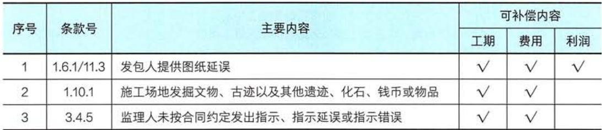

*续表*

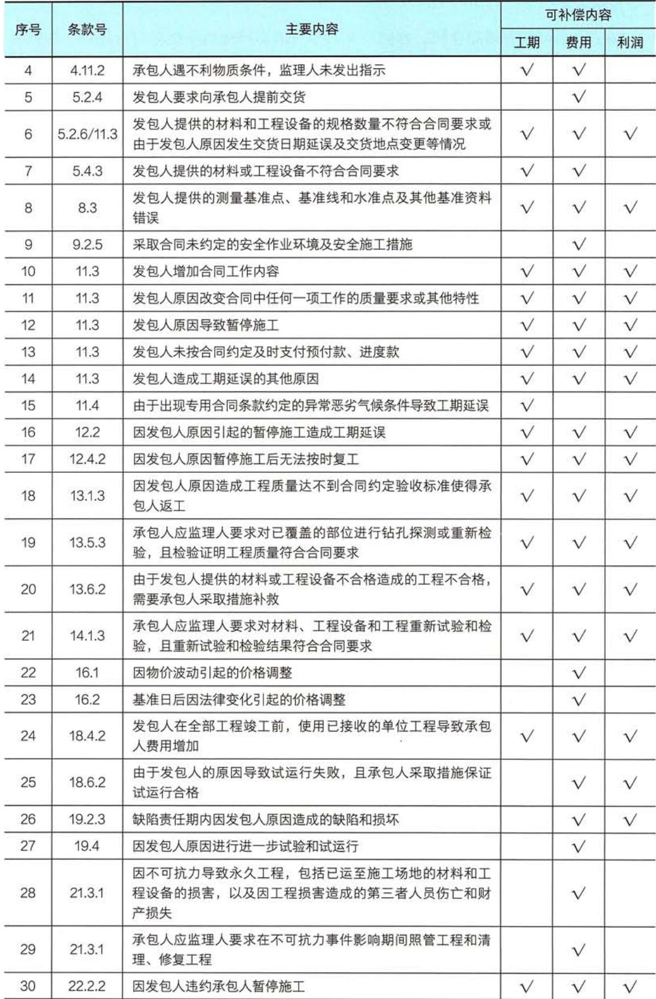

  （2）发包人索赔  

  发生索赔事件后，监理人应及时书面通知承包人，详细说明发包人有权得到的索赔金额和（或）延长缺陷责任期的细节和依据。发包人提出索赔的期限和要求与承包人提出索赔的期限和要求相同，延长缺陷责任期的通知应在缺陷责任期届满前发出。  

  监理人通过与双方当事人协商确定发包人从承包人处得到赔付的金额和（或）缺陷责任期的延长期。承包人应付给发包人的金额可从拟支付给承包人的合同价款中扣除，或由承包人以其他方式支付给发包人。

**9）违约责任**

  （1）承包人违约情形及处理  

  ① 承包人违约情形。在履行合同过程中发生的下列情况属承包人违约：  

  A.承包人违反合同约定，私自将合同的全部或部分权利转让给其他人，或私自将合同的全部或部分义务转移给其他人；B.承包人违反合同约定，未经监理人批准，私自将已按合同约定进入施工场地的施工设备、临时设施或材料撤离施工场地；C.承包人违反合同约定使用了不合格材料或工程设备，工程质量达不到标准要求，又拒绝清除不合格工程；D.承包人未能按合同进度计划及时完成合同约定的工作，已造成或预期造成工期延误；E.承包人在缺陷责任期内，未能对工程接收证书所列的缺陷清单的内容或缺陷责任期内发生的缺陷进行修复，而又拒绝按监理人指示再进行修补；  

  F.承包人无法继续履行或明确表示不履行或实质上已停止履行合同。  

  ② 对承包人违约的处理。当承包人无法继续履行或明确表示不履行或实质上已停止履行合同时，发包人可通知承包人立即解除合同，并按有关法律处理；其他违约情况发生时，监理人可向承包人发出整改通知，要求其在指定的期限内改正。承包人应承担其违约所引起的费用增加和（或）工期延误。经检查证明承包人已采取了有效措施纠正违约行为，具备复工条件的，可由监理人签发复工通知复工。  

  ③ 承包人违约解除合同。监理人发出整改通知28天后，承包人仍不纠正违约行为的，发包人可向承包人发出解除合同通知。合同解除后，发包人可派员进驻施工场地，另行组织人员或委托其他承包人施工。发包人因继续完成该工程的需要，有权扣留使用承包人在现场的材料、设备和临时设施。但发包人的这一行动不免除承包人应承担的违约责任，也不影响发包人根据合同约定享有的索赔权利。  

  （2）发包人违约情形及处理  

  ① 发包人违约情形。在履行合同过程中发生的下列情形，属发包人违约：  

  A.发包人未能按合同约定支付预付款或合同价款，或拖延、拒绝批准付款申请和支付凭证，导致付款延误的；B.发包人原因造成停工的；C.监理人无正当理由没有在约定期限内发出复工指示，导致承包人无法复工的；D.发包人无法继续履行或明确表示不履行或实质上已停止履行合同的。② 对发包人违约的处理。当发包人无法继续履行或明确表示不履行或实质上已停止履行合同时，承包人可书面通知发包人解除合同。其他违约情形发生时，承包人可向发包人发出通知，要求发包人采取有效措施纠正违约行为。发包人收到承包人通知后的28天内仍不履行合同义务，承包人有权暂停施工，并通知监理人，发包人应承担由此增加的费用和（或）工期延误，并支付承包人合理利润。承包人暂停施工28天后，发包人仍不纠正违约行为的，承包人可向发包人发出解除合同通知。但承包人的这一行动不免除发包人承担的违约责任，也不影响承包人根据合同约定享有的索赔权利。

**10）争议的解决**

  （1）争议的解决方式。发包人和承包人在履行合同中发生争议的，应进行友好协商解决或者提请争议评审组评审。友好协商解决不成、不愿提请争议评审或者不接受争议评审组意见的，可在专用合同条款中约定争议解决方式：向约定的仲裁委员会申请仲裁或者向有管辖权的人民法院提起诉讼。  

  （2）争议评审。合同约定采用争议评审的，发包人和承包人应在开工日后的28天内或在争议发生后，协商成立争议评审组。争议评审组由有合同管理和工程实践经验的专家组成。发包人和承包人接受评审意见的，由监理人根据评审意见拟定执行协议，经争议双方签字后作为合同的补充文件，并遵照执行。发包人或承包人不接受评审意见，并要求提交仲裁或提起诉讼的，应在收到评审意见后的14天内将仲裁或起诉意向书面通知另一方，并抄送监理人，但在仲裁或诉讼结束前应暂按总监理工程师的确定执行。

**4. 施工合同纠纷审理相关规定**

  为更好地审理建设工程施工合同纠纷案件，最高人民法院审判委员会于2020年12月25日通过了新的《最高人民法院关于审理建设工程施工合同纠纷案件适用法律问题的解释（一）》（法释〔2020〕25号），自2021年1月1日起施行。

**1）关于工期争议的解决**

  （1）开工日期争议解决。当事人对建设工程开工日期有争议的，人民法院应当分别按照以下情形予以认定： ① 开工日期为发包人或者监理人发出的开工通知载明的开工日期。开工通知发出后，尚不具备开工条件的，以开工条件具备的时间为开工日期；因承包人原因导致开工时间推迟的，以开工通知载明的时间为开工日期。 ② 承包人经发包人同意已经实际进场施工的，以实际进场施工时间为开工日期。 ③ 发包人或者监理人未发出开工通知，亦无相关证据证明实际开工日期的，应当综合考虑开工报告、合同、施工许可证、竣工验收报告或者竣工验收备案表等载明的时间，并结合是否具备开工条件的事实，认定开工日期。  

  （2）实际竣工日期争议解决。当事人对建设工程实际竣工日期有争议的，人民法院应当按照以下情形予以认定： ① 建设工程经峻工验收合格的，以竣工验收合格之日为竣工日期； ② 承包人已经提交竣工验收报告，发包人拖延验收的，以承包人提交验收报告之日为竣工日期； ③ 建设工程未经竣工验收，发包人擅自使用的，以转移占有建设工程之日为竣工日期。  

  （3）顺延工期争议解决。当事人约定顺延工期应当经发包人或者监理人签证等方式确认，承包人虽未取得工期顺延的确认，但能够证明在合同约定的期限内向发包人或者监理人申请过工期顺延且顺延事由符合合同约定，承包人以此为由主张工期顺延的，  

  人民法院应予支持。  

  当事人约定承包人未在约定期限内提出工期顺延申请视为工期不顺延的，按照约定处理，但发包人在约定期限后同意工期顺延或者承包人提出合理抗辩的除外。  

  建设工程峻工前，当事人对工程质量发生争议，工程质量经鉴定合格的，鉴定期间为顺延工期期间。

**2）关于工程量及价款争议的解决**

  （1）工程量争议解决。当事人对工程量有争议的，按照施工过程中形成的签证等书面文件确认。承包人能够证明发包人同意其施工，但未能提供签证文件证明工程量发生的，可以按照当事人提供的其他证据确认实际发生的工程量。  

  （2）工程计价标准及方法争议解决。当事人对建设工程的计价标准或者计价方法有约定的，按照约定结算工程价款。因设计变更导致建设工程的工程量或者质量标准发生变化，当事人对该部分工程价款不能协商一致的，可以参照签订建设工程施工合同时当地建设行政主管部门发布的计价标准或者计价方法结算工程价款。  

  （3）工程价款利息争议解决。当事人对欠付工程价款利息计付标准有约定的，按照约定处理。没有约定的，按照同期同类贷款利率或者同期贷款市场报价利率计息。  

  当事人对垫资和垫资利息有约定，承包人请求按照约定返还垫资及其利息的，人民法院应予支持，但是约定的利息计算标准高于垫资时的同类贷款利率或者同期贷款市场报价利率的部分除外。当事人对垫资没有约定的，按照工程欠款处理。当事人对垫资利息没有约定，承包人请求支付利息的，人民法院不予支持。  

  利息从应付工程价款之日开始计付。当事人对付款时间没有约定或者约定不明的，下列时间视为应付款时间： ① 建设工程已实际交付的，为交付之日； ② 建设工程没有交付的，为提交竣工结算文件之日； ③ 建设工程未交付，工程价款也未结算的，为当事人起诉之日。  

  （4）工程价款结算争议解决。当事人签订的建设工程施工合同与招标文件、投标文件、中标通知书载明的工程范围、建设工期、工程质量、工程价款不一致，一方当事人请求将招标文件、投标文件、中标通知书作为结算工程价款的依据的，人民法院应予支持。  

  当事人约定，发包人收到竣工结算文件后，在约定期限内不予答复，视为认可竣工结算文件的，按照约定处理。承包人请求按照竣工结算文件结算工程价款的，人民法院应予支持。  

  当事人约定按照固定价结算工程价款，一方当事人请求对建设工程造价进行鉴定的，人民法院不予支持。  

  （5）工程质量保证金争议解决。有下列情形之一，承包人请求发包人返还工程质量保证金的，人民法院应予支持： ① 当事人约定的工程质量保证金返还期限届满； ② 当事人未约定工程质量保证金返还期限的，自建设工程通过竣工验收之日起满2年； ③ 因发包人原因建设工程未按约定期限进行竣工验收的，自承包人提交工程峻工验收报告90日后当事人约定的工程质量保证金返还期限届满；当事人未约定工程质量保证金返还期限的，自承包人提交工程竣工验收报告90日后起满2年。发包人返还工程质量保证金后，不影响承包人根据合同约定或者法律规定履行工程保修义务。  

  （6）无效合同的价款结算争议解决。当事人就同一建设工程订立的数份建设工程施工合同均无效，但建设工程质量合格，一方当事人请求参照实际履行的合同关于工程价款的约定折价补偿承包人的，人民法院应予支持。  

  实际履行的合同难以确定，当事人请求参照最后签订的合同关于工程价款的约定折价补偿承包人的，人民法院应予支持。

#### 2.2.2 专业分包合同管理

  专业分包是工程建设领域的普遍现象。《中华人民共和国建筑法》明确规定，建筑工程总承包单位可以将承包工程中的部分工程发包给具有相应资质条件的分包单位，但除总承包合同中约定的分包外，必须经建设单位认可。为了规范建设工程专业分包行为，建设部和国家工商管理总局于2003年联合发布了《建设工程施工专业分包合同（示范文本）》GF—2003—0213。基于此示范文本并结合其他行业专业工程分包合同内容，专业分包合同管理内容分述如下。

**1. 专业分包合同文件组成及优先解释顺序**

  专业分包合同是发包人与承包人签订施工总承包合同后，承包人与分包人就分包工程施工事项经协商达成一致而订立的合同。分包人的资格能力应与其分包工程的标准和规模相适应。承包人与分包人应就分包工程向发包人承担连带责任。  

  组成专业分包合同的文件及优先解释顺序如下： ① 合同协议书； ② 中标通知书（如有时）； ③ 分包人的投标函及报价书； ④ 除总包合同工程价款之外的总包合同文件； ⑤ 专用合同条款； ⑥ 通用合同条款； ⑦ 合同工程建设标准、图纸； ⑧ 合同履行过程中，承包人和分包人协商一致的其他书面文件。  

  分包工程合同协议书除包括分包工程概况、分包合同价款、工期、工程质量标准、组成分包合同的文件外，分包人还要向承包人承诺：按照合同约定的工期和质量标准，完成分包工程并在质量保修期内承担保修责任，以及履行总包合同中与分包工程有关的承包人的所有义务，并与承包人承担履行分包工程合同及确保分包工程质量的连带责任。同时，承包人也要向分包人承诺：按照合同约定的期限和方式，支付分包合同价及其他应支付的款项。

**2. 专业分包合同有关各方的权利和义务**

**1）承包人的权利和义务**

  （1）承包人的义务。承包人应提供总包合同（有关承包工程的价格内容除外）供分包人查阅。承包人应完成的工作通常有：  

  ① 向分包人提供根据总包合同由发包人办理的与分包工程相关的各种证件、批件、各种相关资料，向分包人提供具备施工条件的施工场地；  

  ② 组织分包人参加发包人组织的图纸会审，向分包人进行设计图纸交底；  

  ③ 提供合同专用条款中约定的设备和设施，并承担因此发生的费用；  

  ④ 随时为分包人提供确保分包工程的施工所要求的施工场地和通道等，满足施工运输的需要，保证施工期间的畅通；  

  ⑤ 负责整个施工场地的管理工作，协调分包人与同一施工场地的其他分包人之间的交叉配合，确保分包人按照经批准的施工组织设计进行施工；  

  ⑥ 为运至施工场地内用于分包工程的材料和待安装设备办理保险。发包人已经办理的保险视为承包人办理的保险。  

  承包人未履行上述各项义务，导致工期延误或给分包人造成损失的，承包人赔偿分包人的相应损失，顺延延误的工期。  

  （2）承包人的权利。就分包工程范围内的有关工作，承包人随时可以向分包人发出指令，分包人应执行承包人根据分包合同所发出的所有指令。分包人拒不执行指令，承包人可委托其他施工单位完成该指令事项，发生的费用从应付给分包人的相应款项中扣除。分包人应执行经承包人确认和转发的发包人或监理人发出的所有指令和决定。

**2）分包人的责任和义务**

  （1）分包人的责任。分包人应履行并承担总包合同中与分包工程有关的承包人的所有义务与责任，同时应避免因分包人自身行为或疏漏造成承包人违反总包合同中约定的承包人义务的情况发生。  

  （2）分包人的义务。分包人应全面了解总包合同的各项规定（有关承包工程的价格内容除外）。分包人应完成的工作通常有：  

  ① 应按照分包合同的约定，对分包工程进行设计（分包合同有约定时）、施工、竣工和保修。在审阅分包合同和（或）总包合同时，或在分包合同的施工中，如发现分包工程的设计或工程建设标准、技术要求存在错误、遗漏、失误或其他缺陷，应立即通知承包人。  

  ② 按照专用合同条款约定的时间，完成规定的设计内容，报承包人确认后在分包工程中使用。承包人承担由此发生的费用。  

  ③ 向承包人提交一份详细施工组织设计，承包人应在专用合同条款约定的时间内批准，分包人方可执行。分包人不能按承包人批准的进度计划施工时，应根据承包人的要求提交一份修订的进度计划，以保证分包工程如期竣工。  

  ④ 遵守政府有关主管部门对施工场地交通、施工噪声及环境保护和安全文明生产等的管理规定，按规定办理有关手续，并以书面形式通知承包人，承包人承担由此发生的费用，因分包人责任造成的罚款除外。  

  ⑤ 应允许承包人、发包人、工程师及其三方中任何一方授权的人员在工作时间内，合理进入分包工程施工场地或材料存放的地点，以及施工场地以外与分包合同有关的分包人的任何工作或准备的地点，分包人应提供方便。  

  ⑥ 已竣工工程未交付承包人之前，分包人应负责已完分包工程的成品保护工作，保护期间发生损坏，分包人自费予以修复；承包人要求分包人采取特殊措施保护的工程部位和相应的追加合同价款，双方在专用合同条款内约定。  

  分包人必须为从事危险作业的职工办理意外伤害保险，并为施工场地内自有人员生命财产和施工机械设备办理保险，支付保险费用。

**3）分包人与发包人的关系**

  分包人须服从承包人转发的发包人或监理人与分包工程有关的指令。未经承包人允许，分包人不得以任何理由与发包人或监理人发生直接工作联系，分包人不得直接致函发包人或监理人，也不得直接接受发包人或监理人的指令。如分包人与发包人或监理人发生直接工作联系，将被视为违约，并承担违约责任，赔偿因其违约给承包人造成的  

  经济损失。

**3. 专业分包工程进度管理**

**1）开工**

  分包人应按照合同协议书约定的开工日期开工。分包人不能按时开工，应在不迟于合同协议书约定的开工日期前5天，以书面形式向承包人提出延期开工的理由。承包人应在接到延期开工申请后的48h内以书面形式答复分包人。承包人在接到延期开工申请后 48h 内不答复，视为同意分包人要求，工期相应顺延。承包人不同意延期要求或分包人未在规定时间内提出延期开工要求，工期不予顺延。因承包人原因不能按照合同协议书约定的开工日期开工，项目经理应以书面形式通知分包人，推迟开工日期。承包人赔偿分包人因延期开工造成的损失，并相应顺延工期。

**2）工期延误**

  因下列原因之一造成分包工程工期延误，经项目经理确认，工期相应顺延：  

  （1）承包人根据总包合同从工程师处获得与分包合同相关的竣工时间延长；（2）承包人未按分包合同专用条款的约定提供图纸、开工条件、设备设施、施工场地；（3）承包人未按约定日期支付工程预付款、进度款，致使分包工程施工不能正常进行；（4）项目经理未按分包合同约定提供所需的指令、批准或所发出的指令错误，致使分包工程施工不能正常进行；（5）非分包人原因的分包工程范围内的工程变更及工程量增加；（6）不可抗力的原因；（7）分包工程专用合同条款中约定的或项目经理同意工期顺延的其他情况。分包人应在上述约定情况发生后14天内，就延误的工期以书面形式向承包人提出报告。承包人在收到报告后14天内予以确认，逾期不予确认也不提出修改意见，视为同意顺延工期。

**3）暂停施工**

  发包人或监理人认为确有必要暂停施工时，应以书面形式通过承包人向分包人发出暂停施工指令，并在提出要求后48h内提出书面处理意见。分包人停工和复工程序及暂停施工所发生的费用，按总包合同相应条款履行。

**4）工程竣工**

  分包人应按照分包合同协议书约定的竣工日期或承包人同意顺延的工期竣工。因分包人原因不能按照分包合同协议书约定的竣工日期或承包人同意顺延的工期竣工的，分包人承担违约责任。

**4. 专业分包工程质量管理**

  分包工程质量应达到分包合同协议书和专用合同条款约定的工程质量标准，质量评定标准按照总包合同相应条款履行。因分包人原因工程质量达不到约定的质量标准，分包人应承担违约责任。双方对工程质量的争议，按照总包合同相应的条款履行。分包工程的检查、验收及工程试车等，按照总包合同相应的条款履行。分包人应就分包工程向承包人承担总包合同约定的承包人应承担的义务，但并不免除承包人根据总包合同应  

  承担的总包质量管理的责任。  

  分包人应允许并配合承包人或监理人进入分包人施工场地检查工程质量。

**5. 专业分包工程计量与工程款支付**

**1）合同价款及调整**

  分包工程合同价款在分包合同协议书中约定后，任何一方不得擅自改变。分包合同价款与总包合同相应部分价款无任何连带关系。分包工程合同价款应与总包合同约定的方式一致，通常有三种方式：  

  （1）固定价格。双方在分包工程专用合同条款中约定合同价款包含的风险范围和风险费用的计算方法，在约定的风险范围内合同价款不再调整。风险范围以外的合同价款调整方法，应在专用合同条款中约定。  

  （2）可调价格。双方在专用合同条款中约定合同价款调整方法。可调整合同价款的因素包括：市场价格波动、法律变化及双方约定的其他因素。  

  市场价格波动超过分包合同当事人约定的范围，分包合同价格应当调整。因市场价格波动引起的价格调整金额列入最近一期进度付款申请单，经承包人批准后列入进度付款。  

  基准日期后，因法律变化导致分包人在合同履行过程中所需要的费用发生约定以外的增加时，由承包人承担由此增加的费用；减少时，应从合同价格中予以扣减。基准日期后，因法律变化造成工期延误时，工期应予以顺延。因法律变化引起的价格调整金额列入最近一期进度付款申请单，经承包人批准后列入进度付款。  

  分包人应在上述情况发生后10天内，将调整原因、金额以书面形式通知承包人，承包人确认调整金额后作为追加合同价款，与工程价款同期支付。承包人收到通知后10天内不予确认也不提出修改意见的，视为已同意该项调整。  

  （3）成本加酬金。合同价款包括成本和酬金两部分，双方在分包工程专用合同条款中约定成本构成和酬金计算方法。

**2）工程量的确认**

  分包人应按分包工程专用合同条款约定的时间向承包人提交已完工程量报告，承包人接到报告后7天内自行按设计图纸计量或报经监理人计量。承包人在自行计量或由监理人计量前24h应通知分包人，分包人为计量提供便利条件并派人参加。分包人收到通知后不参加计量，计量结果有效，作为工程价款支付的依据；承包人不按约定时间通知分包人，致使分包人未能参加计量，计量结果无效。承包人在收到分包人报告后7天内未进行计量或因监理人原因未计量的，从第8天起，分包人报告中开列的工程量即视为被确认，作为工程价款支付的依据。  

  分包人未按分包工程专用合同条款约定的时间向承包人提交已完工程量报告，或其所提交的报告不符合承包人要求且未做整改的，承包人不予计量。此外，对分包人自行超出设计图纸范围和因分包人原因造成返工的工程量，承包人也不予计量。

**3）合同价款的支付**

  实行工程预付款的，双方应在分包工程专用合同条款中约定：承包人向分包人预付工程款的时间和数额，开工后按约定的时间和比例逐次扣回；在确认计量结果后10天内，承包人向分包人支付工程款（进度款）；按约定时间承包人应扣回的预付款，与  

  工程款（进度款）同期结算。  

  分包合同约定的工程变更调整的合同价款、合同价款的调整、索赔的价款或费用及其他约定的追加合同价款，应与工程进度款同期调整支付。承包人超过约定的支付时间不支付工程款（预付款、进度款），分包人可向承包人发出要求付款的通知。承包人不按分包合同约定支付工程款（预付款、进度款），导致施工无法进行，分包人可停止施工，由承包人承担违约责任。

**6. 专业分包工程安全文明施工和环境保护**

  分包人应遵守工程建设安全生产有关管理规定，严格按照安全标准组织施工，承担由于自身安全措施不力造成事故的责任和因此发生的费用。在施工场地涉及危险地区或需要安全防护措施施工时，分包人应提出安全防护措施，经承包人批准后实施，发生的相应费用由承包人承担。

**7. 专业分包工程变更**

  在分包工程实施中，监理人有时会根据总包合同作出变更指令，该变更指令由监理人作出并经承包人确认后通知分包人；有时承包人也会作出变更指令，分包人应根据以上指令，以更改、增补或省略的方式对分包工程进行变更。  

  分包人不执行从发包人或监理人处直接收到的未经承包人确认的有关分包工程变更的指令。如分包人直接收到此类变更指令，应立即通知项目经理并向项目经理提供一份该直接指令的复印件。项目经理应在 24h 内提出关于对该指令的处理意见。

**8. 专业分包工程完工验收和移交**

  分包工程具备竣工验收条件的，分包人应向承包人提供完整的竣工资料及竣工验收报告。承包人应在收到分包人提供的竣工验收报告之日起3日内通知发包人进行验收，分包人应配合承包人进行验收。根据总包合同无需由发包人验收的部分，承包人应按照总包合同约定的验收程序自行验收。发包人未能按照总包合同及时组织验收的，承包人应按照总包合同规定的发包人验收的期限及程序自行组织验收，并视为分包工程竣工验收通过。分包工程竣工验收未能通过且属于分包人原因的，分包人负责修复相应缺陷并承担相应的质量责任。  

  分包工程竣工日期为分包人提供竣工验收报告之日。需要修复的，为提供修复后竣工报告之日。

**9. 专业分包工程竣工结算及保修责任**

**1）竣工结算**

  分包工程竣工验收报告经承包人认可后14天内，分包人向承包人递交分包工程竣工结算报告及完整的结算资料，双方按照分包合同协议书约定的合同价款及专用合同条款约定的合同价款调整内容，进行工程竣工结算。  

  承包人收到分包人递交的分包工程竣工结算报告及结算资料后28天内进行核实，给予确认或者提出明确的修改意见。承包人确认峻工结算报告后7天内向分包人支付分包工程竣工结算价款。分包人收到竣工结算价款之日起7天内，将竣工工程交付承包人。  

  承包人收到分包工程竣工结算报告及结算资料后28天内无正当理由不支付工程竣工结算价款，从第29天起按分包人同期向银行贷款利率支付拖欠工程价款的利息，并  

  承担违约责任。

**2）保修责任**

  在包括分包工程的总包工程竣工交付使用后，分包人应按国家有关规定对分包工程出现的缺陷进行保修，具体保修责任按照分包人与承包人在工程竣工验收之前签订的质量保修书执行。

**10. 专业分包工程索赔管理**

  专业分包工程的索赔程序与总包工程索赔类似，只是专业分包合同中对于索赔时间的约定与总包合同中的约定有些差异。  

  除应由承包人承担的风险外，分包人应保障承包人免于承受在分包工程施工过程中及修补缺陷引起的下列损失、索赔及与此有关的索赔、诉讼、损害赔偿： ① 人员的伤亡； ② 分包工程以外的任何财产的损失或损害。  

  承包人应保障分包人免于承担与下列事宜有关的索赔、诉讼、损害赔偿费、诉讼费、指控费和其他开支： ① 按分包合同约定，实施和完成分包合同以及保修过程当中所导致的无法避免的对财产的损害； ② 由于发包人、承包人或其他分包商的行为或疏忽造成的人员伤亡或财产损失或损害，或与此相关的索赔、诉讼等。  

  以上损失均应由造成损失的责任方承担。

**11. 专业分包违约**

**1）承包人违约**

  当发生下列情况之一时，视为承包人违约：  

  （1）承包人不按分包合同的约定支付工程预付款、工程进度款，导致施工无法进行；（2）承包人不按分包合同的约定支付工程竣工结算价款；（3）承包人不履行分包合同义务或不按分包合同约定履行义务的其他情况。  

  承包人承担违约责任，赔偿因其违约给分包人造成的经济损失，顺延延误的工期。双方在分包专用合同条款中约定承包人赔偿分包人损失的计算方法或承包人应当支付违约金的数额。

**2）分包人违约**

  当发生下列情况之一时，视为分包人违约：  

  （1）分包人与发包人或监理人发生直接工作联系；（2）分包人将其承包的分包工程转包或再分包；（3）因分包人原因不能按照分包合同协议书约定的峻工日期或承包人同意顺延的工期竣工；（4）因分包人原因工程质量达不到约定的质量标准；（5）分包人不履行分包合同义务或不按分包合同约定履行义务的其他情况。  

  如分包人有违反分包合同的行为，分包人应保障承包人免于承担因此违约造成的工期延误、经济损失及根据总包合同承包人将负责的任何赔偿费，在此情况下，承包人可从本应支付分包人的任何价款中扣除此笔经济损失及赔偿费，并且不排除采用其他补救方法的可能。

#### 2.2.3 劳务分包合同管理

  建设工程施工劳务分包合同是指在发包人与工程承包人签订总承包合同或专业分包合同后，工程承包人（施工总承包人或专业工程分包人）与劳务分包人就劳务分包事项协商达成一致签订的合同。为了规范工程建设领域普遍存在的劳务分包行为，建设部和国家工商总局于2003年联合发布了《建设工程施工劳务分包合同（示范文本）》GF—2003一0214，基于此示范文本并结合其他行业劳务分包合同内容，劳务分包合同管理内容分述如下。

**1. 劳务分包合同文件组成及优先解释顺序**

  劳务分包合同文件组成及优先解释顺序如下： ① 劳务分包合同； ② 劳务分包合同附件； ③ 工程施工总承包合同； ④ 工程施工专业承（分）包合同。

**2. 劳务分包合同有关各方义务**

**1）工程承包人义务**

  （1）组建与工程相适应的项目管理班子，全面履行总（分）包合同，组织实施施工管理的各项工作，对工程的工期和质量向发包人负责；负责与发包人、监理、设计及有关部门联系，协调现场工作关系。  

  （2）工程承包人完成劳务分包人施工前期的工作并承担相应费用。前期工作一般包括向劳务分包人交付具备合同项下劳务作业开工条件的施工场地；完成水、电、热、电信等施工管线和施工道路，并满足完成合同劳务作业所需的能源供应、通信及施工道路畅通的时间和质量要求；向劳务分包人提供相应的工程地质和地下管网线路资料；办理包括各种证件、批件、规费的工作手续（但涉及劳务分包人自身的手续除外）；向劳务分包人提供相应的水准点与坐标控制点位置；向劳务分包人提供生产、生活临时设施。合同当事人还应在合同中约定上述工作交付的时间及相应的校验要求、保护责任等事宜。  

  （3）负责编制施工组织设计，统一制定各项管理目标，组织编制年、季、月施工计划，物资需用量计划表，实施对工程质量、工期、安全生产、文明施工、计量检测、实验化验的控制、监督、检查和验收。  

  （4）负责工程测量定位、沉降观测、技术交底，组织图纸会审，统一安排技术档案资料的收集整理及交工验收；按时提供图纸，及时交付应供材料、设备，所提供的施工机械设备、周转材料、安全设施保证施工需要。  

  （5）统筹安排、协调解决非劳务分包人独立使用的生产、生活临时设施、工作用水、用电及施工场地。  

  （6）按劳务分包合同约定，向劳务分包人支付劳动报酬。

**2）劳务分包人义务**

  （1）对劳务分包合同劳务分包范围内的工程质量向工程承包人负责，组织具有相应资格证书的熟练工人投入工作；服从工程承包人转发的发包人及监理人的指令；未经工程承包人授权或允许，不得擅自与发包人及有关部门建立工作联系；自觉遵守法律法规及有关规章制度。  

  （2）劳务分包人根据施工组织设计总进度计划的要求，每月底前需提交下月施工计划，有阶段工期要求的提交阶段施工计划，必要时按工程承包人要求提交旬、周施工计划，以及与完成上述阶段、时段施工计划相应的劳动力安排计划，经工程承包人批准后严格实施。  

  （3）严格按照设计图纸、施工验收规范、有关技术要求及施工组织设计精心组织施工，确保工程质量达到约定的标准；承担由于自身责任造成的质量修改、返工、工期拖延、安全事故、现场脏乱造成的损失及各种罚款；做好施工场地周围建筑物、构筑物和地下管线和已完工程部分的成品保护工作，因劳务分包人责任发生损坏，劳务分包人自行承担由此引起的一切经济损失及各种罚款。  

  （4）劳务分包人应对其作业内容的实施、完工负责，劳务分包人应承担并履行总（分）包合同约定的、与劳务作业有关的所有义务及工作程序。

**3. 劳务作业人员管理**

**1）劳务实名制管理**

  根据《建筑工人实名制管理办法（试行）》，全面实行建筑业农民工实名制管理制度，坚持建筑企业与农民工先签订劳动合同后进场施工。建筑企业应与招用的建筑工人依法签订劳动合同，对其进行基本安全培训，并在相关建筑工人实名制管理平台上登记，方可允许其进人施工现场从事与建筑作业相关的活动。进人施工现场的建设单位、承包单位、监理单位的项目管理人员及建筑工人均纳入建筑工人实名制管理范畴。总承包企业（包括施工总承包、工程总承包及依法与建设单位直接签订合同的专业承包企业）对所承接工程项目的建筑工人实名制管理负总责，分包企业对其招用的建筑工人实名制管理负直接责任，配合总承包企业做好相关工作。

**2）安全教育**

  工程承包人应对其在施工场地的工作人员进行安全教育，并对他们的安全负责。工程承包人不得要求劳务分包人违反安全管理规定进行施工。因工程承包人原因导致的安全事故，由工程承包人承担相应责任及发生的费用。

**3）安全生产**

  劳务分包人在动力设备、输电线路、地下管道、密封防震车间、易燃易爆地段及临街交通要道附近施工时，施工开始前应向工程承包人提出安全防护措施，经工程承包人认可后实施，防护措施费用由工程承包人承担。另外，劳务分包人在施工现场内使用的安全保护用品（如安全帽、安全带及其他保护用品），由劳务分包人提供使用计划，经工程承包人批准后，由工程承包人负责供应。  

  由于劳务分包人安全措施不力造成事故的责任和因此而发生的费用，由劳务分包人承担。

**4. 相关保险的办理**

  劳务分包人施工开始前，工程承包人应获得发包人为施工场地内的自有人员及第三人人员生命财产办理的保险，且不需劳务分包人支付保险费用。运至施工场地用于劳务施工的材料和待安装设备，由工程承包人办理或获得保险，且不需劳务分包人支付保险费用。此外，工程承包人还必须为租赁或提供给劳务分包人使用的施工机械设备办理保险，并支付保险费用，并应在劳务分包合同中约定工程承包人自行投保的范围（内容）。  

  劳务分包人必须为从事危险作业的职工办理意外伤害保险，并为施工场地内自有人员生命财产和施工机械设备办理保险，支付保险费用。

**5. 劳务作业计量与支付**

**1）劳务报酬的计算方式**

  劳务报酬的计算通常有以下三种方式： ① 固定劳务报酬（含管理费）； ② 约定不同工种劳务的计时单价（含管理费），按确认的工时计算； ③ 约定不同工作成果的计件单价（含管理费），按确认的工程量计算。  

  具体采用哪种采用方式由合同当事人约定，一般会约定一次包死，不再调整。不过，有的采用固定劳务报酬或单价的劳务分包合同还约定了可以调价的情形。如市场人工价格变化幅度较大或者后续法律及政策变化导致劳务价格发生变化的，可以按价格变化幅度予以调整。

**2）工时及工程量的确认**

  （1）按确定的工时计算劳务报酬的，由劳务分包人每日将提供劳务人数报工程承包人，由工程承包人确认。  

  （2）按确认的工程量计算劳务报酬的，由劳务分包人按月（或旬、日）将完成的工程量报工程承包人，由工程承包人确认。对劳务分包人未经工程承包人认可，超出设计图纸范围和因劳务分包人原因造成返工的工程量，工程承包人不予计量。

**3）劳务报酬的支付**

  （1）劳务报酬中间支付。采用固定劳务报酬方式支付劳务报酬的，劳务分包人与工程承包人应约定具体的支付时间节点；采用计时单价或计件单价方式支付劳务报酬的，劳务分包人与工程承包人双方约定支付方法。调整的劳务报酬、工程变更调整的劳务报酬及其他条款中约定的追加劳务报酬，应与上述劳务报酬同期调整支付。  

  （2）劳务报酬最终支付。全部工作完成，经工程承包人认可后14天内，劳务分包人向工程承包人递交完整的结算资料，双方按照合同约定的计价方式，进行劳务报酬的最终支付。  

  工程承包人收到劳务分包人递交的结算资料后14天内进行核实，给予确认或者提出修改意见。工程承包人确认结算资料后14天内向劳务分包人支付劳务报酬尾款。

**6. 施工变更的处理**

  施工中如发生对原工作内容进行变更，工程承包人项目经理应提前7天以书面形式向劳务分包人发出变更通知，并提供变更的相应图纸和说明。劳务分包人按照工程承包人（项目经理）发出的变更通知及有关要求，进行需要的变更。  

  因变更导致劳务报酬的增加及造成的劳务分包人损失，由工程承包人承担，延误的工期相应顺延；因变更减少工程量，劳务报酬应相应减少，工期相应调整。  

  施工中劳务分包人不得对原工程设计进行变更。因劳务分包人擅自变更设计发生的费用和由此导致工程承包人的直接损失，由劳务分包人承担，延误的工期不予顺延。因劳务分包人自身原因导致的工程变更，劳务分包人无权要求追加劳务报酬。

**7. 施工配合与验收**

**1）施工配合**

  劳务分包人应配合工程承包人对其工作进行的初步验收，以及工程承包人按发包人或建设行政主管部门要求进行的涉及劳务分包人工作内容、施工场地的检查、隐蔽工程验收及工程竣工验收。工程承包人或施工场地内第三方的工作必须由劳务分包人配合时，劳务分包人应按工程承包人的指令予以配合。除上述初步验收、隐蔽工程验收及工程竣工验收之外，劳务分包人因提供上述配合而发生的工期损失和费用由工程承包人承担。  

  劳务分包人按约定完成劳务作业，必须由工程承包人或施工场地内的第三方进行配合时，工程承包人应配合劳务分包人工作或确保劳务分包人获得该第三方的配合，且工程承包人应承担因此而发生的费用。

**2）施工验收**

  劳务分包人应确保所完成施工的质量，应符合合同约定的质量标准。劳务分包人施工完毕，应向工程承包人提交完工报告，通知工程承包人验收；工程承包人应在收到劳务分包人的上述报告后7天内对劳务分包人施工成果进行验收，验收合格或者工程承包人在上述期限内未组织验收的，视为劳务分包人已完成合同约定工作。但工程承包人与发包人间的隐蔽工程验收结果或工程竣工验收结果表明劳务分包人施工质量不合格时，劳务分包人应负责无偿修复，不延长工期，并承担由此导致的工程承包人的相关损失。  

  全部工程竣工（包括劳务分包人完成工作在内）一经发包人验收合格，劳务分包人对其分包的劳务作业的施工质量不再承担责任，在质量保修期内的质量保修责任由工程承包人承担。

**8. 不可抗力事件的处理**

**1）不可抗力事件的应对**

  不可抗力事件发生后，劳务分包人应立即通知工程承包人项目经理，并在力所能及的条件下迅速采取措施，尽力减少损失。工程承包人应协助劳务分包人采取措施。工程承包人项目经理认为劳务分包人应当暂停工作，劳务分包人应暂停工作。  

  不可抗力事件结束后 48h 内，劳务分包人向工程承包人项目经理通报受害情况和损失情况，及预计清理和修复的费用。不可抗力事件持续发生，劳务分包人应每隔7天向工程承包人项目经理通报一次受害情况。不可抗力结束后14天内，劳务分包人应向工程承包人项目经理提交清理和修复费用的正式报告和有关资料。

**2）不可抗力事件损失的分担原则**

  因不可抗力事件导致工作时间延误的，应相应顺延时间。因不可抗力事件造成的费用应按以下原则分担：  

  （1）工程本身的损害、因工程损害导致第三方人员伤亡和财产损失以及运至施工场地用于劳务作业的材料和待安装的设备的损害，由工程承包人承担。  

  （2）工程承包人和劳务分包人的人员伤亡由其所在单位负责，并承担相应费用。  

  （3）劳务分包人自有机械设备损坏及停工损失，由劳务分包人自行承担。  

  （4）工程承包人提供给劳务分包人使用的机械设备损坏，由工程承包人承担，但停工损失由劳务分包人自行承担。  

  （5）停工期间，劳务分包人应工程承包人项目经理要求留在施工场地的必要的管理人员及保卫人员的费用，由工程承包人承担。  

  （6）工程所需清理、修复费用，由工程承包人承担。

#### 2.2.4 材料设备采购合同管理

  建设工程材料设备采购合同属于买卖合同，是指出卖人向买受人转移建设工程材料设备，买受人支付价款的合同。国家发展和改革委员会等九部委于2017年联合发布了《标准材料采购招标文件》和《标准设备采购招标文件》，其中通用合同条款规定了建设工程材料设备采购合同的主要内容。

**1. 材料采购合同管理**

**1）材料采购合同文件组成及优先解释顺序**

  材料采购合同文件组成及优先解释顺序如下： ① 合同协议书； ② 中标通知书；  

  ③ 投标函； ④ 商务和技术偏差表； ⑤ 专用合同条款； ⑥ 通用合同条款； ⑦ 供货要求；  
  ⑧ 分项报价表； ⑨ 中标材料质量标准的详细描述； ⑩ 相关服务计划。有些材料采购合同文件的最后还会附上其他相关的合同文件。

**2）合同价格与支付**

  （1）合同价格。材料采购合同协议书中载明的签约合同价包括卖方为完成合同全部义务应承担的一切成本、费用和支出及卖方的合理利润。供货周期不超过12个月的签约合同价通常为固定价格。供货周期超过12个月且合同材料交付时材料价格变化超过专用合同条款约定的幅度的，双方应按照专用合同条款中约定的调整方法对合同价格进行调整。  

  （2）合同价款支付。除专用合同条款另有约定外，买方应通过以下方式和比例向卖方支付合同价款。  

  ① 预付款：合同生效后，买方在收到卖方开具的注明应付预付款金额的财务收据正本一份并经审核无误后28日内，向卖方支付签约合同价的 10% 作为预付款。买方支付预付款后，如卖方未履行合同义务，则买方有权收回预付款；如卖方依约履行了合同义务，则预付款抵作进度款。  

  ② 进度款：卖方按照合同约定的进度交付合同材料并提供相关服务后，买方在收到卖方提交的下列单据并经审核无误后28日内，应向卖方支付进度款，进度款支付至该批次合同材料的合同价格的 95% ：卖方出具的交货清单正本一份；买方签署的收货清单正本一份；制造商出具的出厂质量合格证正本一份；合同材料验收证书或进度款支付函正本一份；合同价格 100% 金额的增值税发票正本一份。  

  ③ 结清款：全部合同材料质量保证期届满后，买方在收到卖方提交的由买方签署的质量保证期届满证书并经审核无误后28日内，向卖方支付合同价格 5% 的结清款。  

  （3）买方扣款的权利。当卖方应向买方支付合同项下的违约金或赔偿金时，买方有权从上述任何一笔应付款中予以直接扣除和（或）兑付履约保证金。

**3）包装、标记、运输与交付**

  （1）包装。卖方应对合同材料进行妥善包装，以满足合同材料运至施工场地及在施工场地保管的需要。包装应采取防潮、防晒、防锈、防腐蚀、防振动及防止其他损坏的必要保护措施，从而保护合同材料能够经受多次搬运、装卸、长途运输并适宜保管。买方无需将包装物退还给卖方。  

  （2）标记。除专用合同条款另有约定外，卖方应按合同约定在材料包装上以不可擦除的、明显的方式作出必要的标记。根据合同材料的特点和运输、保管的不同要求，卖方应对合同材料清楚地标注“小心轻放”“此端朝上，请勿倒置”“保持干燥”等字样和其他适当标记。如果合同材料中含有易燃易爆物品、腐蚀物品、放射性物质等危险品，卖方应标明危险品标志。  

  （3）运输。卖方应自行选择适宜的运输工具及线路安排合同材料运输。  

  （4）交付。除专用合同条款另有约定外，卖方应根据合同约定的交付时间和批次在施工场地卸货后将合同材料交付给买方，买方对卖方交付的合同材料的外观及件数进行清点核验后应签发收货清单。买方签发收货清单不代表对合同材料的接受，双方还应按合同约定进行后续的检验和验收。  

  合同材料的所有权和风险自交付时起由卖方转移至买方，合同材料交付给买方之前包括运输在内的所有风险均由卖方承担。

**4）检验和验收**

  合同材料交付前，卖方应对其进行全面检验，并在交付合同材料时向买方提交合同材料的质量合格证书。  

  合同材料交付后，买方应在专用合同条款约定的期限内安排对合同材料的规格、质量等进行检验。专用合同条款可约定下列检验方式中的一种：  

  ① 由买方对合同材料进行检验；  

  ② 由专用合同条款约定的拥有资质的第三方检验机构对合同材料进行检验；  

  ③ 专用合同条款约定的其他方式。  

  买方应在检验日期3日前将检验的时间和地点通知卖方，卖方应自负费用派遣代表参加检验。若卖方未按买方通知到场参加检验，则检验可正常进行，卖方应接受对合同材料的检验结果。合同材料经检验合格，买卖双方应签署合同材料验收证书一式二份，双方各持一份。合同材料验收证书的签署不能免除卖方在质量保证期内对合同材料应承担的保证责任。

**5）质量保证期和履约保证金**

  除专用合同条款和（或）供货要求等合同文件另有约定外，合同材料的质量保证期自合同材料验收之日起算，至合同材料验收证书或进度款支付函签署之日起12个月止（以先到的为准）。质量保证期届满且卖方按照合同约定履行完毕质量保证期内义务后，买方应在7日内向卖方出具合同材料的质量保证期届满证书。  

  除非因买方使用不当，合同材料在质量保证期内如破损、变质或被发现存在任何质量问题，卖方应负责对合同材料进行修补和退换。更换的合同材料的质量保证期应重新计算。  

  除专用合同条款另有约定外，履约保证金自合同生效之日起生效，在合同材料验收证书或进度款支付函签署之日起28日后失效。如果卖方不履行合同约定的义务或其履行不符合合同的约定，买方有权扣划相应金额的履约保证金。

**6）违约责任**

  合同一方不履行合同义务、履行合同义务不符合约定或者违反合同项下所作保证的，应向对方承担继续履行、采取补救措施或者赔偿损失等违约责任。  

  卖方未能按时交付合同材料的，应向买方支付迟延交货违约金。卖方支付迟延交  

  货违约金，不能免除其继续交付合同材料的义务。迟延交付违约金的计算方法如下：  

  迟延交付违约金 = 迟延交付材料金额 ×0.08%× 迟延交货天数  

  迟延交付违约金的最高限额为合同价格的 10% 。  

  买方未能按合同约定支付合同价款的，应向卖方支付延迟付款违约金。迟延付款违约金的计算方法如下：  

  迟延付款违约金 = 迟延付款金额 ×0.08%× 迟延付款天数  

  迟延付款违约金的总额不得超过合同价格的 10% 。

**2. 设备采购合同管理**

  设备采购合同管理与材料采购合同管理有很多内容基本相同，故此处仅介绍与材料采购合同管理有差异的部分。

**1）设备采购合同文件组成及优先解释顺序**

  设备采购合同文件的组成及优先解释顺序与前述材料采购合同文件的组成及优先解释顺序基本相同，仅在于“ ⑨ 中标设备技术性能指标的详细描述”和“ ⑩ 技术服务和质保期服务计划”内容不同。

**2）合同价格与支付**

  （1）合同价格。设备采购合同协议书中载明的签约合同价通常为固定价格，包括卖方为完成合同全部义务应承担的一切成本、费用和支出及卖方合理利润。  

  （2）价款支付。设备采购价款的支付比较复杂，除专用合同条款另有约定外，买方应通过以下方式和比例向卖方支付合同价款：  

  ① 合同生效后，买方在收到卖方开具的注明应付预付款金额的财务收据正本一份并经审核无误后28日内，向卖方支付签约合同价的 10% 作为预付款。  

  买方支付预付款后，如卖方未履行合同义务，则买方有权收回预付款；如卖方依约履行了合同义务，则预付款抵作合同价款。  

  ② 卖方按合同约定交付全部合同设备后，买方在收到卖方提交的下列全部单据并经审核无误后28日内，向卖方支付合同价格的 60% ：卖方出具的交货清单正本一份；买方签署的收货清单正本一份；制造商出具的出厂质量合格证正本一份；合同价格100% 金额的增值税发票正本一份。  

  ③ 买方在收到卖方提交的买卖双方签署的合同设备验收证书或已生效的验收款支付函正本一份并经审核无误后28日内，向卖方支付合同价格的 25% 。  

  ④ 买方在收到卖方提交的买方签署的质量保证期届满证书或已生效的结清款支付函正本一份并经审核无误后28日内，向卖方支付合同价格的 5% 。  

  如果依照合同卖方应向买方支付费用的，买方有权从结清款中直接扣除该笔费用。  

  除专用合同条款另有约定外，在买方向卖方支付验收款的同时或其后的任何时间内，卖方可在向买方提交买方可接受的金额为合同价格 5% 的合同结清款保函的前提下，要求买方支付合同结清款，买方不得拒绝。  

  当卖方应向买方支付合同项下的违约金或赔偿金时，买方有权从上述任何一笔应付款中予以直接扣除和（或）兑付履约保证金。

**3）监造和交货前检验**

  （1）监造。与材料采购合同不同的是，为了保证设备质量，通常会在专用合同条款中约定，在合同设备制造过程中，买方可派出监造人员，对合同设备的生产制造进行监造，监督合同设备制造、检验等情况。设备监造的范围、方式等应符合专用合同条款和（或）供货要求等合同文件的约定。  

  除专用合同条款和（或）供货要求等合同文件另有约定外，买方监造人员可到合同设备及其关键部件的生产制造现场进行监造，卖方应予配合。买方监造人员的交通、食宿费用由买方承担。买方监造人员在监造中如发现合同设备及其关键部件不符合合同约定的标准，则有权提出意见和建议。卖方应采取必要措施消除合同设备的不符，由此增加的费用和（或）造成的延误由卖方负责。  

  买方监造人员对合同设备的监造，不视为对合同设备质量的确认，不影响卖方交货后买方依照合同约定对合同设备提出质量异议和（或）退货的权利，也不免除卖方依照合同约定对合同设备所应承担的任何义务或责任。  

  （2）交货前检验。有些专用合同条款约定买方参与交货前检验的，合同设备交货前，卖方应会同买方代表根据合同约定对合同设备进行交货前检验并出具交货前检验记录，有关费用由卖方承担。卖方应免费为买方代表提供工作条件及便利，包括但不限于必要的办公场所、技术资料、检测工具及出入许可等。除专用合同条款另有约定外，买方代表的交通、食宿费用由买方承担。  

  值得注意的是，买方监造人员对合同设备的监造以及买方代表参与交货前检验及签署交货前检验记录的行为，不视为对合同设备质量的确认，不影响卖方交货后买方依照合同约定对合同设备提出质量异议和（或）退货的权利，也不免除卖方依照合同约定对合同设备所应承担的任何义务或责任。

**4）包装、标记、运输和交付**

  设备的包装、标记与材料采购合同约定基本相同，主要是在设备运输和交付方面的约定有所不同。  

  （1）运输。卖方应自行选择适宜的运输工具及线路安排合同设备运输。除专用合同条款另有约定外，每件能够独立运行的设备应整套装运。设备安装、调试、考核和运行所使用的备品、备件、易损易耗件等应随相关的主机一起装运。卖方应在合同设备预计启运7日前，将合同设备名称、数量、箱数、总毛重、总体积（用 m³ 表示）、每箱尺寸（长 × 宽 × 高）、装运合同设备总金额、运输方式、预计交付日期和合同设备在运输、装卸、保管中的注意事项等预通知买方，并在合同设备启运后 24h 之内正式通知买方。  

  （2）交付。卖方应根据合同约定的交付时间和批次在施工场地车面上将合同设备交付给买方。买方对卖方交付的包装的合同设备的外观及件数进行清点核验后应签发收货清单，并自负风险和费用进行卸货。买方签发收货清单不代表对合同设备的接受，双方还应按合同约定进行后续的检验和验收。  

  合同设备的所有权和风险自交付时起由卖方转移至买方，合同设备交付给买方之前包括运输在内的所有风险均由卖方承担。

**5）开箱检验和安装、调试、验收**

  （1）开箱检验。合同设备交付后应进行开箱检验，即合同设备数量及外观检验。开箱检验应在合同设备交付时或合同设备交付后的一定期限内，具体时间需要在专用合同  

  条款中约定。  

  开箱检验的检验结果不能对抗在合同设备的安装、调试、考核、验收中及质量保证期内发现的合同设备质量问题，也不能免除或影响卖方依照合同约定对买方负有的包括合同设备质量在内的任何义务或责任。  

  （2）安装、调试。开箱检验完成后，双方应对合同设备进行安装、调试，以使其具备考核的状态。安装、调试应按照专用合同条款约定的下列任一种方式进行： ① 卖方按照合同约定完成合同设备的安装、调试工作； ② 买方或买方安排第三方负责合同设备的安装、调试工作，卖方提供技术服务。  

  在安装、调试过程中，由于买方或买方安排的第三方未按照卖方现场服务人员的指导导致安装、调试不成功和（或）出现合同设备损坏的，买方应自行承担责任。在买方或买方安排的第三方按照卖方现场服务人员的指导进行安装、调试的情况下出现安装、调试不成功和（或）造成合同设备损坏的，卖方应承担责任。安装、调试中合同设备运行需要的用水、用电、其他动力和原材料（如需要）等均由买方承担。  

  （3）考核。安装、调试完成后，双方应对合同设备进行考核，以确定合同设备是否达到合同约定的技术性能考核指标。除专用合同条款另有约定外，考核中合同设备运行需要的用水、用电、其他动力和原材料（如需要）等均由买方承担。  

  由于卖方原因合同设备在考核中未能达到合同约定的技术性能考核指标的，卖方应在双方同意的期限内采取措施消除合同设备中存在的缺陷，并在缺陷消除后尽快进行再次考核。  

  由于卖方原因未能达到技术性能考核指标时，为卖方进行考核的机会不超过三次。因卖方原因三次考核均未能达到合同约定的技术性能考核指标的，买卖双方应就合同的后续履行进行协商，协商不成的，买方有权解除合同。倘若合同已约定或双方在考核中另行达成合同设备的最低技术性能考核指标，且合同设备达到了最低技术性能考核指标的，视为合同设备已达到技术性能考核指标，买方无权解除合同，且应接受合同设备，但卖方应按专用合同条款的约定进行减价或向买方支付补偿金。  

  由于买方原因合同设备在考核中未能达到合同约定的技术性能考核指标的，卖方应协助买方安排再次考核。由于买方原因未能达到技术性能考核指标时，为买方进行考核的机会不超过三次。  

  （4）验收。合同设备在考核中达到或视为达到技术性能考核指标的，买卖双方应在考核完成后7日内或专用合同条款另行约定的时间内签署合同设备验收证书一式二份，双方各持一份。验收日期应为合同设备达到或视为达到技术性能考核指标的日期。  

  由于买方原因合同设备在三次考核中均未能达到技术性能考核指标的，买卖双方应在考核结束后7日内或专用合同条款另行约定的时间内签署验收款支付函。  

  合同设备验收证书的签署不能免除卖方在质量保证期内对合同设备应承担的保证责任。

**6）技术服务和质量保证期**

  （1）技术服务。卖方应派遣技术熟练、称职的技术人员到施工场地为买方提供技术服务。买方应免费为卖方技术人员提供工作条件及便利，包括但不限于必要的办公场所、技术资料及出入许可等。卖方技术人员的交通、食宿费用由卖方承担。如果任何技术人员不合格，买方有权要求卖方撤换，因撤换而产生的费用应由卖方承担。  

  （2）质量保证期。除专用合同条款和（或）供货要求等合同文件另有约定外，合同设备整体质量保证期为验收之日起12个月。对合同设备中关键部件的质量保证期有特殊要求的，买卖双方可在专用合同条款中约定。  

  在质量保证期内合同设备出现故障的，卖方应自负费用提供质保期服务，对相关合同设备进行修理或更换，以消除故障。更换的合同设备和（或）关键部件的质量保证期应重新计算。但合同设备的故障是由于买方原因造成的，对合同设备进行修理和更换的费用应由买方承担。质量保证期届满后，买方应在7日内或专用合同条款另行约定的时间内向卖方出具合同设备的质量保证期届满证书。

**7）违约责任**

  卖方未能按时交付合同设备（包括仅迟延交付技术资料但足以导致合同设备安装、调试、考核、验收工作推迟）的，应向买方支付迟延交付违约金。  

  除专用合同条款另有约定外，迟延交付违约金的计算方法如下：  

  （1）从迟交的第一周到第四周，每周迟延交付违约金为迟交合同设备价格的 0.5% （2）从迟交的第五周到第八周，每周迟延交付违约金为迟交合同设备价格的 1% （3）从迟交第九周起，每周迟延交付违约金为迟交合同设备价格的 1.5% 。  

  买方未能按合同约定支付合同价款的，应向卖方支付迟延付款违约金。除专用合同条款另有约定外，迟延付款违约金的计算基数为迟延付款金额，比例和时间规定与迟延交付违约金一致。

### 2.3 施工承包风险管理及担保保险

#### 2.3.1 施工承包风险管理

  施工承包通常是指建设工程施工图设计文件编制完成并经审查后，建设单位通过招标选定施工承包单位后，中标施工承包单位与建设单位签订施工合同并按合同要求完成全部施工承包任务的过程。

**1. 施工承包常见风险**

  风险是指由于个体认知能力的有限性和未来事件发展的不确定性，对预期结果与实际结果的偏离程度及可能性进行的主观评估。风险包括正面（有利）风险和负面（不利）风险。正面风险往往是机会，负面风险往往是威胁，这些机会和威胁共同构成了风险。而在通常情况下，风险更多是指威胁。因此，风险也可理解为某种特定的危险事件（事故或意外事件）发生的可能性（概率）与该事件发生后造成的后果（损失、破坏）的组合。  

  施工承包风险可从施工项目本身和外部环境两方面考虑。施工项目本身的风险主要有施工组织管理风险、施工进度延误风险、施工质量安全风险、工程分包风险、工程款支付及结算风险等；施工项目外部环境风险主要有市场风险、政策风险、社会风险、自然环境风险等。以下列举的施工承包常见风险，并非涵盖所有的施工承包风险因素，也并非每个施工项目都同时存在这些风险因素。施工承包风险管理中，需要结合施工项目和施工承包单位具体情况予以识别。

**1）施工项目本身的风险**

  （1）施工组织管理风险。高素质、复合型的优秀项目团队是施工项目顺利实施的重要保障。为此，施工承包单位需要选用工程管理经验丰富、沟通协调能力和责任心强的项目经理，同时还需要解决好项目团队的用人风险和职能分工难题，选派具有良好职业道德、专业知识过硬、业务能力强的专业人员组成项目团队。否则，主要管理者能力不足或者项目团队管理混乱，以及道德风险等，均可能影响施工项目的顺利实施。  

  （2）施工进度延误风险。施工进度延误在实际施工中经常发生，原因有很多。如建设单位未能按合同约定提供施工场地、施工图纸，未能按合同约定的时间支付预付款、工程进度款，致使工程不能正常进行；项目监理机构未能按合同约定提供所需指令、批准等，致使施工不能正常进行；因设计变更和工程量增加，致使工程施工时间延长；因施工质量不合格造成返工；采购的材料设备未能及时到货导致施工进度延误；因分包单位未能按计划完成分包工作导致工程整体进度延误等。为此，需要加强风险管理，周密安排施工进度计划，对于风险较大的施工过程，需要留足应急储备时间。  

  （3）施工质量安全风险。施工质量安全风险有很多，如施工承包单位质量管理、职业健康和安全管理体系和制度不完善，施工质量安全管理责任制落实不到位；施工现场质量安全管理制度不健全；施工人员培训不到位，质量安全意识不强，特种作业人员无证上岗操作；施工质量安全技术措施不当；施工方案或专项施工方案执行不到位；缺少专门的质量检测人员或专职安全生产管理人员不到位；使用不合格的材料、采用不恰当的施工工艺及“四新”技术等。为此，需要完善质量管理、职业健康和安全管理体系和制度，做好施工人员培训和安全教育，加强对特种作业人员的管理，配置专职质量安全管理人员，完善并严格执行施工方案或专项施工方案，做好施工现场安全防护。  

  （4）工程分包风险。工程分包主要是指专业分包和劳务分包。工程分包的主要风险有： ① 分包单位主体资格不合法。有的施工承包单位忽视对分包单位主体资格的审查，有意或无意地将部分工程分包给资质条件不符合规定的单位或个人，从而为分包合同的履行留下隐患。 ② 分包工程内容不合法。有的施工承包单位将主体结构工程分包出去，或违反法律规定进行转包、肢解分包、分包后再分包，施工承包单位只派少数几个人到工地参与管理，完全由分包方组织施工，致使分包管理失控，工程工期、质量及安全受制于分包方。 ③ 允许他人借用本企业营业执照及资质证书承揽工程。有些不具备资质条件但有人脉关系的企业或个人，以挂靠方式进行投标活动，中标后向名义上的“总承包单位”交上约定比例的费用后自行组织施工，会给挂靠单位带来巨大风险。 ④ 分包合同条款不完备。有些施工承包单位对分包合同条款及订立等存有较大的随意性，对于分包合同中的工期、质量、安全、验收、结算、违约责任等关键条款有缺漏或用词模糊不清，会造成总包单位与分包单位之间相互扯皮，影响总包合同的正常履行。  

  （5）工程款支付及结算风险。工程款支付及结算风险主要来源于发包人延期支付工程款或者拖欠工程款，或者不按合同约定时间和程序进行工程结算。发包人一旦未及时支付工程款，承包人就可能没有足够资金支付分包工程款，也没有足够资金采购材料、支付农民工工资，这样就会给施工带来极大的资金压力，从而导致施工进展缓慢甚至停工。承包人应对此类风险的主要措施是在签订合同时约定逾期付款利息，也可与发包人协商签订延期付款协议，协议应明确延期支付的时间和在应付期限逾期之日起计算应付的利息。同时，还可约定发包人不按约定支付进度款，双方未达成延期协议，导致施工无法进行的，承包人有权暂停施工，发包人应承担由此增加的费用和延误的工期，向承包人支付合理利润，并承担违约责任。

**2）施工项目外部环境风险**

  （1）市场风险。市场风险主要是指由于市场条件的快速变化，导致施工所耗用的人工、主要原材料和施工机具等资源要素的供应条件和价格发生较大幅度变化，从而给承包人带来的风险。为此，承包人应做好人工、主要原材料和施工机具市场价格、供应条件的预测和分析，并时刻关注市场变化。对于那些价格有可能变化较大的人工、主要原材料和施工机具等，应在施工合同中约定价格调整条款。  

  （2）政策风险。政策风险主要是指政治经济条件发生重大变化或者政策调整，如经济政策、技术政策、产业政策等变化，可能会给承包人带来成本增加及工期延误的风险。特别是对于海外承包项目，由于承包人不熟悉当地政策，更需要关注政策风险，尽可能在签订合同时将此类风险交由发包人承担。  

  （3）社会风险。社会风险是指由于对施工项目的社会影响估计不足，或者因施工项目所处的社会环境发生变化，给施工带来困难和损失的可能性。社会风险非常广泛，包括社会治安、文化素质、公众态度等。如有的海外承包项目所在地社会治安较差，可能会有工地现场材料丢失、人员遭受盗抢等风险；有的项目因对利益受损者补偿不足，如征地拆迁工作可能导致当地居民的不满和反对，从而引发群体性事件，也有因施工现场噪声和扬尘等造成现场周边居民抵制施工等。为此，需要做好施工前期调查工作，尽可能将施工对周边环境的影响降到最低，并做好突发事件的应急预案等。  

  （4）自然环境风险。洪水、地震、火灾、台风、雷电等不可抗拒的自然力，不明的水文气象条件，复杂的工程地质条件，恶劣的气候条件等，会对工程施工产生巨大甚至是灾难性的影响。为应对此类风险，一方面需要提高风险管理水平，另一方面需要发挥工程保险的重要作用。

**2. 施工承包风险管理计划**

  根据《建设工程项目管理规范》GB/T50326—2017，施工承包单位应建立风险管理制度，明确各层次管理人员的风险管理责任，管理各种不确定因素对施工项目的影响。  

  施工项目管理机构应在项目管理策划时确定施工风险管理计划。

**1）施工风险管理计划编制依据**

  施工风险管理计划编制依据应包括下列内容： ① 施工项目范围说明； ② 施工招标投标文件与施工合同； ③ 施工项目工作分解结构； ④ 施工项目管理策划结果； ⑤ 施工承包单位风险管理制度； ⑥ 其他相关信息和历史资料。

**2）施工风险管理计划内容**

  施工风险管理计划应包括下列内容： ① 风险管理目标； ② 风险管理范围； ③ 可使  

  用的风险管理方法、措施、工具和数据； ④ 风险跟踪要求； ⑤ 风险管理责任和权限；  
  ⑥ 必需的资源和费用预算。  

  施工风险管理计划应在工程开工前编制完成，可在施工过程中根据风险变化进行调整，并经施工承包单位授权人批准后实施。

**3. 施工承包风险管理程序**

  施工承包风险管理包括风险识别、风险评估、风险应对、风险监控等环节。

**1）风险识别**

  根据《建设工程项目管理规范》GB/T50326—2017，施工项目管理机构应在施工项目实施前识别工程实施过程中的各种风险，并编制项目风险识别报告。  

  （1）施工风险识别维度。施工项目管理机构应综合考虑以下方面识别施工风险：① 工程本身条件及合同约定条件； ② 自然条件与社会条件； ③ 市场情况； ④ 项目相关方影响； ⑤ 项目管理团队的能力。  

  （2）施工风险识别方法。施工风险识别可采用专家调查法、财务报表法、初始清单法、流程图法、统计资料法等方法。  

  （3）项目风险识别报告。项目风险识别报告应包括下列内容： ① 风险源的类型、数量； ② 风险发生的可能性； ③ 风险可能发生的部位及风险的相关特征。  

  项目风险识别报告应由编制人签字确认，并经批准后发布。

**2）风险评估**

  风险评估应在风险识别的基础上进行。施工项目管理机构应根据风险因素发生的概率和损失量，确定风险量并进行分级。风险评估后应出具风险评估报告。  

  （1）风险评估内容。主要包括： ① 风险因素发生的概率； ② 风险损失量； ③ 风险等级。  

  （2）风险评估方法：  

  ① 风险因素发生的概率估计。根据已有信息和类似项目信息，采用主观推断法、专家估计法或会议评审法进行认定。  

  ② 风险损失量估计。根据工期损失、费用损失和对工程质量、功能、使用效果的负面影响进行风险损失量估计。通常采用专家预测、趋势外推法预测、敏感性分析和盈亏平衡分析及决策树等方法。  

  ③ 风险等级评估。通过风险因素形成风险概率的估计和对发生风险后可能造成的损失量估计，确定风险量及风险等级。  

  将风险因素发生的概率（ P ）和风险损失量（ O ）分别划分为大（H）、中（M）、小（L）三个区间，即可形成如图2.3-1所示的9个不同区域。  

  在这9个不同区域中，有些区域的风险量是大致相等的。因此，可按风险量大小将风险分为5个等级： ① 很小（VL）； ② 小（L）； ③ 中等（M）； ④ 大（H）； ⑤ 很大（VH）。  

  根据风险等级评定结果，可以进行风险可接受性评定。风险等级为大、很大的风险因素属于不可接受的风险，需要给予重点关注；风险等级为中等的风险因素是不希望有的风险；风险等级为小的风险因素是可接受风险；风险等级为很小的风险因素是可忽略风险。

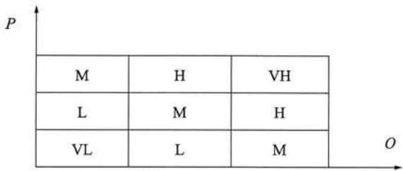

*图2.3-1风险等级图*

  （3）风险评估报告。风险评估报告内容包括： ① 各类风险发生的概率； ② 可能造成的损失量和风险等级； ③ 风险相关的条件因素。  

  风险评估报告应由评估人签字确认，并经批准后发布。

**3）风险应对**

  施工项目管理机构应依据风险评估报告确定针对施工承包风险的应对策略，并将其纳入施工承包风险管理计划。针对施工承包负面风险，可采取的应对策略有：风险规避、风险减轻、风险转移及风险自留。  

  （1）风险规避。风险规避是彻底规避风险的一种做法，即断绝风险来源。对施工项目管理机构而言，就意味着否决或者放弃采纳某一具体施工方案。在工程施工中，如果通过评估认为采用某种施工方案存在很大风险时，彻底改变原方案的做法也属于风险规避方式。这种放弃原施工方案的做法固然避免了可能遭受损失的风险，但同时也放弃了可能的低成本施工方案，因此，采用风险规避策略通常都非常慎重。只有在对风险的存在与发生、风险损失的严重性有把握的情形下，采用风险规避策略才有积极意义。风险规避策略通常适用于以下两种情形：一是某种风险因素发生的概率较高，且会造成相当大的损失；二是采用其他风险应对策略的代价昂贵，得不偿失。  

  （2）风险减轻。风险减轻是指将不利风险事件发生的可能性和（或）影响降低到可接受范围内的风险应对策略，这也是绝大部分情形下采用的风险应对策略。预先采取应对策略以降低风险发生的可能性和（或）可能给施工项目造成的影响，比风险发生后再设法补救要有效得多。施工项目管理机构应针对关键风险因素提出技术上可行、经济上合理的预防措施，以尽可能低的风险管理成本来降低风险发生的可能性并将风险损失降到最低。典型的施工承包风险减轻策略是以联合体形式承包工程，联合体各方共担风险。在工程施工中，可通过降低施工方案的复杂性降低风险事件发生的概率；通过增加那些可能出现风险的施工方案的安全冗余度来降低风险事件发生后可能带来的负面效果。  

  （3）风险转移。风险转移是指将风险转移给他人承担，以避免风险损失。风险转移可分为保险转移和非保险转移两种方式。  

  ① 保险转移。保险转移是指通过向保险公司投保，将施工过程中可能出现的因自然灾害和意外事故造成的损失转移给保险公司。如建筑工程一切险、安装工程一切险、第三者责任险、施工人员意外伤害保险等。  

  ② 非保险转移。施工承包风险的非保险转移主要有三种方式。  

  A.工程分包。经建设单位同意，将施工项目中风险较大的部分工作内容分包给其他施工单位，是一种减轻风险和转移风险的有效策略。  

  B.签订合同时明确计价方式。例如对于存在价格上涨风险的材料设备，可以通过签订总价合同方式将风险转移给材料设备供应商。  

  C.第三方担保。如承包商履约担保、业主工程款支付担保等。  

  无论采用何种风险转移方式，风险的接收方应具有更强的风险承受能力或更有力的处置能力。  

  （4）风险自留。风险自留是指将可能的风险损失留给自己承担。风险自留分为两种情况：一种是主动自留。即已知有风险存在，采取风险应对措施的费用支出超过自担风险的损失时，常常会主动接受风险。另一种是被动自留。即已知有风险存在，但由于可能获得高额利润而需要冒险，且无法采用其他合理的应对策略时，必须被动地保留和承担这种风险。例如，对于隧道及地下工程较多的施工项目，可能会获得较多利润，但施工风险也较大，施工承包单位无法采用风险规避策略，必须保留和承担该风险。  

  风险自留经常采用的措施是建立应急储备。应急储备是为应对风险而预留的时间或预算（资金）。因此，应急储备主要有两种：预算储备和时间储备。  

  ① 预算储备。预算储备是指在施工预算中预留一笔资金，以此来应对自留的风险事件一旦发生后造成的损失。  

  ② 时间储备。时间储备是指在安排进度计划时要留有一定的机动时间。一旦实际施工进展与计划不同，就有可能动用储备。  

  以上所述的风险应对策略并非是互斥的，在工程实践中常常会组合使用。例如，在采取措施减轻风险的同时，并不排斥向保险公司投保、进行工程分包等风险应对策略的采用。应结合施工项目实际情况，灵活采用适宜的风险应对策略。

**4）风险监控**

  施工承包单位应收集和分析与施工承包风险相关的各种信息，获取代表风险程度和水平的风险信号，预测未来风险和提出预警，并将风险预警纳入施工进展报告。  

  （1）风险监控方法。施工承包单位应对可能出现的潜在风险因素进行监控，采用工期检查、成本跟踪分析、合同履行情况监督、质量监控、现场情况报告、定期例会等方法，全面了解施工风险，跟踪风险因素的变动趋势。  

  （2）控制风险事件的影响。施工承包单位应采取措施控制风险事件的影响，降低损失，提高效益，防止负面风险的蔓延，确保工程施工顺利进行。  

  （3）预测新的风险。施工承包单位应对新的环境条件、实施状况和变更进行分析，预测新的风险，并修订风险应对措施，确保施工项目风险管理的有效性。

#### 2.3.2 工程担保

  担保是指债权人为确保债务得到清偿，而在债务人或第三人的特定的物和权利上设定的，可以支配他人财产的一种权利的行为。工程担保通常是指在工程建设活动中，由保证人向合同一方当事人（受益人）提供保证，在被保证人不履行合同义务时，由保证人代为履行或承担代偿责任的行为。由于工程担保大多采用第三方担保方式，故工程担保也被称为工程保证担保。工程担保对于规范工程发承包交易行为，防范和化解工程风险，遏制拖欠工程款和农民工工资，保证工程质量和安全等具有重要作用。  

  工程担保有多种，常见的有投标担保、履约担保、预付款担保、工程款支付担保、  

  工程质量保证金等。

**1. 投标担保**

  投标担保是指投标人在投标活动中，随同投标文件一起向招标人提交的担保。投标担保形式有投标保函、投标保证金等。投标担保的主要目的是保证投标人在递交投标文件后不得撤销投标文件，中标后不得无正当理由不与招标人订立合同，在签订合同时不得向招标人提出附加条件或者不按照招标文件要求提交履约担保，否则，招标人有权不予退还其提交的投标保证金。  

  《中华人民共和国招标投标法实施条例》规定，招标人在招标文件中要求投标人提交投标保证金的，投标保证金不得超过招标项目估算价的 2% 。投标保证金有效期应与投标有效期一致。依法必须进行招标的项目的境内投标单位，以现金或者支票形式提交的投标保证金，应当从其基本账户转出。招标人不得挪用投标保证金。  

  投标人撤回已提交的投标文件，应在投标截止时间前书面通知招标人。招标人已收取投标保证金的，应自收到投标人书面撤回通知之日起5日内退还。投标截止后投标人撤销投标文件的，招标人可以不退还投标保证金。招标人最迟应在书面合同签订后5日内向中标人和未中标的投标人退还投标保证金及银行同期存款利息。

**2. 履约担保**

  履约担保是指中标人在签订合同前向招标人提交的保证履行合同义务和责任的担保。联合体中标的，应由联合体牵头人提交履约担保。履约担保形式有银行履约保函、履约担保书、履约保证金等。履约担保的目的是发包人为防止施工承包单位不履行合同或违约，用来弥补给发包人造成的经济损失。  

  《中华人民共和国招标投标法实施条例》规定，招标文件要求中标人提交履约保证金的，中标人应按照招标文件的要求提交。履约保证金不得超过中标合同金额的 10% 。中标人无正当理由不与招标人订立合同，在签订合同时向招标人提出附加条件，或者不按照招标文件要求提交履约保证金的，取消其中标资格，投标保证金不予退还。  

  《标准施工招标文件》通用合同条款规定，承包人应保证其履约担保在发包人颁发工程接收证书前一直有效。发包人应在工程接收证书颁发后28天内将履约担保退还给承包人。

**3. 预付款担保**

  发包人给承包人预付款，是用于承包人为合同工程施工购置材料、工程设备、施工设备、修建临时设施及组织施工队伍进场等。预付款一般应在开工前7天支付，额度和预付办法在专用合同条款中约定。预付款必须专用于合同工程。  

  预付款担保的主要作用在于保证承包人能够按合同规定进行施工，偿还发包人已支付的全部预付金额。《标准施工招标文件》通用合同条款规定，承包人应在收到预付款的同时向发包人提交预付款保函，预付款保函的担保金额应与预付款金额相同。保函的担保金额可根据预付款扣回的金额相应递减。

**4. 工程款支付担保**

  工程款支付担保是指为保证发包人履行合同约定的工程款支付义务，由担保人向承包人提供的担保。发包人应在签订施工合同时向承包人提交工程款支付担保。工程款支付担保的实质是发包人的一种履约保证，主要是基于我国国情，为防止发包人随意拖  

  欠工程款、保护承包人利益而实施。  

  《建设工程施工合同（示范文本）》GF—2017—0201要求，发包人应在收到承包人要求提供资金来源证明的书面通知后28天内，向承包人提供能够按照合同约定支付合同价款的相应资金来源证明。发包人要求承包人提供履约担保的，发包人应向承包人提供支付担保。支付担保可以采用银行保函或担保公司担保等形式，具体由合同当事人在专用合同条款中约定。

**5. 工程质量保证金**

  工程质量保证金是指发承包双方在施工合同中约定，从应付工程款中预留，用以保证承包人在缺陷责任期内对工程施工质量缺陷进行维修的资金。工程质量保证金实质上是为保证承包人履行施工合同而进行的一种担保。  

  根据《建设工程质量保证金管理办法》，工程质量保证金总预留比例不得高于工程价款结算总额的 3% 。合同约定由承包人以银行保函替代工程质量保证金的，保函金额不得高于工程价款结算总额的 3% 。在工程竣工前，承包人已缴纳履约保证金的，发包人不得同时预留工程质量保证金；采用工程质量保证担保、工程质量保险等其他保证方式的，发包人不得再预留工程质量保证金。  

  《国家发展改革委等部门关于完善招标投标交易担保制度进一步降低招标投标交易成本的通知》（发改法规[2023]27号）指出，鼓励招标人接受担保机构的保函、保险机构的保单等其他非现金交易担保方式缴纳投标保证金、履约保证金、工程质量保证金。投标人、中标人在招标文件约定范围内，可以自行选择交易担保方式，招标人、招标代理机构和其他任何单位不得排斥、限制或拒绝。鼓励使用电子保函，降低电子保函费用。任何单位和个人不得为投标人、中标人指定出具保函、保单的银行、担保机构或保险机构。

#### 2.3.3 工程保险

  工程保险是指建设工程投保人根据合同约定，向保险人支付保险费，保险人对于合同约定的工程实施中可能出现的因自然灾害和意外事故而造成的物质损失和依法应对第三者人身伤亡和财产损失承担经济赔偿责任的一种综合性保险。如前所述，工程保险是转移施工承包风险的重要方式。

**1. 工程保险种类**

  狭义的工程保险是指建筑工程一切险和安装工程一切险。因此，《标准施工招标文件》通用条款规定，承包人应以发包人和承包人的共同名义向双方同意的保险人投保建筑工程一切险、安装工程一切险。具体投保内容、保险金额、保险费率、保险期限等有关内容在专用合同条款中约定。  

  除建筑工程一切险和安装工程一切险外，工程施工承包活动中还会涉及第三者责任险，施工人员工伤保险、意外伤害保险及施工设备、机动车、进场的材料和工程设备等相关保险。

**1）建筑工程一切险**

  建筑工程一切险是指以建设工程为标的，对建设工程整个施工期间工程本身、施工机具和工地设备因自然灾害或意外事故造成的物质损失给予赔偿的保险。  

  （1）投保人和被保险人。建筑工程一切险以发包人和承包人的共同名义投保，被保险人包括发包人、总承包人、分包人、发包人聘用的监理人员、与工程有密切关系的单位或个人，如贷款银行等。  

  （2）保险期限。建筑工程一切险采用的是工期保险单，即保险期限是从投保工程动工之日起直至工程验收之日止。具体时间由投保人与保险人协商确定。  

  （3）保险项目和责任范围。建筑工程一切险的责任范围包括工程项下的物质损失部分，即工程标的有形财产的损失和相关费用的损失，一般会在保险单中列明具体的保险项目：建筑工程（包括永久和临时工程及物料）、所有人提供的物料及项目、安装工程项目、建筑用机器、装置及设备（需另附清单）、场地清理费、工地内现成的建筑物、所有人或承包人在工地上的其他财产（需列明名称）。  

  物质损失部分的保险责任主要有保险单中列明的各种自然灾害和意外事故，如洪水、风暴、水灾、暴雨、地陷、冰雹、雷电、火灾、爆炸等多项，同时还承保盗窃、工人或技术人员过失等人为风险，以及原材料缺陷或工艺不善引起的事故。此外，还可在基本保险责任项下附加特别保险条款，以利于被保险人全面转移风险。  

  （4）免责范围。建筑工程一切险保单中的除外责任通常包括：  

  ① 设计错误引起的损失和费用；  

  ② 自然磨损、内在或潜在缺陷、物质本身变化、自燃、自热、氧化、锈蚀、渗漏、鼠咬、虫蛀、大气（气候或气温）变化、正常水位变化或其他渐变原因造成的保险财产自身的损失和费用；  

  ③ 因原材料缺陷或工艺不善引起的保险财产本身的损失以及为换置，修理或矫正这些缺点错误所支付的费用；  

  ④ 非外力引起的机械或电气装置损坏，或施工用机具、设备、机械装置失灵造成的本身损失；  

  ⑤ 维修保养或正常检修的费用；  

  ⑥ 档案、文件、账簿、票据、现金、各种有价证券、图表资料及包装物料的损失；  

  ⑦ 货物盘点时发现的盘亏损失；  

  ⑧ 领有公共运输行驶执照的，或已由其他保险予以保障的车辆、船舶和飞机的损失；  

  ⑨ 在保险单保险期限终止前，被保险财产中已由工程所有人签发完工验收证书或验收合格或实际占有或使用或接收的部分。

**2）安装工程一切险**

  安装工程一切险是指以各种大型机器、设备安装工程为标的，对承保机械和设备在安装过程中因自然灾害或意外事故所造成的物质损失、费用损失承担赔偿责任的保险。安装工程风险分布具有明显的阶段性，安装工程一切险的承保风险主要是人为风险，并显具技术色彩。  

  （1）投保人和被保险人。安装工程一切险的投保人和被保险人同建筑工程一切险。  

  （2）保险期限。安装工程一切险的保险期限原则上也是规定自投保工程动工之日起直至工程验收之日止。但在有些施工合同中会有试车、考核规定，因此，试车、考核阶段应以保险单中规定的期限为准。如因特殊情况需要延长保险期间的，必须事先获得  

  保险人的书面同意。  

  （3）保险项目和保险责任。安装工程一切险的保险项目通常包括：安装工程项目、土建工程项目、施工用机器及设备（需附清单）、清除残骸费用、专业费用。  

  安装工程一切险的责任范围与建筑工程一切险的责任范围基本一致，但增加了对安装工程常遇到的电气事故，如超负荷、超电压、碰线、电弧、走电、短路、大气放电等造成的损失赔偿责任。此外，因承包人安装人员技术不精引起的事故也可成为向保险公司索赔的理由。  

  （4）免责范围。除建筑工程一切险中所提及事项外，安装工程一切险还会免赔因超负荷、超电压、碰线等电气原因所造成的电气设备或电气用具本身的损失。

**3）第三者责任险**

  建筑工程一切险和安装工程一切险通常还会包括一项附加条款，即第三者责任险。《标准施工招标文件》通用合同条款规定，在缺陷责任期终止证书颁发前，承包人应以承包人和发包人的共同名义投保第三者责任险，其保险费率、保险金额等有关内容在专用合同条款中约定。  

  第三者责任险是指在保险期限内，对因工程意外事故造成的、依法应由被保险人负责的工地上及毗邻地区的第三者人身伤亡、疾病或财产损失（本工程除外），以及被保险人因此而支付的诉讼费用和事先经保险人书面同意支付的其他费用等赔偿责任。  

  第三者责任险的责任期间与建筑工程一切险和安装工程一切险的责任期间相同，只是责任范围仅限于赔偿保险标的工程的工地及邻近地区的第三者因工程实施而蒙受人身伤亡、疾病或财产损失。第三者责任险的责任范围还包括赔偿被保险人因此而支付的诉讼费用和事先经保险人书面同意支付的其他费用，但不能超过保险单列明的赔偿限额。

**4）施工人员工伤保险**

  工伤保险是为保障因工作遭受事故伤害或者患职业病的职工获得医疗救治和经济补偿，促进工伤预防和职业康复，分散用人单位工伤风险而设立的保险。国务院颁布的《工伤保险条例》规定，中华人民共和国境内的企业、事业单位、社会团体、民办非企业单位、基金会、律师事务所、会计师事务所等组织和有雇工的个体工商户应依照法规规定参加工伤保险，为本单位全部职工或者雇工缴纳工伤保险费。  

  《标准施工招标文件》通用合同条款规定，承包人应依照有关法律规定参加工伤保险，为其履行合同所雇佣的全部人员，缴纳工伤保险费，并要求其分包人也进行此项保险。发包人应依照有关法律规定参加工伤保险，为其现场机构雇佣的全部人员，缴纳工伤保险费，并要求其监理人也进行此项保险。

**5）意外伤害保险**

  意外伤害保险是指当被保险人在保险期限内遭受意外伤害造成死亡、残疾、支出医疗费或暂时丧失劳动能力时，保险人依照合同规定给付保险金的人身保险。《中华人民共和国建筑法》规定，鼓励建筑施工企业为从事危险作业的职工办理意外伤害保险，支付保险费。  

  意外伤害保险的保障项目包括死亡给付和残疾给付，其派生责任包括医疗给付、误工给付、丧葬费给付和遗族生活费给付等。由于工程施工过程中涉及的危险因素较多，因此，《标准施工招标文件》通用合同条款规定，发包人应在整个施工期间为其现场机构雇用的全部人员投保人身意外伤害险，缴纳保险费，并要求其监理人也进行此项保险。承包人应在整个施工期间为其现场机构雇用的全部人员投保人身意外伤害险，缴纳保险费，并要求其分包人也进行此项保险。

**2. 工程保险的选择**

  工程保险的选择主要包括两方面：一是投保险种的选择，二是保险人的选择。

**1）投保险种的选择**

  针对工程施工承包风险，承包人需要考虑是否通过投保方式进行转移，以及需要投保哪些险种。如前所述，《标准施工招标文件》通用合同条款规定，承包人应以发包人和承包人的共同名义向双方同意的保险人投保建筑工程一切险、安装工程一切险和第三者责任险。由此可见，需要投保的险种已由发包人和承包人在合同中约定，那么，投保选择的主要工作就主要是确定有实力有信誉的合格保险人。

**2）保险人的选择**

  保险人的选择主要考虑三方面因素：安全可靠性、服务质量及保险成本。  

  （1）安全可靠性。安全可靠性是指在需要保险人履行承诺时的赔付能力。工程保险具有保险期限较长、赔付金额较大的特点，因此，保险人的赔付能力非常重要。投标人需要从信用等级、资产价值、盈利能力、承保业务量、再保险机制等方面考察保险人的安全可靠性。  

  （2）服务质量。保险人的服务质量应重点从能力和意愿两方面进行评估，比如能否主动帮助被保险人识别和评估风险、能否迅速公正地理赔、能否给被保险人提供法律帮助等。评估保险人的服务质量比评估安全可靠更困难，需要更加客观公正、实事求是的评价。  

  （3）保险成本。决定保险成本的最主要因素是保险费率，这也是投保人选择保险人时需要考虑的重要因素。投保人在选择保险人时，会优先选择安全可靠性高、服务质量好及保险成本低的保险公司，但在现实中往往有难度，更多的情况是在这三者之间做出权衡。

**3. 工程保险理赔**

**1）保险事故报案**

  工程保险事故发生时，投保人应按照保险单规定的条件和期限及时向保险人报告。投保人及时向保险人报案是其履行保险合同义务的重要内容，也是其要求保险人进行赔偿的必要前提条件。工程保险事故报案通常要求在第一时间进行，目的是使保险人能够及时了解和掌握保险事故的发生和进展情况，并能及时采取相应措施跟踪和处理案件。报案可采用电话、传真、电子邮件、特快专递、挂号信等方式，无论选择何种方式，都要保证可追溯、可举证。

**2）提供索赔证据**

  进行保险索赔必须提供必要的有效证明，作为索赔依据。证明文件应能证明索赔对象及索赔人的索赔资格；证明索赔理由能够成立且属于理赔人的责任范围和责任期间。在通常情况下，可作为索赔证明的有保险单、工程承包合同、事故照片、事故检验人出具的鉴定报告及保险单中所规定的索赔证明文件。

**3）合理定损理算**

  定损理算是指保险专业人员根据保险事故现场查勘情况，确定事故损失情况，并根据保险合同的有关规定确定保险赔付金额的过程。定损是要根据保险合同的有关规定，对被保险人的损失或者其提出的索赔进行定性和定量分析。理算是要根据保险合同的有关规定对保险人应支付的赔款进行核算和确定，这是确定赔偿金额的关键工作，通常应考虑的因素有是否足额投保、赔偿限额、免赔额等。当一个项目由多家保险公司同时承保时，负责理赔的保险人仅需按比例分担其应负的赔偿责任。

## 第3章 施工进度管理

### 3.1 施工进度影响因素与进度计划系统

#### 3.1.1 施工进度影响因素

  实施施工进度管理，首先需要调查和分析影响施工进度的各种因素，预测其对进度可能产生的影响，以便事先编制一个切实可行、科学合理的进度计划，同时有利于实现施工进度的主动控制。  

  影响施工进度的不利因素有很多，如人为因素，技术因素，设备、材料及构配件因素，施工机具因素，资金因素，水文、地质与气象因素以及其他自然与社会环境等方面的因素。其中，人为因素是最大的干扰因素。从产生根源看，有的来源于建设单位、勘察设计单位、工程监理单位及材料、设备供应单位；有的来源于有关协作单位和社会；有的来源于各种自然条件；也有的来源于施工单位自身。在工程施工过程中，常见影响因素如下。

**1. 相关单位影响**

  （1）建设单位原因。如建设单位使用要求改变而进行设计变更；应提供的施工场地条件不能及时提供或所提供的场地不能满足正常施工需要；建设资金不到位，不能及时向施工单位支付工程款等。  

  （2）勘察设计单位原因。如勘察资料不准确，特别是地质资料错误或遗漏；设计内容不完善，规范应用不当，设计有缺陷或错误；设计方案的可施工性差或设计考虑不周；施工图纸供应不及时、不配套，或出现重大差错等。  

  （3）工程监理单位原因。如工程监理指令延迟发布或有误，施工进度协调工作不力，进场材料、设备质量检查或已完工程质量检查验收不及时等。  

  （4）材料、设备供应单位原因。如材料、设备及构配件等供应有差错，品种、规格、质量、数量、时间不能满足施工需要等。

**2. 有关协作部门及社会环境影响**

  （1）有关协作部门原因。如有关协作部门协作配合不够或支持力度不够等。  

  （2）社会环境原因。如其他单位邻近工程的施工干扰；节假日交通、市容整顿限制；临时停水、停电、断路；国外的法律及制度变化、经济制裁、战争、骚乱、罢工、企业倒闭、汇率浮动和通货膨胀等。

**3. 自然条件影响**

  如复杂的工程地质条件；不明的水文气象条件；地下埋藏文物的保护、处理；洪水、地震、台风等不可抗力等。

**4. 施工单位自身因素影响**

  （1）施工技术因素。如施工方案、施工工艺或施工安全措施不当；特殊材料及新材料的不合理使用；施工设备不配套，选型失当或有故障；不成熟的技术应用等。  

  （2）组织管理因素。如向有关部门提出各种申请审批手续的延误；合同签订时遗漏条款、表达失当；计划安排不周密，组织协调不力，导致停工待料、相关作业脱节；指挥不力，使各专业、各施工过程之间交接配合不顺畅等。

#### 3.1.2 施工进度计划系统及表达形式

**1. 施工进度计划系统**

  为确保施工项目按期交付使用，施工单位需要编制施工进度计划，并控制施工进度计划的实施。

**1）按项目组成编制的施工进度计划**

  按项目组成编制的施工进度计划包括：施工总进度计划、单位工程施工进度计划及分部分项工程进度计划。  

  （1）施工总进度计划。施工总进度计划是指根据施工部署中施工方案和施工项目开展程序，对承包范围内所有单位工程作出时间上的安排。其目的在于确定各单位工程及全工地性工程的施工期限及开竣工日期，进而确定施工现场劳动力、材料、成品、半成品、施工机械的需求数量和调配情况，以及现场临时设施的数量、水电供应量和能源、交通需求量。因此，科学合理地编制施工总进度计划，是保证整个施工项目按期交付使用的重要前提。  

  （2）单位工程施工进度计划。单位工程施工进度计划是指在既定施工方案的基础上，根据规定的工期和各种资源供应条件，遵循各施工过程的合理施工顺序，对单位工程中各施工过程作出时间和空间上的安排。因此，合理安排单位工程施工进度，是保证在规定工期内完成符合质量要求的工程任务的重要前提，同时，也是编制各种资源需求量计划和进行施工准备的依据。  

  （3）分部分项工程进度计划。分部分项工程进度计划是指针对工程量较大或施工技术比较复杂的分部分项工程，在依据工程具体情况所制定的施工方案基础上，对其各施工过程作出时间上的安排。分部分项工程进度计划的编制和实施，是为了保证单位工程施工进度计划的顺利实施。

**2）按进展时间编制的施工进度计划**

  为了有效地控制工程施工进度，施工单位应编制年度施工计划、季度施工计划和月（旬）作业计划，将施工进度计划逐层细化，形成一个旬保月、月保季、季保年的计划体系。

**2. 施工进度计划表达形式**

  常用的施工进度计划表达形式有横道图和网络图两种。

**1）横道图**

  横道图也称甘特图，是由甘特（Gantt）在20世纪20年代提出。由于其形象、直观，且易于编制和理解，因而长期以来被广泛应用于工程进度管理。  

  采用横道图编制施工进度计划，通常包括两个基本部分，即左侧的工作名称、持续时间和右侧的横道线部分。图3.1-1为某桥梁工程施工进度横道计划。该计划直观地表明各项工作的开始时间、完成时间、持续时间，以及整个工程项目的总工期。

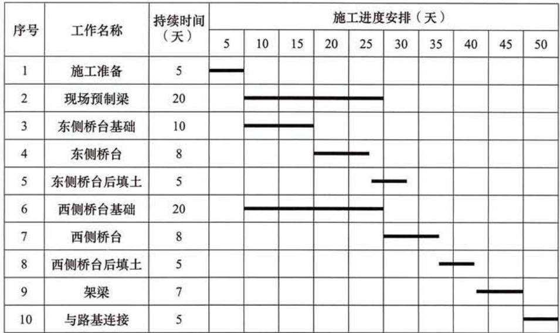

*图3.1-1某桥梁工程施工进度横道计划*

  施工进度计划采用横道图表示形式，具有编制简单、使用方便等优点，但也有不足： ① 不能明确反映各项工作之间的相互联系、相互制约关系； ② 不能反映影响工期的关键工作和关键线路； ③ 不能反映工作所具有的机动时间（时差）； ④ 不能反映工程费用与工期之间的关系，因而不便于施工进度计划的优化。特别是对于大型工程项目，因其工作构成及逻辑关系复杂、无法利用计算机来进行计算分析。因此，采用横道图进行施工进度管理，有一定的局限性。

**2）网络图**

  利用网络图编制施工进度计划，可以弥补横道计划的许多不足。所谓网络图，是指由箭线和节点组成的，用来表示各项工作及其逻辑联系的有向、有序的网状图形。在网络图上加注工作的时间参数编制而成的进度计划称为网络计划。  

  网络计划技术自20世纪50年代末诞生以来，得到迅速发展和广泛应用。国内外实践证明，网络计划技术是用于控制建设工程进度的最有效工具。  

  （1）网络计划基本表示方法。网络计划最基本的表示方法是双代号网络计划和单代号网络计划。除此之外，工程实践中还会采用双代号时标网络计划、单代号搭接网络计划、多级网络计划系统等。  

  ① 双代号网络计划。双代号网络计划是指工作用箭线及两端带有编号的节点表示，工作持续时间标注在箭线下方的网络计划。图3.1-2为某桥梁工程施工进度双代号网络计划。

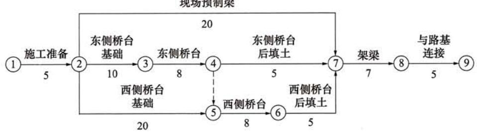

*现场预制梁*

*图3.1-2某桥梁工程施工进度双代号网络计划*

  ② 单代号网络计划。单代号网络计划是指工作用带有编号的节点表示，以箭线表示工作之间的逻辑关系，在节点下方标注工作持续时间的网络计划。图3.1-3为某桥梁工程施工进度单代号网络计划。

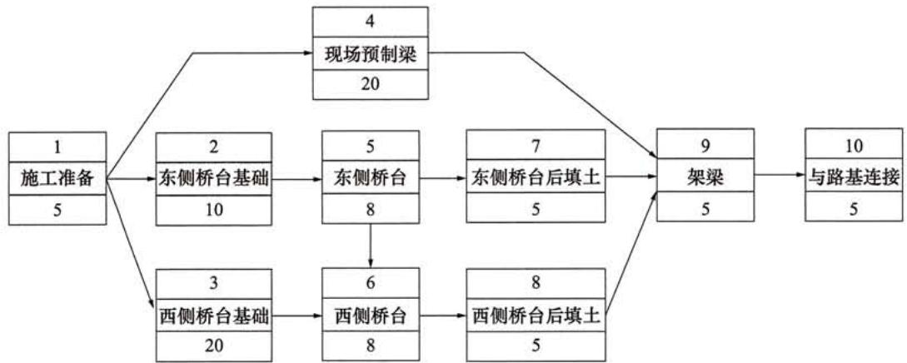

*图3.1-3某桥梁工程施工进度单代号网络计划*

  （2）网络计划特点。与横道计划相比，网络计划具有以下特点：  

  ① 能够明确表达各项工作之间的先后顺序关系（也即逻辑关系），这对于分析进度计划执行中各项工作之间的相互影响非常重要。  

  ② 能够通过时间参数计算，找出影响工期的关键工作和关键线路，有利于施工进度控制中抓主要矛盾，确保施工总进度目标的实现。  

  ③ 能够通过时间参数计算，确定各项工作的机动时间（也即时差），有利于施工进度管理中挖掘潜力，还可用来优化网络计划。  

  ④ 能够利用项目管理软件进行计算、优化和调整，实现对施工进度的动态控制。正是由于网络计划的这一特点，使其成为最有效的进度控制方法。  

  当然，网络计划也有不足之处：不像横道计划那么简单明了、形象直观，但可通过编制时标网络计划或者将网络计划经时间参数计算后再以横道图形式去直观表达得到弥补。

### 3.2 流水施工进度计划

#### 3.2.1 流水施工特点及表达方式

**1. 流水施工特点**

  根据工程施工特点、工艺流程、资源利用、平面或空间布置等要求不同，工程施工组织方式通常有三种：依次施工、平行施工和流水施工。通过比较三种不同施工组织方式，即可理解流水施工特点。  

  现设某住宅小区拟建设I、Ⅱ、Ⅲ三栋建筑结构相同的住宅楼，其基础工程均包含挖基坑、浇基础（浇筑混凝土基础）和回填土三个施工过程，分别由相应的专业工作队按照施工工艺要求依次完成。各专业工作队在每栋住宅楼的施工时间均为5周，各专业工作队人数分别为：10人、16人和8人。三栋住宅楼的基础工程分别采用不同施工组织方式的比较如图3.2-1所示。

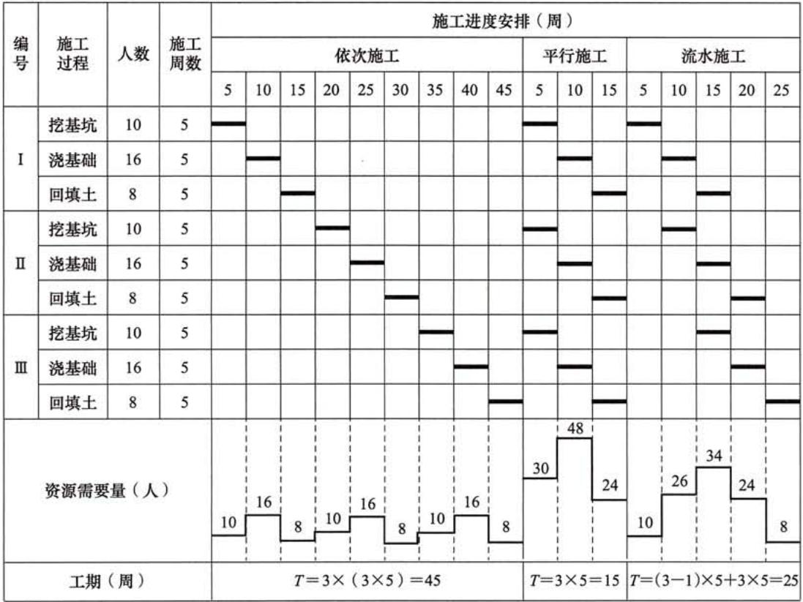

*图3.2-1采用不同施工组织方式的比较*

**1）依次施工**

  依次施工是一种最基本、最原始的施工组织方式。从图3.2-1“依次施工”栏中可以看出，依次施工组织方式具有以下特点：  

  （1）没有充分利用工作面进行施工，工期较长；  

  （2）如果按专业组建工作队，则各专业工作队不能连续作业，工作出现间歇，劳动力和施工机具等资源无法均衡使用；  

  （3）如果由一个工作队完成全部施工任务，则不能实现专业化施工，不利于提高劳动生产率和工程质量；  

  （4）单位时间内投入劳动力、施工机具等资源量较少，有利于资源供应的组织；  

  （5）只有一个工作队进行施工作业，施工现场的组织管理比较简单。

**2）平行施工**

  平行施工是指组织多个同类型专业工作队，在同一时间、不同工作面上按照施工工艺要求，同时完成各施工对象的施工。从图3.2-1“平行施工”栏中可以看出，平行施工组织方式具有以下特点：  

  （1）能够充分利用工作面进行施工，工期短；（2）如果每一施工对象均按专业组建工作队，则各专业工作队不能连续作业，工  
  作出现间歇，劳动力和施工机具等资源无法均衡使用；（3）如果由一个工作队完成一个施工对象的全部施工任务，则不能实现专业化施  
  工，不利于提高劳动生产率和工程质量；（4）单位时间内投入的劳动力、施工机具等资源成倍增加，不利于资源供应的  
  组织；（5）有多个专业工作队在现场施工，施工现场组织管理比较复杂。

**3）流水施工**

  流水施工是将拟建工程施工对象分解为若干施工过程，并按照施工过程组建相应的专业工作队，各专业工作队按照施工顺序依次完成各施工对象的施工过程，同时保证施工在时间和空间上连续、均衡、有节奏地进行，并使相邻两个专业工作队能最大限度地搭接作业。从图3.2-1“流水施工”栏中可以看出，流水施工组织方式具有以下特点：  

  （1）尽可能利用工作面进行施工，工期较短；（2）各工作队实现专业化施工，有利于提高施工技术水平和劳动效率，也有利于  
  提高工程质量；（3）专业工作队能够连续施工，同时使相邻专业工作队之间能够最大限度地进行  
  搭接作业；（4）单位时间内投入的劳动力、施工机具等资源较为均衡，有利于资源供应的  
  组织；（5）为施工现场的文明施工和科学管理创造了有利条件。

**2. 流水施工表达方式**

  流水施工用网络图表达时，需要编制流水网络计划。除此之外，流水施工通常用横道图和垂直图表示。

**1）流水施工横道图表示法**

  某基础工程流水施工横道计划如图3.2-2所示。图中左半部分表示施工过程；右半部分横坐标表示流水施工时间安排及施工过程或专业工作队的施工进度安排。其中，编号 ①② …表示不同的施工段。

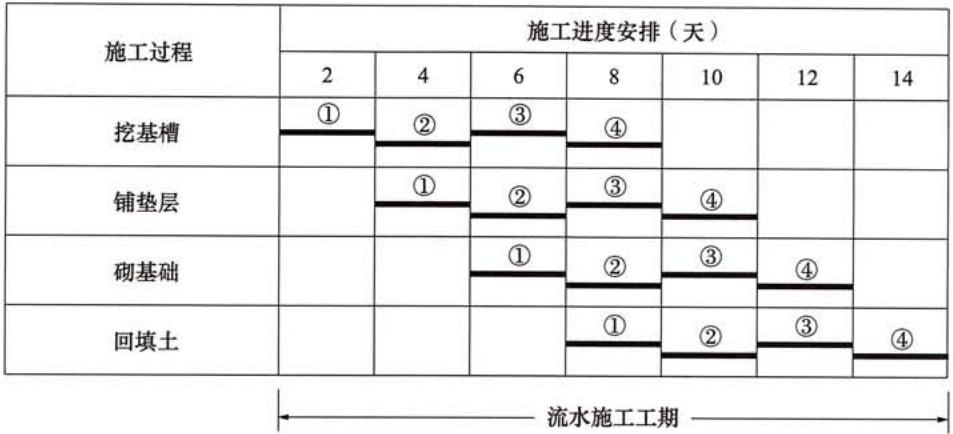

*图3.2-2某基础工程流水施工横道计划*

  采用横道图表达流水施工的优点是：绘图简单，施工过程及其先后顺序表达清楚，时间和空间状况形象直观，使用方便，因而被广泛用于工程实践中。

**2）流水施工垂直图表示法**

  某标段公路工程流水施工垂直计划如图3.2-3所示。图中横坐标表示施工过程所处的空间位置或里程；纵坐标表示流水施工时间安排。图中斜向线段表示施工过程或专业工作队的施工进度。

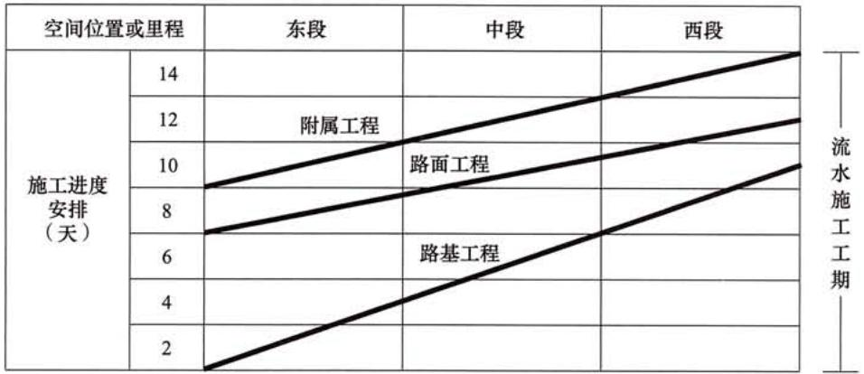

*图3.2-3某标段公路工程流水施工垂直计划*

  对于铁路、公路、地铁、输电线路、天然气管道等线性工程施工进度计划，更适合采用垂直图表达方式。采用垂直图表达流水施工的优点是：施工过程及其先后顺序表达清楚，不仅时间和空间状况形象直观，而且斜向进度线的斜率还可直观反映各施工过程的进展速度。

#### 3.2.2 流水施工参数

  组织流水施工需要通过确定一系列流水参数来实现。按其性质不同，流水施工参数可分为工艺参数、空间参数和时间参数。

**1. 工艺参数**

  工艺参数是指在组织流水施工时，用以表达流水施工在施工工艺方面进展状态的  

  参数，通常包括施工过程数和流水强度两个参数。

**1）施工过程数**

  组织流水施工时，首先需将工程对象划分为若干个施工过程。施工过程划分的粗细程度由实际需要而定。当编制控制性施工进度计划时，组织流水施工的施工过程可划分得粗一些，施工过程可以是单位工程或单项工程，也可以是分部工程。当编制实施性施工进度计划时，施工过程可划分得细一些，施工过程可以是分项工程，甚至是将分项工程按照专业工种不同分解而成的施工工序。施工过程数目通常用 n 表示。

**2）流水强度**

  流水强度也称为流水能力或生产能力，是指流水施工的某施工过程（或专业工作队）在单位时间内所完成的工程量。例如，浇筑混凝土施工过程的流水强度是指每工作班浇筑的混凝土立方数。

**2. 空间参数**

  空间参数是指在组织流水施工时，用以表达流水施工在空间布置上开展状态的参数。空间参数通常包括工作面和施工段数。

**1）工作面**

  工作面是指供某专业工种的工人或某种施工机械进行施工的活动空间。工作面的大小，表明能安排施工人数或机械台数的多少。每个作业工人或每台施工机械所需工作面的大小，取决于其单位时间内完成的工程量和安全施工要求。工作面确定的合理与否，直接影响专业工作队的生产效率。因此，必须合理确定工作面。

**2）施工段数**

  施工段也称为流水段，是指在组织流水施工时，将拟建工程在平面上划分成若干个劳动量相等或大致相等的施工区段。划分施工段的目的是充分利用工作面组织流水施工。施工段数目通常用 m 表示。  

  由于施工段内的施工任务由专业工作队依次完成，因而在两个施工段之间容易形成一个施工缝。同时，由于施工段数量多少，将直接影响流水施工效果。为合理划分施工段，应遵循下列原则：  

  （1）各施工段的劳动量应大致相等，相差幅度不宜超过 15% ，以保证施工在连续、均衡的条件下进行。  

  （2）每个施工段要有足够的工作面，以保证相应数量的工人、主导施工机械的生产效率。  

  （3）施工段的界限应尽可能与结构界限（如沉降缝、伸缩缝等）相吻合，或设在对建筑结构整体性影响小的部位，以保证建筑结构的整体性。  

  （4）施工段数目要满足合理组织流水施工的要求。施工段数目过多，会降低施工速度，延长工期；施工段过少，不利于充分利用工作面，可能造成窝工。  

  （5）对于多层建筑物、构筑物或需要分层施工的工程，应既分施工段，又分施工层，各专业工作队依次完成第一施工层中各施工段任务后，再转入第二施工层的施工段上作业，依此类推，以确保相应专业队在施工段与施工层之间，组织连续、均衡、有节奏的流水施工。

**3. 时间参数**

  时间参数是指在组织流水施工时，用以表达流水施工在时间安排上所处状态的参数，主要包括流水节拍、流水步距和流水施工工期等。

**1）流水节拍**

  流水节拍是指某一个专业工作队在一个施工段上的施工时间。流水节拍表明流水施工的速度和节奏性。流水节拍小，其流水速度快，节奏感强；反之则相反。流水节拍决定着单位时间的资源供应量，同时，流水节拍也是区别流水施工组织方式的特征参数。  

  同一施工过程的流水节拍，主要由所采用的施工方法、施工机械以及在工作面允许的前提下投入施工的工人数量、机械台数和采用的工作班次等因素确定。有时，为了均衡施工和减少转移施工段时消耗的工时，可以适当调整流水节拍，其数值最好为半个工作班的整数倍。

**2）流水步距**

  流水步距是指两个相邻专业工作队相继开始施工的最小间隔时间。流水步距的数 目取决于参加流水的施工过程数。如果施工过程数为 n 个，则流水步距总数为 n-1 个。  

  流水步距的大小取决于相邻两个专业工作队在各施工段上的流水节拍及流水施工的组织方式。确定流水步距时，一般应满足以下基本要求：  

  （1）各施工过程按各自流水速度施工，始终保持工艺先后顺序；  

  （2）各施工过程的专业工作队投入施工后尽可能保持连续作业；  

  （3）相邻两个专业工作队在满足连续施工的条件下，能最大限度地实现合理搭接。  

  根据以上基本要求，在不同的流水施工组织方式中，可采用不同的方法确定流水步距。

**3）流水施工工期**

  流水施工工期是指从第一个专业工作队投入流水施工开始，到最后一个专业工作队完成流水施工为止的整个持续时间。由于一项建设工程往往包含有许多流水组，故流水施工工期一般均不是整个工程的总工期。

#### 3.2.3 流水施工基本方式

  在流水施工中，由于流水节拍的规律不同，决定了流水步距、流水施工工期的计算方法等也不同，甚至影响各施工过程的专业工作队数目。为此，按照流水节拍特征将流水施工分类如图3.2-4所示。

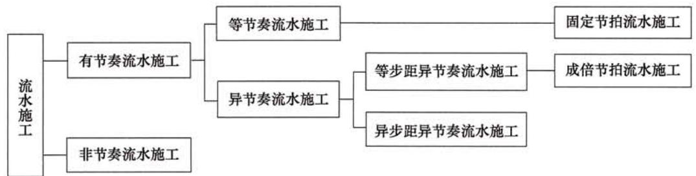

*图3.2-4流水施工分类*

**1. 有节奏流水施工**

  有节奏流水施工是指在组织流水施工时，每一个施工过程在各施工段上的流水节拍都各自相等的流水施工，又可分为等节奏流水施工和异节奏流水施工。

**1）等节奏流水施工**

  等节奏流水施工是指在有节奏流水施工中，各施工过程的流水节拍都相等的流水施工，也称为固定节拍流水施工或全等节拍流水施工。  

  （1）基本特点。全等节拍流水施工是一种最理想的流水施工方式，具有以下特点：  

  ① 所有施工过程在各个施工段上的流水节拍均相等；  
  ② 相邻施工过程的流水步距相等，且等于流水节拍；  
  ③ 专业工作队数等于施工过程数，即每一个施工过程组建一个专业工作队；  
  ④ 各专业工作队在各施工段上能够连续作业，施工段之间没有空闲时间。  

  （2）流水施工工期的计算。计算公式为：  

T=(m+n-1)K
  式中 T —流水施工工期；m 一 施工段数；n 一 施工过程数；K ——流水步距。  

  在组织流水施工时，除考虑相邻两个专业工作队之间的流水步距外，还应考虑合理的工艺间歇时间，称之为技术间歇时间。如混凝土浇筑后的养护时间，抹灰、油漆粉刷后的干燥时间等。有时，为了缩短工期，在前一个专业工作队完成部分作业，为后一个专业工作队提供一定工作面后，后者可提前进入，从而使两者在同一个施工段上平行搭接施工，这段搭接时间称为平行搭接时间或提前插入时间。在考虑技术间歇时间和提前插入时间的情形下，流水施工工期计算公式为：  

T=(m+n-1)K+ΣZ-ΣC
  式中∑Z——技术间歇时间之和；  

  ΣC 提前插入时间之和；  

  其他符号同前。

**2）异节奏流水施工**

  在通常情况下，组织全等节拍流水施工是比较困难的。对于任一施工段，由于影响流水节拍的因素不同，很难使得各个施工过程的流水节拍都彼此相等。但是，如果施工段划分得合适，保持同一施工过程各施工段的流水节拍相等是不难实现的。这样，就可组织异节奏流水施工。异节奏流水施工是指在有节奏流水施工中，各施工过程的流水节拍各自相等，而不同施工过程之间的流水节拍不尽相等的流水施工。

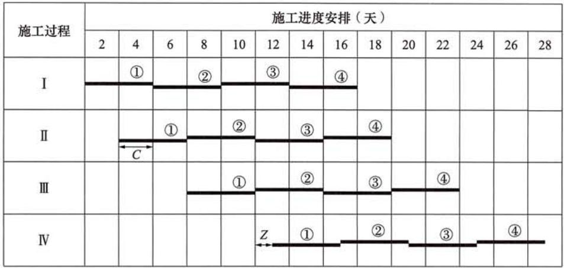

*图3.2-5全等节拍流水施工进度计划*

  （1）异节奏流水施工方式。在组织异节奏流水施工时，可采用等步距和异步距两种方式。  

  ① 等步距异节奏流水施工。等步距异节奏流水施工是指在组织异节奏流水施工时，按每个施工过程流水节拍之间的比例关系，成立相应数量的专业工作队而进行的流水施工，也称为成倍节拍流水施工。为加快施工进度，对流水节拍长的施工过程可相应增加专业工作队，按全等节拍方式组织施工。因此，有时也称为加快的成倍节拍流水施工。  

  ② 异步距异节奏流水施工。异步距异节奏流水施工是指在组织异节奏流水施工时，每个施工过程成立一个专业工作队，由其完成各施工段任务的流水施工。  

  （2）加快的成倍节拍流水施工特点。加快的成倍节拍流水施工具有以下特点：  

  ① 同一施工过程在各个施工段上的流水节拍均相等；不同施工过程的流水节拍为倍数关系。  

  ② 相邻施工过程的流水步距相等，且等于流水节拍的最大公约数。  

  ③ 专业工作队数大于施工过程数。对于流水节拍大的施工过程，可按其倍数增加相应专业工作队数目。  

  ④ 各专业工作队在施工段上能够连续作业，施工段之间没有空闲时间。  

  （3）流水施工工期的计算。计算公式为：  

T=(m+N-1)K+ΣZ-ΣC
  其他符号同前。

**2. 非节奏流水施工**

  在工程实践中，通常每个施工过程在各施工段上的工程量彼此不相等，或各专业工作队的生产效率相差较大，导致多数流水节拍彼此不相等，从而难以组织全等节拍或成倍节拍流水施工。在这些情形下，虽然流水节拍无任何规律，但仍可组织流水施工是最为普遍的流水施工组织方式。  

  （1）基本特点。非节奏流水施工具有以下特点：  

  ① 各施工过程在各施工段上的流水节拍不全相等；  

  ② 相邻施工过程的流水步距不尽相等；  

  ③ 专业工作队数等于施工过程数；  

  ④ 各专业工作队能够在施工段上连续作业，但有的施工段之间可能有空闲时间。  

  （2）流水步距的确定。组织非节奏流水施工的关键是确定相邻专业工作队之间的流水步距，使其在开始时间上能够最大限度地进行搭接。通常采用累加数列错位相减取大差法计算流水步距。由于这种方法是由潘特考夫斯基（音译）首先提出的，故又称为潘特考夫斯基法。这种方法简捷、准确，便于掌握。  

  累加数列错位相减取大差法的基本步骤如下：  

  ① 依次累加每一施工过程在各施工段上的流水节拍，求得各施工过程流水节拍的累加数列；  

  ② 将相邻施工过程流水节拍累加数列中的后者错后一位，相减后求得一个差数列；  

  ③ 在差数列中取最大值，即为相邻两个施工过程的流水步距。  

  （3）流水施工工期的计算。计算公式为：  

arrayrT=∑K+∑tn

+∑Z-∑Carray
  式中∑K—各施工过程（或专业工作队）之间流水步距之和；  

  ∑tn

 ——最后一个施工过程（或专业工作队）在各施工段上的流水节拍之和。  

  其他符号同前。

### 3.3 工程网络计划技术

#### 3.3.1 工程网络计划类型和编制程序

**1. 工程网络计划类型**

  工程网络计划种类繁多，可从不同角度进行分类。  

  （1）按工作持续时间的性质不同，工程网络计划可分为肯定型网络计划、非肯定型网络计划和随机型网络计划。关键线路法（CPM）就是一种肯定型网络计划，计划评审技术（PERT）属于非肯定型网络计划，而图示评审技术（GERT）、风险评审技术（VERT）则属于随机型网络计划。  

  （2）按表达形式不同，工程网络计划可分为双代号网络计划和单代号网络计划。  

  （3）按计划目标不同，工程网络计划可分为单目标网络计划和多目标网络计划。  

  （4）按有无时间坐标划分，工程网络计划可分为时标网络计划和非时标网络计划。  

  （5）按网络计划层级不同，工程网络计划可分为单级网络计划和多级网络计划系统。  

  （6）按工作搭接关系不同，工程网络计划可分为普通网络计划、搭接网络计划和流水网络计划。  

  在通常情况下，建设工程施工进度管理主要应用肯定型网络计划。最常用的是双代号网络计划、单代号网络计划及双代号时标网络计划，这些也是工程网络计划最基本的表现形式。

**2. 工程网络计划编制程序**

  应用工程网络计划技术编制施工进度计划，可分为以下四个阶段。

**1）计划编制准备阶段**

  主要包括调查研究和确定网络计划目标等工作。  

  （1）调查研究。调查研究的主要目的是掌握足够充分、准确的资料，从而为确定合理的进度目标、编制科学的进度计划提供可靠依据。调查研究内容包括： ① 工程任务情况、实施条件、设计资料； ② 有关标准、定额、制度； ③ 劳动力、材料、施工机具等资源需求与供应情况； ④ 资金需求与供应情况； ⑤ 有关统计资料、经验总结及类似工程实际进展资料等。  

  （2）确定网络计划目标。一般可分为三类： ① 时间目标，即工期目标。 ② 时间-资源目标，通常会考虑“资源有限，工期最短”目标，即在资源供应能力有限的情况下，寻求工期最短的计划安排；或者考虑“工期固定，资源均衡”目标，即在工期固定前提下，寻求资源需用量尽可能均衡的计划安排。 ③ 时间－成本目标，即在限定工期条件下寻求最低总成本或寻求最低总成本时的工期安排。

**2）网络图绘制阶段**

  主要包括工程项目分解、确定逻辑关系和绘制网络图等工作。  

  （1）工程项目分解。将工程项目由粗到细进行分解，是编制工程网络计划的前提。工作划分的粗细程度，应根据实际需要来确定。  

  （2）确定逻辑关系。依据施工方案、有关资源供应情况和施工经验等，既要考虑施工程序或工艺技术过程，又要考虑组织安排及资源调配需要，以此来分析确定各项工作之间的逻辑关系。  

  （3）绘制网络图。根据已确定的逻辑关系，按绘图规则绘制网络图。既可绘制单代号网络图，也可绘制双代号网络图，还可在确定工作持续时间的基础上，根据需要编制双代号时标网络计划。  

  ① 双代号网络图的绘图规则如下：  

  A.网络图必须按照已定逻辑关系绘制。这不仅是由于网络图本身是有向、有序的网状图形，同时也是为保证工程质量和资源优化配置及合理使用所必需的。  

  在双代号网络图中，有时存在虚箭线，虚箭线不代表实际工作，称为虚工作。虚工作既不消耗时间，也不消耗资源。虚工作主要用来表示相邻两项工作之间的逻辑关系。此外，为了避免两项同时开始、同时进行的工作具有相同的开始节点和完成节点，也需要用虚工作加以区分。  

  网络图中的节点都必须有编号，其编号严禁重复，并应使每一条箭线上箭尾节点编号小于箭头节点编号。  

  B.网络图中严禁出现从一个节点出发，顺箭头方向又回到原出发点的循环回路。如果出现循环回路，会造成逻辑关系混乱，使工作无法按顺序进行。图3.3-1为存在循环回路（ C→E→F→D ）的错误网络图。当然，网络图中存在循环回路时，节点编号必然会发生从大到小的错误，同时也必然会出现从右向左的逆向箭线。

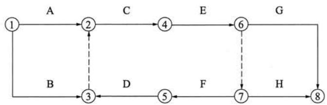

*图3.3-1存在循环回路的错误网络图*

  C.网络图中的箭线（包括虚箭线，以下同）应保持自左向右的方向，不应出现箭头指向左方的水平箭线和箭头偏向左方的斜向箭线（即逆向箭线）。若遵循该规则绘制网络图，就不会出现循环回路。  

  D.网络图中严禁出现双向箭头和无箭头的连线。图3.3-2所示为错误的工作箭线画法，由于工作进行的方向不明确，因而不能达到网络图的有向要求。

*图3.3-2错误的工作箭线画法*

  E.网络图中严禁出现没有箭尾节点的箭线和没有箭头节点的箭线。图3.3-3为没有节点的工作箭线的错误画法。

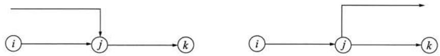

*图3.3-3没有节点的工作箭线的错误画法*

  F.严禁在箭线上引入或引出箭线。图3.3-4为箭线上引入或引出箭线的错误画法。

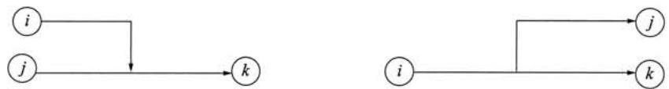

*图3.3-4箭线上引入或引出箭线的错误画法*

  G.应尽量避免网络图中工作箭线的交叉。当交叉不可避免时，可以采用过桥法或指向法处理。箭线交叉的表示方法如图3.3-5所示。

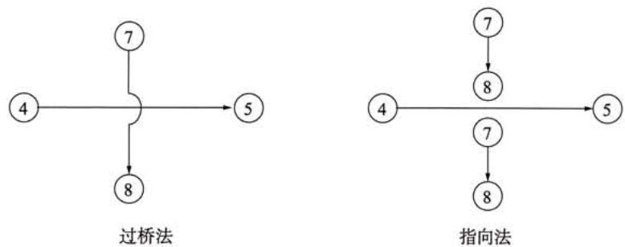

*图3.3-5箭线交叉的表示方法*

  H.网络图应只有一个起点节点和一个终点节点（任务中部分工作需要分期完成的网络计划除外）。除网络图的起点节点和终点节点外，不允许出现没有外向箭线的节点和没有内向箭线的节点。  

  ② 单代号网络图的绘图规则。单代号网络图的绘图规则与双代号网络图的绘图规则基本相同，主要区别在于：当网络图中有多项开始工作时，应增设一项虚工作，作为该网络图的起点节点；当网络图中有多项结束工作时，应增设一项虚工作，作为该网络图的终点节点。

**3）时间参数计算阶段**

  主要包括计算时间参数、确定关键工作和关键线路等工作。  

  （1）计算时间参数。首先，根据经验或定额计算每项工作的持续时间。然后，采用图上计算法、表上计算法、公式计算法等方法计算网络计划中的其他时间参数，通常包括：工作的最早开始时间、最早完成时间、最迟开始时间、最迟完成时间、总时差、自由时差；双代号网络计划中节点的最早时间、最迟时间；单代号网络计划中相邻两项工作之间的时间间隔；整个网络计划的计算工期等。  

  （2）确定关键工作和关键线路。在计算时间参数的基础上，即可根据有关时间参数确定网络计划中的关键工作和关键线路。

**4）网络计划优化阶段**

  主要包括优化网络计划和编制正式网络计划等工作。  

  （1）优化网络计划。根据所追求的目标不同，网络计划优化包括工期优化、费用优化和资源优化三种。根据工程实际需要，可选择不同的优化方法进行工程网络计划优化。  

  （2）编制正式网络计划。根据网络计划优化结果，编制正式网络计划，并附网络计划编制说明书，说明网络计划的编制原则和依据、执行计划时需关注的关键问题及需要采取的措施，以及其他需要说明的问题。

#### 3.3.2 时间参数及其相互关系

**1. 网络计划中的时间参数**

  工程网络计划中的时间参数是指网络计划中的工作、节点、相邻两项工作之间的时间值，以及整个网络计划的工期。

**1）工作持续时间和工期**

  （1）工作持续时间。工作持续时间是指一项工作从开始到完成的时间。在双代号网络计划中，工作i一j的持续时间用 Di-j

 表示；在单代号网络计划中，工作i的持续时间用 Di

 表示。  

  （2）工期。工期泛指完成一项任务所需要的时间。在网络计划中，工期一般有以下三种：  

  ① 计算工期。计算工期是指根据网络计划时间参数计算而得到的工期，用 Tc

 表示。  

  ② 要求工期。要求工期是指任务委托人所提出的指令性工期（合同工期），用 Tr

 表示。  

  ③ 计划工期。计划工期是指根据要求工期和计算工期所确定的作为实施目标的工  

  期，用 Tp

 表示。  

  A.当已规定要求工期时，计划工期不应超过要求工期，即：  

Tp

≤Tr

  B.当未规定要求工期时，可令计划工期等于计算工期，即：  

Tp

=Tc

**2）工作的六个时间参数**

  除持续时间外，网络计划中工作的六个时间参数是：最早开始时间、最早完成时间、最迟完成时间、最迟开始时间、总时差和自由时差。  

  （1）最早开始时间和最早完成时间。工作的最早开始时间是指在其所有紧前工作全部完成后，本工作有可能开始的最早时刻。工作的最早完成时间是指在其所有紧前工作全部完成后，本工作有可能完成的最早时刻。工作的最早完成时间等于本工作的最早开始时间与其持续时间之和。  

  在双代号网络计划中，工作 i-j 的最早开始时间和最早完成时间分别用 ESi-j

 和 EFi-j

 表示；在单代号网络计划中，工作 i 的最早开始时间和最早完成时间分别用 ESi

 和 EFi

 表示。  

  （2）最迟完成时间和最迟开始时间。工作的最迟完成时间是指在不影响整个任务按期完成的前提下，本工作必须完成的最迟时刻。工作的最迟开始时间是指在不影响整个任务按期完成的前提下，本工作必须开始的最迟时刻。工作的最迟开始时间等于本工作的最迟完成时间与其持续时间之差。  

  在双代号网络计划中，工作 i-j 的最迟完成时间和最迟开始时间分别用 LFi-j

 和 LSi-j

 表示；在单代号网络计划中，工作i的最迟完成时间和最迟开始时间分别用 LFi

 和 LSi

 表示。  

  （3）总时差和自由时差。工作的总时差是指在不影响总工期的前提下，本工作可以利用的机动时间。在双代号网络计划中，工作 i-j 的总时差用 TFi-j

 表示；在单代号网络计划中，工作 i 的总时差用 TFi

 表示。  

  工作的自由时差是指在不影响其紧后工作最早开始时间的前提下，本工作可以利用的机动时间。在双代号网络计划中，工作 i-j 的自由时差用 FFi-j

 表示；在单代号网络计划中，工作 i 的自由时差用 FFi

 表示。  

  从总时差和自由时差的定义可知，对于同一项工作而言，自由时差不会超过总时差。当工作的总时差为零时，其自由时差必然为零。  

  在网络计划的执行过程中，工作的自由时差是该工作可以自由使用的时间。但是，如果利用某项工作的总时差，则有可能使该工作后续工作的总时差减小。

**3）节点最早时间和最迟时间**

  （1）节点最早时间。节点最早时间是指在双代号网络计划中，以该节点为开始节点的各项工作的最早开始时间。节点 i 的最早时间用 ETi

 表示。  

  （2）节点最迟时间。节点最迟时间是指在双代号网络计划中，以该节点为完成节点的各项工作的最迟完成时间。节点 j 的最迟时间用 LTj

 表示。

**4）相邻两项工作之间的时间间隔**

  相邻两项工作之间的时间间隔是指本工作的最早完成时间与其紧后工作最早开始时间之间可能存在的差值。工作 i 与工作 j 之间的时间间隔用 LAGi,j

 表示。

**2. 双代号网络计划时间参数的计算**

  双代号网络计划时间参数的计算既可按工作进行，也可按节点进行，通过时间参数的计算，可以进一步理解时间参数之间的相互关系。这里通过简例主要介绍按工作计算法计算网络计划时间参数。  

  为了简化计算，网络计划中工作的开始时间和完成时间都应以时间单位的终了时刻为标准。如第3天开始即是指第3天终了（下班）时刻开始，实际上是第4天上班时刻才开始；第5天完成即是指第5天终了（下班）时刻完成。  

  下面以图3.3-6所示双代号网络计划为例，说明按工作计算法计算时间参数的过程。双代号网络计划时间参数计算结果（六时标注法）如图3.3-7所示。

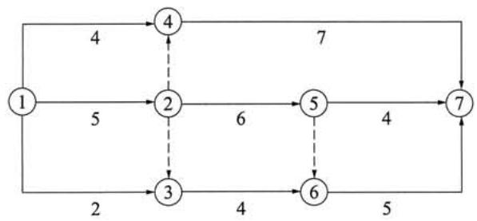

*图3.3-6双代号网络计划*

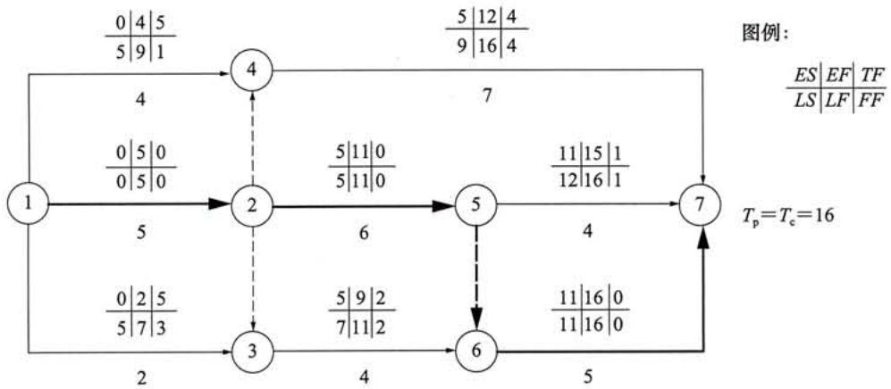

*图3.3-7双代号网络计划时间参数计算结果（六时标注法）*

**1）计算工作的最早开始时间和最早完成时间**

  工作最早开始时间和最早完成时间的计算应从网络计划的起点节点开始，顺着箭线方向依次进行。其计算步骤如下：  

  （1）以网络计划起点节点为开始节点的工作，当未规定其最早开始时间时，其最早开始时间为零。例如在本例中，工作1-2、工作1-3和工作1-4的最早开始时间均为零，即：  

arrayrES1-2

=ES1-3

=ES1-4

=0array
  （2）工作的最早完成时间可利用式（3.3-3）进行计算：  

EFi-j

=ESi-j

+Di-j

  式中 EFi-j

 一工作 i-j 的最早完成时间；  

  ESi-j

 —工作 i-j 的最早开始时间；  
  Di-j

 —工作 i-j 的持续时间。  

  例如在本例中，工作1-2、工作1-3和工作1-4的最早完成时间分别为：  

  工作1-2： EF1-2

=ES1-2

+D1-2

=0+5=5 工作1-3： EF1-3

=ES1-3

+D1-3

=0+2=2 工作1-4: EF1-4

=ES1-4

+D1-4

=0+4=4  

  （3）其他工作的最早开始时间应等于其紧前工作最早完成时间的最大值，即：  

ESi-j

=max{EFh-i

}=max{ESh-i

+Dh-i

}
  式中 ESi-j

 工作 i-j 的最早开始时间；  

  EFh-i

 工作 i-j 的紧前工作 h-i （非虚工作）的最早完成时间；  
  ESh-i

 1 工作 i-j 的紧前工作 h-i （非虚工作）的最早开始时间；  
  Di 工作 i-j 的紧前工作 h-i （非虚工作）的持续时间。  

  例如在本例中，工作2-5和工作3-6的最早开始时间分别为：  

ES2-5

=EF1-2

=5
ES3-6

=max{EF1-2

, EF1-3

}=max{5, 2}=5
  （4）网络计划的计算工期应等于以网络计划终点节点为完成节点的工作的最早完成时间的最大值，即：  

Tc

=max{EFi-n

}=max{ESi-n

+Di-n

}
  式中 Tc

 ——网络计划的计算工期；  

  EFi-n

 以网络计划终点节点 n 为完成节点的工作的最早完成时间；  
  ESi-n

 以网络计划终点节点 n 为完成节点的工作的最早开始时间；  
  Di- —以网络计划终点节点 n 为完成节点的工作的持续时间。  

  例如在本例中，网络计划的计算工期为：  

Tc

=max{EF4-7

,EF5-7

,EF6-7

}=max{12,15,16}=16

**2）确定网络计划的计划工期**

  网络计划的计划工期应按式（3.3-1）或式（3.3-2）确定。在本例中，假设未规定要求工期，则计划工期就等于计算工期，即：  

Tp

=Tc

=16
  计划工期应标注在网络计划终点节点的右上方，如图3.3-7所示。  

  3）计算工作的最迟完成时间和最迟开始时间  

  工作最迟完成时间和最迟开始时间的计算应从网络计划的终点节点开始，逆着箭线方向依次进行。其计算步骤如下：  

  （1）以网络计划终点节点为完成节点的工作，其最迟完成时间等于网络计划的计划工期，即：  

LFi-n

=Tp

  式中 LFi-n

 —以网络计划终点节点 n 为完成节点的工作的最迟完成时间；  

  Tp

 网络计划的计划工期。  

  例如在本例中，工作4-7、工作5-7和工作6-7的最迟完成时间为：  

LF4

=LF5

=LF6

=Tp

=16
  （2）工作的最迟开始时间可利用式（3.3-7）进行计算：  

LSi-j

=LFi-j

-Di-j

  式中 LSi-j

 工作 i-j 的最迟开始时间；LFi-j

 工作 i-j 的最迟完成时间；Di-j

 工作 i-j 的持续时间。  

  例如在本例中，工作4-7、工作5-7和工作6-7的最迟开始时间分别为：  

LS4-7

=LF4-7

-D4-7

=16-7=9
LSs-7

=LFs-7

-Ds-7

=16-4=12
LS6-7

=LF6-7

-D6-7

=16-5=11
  （3）其他工作的最迟完成时间应等于其紧后工作最迟开始时间的最小值，即：  

LFi-j

=min {LSj-k

}=min {LFj-k

-Dj-k

}
  式中 LFi-j

 一 工作 i-j 的最迟完成时间；  

  LSj-k

 工作 i-j 的紧后工作 j-k （非虚工作）的最迟开始时间；  
  LFj-k

 工作 i-j 的紧后工作 j-k （非虚工作）的最迟完成时间；  
  Dj-k

 工作 i-j 的紧后工作 j-k （非虚工作）的持续时间。  

  例如在本例中，工作2-5和工作3-6的最迟完成时间分别为：  

LF2-5

=min{LS5-7

,LS6-7

}=min{12,11}=11
LF3-6

=LS6-7

=11

**4）计算工作的总时差**

  工作的总时差等于该工作最迟完成时间与最早完成时间之差，或该工作最迟开始时间与最早开始时间之差，即：  

TFij

=LFij

-EFij

=LSi-j

-ESi-j

  式中 TFi-j

 工作 i-j 的总时差；其余符号同前。  

  例如在本例中，工作1-4的总时差为：  

TF1-4

=LF1-4

-EF1-4

=9-4=5
  或  

TF1-4

=LS1-4

-ES1-4

=5-0=5

**5）计算工作的自由时差**

  工作自由时差的计算应按以下两种情况分别考虑：  

  （1）对于有紧后工作的工作，其自由时差等于本工作之紧后工作最早开始时间减本工作最早完成时间所得之差的最小值，即：  

FFi-j

=min{ESj-k

-EFi-j

}=min{ESj-k

-ESi-j

-Di-j

}
  式中 FFi-j

 —工作 i-j 的自由时差；  

  ESj-k

 工作 i-j 的紧后工作 j-k （非虚工作）的最早开始时间；  
  EFi-j

 工作 i-j 的最早完成时间；  
  ESi-j

 工作 i-j 的最早开始时间；  
  Di-j

 -工作 i-j 的持续时间。  

  例如在本例中，工作1-4和工作2-5的自由时差分别为：  

FF1-4

=ES4-7

-EF1-4

=5-4=1
arrayrl&FF2-5

=min{ES5-7

-EF2-5

,ES6-7

-EF2-5

}\&=min{11-11,11-11}\&=0array
  （2）对于无紧后工作的工作，也就是以网络计划终点节点为完成节点的工作，其自由时差等于计划工期与本工作最早完成时间之差，即：  

FFi-n

=Tp

-EFi-n

=Tp

-ESi-n

-Di-n

  式中 FFi-n

 ——以网络计划终点节点 n 为完成节点的工作 i-

n 的自由时差；  

  Tp

 网络计划的计划工期；EFi-n

 以网络计划终点节点 n 为完成节点的工作 i-n 的最早完成时间；ESi-n

 以网络计划终点节点 n 为完成节点的工作 i-n 的最早开始时间；Di-n

 一 以网络计划终点节点 n 为完成节点的工作 i-n 的持续时间。  

  例如在本例中，工作4-7、工作5-7和工作6-7的自由时差分别为：  

arrayllFF4-7

=Tp

-EF4-7

=16-12=4\FF5-7

=Tp

-EF5-7

=16-15=1\FF6-7

=Tp

-EF6-7

=16-16=0array
  需要指出的是，对于网络计划中以终点节点为完成节点的工作，其自由时差与总时差相等。此外，由于工作的自由时差是其总时差的构成部分，因此，当工作的总时差为零时，其自由时差必然为零，可不必进行专门计算。例如在本例中，工作1-2、工作2-5和工作6-7的总时差全部为零，故其自由时差也全部为零。  

  在上述计算过程中，是将每项工作的六个时间参数均标注在图中，故称为六时标注法。为使网络计划的图面更加简洁，在双代号网络计划中，除各项工作持续时间外，也可只标注各项工作的两个最基本时间参数：最早开始时间和最迟开始时间。工作的其他四个时间参数（最早完成时间、最迟完成时间、总时差和自由时差）均可根据工作的最早开始时间、最迟开始时间及持续时间导出。这种方法称为二时标注法，如图3.3-8所示。

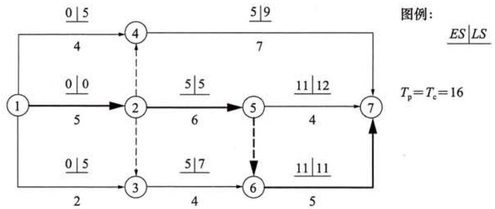

*图3.3-8双代号网络计划时间参数计算结果（二时标注法）*

**3. 单代号网络计划时间参数的计算**

  单代号网络计划与双代号网络计划所表达的内容完全一样，只是表现形式不同而已。图3.3-6所示双代号网络计划转化的单代号网络计划如图3.3-9所示。下面以图3.3-9所示单代号网络计划为例，说明其时间参数的计算过程。单代号网络计划时间  

  参数计算结果如图3.3-10所示。

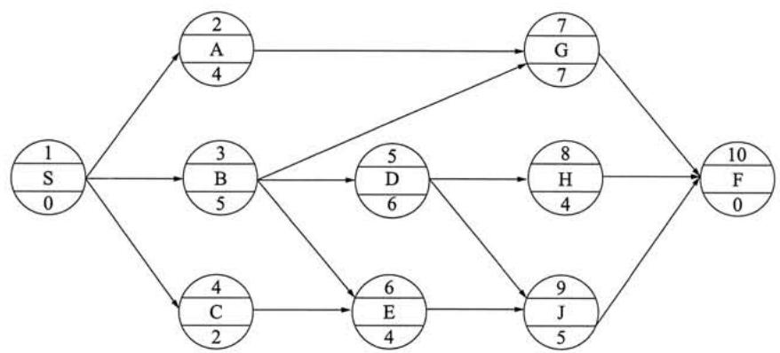

*图3.3-9双代号网络计划转化的单代号网络计划*

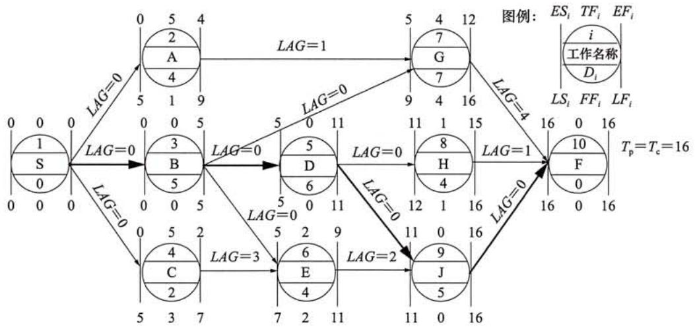

*图3.3-10单代号网络计划时间参数计算结果*

**1）计算工作的最早开始时间和最早完成时间**

  工作最早开始时间和最早完成时间的计算应从网络计划的起点节点开始，顺着箭线方向按节点编号从小到大的顺序依次进行。其计算步骤如下：  

  （1）网络计划起点节点所代表的工作，其最早开始时间未规定时取值为零。例如在本例中，起点节点S所代表的工作（虚拟工作）的最早开始时间为零，即：  

ES1

=0
  （2）工作的最早完成时间应等于本工作的最早开始时间与其持续时间之和，即：  

EFi

=ESi

+Di

  式中 EFi

 工作 i 的最早完成时间；ESi

 工作 i 的最早开始时间；Di

 工作 i 的持续时间。  

  例如在本例中，虚工作S和工作A的最早完成时间分别为：  

arrayrEF1

=ES1

+D1

=0+0=0\EF2

=ES2

+D2

=0+4=4array
  （3）其他工作的最早开始时间应等于其紧前工作最早完成时间的最大值，即：  

ESj

=max{EFi

}
  式中 ESj

 —工作 j 的最早开始时间；  

  EFi

 —工作 j 的紧前工作 i 的最早完成时间。  

  例如在本例中，工作D和工作E的最早开始时间分别为：  

ES5

=EF3

=5
ES6

=max{EF3

, EF4

}=max{5,2}=5
  （4）网络计划的计算工期等于其终点节点所代表的工作的最早完成时间。例如在本例中，其计算工期为：  

Tc

=EF10

=16

**2）计算相邻两项工作之间的时间间隔**

  相邻两项工作之间的时间间隔是指其紧后工作的最早开始时间与本工作最早完成时间的差值，即：  

LAGi,j

=ESj

–EFi

  式中 LAGi,

 —工作 i 与其紧后工作 j 之间的时间间隔；  

  ESj

 —工作 i 的紧后工作 j 的最早开始时间；  
  EFi

 —工作 i 的最早完成时间。  

  例如在本例中，工作A与工作G、工作C与工作E的时间间隔分别为：  

LAG2,7

=ES7

-EF2

=5-4=1
LAG4, 6

=ES6

-EF4

=5-2=3

**3）确定网络计划的计划工期**

  网络计划的计划工期仍按式（3.3-1）或式（3.3-2）确定。在本例中，假设未规定要求工期，则其计划工期就等于计算工期，即：  

Tp

=Tc

=16

**4）计算工作的总时差**

  工作总时差的计算应从网络计划的终点节点开始，逆着箭线方向按节点编号从大到小的顺序依次进行。  

  （1）网络计划终点节点 n 所代表的工作的总时差应等于计划工期与计算工期之差，即：  

TFn

=Tp

-Tc

  当计划工期等于计算工期时，该工作的总时差为零。例如在本例中，终点节点 ⑩ 所代表的工作F（虚工作）总时差为：  

TF10

=Tp

-Tc

=16-16=0
  （2）其他工作的总时差应等于本工作与其各紧后工作之间的时间间隔加该紧后工作的总时差所得之和的最小值，即：  

TFi

=min {LAGi,j

+TFj

}
  式中 TFi

 —工作 i 的总时差；  

  LAGi,j

 —工作 i 与其紧后工作 j 之间的时间间隔；TFj

 一工作 i 的紧后工作 j 的总时差。  

  例如在本例中，工作D和工作E的总时差分别为：

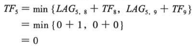

TF6

=LAG6,9

+TF9

=2+0=2

**5）计算工作的自由时差**

  （1）网络计划终点节点 n 所代表的工作的自由时差等于计划工期与本工作的最早完成时间之差，即：  

FFn

=Tp

-EFn

  式中 FFn

 —终点节点 n 所代表的工作的自由时差；  

  Tp

 网络计划的计划工期；  

  EFn

 —终点节点 n 所代表的工作的最早完成时间（即计算工期）。  

  例如在本例中，终点节点 ⑩ 所代表的工作F（虚工作）的自由时差为：  

FF10

=Tp

-EF10

=16-16=0
  （2）其他工作的自由时差等于本工作与其紧后工作之间时间间隔的最小值，即：  

FFi

=min{LAGi,j

}
  例如在本例中，工作D和工作E的自由时差分别为：  

FF5

=min{LAG5,8

, LAG5,9

}=min{0, 0}=0
FF6

=LAG6,9

=2
  6）计算工作的最迟完成时间和最迟开始时间  

  工作最迟完成时间和最迟开始时间的计算可按以下两种方法进行：  

  （1）根据总时差计算  

  ① 工作最迟完成时间等于本工作的最早完成时间与其总时差之和，即：  

LFi

=EFi

+TFi

  例如在本例中，工作D和工作E的最迟完成时间分别为：  

LF5

=EF5

+TF5

=11+0=11
LF6

=EF6

+TF6

=9+2=11
  ② 工作最迟开始时间等于本工作的最早开始时间与其总时差之和，即：  

LSi

=ESi

+TFi

  例如在本例中，工作D和工作E的最迟开始时间分别为：  

arraycLSs

=ESs

+TFs

=5+0=5\LS6

=ES6

+TF6

=5+2=7array
  （2）根据计划工期计算  

  工作最迟完成时间和最迟开始时间的计算应从网络计划的终点节点开始，逆着箭线方向按节点编号从大到小的顺序依次进行。  

  ① 网络计划终点节点 n 所代表工作的最迟完成时间等于该网络计划的计划工期，即：  

LFn

=Tp

  例如在本例中，终点节点 ⑩ 所代表的工作F（虚工作）的最迟完成时间为：  

LF10

=Tp

=16
  ② 工作的最迟开始时间等于本工作的最迟完成时间与其持续时间之差，即：  

LSi

=LFi

-Di

  例如在本例中，虚工作F和工作G的最迟开始时间分别为：  

LS10

=LF10

-D10

=16-0=16
LS7

=LF7

-D7

=16-7=9
  ③ 其他工作的最迟完成时间等于该工作各紧后工作最迟开始时间的最小值，即：  

LFi

=min{LSj

}
  式中 LFi

 —工作 i 的最迟完成时间；  

  LSj

 —工作 i 的紧后工作 j 的最迟开始时间。  

  例如在本例中，工作D和工作E的最迟完成时间分别为：  

LF5

=min{LS8

,LS9

}=min{12,11}=11
LF6

=LS9

=11

**4. 双代号时标网络计划中时间参数的判定**

  双代号时标网络计划（简称时标网络计划）是指以时间坐标为尺度（小时、天、周、月或季度等）表示工作进度安排的双代号网络计划。时标网络计划宜按各项工作的最早开始时间编制。在时标网络计划中，以实箭线表示工作，实箭线的水平投影长度表示该工作的持续时间；以虚箭线表示虚工作，由于虚工作的持续时间为零，故虚箭线只能垂直画；以波形线表示工作与其紧后工作之间的时间间隔（以终点节点为完成节点的工作除外，当计划工期等于计算工期时，这些工作箭线中波形线的水平投影长度表示其自由时差）。  

  时标网络计划既具有网络计划的优点，又具有横道计划直观易懂的优点。由于时标网络计划可将网络计划的时间参数直观地表达出来，故可从时标网络计划中直接判定时间参数。  

  根据图3.3-6绘制的双代号时标网络计划如图3.3-11所示。图中坐标可采用工作日坐标体系，即工作开始时间是指时间单位的起始时刻、工作完成时间是指时间单位的终了时刻，这样更贴近工程实际。  

  下面以图3.3-11所示双代号时标网络计划为例，说明时间参数的判定方法。

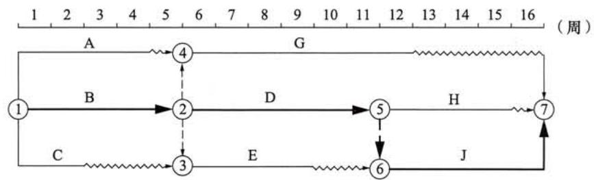

*图3.3-11双代号时标网络计划*

**1）计算工期的判定**

  网络计划的计算工期应等于终点节点所对应的时标值与起点节点所对应的时标值之差。例如，图3.3-11所示时标网络计划的计算工期为：  

Tc

=16-0=16

**2）相邻两项工作之间时间间隔的判定**

  除以终点节点为完成节点的工作外，工作箭线中波形线的水平投影长度表示工作与其紧后工作之间的时间间隔。例如在图3.3-11所示的时标网络计划中，工作A与工作G之间的时间间隔为1；工作C与工作E之间的时间间隔为3；工作E与工作J之间的时间间隔为2；其他工作之间的时间间隔均为零。

**3）工作六个时间参数的判定**

  （1）工作最早开始时间和最早完成时间的判定。工作箭线左端节点中心所对应的时标值为该工作的最早开始时间。当工作箭线中没有波形线时，其右端节点中心所对应的时标值为该工作的最早完成时间；当工作箭线中有波形线时，工作箭线实线部分右端点所对应的时标值为该工作的最早完成时间。例如在图3.3-11所示的时标网络计划中，工作A和工作D的最早开始时间分别为第1周初和第6周初，最早完成时间分别为第4周末和第11周末。  

  （2）工作总时差的判定。工作总时差的判定应从网络计划的终点节点开始，逆着箭线方向依次进行。  

  ① 以终点节点为完成节点的工作，其总时差应等于计划工期与本工作最早完成时间之差，即：  

TFi-n

=Tp

-EFi-n

  式中 TFi-n

 1 以网络计划终点节点 n 为完成节点的工作的总时差；  

  Tp

 ——网络计划的计划工期；EFi-n -以网络计划终点节点 n 为完成节点的工作的最早完成时间。  

  例如在图3.3-11所示的时标网络计划中，计划工期为16周时，工作G、工作H和工作J的总时差分别为：  

TF57

=Tp

-EF57

=16-15=1
TF6

=Tp

-EF6

=16-16=0
  ② 其他工作的总时差等于其紧后工作的总时差加本工作与该紧后工作之间的时间间隔所得之和的最小值，即：  

TFij

=min {TFj-k

+LAGi-j,j-k

}
  式中 TFi-j

 一 工作 i-j 的总时差；  

  TFj-k

 工作 i-j 的紧后工作 j-k （非虚工作）的总时差；LAGi-j,j-k 工作 i-

j 与其紧后工作 j-k （非虚工作）之间的时间间隔。  

  例如在图3.3-11所示的时标网络计划中，工作A、工作C和工作D的总时差分别为：

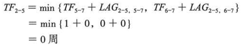

  （3）工作自由时差的判定  

  ① 以终点节点为完成节点的工作，其自由时差应等于计划工期与本工作最早完成时间之差，即：  

FFi-n

=Tp

-EFi-n

  式中 FFi-n

 以网络计划终点节点 n 为完成节点的工作的总时差；  

  Tp

 ——网络计划的计划工期；EFi-n

 ——以网络计划终点节点 n 为完成节点的工作的最早完成时间。  

  例如在图3.3-11所示的时标网络计划中，工作G、工作H和工作J的自由时差分别为：  

  事实上，以终点节点为完成节点的工作，其自由时差与总时差必然相等。  

  ② 其他工作的自由时差就是该工作箭线中波形线的水平投影长度。但当工作之后只紧接虚工作时，则该工作箭线上一定不存在波形线，而其紧接的虚箭线中波形线水平投影长度的最短者为该工作的自由时差。  

  例如在图3.3-11所示的时标网络计划中，工作B和工作D的自由时差均为零，而工作A、工作C和工作E的自由时差分别为1周、3周和2周。  

  （4）工作最迟开始时间和最迟完成时间的判定  

  ① 工作的最迟开始时间等于本工作的最早开始时间与其总时差之和，即：  

LSi-j

=ESi-j

+TFi-j

  式中 LSi-j

 工作 i-

j 的最迟开始时间；ESi-j

 工作 i-j 的最早开始时间；TFi-j

 工作 i-j 的总时差。  

  例如在图3.3-11所示的时标网络计划中，工作A、工作C、工作E、工作G和工作H的最迟开始时间分别为：  

  ② 工作的最迟完成时间等于本工作的最早完成时间与其总时差之和，即：  

LFi-j

=EFi-j

+TFi-j

  式中 LFi-j

 一工作 i-j 的最迟完成时间；  

  EFi-j

 一 工作 i-

j 的最早完成时间；  
  TFi-j

 —工作 i-j 的总时差。  

  例如在图3.3-11所示的时标网络计划中，工作A、工作C、工作E、工作G和工作H的最迟完成时间分别为：  

  LF1-3

=EF1-3

+TF1-3

=2+5=7 （第7周末）LF3-6

=EF3-6

+TF3-6

=9+2=11 （第11周末）LF4-7

=EF4-7

+TF4-7

=12+4=16 （第16周末）LFs

=EFs

+TFs

=15+1=16 （第16周末）  

  图3.3-11所示时标网络计划中时间参数的判定结果与图3.3-7所示双代号网络计划时间参数计算结果完全一致。

#### 3.3.3 关键工作及关键线路确定方法

  网络图中从起点节点开始，沿箭头方向顺序通过一系列箭线与节点，最后到达终点节点的通路称为线路。线路既可依次用该线路上的节点编号来表示，也可依次用该线路上的工作名称来表示。  

  在关键线路法（CPM）中，线路上所有工作的持续时间总和称为该线路的总持续时间。总持续时间最长的线路称为关键线路，关键线路的长度就是网络计划的总工期。工程网络计划中的关键线路可能不止一条。在工程网络计划实施过程中，关键线路还会发生转移。  

  关键线路上的工作称为关键工作。在工程网络计划实施过程中，关键工作的实际进度提前或拖后，均会对总工期产生影响。因此，关键工作的实际进度是建设工程进度控制的工作重点。

**1. 双代号网络计划中关键工作及关键线路的确定**

**1）利用总时差进行判定**

  在工程网络计划中，总时差最小的工作为关键工作。特别地，当计划工期等于计算工期时，总时差为零的工作就是关键工作。例如在图3.3-7和图3.3-8所示双代号网络计划中，工作1-2、工作2-5和工作6-7的总时差均为零，故为关键工作。  

  找出关键工作之后，将这些关键工作首尾相连，便构成从起点节点到终点节点的通路，位于该通路上各项工作的持续时间总和最大，这条通路就是关键线路。在关键线路上可能有虚工作存在。  

  关键线路一般用粗箭线或双线箭线标出，也可用彩色箭线标出。例如图3.3-7和图3.3-8所示双代号网络计划中，线路 ①②⑤⑥⑦ 即为关键线路。关键线路上各项工作持续时间总和应等于网络计划的计算工期，这一特点也是判别关键线路是否正确的准则。

**2）采用标号法进行判定**

  标号法是一种快速寻求网络计划计算工期和关键线路的方法。所谓标号法，是指利用按节点计算法的基本原理，对网络计划中的每一个节点按顺序进行标号，然后利用标号值确定网络计划的计算工期和关键线路。  

  （1）标号法计算过程。下面仍以图3.3-6所示网络计划为例，说明标号法的计算过程。双代号网络计划标号法计算结果如图3.3-12所示。  

  ① 网络计划起点节点的标号值为零。例如在本例中，节点 ① 的标号值为零，即：  

b1

=0
  ② 其他节点的标号值应根据式（3.3-30）按节点编号从小到大的顺序逐个进行计算：  

bj

=max{bi

+Di-j

}
  式中 bj

 工作 i-

j 的完成节点 j 的标号值；  

  bi

 工作 i-j 的开始节点 i 的标号值；  

  Di-j

 工作 i-j 的持续时间。  

  例如在本例中，节点 ② 和节点 ③ 的标号值分别为：  

b2

=b1

+D1-2

=0+5=5
arraycb3

=max{b1

+D1-3

, b2

+D2-3

}\\=max{0+2, 5+0}\\=5array
  当计算出节点的标号值后，应用其标号值及其源节点对该节点进行双标号。所谓源节点，就是用来确定本节点标号值的节点。例如在本例中，节点 ③ 的标号值5是由节点 ② 所确定，故节点 ③ 的源节点就是节点 ② 。如果源节点有多个，应将所有源节点标出。  

  ③ 网络计划的计算工期就是网络计划终点节点的标号值。例如在本例中，计算工期就等于终点节点 ⑦ 的标号值16。  

  ④ 关键线路应从网络计划的终点节点开始，逆着箭线方向按源节点确定。例如在本例中，从终点节点 ⑦ 开始，逆着箭线方向按源节点可以找出关键线路为 ①② ⑤⑥⑦ 。

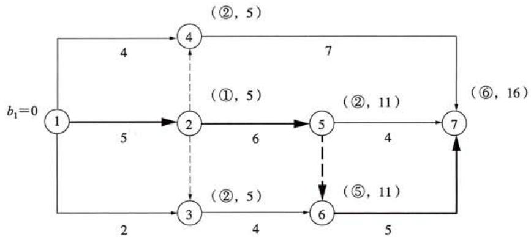

*图3.3-12双代号网络计划标号法计算结果*

  （2）关键节点与关键工作、关键线路的关系。在双代号网络计划中，关键线路上的节点称为关键节点。关键工作两端的节点必为关键节点，但两端为关键节点的工作不一定是关键工作。关键节点的最迟时间与最早时间的差值最小。特别地，当计划工期等于计算工期时，关键节点的最早时间与最迟时间必然相等。例如在本例中，节点 ① 二② 、 ⑤ 、 ⑥ 、 ⑦ 就是关键节点。关键节点必然处在关键线路上，但由关键节点组成的线路不一定是关键线路。例如在本例中，由关键节点 ① 、 ② 、 ⑤ 、 ⑦ 组成的线路就不是关键线路。  

  当计划工期与计算工期相等时，双代号网络计划中的关键节点具有以下特性：  

  ① 开始节点和完成节点均为关键节点的工作，不一定是关键工作。例如在图3.3-7所示双代号网络计划中，节点 ⑤ 和节点 ⑦ 为关键节点，但工作5-7为非关键工作。由于其两端为关键节点，机动时间不可能为其他工作所利用，故其总时差和自由时差均为1。  

  ② 以关键节点为完成节点的工作，其总时差和自由时差必然相等。例如在图3.3-7所示双代号网络计划中，工作3-6的总时差和自由时差均为2；工作4-7的总时差和自由时差均为4；工作5-7的总时差和自由时差均为1。

**3）基于时标网络计划进行判定**

  时标网络计划中的关键线路可从网络计划的终点节点开始，逆着箭线方向进行判定。凡自始至终不出现波形线的线路即为关键线路。因为不出现波形线，就说明在这条线路上相邻两项工作之间的时间间隔全部为零，也就是在计算工期等于计划工期的前提下，这些工作的总时差和自由时差全部为零。例如在图3.3-11所示时标网络计划中，线路 ①→②→⑤→⑥→⑦ 即为关键线路，关键线路中的工作B、工作D和工作J即为关键工作。

**2. 单代号网络计划中关键工作及关键线路的确定**

**1）利用工作总时差进行判定**

  如前所述，总时差最小的工作为关键工作。将这些关键工作相连，并保证相邻两项关键工作之间的时间间隔为零而构成的线路就是关键线路。  

  例如在图3.3-10所示单代号网络计划中，由于工作B、工作D和工作J的总时差均为零，故这些工作均为关键工作。由网络计划的起点节点 ① 和终点节点 ⑩ 与上述三项关键工作组成的线路上，相邻两项工作之间的时间间隔全部为零，故线路 ①③ ⑤⑨⑩ 为关键线路。

**2）利用相邻两项工作之间的时间间隔进行判定**

  从网络计划的终点节点开始，逆着箭线方向依次找出相邻两项工作之间时间间隔全部为零的线路即为关键线路。例如图3.3-10所示单代号网络计划中，逆着箭线方向可以直接找出关键线路 ①→③→⑤→⑨→⑩ ，因为在这条线路上，相邻两项工作之间的时间间隔均为零。

### 3.4 施工进度控制

#### 3.4.1 施工进度计划实施中的检查与分析

  在施工进度计划实施过程中，应经常地、定期地对进度计划执行情况进行动态监测，并进行实际进度与计划进度的比较分析，以便发现问题，及时采取措施调整计划。施工进度监测和调整的系统过程如图3.4-1所示。

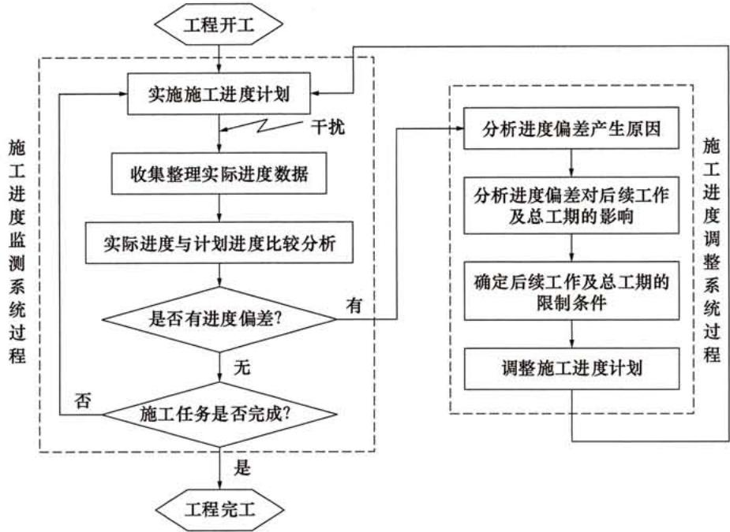

*图3.4-1施工进度监测和调整的系统过程*

**1. 施工进度监测系统过程**

**1）收集整理实际进度数据**

  在施工进度计划执行过程中，需要通过跟踪检查进度计划执行情况收集反映工程实际进度的有关数据，这些实际进度数据是分析施工进度和调整施工进度计划的直接依据。施工进度管理人员可通过施工进度报表和现场实地检查等方式收集实际进度数据。此外，施工进度协调会议也是收集实际进度数据的主要方式。收集到的实际进度数据需要进行加工处理，形成与计划进度具有可比性的数据。

**2）实际进度与计划进度比较分析**

  将工程实际进度数据与计划进度数据进行比较，可以确定实际施工进展状况与计划目标的偏差。通常可采用3.4.2节所述方法直观比较分析实际进度与计划进度，从而得出实际进度比计划进度超前、拖后或一致的结论，从而为施工进度计划调整提供依据。

**2. 施工进度调整系统过程**

  在施工进度监测过程中，一旦发现实际进度偏离计划进度，即出现进度偏差时，就需要分析进度偏差产生原因及进度偏差对后续工作和总工期的影响，然后在此基础上判断是否有必要采取措施调整进度计划，以确保施工进度目标的实现。

**1）分析进度偏差产生原因**

  通过实际进度与计划进度的比较分析，发现有进度偏差时，首先需要分析产生进度偏差的原因，以便后续采取措施予以纠偏。造成施工进度偏差的原因有多种，但可分为两大类：一类属于施工单位自身原因；另一类属于施工单位以外原因，如建设单位延迟提供施工场地、施工图纸等，以及出现不可抗力原因等。  

  如因施工单位自身原因造成施工进度拖后而延长工期，属于工期延误，由此造成的一切损失由施工单位承担。施工单位需要采取赶工措施加快施工进度。同时，建设单位还可按合同约定对施工单位施行误期违约罚款。如因建设单位或不可抗力原因造成施工进度拖后而有可能延长工期，施工单位则有权要求延长合同工期。一旦确认属于非施工单位原因造成工期延长，不仅项目监理机构要批准工程延期，而且施工单位还可能提出费用索赔以弥补因建设单位原因造成的损失。由此可见，分析判断施工进度偏差产生原因，对于建设单位和施工单位都十分重要。

**2）分析进度偏差对后续工作及总工期的影响**

  基于施工进度网络计划，利用自由时差和总时差可以分析某项工作的实际进度偏差对后续工作及总工期的影响程度，以确定是否应采取措施调整进度计划。  

  （1）当工作实际进度拖后的时间（偏差）未超过该工作的自由时差时，则该工作实际进度偏差既不影响该工作后续工作的正常进行，也不会影响总工期。  

  （2）当工作实际进度拖后的时间（偏差）超过该工作的自由时差，但未超过该工作的总时差时，则该工作实际进度偏差会影响该工作后续工作的正常进行，但不会影响总工期。  

  （3）当工作实际进度拖后的时间（偏差）超过该工作的总时差时，则既影响该工作后续工作的正常进行，也会影响总工期。

**3）确定后续工作及总工期的限制条件**

  当实际进度偏差影响后续工作及总工期时，在采取措施调整施工进度计划前，应首先确定施工进度可调整的范围，也即关键节点、后续工作限制条件及总工期允许变化的范围。这些限制条件往往与施工合同条款有关，需要认真分析后确定。

**4）调整施工进度计划**

  应以后续工作及总工期的限制条件为依据，选取适宜的方法调整施工进度计划，然后按调整后的施工进度计划实施，确保施工进度目标得以实现。

#### 3.4.2 实际进度与计划进度比较方法

  实际进度与计划进度比较是施工进度控制的主要环节。常用的比较方法有：横道图比较法、S曲线比较法和前锋线比较法等。

**1. 横道图比较法**

  横道图比较法是一种基于横道计划的进度比较方法。由于横道计划应用的广泛性，从而使横道图比较法成为最常用的实际进度与计划进度比较方法。在施工进度计划执行过程中，只需将检查收集的实际进度数据加工整理后直接以横道线形式平行绘制于原计划横道线下方，即可形象直观地反映各项工作的实际进度、计划进度及其偏差情况。

**2. S曲线比较法**

  从整个工程实际进展全过程看，单位时间投入的资源量通常是在开始和结束时较少，中间阶段较多。相应地，单位时间完成的任务量也呈同样变化规律。这样，随工程进展累计完成的任务量曲线形状就会像英文字母“S”，S曲线因此而得名。  

  S曲线比较法是指以横坐标表示时间，纵坐标表示累计完成工程任务量的实际进度与计划进度比较的方法。采用S曲线比较法，可在同一坐标系中表示整个工程在不同时点计划累计任务量、实际累计完成任务量及其偏差情况。某工程S曲线比较图如图3.4-3所示。

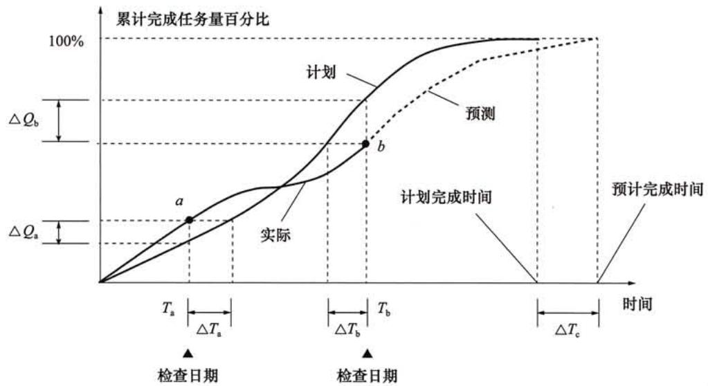

*利用S曲线法进行实际进度与计划进度比较，可以获得以下信息：*

*图3.4-3某工程S曲线比较图*

  （1）工程实际进展状况。若工程实际进展点落在计划S曲线左侧（如图3.4-3中的a点），表明此时实际进度超前；若工程实际进展点落在计划S曲线右侧（如图3.4-3中的 b 点），表明此时实际进度拖后；若工程实际进展点正好落在计划S曲线上，则表示此时实际进度与计划进度一致。  

  （2）工程实际进度超前或拖后的时间。在S曲线比较图中可以直接读出实际进度超前或拖后的时间。例如在图3.4-3中， △Ta

 表示该工程在 Ta

 时刻实际进度超前的时间；△Tb

 表示该工程在 Tb

 时刻实际进度拖后的时间。  

  （3）工程实际超额完成或拖欠的任务量。在S曲线比较图中也可直接读出实际超额完成或拖欠的任务量。例如在图3.4-3中， △Qa

 表示该工程在 Ta

 时刻超额完成的任务量； △Qb

 表示该工程在 Tb

 时刻实际拖欠的任务量。  

  （4）后期工程进度预测。若后期工程仍按原计划速度进行，则可作出后期工程计划S曲线如图3.4-3中虚线所示，从而可依此预计工期拖延 △Tc

**3. 前锋线比较法**

  前锋线比较法是指在时标网络计划中通过绘制实际进度前锋线进行实际进度与计划进度比较的方法。所谓实际进度前锋线，是指在施工进度时标网络计划中，从实际进度检查时刻的时标点出发，用点划线依次将各项工作实际进展位置点连接而成的折线。

**1）实际进度前锋线的绘制**

  实际进度前锋线通常应从时标网络计划图上方时间坐标的实际进度检查时刻开始绘制，依次连接相邻工作的实际进展位置点，最后与时标网络计划图下方坐标的实际进度检查时刻相连接。  

  工作实际进展位置点的标定有以下两种方法：  

  （1）按照工作已完任务量比例进行标定。假设施工进度计划中各项工作均为匀速进展，根据实际进度检查时刻各项工作已完任务量占其计划完成总任务量的比例，在工作箭线上从左至右按相同比例标定其实际进展位置点。  

  （2）按尚需作业时间进行标定。当某些工作的持续时间难以按实物工程量来计算而只能凭经验估算时，可以先估算出实际进度检查时刻到该工作全部完成尚需作业的时间，然后在工作箭线上从右向左逆向标定其实际进展位置点。

**2）实际进度与计划进度的比较**

  实际进度前锋线可以直观反映实际进度检查时刻有关工作实际进度与计划进度之间的关系。具体而言，某项工作的实际进度与计划进度之间的关系可能存在以下三种情况：  

  （1）工作实际进展位置点落在实际进度检查时刻的左侧，表明该工作实际进度拖后，两者之差即为实际进度拖后的时间。  

  （2）工作实际进展位置点与实际进度检查时刻重合，表明该工作实际进度与计划进度一致。  

  （3）工作实际进展位置点落在实际进度检查时刻的右侧，表明该工作实际进度超前，两者之差即为实际进度超前的时间。

**3）实际进度偏差对后续工作及总工期的影响分析**

  利用前锋线比较法，不仅可以分析施工进度计划中工作实际进度与计划进度的偏差，而且可以根据工作的自由时差和总时差进一步分析预测工作进度偏差对该工作后续工作及工程总工期的影响。因此，前锋线比较法既适用于工作实际进度与计划进度之间的局部比较，又可用来分析预测工程项目整体进度状况。

#### 3.4.3 施工进度计划调整方法及措施

  当工程实际进度偏差影响到后续工作、总工期而需要调整施工进度计划时，调整方法主要有两种：一是通过压缩某些工作的持续时间来缩短工期；二是通过改变某些工作的逻辑关系来缩短工期。在实际工作中，可根据具体情况选用上述方法或综合应用上述方法调整施工进度计划。

**1. 压缩某些工作的持续时间**

  这种调整方法的特点是不改变施工进度计划中工作之间的逻辑关系，通过采取增加资源投入、提高劳动效率等措施，来缩短某些工作的持续时间，以达到加快施工进  

  度、缩短工期的目的。这些被压缩持续时间的工作是位于关键线路和超过计划工期的非关键线路上的工作。同时，这些工作又是其持续时间可被压缩的工作。这种施工进度计划的调整通常可利用工程网络计划优化方法直接进行。  

  为压缩某些工作的持续时间，通常需要采取以下措施来达到目的：  

  （1）组织措施。如：增加工作面，组织更多施工队伍；增加每天施工时间，采用加班或多班制施工方式；增加劳动力和施工机械数量等。  

  （2）技术措施。如：改进施工工艺和施工技术，缩短工艺技术间歇时间；采用更先进的施工方式（如将现浇混凝土方案改为预制装配方案），减少施工过程数量；采用更先进的施工机械等。  

  （3）经济措施。如：实行包干奖励；提高奖金数额；对所采取的技术措施给予相应经济补偿等。  

  （4）其他配套措施。如：改善外部配合条件；改善施工作业环境；实施强有力的组织调度等。

**2. 改变某些工作间的逻辑关系**

  这种调整方法的特点是不改变施工进度计划中工作的持续时间，通过改变某些工作的开始时间和完成时间，来达到加快施工进度、缩短工期的目的。当施工进度计划中影响后续工作（后续工作的拖延有限制时）及总工期的工作之间逻辑关系允许改变时，可以通过改变其逻辑关系，将顺序作业的工作改为平行作业、搭接作业或分段组织流水作业等，均可有效缩短工期。  

  当然，无论组织平行作业、搭接作业或分段组织流水作业，单位时间内的资源需求量均会增加。

## 第4章 施工质量管理

### 4.1 施工质量影响因素及管理体系

#### 4.1.1 工程质量形成过程及影响因素

  根据《质量管理体系基础和术语》GB/T19000一2016，质量是指客体的一组固有特性满足要求的程度。工程质量则是指建设工程固有特性满足相关标准规定和合同约定要求的程度。

**1. 建设工程固有特性**

  建设工程固有特性包括明示特性和隐含特性。明示特性是指由相关标准规定和合同约定的明确要求，隐含特性则是指客体隐含的内在要求，如住宅建筑应采光良好就是一种隐含特性。建设工程固有特性满足要求的程度反映了工程质量的优劣。建设工程固有特性如图4.1-1所示，这些固有特性在不同建设工程中的重要性各有不同，满足要求的程度也会各有不同。

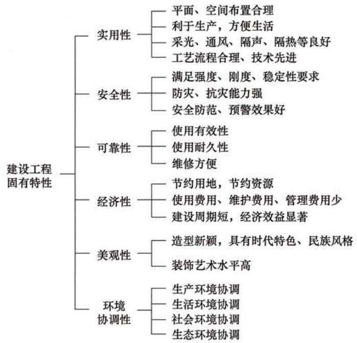

*图4.1-1建设工程固有特性*

**2. 工程质量形成过程**

  建设工程投资决策和建设实施过程，就是工程质量的形成过程。由此可见，工程质量的形成过程是一个循序渐进的过程，这个过程就是工程建设程序。建设工程投资决策和建设实施各阶段对工程质量有着不同程度的影响。要控制工程质量，就必须严格执行工程建设程序，对建设工程投资决策和建设实施各阶段的质量进行严格控制。

**1）工程投资决策**

  建设工程投资决策阶段主要是确定建设工程应达到的质量目标及水平。工程建设需要控制投资、质量和进度三大总体目标。要做到投资、质量、进度三者协调统一，达到业主最为满意的质量水平，则应通过可行性研究和多方案论证来确定。因此，投资决策阶段是影响工程质量的关键阶段，要充分反映业主对质量的要求和意愿。在进行投资决策时，应从整个国民经济角度出发，根据国民经济发展的长期规划和资源条件，有效地控制投资建设规模，以确定最佳的投资方案、质量目标和建设周期。

**2）工程勘察设计**

  建设工程勘察设计是根据投资决策阶段已确定的质量目标和水平，通过工程勘察、设计使其具体化。工程设计在技术上是否可行、工艺是否先进、经济是否合理、设备是否配套、结构是否可靠等，都将决定着工程建成后的功能和使用价值。因此，勘察设计阶段是影响工程质量的决定性阶段。

**3）工程施工**

  工程施工阶段是根据合同约定、设计文件和图纸要求，通过施工形成工程实体。这一阶段直接影响工程的最终质量。因此，工程施工阶段是工程质量控制的关键阶段。

**4）工程竣工验收**

  工程竣工验收是对施工阶段的质量（施工质量）进行试车运转、检查评定、考核质量目标是否符合合同约定、设计文件的质量要求。这一阶段是工程建设向生产使用转移的必要环节，影响工程能否最终形成生产能力，体现了工程质量水平的最终结果。

**5）工程保修**

  工程竣工验收合格后，在规定的保修期限内，因勘察、设计、施工、材料等原因造成的质量缺陷，由施工承包单位负责维修、返工或更换，由责任单位负责赔偿损失。工程质量保修制度对于促进工程建设各方加强质量管理，保护用户及消费者的合法权益起到重要的保障作用。

**3. 工程质量影响因素**

  影响工程质量的因素有很多，可归纳为人（Man）、材料（Material）、机械（Machine）、方法（Method）及环境（Environment）等五大方面，即：4M1E。

**1）人因影响**

  工程建设全过程都是通过人的工作来完成的。人包括工程建设的决策者、管理者、操作者。这些人员的质量意识、专业素质和能力，都会直接或间接地对工程质量产生不同程度的影响。人因影响是工程质量影响因素中可变性最大的因素。在工程质量管理中，人的因素起着决定性作用。  

  工程质量管理，应以控制人的因素为基本出发点。作为控制对象，人的工作应避免失误；作为控制动力，应充分调动人的积极性，发挥人的主导作用。  

  我国实行的执业资格制度及作业人员持证上岗制度，以及培育建筑产业工人队伍，从本质上讲，就是对从事施工活动的人员素质和能力进行必要的控制。

**2）工程材料影响**

  工程材料是指构成工程实体的原材料、半成品、成品、构配件等。这些材料是构成工程实体的物质条件，是工程实体质量的基础。工程材料选用是否得当、质量是否经过检验、质量是否合格等，都会影响工程质量。加强材料质量控制，是控制工程质量的重要基础。

**3）机械设备影响**

  机械设备可分为两类：一类是构成工程实体及配套的工艺设备和各类机具，如用于生产产品的设备、电梯、智能控制及暖通设备等，这些机械设备作为工程实体的一部分，其质量会直接影响工程质量；另一类是指施工机具，即施工过程中使用的各类机械设备，如垂直运输设备，各类操作工具、测量仪器和计量器具，各种施工安全设施等，是现代工程施工中不可缺少的手段。这些机械设备选型是否符合工程特点，性能是否先进和稳定，操作是否安全方便等，都会影响工程质量和施工安全。

**4）方法或工艺影响**

  方法或工艺是指施工方法、施工工艺、施工方案和技术措施等。施工方案的合理性、施工方法或工艺的先进性、技术措施是否适当，均会对工程质量产生较大影响。在制定和审核施工方案和施工工艺时，必须结合工程施工实际，从技术、组织、经济等方面进行全面综合分析，确保施工方案技术上可行、经济上合理，且有利于提高工程质量水平。

**5）环境影响**

  环境因素有很多，主要指自然环境、技术环境和管理环境。自然环境包括地质、水文、气象条件和周边建筑、地下障碍物及其他不可抗力等因素；技术环境包括施工所依据的规范、规程、设计图纸、质量评价标准等因素；管理环境包括质量检验、监控制度、质量管理制度等。环境因素对施工质量的影响具有复杂和多变的特点，且有些因素是人难以控制的。这就需要管理人员尽可能全面地了解可能影响工程质量的各种环境因素，采取相应的预防性控制措施，确保工程质量符合相关要求。

#### 4.1.2 质量管理体系的建立和运行

  质量管理体系（QualityManagementSystem，QMS）是指在质量方面指挥和控制组织的管理体系。通俗地讲，质量管理体系就是为提供满意的产品或者服务，需要通过管理活动实现的所有要素组成的有机整体。也就是说，质量管理体系是为实现组织的质量方针和目标而构建的，质量管理的各种要求和系统有机组成，构成了体系这个整体，质量目标实现的手段是管理。

**1. 质量管理原则及体系文件**

**1）质量管理原则**

  质量管理原则是ISO9000族标准的编制基础。《质量管理体系标准基础和术语》GB/T19001—2016/IS09000:2015提出了质量管理7项原则，具体内容如下：  

  （1）以顾客为关注焦点。质量管理的首要关注点是满足顾客要求并且努力超越顾客期望。组织只有赢得和保持顾客和其他有关相关方的信任才能获得持续成功。与顾客相互作用的每个方面，都提供了为顾客创造更多价值的机会。理解顾客和其他相关方当前和未来的需求，有助于组织的持续成功。  

  （2）领导作用。各级领导建立统一的宗旨和方向，并创造全员积极参与实现组织的质量目标的条件。统一的宗旨和方向的建立，以及全员的积极参与，能够使组织将战略、方针、过程和资源协调一致，以实现其目标。  

  （3）全员积极参与。整个组织内各级胜任、经授权并积极参与的人员，是提高组织创造和提供价值能力的必要条件。为了有效和高效地管理组织，各级人员得到尊重并参与其中是极其重要的。通过表彰、授权和提高能力，促进在实现组织的质量目标过程中的全员积极参与。  

  （4）过程方法。将活动作为相互关联、功能连贯的过程组成的体系来理解和管理时，可更加有效和高效地得到一致的、可预知的结果。质量管理体系是由相互关联的过程所组成。理解体系是如何产生结果的，能够使组织尽可能地完善其体系并优化其绩效。  

  （5）改进。成功的组织持续关注改进。改进对于组织保持当前的绩效水平，对其内、外部条件的变化做出反应，并创造新的机会，都是非常必要的。  

  （6）循证决策。基于数据和信息的分析和评价的决策，更有可能产生期望的结果。决策是一个复杂的过程，并且总是包含某些不确定性。它经常涉及多种类型和来源的输入及其理解，而这些理解可能是主观的。重要的是理解因果关系和潜在的非预期后果。对事实、证据和数据的分析可导致决策更加客观、可信。  

  （7）关系管理。组织与供方是相互依存的，互利的关系可增强双方创造价值的能力。当组织管理与所有相关方的关系，以尽可能有效地发挥其在组织绩效方面的作用时，持续成功更有可能实现。对供方及合作伙伴网络的关系管理是尤为重要的。

**2）质量管理体系文件**

  质量管理体系的建立、健全要从编制完善体系文件开始，质量管理体系的运行、审核与改进都是依据文件的规定进行的，质量管理实施的结果也要形成文件，作为证实和判别质量符合规定要求及质量管理体系有效的证据。编制和使用质量管理体系文件本身就是一项具有动态管理要求的活动。质量管理体系文件主要由质量手册、程序文件、作业指导书、质量计划和质量记录等构成。  

  （1）质量手册。质量手册是企业战略管理的纲领性文件，也是企业开展各项质量活动的指导性、法规性文件。每个企业的质量手册都具有唯一性。质量手册的主要内容包括：质量方针和质量目标；组织机构和质量职责；引用文件；质量管理体系的描述；质量手册的评审、批准和修订。  

  在企业内部，质量手册是由企业最高领导人批准发布的、有权威的、实施各项质量管理活动的基本法规和行动准则；对外部实行质量保证时，是证明企业质量体系存在，是取得用户和第三方信任的手段。质量手册不仅为协调质量体系有效运行提供了有效手段，也为质量体系的评价和审核提供了依据。  

  （2）程序文件。质量体系程序文件是质量手册的支持性文件，是企业各职能部门为落实质量手册要求而规定的细则。企业为落实质量管理工作而建立的各项管理标准、规章制度都属于程序文件范畴。程序文件应当具有唯一性标识，其结构和格式由企业通过方案内容、流程图、表格及上述形式的组合，或企业所需要的任何其他适宜的方式做出规定。程序文件的内容及详略可视企业的实际情况而定。一般有六个通用性管理程序：文件控制程序、质量记录管理程序、内部审核程序、不合格品控制程序、预防措施控制程序和纠正措施控制程序。  

  （3）作业指导书。作业指导书是程序文件的支持性文件，是保证过程质量的最基础文件，并为开展纯技术性质量活动提供指导。作业指导书可以是对具体的作业活动给出的指示性文件，用以指导某个具体过程、事物形成的技术性细节描述的可操作性文件；也可以针对某个部门内部或某个岗位主要活动的文件，侧重描述如何进行操作，是对程序文件的补充或具体化。对这类文件有不同的具体名称，如工作指令、操作规程等。  

  （4）质量计划。质量计划是质量管理体系文件的重要组成部分。《质量管理体系基础和术语》GB/T19000—2016中对“质量计划”的定义是：“对特定的客体，规定由谁及何时应用程序和相关资源的规范”。质量计划提供了一种将某一产品、项目或合同的特定要求与现行的通用质量体系程序联系起来的途径。  

  质量计划的内容包括：质量计划的范围（至少应包括：适用的产品或项目；适用的合同；产品、项目或合同质量目标；具体不适用范围；有效条件）；产品或项目的质量要求；组织机构和管理职责；质量活动的控制；增补岗位文件和相应的质量记录；检测的安排；异常情况处理等。  

  在合同情境下，企业使用质量计划向顾客证明其如何满足特定合同的特殊质量要求，并作为顾客实施质量监督的依据。如果顾客明确提出编制质量计划的要求，则企业编制的质量计划需要取得顾客的认可；一旦得到认可，企业必须严格按计划实施，顾客将用质量计划来评定企业是否能履行合同规定的质量要求。实施过程中企业对质量计划的较大修改都需征得顾客的同意。  

  （5）质量记录。质量记录是记载过程状态和过程结果的文件，是质量管理体系文件的一个重要组成部分。过程状态主要针对产品质量形成过程和体系的运行过程，而过程结果则是指体系运行效果和产品满足质量要求的程度。  

  质量记录应完整地反映质量活动实施、验证和评审的情况，并记载关键活动的过程参数，具有可追溯性。质量记录以规定的形式和程序进行，并有实施、验证、审核等签署意见。

**2. 质量管理体系建立**

  建立、完善质量管理体系一般要经历质量管理体系策划与设计、质量管理体系文件编制、质量管理体系试运行、质量管理体系审核和评审四个阶段，每个阶段又可分为若干具体步骤。

**1）质量管理体系策划与设计**

  企业的最高管理者应对质量管理体系进行策划，以满足企业确定的质量目标要求及质量管理体系总体要求。该阶段主要是做好各种准备工作，包括教育培训，统一认识；组织落实，拟定计划；确定质量方针，制定质量目标；现状调查和分析；调整组织结构，配备资源等。  

  （1）教育培训，统一认识。质量管理体系建立和完善的过程，是始于教育，终于教育的过程，也是提高认识和统一认识的过程，教育培训要分层次、循序渐进地进行。  

  第一层次为决策层，包括党、政、技术领导。主要培训：质量管理和质量保证的发展和本企业的经验教训，说明建立、完善质量体系的迫切性和重要性；通过ISO9000族标准的总体介绍，提高按国家（国际）标准建立质量管理体系的认识；通过质量管理体系要素讲解，明确决策层领导在质量管理体系建设中的关键地位和主导作用。  

  第二层次为管理层，重点是管理、技术和生产部门负责人，以及与建立质量管理体系有关的工作人员。第二层次的人员是建设、完善质量管理体系的骨干力量，起着承上启下的作用，要使他们全面接受ISO9000族标准有关内容的培训，可采取讲解与研讨相结合的培训方式。  

  第三层次为执行层，以及与产品质量形成全过程有关的作业人员。对这一层次人员，主要培训与本岗位质量活动有关的内容，包括在质量活动中应承担的任务，完成任务应赋予的权限，以及造成质量过失应承担的责任等。  

  （2）组织落实，拟定计划。尽管质量管理体系的建设涉及企业所有部门和全体职工，但对大多数企业来说，成立一个精干的工作班子可能是需要的。这个班子可分为三个层次。  

  第一层次，成立以最高管理者（厂长、总经理等）为组长，质量主管领导为副组长的质量管理体系建设领导小组（或委员会）。其主要任务包括：质量体系建设的总体规划；制定质量方针和目标；按职能部门进行质量管理职能分解。  

  第二层次，成立由各职能部门领导（或代表）参加的工作班子。这个工作班子一般由质量管理部门和计划管理部门的领导共同牵头，其主要任务是按照质量管理体系建设的总体规划具体组织实施。  

  第三层次，成立要素工作小组。根据各职能部门的分工明确质量管理体系要素的责任单位，例如，“设计控制”一般应由设计部门负责，“采购”要素由物资采购部门负责。  

  组织和责任落实后，按不同层次分别制定工作计划，在制定工作计划时应注意：  

  ① 要明确目标。要完成什么任务？要解决哪些主要问题？要达到什么目的？  

  ② 要控制进程。建立质量管理体系的主要阶段要规定完成任务的时间表、主要负责人和参与人员，以及其职责分工及相互协作关系。  

  ③ 要突出重点。主要是质量管理体系中的薄弱环节及关键的少数。这少数可能是某个或某几个要素，也可能是要素中的一些活动。  

  （3）确定质量方针，制定质量目标。质量方针是指由组织的最高管理者正式发布的该组织总的质量宗旨和方向，是企业管理者对质量的指导思想和承诺，是企业经营总方针的重要组成部分。质量管理原则可以作为制定质量方针的基础。如某企业的质量方针为：质量第一、健全体系、持续改进、满足客户。  

  质量目标是指组织在质量方面所追求的目的。通常是对组织的相关职能和层次分别规定质量目标。如某企业总的质量目标为：确保生产、经营行为的规范性、合法性；确保质量管理体系的有效运行；确保工程的可靠性、安全性；不断提升企业的质量信誉；最大限度地满足客户需求。  

  质量方针是对满足要求和持续改进质量管理体系有效性的承诺；质量目标是满足产品要求所需的可测量的内容。  

  质量方针通常与组织的总方针相一致，并为制定质量目标提供框架。质量目标一般依据组织的质量方针制定。质量方针是制定和评审质量目标的框架，质量目标应与质量方针保持一致。  

  （4）现状调查和分析。现状调查和分析的目的是合理地选择质量管理体系要素，内容包括：  

  ① 体系情况分析。即分析本组织的质量管理体系情况，以便根据所处的质量管理体系情况选择质量管理体系要素的要求。  

  ② 产品特点分析。即分析产品的技术密集程度、使用对象、产品安全特性等，以确定要素的采用程度。  

  ③ 组织结构分析。即分析组织的管理机构设置是否适应质量体系的需要。应建立与质量体系相适应的组织结构，并确立各机构间隶属关系、联系方法。  

  ④ 生产设备和检测设备能否适应质量管理体系的有关要求。  

  ⑤ 技术、管理和操作人员的组成、结构及水平状况的分析。  

  ⑥ 管理基础工作情况分析。即标准化、计量、质量责任制、质量教育和质量信息等工作的分析。  

  对以上内容可采取与标准中规定的质量管理体系要素要求进行对比性分析的方式进行分析。  

  （5）调整组织结构，配备资源。一个组织中除质量管理外，还有其他各种管理。由于历史沿革原因，组织机构多数并非按质量形成的客观规律来设置的，因此，在完成落实质量管理体系要素并分解为对应的质量活动后，必须将活动中相应的工作职责和权限分配到各职能部门。为此，需要根据质量管理需求和活动进行组织结构的适当调整和资源的合理配备。

**2）质量管理体系文件编制**

  质量管理体系文件的编制应满足以下要求：  

  （1）质量管理体系文件一般应在第一阶段工作完成后才正式编制，必要时也可交叉进行。如果前期工作不做，直接编制质量管理体系文件，就容易脱离实际，产生系统性、整体性不强等问题。  

  （2）除质量手册需统一组织编制外，其他质量管理体系文件应按分工由归口职能部门分别编制，先提出草案，再组织审核，这样有利于质量管理体系文件的执行。  

  （3）质量管理体系文件的编制应结合本单位质量管理职能分工进行。按所选择的质量管理体系要求，逐个展开形成各项质量活动（包括直接质量活动和间接质量活动），将质量管理职能分配落实到各职能部门。质量活动项目和分配可采用矩阵图的形式表达，质量职能矩阵图也可作为附件附于质量手册之后。  

  （4）为了使所编制的质量管理体系文件做到协调统一，在编制前应制定“质量管理体系文件明细表”，将现行的质量手册（如果已编制）、企业标准、规章制度、管理办法及记录表式收集在一起，与质量管理体系要素进行比较，从而确定新编、增编或修订质量管理体系文件项目。  

  （5）为了提高质量管理体系文件的编制效率，减少返工，在文件编制过程中要加强不同层次的文件之间、同一层次不同文件之间的协调。尽管如此，一套质量好的质量管理体系文件编制也要经过自上而下和自下而上的多次反复。  

  （6）编制质量管理体系文件的关键是讲求实效，不走形式。既要从总体上和原则上满足ISO9000族标准，又要在方法上和具体做法上符合本单位实际。

**3）质量管理体系试运行**

  质量管理体系文件编制完成后，质量管理体系将进入试运行阶段。试运行的目的是检验质量管理体系文件的有效性和协调性，并对暴露出的问题，采取改进措施和纠正措施，以便于进一步完善质量管理体系文件。在质量管理体系试运行过程中，要重点抓好以下工作：  

  （1）有针对性地宣贯质量管理体系文件。使全体职工认识到新建立或完善的质量管理体系是对过去质量管理体系的变革，是为了向国际标准接轨。要适应这种变革，就必须认真学习、贯彻质量管理体系文件。  

  （2）通过试运行检验质量管理体系。质量管理体系文件通过试运行，必然会出现一些问题，全体员工应将实践中出现的问题和改进意见如实反映给有关部门，以便采取纠正措施。  

  （3）持续改进存在的问题。将质量管理体系试运行中暴露出的问题，如对质量管理体系设计不周、项目不全等进行协调、改进。  

  （4）加强信息管理。信息管理不仅是质量管理体系试运行本身的需要，也是保证试运行成功的关键。所有与质量活动有关的人员都应按质量管理体系文件要求，做好质量信息的收集、分析、传递、反馈、处理和归档等工作。

**4）质量管理体系审核与评审**

  质量管理体系审核在体系建立的初始阶段往往更加重要。在这一阶段，质量管理体系审核的重点，主要是验证和确认体系文件的适用性和有效性。  

  审核与评审的主要内容包括：  

  （1）规定的质量方针和质量目标是否可行；（2）体系文件是否覆盖了所有主要质量活动，各文件之间的接口是否清楚；（3）组织结构能否满足质量管理体系运行的需要，各部门、各岗位的质量职责是否明确；（4）质量管理体系要素的选择是否合理；（5）规定的质量记录是否能起到见证作用；（6）所有职工是否养成了按体系文件操作或工作的习惯，执行情况如何。  

  为了使问题尽可能地在试运行阶段暴露无遗，除组织审核组进行正式审核外，还应有广大职工的参与，鼓励他们通过试运行实践，发现和提出问题。在试运行的每一阶段结束后，一般应正式安排一次审核，以便及时对发现的问题进行纠正。对一些重大问题也可根据需要，适时地组织审核。在内部审核的基础上，由最高管理者组织一次体系评审。  

  应当强调的是，质量管理体系是在不断改进中得以完善的，质量管理体系进入正常运行后，仍然要采取内部审核、管理评审等各种手段使质量管理体系能够保持和不断完善。

**3. 质量管理体系运行**

  质量管理体系的运行就是执行质量管理体系文件，实现质量方针和质量目标，保持并不断改进、优化质量管理体系的过程，同时也是质量管理体系发挥实际效能的过程。具体来说，就是在生产及服务全过程，按质量管理体系文件制定的程序、标准、工作要求及目标分解的岗位职责进行操作运行，并按各类体系文件的要求，监视、测量和分析过程的有效性和效率，做好文件规定的记录，持续收集、记录并分析过程数据和信息，全面体现产品的质量和过程符合要求及可追溯的效果。

**1）质量管理体系实施程序**

  质量管理体系文件编制工作结束后，通常通过一定的形式（会议或下达文件等）发布企业管理者指令，宣布质量管理体系文件开始生效，质量管理体系便投入运行实施。  

  通过媒介宣传实施质量管理体系的目的、意义和作用，组织员工学习有关质量管理体系文件，使之掌握各项指令活动的程序管理要求，明确各自的职责和权限，以提高员工执行质量管理体系文件的自觉性和责任感。

**2）质量管理体系运行控制机制**

  要对质量管理体系保持控制才能使其实现效能。质量管理体系运行控制机制包括：组织协调、质量监控、质量信息管理、质量管理体系审核和评审等。  

  （1）组织协调。质量管理体系是借助于企业的组织协调来进行运作的。质量管理体系的运行涉及企业内部几乎所有部门的各项活动。企业所有活动的内容、途径和顺序，都必须在目标、分工、时间和联系方面协调一致，以保持体系的有序性。这些都需要通过组织协调工作来实现。此外，质量管理体系在运行过程中发现问题需采取纠正或改进措施时，也需要通过组织协调来下达工作指令，执行措施。因此，如果没有组织协调工作，质量管理体系就不能正常工作。  

  （2）质量监控。质量管理体系在运行过程中，各项活动及其结果偏离质量标准的现象在所难免，为此，必须实施质量监控。监控分为由第二方或第三方进行的外部质量监控和企业自身进行的内部质量监控两种。第二方监控仅在合同环境下进行。当有关法规对企业的产品质量管理体系有要求时，第三方也将会实施质量监控，质量监控的对象是各项程序、方法、条件、人员、过程、记录、产品和服务等。质量监控的任务是对实体进行连续的监视、验证和控制，发现偏离质量标准的问题，及时反馈，以便采取纠正措施，从而使各项质量活动和产品质量均符合规定的要求。  

  （3）质量信息管理。如果说组织结构是质量管理体系骨架的话，质量信息系统就是质量管理体系的神经系统，其功能在于全面、准确、及时、有效地获取质量信息，保证质量管理体系持续正常运行。在运行过程中，通过质量信息系统对异常信息的反馈和处理，进行动态控制，使各项质量活动和成品质量处于受控状态。  

  质量信息管理与质量监控、组织系统工作是紧密联系在一起的。异常信息一般来自于质量监控，信息处理则有赖于组织系统工作。三者的有机结合是质量管理体系有效运行的基本保证。  

  （4）质量管理体系审核和评审。企业按规定的时间间隔进行质量管理体系审核和评审，是质量管理体系的自我完善手段。在审核中，对质量管理体系要素进行评价，确定质量管理体系的有效性；对运行中存在的问题采取纠正、改进措施，保持质量管理体系的有效性。在评审中，对质量管理体系审核的结果和质量管理体系的环境适应能力进行综合评价，评定质量管理体系的适宜性，对质量管理体系设计中存在的问题和不适宜的结构进行改进，以确保质量管理体系持续地适应和有效。  

  （5）记录和考核。质量管理体系的运行要有充分的证据予以证实。因此，对于上述组织协调、质量监控、质量信息管理、质量管理体系审核和评审等过程和结果，都要及时、准确地进行记录，作为考核依据，并根据考核结果进行激励，以调动员工实施质量管理体系的积极性。

**4. 质量管理体系认证与监督**

  《中华人民共和国建筑法》规定，国家对从事建筑活动的单位推行质量管理体系认证制度。

**1）质量管理体系认证**

  质量管理体系认证是指由取得质量管理体系认证资格的第三方认证机构，依据正式发布的质量管理体系标准，对申请认证企业质量管理体系的质量保证能力依据质量保证模式标准进行检查和评价，对符合标准要求者颁发质量管理体系认证证书，并给予注册公布，以证明企业质量管理和质量保证能力符合相应标准，并有能力按规定的质量要求提供产品的活动。质量管理体系认证是一种外部审核活动。  

  质量管理体系认证按认证申请、检查和评定、审批与注册发证等程序进行。  

  （1）认证申请。要求进行质量管理体系认证的企业（申请方），首先应根据认证机构要求，填写申请书，提供所需资料，向认证机构提出申请。申请书由认证机构统一印制发给申请方。申请书一般包括以下内容：  

  ① 申请方名称、地址、邮政编码、负责人姓名、联系人姓名、职务、电话、传真。  

  ② 申请认证的质量保证模式标准的名称和编号。  

  ③ 申请方表示愿意遵守认证管理办法规定的声明。  

  ④ 申请书的填报日期、申请方负责人签名等。  

  ⑤ 申请书附件，是指说明申请方质量管理体系状况的文件，一般包括以下内容：覆盖所申请认证质量管理体系的质量手册；申请认证质量管理体系所覆盖的产品名录；申请方基本情况，如：申请方的性质和经营状况，主要产品及生产特点，人员、生产设施和装备、验证手段状况，其他足以说明申请方质量保证能力的业绩。  

  认证机构收到申请方的正式申请后，将对申请方的申请文件进行审查，审查内容包括：填报的各项内容是否完整和正确，质量手册的内容大体上是否覆盖了相应质量保证模式标准的要求等。经审查符合规定的，决定接受申请，由认证机构向申请方发出“接受申请通知书”，并通知申请方下一步与认证有关的工作安排、预交认证费用。若经审查不符合规定的，认证机构将及时与申请方联系，要求申请方作必要的补充或修改，符合规定后，再发出“接受申请通知书”。如果确实不能符合规定的申请要求，决定不接受申请的，认证机构将向申请方发出“不接受申请通知书”，说明不接受申请的理由，并退回有关申请文件。  

  （2）检查和评定。对申请方质量管理体系的检查和评定是质量管理体系认证的关键环节。检查和评定的基本任务是：申请文件的详细审查，申请方现场检查前的准备、申请方的现场检查和评定、提出检查报告。对于每个接受申请认证的申请方，均应任命组成一个检查组执行上述检查和评定任务。检查组可以是由认证机构中负责检查的部门直接任命组成，也可以由认证机构委托具有资格的其他的检查机构组成检查组执行检查和评定任务。检查组人数一般由 2∼4 人组成。检查组中至少有一名熟悉申请方生产技术特点的成员。对于任命的检查组成员，申请方认为会与本单位构成利害冲突的，可以要求认证机构作出更换。  

  ① 文件审查。对申请方申请文件进行详细审查是检查组实施检查和评定工作的第一步，也是进一步实施现场检查的基础。文件审查的主要对象是申请书附件，即申请方的质量手册及其他说明申请方质量管理体系的材料。  

  经文件审查符合相应质量保证模式标准的，则在此基础上进一步做好现场检查前的准备工作。若在文件审查中发现存在不能满足相应质量保证模式标准要求的问题，或由于提供的文件中某些方面过于简单，不足以作出判断时，则应通知申请方作出必要的修改、说明或补充，直至检查组认为可以实施现场检查。  

  ② 现场检查前准备。在实施现场检查前，检查组需做好现场检查的准备工作，包括：确定现场检查的日期；根据申请方质量管理体系特点，编制现场检查表，明确重点检查项目与检查方法；确定检查组成员的工作分工、检查活动的日程安排和时间分配。  

  根据需要，检查组可先进行一次预备性考察，以便对申请方的规模、生产特点、技术装备等建立初步印象，从而有助于检查组在正式的现场检查前做充分准备。  

  ③ 现场检查和评定。现场检查和评定的目的是通过查证质量手册的实际执行情况，对申请方质量管理体系运作的有效性作出评价，判定是否真正具备满足相应质量保证模式标准的能力。  

  现场检查和评定的工作可分为：首次会见、现场参观、现场检查、评定、总结会议5个步骤。  

  ④ 提出检查报告。检查报告是现场检查和评价结果的证明文件，由检查组编写，并经检查组全体成员签字后，报送认证机构。  

  （3）审批与注册发证。认证机构对检查组提出的基础报告进行全面审查。经审查，批准通过认证的，由认证机构予以注册并颁发注册证书。经审查，需改进后方可批准通过认证的，由认证机构书面通知申请方需要纠正的问题及完成纠正的期限，到期再进行必要的复查和评价，证明确实达到规定条件的，仍可批准认证并颁发注册证书。经审查，决定不予批准认证的，由认证机构书面通知申请方，并说明未通过认证的理由。

**2）获准认证后的监督管理**

  企业质量管理体系获准认证的有效期为3年。获准认证后，企业应通过经常性的内部审核，维持质量管理体系的有效性，并接受认证机构对企业质量管理体系实施的监督管理。监督管理工作的主要内容包括企业通报、监督检查、认证注销、认证暂停、认证撤销、复评及重新换证等。  

  （1）企业通报。认证合格的企业质量管理体系在运行中出现较大的情况变化（质量手册需作重大调整或修改；质量体系覆盖的产品结构发生重大变化；企业负责人或质量管理体系代表发生变动；质量管理体系覆盖的产品发生重大质量事故）时，需及时向认证机构通报。认证机构接到通报后，将视情况采取必要的监督检查措施。  

  （2）监督检查。认证机构需要对认证合格的企业质量管理体系维持情况进行监督性现场检查，包括定期和不定期的监督检查。定期监督检查通常是每年一次，不定期监督检查视需要临时安排。监督检查的重点为：上次检查时发现缺陷的纠正情况；质量管理体系是否发生变化，以及这些变化对质量管理体系有效性可能产生的影响；质量管理体系中关键项目的执行情况。  

  （3）认证暂停。认证暂停是认证机构对获证企业管理质量体系发生不符合认证要求的情况时采取的警告措施。在认证暂停期间，企业不得使用质量管理体系认证证书进行宣传。认证暂停由认证机构书面通知企业，同时也指明消除暂停的条件。  

  发生以下情况时，认证机构将作出认证暂停的决定：  

  ① 企业提出暂停；  

  ② 监督检查中发现企业质量管理体系存在不符合有关要求的情况，但尚不需要立即撤销认证；  

  ③ 企业不正确使用注册、证书、标志，但又未采取使认证机构满意的补救措施。  

  企业在规定的期限内采取纠正措施并满足规定的条件后，认证机构可撤销认证暂停并通知企业。否则，将撤销认证注册，收回合格证书。  

  （4）认证撤销。当获证企业发生质量管理体系存在严重不符合规定，或在认证暂停的规定期限未予整改的，或发生其他构成撤销体系认证资格情况时，认证机构作出撤销认证的决定。企业不服的，可提出申诉。撤销认证的企业一年后可重新提出认证申请。  

  （5）复评。认证合格有效期满前，企业愿继续延长的，可向认证机构提出复评申请。  

  （6）重新换证。在认证有效期内，出现体系认证标准变更、体系认证范围变更、体系认证证书持有者变更情形的，可按规定重新换证。

#### 4.1.3 施工质量保证体系

  施工质量是指在工程施工过程中，按照设计文件和施工规范要求，采用合格材料和先进工艺，确保各项工程指标和性能均符合规范要求的程度。施工质量保证体系是指为确保建设工程施工质量，以控制和保证施工产品质量为目标，在施工准备、施工生产至竣工投产全过程中运用系统理论和方法，由全体人员参与建立和实施的一套严密、协调、高效的全方位管理体系。

**1. 施工质量保证体系的作用**

  （1）确保质量目标实现。施工质量保证体系通过详细规划质量目标，并将其分解到各个施工阶段和环节，使得每一项工作都有明确的质量指向。例如，设定建筑物的强度、抗震性能等具体指标，体系中的各项措施和监控机制能确保这些指标逐一达成，最终保证整个项目质量目标的圆满实现。  

  （2）规范施工行为。施工质量保证体系规定了施工人员在操作过程中必须遵循的标准和流程，包括材料的选用和处理、施工工艺的执行等。这样，可以避免施工人员凭经验或随意性进行施工。如明确规定了钢筋的绑扎间距、混凝土的浇筑顺序等，使施工行为更加有序和规范，减少因不规范操作导致的质量问题。  

  （3）提升施工管理水平。施工质量保证体系要求建立完善的组织架构，明确各部门和人员的职责，同时引入先进的管理方法和工具。例如，采用信息管理系统对施工过程进行实时监控和数据分析，能够及时发现问题并采取措施，从而推动施工管理从传统模式向现代化、高效化转变，不断提升管理的整体水平。  

  （4）增强质量稳定性。通过严格的质量控制程序和对施工过程中各种影响因素的有效管理，如对施工环境的监测和调整、对设备状态的维护等，保证每一批次、每一个部位的施工质量都能保持在相近的水平，避免出现大的质量波动，确保整个工程质量的稳定性和可靠性。  

  （5）预防质量问题。施工质量保证体系中的质量风险评估和预防措施能够提前识别潜在的质量隐患。比如在基础施工前进行地质勘察，根据勘察结果制定相应的施工方案，可有效预防地基沉降等问题的发生。这样，在问题出现之前就进行干预，大大降低了质量问题产生的概率。  

  （6）提高质量意识。施工质量保证体系强调全员参与，使每个施工人员都清楚自己在质量工作中的责任和重要性。通过培训、宣传等方式不断强化质量意识，让大家从思想上真正重视质量，从而在日常工作中自觉地保证施工质量。  

  （7）增强客户满意度。高质量的工程交付能满足客户对功能、外观等方面的期望，让客户在使用过程中感到放心和满意。这不仅能为企业赢得良好的口碑，还可能带来更多的业务机会和合作，对企业的长远发展至关重要。  

  （8）促进持续改进。施工质量保证体系包含反馈和改进机制，对施工过程中出现的问题进行总结和分析，从而找到改进的方向和方法。例如，通过对质量通病的分析，调整施工工艺或加强质量控制措施，实现施工质量的不断提升，使企业始终保持在行业领先水平。  

  （9）保障工程安全。施工质量的优劣直接影响到工程的安全性。坚固的结构、可靠的设备安装等高质量施工成果能有效降低安全风险。例如，高质量的钢结构焊接可以确保建筑物在受力时的稳定性，减少坍塌等安全事故的发生概率。  

  （10）提高企业竞争力。在竞争激烈的建筑市场中，拥有完善的施工质量保证体系并能打造出高质量工程的企业，更容易获得客户的认可和信任，从而在项目竞标等方面占据优势。这有助于企业扩大市场份额，提升经济效益和社会效益，增强自身的核心竞争力。

**2. 施工质量保证体系的构成**

  施工质量保证体系主要包括以下几方面内容：

**1）施工质量目标**

  施工质量目标是施工质量保证体系的核心导向，它明确了施工项目在质量方面的具体期望结果，如达到特定的质量等级、满足相关标准规范等；质量目标应具有明确性、可衡量性、可实现性、相关性和时限性。例如，某施工项目质量目标可能是确保主体结构达到优良标准，所有分项工程合格率达到 100% ，在预定工期内完工且无重大质量缺陷；施工质量目标要符合项目质量总目标要求；要以工程承包合同为基本依据，逐级分解目标以形成在合同环境下的各级施工质量目标。施工质量目标的分解主要从两个维度展开：从时间维度展开，实现质量目标的全过程控制；从空间维度展开，实现质量目标的全方位和全员管理。

**2）施工质量计划**

  施工质量保证体系应有可行的质量计划。施工质量计划是施工企业根据自身的质量方针和目标，针对特定的工程项目，为确保施工质量而制定的具体规划和行动方案。  

  施工质量计划通常包括以下内容：  

  （1）工程特点及施工条件分析。对工程项目的独特之处、施工面临的环境条件等进行详细剖析，为后续措施制定提供依据。  

  （2）质量目标和要求。明确工程项目要达到的具体质量标准，如各项指标的具体数值等。  

  （3）质量管理组织和职责。规定参与质量管理的各部门及人员的分工和责任。  

  （4）施工工艺和流程。详细阐述施工过程中采用的工艺方法、施工顺序等。  

  （5）资源需求计划。其包括人力、材料、机械设备等资源的配置计划。  

  （6）质量控制措施。如材料检验、工序检查、成品保护等具体的质量控制手段。  

  （7）检验和验收计划。确定检验的时间节点、方法、标准以及验收的程序。  

  （8）质量问题的预防和处理。针对可能出现的质量问题制定预防策略和处理方案。  

  （9）质量记录和文档管理。明确质量记录的内容、格式及文档的保存和管理方式。  

  （10）培训计划。为保证施工人员具备相应质量意识和技能而制定的培训安排。

**3）思想保证体系**

  思想保证体系是施工质量保证体系的基础。要运用全面质量管理的思想、观点和方法，使全体人员树立“质量第一”的观点，增强质量意识，在工程施工全过程中全面贯彻“一切为用户服务”的思想，以达到提高施工质量的目的。

**4）组织保证体系**

  施工质量保证体系必须建立健全各级质量管理组织，分工负责，形成一个有明确任务、职责、权限、互相协调和互相促进的有机整体。组织保证体系的内容主要包括：成立质量管理领导小组，负责质量方针政策的制定和重大质量问题的决策；明确各职能部门的质量责任，如工程部负责施工过程的质量控制，采购部负责材料设备的质量把关等；设置专门的质量监督岗位，对施工全过程进行实时监督和检查。

**5）工作保证体系**

  工作保证体系主要是明确工作任务和建立工作制度，并在以下三个阶段予以落实：  

  （1）施工准备阶段。施工准备是为整个工程项目施工创造条件。在此阶段，要完成各项技术准备工作，进行技术交底和技术培训，制定相应的技术管理制度；按质量控制和检查验收需要，对工程项目进行划分并分级编号；建立工程测量控制网和测量控制制度；进行施工平面设计，建立施工场地管理制度；建立健全材料、机械管理制度等。  

  （2）施工阶段。施工过程是建筑产品形成的过程，在此阶段的质量控制是确保施工质量的关键。必须加强工序质量控制，严格按照既定工序进行施工，确保每道工序的质量；建立质量检查制度，严格实行自检、交接检和专检；开展群众性的QC活动，强化过程控制，以确保施工阶段的工作质量；对施工中的各项参数进行实时监测，发现问  

  题及时采取措施。  

  （3）竣工验收阶段。工程竣工验收是指单位工程或单项工程竣工后，经质量检查合格后移交给建设单位的过程。这一阶段主要应做好：对整个工程进行细致的全面质量检查；针对发现的问题及时整改；成品保护；整理验收资料，确保各项验收资料完整、准确。

**6）制度保证体系**

  制度保证体系是指为了确保施工质量而建立的一套完善的制度框架和运行机制。这一体系涵盖以下几方面内容：  

  （1）制度保证体系明确各参与方在施工质量方面的责任和义务，包括建设单位、施工单位、监理单位等，确保各司其职。（2）制度保证体系包含一系列具体的质量管理制度，如施工组织设计审批制度、材料设备进场检验制度、工序质量检查制度、质量验收制度等，从施工的各个环节进行规范和约束。（3）制度保证体系确立质量监督和考核机制，通过定期或不定期的检查、评估，对施工质量状况进行监督，并根据考核结果进行奖惩，以激励相关人员重视和提升质量。（4）制度保证体系包括质量教育培训制度，确保施工人员具备必要的质量知识和技能，不断提高质量意识和操作水平。（5）质量信息反馈和处理制度，能够及时收集施工过程中出现的质量问题，并迅速采取措施加以解决，防止问题扩大化。

**3. 施工质量保证体系的建立**

  施工质量保证体系的建立，有助于形成良好的质量工作秩序，使施工过程有章可循、有据可依，从而有效提高施工质量的稳定性和可靠性，减少质量问题的发生，保障工程项目达到预期的质量目标。  

  施工质量保证体系建立的过程如下：  

  （1）确定质量方针和目标。结合项目特点和要求，明确质量方针，如“精益求精，打造优质工程”；制定具体、可衡量、可实现、相关联、有时限的质量目标。  

  （2）完善组织架构。设立质量管理领导小组，由项目负责人担任组长；明确各部门在质量管理中的职责和权限，如工程部负责施工过程质量控制，质检部负责质量检查等。  

  （3）制定质量计划。基于质量目标，详细规划各阶段的质量工作，包括质量标准、控制要点、检验方法等。  

  （4）强化人员培训。开展质量意识培训，让全体员工深刻理解施工质量的重要性；进行技术培训，确保员工具备相应的专业技能。  

  （5）建立质量管理制度。如质量责任制度，明确每个人的质量责任；质量检查制度，规定检查的频率、内容和标准；质量奖惩制度，激励员工积极保证质量。  

  （6）明确施工过程控制要点。对关键工序、特殊过程制定专门的控制措施；加强现场管理，确保施工环境符合要求。  

  （7）建立质量信息管理系统。及时收集、整理施工中的质量信息；分析信息，为质量改进提供依据。  

  （8）开展内部审核和管理评审。定期进行内部审核，检查质量体系的运行情况；通过管理评审，评估质量体系的有效性和适应性，并进行必要的调整和改进。  

  通过以上步骤的逐步实施和不断完善，能够建立起一个有效的施工质量保证体系，确保工程项目质量达到预期要求。

**4. 施工质量保证体系的运行**

  施工质量保证体系的运行要点主要包括以下内容：  

  （1）质量目标和施工质量计划作为行动指引，项目管理机构各个部门和岗位都应依据此展开工作。  

  （2）在施工过程中，技术部门严格按照既定的工艺和技术要求进行指导，确保施工操作的规范性；施工人员则认真执行各项规定，保证每一道工序的质量。  

  （3）质量管理人员持续进行现场的巡查和监督，及时发现潜在的质量隐患或已经出现的质量问题，并做好详细记录。  

  （4）一旦发现问题，立即启动处理机制，组织相关人员进行分析和讨论，确定整改措施并迅速实施，确保质量问题得到及时、有效的解决。  

  （5）通过信息反馈渠道，将质量情况及时反馈给管理层和其他相关部门，以便做出相应决策和调整。  

  （6）为了提高人员的积极性和责任心，激励机制需发挥作用，对保证质量工作有突出贡献的给予奖励，对违反规定导致质量问题的进行惩处。  

  此外，要定期对施工质量保证体系的运行效果进行评估和审核，检查体系的有效性和适应性，发现不足之处及时改进和完善，从而推动整个体系的持续、高效运行。

**5. 施工质量的“三全控制”**

  为保证建设工程施工质量，需要融合全面质量管理（TotalQualityControl，TQC）的思想和质量体系标准要求，按照PDCA（计划一执行一检查一处置）循环持续改进，实现施工质量的全面控制、全过程控制和全员参与控制。

**1）全面质量控制**

  全面质量控制涵盖了工程项目各方面质量控制，不仅包括工程实体质量，如建筑物的结构、强度、外观等，还包括工作质量，如管理工作的效率、效果、施工操作的规范性等。同时，要对影响工程质量的各种因素，如人员、材料、机械、方法、环境等进行全面管控。对于建设工程项目而言，全面质量控制还应包括工程建设各参与主体工作质量的全面控制。如建设单位、勘察设计单位、施工承包单位（总包及分包单位）、监理单位、材料设备供应商等，任何一方任何环节的怠慢疏忽或质量责任不到位，都会造成对工程质量的影响。

**2）全过程质量控制**

  全过程质量控制是指对工程项目从开始策划到最终交付使用以及后续保修的整个过程进行全面、系统的质量管控。它不仅关注最终的质量结果，更注重从最初的项目规划、需求确定，到工程设计、原材料采购、生产制造、施工过程、检验检测、安装调试、竣工验收，直至投入使用和后期维护等各个环节的质量。  

  质量管理体系标准强调质量管理的“过程方法”原则，工程质量管理需要覆盖投资决策和建设实施全过程。全过程质量控制的核心思想是将质量控制融入每一个阶段和步骤中，通过对各个阶段的质量目标设定、计划制定、执行监督、检查评估和改进优化，实现对工程质量的有效管理和保证。在这个过程中，要注重各阶段之间的衔接和协调，确保前一阶段的质量成果能够顺利传递到下一阶段，避免出现质量漏洞和缺陷的累积。同时，要运用科学的方法和工具，如统计分析、质量检测手段等，及时发现和解决质量问题，不断提升质量水平，以满足相关标准和客户需求。

**3）全员参与质量控制**

  全员参与的质量控制强调工程项目相关的所有人员，包括管理层、技术人员、一线工人、后勤人员等各个层面的人员，都要积极主动地参与到工程质量控制工作中来。全员参与意味着质量不仅是质量部门或少数专业人员的责任，更是工程项目建设各相关方的共同责任。通过充分调动每个人的积极性和主动性，发挥各自的专业优势和技能，相互协作、相互监督，从各自的角度为提升质量贡献力量。

### 4.2 施工质量抽样检验和统计分析方法

#### 4.2.1 施工质量抽样检验方法

**1. 抽样检验缘由**

  抽样检验是指从一批产品中抽取适当数量产品作为样本，对这些样本产品逐一进行检验，以此来判别整批产品是否符合标准和能否接收的过程。从理想角度考虑，为了获得 100% 的合格品，只有采用全数检验才有可能达到目的。但是，由于下列原因，工程实践中必须采用抽样检验方式：  

  （1）破坏性检验，无法采取全数检验方式。例如，为了检验钢筋混凝土梁的极限承载力而进行破坏性试验，数据得到后，钢筋混凝土梁也被全部破坏。  

  （2）全数检验有时会耗时长，在经济上也未必合算。检验需要时间，有些会来不及逐一进行检验。检验也需要成本，对于那些检验费用高、本身价值又不大的产品而言，全数检验的必要性并不大。  

  （3）采取全数检验方式，未必能绝对保证 100% 的合格品。经验表明，长时间重复性检验工作带来的疲劳，常会导致错检和漏检，检验效果并不理想。有时使用大量不熟练的检验人员进行全检，甚至不如使用少量熟练检验人员进行抽检效果好。

**2. 检验批**

  提供检验的一批产品称为检验批，检验批中所包含的单位产品数量称为批量，通常记作 N∘

 检验批有稳定和流动两种形式。所谓稳定批，是指将产品整批存放在一起，即批中所有单位产品是同时提交检验的。所谓流动批，则是指检验批中的单位产品逐个从检验点通过，由检验人员直接进行检验。只要条件允许，最好采用稳定批形式，其优点是容易进行抽样检验。当一批产品体积大、检验批量大，需要较大储存场所时，需要采用流动批形式。此外，工序检查也可采用流动批形式。  

  （1）检验批构成。构成一批的所有单位产品，不应有本质差别，只能有随机波动。一个检验批应当是由生产条件基本相同、生产时间基本一致的同形式、同等级、同类型、同尺寸及同成分的单位产品所组成。构成检验批的上述条件通常很难同时得到满足，例如，在两条生产线上生产的轴承是否可划为同一批？如果都不能划作同一批，则检验批会增多，而每一检验批中的产品又会很少，从而使检验工作量加大。因此，只要生产处于稳定状态，还是应采用较大的检验批。  

  （2）批量。一批产品所包含的产品总数称为批量。批量大小没有统一规定。一般地，质量不太稳定的产品，以小批量为宜；质量很稳定的产品，批量可以取大些。但批量不能过大，批量过大，一旦误判，造成的损失也很大。  

  （3）批质量衡量方法。衡量一批产品质量的方法主要有两种：计数方法和计量方法。  

  ① 计数方法。计数方法有两种：  

  A.以批不合格品率为质量指标，也称为计件；B.以批中每百单位产品的平均不合格数为质量指标，不合格数应为不合格品（个）  

  数 × 不合格项数，也称为计点。计算公式分别如下：  

  ② 计量方法。计量方法可以是：  

  A.以批中单位产品某个质量特性的平均值为质量指标；  
  B.以批中单位产品某个质量特性的标准差为质量指标等。

**3. 随机抽样方法**

  抽样检验首先碰到的问题是如何抽取样本。由统计推断的含义可知，要想使样本数据能反映总体全貌，样本必须能够代表总体的质量特性，因此，样本数据的收集应建立在随机抽样基础上。由于人的主观因素作用，人工挑选取样不能反映整批产品的质量分布状态。例如：生产方可能会有意挑出一些质量好的样品供采购方选购；使用方可能会有意挑出一些质量差的样品来否定这批产品的实际质量，以迫使供货方降价。只有用随机抽样，才能使抽取的样本代表总体（整批产品）。  

  随机抽样可分为简单随机抽样、系统随机抽样、分层随机抽样、分级随机抽样和整群随机抽样等。  

  （1）简单随机抽样。简单随机抽样就是排除人的主观因素，按以下方式逐个抽取样本单元的方法：第一样本单元从总体中所有 N 个抽样单元中随机抽取；第二个样本单元从剩下的（ .N-1 )个抽样单元中随机抽取依此类推，直至抽取 n 个样本单元为止。在实际应用中，简单随机抽样常借助于随机数生成器或随机数表来进行，也可以通过统计软件（如Excel、SPSS）生成随机数选取样本。这种抽样方法广泛用于原材料、构配件进货检验和分项工程、分部工程、单位工程完工后检验。  

  （2）系统随机抽样。系统随机抽样是指将总体中的抽样单元按某种次序排列，在规定范围内随机抽取一个或一组初始单元，然后按一套规则确定其他样本单元的抽样方法。如每隔一定时间或空间抽取一个样本，其第一个样本是随机的，所以又称为机械随机抽样。用系统随机抽样得到的样本称为系统样本。这种方法主要用于工序质量检验。  

  （3）分层随机抽样。分层随机抽样是指将总体按某些特征分割成互不重叠的子总体（层），在每层中独立地按给定的样本量进行简单随机抽样。例如，由不同班组生产的同一种产品组成一个批，在这种情况下，考虑各班组生产的产品质量可能会有波动，为了获得有代表性的样本，便可将整批产品按不同班组分成若干层。这样，可使同一层内的产品质量均匀整齐，然后在各层内再分别抽取样本。  

  （4）分级随机抽样。分级随机抽样是指第一级抽样从总体中抽取初级抽样单元，以后每一级抽样是在上一级抽样单元中抽取次一级的抽样单元。分级随机抽样一般用于总体很大的情况，例如对批量很大的砖的抽样，就可以按二次抽样来进行。  

  （5）整群随机抽样。整群随机抽样是指将总体分成若干互不重叠的群，每个群由若干个体组成。总体中随机抽取若干个群，抽出的群中所有个体便组成样本。

**4. 抽样检验分类**

  抽样检验可从不同角度划分为不同类型。  

  （1）按检验目的不同，抽样检验可分为监督检验和验收检验。  

  ① 监督检验。监督检验是除生产方、用户外，受委托的第三方机构或政府部门为督促产品生产者或经销者切实履行自己在产品质量方面的义务和责任，以法律法规为依据而实施的检验。  

  ② 验收检验。验收检验是指通过检查判断产品是否合乎质量标准而进行的检验。验收检验的目的是把关，产品合乎质量标准要求的，就予以接收；否则就拒收或另作处理。  

  由于监督检验与验收检验的条件和目的各不相同，因此在设计抽样方案时所采用的数学模型和参数也不会相同，切不可将验收抽样方案盲目地用于监督抽样。  

  （2）按产品质量特征不同，抽样检验可分为计数抽样检验和计量抽样检验。  

  ① 计数抽样检验。如果在抽样检验中只是利用计数检验结果，即：样本中不合格品个数，就称为计数抽样检验。例如，从包含 N 个产品的一批产品中随机选取 n 个产品，通过检验这 n 个产品，若不合格数不大于预先给定的数 C ，则接收这批产品；否则，拒收这批产品。  

  ② 计量抽样检验。如果在抽样检验中只是利用计量检验结果，如：样本均值或样本标准差等，就称为计量抽样检验。例如，从包含 N 个产品的一批产品中随机选取 n 个产品，测出这 n 个产品的某一质量特性值，该质量特性值的均值或标准差不大于预先给定的数值时，可判定这批产品检验通过；否则判定这批产品检验不通过。  

  计数抽样检验具有使用简便、运用范围广泛等优点。缺点是所需要的样本量较大，样本信息利用也不充分。计量抽样检验具有信息利用充分、需要的样本量较小等优点。缺点是使用程序较繁琐，适用范围较窄。  

  （3）按抽取样本次数不同，抽样检验可分为一次、二次、多次抽样。  

  ① 一次抽样检验（SingleSamplingInspection）。一次抽样检验是最简单的抽样检验，只需抽取样本一次，就可作出一批产品抽检合格与否的判断。一次抽样检验通常用( N, n, C) 表示。即：从批量为 N 的交验产品中随机抽取 n 件进行检验，并预先规定一个合格判定数 C ，如果发现 n 件中有 d 件不合格品，当 d≤C 时，则判定该批产品合格，予以接收；当 d＞C 时，则判定该批产品不合格，予以拒收。一次抽样检验程序如图4.2-1所示。

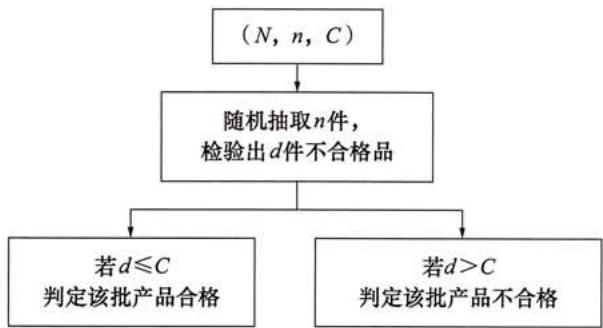

*图4.2-1一次抽样检验示意图*

  ② 二次抽样检验（DoubleSamplingInspection）。二次抽样检验也称双次抽样检验，是指先抽第一样本（第一次抽样），若能作出抽检合格与否的判断，则检验工作终止，否则，再抽第二样本，然后作出判断。即：在检验批量为 N 的一批产品中，随机抽取n1

 件产品进行检验。发现 n1

 中的不合格数为 d1

 ：若 di

≤Ci

 ，则判定该批产品合格，予以接收；若 d1

＞C2

 ，判定该批产品不合格，予以拒收。若 C1

＜d1

≤C2

 ，则不能判断，在同批产品中继续随机抽取第二个样本 n2

 件产品进行检验。若发现 n2

 中有 d2

 件不合格品，则根据（ d1

+d2

 与 C2

 的比较作出如下判断：若 d1

+d2

≤C2

 ，判定该批产品合格，予以接收；若 d1

+d2

＞C2

 ，则判定该批产品不合格，予以拒收。双次抽样检验如图4.2-2所示。

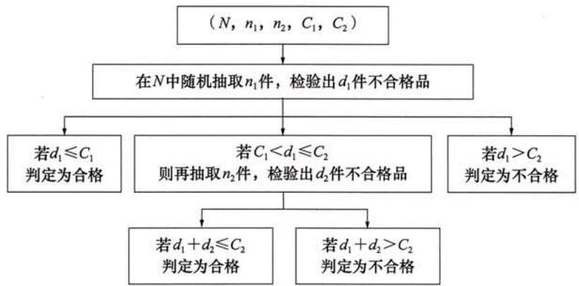

*图4.2-2双次抽样检验示意图*

  ③ 多次抽样检验（MultipleSamplingInspection）。多次抽样检验与二次抽样检验类似。每次抽取一批产品进行检验，若能按判断规则作出抽查合格与否的判断，则检验工作终止；否则，再进行下一次抽检，如此这般，直至能作出抽检合格与否的判断为止。  

  （4）按抽样方案是否可调整，抽样检验可分为调整型抽样检验和非调整型抽样  

  检验。  

  ① 调整型抽样检验。主要是根据产品质量变化情况，按照预先确定的规则适当地调整抽样方案。一般地，当批质量处于正常情况时，采用正常抽样方案；当批质量变坏时，改用加严抽样方案；当批质量显著变好时，允许使用放宽抽样方案。调整型抽样检验是充分利用产品质量历史，在保证批质量的前提下，达到减少样本、降低检验费用的目的。  

  ② 非调整型抽样检验。一般不利用产品的质量历史，使用中也没有调整规则，适用于对孤立批产品的检验。  

  （5）按是否可组成批，抽样检验可分为逐批检验和连续抽样检验。在大多数情况下，产品是以批的形式交付验收的。如果每一批都进行检验，就称为逐批检验。有些产品不能在形成批之后进行检验，而是在生产过程中进行检验，这就需要在重要工序设立固定检验点进行直接抽检，这称为连续抽样检验或流动批检验。

**5. 施工质量检验方法**

  施工质量检验可采用感观检验法、物理检验法、化学检验法和现场试验法等。  

  （1）感观检验法。感观检验法是以施工规范和检验标准为依据，利用人体的视觉器官、听觉器官和触觉器官来检验施工质量情况。这类方法主要是根据质量要求，采用看、摸、敲、照等方法对检查对象进行检查。所谓“看”，就是根据质量标准要求进行外观检查，例如结构表面是否有裂缝、混凝土振捣是否符合要求等。所谓“摸”，就是通过手感触摸进行检查鉴别。所谓“敲”，就是运用敲击方法进行音感检查，根据声音虚实、脆闷判断有无质量问题。所谓“照”，就是通过人工光源或反射光照射，仔细检查难以看清的部位。  

  感观检验方法简便易行，判断速度快。在施工质量检验实际工作中，经常是由感观检验发现问题后，再进一步通过其他检验方法来判断施工质量问题的程度和产生原因。因此，感观检验法是施工质量检验的重要方法。  

  （2）物理检验法。物理检验法是指利用物理原理借助各种检测工具和仪器设备对施工质量进行检验的方法。物理检验法是一种在施工质量检验中被广泛应用的重要方法，包括度量检测、电性能检测、机械性能检测和无损检测等。  

  ① 度量检测法。度量检测法是指利用工具和设备通过检测材料、构件、工程等的长度、质量、体积、密度等来判定工程质量情况。工程实践中常用的度量检测工具和设备有钢尺、卡尺、塞尺、水平仪、经纬仪、激光测距仪、超声波探测仪、赫兹密度仪、K30密实度检测车等。  

  ② 电性能检测法。电性能检测法是指利用电工电子仪器和适当的测量方法来检测电器设备和材料性能的方法。工程建设中，这种方法常被用来检验电气安装工程中各种电器设备和材料的绝缘电阻值、避雷接地和保护接地的电阻值、电器设备的运转电流及电压值等。  

  随着电子工业的不断发展，电子检测仪器日新月异，用于电性能检测的电工电子仪器非常多，常用的检测仪器有绝缘电阻摇表、接地电阻摇表、电流表、电压表和万用表。其中，万用表一般是用来检测和校对电缆接线正确与否的。  

  ③ 机械性能检测法。机械性能检测法是指利用物理力学专用仪器对工程材料、构件等机械性能进行检测的方法。工程建设中，机械性能检测项目一般是指钢材的抗拉、抗弯、抗剪和焊接性能；混凝土的抗压、抗渗性；水泥砂浆的抗压性能；机砖的抗压、抗拉、抗剪性能等。  

  由于机械性能检测所使用的专用仪器价格昂贵，专业技术性强，因此，这种检验通常是由施工现场抽取检验样品，送至有资质的工程质量检测机构进行检测。  

  ④ 无损检测法。无损检测法是指在不损坏被检物的前提下，对被检物内部或表面缺陷、性质、状态和结构进行检验的方法。常用的无损检测方法是射线探伤法、超声波探伤法等。此类方法常用来检测混凝土内部质量（如桩基）和钢材焊接质量。无损检测方法分类如图4.2-3所示。

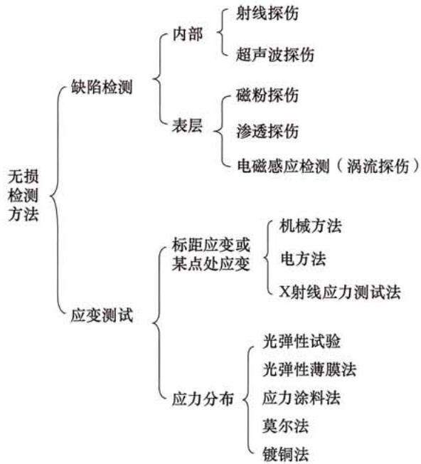

*图4.2-3无损检测方法分类*

  在常规无损检测方法中，超声和射线照相方法主要用于探测被检物的内部缺陷；渗透方法仅用于探测被检物表面开口的缺陷；磁粉和电磁（涡流）方法用于探测被检物的表面和近表面缺陷。  

  （3）化学检验法。化学检验法是指利用化学试剂和试验仪器对工程材料的化学成分及其含量进行测定的方法。这种方法常用来检测水泥、钢材的化学成分。  

  化学检验法可从不同角度进行分类。根据测定对象不同，化学检验法可分为无机分析和有机分析；根据试样用量不同，化学检验法可分为常量分析、半微量分析、微量分析和超微量分析；根据分析目的不同，化学检验法可分为定性分析和定量分析。定性分析是测定未知物质含有哪些组分，定量分析是测定被测组分的含量。从目前施工质量检验工作内容看，多数为已知组分的定量分析。定量分析又分为常规化学分析和仪器分析两大类。  

  （4）现场试验法。现场试验法是指直接在施工现场对工程构件、设备等进行试验的方法。常见的试验有：桩基的静载试验、小应变试验；给水工程、供暖工程中的压力试验；设备安装工程中的设备试运行；电器安装工程中的电器设备动作试验等。  

  除上述试验方法外，还有很多其他试验检验方法，如高低温试验、湿热试验、防腐试验、防雷试验、密封试验、振动试验、老化试验等。

#### 4.2.2 施工质量统计分析方法

  施工质量管理的目的在于及时发现施工过程中影响工程质量的因素，以便及时采取纠正和预防措施，使工程质量始终处于受控状态。为此，需要在掌握大量工程质量检验数据的基础上，运用统计分析方法分析评价工程施工质量状况。常用的施工质量统计分析方法有：分层法、调查表法、因果分析图法、排列图法、相关图法、直方图法和控制图法等。

**1. 分层法**

  分层法是指将调查收集的原始数据，根据不同的目的和要求，按某一性质进行分组整理的分析方法。每组就称为一层，因此，分层法又称为分类法或分组法。分层的结果是使各层间数据的差异突显出来，在此基础上进行层间、层内的比较分析，可以更深入地发现和认识质量问题及其产生原因。  

  分层法是工程质量统计分析中的一种最基本方法。排列图法、直方图法、控制图法、相关图法等统计方法通常需要与分层法配合使用，常常是首先利用分层法将原始数据分组后，再应用其他统计分析方法进行分析。

**2. 调查表法**

  调查表法又称为调查分析法、检查表法，是指利用专门设计的统计表对工程质量数据进行收集和整理，并粗略地进行原因分析的一种方法。  

  根据使用目的不同，采用的调查表有：工序分布检查表、缺陷位置检查表、不良项目检查表、不良原因检查表等。检查表的形式繁多，也可根据数据收集的需要自行设计调查表。表4.2-4是预制混凝土板外观质量问题调查表。

*表4.2-4预制混凝土板外观质量问题调查表*

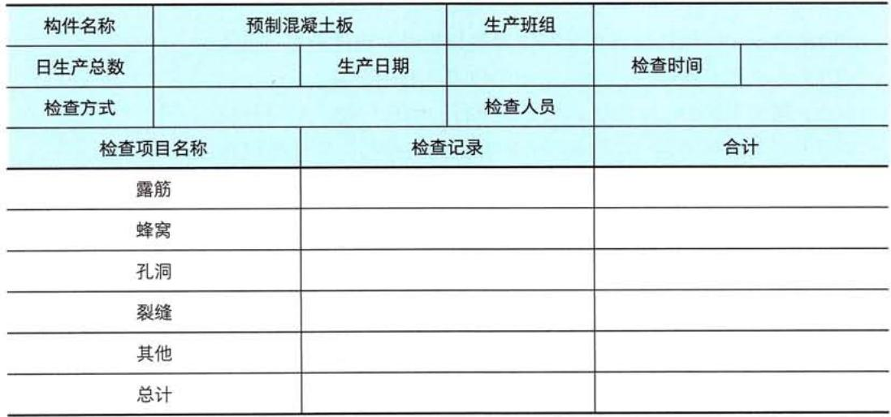

  调查表法往往会与分层法结合起来应用，可以更好、更快地找出问题的原因，以便采取改进措施。

**3. 因果分析图法**

  因果分析图又称为质量特性因果图、鱼刺图或树枝图，是一种反映质量特性与质量缺陷产生原因之间关系的图形工具，可用来分析、追溯质量缺陷产生的最根本原因。  

  工程施工过程中，发生质量缺陷的原因不外乎人、材料、机械、方法、环境（4M1E）等五大方面，在每一方面原因中，有可能包含若干中原因、小原因和更小的原因。在进行因果分析时，先将影响产品质量的主要特性作为“结果”，将影响质量特性的4M1E作为因素，然后连续追究“因素为什么发生波动”？从大原因中追出中原因、小原因，直至追出关键的具体因素，详细到便于采取针对性措施为止。图4.2-4为混凝土强度不合格的因果分析图。

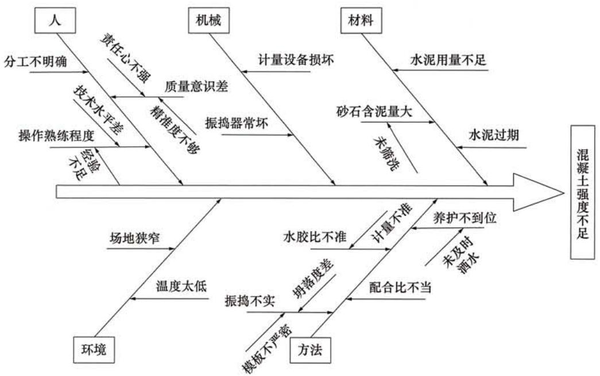

*图4.2-4混凝土强度不合格的因果分析图*

  应用因果分析图法进行质量特性因果分析时，应注意以下几点：  

  （1）一个质量特性或一个质量问题使用一张图分析。（2）通常采用QC小组活动的方式进行，集思广益，共同分析。（3）必要时可邀请QC小组以外的有关人员参与，广泛听取意见。（4）分析时要充分发表意见，层层深入，列出所有可能的原因。（5）在充分分析的基础上，由各参与人员采用投票或其他方式，从中选择 1∼5 项多数人达成共识的最主要原因。

**4. 排列图法**

  排列图法又称为主次因素分析法或帕累托图法，是用来分析影响质量主次因素的有效方法。如图4.2-5所示，排列图由两个纵坐标、一个横坐标、若干个连起来的直方形和一条曲线组成。左侧纵坐标是频数或件数，右侧纵坐标是累计频率；横坐标表示影响质量的各个因素（或项目），按影响程度大小从左至右排列。直方图形的高度表示影响因素的影响大小，将其累计频率（百分数）点连成一条折线，即为帕累托曲线。

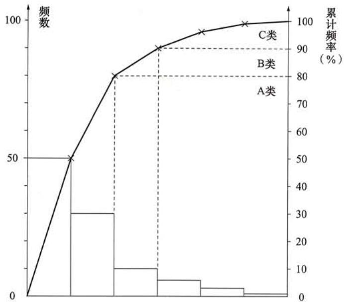

*图4.2-5排列图*

  在实际应用中，一般将累计频率在 0∼80% 范围内的因素定为A类因素，即主要因素；累计频率在 80%∼90% 范围内的因素定为B类因素，即次要因素；累计频率在90%∼100% 范围内的因素定为C类因素，即一般因素。A类因素是需要加强控制、重点管理的对象；对B类因素可按常规管理；对C类因素则可放宽管理，以利于将主要精力放在改善A类因素上。

**5. 相关图法**

  相关图又称为散布图，是用来观察分析两种质量数据之间相关关系的图形方法。在生产过程中，质量特性与影响因素都是变量，这些变量之间有的存在确定性关系，即根据一个变量可准确地算出另一个变量值，如碳素钢中含碳量与硬度的关系。还有些变量之间虽然存在一定的因果关系，但彼此却无确定性的对应关系，这种关系称为相关关系。通过绘制散布图，计算相关系数等，可分析研究两个变量之间是否存在相关关系，以及这种关系的密切程度，进而对相关程度密切的两个变量，通过对其中一个变量的观察控制，去估计控制另一个变量的数值，以达到控制工程质量的目的。

**1）相关图绘制**

  首先从生产过程中随机收集两种相关变量的对应数据（一般不少于30个），然后将这些数据点描绘在直角坐标图中，即可得到相关图。相关图中纵横坐标均为变量，最常用的是以质量特性和影响因素分别为纵横坐标的相关图，如图4.2-6所示。

**2）相关图观察分析**

  相关图中点的集合，反映了两种数据之间的散布状况。几种典型的相关图如图4.2-7所示。

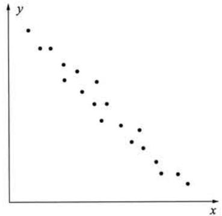

*图4.2-6相关图*

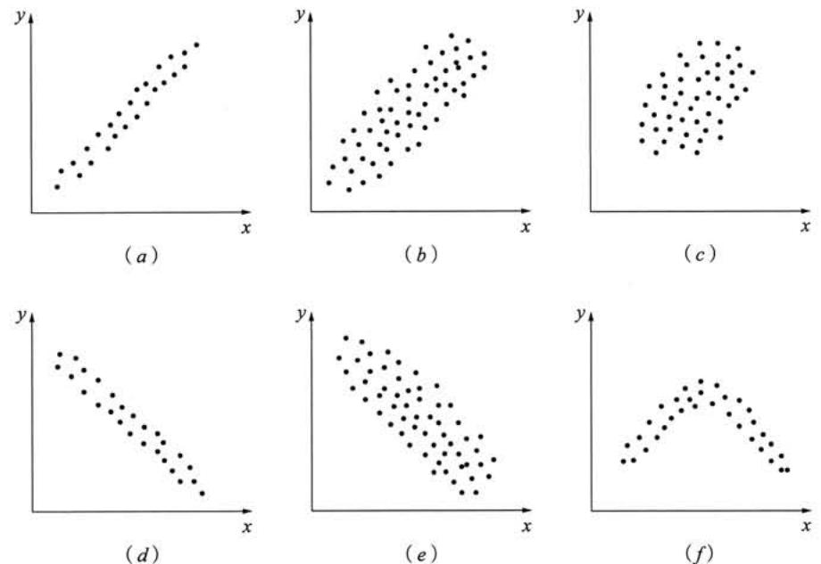

*图4.2-7几种典型的相关图*

*（a）正相关；（b）弱正相关；（c）不相关；（d）负相关； (e) 弱负相关； (f) 非线性相关*

  （1）正相关。如图4.2-7（a）所示，散布点基本形成由左至右向上变化的一条直线带，即随 x 值增加， y 值也相应增加，说明 x 与 y 有较强的制约关系。此时，可通过控制 x 而有效地控制 y 的变化。  

  （2）弱正相关。如图4.2-7（b）所示，散布点形成向上较分散的直线带。随 x 值的增加， y 值也有增加趋势，但 x 7 y 的关系不像正相关那么明确。说明 y 除受 x 影响外，还受其他更重要的因素影响。需要进一步利用因果分析图法分析其他影响因素。  

  （3）不相关。如图4.2-7（c）所示，散布点形成一团或平行于 x 轴的直线带。说明 x 变化不会引起 y 的变化或其变化无规律，分析质量原因时可排除 x 因素。  

  （4）负相关。如图4.2-7（d）所示，散布点形成由左向右向下的一条直线带，说明 x 对 y 的影响与正相关恰恰相反。  

  （5）弱负相关。如图4.2-7（e）所示，散布点形成由左至右向下分布的较分散的直线带。说明 x 与 y 的相关关系较弱，且变化趋势相反，应考虑寻找影响 y 的其他更重  

  要的因素。  

  （6）非线性相关。如图4.2-7 (f) ，散布点呈一曲线带，即在一定范围内 x 增加, y 也增加；超过这个范围后， x 增加， y 则有下降趋势，或改变变动的斜率呈曲线形态。

**6. 直方图法**

  直方图又称频数分布直方图，是用来反映产品质量数据分布状态和波动规律的统计分析方法。直方图的主要用途是：判断工序的稳定性；推断工序质量规格标准的满足程度；分析不同因素对质量的影响；计算工序能力等。

**1）直方图绘制步骤**

  （1）收集整理数据。将抽样检查得到的一批（一般不小于100个，如确实达不到，至少也应大于50个）质量数据按大小分成若干组，在坐标图上画出以组距为底、以每组频数为高的一系列矩形图形。  

  （2）计算极差R。极差R是质量数据中最大值与最小值之差。  

  （3）对数据分组，确定组距和组界。  

  （4）编制数据频数统计表。  

  （5）绘制频数分布直方图。

**2）直方图观察分析**

  （1）观察直方图形状，判断产品质量状况。将直方图分布状态与正态分布图进行对比，可分析判断产品质量状况。常见的直方图形状如图4.2-9所示。

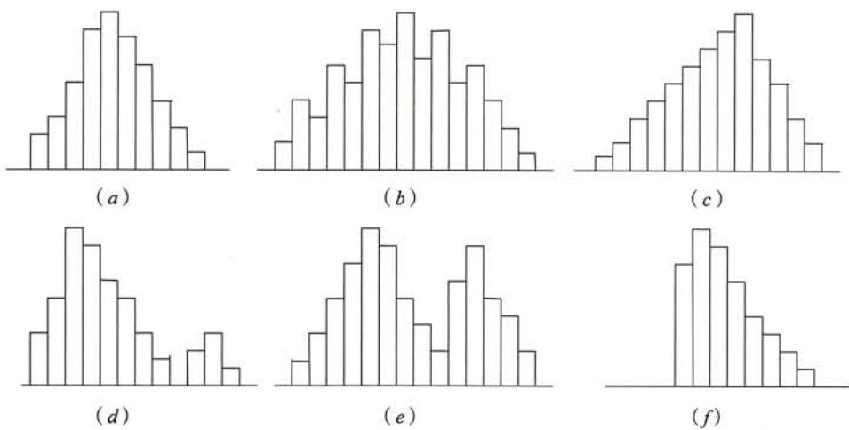

*图4.2-9常见的直方图形状*

  （a）正常型；（b）折齿型； (c) 缓坡型； (d) 孤岛型； (e) 双峰型； (f) 峭壁型  

  ① 正常型。如图4.2-9（a）所示，正常型直方图基本符合正态分布规律，其形状特征为中间高、两侧低，左右接近对称。表示工序处于稳定状态，只存在随机误差。  

  ② 折齿型。如图4.2-9（b）所示，折齿型直方图是由于分组不当或组距确定不当而造成的。  

  ③ 缓坡型。如图4.2-9（c）所示，缓坡型直方图主要是由于操作中对上限（或下限）控制太严造成的。  

  ④ 孤岛型。如图4.2-9（d）所示，孤岛型直方图是因原材料发生变化，或短时间内工人操作不熟练造成的。  

  ⑤ 双峰型。如图4.2-9（e）所示，双峰型直方图往往是因取样时混批所致，如将两台设备、两种不同施工方法的产品混在一起或在两个不同批量中取样等。  

  ⑥ 峭壁型。如图4.2-9 (f ）所示，峭壁型直方图通常是因数据收集不正常，可能有意识地去掉下限以下的数据，或是在检测过程中某种人为因素造成的。  

  除图 4.2-9(a) 外，其他几种直方图都是非正态分布，表示工艺过程中有异常原因，工序处于失控状态。为此，应及时查明原因，采取措施，消除误差，使工序保持稳定。  

  （2）将直方图与质量标准比较，判断实际生产能力。在观察分析直方图整体形状的同时，还可将直方图与质量标准对比，借以判断工序对标准的适应能力和改善余地。直方图分布范围与质量标准的比较如图4.2-10所示。  

  ① 在图 4.2-10(a) 中， B 在 T 中间，质量分布中心

 与质量标准中心 M 正好重合，两侧还有一定余地，表明工序质量稳定，不会出废品。  

  ② 在图4.2-10（b）中， B 虽在 T 内，但质量分布中心

 与质量标准中心M不重合，偏向一侧。如果生产状态一旦发生变化，就可能超出质量标准下限而出现不合格品。出现这种情况时，应及时采取措施，使直方图移到中间来。

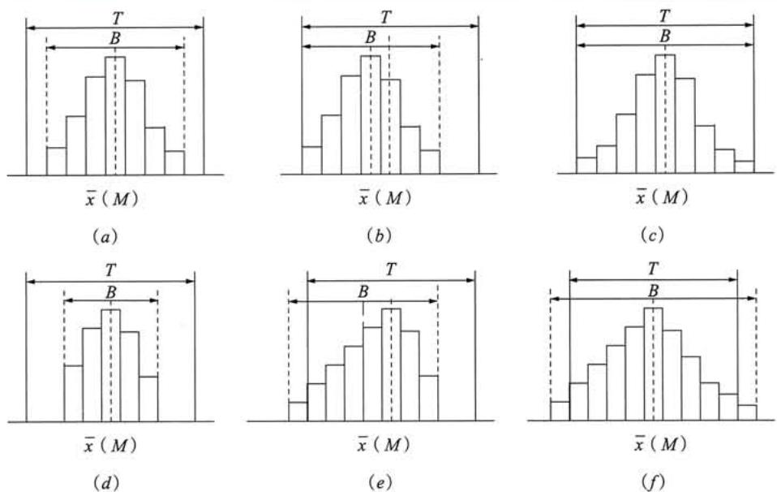

*图4.2-10直方图分布范围与质量标准的比较*

*B一质量特性（如混凝土强度、尺寸）的实际分布范围；T一质量标准的范围*

  ③ 在图 4.2-10(c) 中， B 在 T 中间，且 B 的范围与质量标准的范围重合，没有余地。生产过程一旦发生小的变化，产品的质量特性值就可能超出质量标准。出现这种情况时，必须立即采取措施，以缩小质量特性的分布范围。  

  ④ 在图4.2-10（d）中， B 在 T 中间，质量分布中心与质量标准中心M正好重合，但两侧余地太大。表明工序稳定，但工序能力过于宽裕，经济性差。在这种情况下，可以对原材料、设备、工艺、操作等方面的控制要求适当放宽，降低成本或缩小公差范围。  

  ⑤ 在图4.2-10（e）中， B 的中心与 T 的中心偏离较大，表示实际质量分布过于偏离质量标准中心，已经单边超限，出现不合格品。  

  ⑥ 在图 4.2-10 (f) 中，质量分布范围已超出质量标准的上、下界限，表明工序能力太小，必然出现不合格品。此时，应提高工序能力，使工序质量符合标准要求。

**7. 控制图法**

  控制图又称为管理图，是一种在直角坐标系内画有控制界限，描述生产过程中产品质量波动状态的图形。利用控制图分析质量波动原因，判明生产过程是否处于稳定状态的方法，称为控制图法。

**1）控制图基本形式**

  控制图基本形式如图4.2-11所示。控制图的横坐标通常表示按时间顺序抽样的样本编号，纵坐标表示质量特性值或其统计量（如样本平均值等）。控制图一般有三条线：上面一条虚线为上控制线（UCL），下面一条虚线为下控制线（LCL），中间一条实线为中心线（CL）。控制界限一般根据‘ 3σ ”原理来确定，上下控制界限标志着质量特性值允许波动范围。  

  在生产过程中，通过抽样取得数据后，将样本统计量描在图上来分析生产过程状态。如果点子随机落在上、下控制界限内，则表明生产过程正常并处于稳定状态，不会产生不合格品；如果点子超出控制界限，或点子排列有缺陷，则表明生产状况有异常，生产过程处于失控状态。

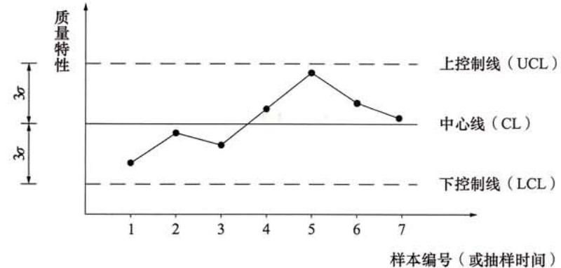

*图4.2-11控制图基本形式*

**2）控制图种类**

  （1）按控制图的用途分类，控制图可分为：分析用控制图和管理（控制）用控制图。  

  ① 分析用控制图主要是用来调查分析生产过程是否处于控制状态。绘制分析用控制图时，一般需连续抽取 20∼25 组样本数据，计算控制界限。  

  ② 管理用控制图主要用来控制生产过程，使之经常保持在稳定状态。当根据分析用控制图判明生产过程处于稳定状态时，一般都是将分析用控制图的控制界限延长作为管理用控制图的控制界限，并按一定的时间间隔取样、计算、打点，根据点子分布情况判断生产过程是否有异常原因影响。  

  （2）按质量数据特点分类，控制图可分为：计量值控制图和计数值控制图。  

  ① 计量值控制图主要适用于质量特性属于计量值的控制，如时间、长度、重量、强度、成分等连续型变量。计量值性质的质量特性值服从正态分布规律。采用的计量值控制图有：均值控制图（

 控制图）、极差控制图（ R 控制图）、均值-极差控制图（

 控制图）、中位数-极差控制图（

 控制图）、单值-移动极差控制图（ x-Rs

 控制图，用于对每一个产品都进行检验）。  

  ② 计数值控制图通常用于控制质量数据中的计数值，如不合格品数、疵点数、单位面积上的疵点数等离散型变量。根据计数值的不同又可分： p 控制图（不合格率控制图） pn

 控制图（不合格品数控制图）、 c 控制图（缺陷数控制图） u 控制图（单位缺陷数控制图）。

**3）控制图的观察分析**

  分析用控制图中的点子同时满足以下两个条件时，可以认为生产过程基本上处于稳定状态： ① 连续25点中没有一点在界限外或连续35点中最多一点在界限外或连续100点中最多2点在界限外； ② 控制界限内的点子随机排列且没有缺陷。  

  如果控制图中的点子分布不满足上述条件时，说明生产过程发生了异常变化。有异常现象的点子分布如图4.2-12所示。属于生产过程有异常的情形有：  

  （1）连续7点或更多点在中心线同一侧，如图4.2-12（a）所示。  

  （2）连续7点或更多点呈上升或下降趋势，如图4.2-12（b）所示。

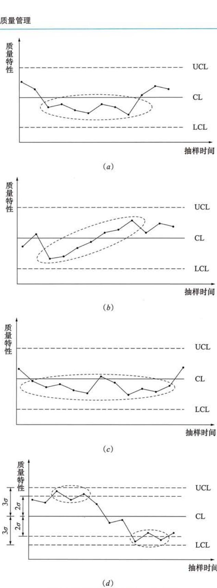

*图4.2-12有异常现象的点子分布（a）连续7点在同一侧； (b) 连续7点连续上升；（c）连续11点中有10点在同一侧；（d）连续3点中有2点接近控制界限*

  （3）连续11点中至少有10点在中心线同一侧，如图4.2-12（c）所示。  

  （4）连续14点中至少有12点在中心线同一侧。  

  （5）连续17点中至少有14点在中心线同一侧。  

  （6）连续20点中至少有16点在中心线同一侧。  

  （7）连续3点中至少有2点和连续7点中至少有3点落在二倍标准差与三倍标准差控制界限之间，如图4.2-12（d）所示。  

  （8）点子呈周期性变化，如图4.2-13所示。

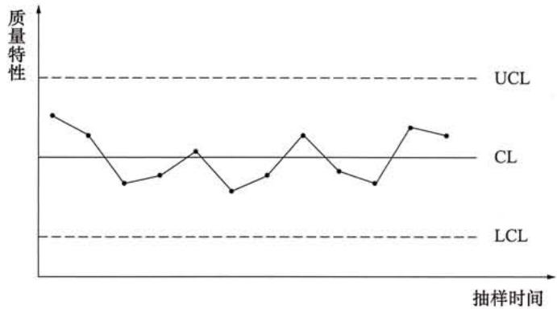

*图4.2-13点子呈周期性变化*

  如果生产过程处于稳定状态，则把分析用控制图转为管理用控制图。分析用控制图是静态的，而管理用控制图是动态的。随着生产过程的进展，通过抽样取得的质量数据点描在控制图上，随时观察点子的变化。如果点子落在控制界限外或界限上，即判断生产过程异常；点子即使在控制界限内，也应随时观察其有无缺陷，以对生产过程正常与否做出判断。

### 4.3 施工质量控制

#### 4.3.1 施工准备质量控制

  施工准备是指为了保证工程顺利开工和施工活动正常进行而必须提前做的一切准备工作。施工准备不仅要在施工前进行，而且贯穿于整个施工过程。只有做好施工准备，才能取得良好的施工效果。

**1. 施工准备工作基本要求**

  （1）施工准备工作应有组织、有计划，分阶段有步骤地进行；  
  （2）要建立严格的施工准备工作责任制及相应的检查制度；  
  （3）要坚持按工程建设程序办事，严格执行开工报告制度；  
  （4）施工准备工作必须贯穿于施工全过程；  
  （5）施工准备工作要取得各相关单位的支持与配合。

**2. 施工技术准备**

**1）熟悉与会审图纸**

  施工单位收到拟建工程的设计图纸和有关技术文件后，应尽快组织有关工程技术人员熟悉和自审图纸，写出自审图纸记录。自审图纸记录应包括对设计图纸的疑问和对设计图纸的有关建议。  

  施工图会审会议由建设单位主持，设计单位和施工单位、工程监理单位参加。图纸会审时，首先由设计单位的项目负责人向与会者说明拟建工程的设计依据、意图和功能要求，并对特殊结构、新材料、新工艺和新技术提出设计要求。然后，施工单位根据自审图纸记录以及对设计意图的了解，提出对设计图纸的疑问和建议。会议形成的“图纸会审纪要”由与会各方会签、盖章，作为与设计文件同时使用的技术文件和指导施工的依据。

**2）编制和报审施工组织设计**

  施工组织设计是施工准备工作的重要组成部分，也是指导施工现场全部生产活动的技术经济文件。为了正确处理人与物、主体与辅助、工艺与设备、专业与协作、供应与消耗、生产与储存、使用与维修以及它们在空间布置、时间排列之间的关系，施工单位必须根据拟建工程的规模、结构特点和建设单位要求，在调查分析的基础上，编制能够切实指导工程全部施工活动的施工组织设计。  

  施工单位在完成施工组织设计的编制及内部审批工作后，报请项目监理机构审查，由总监理工程师审核签认。项目监理机构审查批准的施工组织设计应报送建设单位。施工单位应按审查批准的施工组织设计文件组织施工。

**3. 施工现场准备**

**1）测量控制网的控制**

  施工测量质量的好坏直接决定工程的定位和标高是否正确，并且制约施工过程有关工序的质量。因此，施工单位在工程开工前必须做好施工测量工作。  

  （1）按照工程总平面图及给定的永久性经纬坐标控制网和水准控制基桩，进行施工测量，设置永久性经纬坐标桩、水准基桩和建立场区工程测量控制网。  

  （2）在测量放线时，应校验校正全站仪、经纬仪、水准仪、钢尺等测量仪器；编制切实可行的测量方案，包括平面控制、标高控制、沉降观测和竣工测量等工作。  

  （3）工程定位放线，一般通过设计图中平面控制轴线来确定工程（建筑物）位置，测定并经自检合格后提交有关部门和建设单位或监理人员验线，以保证定位的准确性。沿红线的建设工程放线后，还要由城市规划部门验线，以防止建设工程压红线或超红线，为正常顺利地施工创造条件。

**2）施工平面布置的控制**

  建设单位按照合同约定并结合施工的实际需要，事先划定并提供施工用地和现场临时设施用地的范围，协调平衡和审批各施工单位的施工平面布置方案。  

  施工单位应根据批准的施工平面布置图和施工进度计划的安排，科学合理地使用施工场地，正确布置施工机械设备和其他临时设施，维护现场施工道路畅通，合理控制材料的进场与堆放，保证充足的水电供应，保持良好的防洪排涝能力。  

  项目监理机构要检查施工现场平面布置是否合理，是否有利于保证施工的正常、顺利地进行，是否有利于保证质量，特别要对场区的道路、防洪排水、器材存放、给水及供电、混凝土供应及主要垂直运输机械设备布置等方面进行重点检查与控制。

**4. 材料、构配件质量控制**

  为了保证工程质量，施工单位应从以下几方面做好材料、构配件质量控制。

**1）材料、构配件需要量计划**

  材料准备主要是根据施工预算，并根据施工进度计划要求，按材料名称、规格、使用时的材料消耗定额和储备定额进行汇总，编制出各类材料的需要量计划，为组织备料、确定仓库、场地堆放所需的面积和组织运输等提供依据。  

  构配件、制品的加工准备，应根据施工预算提供的构配件、制品的名称、规格、质量和消耗量，确定加工方案和供应渠道及进场后的储存地点和方式，编制构配件、制品需要量计划，为组织运输、确定堆场面积等提供依据。

**2）材料、构配件采购订货**

  工程建设所需的材料、半成品、构配件等都将构成为永久性工程的组成部分，其质量好坏将直接影响到未来工程质量。因此，需要事先对其质量进行严格控制。  

  （1）施工单位应编制合理的材料采购供应计划。  

  （2）对于半成品或构配件，应按设计文件和图纸要求采购订货，质量应满足有关标准和设计要求，交货期应满足施工及安装进度安排需要。  

  （3）建立合格供应商的资格审查制度，优选材料的生产商或销售代理商；大宗的器材或材料的采购应当实行招标采购的方式。  

  （4）供货商应提供质量文件，用以表明其提供的货物能够完全达到需方提出的质量要求。

**3）进场材料、构配件检验**

  （1）工程采用的主要材料、半成品、成品、构配件、器具和设备应进行进场检验。涉及安全、节能、环境保护和主要使用功能的重要材料、产品应按各专业相关规定进行复验，并应经项目监理机构检查认可。  

  （2）对涉及结构安全、节能、环境保护和主要使用功能的试块、试件及材料，应按规定进行见证检验。见证检验应在建设单位或者项目监理机构的监督下现场取样、封样、送检，检测试样应具有真实性和代表性。  

  （3）进口产品应符合合同规定的质量要求，并附有中文说明书和商检证明，经进场验收合格后方可使用。  

  （4）施工现场的材料、半成品、成品、构配件、器具和设备，在运输和储存时应采取确保其质量和性能不受影响的储存及防护措施。  

  （5）装配式建筑混凝土预制件的原材料质量、钢筋加工和连接的力学性能、混凝土强度、构件结构性能、装饰材料、保温材料及拉结件的质量等均应根据国家现行有关标准进行检查和检验，并应严格遵守操作规程和做好质量检验记录。混凝土预制构件出厂时的混凝土强度不得低于设计混凝土强度等级值的 75% 。

**4）材料、构配件的现场储存和使用**

  施工单位必须加强材料、构配件进场后的存储和使用管理。对于材料、半成品、构配件等，应当根据其特点、特性及对防潮、防晒、防锈、防腐蚀、通风、隔热、温度、湿度等方面的不同要求，安排适宜的存放条件，以保证其存放质量。对于按要求存放的材料，施工单位现场材料管理人员应每隔一定时间检查一次，随时掌握材料、构配件的存放质量情况。在材料、器材等使用前，也应对其质量再次检查确认后，方可使用。经检查质量不符合要求的，则不准使用或降低等级使用。

**5. 施工机械配置的控制**

  施工机械设备的选择，要考虑其技术性能、工作效率、可靠性及维修难易、能源消耗，以及安全、灵活等因素，要满足施工生产的实际需求。还要考虑所选择的施工机械设备对施工质量的影响及保证质量的程度。其质量控制主要围绕施工机械设备的选型、机械设备性能参数的确定、机械设备数量、使用操作等方面进行。

#### 4.3.2 施工过程质量控制

  施工过程质量控制是指对工程实体质量形成过程的控制。就整个施工过程而言，可按事前、事中、事后进行控制。

**1. 作业技术准备状态的控制**

  作业技术准备状态是指在正式开展施工作业前，各项施工准备工作是否按预先计划的安排落实到位的状况，包括配置的人员、材料、机具、施工环境、通风、照明、安全设施等。  

  作业技术准备状态的控制，应着重抓好以下环节的工作。

**1）质量控制点的设置**

  质量控制点是指为保证作业过程质量而确定的重点控制对象、关键部位或薄弱环节。设置质量控制点是保证施工质量达到质量要求的必要前提。  

  施工单位在工程施工前，应根据施工过程质量控制的要求，列出质量控制点明细表，表中详细地列出各质量控制点的名称或控制内容、检验标准及方法等，在此基础上实施质量预控。  

  （1）质量控制点的设置原则。可作为质量控制点的对象涉及面广，可能是技术要求高、施工难度大的结构部位，也可能是影响质量的关键工序、操作或某一环节。质量控制点的设置应遵循以下原则：  

  ① 施工过程中的关键工序或环节及隐蔽工程，例如预应力结构的张拉工序、钢筋混凝土结构中的钢筋架立等。  

  ② 施工中的薄弱环节或质量不稳定的工序、部位或对象，例如地下防水层施工等。  

  ③ 对后续工程施工或对后续工序质量或安全有重大影响的工序、部位或对象，例如预应力结构中的预应力钢筋质量、模板的支撑与固定等。  

  ④ 采用新技术、新工艺、新材料的部位或环节。  

  ⑤ 施工无足够把握、施工条件困难或技术难度大的工序或环节，例如复杂曲线模板的放样等。  

  显然，是否设置为质量控制点，主要是视其对质量特性影响的大小、可能造成的危害程度及质量保证难度大小而定。  

  （2）质量控制点的监控对象。质量控制点中重点控制的对象主要包括以下几方面：  

  ① 人的行为。对某些操作或工序，应以人为重点控制对象，例如高空、高温、水下、危险作业等，对人的身体素质或心理应有相应要求；技术难度大或精度要求高的作业，如复杂模板放样、精密仪器设备安装，以及大型重型构件吊装等，对人的操作能力和技术水平均有较高的要求。为此，应从人的生理、心理、技术能力等方面进行控制。  

  ② 材料质量与性能。这是直接影响工程质量的重要因素，在某些工程中应作为控制重点。例如钢结构工程中使用的高强度螺栓、某些特殊焊接使用的焊条，都应重点控制。又如水泥质量是直接影响混凝土工程质量的关键因素，施工中就应对进场的水泥质量进行重点控制，必须检查核对其出厂合格证，并按要求进行强度和安定性复试等。  

  ③ 施工方法与关键操作。某些直接影响工程质量的关键操作应作为控制重点，如预应力混凝土结构中钢筋的张拉过程及张拉力控制，是建立预应力值和保证预应力构件质量的关键过程。同时，那些易对工程质量产生重大影响的施工方法，也应列为控制重点，如装配式建筑构件吊装过程中的稳定问题。  

  ④ 施工技术参数。如混凝土的外加剂掺量、水胶比、坍落度、抗压强度、回填土含水量、防水混凝土抗渗等级、大体积混凝土内外温差及混凝土冬期施工受冻临界强度、装配式混凝土预制构件出厂时的强度等技术参数，都属于应重点控制的质量参数与指标。  

  ⑤ 施工顺序。对于某些工序之间必须严格控制施工的先后顺序，比如对冷拉钢筋应当先焊接后冷拉，否则会失去冷拉强化。屋架的安装固定，应采取对角同时施焊方法，否则会由于焊接应力导致校正好的屋架发生倾斜。  

  ⑥ 技术间歇。有些工序之间必须留有必要的技术间歇时间，例如砌筑与抹灰之间，应在墙体砌筑后留 6∼10 天时间，让墙体充分沉陷、稳定、干燥后再抹灰；抹灰层干燥后，才能喷刷乳胶漆。混凝土浇筑与模板拆除之间，应保证混凝土有一定的硬化时间，达到规定拆模强度后方可拆除等。  

  ⑦ 易发生质量通病的施工过程。例如混凝土工程的蜂窝、麻面、空洞，墙、地面、屋面防水工程渗水、漏水、空鼓、起砂、裂缝等，都与工序操作有关，均应事先研究对策，提出预防措施。  

  ⑧ 新技术、新材料及新工艺的应用。由于缺乏经验，施工时应将其作为重点进行控制。  

  ⑨ 产品质量不稳定和不合格率较高的工序应列为重点，认真分析，严格控制。  

  ⑩ 特殊地基或特种结构。对于湿陷性黄土、膨胀土、红黏土等特殊土地基的处理，以及大跨度结构、高耸结构等技术难度较大的施工环节和重要部位，均应予以特别重视。

**2）作业技术交底控制**

  施工单位做好技术交底，是取得好的施工质量的条件之一。为此，每一分项工程开始实施前均要进行交底。为做好技术交底，应由项目技术人员编制技术交底书，并经项目技术负责人批准。技术交底书的内容主要包括：施工方法、质量要求和验收标准、施工过程中需注意的问题、可能出现意外情况的应急方案等。技术交底要紧紧围绕和具体施工有关的操作者、机械设备、使用的材料、构配件、工艺、工法、施工环境、具体管理措施等方面进行，交底中要明确做什么、谁来做、如何做、作业标准和要求是什么、什么时间完成等。  

  关键部位，或技术难度大、施工复杂的检验批，在分项工程施工前，施工单位的技术交底书（或作业指导书）要报项目监理机构。经项目监理机构审查后，如技术交底书不能保证作业活动的质量要求，施工单位要进行修改补充。没有做好技术交底的工序或分项工程，不得进人正式实施。

**3）进场材料、构配件质量控制**

  （1）凡运到施工现场的原材料、半成品或构配件，必须附有产品出厂合格证及技术说明书。施工单位按规定要求进行检验的检验或试验报告，经项目监理机构审查并确认其质量合格后，方准进场。  

  （2）进口材料设备的检查、验收，应会同国家商检部门进行。如在检验中发现质量问题或数量不符合规定要求时，应取得供货方及商检人员签署的商务记录，在规定的索赔期内进行索赔。  

  （3）材料构配件存放条件的控制。质量合格的材料、构配件进场后，到其使用或安装时通常都要经过一定的时间间隔。在此时间内，如果对材料的存放、保管不良，可能导致质量状况的恶化，如损伤、变质、损坏，甚至不能使用，因此，施工单位要做好材料、半成品、构配件的存放、保管、巡查等工作。  

  （4）对于某些当地材料及现场配制的制品，施工单位事先要进行试验，达到要求的标准方准施工。除应达到规定的力学强度等指标外，还应注意材料的化学成分对工程质量的影响，充分考虑到施工现场加工条件与设计、试验条件不同而可能导致的材料或半成品质量差异。

**4）作业环境状态控制**

  （1）施工作业环境控制。作业环境条件主要是指水电供应、施工照明、安全防护设备、施工场地空间条件和通道、交通运输和道路条件等。施工单位要对施工作业环境条件做好预先安排并准备妥当。当确认其准备可靠、有效后，方准许进行施工作业。  

  （2）施工质量管理环境控制。施工质量管理环境主要是指施工单位的质量管理体系和质量控制自检系统是否处于良好状态；项目管理组织结构、管理制度、检测制度、检测标准、人员配备等方面是否完善和明确；质量责任制是否落实。项目监理机构要对施工单位施工质量管理环境进行检查并督促其落实，是保证施工作业效果的重要前提。  

  （3）现场自然环境条件控制。施工单位对于未来施工期间，可能出现对施工作业质量不利影响的自然环境条件，要有充分的认识并做好充足的准备和制定有效预防措施与对策，以保证工程质量。例如，对严寒季节的防冻；夏季的防高温；高地下水位情况下基坑施工的排水或细砂地基防止流砂；施工场地的防洪与排水；风浪对水上打桩或沉箱施工质量影响的防范等。

**5）进场施工机械设备性能及工作状态控制**

  施工现场作业机械设备的技术性能及工作状态，对施工质量有着重要影响。  

  （1）施工机械设备的进场检查。施工机械设备进场前，施工单位应向项目监理机构报送进场设备清单，列出进场机械设备型号、规格、数量、技术性能（技术参数）、设备状况、进场时间等。  

  施工机械设备进场后，项目监理机构需要根据施工单位报送的清单进行现场核对，核对是否与施工组织设计中所列的内容相符。  

  （2）机械设备工作状态的检查。施工单位要检查进场施工机械的使用、保养记录，判断其工作状况。对重要的工程机械，如大马力推土机等，施工单位应在现场实际复验，以保证投入作业的机械设备状态良好。  

  施工单位还应经常了解施工作业中机械设备的工作状况，防止带病运行。一旦发现问题，必须及时修理，以保持良好的作业状态。  

  （3）特殊设备安全运行的审核。对于现场使用的塔式起重机及有特殊安全要求的设备，投入使用前，必须经当地劳动安全部门鉴定，符合要求并办理相关手续后方可投人使用。

**6）施工测量及计量器具性能、精度的控制**

  施工测量开始前，施工单位应向项目监理机构提交测量仪器的型号、技术指标、精度等级、法定计量部门的标定证明、测量工的上岗证明，经项目监理机构审核确认后，方可进行正式测量作业。在作业过程中应经常检查了解计量仪器、测量设备的性能、精度，使其处于良好状态之中。

**7）施工现场劳动组织及作业人员上岗资格的控制**

  劳动组织涉及从事作业活动的操作者及管理者，以及相应的各种制度。施工现场从事作业活动的操作者数量必须满足作业需要，相应工种配置能保证作业有序连续进行，不能因人员数量及工种配置不合理而造成停顿；作业活动的负责人（包括技术负责人）、专职质检人员、安全员、与作业活动有关的测量人员、材料员、试验员必须在岗。各种相关制度要健全，如各类人员的岗位职责；作业活动现场的安全，消防规定；作业活动中环保规定；试验室及现场试验检测的有关规定；紧急情况的应急处理规定等。从事特殊作业的人员（如电焊工、电工、起重工、架子工、爆破工）必须持证上岗。

**2. 作业技术活动过程质量控制**

  工程施工质量是在施工过程中形成的，而不是最后检验出来的。施工过程是由一系列相互联系与制约的作业活动所构成，因此，保证作业活动的效果与质量是施工过程质量控制的基础。

**1）施工单位“三检”制度**

  施工单位是施工质量的直接实施者和责任者。施工单位必须有整套的制度及工作程序，即“三检制度”：作业活动结束后，作业者必须自检；不同工序交接，相关人员必须进行交接检查；施工单位专职质检员的专检。要具有相应的试验设备及检测仪器，配备数量满足需要的专职质检人员及试验检测人员。  

  项目监理机构的质量检查与验收，是对施工单位作业活动质量的复核与确认；项目监理机构的检查决不能代替施工单位的自检。而且，项目监理机构的检查必须是在施工单位自检并确认合格的基础上进行的。专职质检员未检查或检查不合格不能报项目监理机构。不符合上述规定，项目监理机构一律拒绝进行检查。

**2）技术复核工作**

  凡涉及施工作业技术活动基准和依据的技术工作，都应该严格进行专人负责的复核性检查，以避免基准失误给整个工程质量带来难以补救或全局性危害。例如，工程的定位、轴线、标高，预留孔洞的位置和尺寸，预埋件，管线坡度，混凝土配合比，变电、配电位置，高低压进出口方向、送电方向等。技术复核是施工单位应履行的技术工作责任，其复核结果应报送项目监理机构复验确认后，才能进行后续相关工序施工。

**3）见证取样、送检**

  施工单位在对工程施工中使用的材料、半成品、构配件进行现场取样、工序活动效果检查时，由监理人员进行全程见证。  

  施工单位在对进场材料、试块、试件、钢筋接头等实施见证取样前，要通知负责见证取样的监理人员。在监理人员现场监督下，施工单位按相关规范要求，完成材料、试块、试件等的取样过程。完成取样后，施工单位将送检样品装入木箱，由监理人员加封。不能装入箱中的试件，如钢筋样品、钢筋接头，则贴上专用加封标志，然后送往试验室。

**4）工程变更控制**

  施工过程中，由于工程勘察设计原因，或由于外界自然条件的变化，未探明的地下障碍物、管线、文物、地质条件不符等，以及施工工艺方面的限制、建设单位要求改变等，均会涉及工程变更。做好工程变更控制工作，也是作业过程质量控制的一项重要内容。  

  工程变更要求可能来自建设单位、设计单位或施工单位。为确保工程质量，不同情况下，工程变更的实施、设计图纸的澄清、修改有不同的工作程序。  

  （1）施工单位的变更要求及处理。在施工过程中，施工单位提出的工程变更要求有下列两种情况：  

  ① 技术修改。施工单位根据施工现场具体条件和自身的技术、经验和施工设备等条件，在不改变原设计图纸和技术文件的前提下，提出对设计图纸和技术文件进行某些技术上的修改。例如，对某种规格的钢筋采用替代规格的钢筋、对基坑开挖边坡的修改等。在此情形下，施工单位应向项目监理机构提交《工程变更单》，说明要求修改的内容及原因或理由，并附图纸和有关文件。  

  技术修改问题通常可由专业监理工程师组织，施工单位和现场设计代表参加，经各方同意后签字并形成纪要，作为工程变更单附件，经总监理工程师批准后实施。  

  ② 工程变更。工程变更是指施工期间，对于设计单位在设计图纸和设计文件中所表达的设计标准状态的改变和修改。在此情形下，施工单位就要求变更的问题填写《工程变更单》，送交项目监理机构。总监理工程师根据施工单位的申请，经与设计、建设、施工单位研究并作出变更决定后，签发《工程变更单》，并附设计单位提出的变更设计图纸。施工单位签收后按变更后的图纸施工。  

  如果工程变更涉及结构主体及安全，该工程变更还要按有关规定报送施工图原审查单位进行审查，否则变更不能实施。  

  （2）设计单位提出变更的处理。设计单位提出的变更按以下程序处理：  

  ① 设计单位首先将“设计变更通知”及有关附件报送建设单位。  

  ② 建设单位会同项目监理机构、施工单位对设计单位提交的“设计变更通知”进行研究。必要时，设计单位尚需进一步提供资料，以便对变更作出决定。  

  ③ 总监理工程师签发《工程变更单》，并将设计单位提交的“设计变更通知”作为工程变更单附件。施工单位根据变更后并经审图机构审查的施工图实施。  

  （3）建设单位（项目监理机构）要求变更的处理。建设单位或项目监理机构提出的变更按以下程序处理：  

  ① 建设单位将变更要求及建议通知设计单位。  

  ② 设计单位对工程变更要求进行研究，并分析建设单位或项目监理机构提出的建议或解决方案（如果有的话），并将工程变更方案提交建设单位。  

  ③ 项目监理机构对工程变更费用及工期影响进行评估，并在此基础上组织建设单位、施工单位等共同协商确定工程变更费用及工期变化，会签《工程变更单》。  

  ④ 施工单位按《工程变更单》要求组织施工。

**5）质量记录资料**

  质量记录资料是施工单位进行工程施工或安装期间，实施质量控制活动的记录，还包括项目监理机构对这些质量控制活动的意见及施工单位对这些意见的答复。质量记录资料详细记录了工程施工阶段质量控制活动的全过程，因此，质量记录资料不仅在工程施工期间对工程质量控制有重要作用，而且在工程竣工和投入运行后，对于查询和了解工程建设质量情况及工程维修和管理也能提供大量有用的资料和信息。

**3. 作业技术活动结果控制**

  作业活动结果，泛指作业工序的产出品、分项分部工程的已完施工及已完准备交验的单位工程等。作业技术活动结果控制是施工过程中间产品及最终产品质量控制的方  

  式，只有作业活动的中间产品质量都符合要求，才能保证最终工程质量。作业技术活动结果控制的主要内容包括以下几方面。

**1）工序质量检验**

  工程施工过程是由一系列相互关联、相互制约的工序所构成，工序质量是基础，直接影响工程项目整体质量。工序质量的检验就是利用一定的方法和手段，对工序操作及其完成产品的质量进行实际而及时的测定、查看和检查，并将所测得的结果与该工序的操作规程及形成质量特性的技术标准进行比较，从而判断是否合格或是否优良。  

  工序质量检验也是对工序活动效果进行评价，主要包括以下内容：  

  （1）标准具体化。标准具体化就是把设计要求、技术标准、工艺操作规程等转换成具体而明确的质量要求，并在质量检验中正确执行这些技术法规。  

  （2）度量。度量是指对工程或产品的质量特性进行检测度量。其中包括检查人员的感观度量、机械器具的测量和仪表仪器的测试，以及化验与分析等。通过度量，提出工程或产品质量特征值的数据报告。  

  （3）比较。比较是指将度量出来的质量特征值与该工程或产品的质量技术标准进行比较，判断有何差异。  

  （4）判定。判定是指根据比较结果来判断工程或产品质量是否符合规程、标准要求，并做出结论。判定要用事实、数据说话，防止主观、片面，真正做到以事实、数据为依据，以标准、规范为准绳。  

  （5）处理。处理是指根据判定结果，对质量合格与优良的工程或产品予以认证。对不合格的工程或产品，则要寻找原因，采取对策措施，予以调整纠偏或返工。  

  （6）记录。记录要贯穿于整个质量检验全过程，把度量出来的质量特征值完整、准确、及时地记录下来，以供统计、分析、判定、审核和备查。  

  在工程施工过程中，施工管理人员要坚持做到：上道工序不合格，不准进人下道工序施工；不合格的材料、构配件、半成品不准进入施工现场且不允许使用，已经进场的不合格品应及时做出标识、记录，指定专人看管，避免用错，并限期清理出现场；不合格的工序或工程产品，不予计价。

**2）隐蔽工程验收**

  隐蔽工程验收是指将被其后工程施工所隐蔽的分项、分部工程，在隐蔽前所进行的检查验收。隐蔽工程验收是对一些已完分项、分部工程质量的最后一道检查。由于检查对象将要被其他工程覆盖，给以后的检查整改造成障碍，故显得尤为重要，隐蔽工程验收是质量控制的一个关键环节。  

  隐蔽工程施工完毕，施工单位按有关技术规程、规范、施工图纸进行自检。自检合格后，填写《隐蔽工程报验申请表》，并附隐蔽工程检查记录及有关证明材料，报送项目监理机构。  

  项目监理机构收到报验申请后，对质量证明资料进行审查，并在合同规定的时间内到现场检查（检测或核查），施工单位的专职质检员及相关施工人员随同。  

  经项目监理机构现场检查确认质量符合隐蔽要求，在《隐蔽工程报验申请表》上签字确认，准予施工单位隐蔽、覆盖，进人下一道工序施工。  

  如经现场检查发现隐蔽工程质量不合格，项目监理机构签发“不合格项目通知”，指令施工单位整改，整改后自检合格再报项目监理机构复查。

**3）工序交接验收**

  工序交接验收是指在施工过程中，当某一工序完成后，由施工单位、项目监理机构（或建设单位）等相关方对该工序质量进行检查，确认合格后签署交接文件，允许下一道工序施工的过程。  

  工序交接验收流程：  

  （1）施工单位自检。工序施工完成后，施工单位先进行“三检”，确保工序质量符合标准。自检合格后，填写《工序质量验收记录表》，并附测量记录、材料检验报告等资料，报送项目监理机构申请验收。  

  （2）项目监理机构验收。项目监理机构收到验收申请后，审查资料完整性，并组织现场检查。验收合格后，专业监理工程师签署验收意见，允许进入下一道工序；质量不合格的，项目监理机构将会签发监理通知单，要求施工单位整改后重新报验。  

  （3）多方联合验收（必要时）。对重要工序（如地基基础、主体结构、防水工程等）或涉及结构安全的隐蔽工程，需由建设单位、设计单位、监理单位、施工单位共同参与验收，必要时邀请质量监督机构监督。  

  （4）签署交接文件。验收通过后，各方签署《工序交接验收记录》，明确验收结论及责任，作为施工资料归档。  

  通过严格的工序交接验收，可实现建设工程质量的过程控制，确保各环节质量可控，最终保障工程整体安全与使用功能。

#### 4.3.3 施工质量检查验收

  1.施工质量验收一般规定

**1）施工质量验收层次**

  施工质量验收应包括单位工程、分部工程、分项工程和检验批施工质量验收，并应符合下列规定：  

  （1）检验批应根据施工组织、质量控制和专业验收需要，按工程量、楼层、施工段划分，检验批抽样数量应符合有关专业验收标准的规定。  

  （2）分项工程应根据工种、材料、施工工艺、设备类别划分。  

  （3）分部工程应根据专业性质、工程部位划分。  

  （4）单位工程应为具备独立使用功能的建筑物或构筑物  

  工程施工前，应由施工单位制定单位工程、分部工程、分项工程和检验批的划分方案，并应由项目监理机构审核、建设单位确认后实施。

**2）工程文件资料管理要求**

  （1）应建立工程质量信息公示制度。工程竣工验收合格后，建设单位应在建（构）筑物的明显位置设置有关工程质量责任主体的永久性标牌。  

  （2）工程文件资料的形成和积累应随工程建设进度同步形成，并应纳入工程建设管理各个环节和有关人员职责范围。

**2. 施工质量验收要求**

  （1）工程施工质量应符合国家现行强制性工程建设标准规定，并应符合工程勘察  

  设计文件要求和合同约定。  

  （2）检验批质量应按主控项目和一般项目验收，并应符合下列规定：  

  ① 主控项目和一般项目的确定应符合国家现行强制性工程建设标准和现行相关标准的规定；  

  ② 主控项目的质量经抽样检验应全部合格；  

  ③ 一般项目的质量应符合国家现行相关标准的规定；  

  ④ 应具有完整的施工操作依据和质量验收记录。  

  （3）当检验批施工质量不符合验收标准时，应按下列规定进行处理：  

  ① 经返工或返修的检验批，应重新进行验收；  

  ② 经有资质的检测机构检测能够达到设计要求的检验批，应予以验收；  

  ③ 经有资质的检测机构检测达不到设计要求，但经原设计单位核算认可能够满足安全和使用功能的检验批，应予以验收。  

  （4）分项工程质量验收合格应符合下列规定：  

  ① 所含检验批的质量应验收合格；  

  ② 所含检验批的质量验收记录应完整、真实。  

  （5）分部工程质量验收合格应符合下列规定：  

  ① 所含分项工程的质量应验收合格；  

  ② 质量控制资料应完整、真实；  

  （6）单位工程质量验收合格应符合下列规定：  

  ① 所含分部工程的质量应全部验收合格；  

  ② 质量控制资料应完整、真实；  

  ③ 所含分部工程中有关安全、节能、环境保护和主要使用功能的检验资料应完整；  

  ④ 主要使用功能的抽查结果应符合国家现行强制性工程建设标准规定；  

  ⑤ 观感质量应符合要求。  

  （7）当经返修或加固处理的分项工程、分部工程，确认能够满足安全及使用功能要求时，应按技术处理方案和协商文件的要求予以验收。  

  （8）经返修或加固处理仍不能满足安全或重要使用功能要求的分部工程及单位工程，严禁验收。

**3. 施工质量验收组织**

  （1）检验批应由专业监理工程师组织施工单位项目专业质量检查员、专业工长等进行验收。  

  （2）分项工程应由专业监理工程师组织施工单位项目专业技术负责人等进行验收。  

  （3）分部工程应由总监理工程师组织施工单位项目负责人和项目技术负责人等进行验收。勘察、设计单位项目负责人和施工单位技术、质量部门负责人应参加地基与基础分部工程的验收，设计单位项目负责人和施工单位技术、质量部门负责人应参加主体结构、节能分部工程的验收。  

  （4）单位工程完工后，各相关单位应按下列要求进行工程竣工验收：  

  ① 勘察单位应编制勘察工程质量检查报告，按规定程序审批后向建设单位提交；  

  ② 设计单位应对设计文件及施工过程的设计变更进行检查，并应编制设计工程质量检查报告，按规定程序审批后向建设单位提交；  

  ③ 施工单位应自检合格，并应编制工程竣工报告，按规定程序审批后向建设单位提交；  

  ④ 项目监理机构应在施工单位自检合格后组织工程竣工预验收，预验收合格后应编制工程质量评估报告，按规定程序审批后向建设单位提交；  

  ⑤ 建设单位应在竣工预验收合格后组织监理、施工、设计、勘察单位等相关单位项目负责人进行工程竣工验收。

**4. 工程质量保修**

  （1）对于建筑工程，施工单位应编制工程使用说明书。工程使用说明书应包括下列内容： ① 工程概况； ② 工程设计合理使用年限、性能指标及保修期限； ③ 主体结构位置示意图、房屋上下水布置示意图、房屋电气线路布置示意图及复杂设备的使用说明；④ 使用维护注意事项。  

  （2）建设单位应建立工程质量回访和质量投诉处理机制。施工单位应履行工程质量保修义务，并应向建设单位出具工程质量保修书，工程质量保修书中应明确保修范围、保修期限和保修责任。  

  （3）当工程在保修期内出现一般质量缺陷时，建设单位应向施工单位发出保修通知，施工单位应进行现场勘察、制定保修方案，并及时进行修复。  

  （4）当工程在保修期内出现涉及结构安全或影响使用功能的严重质量缺陷时，应由原设计单位或相应资质等级的设计单位提出保修设计方案，施工单位实施保修。保修完成后，工程应符合原设计要求。  

  （5）建设单位、施工单位或受委托的其他单位在保修期内应明确保修和质量投诉受理部门、人员及联系方式，并建立相关工作记录文件。

### 4.4 施工质量事故预防与调查处理

#### 4.4.1 施工质量事故分类

  施工质量事故影响因素多且复杂，具有突发性、难以预测、多发性、后果严重等特点，有的施工质量事故还会对工程使用和维护产生长期影响。施工质量事故可从不同角度进行分类。

**1. 按事故造成后果分类**

  按事故造成后果分类，施工质量事故可分为未遂事故和已遂事故。  

  （1）未遂事故。出现了质量问题，经及时采取措施，未造成经济损失、延误工期或其他不良后果，均属于未遂事故。  

  （2）已遂事故。凡出现不符合质量标准或设计要求，造成经济损失、工期延误或其他不良后果，均属于已遂事故。

**2. 按事故责任分类**

  按事故责任分类，施工质量事故可分为指导责任事故和操作责任事故。  

  （1）指导责任事故。工程施工过程中，由于指导或领导失误而造成的质量事故，如工程负责人不按规范规程组织施工、盲目赶工、强令他人违章作业、降低工程质量标准等造成的质量事故。  

  （2）操作责任事故。工程施工过程中，由于操作人员违规操作造成的质量事故，如土方工程中不按规定的填土含水率和碾压遍数施工；浇筑混凝土时随意加水；工序操作中不按操作规程进行操作等原因造成的质量事故。

**3. 按事故产生原因分类**

  （1）因技术原因引发的质量事故。在工程实施过程中，由于设计、施工技术上的失误而造成的质量事故。主要包括：结构设计计算错误；地质情况估计错误；盲目采用技术上未成熟、实际应用中未得到充分实践检验验证其可靠的新技术；采用不适宜的施工方法或工艺等引发的质量事故。  

  （2）因管理原因引发的质量事故。由于管理不完善或失误而引发的质量事故。主要包括：施工单位的质量管理体系不完善；质量检验制度不严密，质量控制不严；质量管理措施落实不力；检测仪器设备管理不善而失准；进料检验不严格等引发的质量事故。  

  （3）因社会、经济原因引发的质量事故。由于社会、经济因素及社会上存在的端和不良风气引起建设中的错误行为，导致出现质量事故。

**4. 按事故严重程度分类**

  按照住房和城乡建设部《关于做好房屋建筑和市政基础设施施工质量事故报告和调查处理工作的通知》（建质〔2010]111号），施工质量事故分为以下4个等级：  

  （1）特别重大事故，是指造成30人及以上死亡，或者100人及以上重伤，或者1亿元及以上直接经济损失的事故。  

  （2）重大事故，是指造成10人及以上30人以下死亡，或者50人及以上100人以下重伤，或者5000万元及以上1亿元以下直接经济损失的事故。  

  （3）较大事故，是指造成3人及以上10人以下死亡，或者10人及以上50人以下重伤，或者1000万元及以上5000万元以下直接经济损失的事故。  

  （4）一般事故，是指造成3人以下死亡，或者10人以下重伤，或者100万元及以上1000万元以下直接经济损失的事故。  

  事实上，上述施工质量事故等级划分标准与《生产安全事故报告和调查处理条例》规定的生产安全事故等级划分标准相同。

#### 4.4.2 施工质量事故预防

  施工质量控制应坚持“预防为主”的原则，事先对影响施工质量的各种因素加以控制，而不是消极被动地等出现质量问题再进行处理。

**1. 施工质量事故成因分析**

  施工质量事故的表现形式千差万别，类型多种多样，例如结构倒塌、不均匀或超量沉降、变形开裂、强度不足、断面尺寸偏差过大等。但究其原因，归纳起来主要有以下几方面。

**1）违背工程建设基本规律**

  （1）违反工程建设程序。工程建设程序是工程建设客观规律的反映，但有些工程不按工程建设程序办事，例如，未经可行性研究、不做调查分析就拍板定案；未搞清工程地质、水文情况等条件就仓促开工；边设计、边施工，任意修改设计，不按图纸施工；工程竣工不进行试车运行，未经验收就交付使用等，这些常常是导致工程质量事故的重要原因。  

  （2）违反有关法规和工程合同规定。例如，无证设计、无证施工、越级设计、越级施工，工程招标投标中不公平竞争，超低价中标，违法转包或分包，擅自修改设计，不按图纸施工等。

**2）工程地质勘察失误或地基处理失误**

  （1）工程地质勘察失误。未认真进行地质勘察或勘探时钻孔深度、间距范围不符合规定要求，地质勘察报告不详细、不准确、不能全面反映地基实际情况等，从而使得地下情况不清，或对基岩起伏、土层分布误判，或未查清地下软土层、墓穴、孔洞等。这些均会导致采用不恰当或错误的基础方案，造成地基不均匀沉降、失稳，使上部结构或墙体开裂、破坏，或引发建筑物倾斜、倒塌等质量事故。  

  （2）地基处理失误。对软弱土、杂填土、冲填土、大孔性土或湿陷性黄土、膨胀土、红黏土、溶岩、土洞、岩层出露不均匀地基未进行处理或处理不当，也是导致重大质量事故的原因。

**3）设计计算失误**

  盲目套用图纸，采用不正确的结构方案，计算简图与实际受力情况不符，荷载取值过小，内力分析有误，沉降缝或变形缝设置不当，悬挑结构未进行抗倾覆验算，以及计算错误等，都是引发质量事故的隐患。

**4）材料构配件不合格**

  钢筋物理力学性能不良会导致钢筋混凝土结构产生裂缝或脆性破坏；集料中活性氧化硅会导致碱集料反应，使混凝土产生裂缝；水泥安定性不良，会造成混凝土爆裂；预制构件断面尺寸不足，支承锚固长度不足，未可靠地建立预应力值，漏放或少放钢筋，板面开裂等，均可能出现断裂、坍塌事故。

**5）施工与管理失控**

  施工与管理失控是造成大量质量事故的常见原因，主要表现在以下几方面：  

  （1）未经设计单位同意，擅自修改设计；或不按图施工。例如，将铰接做成刚接，将简支梁做成连续梁；用光圆钢筋代替异形钢筋等，导致结构破坏。挡土墙不按图设滤  

  水层、排水孔，导致压力增大，墙体破坏或倾覆。  

  （2）图纸未经会审即仓促施工；或不熟悉图纸，盲目施工。  

  （3）不按有关施工规范和操作规程施工。例如，浇筑混凝土时振捣不良，造成薄弱部位；砖砌体包心砌筑，上下通缝，灰浆不均匀、不饱满等，均能导致砖墙或砖柱破坏。  

  （4）不懂装懂，蛮干施工，例如，将钢筋混凝土预制梁倒置吊装；将悬挑结构钢筋放在受压区等，均会导致结构破坏，造成严重后果。  

  （5）管理混乱，施工方案考虑不周，施工顺序错误，技术交底不清，违章作业，疏于检查、验收等，均可能导致质量事故。

**6）自然条件影响**

  温度、湿度、日照、雷电、大风、暴雨或其他不可抗力都可能成为施工质量事故的诱因。

**2. 施工质量事故预防措施**

  （1）坚持按工程建设程序办事。严格遵循和坚持按工程建设程序办事是提高工程建设质量和经济效果的必要保证。要做好项目建设前期的可行性论证，杜绝未经深入的调查分析和科学论证就盲目拍板定案；要彻底搞清工程地质水文条件方可开工；杜绝无证设计、无图施工；禁止任意修改设计和不按图纸施工；工程竣工不进行试车运转、不经验收不得交付使用。  

  （2）做好必要的技术复核、技术核定工作。  

  ① 技术复核。对工程实施全过程中的关键过程、关键工序和特殊过程及容易发生质量问题的部位进行技术复核，是保证工程质量满足设计要求和合同规定的重要手段。如图纸会审或设计交底，工程定位引测点的复测，钢筋混凝土结构中钢筋的安装位置、规格、数量、连接及锚固情况的复查确认等，都属于技术复核的工作内容。  

  ② 技术核定。技术核定是指在工程施工过程中对于涉及技术方面的更改，如方案修改、实物量变动、位置变化等，由施工单位提出施工方案、方法、工艺、措施等后，经建设单位和有关单位共同进行审核的过程。  

  （3）严格把好建筑材料及制品的质量关。从编制材料需求计划、采购订货、进场验收、质量复验、存储和使用等环节，严格控制建筑材料及制品的质量，防止不合格或是变质、损坏的材料和制品用到工程中。  

  （4）加强质量培训教育，提高全员质量意识。以技能实践教育为主，理论知识教育为辅，利用各种机会，采用多种形式对施工单位各层次人员进行分期分批培训教育，未参加培训或培训不合格人员不得上岗作业，以此提高全员质量意识。  

  （5）加强施工过程组织管理。施工人员要熟悉图纸，对工程的难点和关键工序、关键部位，应编制专项施工方案并严格执行；施工作业必须按照图纸和施工验收规范、操作规程进行；施工技术措施要正确，施工顺序不可搞错；脚手架和楼面不可超载堆放构件和材料；要严格按照制度进行质量检查和验收。  

  （6）做好应对不利施工条件和各种灾害的预案。要根据当地气象资料的分析和预测，事先针对可能出现的风、雨雪、高温、严寒、雷电等不利施工条件，制定相应的施工技术措施；还要对不可预见的人为事故和严重自然灾害做好应急预案，并有相应的人  

  力、物力储备。  

  （7）加强施工安全与环境管理。施工安全和环境管理通常会连带发生质量事故，加强施工安全与环境管理，也是预防施工质量事故的主要措施。

#### 4.4.3 施工质量事故调查处理

  1.施工质量事故处理要求及依据  

  1）施工质量事故处理基本要求  

  （1）事故处理要达到安全可靠、不留隐患、满足生产和使用要求、施工方便、经济合理的目的。  

  （2）要重视消除造成质量事故的原因，注意综合治理。  

  （3）要合理确定处理范围和正确选择处理的时机和方法。  

  （4）要加强事故处理的检查验收工作，认真复查事故处理的实际情况。  

  （5）要确保事故处理期间的安全。

**2）施工质量事故处理依据**

  （1）法律法规。《中华人民共和国建筑法》《中华人民共和国安全生产法》《建设工程质量管理条例》等相关法律法规，明确了施工质量事故的处理程序和责任分工。  

  （2）合同文件。工程施工单位与建设单位签订的施工合同中，通常会约定施工质量事故处理的具体责任和赔偿方式等内容。  

  （3）工程建设标准。工程施工需要遵守的国家标准、行业标准、地方标准及团体标准等，对施工质量提出了具体要求，也规定了相应的责任和处理方式。  

  （4）企业内部管理制度。施工单位内部应建立相应的质量管理制度，规范施工过程和质量管理，明确各级管理人员和操作人员的职责和义务。

**2. 施工质量事故调查处理程序**

**1）事故报告**

  （1）工程质量事故发生后，事故现场有关人员应当立即向本单位负责人报告；单位负责人接到报告后，应于1h内向事故发生地县级以上人民政府住房和城乡建设主管部门及有关部门报告。  

  情况紧急时，事故现场有关人员可直接向事故发生地县级以上人民政府住房和城乡建设主管部门报告。  

  （2）住房和城乡建设主管部门接到事故报告后，应当依照下列规定上报事故情况，并同时通知公安、监察机关等有关部门：  

  ① 较大、重大及特别重大事故逐级上报至国务院住房和城乡建设主管部门，一般事故逐级上报至省级人民政府住房和城乡建设主管部门，必要时可以越级上报事故情况。  

  ② 住房和城乡建设主管部门上报事故情况，应当同时报告本级人民政府；国务院住房和城乡建设主管部门接到重大和特别重大事故的报告后，应当立即报告国务院。  

  ③ 住房和城乡建设主管部门逐级上报事故情况时，每级上报时间不得超过 2h 。  

  ④ 事故报告后出现新情况，以及事故发生之日起30日内伤亡人数发生变化的，应当及时补报。  

  （3）事故报告。事故报告应包括下列内容： ① 事故发生单位概况； ② 事故发生的时间、地点以及事故现场情况； ③ 事故的简要经过； ④ 事故已经造成或者可能造成的伤亡人数（包括下落不明的人数）和初步估计的直接经济损失； ⑤ 已经采取的措施；⑥ 其他应当报告的情况。

**2）事故调查**

  （1）事故调查组及其职责。工程质量事故调查组由事故发生地的市、县以上住房和城乡建设主管部门或国务院有关主管部门组织成立。特别重大事故由国务院或国务院授权有关部门组织事故调查组进行调查。  

  重大事故、较大事故、一般事故分别由事故发生地省级人民政府、设区的市级人民政府、县级人民政府负责调查。省级人民政府、设区的市级人民政府、县级人民政府可以直接组织事故调查组进行调查，也可以授权或委托有关部门组织事故调查组进行调查。  

  未造成人员伤亡的一般事故，县级人民政府也可以委托事故发生单位组织事故调查组进行调查。  

  根据事故的具体情况，事故调查组由有关人民政府、应急管理部门、负有安全生产监督管理职责的有关部门、监察机关、公安机关以及工会派人组成，并应当邀请人民检察院派人参加。事故调查组可以聘请有关专家参与调查。  

  事故调查组履行下列职责： ① 查明事故发生的经过、原因、人员伤亡情况及直接经济损失； ② 认定事故的性质和事故责任； ③ 提出对事故责任者的处理建议； ④ 总结事故教训，提出防范和整改措施； ⑤ 提交事故调查报告。  

  （2）事故调查报告。事故调查报告应包括下列内容： ① 事故发生单位概况； ② 事故发生经过和事故救援情况； ③ 事故造成的人员伤亡和直接经济损失； ④ 事故发生的原因和事故性质； ⑤ 事故责任的认定和事故责任者的处理建议； ⑥ 事故防范和整改措施。  

  事故调查报告应当附具有关证据材料，如有关质量检测报告和技术分析文件。事故调查组成员应当在事故调查报告上签名。  

  （3）事故原因分析。质量事故原因分析一般按以下步骤进行：  

  ① 收集事故信息：了解事故的详细情况，包括时间、地点、受影响的产品或服务、受影响的客户等。  

  ② 确定受影响的因素：了解事故所涉及的所有因素，例如人员、设备、材料、环境和管理等。  

  ③ 制定分析计划：制定详细的分析计划，包括使用的方法和工具，以及需要的资源和时间。  

  ④ 进行原因分析：使用适当的工具和方法，例如调查表法、排列图法、因果分析图法、控制图法等，确定导致质量事故发生的根本原因。  

  事故原因分析要建立在事故情况调查的基础上，应避免情况不明就主观推断事故原因。特别是对涉及勘察、设计、施工、材料和管理等方面的质量事故，往往事故的原因错综复杂。因此，必须对调查得到的数据、资料进行仔细的分析，去伪存真，找出造成事故的真正原因和主要原因。

**3）事故处理**

  （1）事故责任者处理。政府主管部门应依据有关人民政府对事故调查报告的批复和有关法律法规规定，对事故相关责任者实施行政处罚，对事故负有责任的建设、勘察、设计、施工、监理等单位和施工图审查、质量检测等有关单位分别给予罚款、停业整顿、降低资质等级、吊销资质证书其中一项或多项处罚，对事故负有责任的注册执业人员分别给予罚款、停止执业、吊销执业资格证书、终身不予注册其中一项或多项处罚。  

  （2）事故处理的技术方案。事故单位在接到事故调查组提出的技术处理意见后，在正确地分析和判断事故原因的基础上，并广泛听取专家及有关方面的意见建议，经科学论证，完成事故技术处理方案。质量事故技术处理方案，一般应委托原设计单位提出，由其他单位提供的技术处理方案，应经原设计单位同意签认。技术处理方案的制定，应征求建设单位意见。技术处理方案必须依据充分，应在质量事故的部位、原因全部查清的基础上，必要时，应委托工程质量检测机构进行质量鉴定或请专家论证，以确保技术处理方案可靠、可行、保证结构安全和使用功能。  

  （3）工程质量缺陷及事故处理的基本方法。  

  ① 返修处理。当工程某些部分的质量虽未达到规范、标准或设计规定的要求，存在一定缺陷，但经过返修后可以达到要求的质量标准，又不影响使用功能或外观要求时，可采取返修处理的方法。例如，某些混凝土结构表面出现蜂窝、麻面，经调查分析，该部位经返修处理后，不会影响其使用及外观；对混凝土结构局部出现的损伤，如结构受撞击、局部未振实、冻害、火灾、酸类腐蚀、碱集料反应等，当这些损伤仅仅在结构的表面或局部，不影响其使用和外观，可进行返修处理。再如对混凝土结构出现的裂缝，经分析研究后如果不影响结构的安全和使用时，也可采取返修处理。例如，当裂缝宽度不大于 0.2mm 时，可采用表面密封法；当裂缝宽度大于 0.3mm 时，可采用嵌缝密闭法；当裂缝较深时，则应采取灌浆修补方法。  

  ② 加固处理。主要是针对危及承载力的质量缺陷的处理。通过对缺陷的加固处理，使建筑结构恢复或提高承载力，重新满足结构安全性及可靠性的要求，使结构能继续使用或改作其他用途。对混凝土结构常用加固的方法主要有：增大截面加固法、外包角钢加固法、粘钢加固法、增设支点加固法、增设剪力墙加固法和预应力加固法等。  

  ③ 返工处理。当工程质量缺陷经过返修处理后仍不能满足规定的质量标准要求，或不具备补救可能性，则必须实行返工处理。例如，某防洪堤坝填筑压实后，其压实土的干密度未达到规定值，经核算将影响土体的稳定且不满足抗渗能力的要求，须挖除不合格土，重新填筑，进行返工处理。某公路桥梁工程预应力按规定张拉系数为1.3，而实际仅为0.8，属于严重的质量缺陷，也无法返修，只能返工处理。再如，某工厂设备基础的混凝土浇筑时掺入木质素磺酸钙减水剂，因施工管理不善，掺量多于规定的7倍，导致混凝土坍落度大于 180mm ，石子下沉，混凝土结构不均匀，浇筑后5天仍未凝固硬化，28天的混凝土实际强度不到规定强度的 32% ，不得不返工重浇。  

  ④ 限制使用。当工程质量缺陷按返修方法处理后无法保证达到规定的使用要求和安全要求，而又无法返工处理的情况下，不得已时可做出诸如结构卸荷或减荷以及限制使用的决定。  

  ⑤ 不作处理。某些工程质量问题虽然达不到规定的要求或标准，但其情况不严重，对工程或结构的使用及安全影响很小，经过分析论证、法定检测单位鉴定和设计单位等认可后，可不专门作处理。一般可不作专门处理的情况有以下几种：  

  A.不影响结构安全、生产工艺和使用要求的质量缺陷。例如，有的工业建筑物出现放线定位偏差，且严重超过规范规定，若要纠正会造成重大经济损失，但经分析论证，其偏差不影响生产工艺和正常使用，在外观上也无明显影响，可不作处理。又如，某些部位的混凝土表面裂缝，经检查分析，属于表面养护不够的干缩微裂，不影响使用和外观，也可不作处理。  

  B.下一道工序可以弥补的质量缺陷。例如，混凝土结构表面的轻微麻面，可通过后续的抹灰、刮涂、喷涂等弥补，也可不作处理。再如，混凝土现浇楼面的平整度偏差达到 10mm ，但由于后续垫层和面层的施工可以弥补，所以也可不作处理。  

  C.法定检测单位鉴定合格的工程。例如，某检验批混凝土试块强度值不满足规范要求，强度不足，但经法定检测单位对混凝土实体强度进行实际检测后，其实际强度达到规范允许和设计要求值时，可不作处理。对经检测未达到要求值，但相差不多，经分析论证，只要使用前经再次检测达到设计强度，也可不作处理，但应严格控制施工荷载。  

  D.出现质量缺陷的工程，经检测鉴定达不到设计要求，但经原设计单位核算，仍能满足结构安全和使用功能的。例如，某一结构构件截面尺寸不足，或材料强度不足，影响结构承载力，但按实际情况进行复核验算后仍能满足设计要求的承载力时，可不进行专门处理。这种做法实际上是挖掘设计潜力或降低设计的安全系数，应谨慎处理。  

  ⑥ 报废处理。出现质量事故的工程，通过分析或试验，采取上述处理方法后仍不能满足规定的质量要求或标准，则必须予以报废处理。

**4）事故处理的鉴定验收**

  质量事故的处理是否达到预期目的，是否仍留有隐患，应通过检查鉴定和验收作出确认。事故处理的质量检查鉴定，应严格按施工验收规范和相关质量标准的规定进行。必要时，还应通过实际测量、试验和仪表检测等方法获取必要的数据，以便准确地对事故处理结果作出鉴定，最终形成结论。

**5）提交处理报告**

  事故处理结束后，还必须向主管部门和相关单位提交事故处理报告，其内容包括：事故调查报告，事故原因分析，事故处理依据，事故处理方案、方法及技术措施，处理过程中的各种原始记录资料，检查验收记录，事故处理结论等。

## 第5章 施工成本管理

### 5.1 施工成本影响因素及管理流程

#### 5.1.1 施工成本分类及影响因素

  施工成本是指施工项目实施过程中所发生的全部费用总和，包括所消耗的主辅材料费用、构配件费用、周转材料摊销或租赁费、施工机械台班费或租赁费，支付给生产工人的工资、奖金及施工项目经理部（工程项目经理部、分公司等）为组织和管理工程施工所发生的全部费用支出。施工成本不包括施工单位层面所发生的包括管理费用、营业费用和财务费用在内的期间费用。

**1. 施工成本分类**

  根据施工项目特点和成本管理要求，施工成本可从不同角度进行分类。

**1）按施工成本核算内容划分**

  施工成本可分为直接成本和间接成本。直接成本是指工程施工过程中直接耗费的构成工程实体或有助于工程实体形成的各项支出，包括人工费、材料费、施工机具使用费和措施费。间接成本是指施工项目管理机构为准备工程施工、组织和管理施工生产所发生的全部间接费支出，包括其管理人员的工资和工资性津贴、奖金、工资附加费，以及行政管理用固定资产折旧费及修理费、物料消耗、低值易耗品摊销、取暖费、水电费、办公费、差旅费、财产保险费、检验试验费、工程保修费、劳动保护费及其他费用。

**2）按施工成本计算标准划分**

  施工成本可分为计划成本和实际成本。计划成本也称为目标成本，是指施工单位根据自身需求，结合施工项目的技术特征、自然地理条件、劳动力素质、设备情况等预计的施工成本。计划成本是施工单位考虑成本降低措施后的预计成本，是建立施工成本管理责任制，进行施工成本控制的前提和基础。实际成本是指在施工项目实施过程中实际发生的各项费用总和。将实际成本与计划成本进行比较，可揭示施工成本计划的节约或超支，考核施工项目成本管理绩效。

**3）按施工成本性态划分**

  由于工程量是造成施工成本变动的主要和直接因素，因而在施工成本管理中需要分析施工成本随工程量变化的规律，这种分析称为施工成本性态分析。根据施工成本与工程量的关系（即成本性态）不同，施工成本可分为固定成本和变动成本。  

  （1）固定成本。固定成本是指在一定期间和工程量范围内不受工程量变动影响的成本，如办公费、管理人员工资和按直线法计提的固定资产折旧等。  

  （2）变动成本。变动成本是指在一定期间和工程量范围内会随工程量变动而成比例变化的成本，如直接成本中的人工费、材料费等。

**4）按施工成本是否可控划分**

  施工成本可分为可控成本和不可控成本。可控成本是指在特定期间内能够为特定部门的职能权限所控制的成本，否则即为不可控成本。例如，在市场价格不变的前提下，工程部门通过控制材料消耗量即可控制施工过程中发生的材料成本，这就属于工程部门的可控成本。而对于因市场价格变动引起的材料成本变动，则属于工程部门的不可控成本。区分可控成本和不可控成本，有助于明确施工成本管理责任，为施工成本管理绩效考核提供依据。

**5）按施工成本要素构成划分**

  前述传统意义上的施工成本并未考虑施工成本与工期、质量、安全、绿色等目标之间的关系。从建设工程全要素成本视角考虑，传统意义上的施工成本可称为建造成本，而不同工期、质量、安全、绿色水平对应的成本可称为工期成本、质量成本、安全成本和绿色成本。通过全要素成本权衡和优化，可以为确定施工计划成本和责任成本提供依据。  

  （1）工期成本。工程项目施工工期与成本之间有着密切关系。在一般情况下，直接成本会随着工期缩短而增加，间接成本会随着工期缩短而减少。所谓工期成本，是指随着工期缩短或延长而变化的施工成本。  

  （2）质量成本。质量成本是指为实现工程质量目标而采取的预防和控制措施所产生的费用，以及因不能达到质量水平而造成的各项损失费用之和。质量成本可分为控制成本和损失成本两部分。  

  ① 控制成本。控制成本又可分为预防成本和鉴定成本。预防成本是指为防止工程质量缺陷和偏差出现，保证工程质量达到质量标准所采取的各项预防措施所支出的费用，包括质量规划费、工序控制费、新工艺鉴定费、质量培训费、质量信息费等；鉴定成本是指为保证工程质量而对工程本身及材料、构配件、设备等进行质量鉴定所支出的费用，包括施工图纸审查费，施工文件审查费，原材料、外购件检验试验费，工序检验费，工程质量验收费等。  

  ② 损失成本。损失成本又分为内部损失成本和外部损失成本。内部损失成本是指在工程施工过程中因指挥决策失误、违反标准及操作规程、成品保护及机具设备保养不善等引起工程质量缺陷而造成的损失，以及为处理工程质量缺陷而发生的费用，包括返工损失、返修损失、停工损失、质量事故处理费用等；外部损失成本是指工程移交后，在使用过程中发现工程质量缺陷而需支付的费用总和，包括工程保修费、损失赔偿费等。  

  在通常情况下，质量控制成本增加，工程质量水平会随之提高，质量损失成本就会减少；反之，如果减少质量控制成本，工程质量水平就会下降，质量损失成本也会增加。根据上述特点，通过绘制质量成本曲线，即可寻求使质量成本最低时的工程质量水平或在质量成本与工程质量水平之间进行权衡。  

  （3）安全成本。安全成本是指为保证安全生产而支出的费用和因安全事故而产生的损失费用之和。安全成本可分为安全生产保障成本和安全事故损失成本两部分。安全生产保障成本包括安全防护工程费用、安全防护措施费用、安全教育培训费用等；安全事故损失成本包括企业内部损失成本和企业外部损失成本。  

  通过分析安全成本与安全生产水平之间的关系，可以在保证安全生产的前提下，寻求安全成本控制点。  

  （4）绿色成本。绿色成本是指按照绿色低碳发展要求，在绿色建筑及绿色建造方面所花费的成本，以及因绿色建造不善造成的损失费用之和。与安全成本类似，绿色成本也可分为绿色建造成本和事故损失成本两部分。  

  同样地，通过分析绿色成本与绿色建造水平之间的关系，可以在实现绿色建筑及绿色建造的前提下，寻求绿色成本控制点。

**2. 施工成本影响因素**

  施工成本受多种因素影响，包括劳动力成本、材料成本、施工机具设备成本、设计要求和规格、现场管理能力、施工方法、工期、质量、安全和环境等。这些因素的变化都可能对施工成本产生直接或间接影响。例如，如果工程建设投入资金较多，工期、质量、安全和环境保护等方面就越有保障。相反，如果工期紧迫，往往要求投入更多的人力和物力以保证工程及时完成，施工成本就会增加，而且赶工也可能对施工质量和安全带来不利影响。再如，对工程的安全和环境要求越高，就需要投人更多，也会相应提高成本。在施工成本管理过程中，不能将这些因素割裂开来，只对一个或几个因素进行单独分析，而要从整体角度，考虑各影响因素之间的关系。不能以各个目标同时达到“最优”为目的，而是要在诸多因素之间找到一个合理的“平衡点”，使得成本最低。  

  （1）劳动力成本影响。 ① 薪酬水平：不同地区、不同工种工人的薪酬水平存在差异，高薪酬水平会增加施工成本； ② 劳动力供需关系：如果市场上的工人供应不足，用人单位需要支付更高的工资来吸引工人，劳动力成本可能会上升； ③ 技能水平：高技能工人通常薪酬要求更高，因为他们能够提供更高质量的工作，这也会影响施工成本。  

  （2）材料成本影响。 ① 价格波动：不同材料的价格会随市场供求变化而波动，原材料价格上涨可能会增加施工成本； ② 供应链问题：供应链中的延迟、中断或不稳定性，可能导致材料短缺或需要采取替代措施，进而增加成本。  

  （3）施工机具设备成本影响。 ① 租赁费用：使用大型设备或特殊设备时，租赁费用可能较高，特别是设备使用时间较长的情况下； ② 维护费用：设备的日常维护和保养需要投入成本，包括定期检查、维修和更换零部件等； ③ 燃料费用：燃料价格的波动会影响使用设备的成本。  

  （4）设计要求和规格的影响。 ① 复杂的设计要求：设计师提出的复杂设计要求会增加施工难度和工程量，从而增加成本； ② 高规格的建筑：使用更高质量的材料和装饰品、采用先进的工艺和技术等都会增加成本。  

  （5）现场管理能力的影响。现场管理能力高低直接关系到施工成本，现场管理能力低，容易引起返工、返修、材料浪费、工人窝工、机械闲置等现象，导致施工成本增加。  

  （6）施工方法的影响。施工方法的可行性和经济性会影响施工成本，采用特殊的施工技术或先进的绿色建筑技术可能需要额外增加成本。  

  （7）施工工期的影响。延长施工工期会导致人力资源成本、设备和租赁成本、材料费用、过期和损耗、利息和贷款成本、管理和监督费用以及延迟赔偿和罚款等方面的增加，从而对施工成本产生影响。直接成本会随着工期的缩短而增加，当压缩工期时，会投入必要的相关费用，主要表现为措施性费用的投入；间接成本会随着工期的缩短而减少。在考虑施工总成本时，还应考虑工期变化带来的其他损益，包括效益增量和资金的时间价值等。为了控制工期成本，需要比选各施工进度计划方案，从中找出施工总成本最低时的工期安排。为此，可采用工程网络计划技术中的工期一成本优化方法。  

  （8）施工质量的影响。施工质量的不达标或低质量将增加修复和重建成本、返工和修正成本、额外监测和测试费用、低效和浪费成本、维护和修理成本，以及客户满意度和声誉成本。  

  ① 修复和重建成本：如果在施工过程中出现质量问题，需要进行修复或重建工作。这将会增加额外的材料、劳动力和施工机具成本，导致施工成本增加。  

  ② 返工和修正成本：质量问题可能需要进行返工或修正，以达到设计要求和质量标准。这会增加劳动力和材料的使用，以及相关的时间成本。  

  ③ 额外监测和测试费用：为了确保工程质量，可能需要进行额外的监测和测试工作，例如材料检验、结构强度测试等，因而会增加施工成本。  

  ④ 低效和浪费成本：质量问题可能导致施工过程的低效率和浪费。例如，不合格的材料或不良的施工方法可能导致材料浪费、工时增加和能源浪费，从而增加施工成本。  

  ⑤ 维护和修理成本：低质量的施工可能导致建筑物在使用过程中频繁需要维护和修理。这将增加运营成本，并可能导致未来的重大修复费用。  

  ⑥ 客户满意度和声誉成本：质量问题会影响客户满意度和声誉。不满意的客户可能会要求赔偿或提起诉讼，损害承包商声誉。高质量的施工可以减少这些额外费用，并提高项目价值和可持续性。因此，在施工过程中确保工程质量和合格工艺非常重要，有助于降低施工总成本。  

  （9）施工安全的影响。受施工项目规模和复杂性、工作环境、施工方法、法规要求、劳动力培训、保险和风险管理及项目管理等因素影响，施工安全措施、培训、个人防护装备和监督等成本会有所不同。例如，高层建筑工程施工需要采取额外的安全措施，如搭建安全网、使用防坠落设备、进行高空作业培训等，从而会增加施工安全成本；如果施工现场存在有毒气体或有害物质，需要进行特殊的防护措施和监测，如呼吸器具、防护服和气体检测仪器，也会增加施工安全成本。通过合理的安全计划和管理，可以减少安全风险、降低事故发生概率，并最终降低施工安全成本。施工安全的忽视或不当管理可能导致人员伤害和医疗费用、保险费用、安全培训和教育成本、额外的安全设备和措施成本、审核和监督成本、延误和重新计划成本，以及法律责任和罚款成本的增加。  

  （10）环境及社会的影响。按照可持续发展原则，本着绿色低碳发展和对环境、社会负责的态度，在施工过程中需要采取或被要求采取绿色建造及施工环境保护措施、履行社会责任等，也会增加施工成本。  

  （11）信息技术的影响。信息技术在施工成本管理中的应用会有多方面影响，不仅能够提高管理效率和实现动态控制，还能优化供应链管理、降低人工和材料成本，并带来长期经济效益；但信息技术的引人需要一定的初期投入，如软件和硬件设备投入、人力成本和维护成本等。

#### 5.1.2 施工成本管理流程

  施工成本管理是指施工项目管理机构以责任成本为主线，对施工成本进行计划、控制、分析，并进行施工成本管理绩效考核的过程。市场经济条件下以企业内部经济责任承包制为基础的施工成本管理，已不再是传统计划经济体制下的成本预测、成本计划、成本控制、成本核算、成本分析和成本考核流程。而且，施工成本控制也不再单纯考虑建造成本，而是综合考虑建造成本、工期成本、质量成本、安全成本和绿色成本的全要素成本控制。施工成本管理流程如图5.1-1所示。

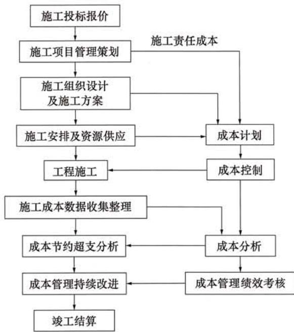

*图5.1-1施工成本管理流程*

  施工成本管理各环节是一个有机联系与相互制约的系统过程。其中，成本计划是开展成本控制和分析的基础，也是成本控制的主要依据；成本控制能对成本计划的实施进行监督，保证成本计划的实现；成本分析是对成本计划是否实现进行的检查，并为成本管理绩效考核提供依据；成本管理绩效考核是实现责任成本目标的保证和手段。

### 5.2 施工定额的作用及编制方法

#### 5.2.1 施工定额的作用和分类

  施工定额是指完成一定计量单位的某一施工过程或基本工序所需消耗的人工、材料和施工机具台班数量标准。施工定额是以某一施工过程或基本工序作为研究对象，表  

  示生产产品数量与生产要素消耗综合关系的定额。施工定额是施工企业（建筑安装企业）为组织生产和加强管理而在企业内部使用的一种定额。施工定额也是工程定额中分项最细、定额子目最多的定额，是工程定额中的基础性定额。

**1. 施工定额的作用**

  施工定额是施工成本管理的基础，施工定额对于施工成本管理的基础作用主要体现在以下几方面。  

  （1）施工定额是施工单位投标报价的依据，也是编制工程项目施工组织设计及施工方案、施工进度计划的依据，以此确定施工作业任务书和限额领料单。  

  （2）施工定额是确定施工责任成本和编制施工成本计划的依据。  

  （3）施工定额是组织和指挥施工生产的有效工具。施工项目管理机构通过下达施工任务书和限额领料单来实现组织管理和指挥施工生产。  

  （4）施工定额是施工成本控制的依据。施工定额为工人劳动报酬、材料及施工机具费用计算提供了衡量标准。  

  （5）施工定额是施工成本分析和施工成本管理绩效考核的基础。

**2. 施工定额的分类**

  按施工定额反映的生产要素消耗内容不同，施工定额可分为人工定额、材料消耗定额和施工机具消耗定额三种。  

  （1）人工定额。人工定额也称为劳动定额，是在正常的施工技术和组织条件下，完成一定计量单位的某一施工过程或基本工序所消耗的人工工日的数量标准。劳动定额的主要表现形式是时间定额，也可表现为产量定额。时间定额与产量定额互为倒数。  

  （2）材料消耗定额。材料消耗定额简称材料定额，是指在正常的施工技术和组织条件下，完成一定计量单位的某一施工过程或基本工序所消耗的原材料、成品、半成品、构配件、燃料及水、电等动力资源的数量标准。  

  （3）施工机具消耗定额。施工机具消耗定额由机械消耗定额和仪器仪表消耗定额组成。机械消耗定额是以一台机械一个工作班为计量单位，又称为机械台班定额。机械消耗定额是指在正常的施工技术和组织条件下，完成一定计量单位的某一施工过程或基本工序所消耗的施工机械台班的数量标准。有机械时间定额和产量定额两种表现形式，两者互为倒数。也可表现为产量定额。施工仪器仪表消耗定额的表现形式与机械消耗定额类似。

#### 5.2.2 施工定额编制方法

**1. 施工定额编制原则**

  （1）施工定额水平必须遵循平均先进的原则。所谓平均先进水平，是指在正常的生产条件下，多数施工班组或生产者经过努力可以达到，少数班组或劳动者可以接近，个别班组或劳动者可以超过的水平。通常平均先进水平低于先进水平，略高于平均水平。平均先进水平是一种鼓励先进、勉励中间、鞭策后进的定额水平。贯彻“平均先进”的原则，才能促进企业的科学管理和不断提高劳动生产率，进而达到提高企业经济效益的目的。  

  （2）施工定额的结构形式遵循简明适用的原则。所谓简明适用，是指定额结构合理，定额步距大小适当，文字通俗易懂，计算方法简便，容易掌握运用，具有多方面的适应性，能在较大范围内满足不同情况、不同用途的需要。  

  （3）及时性与动态管理原则。随着施工技术、材料和设备的不断更新，施工定额应及时进行调整和修订，以保持其时效性和准确性。企业应建立施工定额动态管理机制，定期对定额进行审查和更新。  

  （4）独立自主编制原则。施工企业应结合自身实际情况和技术水平，独立自主地编制施工定额。避免盲目照搬其他企业或行业的定额标准，以确保定额的针对性和实用性。  

  （5）与现行计价标准相协调的原则。施工定额的编制应与现行的工程计价标准保持协调一致。确保定额在投标报价、成本控制和结算审计等环节中的有效应用。

**2. 施工定额编制前准备工作**

  编制施工定额是一项非常复杂的工作，事先必须做好充分准备和全面规划。编制前的准备工作一般包括：明确编制任务和指导思想；系统整理和研究日常积累的定额基本资料；拟定定额编制方案，确定定额水平、定额步距、表达方式等。

**3. 人工定额的编制**

  编制人工定额主要包括拟定正常的施工条件和拟定定额时间两项工作，但拟定定额时间的前提是对工人工作时间按其消耗性质进行分类研究。

**1）工人工作时间消耗的分类**

  工人在工作班内消耗的工作时间，按其消耗的性质，基本可以分为两大类：必需消耗的时间和损失时间。必需消耗的时间是工人在正常施工条件下，为完成一定产品（工作任务）所消耗的时间。它是制定定额的主要依据。损失时间是指与产品生产无关，而与施工组织和技术上的缺陷有关，与工人在施工过程中的个人过失或某些偶然因素有关的时间消耗。  

  工人工作时间分类如图5.2-1所示。

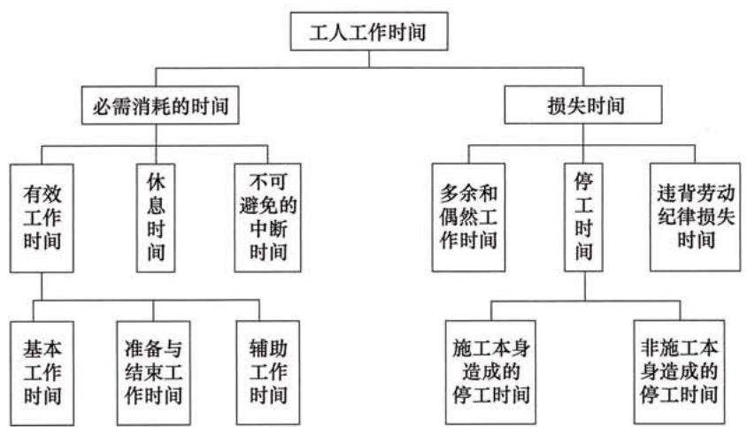

*图5.2-1工人工作时间分类*

  （1）必需消耗的时间，包括有效工作时间、休息时间和不可避免的中断时间。  

  ① 有效工作时间。有效工作时间是指与产品生产直接有关的时间消耗，包括基本工作时间、辅助工作时间、准备与结束工作时间。基本工作时间是工人完成一定产品的施工工艺过程所消耗的时间。基本工作时间所包括的内容依工作性质不同而不同，基本工作时间的长短和工作量大小成正比例。辅助工作时间是指为保证基本工作能顺利完成所消耗的时间。辅助工作时间不能使产品的形状大小、性质或位置发生变化。辅助工作时间的结束，往往就是基本工作时间的开始。辅助工作一般是手工操作，但如果在机手并动的情况下，辅助工作是在机械运转过程中进行的。为避免重复，则不应再计辅助工作时间的消耗。准备与结束工作时间是执行任务前或任务完成后所消耗的工作时间，如工作地点、劳动工具和劳动对象的准备工作时间，工作结束后的整理工作时间等。准备和结束工作时间的长短与所担负的工作量大小无关，但往往与工作内容有关。准备与结束工作时间可分为班内准备与结束工作时间和任务准备与结束工作时间。  

  ② 休息时间。休息时间是指工人在工作过程中为恢复体力所必需的短暂休息和生理需要的时间消耗。这种时间是为了保证工人精力充沛地工作，所以在定额时间中必须进行计算。休息时间的长短与劳动条件有关，劳动越繁重紧张、劳动条件越差（如高温），则休息时间越长。  

  ③ 不可避免的中断时间。不可避免的中断时间是指由于施工工艺特点引起的工作中断所必需的时间。与施工过程、工艺特点有关的工作中断时间，应包括在定额时间内，但应尽量缩短此项时间消耗。与工艺特点无关的工作中断所占用时间，是由于劳动组织不合理引起的，属于损失时间，不能计入定额时间。  

  （2）损失时间，包括多余和偶然工作、停工、违背劳动纪律所引起的损失时间。  

  ① 多余和偶然工作时间。多余工作是指工人进行了任务以外而又不能增加产品数量的工作。多余工作的工时损失，一般都是由于工程技术人员和工人的差错而引起的，因而不应计入定额时间。偶然工作也是工人在任务外进行的工作，但能够获得一定产品，如抹灰工为修补遗留的墙洞消耗的时间等。由于偶然工作能获得一定产品，编制定额时要适当考虑其影响。  

  ② 停工时间。停工时间是指工作班内停止工作造成的工时损失。按其性质不同，停工时间可分为施工本身造成的停工时间和非施工本身造成的停工时间两种。施工本身造成的停工时间，是指由于施工组织不善、材料供应不及时、工作面准备工作不充分、工作地点组织不良等情况引起的停工时间。非施工本身造成的停工时间，是指由于供水、供电中断引起的停工时间。前一种情况在编制定额时不应计算，后一种情况应在编制定额时给予合理考虑。  

  ③ 违背劳动纪律所引起的时间损失。违背劳动纪律所引起的时间损失是指工人在工作班开始和午休后的迟到、午饭前和工作班结束前的早退、擅自离开工作岗位、工作时间内聊天或办私事等造成的工时损失。此类工时损失应不允许存在，因而在定额中是不予考虑的。

**2）拟定正常的施工作业条件**

  拟定正常的施工作业条件，就是要规定执行定额时应具备的条件。正常条件若不能满足，则可能达不到定额中的劳动消耗量标准。因此，正确拟定施工的正常条件有利于定额的实施。  

  拟定正常的施工作业条件包括：拟定施工作业的内容；拟定施工作业的方法；拟  

  定施工作业地点的组织；拟定施工作业人员的组织等。

**3）拟定施工作业的定额时间**

  施工作业的定额时间，是在拟定基本工作时间、辅助工作时间、准备与结束工作时间、不可避免的中断时间及休息时间的基础上编制的。  

  上述各项时间是以时间研究为基础，通过时间测定方法，得出相应的观测数据，经加工整理计算后得到的。时间测定方法较多，如测时法、写实记录法、工作日写实法等。  

  工序作业时间可按式（5.2-1）计算：  

  基本工作时间工序作业时间 = 基本工作时间 + 辅助工作时间 = 1-辅助工作时间 %  

  规范时间包括工序作业时间以外的准备与结束工作时间、不可避免的中断时间及休息时间。因此，规范时间可按式（5.2-2）计算：  

  规范时间 = 准备与结束工作时间 + 不可避免的中断时间 + 休息时间  

  于是，人工定额时间即可按式（5.2-3）计算：

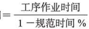

**4）人工定额种类**

  （1）按表现形式划分。按表现形式不同，人工定额可分为时间定额和产量定额。  

  ① 时间定额：某种专业、某种技术等级工人班组或个人，在合理的劳动组织和合理使用材料的条件下，完成单位合格产品所必需的工作时间，包括准备与结束工作时间、基本工作时间、辅助工作时间、不可避免的中断时间及工人必需的休息时间。时间定额以工日为单位，每一工日按8h计算。时间定额可按式（5.2-4）或式（5.2-5）计算：  

  或  

  ② 产量定额：在合理的劳动组织和合理使用材料的条件下，某种专业、某种技术等级的工人班组或个人在单位工日中所应完成的合格产品的数量。产量定额可按式（5.2-6）计算：  

  产量定额的计量单位有：米（ m ）、平方米（ m² ）、立方米（ m³ ）、吨（t）、块、根、件、扇等。  

  时间定额与产量定额互为倒数，即：  

  （2）按标定对象划分。按定额的标定对象不同，人工定额又可分为单项工序定额和综合定额两种，综合定额表示完成同一产品中的各单项（工序或工种）定额的综合。按工序综合的，用“综合”表示；按工种综合的，一般用“合计”表示。综合时间定额和综合产量定额可分别按式（5.2-8）和式（5.2-9）计算：  

  综合时间定额 =Σ 各单项（工序）时间定额

**1综合产量定额≡综合时间定额（工日）**

  时间定额和产量定额都表示同一人工定额项目，是同一人工定额项目的两种不同表现形式。时间定额以工日为单位，综合计算方便，时间概念明确；产量定额则以产品数量为单位表示，具体、形象，劳动者的奋斗目标一目了然，便于分配任务。人工定额用复式表同时列出时间定额和产量定额，以便各部门根据各自的生产条件和要求选择使用。  

  时间定额 人工时间定额复式表示法有如下形式： 或每工产量 机械台班产量

**5）人工定额编制方法**

  人工定额是根据国家的经济政策、劳动制度和有关技术文件及资料制定的。常用的人工定额编制方法有以下四种。  

  （1）技术测定法。根据生产技术和施工组织条件，对施工过程中各工序采用测时法、写实记录法、工作日写实法，测出各工序的工时消耗等资料，再对所获得的资料进行科学分析，进而编制人工定额。该方法科学准确，但耗时耗力。  

  （2）统计分析法。将过去施工生产中的同类工程或同类产品的工时消耗统计资料，与当前生产技术和施工组织条件的变化因素结合起来，进行统计分析。这种方法简单易行，适用于施工条件正常、产品稳定、工序重复量大和统计工作制度健全的施工过程。但是，历史记录只是实耗工时，不能反映生产组织和技术状况。因此，在此条件下求出的定额水平，只是已达到的劳动生产率水平，而不是平均水平。实际工作中，需要分析研究各种变化因素，使定额能真实反映施工生产平均水平。  

  （3）比较类推法。对于同类型产品规格多、工序重复、工作量小的施工过程，常用比较类推法。采用该方法编制定额是以同类型工序和同类型产品的实耗工时为标准，类推相似项目定额水平。采用该方法编制人工定额，必须掌握类似的程度和各种影响因素的异同程度。  

  （4）经验估计法。根据定额专业人员、经验丰富的工人和施工技术人员的实际工作经验，参考有关定额资料，对施工管理组织和现场技术条件进行调查、讨论和分析后编制人工定额。经验估计法通常作为一次性定额使用。

**4. 材料消耗定额的编制**

  按其使用性质、用途和用量大小不同，材料可划分为四类： ① 主要材料，是指直接构成工程实体的材料； ② 辅助材料，是指直接构成工程实体，但比重较小的材料；③ 周转性材料（又称工具性材料），是指施工中多次使用但并不构成工程实体的材料，如模板、脚手架等； ④ 零星材料，是指用量小、价值不大、不便计算的次要材料。  

  编制材料消耗定额，主要包括确定直接使用在工程上的材料净用量和在施工现场内运输及操作过程中不可避免的废料和损耗。

**1）材料净用量的确定**

  材料净用量的确定，一般有以下几种方法。  

  （1）理论计算法。根据设计、施工验收规范和材料规格等，从理论上计算材料的净用量。如砖墙用砖量和砌筑砂浆用量可分别用式（5.2-10）和式（5.2-11）计算各自  

  的净用量。  

  ① 砖墙用砖量。标准砖砌体中，砌筑 1m³ 标准砖墙净用砖量计算公式如下：  

  砌 1m³ 标准砖墙净用砖量 = 1 ×K （块）墙厚 × （砖长 + 灰缝） × （砖厚 + 灰缝）  

  武中 K ——墙厚的砖数 ×2 （墙厚的砖数是0.5砖墙、1砖墙、1.5砖墙…）。  

  墙厚的砖数是指用标准砖的长度来标明墙厚。例如：半砖墙指 120mm 厚墙、 3/4 砖墙指 180mm 厚墙、1砖墙指 240mm 厚墙等。  

  ② 砖墙砌筑砂浆用量。标准砖砌体中，每 1m³ 标准砖砌体砂浆净用量计算公式如下：  

  每 1m³ 标准砖砌体砂浆净用量 ε=1m³ 砌体 -1m³ 砌体中标准砖的净体积（5.2-11  

  （2）测定法。根据试验情况和现场测定的资料数据确定材料净用量。  

  （3）图纸计算法。根据选定的图纸，计算各种材料的体积、面积、延长米或重量。  

  （4）经验法。根据历史上同类项目经验进行估算。

**2）材料损耗量的确定**

  材料损耗一般以损耗率表示。材料损耗率可通过观察法或统计法计算确定。材料消耗率及损耗量可分别采用式（5.2-13）和式（5.2-14）计算：

**3）周转性材料消耗定额的编制**

  钢筋混凝土工程用的模板，搭设脚手架用的杆子、跳板，土方工程用的挡土板等，均属于周转性材料。  

  周转性材料消耗一般与下列因素有关： ① 第一次制造时的材料消耗（一次使用量）； ② 每周转使用一次材料的损耗（第二次使用时需要补充）； ③ 周转使用次数；  

  ④ 周转材料的最终回收及其回收折价。  

  定额中的周转材料消耗量应采用一次使用量和摊销量两个指标表示。一次使用量是指周转材料在不重复使用时的一次使用量，供施工单位组织施工用；摊销量是指周转材料退出使用，应分摊到每一计量单位的结构构件周转材料消耗量，供施工单位成本核算或投标报价使用。  

  例如，浇筑混凝土结构的模板用量可采用以下计算公式：  

  每次周转摊销量 δ= 周转一次使用量一回收量 × 回收折价率又如，预制混凝土构件的模板用量可采用以下计算公式：

**5. 施工机具消耗定额的编制**

  施工机具消耗定额包括施工机械台班消耗定额和仪器仪表台班消耗定额。由于两者的编制方法类似，故此处仅介绍施工机械台班消耗定额的编制。

**1）机械工作时间消耗分类**

  施工机械台班消耗定额的编制前提是对施工机械工作时间消耗进行分类。按其性质不同，施工机械工作时间分类如图5.2-2所示。施工机械工作时间也可分为必需消耗的时间和损失时间两大类。

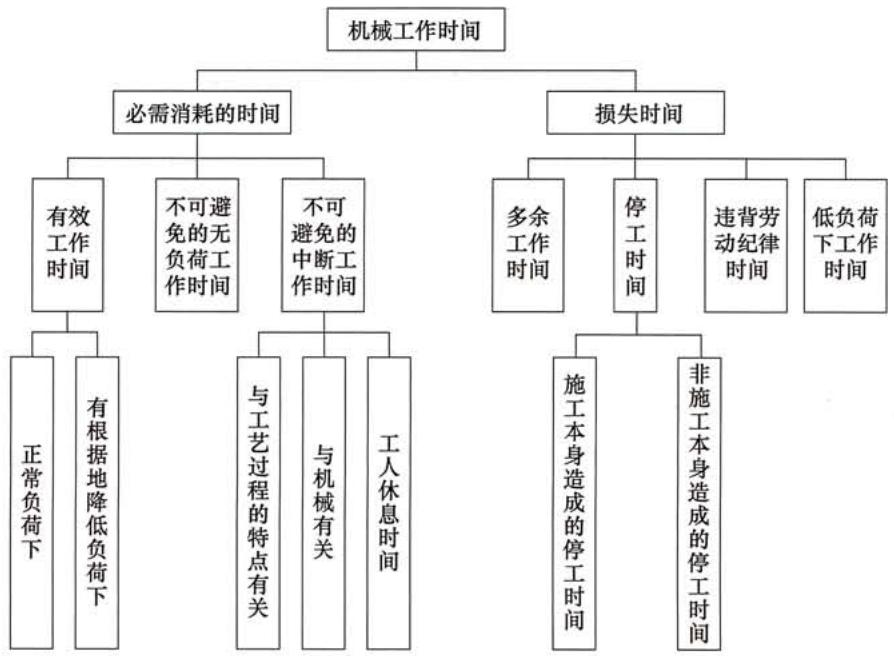

*图5.2-2施工机械工作时间分类*

  （1）必需消耗的时间，包括有效工作时间、不可避免的无负荷工作时间和不可避免的中断工作时间三项。  

  ① 有效工作时间。有效工作时间中又包括正常负荷下、有根据地降低负荷下的工时消耗。正常负荷下的工作时间，是指机械在与机械说明书规定的计算负荷相符的情况下进行工作的时间。有根据地降低负荷下的工时消耗，是指在个别情况下由于技术原因，机械在低于其计算负荷下工作的时间。例如，汽车运输重量轻而体积大的货物时，不能充分利用汽车的载重吨位因而不得不降低其计算负荷。  

  ② 不可避免的无负荷工作时间。不可避免的无负荷工作时间是指由施工特点和机械结构特点造成的机械无负荷工作时间。例如筑路机在工作区末端调头等，属于此项工作时间消耗。  

  ③ 不可避免的中断工作时间。不可避免的中断工作时间是指与工艺过程特点、机械使用和保养、工人休息有关的中断时间。与工艺过程特点有关的不可避免中断工作时间，有循环和定期两种。循环的不可避免中断，是指在机械工作的每一个循环中重复一次。如汽车装货和卸货时的停车。定期的不可避免中断，是指经过一定时期重复一次。例如，将灰浆泵由一个工作地点转移至另一工作地点时的工作中断。与机械有关的不可避免中断工作时间，是指由于工人进行准备与结束工作或辅助工作时，机械停止工作而引起的中断工作时间。这是与机械使用与保养有关的不可避免中断时间。需注意的是，应尽量利用与工艺过程有关和与机械有关的不可避免中断时间进行休息，以充分利用工作时间。  

  （2）损失的工作时间，包括多余工作时间、停工时间、违背劳动纪律所消耗的工作时间和低负荷下的工作时间。  

  ① 多余工作时间。施工机械的多余工作时间是指施工机械进行任务内和工艺过程内未包括的工作而延续的时间。如工人没有及时供料而使机械空运转的时间。  

  ② 停工时间。按其性质不同，施工机械的停工也可分为施工本身造成和非施工本身造成的停工。前者是由于施工组织不善而引起的停工，如由于未及时供给机械燃料而引起的停工。后者是由于气候条件所引起的停工，如暴雨时压路机停工。上述停工时间均为施工机械的停工时间。  

  ③ 违背劳动纪律所消耗的工作时间。违背劳动纪律所消耗的工作时间是指由于工人迟到、早退或擅离岗位等引起的机械停工时间。  

  ④ 低负荷下的工作时间。低负荷下的工作时间是指由于工人或技术人员的过错所造成的施工机械在降低负荷的情况下工作的时间。例如，工人装车的砂石数量不足造成汽车在降低负荷的情况下工作所延续的时间。这类工作时间不能作为计算时间定额的基础。

**2）机械台班消耗定额的编制内容**

  （1）拟定机械工作的正常施工条件。包括工作地点的合理组织、施工机械作业方法的拟定、配合机械作业的施工小组组织及机械工作班制度等。  

  （2）确定机械1h纯工作正常生产率。机械纯工作时间，是指机械的必需消耗时间。机械1h纯工作正常生产率，就是在正常施工组织条件下，具有必需的知识和技能的技术工人操作机械1h的生产率。根据机械工作特点的不同，机械1h纯工作正常生产率的  

  确定方法，也有所不同。  

  ① 对于循环动作机械，确定机械纯工作1h正常生产率采用如下计算公式：  

  机械一次循环的正常延续时间 =Σ （循环各组成部分正常延续时间）一交叠时间  

  机械纯工作1h正常生产率 = 机械纯工作1h正常循环次数 × 一次循环生产的产品数量  

  ② 对于连续动作机械，确定机械纯工作1h正常生产率要根据机械类型、结构特征及工作过程的特点来进行。计算公式如下：  

  工作时间内生产的产品数量连续动作机械纯工作1h正常生产率 = 工作时间（h）  

  工作时间内的产品数量和工作时间消耗，要通过多次现场观察和机械说明书来获得数据。  

  （3）确定施工机械利用系数。施工机械正常利用系数是指施工机械在施工作业班内的作业时间利用率。计算公式如下：  

  （4）计算机械台班定额。施工机械台班产量定额的计算公式如下：  

  施工机械台班产量定额 = 机械净工作1h生产率 × 工作班延续时间 × 机械利用系数  

  （5）拟定工人小组的定额时间。工人小组的定额时间是指配合施工机械作业的工人小组工作时间总和。计算公式如下：  

  工人小组定额时间 = 施工机械时间定额 × 工人小组的人数

**3）施工机械定额表示方法**

  施工机械定额可表示为产量定额和时间定额，两者互为倒数关系。  

  人工时间定额施工机械台班消耗定额也可用复式表示法，其形式为：机械台班产量°

### 5.3 施工成本计划

#### 5.3.1 施工责任成本构成

**1. 施工责任成本**

  施工责任成本是以履行施工合同为前提，依据施工项目预算成本，经过施工单位和项目管理机构协商确定的由项目管理机构控制的成本总额。预算成本是在既定的市场环境下，根据企业管理水平和管理特点，按企业费用支出标准、资源市场价格信息和工程实际情况，测算的项目各项费用总和。  

  施工责任成本是以责任中心为对象来进行归集的可控成本，将企业成本管理中的经济责任进行明确划分，体现出“分级控制”与“责权利一体”的现代企业管理理念。而可控成本是指可以被责任中心控制的成本，且控制水平的高低会对成本支出造成一定影响。通常而言，责任成本具有四个条件： ① 可考核性，责任中心能够实时考核责任成本的执行过程及结果； ② 可预计性，责任中心能够知晓责任成本的发生与发展；③ 可计量性，责任中心能够计量责任成本的大小； ④ 可控制性，责任中心能够有效调节、控制责任成本。施工责任成本管控是指在工程项目施工全过程中，对工程项目的责任成本进行分解，明确各相关部门的成本责任，并结合施工单位的实际情况科学制订一套激励考核方案，从而实现全方位的成本控制。

**2. 施工责任成本构成**

  施工责任成本由人工费、材料费、施工机具使用费、专业分包费、措施费、间接费、其他费用组成。  

  施工责任成本可采用以下公式进行计算：  

  施工责任成本 = 预计结算收入一税金一企业管理费一目标利润 施工责任成本降低率 ≡= 施工责任成本降低额/施工责任成本  

  施工责任成本应以施工合同、施工图纸、中标清单、企业内部施工定额、施工组织设计、施工方案、施工进度计划、市场价格信息等为依据，按照一定方法从中标价（合同价）中分离出来。  

  中标后，投标负责人组织对编制、审核标价分离相关人员进行投标交底。一般由商务部门组织进行标价分离、完成施工成本测算，协调相关部门编制施工成本降低率；技术部门配合完成施工方案、周转工具用量、机械设备配置的合理化及费用测算；工程部门配合完成工期优化效益测算；物资采购部门配合完成材料费、周转工具费及采购效益测算；安全管理部门配合完成安全生产措施费测算；人力资源部门配合完成项目管理人员配置及岗位薪酬标准测算；财务部门配合完成项目管理费及各项费用标准测算。项目商务经理、技术负责人配合参与编制。标价分离完成后，根据项目综合情况，施工单位管理部门与施工项目经理共同确认标价分离、成本降低率，商务部门完成施工责任成本分解。  

  施工责任成本分解示例见表5.3-1。

*表5.3-1施工责任成本分解*

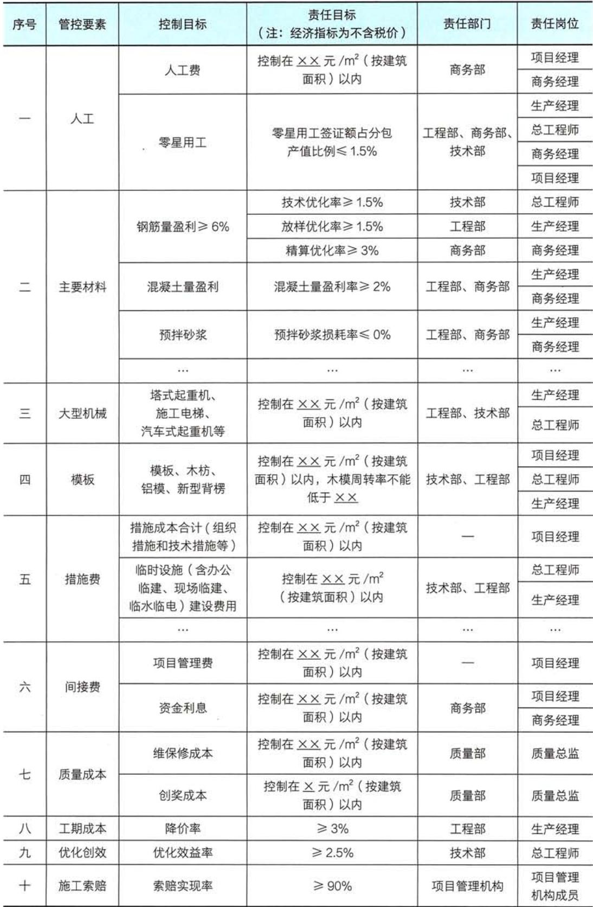

#### 5.3.2 施工成本计划编制

**1. 施工成本计划的类型**

  按其发挥的作用不同，施工成本计划可分为竞争性成本计划、指导性成本计划和实施性成本计划。

**1）竞争性成本计划**

  竞争性成本计划是指在施工投标及签订合同阶段的估算成本计划。这类成本计划以招标文件中的合同条件、投标者须知、技术规范、设计图纸和工程量清单为依据，以有关价格条件说明为基础，结合调研、现场踏勘、答疑等情况，根据施工企业自身的工料消耗标准、水平、价格资料和费用指标等，对完成投标工程所需支出的全部费用进行估算。在投标报价过程中，虽也着重考虑降低成本的途径和措施，但总体上较为粗略。

**2）指导性成本计划**

  指导性成本计划是指在选派项目经理阶段的预算成本计划，是项目经理的责任成本目标。指导性成本计划是以合同价为依据，按照企业定额标准制定的施工成本计划，用以确定施工责任成本。

**3）实施性成本计划**

  实施性成本计划是指在工程项目施工准备阶段，以项目实施方案为依据，以落实项目经理责任目标为出发点，根据企业施工定额编制的施工成本计划。  

  以上三类成本计划相互衔接、不断深化，构成整个工程项目的施工成本计划过程。其中，竞争性成本计划带有成本战略性质，是施工投标阶段商务标书的基础。指导性成本计划和实施性成本计划，都是战略性成本计划的进一步开展和深化，是对战略性成本计划的战术安排。

**2. 施工成本计划的编制依据和程序**

**1）施工成本计划的编制依据**

  编制施工成本计划，需要广泛收集相关资料并进行整理。在此基础上，根据有关设计文件、工程承包合同、施工组织设计、成本预测资料等，按照施工项目应投入的生产要素，结合各种因素变化的预测和拟采取的各种措施，估算施工项目生产费用支出总水平，进而提出施工成本计划控制指标，确定目标总成本。目标总成本确定后，应将总目标分解落实到各级部门，以便有效地进行控制。最后，通过综合平衡，编制完成施工成本计划。  

  施工成本计划的编制依据包括：合同文件；项目管理实施规划；相关设计文件；价格信息；相关定额；类似项目成本资料等。

**2）施工成本计划的编制程序**

  项目管理机构应通过系统的成本策划，按成本组成、项目结构和工程实施阶段编制施工成本计划。  

  施工成本计划编制应符合下列规定：由项目管理机构负责组织编制；项目成本计划对项目成本控制具有指导性；各成本项目指标和降低成本指标明确。  

  根据《建设工程项目管理规范》GB/T5326—2017，施工成本计划应按下列程序编制： ① 预测项目成本； ② 确定项目总体成本目标； ③ 编制项目总体成本计划； ④ 项目管理机构与企业职能部门根据其责任成本范围，分别确定各自成本目标，并编制相应的成本计划； ⑤ 针对成本计划制定相应的控制措施； ⑥ 由项目管理机构与企业职能部门负责人分别审批相应的成本计划。  

  施工成本计划的编制应以成本预测为基础，关键是确定目标成本。施工成本计划的编制需要结合施工组织设计的编制过程，通过不断优化施工方案和合理配置生产要素，进行工、料、机消耗分析，并制定一系列节约成本的措施。施工成本总额应控制在目标成本范围内，并建立在切实可行的基础上。施工总成本目标确定后，还需通过编制详细的实施性成本计划把目标成本层层分解，落实到施工过程的各个环节。

**3. 施工成本计划编制方法**

**1）按成本构成编制施工成本计划的方法**

  按成本构成分解，施工成本可分为人工费、材料费、施工机具使用费和企业管理费等。在此基础上，可编制按成本构成分解的成本计划，如图5.3-1所示。

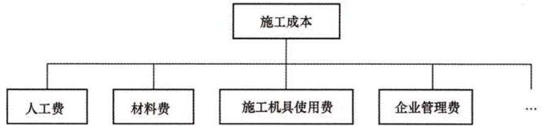

*图5.3-1按成本构成分解的施工成本计划*

**2）按项目结构编制施工成本计划的方法**

  大中型工程项目通常是由若干单项工程构成的，而每个单项工程又会包含多个单位工程，每个单位工程又是由若干分部分项工程所构成。因此，首先要把项目总成本分解到单项工程和单位工程中，再进一步分解到分部工程和分项工程中。按项目结构分解的施工成本计划如图5.3-2所示。

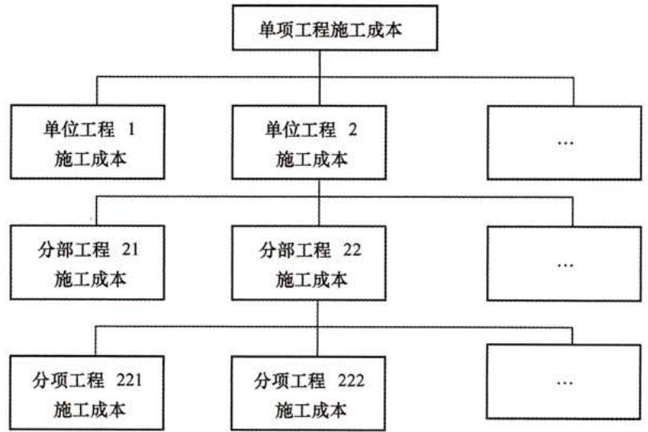

*图5.3-2按项目结构分解的施工成本计划*

  在完成施工项目成本目标分解后，接下来便可具体地分配成本，编制分项工程成本支出计划，从而形成详细的分项工程施工成本计划表，见表5.3-2。

*表5.3-2分项工程施工成本计划表*

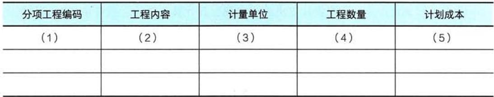

  在编制成本支出计划时，要在项目总体层面上考虑总的预备费，也要在主要分项工程中安排适当的不可预见费，避免在具体编制成本计划时，可能发生个别单位工程或工程量表中某项内容的工程量计算有较大出入，偏离原来计划成本。

**3）按工程实施阶段编制施工成本计划的方法**

  施工成本计划可按工程实施阶段（如基础、主体、安装、装饰装修等工程施工）或按月、季、年等实施进度进行编制。按实施进度编制施工成本计划，通常可在施工进度网络计划的基础上进一步扩充得到。也即在编制施工进度网络计划时，一方面确定完成各项工作所需花费的时间，另一方面确定完成该工作的成本支出计划。在工程实践中，将工程项目分解为既能方便地表示时间，又能方便地表示成本支出计划的工作是不容易的。在通常情况下，如果项目分解对时间控制合适的话，则对成本支出计划可能分解过细，以至于不可确定每项工作的成本支出计划；反之亦然。因此在编制施工进度网络计划时，应在充分考虑进度控制对项目划分要求的同时，还要考虑确定成本支出计划对项目划分的要求，做到两者兼顾。  

  通过将施工成本目标按时间进行分解，在网络计划基础上，可获得施工进度计划图，并在此基础上编制成本计划。其表示方式有两种：一种是根据时标网络计划按月编制施工成本计划，如图5.3-3所示；另一种是用时间－成本累积曲线（S曲线），如图5.3-4所示。

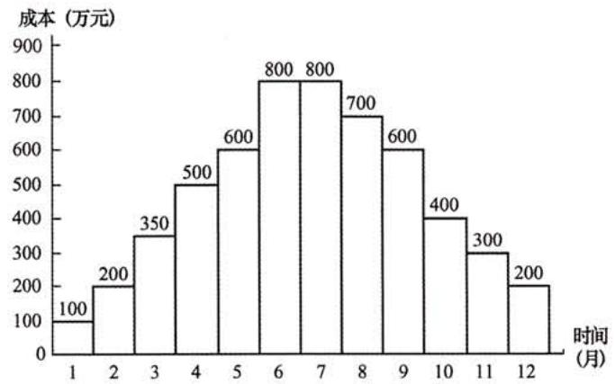

*图5.3-3根据时标网络计划按月编制的施工成本计划*

  按工程实施阶段编制施工成本计划的步骤如下：  

  （1）编制工程项目施工进度时标网络计划。  

  （2）根据施工进度计划中每项工作在单位时间内完成的实物工程量或投入的人力、物力和财力，计算单位时间（月或旬）施工成本，并在时标网络计划中按时间（月或  

  旬）编制成本支出计划，如图5.3-3所示。  

  （3）计算规定时间 t 计划累计支出的成本额。其计算方法为：将各单位时间计划完成的成本额累加求和，可按式（5.3-4）计算：  

Q1

=∑n=1

t

qn

  式中 Qι

 —某时间 t 内计划累计支出成本额；qn

 单位时间 n 的计划支出成本额；t- 某规定时刻。  

  （4）按各规定时间的 Qt

 值，即可绘制S曲线，如图5.3-4所示。

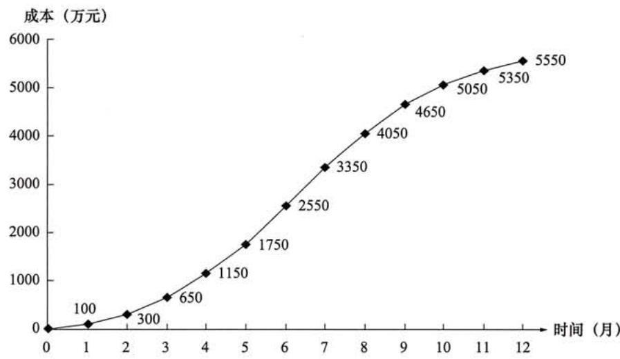

*图5.3-4时间-成本累积曲线（S曲线）*

  每一条S曲线都对应某一特定工程的施工进度计划。由于在施工进度网络计划的非关键路线中，会存在若干有时差的工作，因而会使S曲线必然被包络在由全部工作均按最早开始时间开始和全部工作均按最迟开始时间开始的两条S曲线所组成的“香蕉图”内。这样，项目管理机构可根据编制的成本支出计划来合理安排资金投入，并通过调整非关键路线上的工作开始时间，力争将实际成本支出控制在计划范围内。  

  对施工单位而言，施工进度网络计划中的所有工作均按最早开始时间开始、按最早完成时间完成，可以尽早获得工程进度款支付，同时也能提高工程按期峻工的保证率，但是同时也会占用建设单位大量资金。因此，必须合理地确定成本支出计划，达到既节约成本支出又能控制工期的目的。  

  以上三种编制施工成本计划的方式并不是相互独立的。在工程实践中，往往结合起来使用，发挥各自优势。例如：横向按成本构成分解施工总成本，纵向按项目结构分解施工总成本，这种结合方式有助于检查各分部分项工程成本构成是否完整，有无重复计算或漏算；同时还有助于检查各项具体的成本支出对象是否明确或落实。或者将按项目结构分解与按时间分解施工总成本结合起来，纵向按项目结构分解施工总成本，横向按时间分解施工总成本等。

### 5.4 施工成本控制

#### 5.4.1 施工成本控制过程

  施工成本控制过程可分为两类：一是管理行为控制过程；二是指标控制过程。管理行为控制是对施工成本全过程控制的基础，指标控制则是成本控制的重点。两个过程既相对独立又相互联系，既相互补充又相互制约。

**1. 管理行为控制过程**

  管理行为控制的目的是确保每个岗位人员在成本管理过程中的管理行为符合事先确定的程序和方法的要求。从这个意义上讲，首先要清楚企业建立的成本管理体系是否能有效控制成本的形成过程，其次要考察体系是否处于有效的运行状态。管理行为控制过程是为规范项目成本管理行为而制定的约束和激励体系。

**1）建立项目成本管理体系的评审组织和评审程序**

  成本管理体系的建立不同于质量管理体系，质量管理体系反映的是企业质量保证能力，由社会有关组织进行评审和认证；成本管理体系的建立是企业自身生存发展的需要，无社会组织来评审和认证。因此，企业必须建立项目成本管理体系的评审组织和评审程序，定期进行评审和总结，持续改进。

**2）建立项目成本管理体系运行的评审组织和评审程序**

  项目成本管理体系的运行有一个逐步推行的渐进过程。一个企业的各分公司、项目管理机构的运行质量往往是不平衡的。因此，必须建立专门的常设组织，依照程序定期地进行检查和评审。发现问题，总结经验，以保证成本管理体系的保持和持续改进。

**3）目标考核，定期检查**

  管理程序文件应明确每个岗位人员在成本管理中的职责，确定每个岗位人员的管理行为，如应提供的报表、提供的时间和原始数据的质量要求等。要把每个岗位人员是否按要求去履行职责作为一个目标来考核。为了方便检查，应将考核指标具体化，并设专人定期或不定期地检查；应根据检查的内容编制相应的检查表，由项目经理或其委托人检查后填写检查表。

**4）制定对策，纠正偏差**

  对管理工作进行检查的目的是保证管理工作按预定的程序和标准进行，从而保证项目成本管理能够达到预期的目的。因此，对检查中发现的问题，要及时进行分析，然后根据不同情况，及时采取对策。

**2. 指标控制过程**

  能否达到施工成本目标，是成本控制成功的关键。对各岗位人员的成本管理行为进行控制，就是为了保证成本目标的实现。施工成本指标控制过程如图5.4-1所示。

**1）确定成本管理分层次目标**

  在工程开工之初，项目管理机构应根据责任成本确定项目的成本管理目标，并根据工程进度计划确定月度成本计划目标。

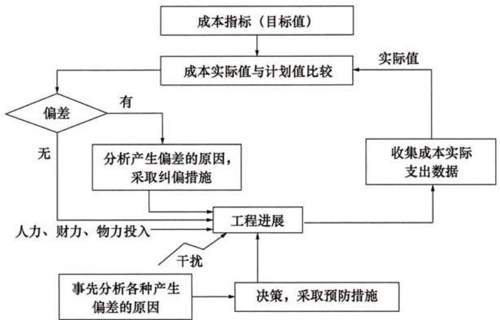

*图5.4-1施工成本指标控制过程*

**2）采集成本数据，监测成本形成过程**

  在施工过程中要定期收集反映成本支出情况的数据，并将实际发生情况与目标计划进行对比，从而保证有效控制成本的整个形成过程。

**3）找出偏差，分析原因**

  施工过程是一个多工种、多方位立体交叉作业的复杂活动，成本的发生和形成是很难按预定的目标进行的，因此，需要及时分析偏差产生的原因，分清是客观因素（如市场调价）还是人为因素（如管理行为失控）。

**4）制定对策，纠正偏差**

  过程控制的目的就在于不断纠正成本形成过程中的偏差，保证成本项目的发生是在预定范围之内。针对产生偏差的原因及时制定对策并予以纠正。

**5）调整改进成本管理方法**

  以成本指标考核管理行为，以管理行为保证成本指标。管理行为和成本指标的控制过程是对项目成本进行控制的主要内容，两个过程相互交叉、相互制约又相互联系。只有把成本指标的控制过程和管理行为的控制过程相结合，才能保证成本管理工作有序、富有成效地进行。

#### 5.4.2 施工成本控制方法

**1. 施工成本过程控制方法**

  施工阶段是成本发生的主要阶段，这个阶段的成本控制主要是通过确定成本目标并按计划成本组织施工，合理配置资源，对施工现场发生的各项成本费用进行有效控制，具体控制方法如下。

**1）人工费的控制**

  人工费的控制实行“量价分离”的方法，将作业用工及零星用工按定额工日的一定比例综合确定用工数量与单价，通过专业作业分包合同进行控制。加强劳动定额管理，提高劳动生产率，降低工程耗用人工工日，是控制人工费支出的主要手段。  

  （1）制定先进合理的企业内部劳动定额，严格执行劳动定额，并将安全生产及零星用工下达到作业队进行控制。全面推行全额计件的劳动管理办法和单项工程集体承包的经济管理办法，以不超出责任成本人工费指标为控制目标，实行工资包干制度。认真执行按劳分配的原则，使职工个人所得与劳动贡献相一致，充分调动广大职工的劳动积极性，以提高劳动效率。把项目的进度、安全、质量等指标与定额管理结合起来，提高劳动者的综合能力，实行奖励制度。  

  （2）提高生产工人的技术水平和作业队的组织管理水平，根据施工进度、技术要求，合理搭配各工种工人的数量，减少和避免无效劳动。不断地改善劳动组织，创造良好的工作环境，改善工人的劳动条件，提高劳动效率。合理调节各工序人数安排情况，安排劳动力时，尽量做到技术工不做普通工的工作，高级工不做低级工的工作，避免技术上的浪费，既要加快工程进度，又要节约人工费用。  

  （3）加快自有建筑工人队伍建设。加强对装配式建筑、机器人建造等新型建造方式和建造科技的探索和应用，提升智能建造水平，通过技术升级推动建筑工人从传统建造方式向新型建造方式转变。通过培育自有建筑工人、吸纳高技能技术工人和职业院校毕业生等方式，建立相对稳定的核心技术工人队伍。有条件的企业应建立首席技师制度、劳模和工匠人才（职工）创新工作室、技能大师工作室和高技能人才库，切实加强技能人才队伍建设。  

  （4）完善职业技能培训体系。完善建筑工人技能培训组织实施体系，开展智能建造相关培训，加大对装配式建筑、建筑信息模型（BIM）等新兴职业（工种）建筑工人培养，增加高技能人才供给。  

  （5）建立技能导向的激励机制。根据项目施工特点制定施工现场技能工人基本配备标准，明确施工现场各职业（工种）技能工人技能等级的配备比例要求，逐步提高基本配备标准。应不断提高建筑工人技能水平，并将薪酬与建筑工人技能等级挂钩，完善激励措施，实现技高者多得、多劳者多得。  

  （6）规范劳动用工制度。用人单位应与招用的建筑工人依法签订劳动合同，严禁用劳务合同代替劳动合同，依法规范劳务派遣用工。施工总承包单位或者分包单位不得安排未订立劳动合同并实名登记的建筑工人进人项目现场施工。

**2）材料费的控制**

  材料费控制同样按照“量价分离”原则，控制材料用量和材料价格。  

  （1）材料用量的控制。在保证符合设计要求和质量标准的前提下，合理使用材料，通过定额控制、指标控制、计量控制、包干控制等手段有效控制物资材料的消耗，具体方法如下。  

  ① 定额控制。对于有消耗定额的材料，以消耗定额为依据，实行限额领料制度。按分项工程实行限额领料，就是按照分项工程进行限额，如钢筋绑扎、混凝土浇筑、砌筑、抹灰等，它是以施工班组为对象进行的限额领料。按工程部位实行限额领料，如按工程施工工序分为基础工程、结构工程和装饰工程，它是以施工专业队为对象进行的限额领料。按单位工程实行限额领料，就是对一个单位工程从开工到竣工全过程的用料实行的限额领料，它是以项目管理机构或分包单位为对象开展的限额领料。  

  限额领料的依据包括：准确的工程量，它是按工程施工图纸计算的正常施工条件下的数量，是计算限额领料量的基础；施工定额；施工组织设计，是计算和调整非实体性消耗材料的基础；施工过程中发包人认可的变更洽商单，是调整限额量的依据。  

  限额领料的实施： ① 根据工程分包形式，与使用单位确定限额领料形式； ② 根据施工预算和施工组织设计，将所需材料数量汇总后编制材料限额数量，经双方确认后签发限额领料单； ③ 在限额领料执行过程中，因工程变更、环境因素变化等需要调整限额量时，及时调整限额数量； ④ 工程完工后，应及时对限额领料进行核算，分析用料情况，按合同约定对用料节超兑现奖罚。  

  ② 指标控制。对于没有消耗定额的材料，则实行计划管理和按指标控制的办法。根据以往项目的实际耗用情况，结合具体施工项目的内容和要求，制定领用材料指标，以控制发料。超过指标的材料，必须经过一定的审批手续方可领用。  

  ③ 计量控制。准确做好材料物资的收发计量检查和投料计量检查。  

  ④ 包干控制。在材料使用过程中，对部分小型及零星材料（如钢钉、钢丝等）根据工程量计算出所需材料量，将其折算成费用，由作业者包干使用。  

  （2）材料价格的控制。材料价格主要由材料采购部门控制。由于材料价格是由买价、运杂费、运输中的合理损耗等所组成，因此控制材料价格，主要是通过掌握市场信息，应用招标和询价等方式控制材料、设备的采购价格。施工项目的材料物资，包括构成工程实体的主要材料和结构件，以及有助于工程实体形成的周转使用材料和低值易耗品。从价值角度看，材料物资的价值约占建筑安装工程造价的 60% 以上，因此，对材料价格的控制非常重要。

**3）施工机具使用费的控制**

  合理选择施工机械设备，合理使用施工机械设备对成本控制具有十分重要的意义。施工机具使用费主要由台班数量和台班单价两方面决定，因此为有效控制施工机具使用费，应主要从两个方面进行控制。

**（1）台班数量**

  ① 根据施工方案和现场实际情况，选择适合项目施工特点的施工机械，制定设备需求计划，合理安排施工生产，充分利用现有机械设备，加强内部调配，提高机械设备的利用率。  

  ② 保证施工机械设备的作业时间，安排好生产工序的衔接，尽量避免停工、窝工，尽量减少施工中所消耗的机械台班数量。  

  ③ 核定设备台班定额产量，实行超产奖励办法，加快施工生产进度，提高机械设备单位时间的生产效率和利用率。  

  ④ 加强设备租赁计划管理，减少不必要的设备闲置和浪费，充分利用社会闲置机械资源。  

  （2）台班单价  

  ① 加强现场设备的维修、保养工作。降低大修、经常性修理等各项费用的开支，  

  提高机械设备的完好率，最大限度地提高机械设备的利用率，避免因使用不当造成机械设备的停置。  

  ② 加强机械操作人员的培训工作。不断提高操作技能，提高施工机械台班的生产效率。  

  ③ 加强配件的管理。建立健全配件领发料制度，严格按油料消耗定额控制油料消耗，做到修理有记录，消耗有定额，统计有报表，损耗有分析。通过经常分析总结，提高修理质量，降低配件消耗，减少修理费用的支出。  

  ④ 降低材料成本。做好施工机械配件和工程材料采购计划，降低材料成本。  

  ⑤ 成立设备管理领导小组，负责设备调度、检查、维修、评估等具体事宜。对主要部件及其保养情况建立档案，分清责任，便于尽早发现问题，找到解决问题的办法。

**4）施工分包费用的控制**

  施工成本控制的重要工作之一是对分包价格的控制。项目管理机构应在确定施工方案的初期就要确定需要分包的工程范围，决定分包范围的因素主要是施工项目的专业性和项目规模。对分包费用的控制，主要是做好分包工程的询价、订立平等互利的分包合同、建立稳定的分包关系网络、加强施工验收和分包结算等工作。

**2. 成本动态监控方法**

  在工程施工阶段，施工单位要进行实际成本（费用）与计划成本（费用）的动态比较，分析成本（费用）偏差产生的原因，并采取有效措施控制成本（费用）偏差。目前，国际上已普遍采用挣值法进行工程项目费用、进度综合分析控制。

**1）挣值法的三个基本参数**

  挣值法的三个基本参数是：已完工程预算费用、拟完工程预算费用和已完工程实际费用。  

  （1）已完工程预算费用。已完工程预算费用（BCWP，BudgetedCostforWorkPerformed）是指在工程开工后的某一时刻已经完成的工程（或部分工程），以批准认可的预算为标准所需要的费用总额。由于发包人正是根据此值为施工承包单位完成的工程量支付相应费用，也就是施工承包单位获得（挣得）的金额，故称为赢得值或挣值。  

  已完工程预算费用 arrayr(BCWP)=Σarray （已完工程量 × 预算单价）  

  （2）拟完工程预算费用。拟完工程预算费用（BCWS，BudgetedCostforWorkScheduled）是指根据进度计划，在某一时刻应完成的工程（或部分工程），以预算为标准所需要的费用总额。除非合同有变更，否则，拟完工程预算费用在工程实施过程中应保持不变。  

  拟完工程预算费用  BCWS)=Σ （计划工程量 × 预算单价）  

  （3）已完工程实际费用。已完工程实际费用（ACWP，ActualCostforWorkPerformed）是指截至某一时刻，已完成工程（或部分工程）实际所花费的费用。  

  已完工程实际费用 arrayr(ACWP)=Σarray （已完成工程量 × 实际单价）

**2）挣值法的四个评价指标**

  根据前述基本参数，即可确定四个评价指标，它们都是时间的函数。  

  （1）费用偏差（ CV ，CostVariance）。计算公式如下：费用偏差 (CV)= 已完工程预算费用（BCWP）一已完工程实际费用（ACWP）  

  当费用偏差 CV 为负值时，表明实际费用超支；当费用偏差 CV 为正值时，表明实际费用节约。 CV=0 时，表明实际费用按预算支出。  

  （2）进度偏差（SV，ScheduleVariance）。计算公式如下：  

  进度偏差 (SV)= 已完工程预算费用（BCWP）-拟完工程预算费用（BCWS）  

  当进度偏差 sV 为负值时，表明实际进度拖后；当进度偏差 sV 为正值时，表明实际进度提前。 SV=0 时，表明实际进度正常。  

  （3）费用绩效指数（CPI，CostPerformanceIndex）。计算公式如下：  

  费用绩效指数（ CPI)= 已完工程预算费用（BCWP）/已完工程实际费用（ACWP）  

  当费用绩效指数 (CPI)＜1 时，表明实际费用超支；当费用绩效指数 (CPI)＞1 时，表明实际费用节约。 CPI=1 时，表明实际费用按预算支出。  

  （4）进度绩效指数（SPI，SchedulePerformanceIndex）。计算公式如下：  

  进度绩效指数（ ,sPI)= 已完工程预算费用（BCWP）/拟完工程预算费用（BCWS）  

  当进度绩效指数 (SPI)＜1 时，表明实际进度拖后；当进度绩效指数（ SPI)＞1 时，表明实际进度提前。 SPI=1 时，表明实际进度正常。  

  费用（进度）偏差反映的是绝对偏差，结果很直观，有助于成本管理人员了解项目费用出现偏差的绝对数额，并依此采取一定措施，制定或调整费用支出计划，但绝对偏差有其不容忽视的局限性。如同样是10万元的费用偏差，对于总费用1000万元的项目和总费用1亿元的项目而言，其严重性显然是不同的，因此，费用（进度）偏差仅适合于对同一项目进行偏差分析。费用（进度）绩效指数反映的是相对偏差，它不受项目层次的限制，也不受项目实施时间的限制，因而在同一项目和不同项目比较中均可采用。  

  在项目费用、进度综合控制中引入挣值法，可以克服以往进度与费用分开控制的缺点，即当发现费用超支时，很难直接判断是由于费用超出预算，还是由于进度提前。相反，当发现费用低于预算时，也很难直接判断是由于费用节省，还是由于进度拖延。而引入挣值法即可定量地判断进度、费用的执行效果。

**3）施工成本偏差的表达方法**

  施工成本偏差可采用不同的表达方法，常用的有横道图法、表格法和曲线法。  

  （1）横道图法。采用横道图法表达施工成本偏差，是指用不同的横道标识已完工程预算费用（BCWP）、拟完工程预算费用（BCWS）和已完工程实际费用（ACWP），横道的长度与其金额成正比。施工成本偏差的横道图表示法如图5.4-2所示。  

  横道图法能够形象、直观、准确地表达费用的绝对偏差，而且能直观地表明费用偏差的严重性，但这种方法反映的信息量少，一般在项目较高管理层应用。  

  （2）表格法。表格法是指将项目编号、名称、各费用参数及费用偏差数综合归纳在一张表格中，直接在表格中进行费用偏差分析。由于各偏差参数都在表中列出，使得费用管理者能够综合了解并处理这些数据。费用偏差分析表见表5.4-1。

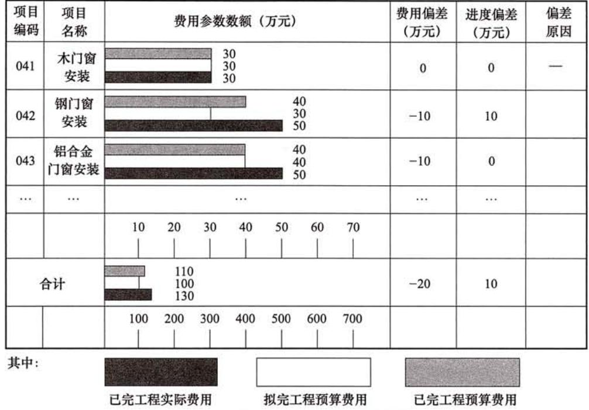

*图5.4-2施工成本偏差的横道图表示法*

*表5.4-1费用偏差分析表*

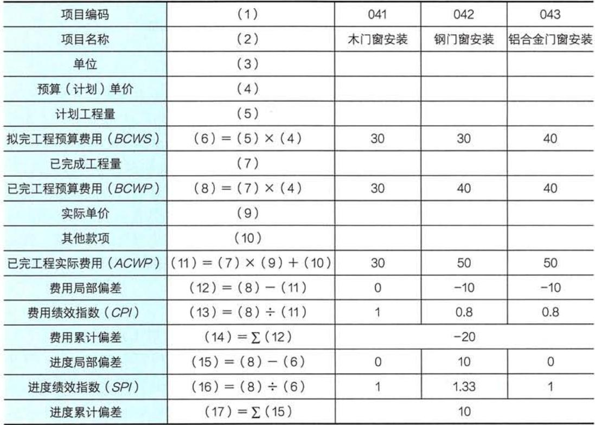

  （3）曲线法。在施工项目实施过程中，根据前述三个参数可以形成挣值分析曲线，即拟完工程预算费用（BCWS）、已完工程预算费用（BCWP）、已完工程实际费用  

  （ACWP）三条曲线，如图5.4-3所示。

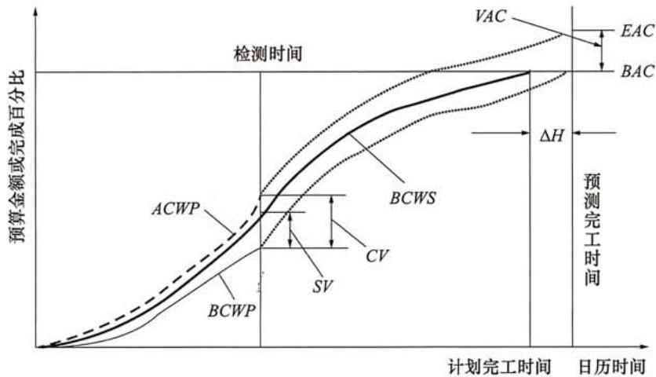

*图5.4-3挣值分析曲线*

  图5.4-3中： CV=BCWP-ACWP ，反映施工项目费用偏差； SV=BCWP-BCWS 反映施工项目进度偏差。采用挣值法时，还可预测项目结束时的进度、费用情况。  

  例如在图5.4-3中，项目完工预算（BAC，BudgetatCompletion）是指编制计划时预计的项目完工费用，预测的项目完工估算（ EAC ，EstimateatCompletion）则是指计划执行过程中根据当前进度、费用偏差情况预测的项目完工总费用。这样，便可预测项目完工时的费用偏差（VAC，VarianceatCompletion）。计算公式如下：

**4）施工成本偏差原因分析**

  在施工项目实施过程中，最理想的状态是已完工程实际费用（ACWP）、拟完工程预算费用（BCWS）、已完工程预算费用（BCWP）三条曲线靠得很近、平稳上升，表明施工项目按预定计划进行。如果三条曲线离散度不断增加，则可能出现较大的费用偏差。  

  偏差分析的一个重要目的就是要找出引起偏差的原因，从而采取有针对性的措施，减少或避免类似问题的再次发生。在进行偏差原因分析时，首先应将已经导致和可能导致偏差的原因逐一列举出来。不同工程项目产生费用偏差的原因具有一定共性，因而可通过对已建项目的费用偏差原因进行归纳总结，为该项目采取预防措施提供依据。偏差原因通常包括：法律法规、政策及标准变动原因，自然、社会原因，建设单位、设计单位原因，物价上涨原因，施工安排原因等。

**5）施工成本纠偏措施**

  施工成本纠偏措施通常可归纳为组织措施、技术措施、经济措施和合同措施。  

  （1）组织措施。如实行项目经理责任制，落实成本管理的组织机构和人员，明确各级成本管理人员的任务和职能分工、权利和责任。成本管理不仅是专业成本管理人员的工作，各级项目管理人员都负有成本控制责任。  

  组织措施的另一方面是编制成本管理工作计划、确定合理详细的工作流程。要做好施工采购计划，通过生产要素的优化配置、合理使用、动态管理，有效控制实际成本。组织措施是其他各类措施的前提和保障。  

  （2）技术措施。施工过程中降低成本的技术措施，包括：进行技术经济分析，确定最佳的施工方案；结合施工方法，进行材料使用的比选，在满足功能要求的前提下，通过代用、改变配合比、使用外加剂等方法降低材料消耗的费用；确定合适的施工机械、设备使用方案；结合项目的施工组织设计及自然地理条件，降低材料的库存成本和运输成本；应用先进的施工技术，运用新材料，使用先进的机械设备等。运用技术纠偏措施的关键，一是要能提出多个不同的技术方案，二是要对不同的技术方案进行技术经济分析比较，选择最佳方案。  

  （3）经济措施。对成本管理目标进行风险分析，并制定防范性对策。对各种支出，应做好资金的使用计划，并在施工中严格控制各项开支。及时准确地记录、收集、整理、核算实际支出的费用。对各种变更，应及时做好增减账、落实业主签证并结算工程款。通过偏差分析和未完工工程预测，可发现一些潜在的可能引起未完工程成本增加的问题，对这些问题应以主动控制为出发点，及时采取预防措施。因此，经济措施的运用绝不仅限于财务人员。  

  （4）合同措施。应仔细分析合同中的索赔条款，既要密切注视对方合同执行情况，以寻求合同索赔的机会；同时也要密切关注己方履行合同的情况，以防被对方索赔。一旦出现索赔事件，要认真审查索赔依据是否符合合同规定，索赔计算是否合理等，从主动控制角度，加强日常的合同管理，落实合同规定的责任。

### 5.5 施工成本分析与管理绩效考核

#### 5.5.1 施工成本分析

**1. 施工成本分析的内容和步骤**

**1）施工成本分析的依据**

  施工成本分析的依据包括：项目成本计划；成本核算资料；会计核算、统计核算和业务核算的资料。成本分析的主要依据是会计核算、业务核算和统计核算所提供的资料。  

  （1）会计核算。会计核算主要是价值核算。会计是对一定单位的经济业务进行计量、记录、分析和检查，作出预测、参与决策、实行监督，旨在实现最优经济效益的一种管理活动。它通过设置账户、复式记账、填制和审核凭证、登记账簿、成本计算、财产清查和编制会计报表等一系列有组织有系统的方法，来记录企业的一切生产经营活动，并据此提出一些用货币反映的有关各种综合性经济指标的数据，如资产、负债、所有者权益、收入、费用和利润等。由于会计记录具有连续性、系统性、综合性等特点，因此它是成本分析的重要依据。  

  （2）业务核算。业务核算是各业务部门根据业务工作的需要建立的核算制度，包括原始记录和计算登记表，如单位工程及分部分项工程进度登记，质量登记，工效、定额计算登记，物资消耗定额记录，测试记录等。业务核算的范围比会计、统计核算要广。会计和统计核算一般是对已经发生的经济活动进行核算，而业务核算不但可以核算已经完成的项目是否达到原定的目的、取得预期的效果，而且可以对尚未发生或正在发生的经济活动进行核算，以确定该项经济活动是否有经济效果，是否有执行的必要。它的特点是对个别的经济业务进行单项核算，例如各种技术措施、新工艺等项目。业务核算的目的在于迅速取得资料，以便在经济活动中及时采取措施进行调整。  

  （3）统计核算。统计核算是利用会计核算资料和业务核算资料，把企业生产经营活动客观现状的大量数据，按统计方法加以系统整理，以发现其规律性。它的计量尺度比会计宽，可以用货币计算，也可以用实物或劳动量计量。它通过全面调查和抽样调查等特有的方法，不仅能提供绝对数指标，还能提供相对数和平均数指标，可以计算当前的实际水平，还可以确定变动速度以预测发展的趋势。

**2）施工成本分析的内容**

  成本分析的内容包括：时间节点成本分析；工作任务分解单元成本分析；组织单元成本分析；单项指标成本分析；综合项目成本分析。

**3）施工成本分析的步骤**

  施工成本分析应遵循下列步骤： ① 选择成本分析方法； ② 收集成本信息； ③ 进行成本数据处理； ④ 分析成本形成原因； ⑤ 确定成本结果。

**2. 施工成本分析方法**

  由于施工成本涉及范围广，需要分析的内容多，因此，应在不同的情况下采取不同的分析方法。除基本的分析方法外，还有综合成本分析方法、成本项目分析方法和专项成本分析方法等。

**1）施工成本分析的基本方法**

  施工成本分析的基本方法包括比较法、因素分析法、差额计算法、比率法等。  

  （1）比较法。比较法又称“指标对比分析法”，是指对比技术经济指标，检查目标的完成情况，分析产生差异的原因，进而挖掘成本降低潜力的方法。这种方法通俗易懂、简单易行、便于掌握，因而得到了广泛的应用，但在应用时必须注意各技术经济指标的可比性。比较法的应用通常有以下三种形式。  

  ① 将实际指标与目标指标对比。以此检查目标完成情况，分析影响目标完成的积极因素和消极因素，以便及时采取措施，保证成本目标的实现。在进行实际指标与目标指标对比时，还应注意目标本身有无问题，如果目标本身出现问题，则应调整目标，重新评价实际工作。  

  ② 本期实际指标与上期实际指标对比。通过本期实际指标与上期实际指标对比，可以看出各项技术经济指标的变动情况，反映施工管理水平的提高程度。  

  ③ 与本行业平均水平、先进水平对比。通过对比，可以反映本项目的技术和经济管理水平与行业的平均及先进水平的差距，进而采取措施提高本项目管理水平。  

  以上三种对比，可以同时在一张表中反映。例如，某项目本年计划节约“三材”100000元，实际节约120000元，上年节约95000元，本企业先进水平节约130000元。根据上述资料编制的实际指标与计划指标上期指标、先进水平对比分析表见表5.5-1。

*表5.5-1实际指标与计划指标上期指标、先进水平对比分析表（单位：元）*

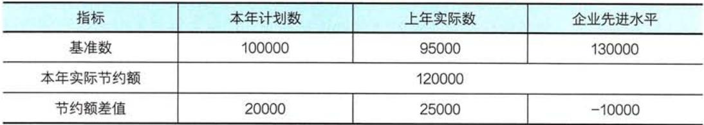

  （2）因素分析法。因素分析法又称为连环置换法，可用来分析各种因素对成本的影响程度。在分析时，假定众多因素中的一个因素发生了变化，而其他因素不变，然后逐个替换，并分别比较其计算结果，以确定各个因素的变化对成本的影响程度。因素分析法的计算步骤如下： ① 确定分析对象，计算实际与目标数的差异； ② 确定该指标是由哪几个因素组成的，并按其相互关系进行排序（排序规则是：先实物量，后价值量；先绝对值，后相对值）； ③ 以目标数为基础，将各因素的目标数相乘，作为分析替代的基数； ④ 将各个因素的实际数按照已确定的排列顺序进行替换计算，并将替换后的实际数保留下来； ⑤ 将每次替换计算所得的结果，与前一次的计算结果相比较，两者的差异即为该因素对成本的影响程度； ⑥ 各个因素的影响程度之和，应与分析对象的总差异相等。  

  （3）差额计算法。差额计算法是因素分析法的一种简化形式，它利用各个因素的目标值与实际值的差额计算其对成本的影响程度。  

  2.分析水泥用量变化的影响：  

  水泥实际用量 × 计划单价 =1100×300 元 =33 万元  

  水泥用量变化对成本的影响 =33-30=3 万元。表明由于水泥用量从1000t增加到1100t，使得成本增加3万元。  

  3.分析水泥单价变化的影响水泥实际用量 × 实际单价 =1100×320 元 =35.2 万元  

  水泥单价变化对成本的影响 =35.2-33=2.2 万元。表明由于水泥单价从每吨300元上涨到320元，使得成本增加2.2万元。  

  4.验证各因素影响程度之和是否等于分析对象  

  水泥用量变化影响 + 水泥单价变化影响 =3+2.2=5.2 万元，与分析对象（实际成本与计划成本的差异）相等，验证了分析的正确性。  

  也可以使用因素分析表计算各因素引起的成本差额，见表5.5-4。

*表5.5-4各个因素对成本增加的影响程度*

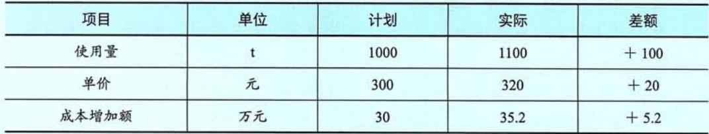

  （4）比率法。比率法是指用两个以上指标的比例进行分析的方法。比率法的基本特点是：先把对比分析的数值变成相对数，再观察其相互之间的关系。常用的比率法如下。  

  ① 相关比率法。由于项目经济活动的各个方面是相互联系、相互依存、相互影响的，因而可以将两个性质不同且相关的指标加以对比，求出比率，并以此来考察经营成果的好坏。例如：产值和工资是两个不同的概念，但它们是投入与产出的关系。在一般情况下，都希望以最少的工资支出完成最大的产值，因此，用产值工资率指标来考核人工费的支出水平，可以很好地分析人工成本。  

  ② 构成比率法。又称比重分析法或结构对比分析法。通过构成比率，可以考察成本总量的构成情况及各成本项目占总成本的比重，同时也可看出预算成本、实际成本和降低成本的比例关系，从而寻求降低成本的途径。成本构成比例分析表见表5.5-5。

*表5.5-5成本构成比例分析表（单位：万元）*

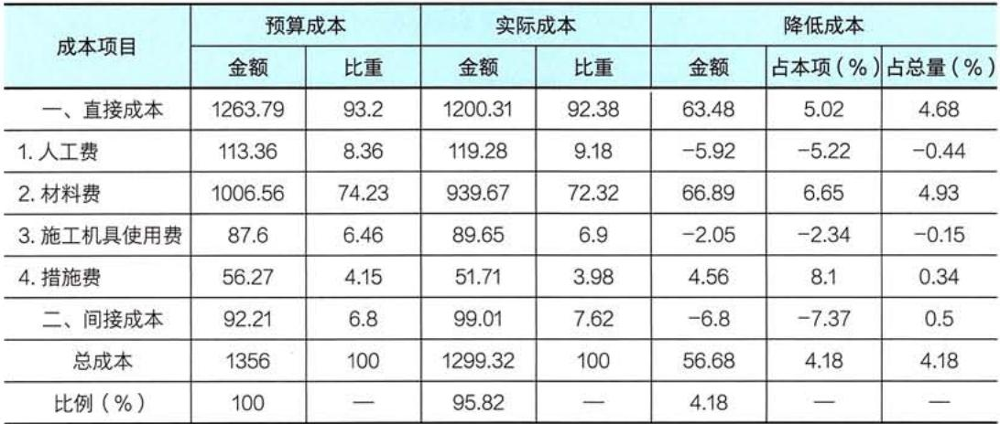

  ③ 动态比率法。动态比率法是将同类指标不同时期的数值进行对比，求出比率，以分析该项指标的发展方向和发展速度。动态比率的计算，通常采用基期指数和环比指数两种方法。成本指标动态比较表见表5.5-6。

*表5.5-6成本指标动态比较表*

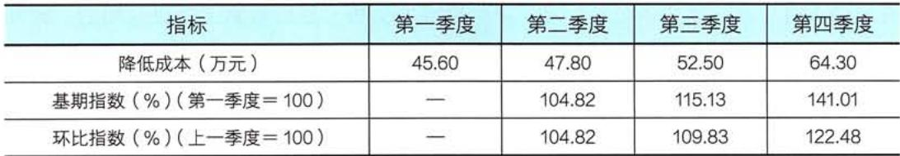

**2）综合成本分析方法**

  综合成本是指涉及多种生产要素，并受多种因素影响的成本费用，如分部分项工程成本、月（季）度成本、年度成本等。由于这些成本都是随着项目施工的进展而逐步形成的，与生产经营有着密切的关系。因此，做好这些成本的分析工作，无疑将促进项目的生产经营管理，提高项目的经济效益。  

  （1）分部分项工程成本分析。分部分项工程成本分析是施工项目成本分析的基础。  

  分部分项工程成本分析的对象为已完成分部分项工程，分析的方法是：进行预算成本、目标成本和实际成本的“三算”对比，分别计算实际偏差和目标偏差，分析偏差产生的原因，为今后的分部分项工程成本寻求节约途径。  

  分部分项工程成本分析的资料来源为：预算成本来自投标报价成本，目标成本来自施工预算，实际成本来自施工任务单的实际工程量、实耗人工和限额领料单的实耗材料。  

  由于施工项目包括很多分部分项工程，无法也没有必要对每一个分部分项工程都进行成本分析。特别是一些工程量小、成本费用少的零星工程。但是，对于主要分部分项工程必须进行成本分析，而且要做到从开工到竣工进行系统的成本分析。因为通过主要分部分项工程成本的系统分析，可以基本了解项目成本形成的全过程，为峻工成本分析和今后的项目成本管理提供参考资料。  

  分部分项工程成本分析表见表5.5-7。  

  单位工程：分部分项工程名称： 工程量： 施工班组： 施工日期：

*表5.5-7分部分项工程成本分析表*

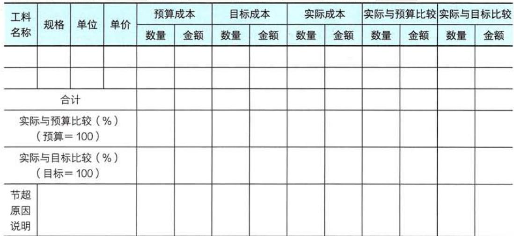

*编制单位： 成本员：*

*填表日期：*

  （2）月（季）度成本分析。月（季）度成本分析，是指对施工项目定期的、经常性的中间成本分析。这对于施工项目来说，具有特别重要的意义。通过月（季）度成本分析，可以及时发现问题，以便按照成本目标指定的方向进行监督和控制，保证项目成本目标的实现。  

  月（季）度成本分析的依据是当月（季）的成本报表，分析通常包括以下几个方面。  

  ① 通过实际成本与预算成本的对比，分析当月（季）的成本降低水平；通过累计实际成本与累计预算成本的对比，分析累计的成本降低水平，预测实现项目成本目标的前景。  

  ② 通过实际成本与目标成本的对比，分析目标成本的落实情况以及目标管理中的问题和不足，进而采取措施，加强成本管理，保证成本目标的实现。  

  ③ 通过对各成本项目的成本分析，可以了解成本总量的构成比例和成本管理的薄弱环节。例如：在成本分析中，若发现人工费、材料费、施工机具使用费等项目大幅度超支，则应该对这些费用的收支配比关系进行研究，并采取应对措施，防止今后再超支。如果是属于规定的“政策性”亏损，则应从控制支出着手，把超支额压缩到最低限度。  

  ④ 通过主要技术经济指标的实际与目标对比，分析产量、工期、质量、“三材”节约率、机械利用率等对成本的影响。  

  ⑤ 通过对技术组织措施执行效果的分析，寻求更加有效的节约途径。  

  ⑥ 分析其他有利条件和不利条件对成本的影响。  

  （3）年度成本分析。企业成本要求一年结算一次，不得将本年成本转人下一年度。而项目成本则以项目的建设周期为结算期，要求从开工到竣工直至保修期结束连续计算，最后结算出总成本及其盈亏。由于项目的施工周期一般较长，除进行月（季）度成本核算和分析外，还要进行年度成本的核算和分析。这不仅是企业汇编年度成本报表的需要，同时也是项目成本管理的需要，通过年度成本的综合分析，可以总结一年来成本管理的成绩和不足，为今后的成本管理提供经验和教训，从而可对项目成本进行更有效的管理。  

  年度成本分析的依据是年度成本报表。年度成本分析的内容，除了月（季）度成本分析的六个方面以外，重点是针对下一年度的施工进展情况制定切实可行的成本管理措施，以保证施工项目成本目标的实现。  

  （4）竣工成本综合分析。凡是包含几个单位工程且单独进行成本核算（即成本核算对象）的施工项目，其竣工成本分析应以各单位工程峻工成本分析资料为基础，再加上项目管理层的经营效益（如资金调度、对外分包等所产生的效益）进行综合分析。如果施工项目只有一个成本核算对象（单位工程），就以该成本核算对象的峻工成本资料作为成本分析的依据。  

  单位工程峻工成本分析，应包括以下三方面内容： ① 竣工成本分析； ② 主要资源节超对比分析； ③ 主要技术节约措施及经济效果分析。通过以上分析，可以全面了解单位工程的成本构成和降低成本的来源，为今后同类工程的成本管理提供参考。

**3）成本项目分析方法**

  （1）人工费分析。项目施工需要的人工和人工费，由项目管理机构与作业队签订专业作业分包合同，明确承包范围、承包金额和双方的权利、义务。除了按合同规定支付劳务费以外，还可能发生一些其他人工费支出，主要有： ① 因实物工程量增减而调整的人工和人工费； ② 定额人工以外的计日工工资（如果已按定额人工的一定比例由作业队包干，并已列入承包合同的，不再另行支付）； ③ 对在进度、质量、节约、文明施工等方面作出贡献的班组和个人进行奖励的费用。项目管理层应根据上述人工费的增减，结合专业作业分包合同的管理进行分析。  

  （2）材料费分析。材料费分析包括主要材料、结构件和周转材料使用费分析、采购保管费分析以及材料储备资金分析。  

  ① 主要材料、结构件费用的分析。主要材料和结构件费用的高低，主要受价格和消耗数量的影响。而材料价格的变动，受采购价格、运输费用、途中损耗、供应不足等因素的影响；材料消耗数量的变动，则受操作损耗、管理损耗和返工损失等因素的影响。因此，可在价格变动较大和数量超用异常的时候再作深入分析。为了分析材料价格和消耗数量的变化对材料和结构件费用的影响程度，可按下列公式计算：  

  因材料价格变动对材料费的影响 = （计划单价一实际单价） × 实际数量（5.5-1）  

  因消耗数量变动对材料费的影响 = （计划用量一实际用量） × 实际价格（5.5-2）  

  ② 周转材料使用费分析。在实行周转材料内部租赁制的情况下，项目周转材料费的节约或超支，取定于材料周转率和损耗率，周转减慢，则材料周转的时间变长，租赁费支出就增加；而超过规定的损耗，则要照价赔偿。  

  ③ 采购保管费分析。材料采购保管费属于材料的采购成本，包括：材料采购保管人员的工资、工资附加费、劳动保护费、办公费、差旅费，以及材料采购保管过程中发生的固定资产使用费、工具用具使用费、检验试验费、材料整理及零星运费和材料物资的盘亏及毁损等。材料采购保管费一般应与材料采购数量同步，即材料采购多，采购保管费也会相应增加，因此，应根据每月实际采购的材料数量（金额）和实际发生的材料采购保管费，分析保管费率的变化。  

  ④ 材料储备资金分析。材料的储备资金是根据日平均用量、材料单价和储备天数（即从采购到进场所需要的时间）计算的。上述任何一个因素变动，都会影响储备资金的占用量。材料储备资金的分析，可以应用“因素分析法”。材料采购人员应该选择运距短的供应单位，尽可能减少材料采购的中转环节，缩短储备天数。  

  （3）施工机具使用费分析。由于项目施工具有的一次性，项目管理机构不可能拥有自己的机械设备，而是随着施工的需要，向企业动力部门或外单位租用。机械设备租用存在两种情况：一是按产量进行承包，并按完成产量计算费用，如土方工程。项目管理机构只要按实际挖掘的土方工程量结算挖土费用，而不必考虑挖土机械的完好程度和利用程度。二是按使用时间（台班）计算机械费用，如塔式起重机、搅拌机、砂浆机等，如果机械完好率低或在使用中调度不当，会影响机械的利用率，从而延长使用时间，增加使用费，因此，项目管理机构应该给予重视。  

  由于工程施工的特点，在流水作业和工序搭接上往往会出现某些必然或偶然的施工间隙，影响机械的连续作业；有时，又因为加快施工进度和工种配合，需要机械日夜不停地运转，这样便造成机械综合利用效率不高，比如机械停工，则需要支付停班费。因此，在机械设备的使用过程中，应以满足施工需要为前提，加强机械设备的平衡调度，充分发挥机械的效用；同时，还要加强平时的机械设备的维修保养工作，提高机械的完好率，保证机械的正常运转。  

  （4）管理费分析。管理费分析也应通过预算（或计划）数与实际数的比较来进行。管理费预算（计划）与实际比较表见表5.5-8。

*表5.5-8管理费预算（计划）与实际比较表*

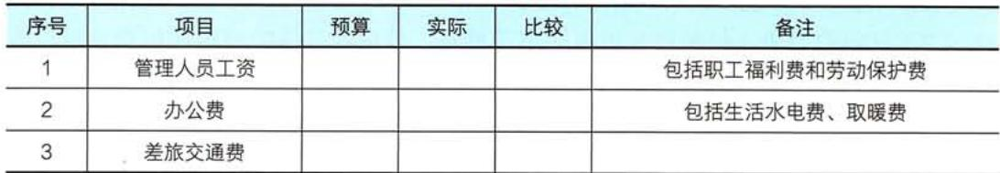

*续表*

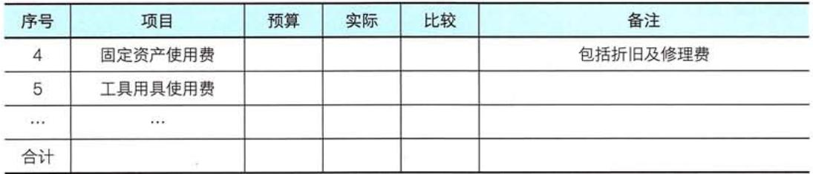

#### 5.5.2 施工成本管理绩效考核

  施工成本管理绩效考核是指在施工项目实施过程中或项目完成后，对各级单位施工成本管理的成绩或失误进行总结与评价，考核成本降低的实际成果和成本指标完成情况的过程。通过成本考核，给予责任者相应的奖励或惩罚。

**1. 施工成本管理绩效考核的内容**

  施工成本管理绩效考核应分层进行，包括企业对项目成本的考核、对项目管理机构可控责任成本的考核和项目经理对所属部门、施工队和班组的考核。施工单位应建立和健全工程项目成本考核制度，作为工程项目成本管理责任体系的组成部分。考核制度应对考核的目的、时间、范围、对象、方式、依据、指标、组织领导、评价与奖惩原则等作出明确规定。  

  （1）企业对项目成本的考核包括对施工成本目标（降低额）完成情况的考核和成本管理工作业绩的考核。  

  （2）企业对项目管理机构可控责任成本的考核包括： ① 项目成本目标和阶段成本目标完成情况； ② 建立以项目经理为核心的成本管理责任制的落实情况； ③ 成本计划的编制和落实情况； ④ 对各部门、各施工队和班组责任成本的检查和考核情况； ⑤ 在成本管理中贯彻责权利相结合原则的执行情况。

**2. 施工成本管理绩效考核指标**

**1）企业的项目成本考核指标**

  计算公式如下：  

  项目施工成本降低额 = 项目施工合同成本一项目实际施工成本项目施工成本降低率 = 项目施工成本降低额/项目施工合同成本 ×100%

**2）项目管理机构可控责任成本考核指标**

  （1）项目经理责任目标总成本降低额和降低率。计算公式如下：  

  目标总成本降低额 = 项目经理责任目标总成本一项目竣工结算总成本  

  目标总成本降低率 = 目标总成本降低额/项目经理责任目标总成本 ×100%  

  （2）施工责任目标成本实际降低额和降低率。计算公式如下：施工责任目标成本实际降低额 = 施工责任目标总成本一工程竣工结算总成本  

  施工责任目标成本实际降低率 ≡= 施工责任目标成本实际降低额/施工责任目标总成本 ×100%  

  （3）施工计划成本实际降低额和降低率。计算公式如下：  

  施工计划成本实际降低额 = 施工计划总成本一工程竣工结算总成本（5.5-9）施工计划成本实际降低率 = 施工计划成本实际降低额／施工计划总成本 ×100%

**3）项目经理对所属各部门、各施工队和班组的考核**

  （1）对各部门的考核内容：本部门、本岗位责任成本的完成情况；本部门、本岗位成本管理责任的执行情况。  

  （2）对各施工队的考核内容：对专业作业合同规定的承包范围和承包内容的执行情况；专业作业合同以外的补充收费情况；对班组施工任务单的管理情况，以及班组完成施工任务后的考核情况。  

  （3）对各班组的考核内容：以分部分项工程成本作为班组的责任成本，以施工任务单和限额领料单的结算资料为依据，与施工预算进行对比，考核班组责任成本完成情况。

**3. 施工成本管理绩效考核方法**

**1）关键绩效指标（KeyPerformanceIndicators，KPls）**

  通过设定关键绩效指标，可以衡量企业在成本管理方面的表现和达成特定目标的程度。这些指标可以是量化的指标，如成本控制率、成本偏差、资源利用效率等，也可以是质化的指标，如成本管理团队的能力、成本分析和预测能力、成本优化的创新能力等。KPIs的优点如下： ① 明确管理焦点。KPIs可以明确企业的成本管理目标，并使其专注于成本降低和控制。 ② 提高管理成效。KPIs通过可视化成本数据，可以帮助企业直观地了解成本的投入现状和识别不良的成本趋势，并进行持续优化。 ③ 提高考核客观性。KPIs多为量化指标考核，可以反映真实的成本管理水平。KPIs的缺点如下：① 指标难界定且缺乏弹性。运用专业化工具和手段才能设定量化指标，一旦设定则短期内无法更改。 ② 适用范围有限。KPIs不适用于难以以具体业绩和数据来考核的职能类部门，也不适用于周期过长的中高层考核。 ③ 实施困难。KPIs需要使用大量且复杂多样的成本管理数据，导致实施工作量大。总之，KPIs适用于需要定量化考核且考核周期短的企业，要求企业具有明确的成本管理目标、健全的成本管理流程、完备的成本控制体系，以及较强的数据收集和分析能力。

**2）360°反馈法**

  也称为“全视角反馈法”，通过收集来自不同角色和层级的反馈来考核个人的成本管理绩效，汇总上级、同级、下级和客户等多方提供的考核对象在成本管理方面的评价，并从工作能力、工作态度、执行力、心理素质和岗位胜任能力等各方面对考核对象进行考核。 360° 反馈法的优点如下： ① 提高考核准确性。 360° 反馈法涵盖了全方位、多角度的考核，能避免个人偏见等主观因素的影响，使考核结果更全面、公正。 ② 促进个体发展。 360° 反馈法可以使个体获得多角度的反馈和意见，激励个体提高自身全方位的素质和能力。 ③ 增强部门间合作。 360° 反馈法中部门员工相互监督、相互考评，促使员工日常要处理好各级关系，增强团队合作意识。 360° 反馈法的缺点如下： ① 考核时间和成本较高。 360° 反馈法需要对众多反馈源进行收集、处理和汇总，往往需要投入大量的时间和人力。 ② 考核标准不明确。 360° 反馈法多为定性指标，考核的主观性较强，容易沦为“人缘考核”，导致考核结果和实际表现不一致。 ③ 存在负面影响。360° 反馈法可能由于沟通不到位，导致企业中形成紧张和猜疑的气氛，影响员工的工作积极性和员工关系。总之， 360° 反馈法适用于需要定性化考核的企业，要求企业具有良好的团队文化、完善的考核指标体系以及较强的数据收集和分析能力，同时部门成员之间相互信任、尊重和共享。

**3）PDCA管理循环法**

  即计划（Plan）、实施（Do）、检查（Check）、处置（Action）。在计划阶段，企业基于施工成本管理的现状制定绩效考核方案；在实施阶段，企业实施绩效考核方案，并监督、指导和收集信息为下一阶段工作做准备；在检查阶段，企业检查绩效考核方案的执行情况是否符合计划的预期效果；在行动阶段，企业根据检查结果采取相应措施，进行经验总结，并将遗留问题转入下一个PDCA循环中去。PDCA管理循环法的优点如下：① 提高管理成效。PDCA管理循环法可以帮助企业制定明确的成本管理目标，并在成本管理周期中持续帮助企业根据施工成本现状制定优化策略。 ② 增强部门间协作。PDCA管理循环法鼓励企业各部门间协作，集体参与到成本管理过程中。PDCA管理循环法的缺点如下： ① 投入成本高。PDCA管理循环法需要企业制定详细的管理计划，并建立数据收集和分析系统，往往需要投入多方面的成本。 ② 过于强调计划性。如果计划不够理想或遇到计划外干扰，在成本管理过程中企业可能会遇到阶段性非常严重的问题。总之，PDCA管理循环法适用于需要周期性考核的企业，要求企业具有良好的团队合作精神和健全的成本管理流程。

**4）平衡积分卡**

  企业可以结合平衡积分卡的四个维度来设定适当的指标。 ① 财务绩效指标。如成本控制率、成本偏差和利润率等，以评估企业在成本管理方面的财务效果。 ② 客户满意度指标。如项目按预算完成情况和变更管理的效果等，以衡量客户对成本管理的满意程度。 ③ 内部流程效率指标。如成本核算流程的准确性、资源利用效率和成本控制流程的执行情况等。 ④ 学习与成长方面的指标。如成本分析和预测能力的发展、员工培训和知识管理等。平衡积分卡的优点如下： ① 提高考核准确性。平衡积分卡可以帮助企业从多个维度综合考核成本管理绩效，更全面地反映企业的整体情况。 ② 提高管理效率。平衡积分卡将战略目标分解为具体可测的绩效指标，并借助图表展示目标和指标，使考核结果更加直观易懂，更易于指导实际操作。 ③ 促进长期发展。平衡积分卡充分考虑了企业的长期效益，并通过四个维度与短期效益相结合，有助于企业长期发展。 ④ 激发个体积极性。平衡积分卡为员工提供了直观的激励机制，促进员工参与目标制定和完成任务的积极性。平衡积分卡的缺点如下： ① 实施难度大且缺乏弹性。平衡积分卡需要专业的团队基于多方面的考虑进行设计，一旦设定很难更改，并且在实施过程中涉及大量的数据收集和分析，一般企业很难进行操作。 ② 实施周期长。平衡积分卡基于企业战略目标设定，实施周期相对较长，短期内很难见到效果。总之，平衡积分卡适用于需要定量化考核且考核周期长的企业，要求企业具有明确的成本管理目标、健全的成本管理流程、先进的成本管理水平，以及较强的数据收集和分析能力。

**5）目标管理法（ManagementbyObjectives，MBO）**

  通过制定明确的施工成本目标来指导项目管理机构和个人的行为和绩效。在施工成本管理中，企业可以建立成本管理绩效指标体系，如成本控制率、成本偏差、成本效益指标等，通过定期评估成本管理绩效水平，及时了解施工成本目标达成情况，并提供反馈和改进建议。MBO的优点如下： ① 提高管理成效。MBO将企业的战略目标可视化和具体化，有助于绩效目标的制定、度量和分解。 ② 提高考核客观性。MBO采取一系列具体可量化的指标对成本管理绩效进行评估，并保证考核过程的透明化。 ③ 考核成本较低。MBO的目标是经过协商达成一致的目标，有利于树立员工的自我管理意识，降低管理成本。 ④ 激发个体积极性。MBO需要员工与领导者共同制定目标、共担责任、共享资源，促进了员工之间的沟通交流，也调动了员工的积极性和主动性。 ⑤ 增强部门协作。MBO需要员工和部门之间的交流，了解部门的绩效进度和个人的指标完成状态，促进企业内部的信息流通和团队合作。MBO的缺点如下： ① 目标设定难度大且协调成本高。MBO需要设定量化的目标，但目标的设定不仅面临内外变化的环境而且需要多方沟通协商达成一致，增加了目标设定的难度和沟通成本。 ② 缺乏过程管理。自我管理意识和能力弱的员工容易误解或在制定目标方面产生偏见，加上过程管控缺位，导致达不到目标或者达到的程度走偏。总之，MBO适用于需要定量化考核的企业，要求企业具有明确的成本管理目标、多部门的组织结构、人性化的企业文化，以及较强的数据收集和分析能力。

## 第6章 施工安全管理

### 6.1 职业健康安全管理体系

#### 6.1.1 职业健康安全管理体系标准

  职业健康安全管理体系是一种系统化的职业健康安全管理模式，该管理模式能够使组织的职业健康安全管理活动规范化和法制化。建立和实施职业健康安全管理体系，旨在使组织能够提供健康安全的工作场所，防止与工作相关的伤害和健康损害，并持续改进其职业健康安全绩效。我国等同采用国际标准《职业健康安全管理体系要求及使用指南》ISO45001：2018，于2020年发布了国家标准《职业健康安全管理体系要求及使用指南》GB/T45001—2020，作为组织建立、实施和保持职业健康安全管理体系的指南，同时为职业健康安全管理提供认证标准。

**1. 职业健康安全管理体系标准的特点**

**1）系统化管理机制**

  职业健康安全管理体系标准将职业健康安全管理作为一个系统工程，设计了系统化管理机制。系统化管理通过三个方面实现： ① 组织职责系统化。组织内每一层次员工均应为其所控制部分承担职业健康安全管理职责。 ② 风险管控系统化。强调应从组织内部和外部、人的行为和物的因素、研发和生产全过程等不同角度进行危险源辨识，将相关风险因素进行系统管控。 ③ 管理过程系统化。从危险源辨识、风险评价到风险应对、跟踪监视、评审和改进，均应建立、实施和保持相应的管控过程。

**2）法制化和规范化管理手段**

  职业健康安全管理体系标准始终强调法律法规要求和其他要求，保证了职业健康安全管理体系的法制化。同时，标准要求职业健康安全管理体系应采用程序化、文件化并可查询的管理手段，各部门、各层次相关人员的职业健康安全管理必须按体系文件的规定程序和要求实施，各部门和各层次之间还应保持协商和沟通。通过基于PDCA循环的运行模式，保证管理的规范化。

**3）广泛适用性**

  职业健康安全管理体系标准适用于任何规模、类型和活动的组织。组织是指为实现目标，由职责、权限和相互关系构成自身功能的一个人或一组人，包括但不限于个体  

  经营者、公司、集团、商行、企事业单位、行政管理机构、合伙制企业、慈善机构或社会机构，或者上述组织的某部分或其组合，无论是否为法人组织、公有或私有。  

  组织是否根据职业健康安全管理体系标准建立和保持职业健康安全管理体系，是否进行职业健康安全管理体系认证审核取决于组织自身意愿。

**4）与其他管理体系兼容**

  职业健康安全管理体系标准符合国际标准化组织（ISO）对管理体系标准的要求。这些要求包括一个统一的高层结构和相同的核心正文，以及具有核心定义的通用术语，从而保证职业健康安全管理体系的要素可与质量管理体系、环境管理体系等兼容或整合，方便标准使用者实施多个管理体系。

**5）应用灵活性**

  职业健康安全管理体系标准适用于组织控制下的职业健康安全风险，这些风险必须考虑到诸如组织运行所处环境、组织员工和其他相关方的需求和期望等因素。因此，职业健康安全管理体系标准只对方针、目标和管理体系要素做出要求，既不规定具体的职业健康安全绩效准则，也不提供职业健康安全管理体系的设计规范。此外，职业健康安全管理体系标准还可使组织能够借助其职业健康安全管理体系整合健康和安全的其他方面，如员工福利和（或）幸福等。

**6）强调预防为主和持续改进**

  职业健康安全管理体系标准突出强调了预防为主和持续改进的要求。职业健康安全管理体系标准要求按照风险管理思想，通过采用不同控制层级，建立、实施和保持用于消除危险源和降低职业健康安全风险的管控过程。同时，应通过适当方式持续改进职业健康安全管理体系的适宜性、充分性与有效性。

**2. 职业健康安全管理体系标准要素和作用**

**1）职业健康安全管理体系标准要素**

  职业健康安全管理体系标准的第 1∼3 章阐述了该标准的适用范围、规范性引用文件、术语和定义，第 4∼10 章明确了职业健康安全管理体系标准要求。  

  （1）组织所处的环境。基本要求如下：  

  ① 理解组织及其所处的环境。组织应确定与其宗旨相关并影响其实现职业健康安全管理体系预期结果的能力的内部和外部议题。  

  ② 理解员工和其他相关方的需求和期望。组织应确定除员工之外的、与职业健康安全管理体系有关的其他相关方；员工及其他相关方的有关需求和期望（即要求）；这些需求和期望中哪些是或将可能成为法律法规要求和其他要求。  

  ③ 确定职业健康安全管理体系范围。组织应界定职业健康安全管理体系的边界和适用性，以确定其范围。  

  ④ 职业健康安全管理体系。组织应按照职业健康安全管理体系标准的要求建立、实施、保持和持续改进职业健康安全管理体系，包括所需的过程及其相互作用。  

  （2）领导作用和员工参与。基本要求如下：  

  ① 领导作用与承诺。应明确最高管理者证实其在职业健康安全管理体系方面的领导作用和承诺的内容和方式。  

  ② 职业健康安全方针。最高管理者应建立、实施并保持职业健康安全方针，明确  

  职业健康安全方针的要求和内容。  

  ③ 组织的角色、职责和权限。最高管理者应确保将职业健康安全管理体系内相关角色的职责和权限分配到组织内各层次并予以沟通，且作为文件化信息予以保持。组织内每一层次的员工均应为其所控制部分承担职业健康安全管理体系方面的职责。  

  ④ 员工协商和参与。组织应建立、实施并保持协商和参与过程，用于在职业健康安全管理体系的开发、策划、实施、绩效评价和改进措施中与所有适用层次和职能的员工及其代表（若有）的协商和参与。  

  （3）策划。策划包括以下内容：  

  ① 应对风险和机遇的措施。在策划职业健康安全管理体系时，组织应考虑所处的环境所提及的议题、相关方所提及的要求和职业健康安全管理体系范围，并确定所需应对的风险和机遇。  

  A.危险源辨识及风险和机遇的评价。基本要求如下：  

  a.危险源辨识。组织应建立、实施和保持用于持续和主动的危险源辨识的过程，以及该过程必须考虑的要素。  

  b.职业健康安全风险和职业健康安全管理体系的其他风险评价。组织应建立、实施和保持风险评价过程，以评价来自于已辨识的危险源的职业健康安全风险，同时必须考虑现有控制的有效性；并确定和评价与建立、实施、运行和保持职业健康安全管理体系相关的其他风险。  

  c.职业健康安全机遇和职业健康安全管理体系的其他机遇评价。组织应建立、实施和保持过程，以评价职业健康安全机遇及其可能会给组织带来的其他机遇。  

  B.法律法规要求和其他要求的确定。组织应保持和保留有关法律法规要求和其他要求的文件化信息，并确保及时更新以反映任何变化。  

  C.措施的策划。组织应策划相关措施，以及如何在其职业健康安全管理体系过程中或其他业务过程中融入并实施这些措施，如何评价这些措施的有效性。  

  ② 职业健康安全目标及其实现的策划。基本要求如下：  

  A.职业健康安全目标。组织应在相关职能和层次上制定职业健康安全目标，以保持和持续改进职业健康安全管理体系和职业健康安全绩效。  

  B.实现职业健康安全目标的策划。组织应策划如何实现职业健康安全目标。  

  （4）支持。基本要求如下：  

  ① 资源。组织应确定并提供建立、实施、保持和持续改进职业健康安全管理体系所需的资源。  

  ② 能力。组织应确定影响或可能影响其职业健康安全绩效的员工所必须具备的能力；确保员工具备胜任工作的能力的方式；在适用时，采取措施以获得和保持所必需的能力，并评价所采取措施的有效性。  

  ③ 意识。明确员工应意识到的内容。  

  ④ 沟通。组织应建立、实施并保持与职业健康安全管理体系有关的内外部沟通所需的过程，包括确定沟通什么、何时沟通、与谁沟通、如何沟通。  

  A.内部沟通。组织应就职业健康安全管理体系的相关信息在其不同层次和职能之间进行内部沟通，适当时还包括职业健康安全管理体系的变更，并确保其沟通过程能够  

  使员工为持续改进做出贡献。  

  B.外部沟通。组织应按其所建立的沟通过程就职业健康安全管理体系的相关信息进行外部沟通，并必须考虑法律法规要求和其他要求。  

  ⑤ 文件化信息。组织的职业健康安全管理体系应包括职业健康安全管理体系标准要求的文件化信息，组织确定的实现职业健康安全管理体系有效性所必需的文件化信息。  

  A.创建和更新。创建和更新文件化信息时，组织应确保适当的标识和说明、形式与载体、评审和批准。B.文件化信息的控制。职业健康安全管理体系标准所要求的文件化信息应予以控制，以确保其可获得并适用，且得到充分的保护。  

  （5）运行。基本要求如下：  

  ① 运行策划和控制。为了满足职业健康安全管理体系要求和实施策划所确定的措施，组织应策划、实施、控制和保持所需的过程。  

  A.消除危险源和降低职业健康安全风险。组织应通过采用不同控制层级，建立、实施和保持用于消除危险源和降低职业健康安全风险的过程。  

  B.变更管理。组织应建立过程，用于实施和控制所策划的、影响职业健康安全绩效的临时性和永久性变更。  

  C.采购。组织应建立、实施和保持用于控制产品和服务采购的过程，以确保采购符合其职业健康安全管理体系。  

  a.承包方。组织应与承包方协调其采购过程，以辨识承包方相关的危险源并评价和控制职业健康安全风险。  

  b.外包。组织应确保外包的职能和过程得到控制。  

  ② 应急准备和响应。为了对策划中所识别的潜在紧急情况进行应急准备并做出响应，组织应建立、实施和保持所需的过程。  

  （6）绩效评价。基本要求如下：  

  ① 监视、测量、分析和评价绩效。组织应建立、实施和保持用于监视、测量、分析和评价绩效的过程；组织应建立、实施和保持用于对法律法规要求和其他要求的合规性进行评价的过程。  

  ② 内部审核。组织应按策划的时间间隔实施内部审核。组织还应明确内部审核方案的内容和要求。  

  ③ 管理评审。最高管理者应按策划的时间间隔对组织的职业健康安全管理体系进行评审，以确保其持续的适宜性、充分性和有效性。  

  （7）改进。组织应确定改进的机会，并实施必要的措施，以实现其职业健康安全管理体系的预期结果。  

  ① 事件、不符合和纠正措施。组织应建立、实施和保持包括报告、调查和采取措施在内的过程，以确定和管理事件和不符合，以及事件或不符合发生时，组织的应对措施。  

  ② 持续改进。组织应通过适当方式持续改进职业健康安全管理体系的适宜性、充分性与有效性。

**2）职业健康安全管理体系标准要素作用**

  职业健康安全管理体系标准的各要素在建立、实施和保持职业健康安全管理体系中发挥着不同作用。  

  （1）理解组织及其所处的环境是确定职业健康安全管理体系边界和适用范围的依据。  

  （2）明确组织结构和职责是建立和实施职业健康安全管理体系的组织前提。  

  （3）危险源辨识及风险和机遇评价、职业健康安全目标及其实现的策划是职业健康安全管理体系的基础。  

  （4）资源、能力、意识、沟通和文件化信息等的支持是职业健康安全管理体系建立和运行的条件。  

  （5）运行策划和控制是满足职业健康安全管理体系要求和实施职业健康安全管理措施的手段。  

  （6）监视、测量、分析和评价绩效以及事件或不符合发生时的纠正措施系统是实现职业健康安全管理体系预期目标和持续改进的保障。

**3. 职业健康安全管理体系标准采用的管理方法**

  职业健康安全管理体系标准所采用的管理方法是基于“策划一实施一检查一改进”（PDCA）循环的管理方法，可被组织用于持续改进。  

  1）策划（Plan）  

  确定和评价职业健康安全风险、职业健康安全机遇以及其他风险和其他机遇，制定职业健康安全目标并建立所需的过程，以实现与组织职业健康安全方针相一致的结果。  

  2）实施（Do）  

  实施所策划的过程。  

  3）检查（Check）  

  依据职业健康安全方针和目标，对活动和过程进行监视和测量，并报告结果。  

  4）改进（Act）  

  采取措施持续改进职业健康安全绩效，以实现预期结果。职业健康安全管理体系标准各要素与PDCA的对应关系如图6.1-1所示。

#### 6.1.2 职业健康安全管理体系的建立和运行

**1. 职业健康安全管理体系的建立**

  组织建立职业健康安全管理体系的步骤是：领导决策和承诺→成立工作小组，制定总体计划→体系建立前培训→进行初始（状态）评审→体系策划和设计→体系文件编写→体系试运行→体系评审完善。

**1）领导决策和承诺**

  组织实施职业健康安全管理体系是一项战略和经营活动，需要领导决策，同时最高管理者应通过适当方式，在以下方面证实其在职业健康安全管理体系方面的领导作用和承诺：  

  （1）对防止与工作相关的伤害和健康损害，以及提供健康安全的工作场所和活动全面负责并承担责任。

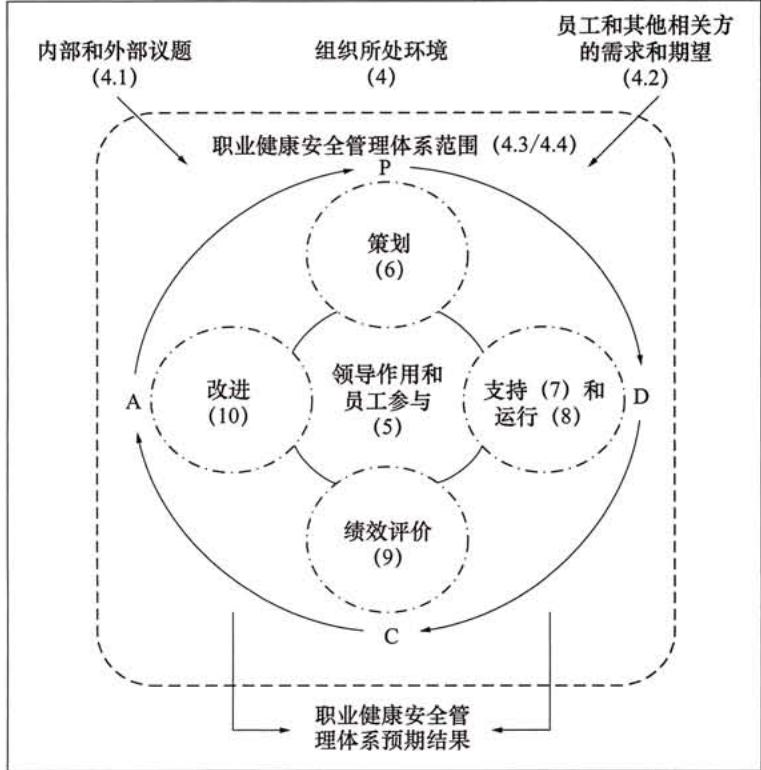

*图6.1-1职业健康安全管理体系标准各要素与PDCA的对应关系注：图中数字为职业健康安全管理体系标准中的章节号*

  （2）确保职业健康安全方针和相关职业健康安全目标得以建立，并与组织战略方向相一致。  

  （3）确保将职业健康安全管理体系要求融入组织业务过程中。（4）确保可获得建立、实施、保持和改进职业健康安全管理体系所需的资源。（5）就有效的职业健康安全管理和符合职业健康安全管理体系要求的重要性进行沟通。（6）确保职业健康安全管理体系实现其预期结果。（7）指导并支持人员为职业健康安全管理体系的有效性做出贡献。（8）确保并促进持续改进。（9）支持其他相关管理人员证实在其职责范围内的领导作用。（10）在组织内建立、引导和促进支持职业健康安全管理体系预期结果的文化。（11）保护员工不因报告事件、危险源、风险和机遇而遭受报复。（12）确保组织建立和实施员工协商和参与的过程。（13）支持健康安全委员会的建立和运行。

**2）成立工作小组，制定总体计划**

  组织最高管理者应任命健康安全管理者代表，并授权管理者代表建立专门的工作小组。管理者代表职责有：  

  （1）具体负责职业健康安全管理体系的日常工作，即按职业健康安全管理标准建立、实施和保持组织的职业健康安全管理体系。  

  （2）向最高管理者定期汇报职业健康安全管理体系的运行情况，供管理评审时使用。  

  （3）协调职业健康安全管理体系建立和运行过程中各部门之间的关系，为最高管理者的决策提供建议。  

  工作小组职责有：完成组织的职业健康安全初始（状态）评审及建立职业健康安全管理体系的各项任务。  

  工作小组成员应具备与组织有关的职业健康安全科学和技术知识和技能，宜由来自各部门的管理或技术骨干组成，同时还应接受有关职业健康安全管理体系标准方面的培训。  

  建立职业健康安全管理体系耗时较长，涉及面广，应先制定总体计划，明确目标和重点控制进程，具体可以采用倒排时间表的方法。总体计划批准后，再制定每项具体工作的分计划，提出资源需求，报送组织最高管理层批准。

**3）体系建立前培训**

  职业健康安全管理体系建立前培训分管理层培训、内审员（组织内部管理体系审核员，通常由既精通标准又熟悉本企业管理状况的人员担任）培训和全体员工培训。  

  （1）管理层培训的目的是统一思想，在推进职业健康安全管理体系建立工作中给予有力的支持和配合。培训内容主要是职业健康安全管理体系的基本要求、主要内容和特点，以及建立和实施职业健康安全管理体系的重要意义和作用。  

  （2）内审员培训的目的是确保他们具备开展初始（状态）评审、编写体系文件和进行审核等工作的能力，应根据组织活动职业健康安全管理特点配备人员。  

  （3）全体员工培训的目的是使他们了解职业健康安全管理体系，并在今后工作中能够积极主动地参与职业健康安全管理体系实践。

**4）进行初始（状态）评审**

  建立职业健康安全管理体系是组织将原有的职业健康安全管理按照职业健康安全管理体系的管理方法予以补充、完善及实施的过程。初始（状态）评审的主要目的是了解组织职业健康安全管理现状，评价其与职业健康安全管理标准要求的符合性，为组织建立职业健康安全管理体系搜集信息并提供依据，因而是建立职业健康安全管理体系的基础工作。初始（状态）评审的步骤和内容：  

  （1）准备工作。界定初始（状态）评审范围，明确工作小组成员分工和职责，制定评审计划。  

  （2）现状调查。收集组织过去和现在有关职业健康安全及其管理状况的资料与信息等。  

  （3）危险源辨识及风险评价。识别和评价组织活动、产品或服务过程中的危险源，特别是重大危险源及其风险。  

  （4）法律法规要求和其他要求适用性评价。明确适用的法律、法规及其他要求，并评价组织的职业健康安全行为与法律、法规及其他要求的符合性。  

  （5）现有职业健康安全管理有效性评价。依据现状调查结果、职业健康管理体系标准要求、危险源辨识及风险评价结论，分析、评价现有职业健康安全管理的可行性、有效性，找出管理体系要素在构成、运行、协调、监督中的缺陷。  

  （6）形成初始（状态）评审报告。初始评审最终应提交初评报告。  
  初始（状态）评审应形成文件，并作为建立职业健康安全管理体系的基础。

**5）体系策划和设计**

  根据初始（状态）评审结果，结合组织现有的资源（包括人力、财力和物力）及现有技术水平，进行职业健康安全管理体系的整体策划和设计。主要工作如下：  

  （1）制定职业健康安全方针。职业健康安全方针是由组织最高管理者正式表述的、为防止员工受到与工作相关的伤害和健康损害并提供健康安全的工作场所的组织意图和方向。职业健康安全方针的作用：是组织在职业健康安全领域的最高纲领和行动指南，是组织开展职业健康安全管理工作的准则，体现在组织各级管理的目标和计划中，以保持和改进职业健康安全绩效。制定职业健康安全方针的依据：职业健康安全管理体系初始评审结果、相关职业健康安全法律及法规等要求、组织经营战略方针、组织职业健康安全状况、组织活动的危险源及风险特点、组织规模、组织已做过的承诺。  

  （2）制定职业健康安全目标和管理方案。针对实现组织职业健康安全方针的需要，结合职业健康安全管理体系标准要求和初始（状态）评审结果，制定职业健康安全目标。组织职业健康安全目标要求：一要有针对性，即应明确要解决的职业健康安全问题及其效果；二要具体化，即能量化的指标尽可能量化，指标必须是可测量的；职业健康安全管理方案是职业健康安全目标和指标的实施方案，应依据组织所制定的目标和指标编制。管理方案的基本内容：组织机构和职责；配备实施职业健康安全管理方案的人力、物力及财力资源；确定实施职业健康安全管理方案的责任及其职责和权限；实施职业健康安全管理方案的财务预算，确保资金按计划到位；确定实施职业健康安全管理方案的时间进度表；建立职业健康安全管理方案的监督与管理制度。  

  （3）设计组织机构和职责。在分配管理职责和编写程序文件之前，必须先进行职能分析和设计组织机构。内容包括：调整原有管理体系的组织结构，使其适应职业健康安全管理体系标准中的管理需求；结合组织类型、规模及特点，设置管理体系运行的管理部门，由其负责管理体系的建立、实施、协调及监督管理，不断地发现管理体系运行中的问题，以便及时调整、改进；落实和完善实施职业健康安全管理体系的组织结构关系；将组织结构形成文件，使每个员工认识到自己工作中所承担的职业健康安全职责和义务，认识到履行其职业健康安全职责、遵守职业健康安全方针及执行职业健康安全管理程序是其工作的一个有机组成部分。  

  （4）确定职业健康安全管理体系文件结构和各层次文件清单。  

  （5）为建立和实施职业健康安全管理体系准备必要的资源。所需资源取决于：组织所处的环境（如员工数量、规模、地理位置、文化、法律法规要求和其他要求）；组织职业健康安全管理体系的范围；组织活动的性质和相关职业健康安全风险。

**6）体系文件编写**

  职业健康安全管理体系文件是组织为实现其职业健康安全目的，评价其职业健康安全管理体系绩效，达到持续改进的客观证据，同时为获得外部审核认证提供文字根据。  

  组织按照职业健康安全管理体系要求，对下列内容予以文件化：职业健康安全管理方针和目标（含指标），职业健康安全管理的关键岗位与职责，主要的职业健康安全  

  风险及其预防和控制措施，职业健康安全管理体系框架内的管理方案、程序、作业指导书和其他内部文件等，以确保所建立的职业健康安全管理体系在任何情况下（包括各级人员发生变动时）均能得到充分理解和有效运行。  

  组织建立职业健康安全管理体系时，应充分考虑其与质量管理体系、环境管理体系等并存的局面，进行机构调整、职责分配、相互协调及资源的合理配置，使各类管理体系之间既有相对独立性，又能互相协调，互相兼容。

**7）体系试运行**

  组织的各个部门和所有人员都应按照职业健康安全管理体系的要求开展相应活动，对职业健康安全管理体系进行试运行，以检验职业健康安全管理体系策划与文件化规定的充分性、有效性和适宜性。

**8）体系评审完善**

  通过对职业健康安全管理体系试运行的监视、测量、分析和绩效评价，检查与确认职业健康安全管理体系各要素是否按照计划安排有效运行，是否达到预期目标，并采取相应的改进措施，使所建立的职业健康安全管理体系得到进一步完善。

**2. 职业健康安全管理体系的运行**

  职业健康安全管理体系运行的基本步骤如下：

**1）管理体系文件培训**

  组织应对全体员工进行宣贯培训，不同人员的培训内容有所侧重。对于高层管理人员，应着重培训职业健康安全管理体系的原理、原则、功能及控制方法；中层管理人员应主要培训其部门体系要素的工作内容；普通员工应侧重培训支持性文件中涉及各自岗位的操作标准、规定、程序等内容。

**2）管理体系文件分发**

  职业健康安全管理体系文件是组织进行职业健康安全管理的具体准则，是按职业健康安全管理体系标准要求编制的具有可操作性的具体规范性文件，对组织内部各个岗位开展职业健康安全管理工作具有指导作用。职业健康安全管理体系文件具有针对性和层次性，组织内各个岗位都应有其主导性文件和相关性文件。要使组织的职业健康安全管理体系有效地运行，必须使必要的管理体系文件分发到位。

**3）管理方案实施**

  职业健康安全管理方案的有效实施是降低组织职业健康安全风险、实现持续改进的关键。要使管理方案中降低风险的措施真正落到实处，必须保证相应的资金、人员等到位，各部门及人员必须严格履行管理实施方案中规定的职责。组织应按照严密、协调、高效、精简、统一的原则，利用信息反馈系统对异常信息进行处理，对管理体系运行进行动态监控。运用管理体系的运行机制，在领导主持下对各部门进行组织协调，对出现的问题及时加以改进，完善并保证管理体系的持续正常运行。

**4）实施过程信息管理**

  所有与职业健康安全管理体系活动有关的人员都应按管理体系文件要求，做好职业健康安全信息的收集、分析、传递、反馈、处理和归档等工作。记录要完整、规范。当内部审核发现问题时，应从内部审核整改时进行修改，而不要将记录重新整理一遍。

**5）管理体系评审和维持**

  管理体系评审是管理体系实施方案的组成部分，也是管理体系维持有效的基础和重要工作，分为内部审核和管理评审。  

  （1）内部审核的目的是检查与确认管理体系各要素是否按照计划有效实施，对管理体系是否正常运行及是否达到规定的目标等所进行的系统、独立的检查和评价，是职业安全健康管理体系的一种自我保证手段。内部审核由管理者代表组织实施，由组织的内审员参与，必要时也可请外单位有审核资格的人员参加。内部审核可分为常规内审和追加内审两类。例行的常规内审一般每年一次。  

  （2）管理评审通过年度计划安排，一般每年进行一次，也可随着内外部条件的变化而及时进行管理评审。管理评审一般由总经理主持，各部门负责人和有关人员（如内审员等）参加。管理者代表应将职业健康安全管理体系现状及其变化趋势和提高研究的问题形成书面材料。评审会议对有关提案或问题做出明确决定。管理评审的内容包括：① 职业健康安全方针的持续有效性； ② 职业健康安全目标、指标的持续适宜性； ③ 职业健康安全目标、指标和职业健康安全绩效的实现程度； ④ 职业健康安全管理体系内部审核结果，内部审核报告提出的建议及纠正措施实施情况； ⑤ 风险控制措施的适宜性，职业健康安全事故中吸取的教训； ⑥ 相关方关注的问题，内、外部反馈的信息；⑦ 针对具体情况对职业健康安全方针、计划、手册及有关文件进行修订。

**6）职业健康安全管理体系改进**

  职业健康安全管理体系要体现持续改进的核心思想，需要做好以下工作：  

  （1）严格监测管理体系的运行情况。为保持职业健康安全管理体系正确、有效地运行，必须严格监测管理体系的运行情况，避免出现与职业健康安全管理体系标准不符合的现象。  

  （2）对不符合要及时采取有效的纠正和预防措施。在职业健康安全管理体系的运行过程中，不符合的出现是不可避免的，包括事故、事件也难免要发生，关键是相应的纠正与预防措施是否及时和有效，以保证今后不出现或少出现类似的不符合、事故、事件，保证职业健康安全管理体系的充分、有效运行。  

  （3）定期开展内部审核和管理评审。职业健康安全管理体系经过一段时期的运行后，在整体上是否正确运行，需要通过完整的内部审核来判定，通过管理评审确定职业健康安全管理体系是否需要进行改进和调整。  

  （4）实施PDCA循环管理，不断持续改进。组织在不断完成职业健康安全管理体系要素要求的同时，通过PDCA循环管理完成新的职业健康安全目标，从而使组织的职业健康安全状况得到进一步改进，实现持续改进的要求。

### 6.2 施工生产危险源与安全管理制度

#### 6.2.1 施工生产危险源及其控制

  危险源（也称危害因素、危害来源）是指可能导致伤害和健康损害的来源。伤害和健康损害是指对人的生理、心理或认知状况的不利影响，包括职业疾病、不健康和死亡。  

  职业健康安全管理体系中的危险源包括可能导致伤害或危险状态的来源，或可能因暴露而导致伤害和健康损害的环境，不包括仅对“物”或“财产”造成损害而不涉及对“人”的伤害和健康损害的危害因素。

**1. 危险源分类及其控制**

**1）危险源分类**

  施工生产危险源是指施工现场及施工生产过程中危险的根源、可能导致危险事件发生的状态或行为，或两者的组合。危险源可分为第一类危险源和第二类危险源。  

  （1）第一类危险源。第一类危险源是指施工现场或施工生产过程中存在的，可能发生意外释放能量（机械能、电能、势能、化学能、热能等）的根源，包括施工现场或施工生产过程中各种能量或危险物质。  

  ① 能量源：直接产生、供给能量的装置和设备，如变电站、锅炉；具有较高势能的装置、设备、场所，如起重／提升机械、高度差较大的场所；可能发生能量蓄积或突然释放的装置、设备、场所，如压力容器、受压设备、封闭的金属加工空间、炸药／化学物质储存空间等；运行或作业过程中拥有能量的人或物（能量载体），如带电导体、行驶中的车辆、作业中的施工机具。  

  ② 危险物质：一类是干扰人体与外界能量交换的有害物质，如一氧化碳、氮气；另一类是具有化学能的危险物质，分为可燃烧爆炸危险物质和有毒、有害危险物质两类，如炸药、氯气、苯、二氧化硫等。  

  第一类危险源具有的能量越多，一旦发生事故，其后果越严重，决定了事故后果的严重程度。  

  （2）第二类危险源。第二类危险源是指导致能量或危险物质约束或限制措施破坏或失效，以及防护措施缺乏或失效的因素，包括物的不安全状态（危险状态）、人的不安全行为、环境不良（环境不安全条件）及管理缺陷等因素。  

  ① 物的不安全状态，包括物的缺陷和物件堆放不当。物的缺陷是指设备（含施工机具、装置等）本身及其防护措施与安全装置、个人防护用品与用具由于性能低下甚至缺失而不能实现预定功能的现象。物的缺陷可能是由于设计、制造缺陷造成的，也可能由于维修、选用、使用不当，或磨损、腐蚀、老化等原因造成的。物件堆放不当包括堆放位置和堆放方式不当。物的不安全状态可能由人的不安全行为、环境不良和管理缺陷引起。  

  ② 人的不安全行为。人的不安全行为是指人的行为偏离被要求的标准，不能实现预计功能的现象。人的不安全行为包括各类违规操作、不安全移动（如攀爬）、违规进入危险区域、行为时注意力不集中等，会造成能量或危险物质控制系统故障，使隔离屏蔽系统破坏或失效，个人防护用品与用具失能，以及出现直接导致事故发生的不安全行为。  

  ③ 环境不良。环境不良是指人和物存在的环境不满足安全生产的要求。环境因素包括施工作业环境中的温度、湿度、噪声、振动、照明、风力风向、作业空间、安全距离、通风换气条件及空气质量等。  

  ④ 管理缺陷。管理缺陷会导致人的不安全行为和物的不安全状态出现。例如，采购管理不当导致个人防护用品安全性能不达标，维修管理不当导致安全装置失效，责任制度不明确和安全交底不清晰导致违章指挥、违规操作等。  

  第二类危险源出现越频繁，发生事故的可能性越大，其决定了事故发生的可能性。

**2）危险源控制**

  第一类危险源的存在是第二类危险源出现的前提，第二类危险源的出现是第一类危险源导致事故的必要条件。第一类危险源是固有的能量或危险物质，主要采用技术手段加以控制，包括消除能量源、约束或限制能量（针对生产过程不能完全消除的能量源）、屏蔽隔离、防护等技术手段，同时应落实应急预案的保障措施；第二类危险源主要通过管理手段加以控制，消除人的不安全行为、物的不安全状态，规避环境不良（不安全条件），包括建立健全危险源管理规章制度，做好危险源控制管理基础工作，明确责任，加强安全教育、危险源的日常管理，定期检查，做好危险源控制管理，实施考核评价和奖惩等。

**2. 施工生产常见危险源**

  施工生产危险源较多，管理缺陷、人的不安全行为、环境不良等均会导致施工安全事故发生。这里仅对施工中易发生的高处坠落、物体打击、坍塌倾覆、机械伤害、触电与火灾事故危险源进行说明。

**1）高处坠落事故危险源**

  距坠落高度基准面 2m 及以上的作业面为高处作业面，是可能发生人员高处坠落事故的危险源，主要部位和施工过程有：预留洞口，作业平台和作业面周边，通道与上下跑道两侧，物料提升设备及施工电梯进料口等部位，攀登作业、交叉作业、悬空作业等施工过程。主要危险因素有：作业面脚手板未满铺，未按规范要求设置水平防护和立面防护，或设置了防护但强度、刚度、高度不够或不严密，违规拆除或移动防护，高处悬空作业未系好安全带等。

**2）物体打击事故危险源**

  施工现场人员受到物体打击造成伤害事故来源于高处物体坠落及物体飞溅，主要危险部位和施工过程有：高处作业面层，高处作业通道，垂直运输过程，吊装工艺过程，立体交叉作业，爆破作业、倾覆坍塌和自然灾害引发物体坠落或飞溅等。主要危险因素有：高处作业面层工具、材料放置不当或无防坠落措施，作业人员违章高处抛物，垂直运输过程及吊装工艺过程捆绑不牢固，立体交叉作业中物件坠落，爆破作业、自然灾害引发物体坠落，上、下通道未设置防护棚，塔式起重机旋转半径范围内的作业场所无防护棚，高处作业面层未设置挡脚板，水平防护及立面防护不严密，作业人员违规进入限制区域，进人施工现场未戴安全帽等。按照《企业职工伤亡事故分类》GB6441—1986，物体打击不包括主体机械设备、车辆、起重机械、坍塌等引发的物体打击。

**3）坍塌倾覆事故危险源**

  常见的施工坍塌有施工基坑（槽）坍塌、边坡坍塌、基础桩壁坍塌、模板支撑系统坍塌及临时建筑（包括施工围墙）倒塌等。施工现场倾覆主要是大型机械设备失稳倾倒。坍塌倾覆事故除造成人身挤压伤害及室息外，还会连带造成高处坠落、物体打击等伤害。易发生坍塌倾覆事故的主要危险部位和施工过程有：基坑作业、边坡作业、人工挖孔桩施工、脚手架／防护架搭拆、模板工程搭拆、拆除工程施工、挡土墙施工、物料提升机、塔式起重机、滑模、接料平台、移动操作台等。主要危险因素有：危险性较大的分部分项工程无专项施工方案，土方施工未按规定放坡和支护，基坑/桩孔及边坡护壁未按设计施工，地下水未及时抽取或无降水措施，流砂／泥未及时有效防治，脚手架搭设无设计计算书，起重、吊装、滑模等装置/设备未经验收擅自投入使用，脚手架/防护架架体与建筑物未按规定拉结，未设置剪刀墙，支模架未经设计验算，无足够的强度、刚度、稳定性，拆除工程施工无方案，未按规定顺序拆除，违规进入危险区域，危险区域未设置警示标志、防护措施等。

**4）机械伤害事故危险源**

  机械伤害是机械设备运动（或静止状态）、机械设备部件、工具、加工件直接与人体接触引起的挤压、碰撞、冲击、剪切、卷入、绞绕、甩出、切割、切断、刺扎等伤害。主要危险源有：现场施工过程中的各类机具本体、防护设施/措施、违章/违规操作等，如塔式起重机、施工电梯、平刨机、电锯、钢筋加工机械、搅拌机、砂浆拌合机、场内运输工具等。主要危险因素有：大型机械设备基础不坚固引起倾覆；无资质安装、拆除、维保；机械作业人员无证上岗；各种限位保护装置失灵；机械传动部位无防护罩；起重作业信号不当，指挥不到位；钢丝绳未定期检查；作业人员酒后作业及其他违规违章等。按照《企业职工伤亡事故分类》GB6441—1986，机械伤害不包括车辆、起重机械引起的伤害。

**5）触电与火灾事故危险源**

  易发生触电事故的主要危险源有：施工现场涉及用电的机具、配电箱与开关箱、接地与接零保护系统、配电线路、外电防护、配电室与配电装置、现场照明、电杆及支架、用电防护设施、个人使用安全防护品、操作人员的技术熟练程度、操作行为。主要危险因素有：配电系统不符合规范，配电线路、绝缘保护不符合要求，操作人员技术熟练程度低，无证上岗，操作行为不规范，用电环境不达标，安全距离不满足，超负荷用电，防护设施不满足要求等。  

  易发生火灾事故的危险源有：易燃可燃材料库房、易燃可燃材料堆场、动火作业场所、变配电设备室、厨房、员工宿舍等，此外，各类用电不规范也是火灾事故的危险源。主要危险因素有：现场临时用房和作业场所的防火设计不符合规范要求，消防通道、消防水源的设置不符合规范要求，灭火器材布局、配置不合理或灭火器材失效，未编制住宿、施工现场火灾逃生、应急疏散预案，未组织进行火灾疏散、应急救援预案实战演练，未办理动火审批手续，动火现场周边有易燃易爆物品。

**3. 危险源辨识与风险评价方法**

  危险源辨识是为了找出施工生产危险源，评价其安全风险，预防危险源引发事故造成职业健康和安全伤害。在职业健康安全管理中，“危险源”由潜在危险性、存在条件和触发因素三个要件组成，缺一不可。危险源的潜在危险性是指一旦触发事故，可能带来的危害程度或损失大小，或者说危险源可能释放的能量强度或危险物质量的大小；存在条件是指危险源所处的物理、化学状态和约束条件状态；触发因素不属于危险源的固有属性，但它是危险源转化为事故的外因，而且每一类危险源都有相应的敏感触发因素，因此应作为危险源辨识的要素之一。例如，易燃气体瓶是一个危险源，安全阀是其约束条件，而明火可能是其触发因素。  

  以下是常见的危险源辨识与评价方法，有些方法侧重于危险源评价，有些方法侧重于危险源风险评价。

**1）安全检查表法**

  安全检查表法是指用检查表方式将一系列检查项目列出进行分析，以确定装置、设备、场所的状态以及操作和管理行为是否符合安全要求，通过检查发现系统中存在的安全隐患，提出改进措施的一种方法。检查项目可以包括场地、周边环境、设施、设备、操作、管理等各方面。

**2）预先危险性分析法**

  预先危险性分析法是指在每项生产活动之前，特别是在设计开始阶段，对识别和评价对象存在的危险类别、出现条件、事故后果等进行概略分析，尽可能找出潜在危险性的评价方法。预先危险性分析法也称初始危险性分析法，其原理是利用系统设计方案的相关设计图纸和资料，依据系统各组成部分的功能流程图及有关资料，预先对系统在预期寿命期内的试验、制造、储存、修理、使用等活动进行系统的安全评价。

**3）危险与可操作性分析法**

  该方法主要用于生产工艺流程分析，可借鉴用于施工生产危险源辨识和评价，其基本过程是以关键词为引导，预先识别、分析和评价工程项目、装置、设备潜在的危险，或通过监控找出工程项目、装置、设备运行过程或状态的变化（即偏差），然后再继续分析造成偏差的原因、后果及可采取对策的方法。

**4）事故树分析法**

  事故树分析从一个可能的事故开始，自下而上、一层层地寻找顶事件的直接原因事件和间接原因事件，直到基本原因事件，并用逻辑图将这些事件之间的逻辑关系表达出来的分析方法。实际发生安全生产事故后，施工安全事故分析报告所归纳的事故直接原因、间接原因及根本原因同样有助于危险源识别和评价。

**5）LEC评价法**

  LEC评价法侧重于风险评价，该方法用与风险有关的三种因素指标值的乘积来评价操作人员伤亡风险的大小。这三种因素分别是L（Likelihood，事故发生的可能性）、E（Exposure，人员暴露于危险环境中的频繁程度）和C（Consequence，一旦发生事故可能造成的后果）。给三种因素的不同等级分别确定不同的分值，再以三个分值的乘积D（Danger，危险性）来评价作业条件危险性的大小。

#### 6.2.2 施工安全管理制度

  安全生产工作应当以人为本，坚持人民至上、生命至上，把保护人民生命安全摆在首位，树牢安全发展理念，坚持“安全第一、预防为主、综合治理”的方针，从源头上防范化解重大安全风险。实行生产经营单位负责、职工参与、政府监管、行业自律和社会监督的机制。施工单位为强化和落实企业主体责任，必须遵守《中华人民共和国安全生产法》和其他有关安全生产的法律法规，加强安全生产管理，建立健全全员安全生产责任制和安全生产规章制度。《施工企业安全生产管理规范》GB50656—2011也规定了施工企业安全生产规章制度。

**1. 全员安全生产责任制**

  全员安全生产责任制是对单位各级各类岗位人员在安全生产方面的职责和应承担责任加以规定的一项制度。全员安全生产责任制是企业所有安全生产管理制度的核心，是企业最基本的安全管理制度，其他安全生产管理制度的建立、执行、修订完善，离不开各岗位相关责任的支持。

**1）全员安全生产责任制基本规定**

  （1）全员安全生产责任制应包括所有从业人员的安全生产责任，明确从主要负责人到一线从业人员（含劳务派遣人员、实习学生等）的安全生产责任、责任范围和考核标准。从人员安全生产责任角度看，要“横向到边、纵向到底”。纵向应包括从最高管理者、管理者代表到项目负责人、技术负责人、专职安全生产人员、专业管理岗位人员（施工员、质量员、材料员等）、班组长和各操作岗位等各级人员的安全生产职责；横向应包括单位所有职能部门（如技术、安全、环保、财务、人事、采购等）管理者和各岗位的安全生产职责，做到全员每个岗位都有明确的安全生产职责并与相应的职务、岗位匹配。  

  （2）全员安全生产责任制内容应包括：各岗位的责任人员（或各岗位从业人员的安全生产责任）、责任范围和考核标准。企业应当建立相应的机制，加强对全员安全生产责任制落实情况的监督考核，通过建立健全安全生产责任制管理考核制度和激励约束机制，对全员安全生产责任制落实情况进行考核管理，奖励主动落实、全面落实责任，惩处不落实责任、部分落实责任，不断激发全员参与安全生产工作的积极性和主动性，形成良好的安全文化氛围。  

  （3）企业应当制定安全技术操作规程，并纳入安全教育培训。  

  （4）企业全员安全生产责任制应长期公示。企业要在适当位置对全员安全生产责任制进行长期公示。公示内容主要包括：所有层级、所有岗位的安全生产责任、安全生产责任范围、安全生产责任考核标准等。  

  （5）加强企业全员安全生产责任制教育培训。企业要将全员安全生产责任制教育培训工作纳入安全生产年度培训计划，通过自行组织或委托具备安全培训条件的中介服务机构等实施。要通过教育培训，提升所有从业人员的安全技能，培养良好的安全习惯。要建立健全教育培训档案，如实记录安全生产教育和培训情况。

**2）企业主要负责人安全生产工作法定职责**

  根据《中华人民共和国安全生产法》，企业主要负责人是本单位安全生产第一责任人，对本单位的安全生产工作全面负责。其他负责人对职责范围内的安全生产工作负责。企业可以设置专职安全生产分管负责人，协助本单位主要负责人履行安全生产管理职责。主要负责人对本单位安全生产工作的法定职责有：  

  （1）建立健全并落实本单位全员安全生产责任制，加强安全生产标准化建设。  

  （2）组织制定并实施本单位安全生产规章制度和操作规程。  

  （3）组织制定并实施本单位安全生产教育和培训计划。  

  （4）保证本单位安全生产投入的有效实施。  

  （5）组织建立并落实安全风险分级管控和隐患排查治理双重预防工作机制，督促、检查本单位的安全生产工作，及时消除生产安全事故隐患。  

  （6）组织制定并实施本单位的生产安全事故应急救援预案。  

  （7）及时、如实报告生产安全事故。

**3）企业安全生产管理机构及安全生产管理人员法定职责**

  《建设工程安全生产管理条例》明确：施工单位应当设立安全生产管理机构，配备专职安全生产管理人员。《中华人民共和国安全生产法》规定的安全生产管理机构及安全生产管理人员的法定职责如下：  

  （1）组织或者参与拟订本单位安全生产规章制度、操作规程和生产安全事故应急救援预案。  

  （2）组织或者参与本单位安全生产教育和培训，如实记录安全生产教育和培训情况。  

  （3）组织开展危险源辨识和评估，督促落实本单位重大危险源的安全管理措施。  

  （4）组织或者参与本单位应急救援演练。  

  （5）检查本单位的安全生产状况，及时排查生产安全事故隐患，提出改进安全生产管理的建议。  

  （6）制止和纠正违章指挥、强令冒险作业、违反操作规程的行为。  

  （7）督促落实本单位安全生产整改措施。

**4）企业其他管理岗位人员安全生产职责**

  企业其他管理岗位应按照“管业务必须管安全”“管生产经营必须管安全”的要求，结合企业自身情况，明确安全生产责任、责任范围和考核标准，将安全生产责任作为企业岗位责任制和经济责任制度的重要组成部分。

**5）施工作业人员安全生产职责**

  施工作业人员安全生产职责主要有：  

  （1）在作业过程中，应当遵守安全施工的强制性标准、规章制度和操作规程，服从管理，正确佩戴和使用安全防护用具、规范操作机械设备等。（2）接受安全生产教育培训的义务，掌握必要的施工安全生产知识，熟悉有关的规章制度和安全操作规程，掌握本岗位安全操作技能。未经教育培训或者教育培训考核不合格的，不上岗作业。（3）履行施工安全事故报告义务。从业人员发现事故隐患或者其他不安全因素，应当立即向现场安全生产管理人员或者本单位负责人报告。

**2. 安全生产费用提取、管理和使用制度**

  企业应按照规定提取和使用安全生产费用，专门用于改善企业或项目安全生产条件。安全生产费用在成本中据实列支。企业应具备安全生产条件所必需的资金投入，由企业决策机构、主要负责人或者个人经营的投资人予以保证，并对由于安全生产所必需的资金投入不足导致的后果承担责任。

**1）企业安全生产费用管理基本要求**

  （1）企业应建立健全安全生产费用管理制度，明确企业安全生产费用提取和使用的程序、职责及权限，落实责任，确保按规定提取和使用企业安全生产费用。  

  （2）企业应加强安全生产费用管理，编制年度企业安全生产费用提取和使用计划，纳入企业财务预算，确保资金投入。  

  （3）企业提取的安全生产费用从成本（费用）中列支并专项核算。

**2）企业安全生产费用管理原则**

  （1）筹措有章。统筹发展和安全，依法落实企业安全生产投入主体责任，足额提取。  

  （2）支出有据。企业根据生产经营实际需要，据实开支符合规定的安全生产费用。  

  （3）管理有序。企业专项核算和归集安全生产费用，真实反映安全生产条件改善投入，不得挤占、挪用。  

  （4）监督有效。建立健全企业安全生产费用提取和使用的内外部监督机制，按规定开展信息披露和社会责任报告。

**3）企业安全生产费用提取**

  建设工程施工企业编制投标报价应包含并单列企业安全生产费用，竞标时不得删减。建设单位应在合同中单独约定并于工程开工日一个月内向承包单位支付至少 50% 企业安全生产费用。总包单位应在合同中单独约定并于分包工程开工日一个月内将至少50% 企业安全生产费用直接支付分包单位并监督使用，分包单位不再重复提取。工程竣工决算后结余的企业安全生产费用，应退回建设单位。  

  建设工程施工企业以建筑安装工程造价为依据，于月末按工程进度计算提取企业安全生产费用。提取标准为： ① 矿山工程 3.5% ； ② 铁路工程、房屋建筑工程、城市轨道交通工程 3% ； ③ 水利水电工程、电力工程 2.5% ； ④ 冶炼工程、机电安装工程、化工石油工程、通信工程 2% ； ⑤ 市政公用工程、港口与航道工程、公路工程 1.5% 。  

  企业安全生产费用出现赤字（即当年计提企业安全生产费用加上年初结余小于年度实际支出）的，应当于年末补提企业安全生产费用。企业按规定标准连续两年补提安全生产费用的，可以按照最近一年补提数提高提取标准。  

  企业安全生产费用月初结余达到上一年应计提金额三倍及以上的，自当月开始暂停提取企业安全生产费用，直至企业安全生产费用结余低于上一年应计提金额三倍时恢复提取。

**4）企业安全生产费用使用**

  建设工程施工企业安全生产费用应用于以下支出：  

  （1）完善、改造和维护安全防护设施设备支出（不含“三同时”要求初期投入的安全设施），包括施工现场临时用电系统、洞口或临边防护、高处作业或交叉作业防护、临时安全防护、支护及防治边坡滑坡、工程有害气体监测和通风、保障安全的机械设备、防火、防爆、防触电、防尘、防毒、防雷、防台风、防地质灾害等设施设备支出。  

  （2）应急救援技术装备、设施配置及维护保养支出，事故逃生和紧急避难设施设备的配置和应急救援队伍建设、应急预案制修订与应急演练支出。  

  （3）开展施工现场重大危险源检测、评估、监控支出，安全风险分级管控和事故隐患排查整改支出，工程项目安全生产信息化建设、运维和网络安全支出。  

  （4）安全生产检查、评估评价（不含新建、改建、扩建项目安全评价）、咨询和标准化建设支出。  

  （5）配备和更新现场作业人员安全防护用品支出。  

  （6）安全生产宣传、教育、培训和从业人员发现并报告事故隐患的奖励支出。  

  （7）安全生产适用的新技术、新标准、新工艺、新装备的推广应用支出。  

  （8）安全设施及特种设备检测检验、检定校准支出。  

  （9）安全生产责任保险支出。  

  （10）与安全生产直接相关的其他支出。  

  企业职工薪酬、福利不得从企业安全生产费用中支出。企业从业人员发现报告事故隐患的奖励支出，应从企业安全生产费用中列支。  

  企业安全生产费用年度结余资金结转下年度使用。

**3. 安全生产教育培训制度**

**1）教育培训目的、对象和管理要求**

  （1）目的：保证从业人员具备必要的安全生产知识，熟悉有关的安全生产规章制度和安全操作规程，掌握本岗位的安全操作技能，了解事故应急处理措施，知悉自身在安全生产方面的权利和义务。未经安全生产教育和培训合格的从业人员，不得上岗作业。  

  （2）对象：本单位全体从业人员及劳务派遣人员、实习学生。企业使用被派遣劳动者的，应将被派遣劳动者纳入本单位从业人员统一管理，对被派遣劳动者进行岗位安全操作规程和安全操作技能的教育和培训。劳务派遣单位应对被派遣劳动者进行必要的安全生产教育和培训；企业接收中等职业学校、高等学校学生实习的，应对实习学生进行相应的安全生产教育和培训，提供必要的劳动防护用品。学校应协助企业对实习学生进行安全生产教育和培训。  

  （3）管理要求：为保证安全生产培训教育效果，应将安全教育培训管理纳入企业管理组成部分。 ① 企业应将安全培训工作纳入本单位年度工作计划，保证本单位安全培训工作所需资金； ② 企业主要负责人负责组织制定并实施本单位安全培训计划；③ 企业应建立健全从业人员安全生产教育和培训档案，由企业安全生产管理机构及安全生产管理人员详细、准确记录培训的时间、内容、参加人员及考核结果等情况。

**2）企业主要负责人和安全生产管理人员安全培训**

  企业主要负责人和安全生产管理人员应接受安全培训，具备与所从事的生产经营活动相适应的安全生产知识和管理能力。企业主要负责人和安全生产管理人员初次安全培训时间不得少于32学时。每年再培训时间不得少于12学时。  

  （1）企业主要负责人安全培训应包括下列内容： ① 国家安全生产方针、政策和有关安全生产的法律、法规、规章及标准； ② 安全生产管理基本知识、安全生产技术、安全生产专业知识； ③ 重大危险源管理、重大事故防范、应急管理和救援组织及事故调查处理的有关规定； ④ 职业危害及其预防措施； ⑤ 国内外先进的安全生产管理经验； ⑥ 典型事故和应急救援案例分析； ⑦ 其他需要培训的内容。  

  （2）企业安全生产管理人员安全培训应包括下列内容： ① 国家安全生产方针、政策和有关安全生产的法律、法规、规章及标准； ② 安全生产管理、安全生产技术、职业卫生等知识； ③ 伤亡事故统计、报告及职业危害的调查处理方法； ④ 应急管理、应急预案编制以及应急处置的内容和要求； ⑤ 国内外先进的安全生产管理经验； ⑥ 典型事故和应急救援案例分析； ⑦ 其他需要培训的内容。

**3）从业人员上岗培训**

  施工企业其他从业人员，在上岗前必须经过企业、施工项目部、班组三级安全培训教育。企业应根据工作性质对其他从业人员进行安全培训，保证其具备本岗位安全操作、应急处置等知识和技能。企业新上岗的从业人员，岗前安全培训时间不得少于24学时。  

  （1）企业级岗前安全培训内容应包括： ① 本单位安全生产情况及安全生产基本知识； ② 本单位安全生产规章制度和劳动纪律； ③ 从业人员安全生产权利和义务； ④ 有关事故案例等。  

  （2）施工项目部级岗前安全培训内容应包括： ① 工作环境及危险因素； ② 所从事工种可能遭受的职业伤害和伤亡事故； ③ 所从事工种的安全职责、操作技能及强制性标准； ④ 自救互救、急救方法、疏散和现场紧急情况的处理； ⑤ 安全设备设施、个人防护用品的使用和维护； ⑥ 本项目安全生产状况及规章制度； ⑦ 预防事故和职业危害的措施及应注意的安全事项； ⑧ 有关事故案例； ⑨ 其他需要培训的内容。  

  （3）班组级岗前安全培训内容应包括： ① 岗位安全操作规程； ② 岗位之间工作衔接配合的安全与职业卫生事项； ③ 有关事故案例； ④ 其他需要培训的内容。  

  从业人员在本单位内调整工作岗位或离岗一年以上重新上岗时，应重新接受项目部和班组级的安全培训。

**4）其他安全生产教育培训**

  （1）企业采用新工艺、新技术、新材料或者使用新设备时，应对有关从业人员重新进行有针对性的安全培训。  

  （2）企业特种作业人员，必须按照国家有关法律、法规的规定接受专门的安全培训，经考核合格，取得特种作业操作资格证书后，方可上岗作业。  

  （3）施工单位的主要负责人、项目负责人、专职安全生产管理人员应经建设行政主管部门或者其他有关部门考核合格后方可任职。

**4. 安全生产许可制度**

  国家对建筑施工企业实行安全生产许可制度。企业未取得安全生产许可证的，不得从事生产活动。

**1）企业取得安全生产许可证的条件**

  建筑施工企业取得安全生产许可证，应具备下列安全生产条件：  

  （1）建立、健全安全生产责任制，制定完备的安全生产规章制度和操作规程。（2）保证本单位安全生产条件所需资金的投入。（3）设置安全生产管理机构，按照国家有关规定配备专职安全生产管理人员。（4）主要负责人、项目负责人、专职安全生产管理人员经住房和城乡建设主管部门或者其他有关部门考核合格。（5）特种作业人员经有关业务主管部门考核合格，取得特种作业操作资格证书。（6）管理人员和作业人员每年至少进行一次安全生产教育培训并考核合格。（7）依法参加工伤保险，依法为施工现场从事危险作业的人员办理意外伤害保险，  

  为从业人员交纳保险费。  

  （8）施工现场的办公、生活区及作业场所和安全防护用具、机械设备、施工机具及配件符合有关安全生产法律、法规、标准和规程的要求。  

  （9）有职业危害防治措施，并为作业人员配备符合国家标准或者行业标准的安全防护用具和安全防护服装。  

  （10）有对危险性较大的分部分项工程及施工现场易发生重大事故的部位、环节的预防、监控措施和应急预案。  

  （11）生产安全事故应急救援预案、应急救援组织或者应急救援人员，配备必要的应急救援器材、设备。  

  （12）法律、法规规定的其他条件。

**2）安全生产许可证管理**

  国务院住房和城乡建设主管部门负责对全国建筑施工企业安全生产许可证的颁发和管理工作进行监督指导。省、自治区、直辖市人民政府住房和城乡建设主管部门负责本行政区域内建筑施工企业安全生产许可证的颁发和管理工作。市、县人民政府住房和城乡建设主管部门负责本行政区域内建筑施工企业安全生产许可证的监督管理，并将监督检查中发现的企业违法行为及时报告安全生产许可证颁发管理机关。  

  建筑施工企业从事建筑施工活动前，应当向企业注册所在地省、自治区、直辖市人民政府住房和城乡建设主管部门申请领取安全生产许可证。  

  安全生产许可证的有效期为3年。安全生产许可证有效期满需要延期的，企业应当于期满前3个月向原安全生产许可证颁发管理机关办理延期手续。  

  企业在安全生产许可证有效期内，严格遵守有关安全生产的法律法规，未发生死亡事故的，安全生产许可证有效期届满时，经原安全生产许可证颁发管理机关同意，不再审查，安全生产许可证有效期延期3年。  

  建筑施工企业变更名称、地址、法定代表人等，应当在变更后10日内，到原安全生产许可证颁发管理机关办理安全生产许可证变更手续。  

  建筑施工企业破产、倒闭、撤销的，应当将安全生产许可证交回原安全生产许可证颁发管理机关予以注销。  

  建筑施工企业遗失安全生产许可证，应当立即向原安全生产许可证颁发管理机关报告，并在公众媒体上声明作废后，方可申请补办。

**5. 管理人员及特种作业人员持证上岗制度**

**1）管理人员持证上岗制度**

  施工单位主要负责人、项目负责人、专职安全生产管理人员应经建设行政主管部门或者其他有关部门考核合格后方可任职。施工单位应对管理人员和作业人员每年至少进行一次安全生产教育培训，其教育培训情况记入个人工作档案。安全生产教育培训考核不合格的人员，不得上岗。

**2）特种作业人员持证上岗制度**

  特种作业是指容易发生事故，对操作者本人、他人的安全健康及设备、设施的安全可能造成重大危害的作业。特种作业的范围由特种作业目录规定。依据《建设工程安全生产管理条例》，施工单位垂直运输机械作业人员、安装拆卸工、爆破作业人员、起重信号工、登高架设作业人员等特种作业人员，必须按照国家有关规定经过专门的安全作业培训，并取得特种作业操作资格证书后，方可上岗作业。  

  根据《特种作业人员安全技术培训考核管理规定》，特种作业人员应符合一定条件且必须经专门的安全技术培训并考核合格，取得《中华人民共和国特种作业操作证》（以下简称特种作业操作证）后，方可上岗作业。  

  特种作业人员应符合下列条件：  

  （1）年满18周岁，且不超过国家法定退休年龄。  

  （2）经社区或者县级以上医疗机构体检健康合格，并无妨碍从事相应特种作业的器质性心脏病、癫痫病、美尼尔氏症、眩晕症、症、震颤麻痹症、精神病、痴呆症及其他疾病和生理缺陷。  

  （3）具有初中及以上文化程度。  

  （4）具备必要的安全技术知识与技能。  

  （5）相应特种作业规定的其他条件。  

  特种作业人员应接受与其所从事的特种作业相应的安全技术理论培训和实际操作培训。已经取得职业高中、技工学校及中专以上学历的毕业生从事与其所学专业相应的特种作业，持学历证明经考核发证机关同意，可以免予相关专业的培训。跨省、自治区、直辖市从业的特种作业人员，可以在户籍所在地或者从业所在地参加培训。  

  特种作业操作证每3年复审1次。  

  特种作业人员在特种作业操作证有效期内，连续从事本工种10年以上，严格遵守有关安全生产法律法规的，经原考核发证机关或者从业所在地考核发证机关同意，特种作业操作证的复审时间可以延长至每6年1次。  

  特种作业操作证需要复审的，应在期满前60日内，由申请人或者申请人的用人单位向原考核发证机关或者从业所在地考核发证机关提出申请，并提交下列材料：  

  （1）社区或者县级以上医疗机构出具的健康证明。  

  （2）从事特种作业的情况。  

  （3）安全培训考试合格记录。  

  特种作业操作证有效期届满需要延期换证的，应按照规定申请延期复审。特种作业操作证申请复审或者延期复审前，特种作业人员应参加必要的安全培训并考试合格。安全培训时间不少于8个学时，主要培训法律、法规、标准、事故案例和有关新工艺、新技术、新装备等知识。

**6. 重大危险源管理制度**

  实施重大危险源管理的目的是有效监控施工现场重大危险源，加强事故的预警预防预控工作，降低事故率，保证建设工程正常进行。

**1）企业重大危险源管理总要求**

  （1）企业对重大危险源应登记建档，进行定期检测、评估、监控，并制定应急预案，告知从业人员和相关人员在紧急情况下应采取的应急措施。  

  （2）企业应按照国家有关规定将本单位重大危险源及有关安全措施、应急措施报有关地方人民政府应急管理部门和有关部门备案。有关地方人民政府应急管理部门和有关部门应通过相关信息系统实现信息共享。

**2）施工现场危险源管理**

  建设单位办理安全监督手续时，应如实申报拟建工程的重大危险源，并提交对拟建工程重大危险源的安全管理、监控和应急预案。  

  施工项目部应根据企业危险源，尤其是重大危险源管理制度，结合施工现场情况，开展危险源监控和管理。危险源监控和管理应遵循动态控制的原则。基本内容和要求如下：  

  （1）辨识施工现场危险源并及时更新。一般可从三个途径辨识和认定危险源：对照国家和行业标准、规范及强制性条文规定检查；依据施工安全检查标准规定进行检查；关注正在进行或将进行的危险性较大的分部分项工程施工。  

  （2）坚持危险源公示、告知制度。危险源公示内容：危险源名称、出现的时段、涉及的危险因素、控制措施、责任部门和责任人。应在施工现场入口显著位置和有危险源的作业点附近设置明显的安全警示标志，并对检查、检测、检验情况做好文字记录，建立档案。应向从业人员告知危险源及其防范措施。具体内容：作业场所和工作岗位存在的危险因素、防范措施、事故应急措施、危险岗位的操作规范/规程、违章操作的危害。危险源及其防范措施可以单独以书面（如手册）或告知牌形式告知，也可以结合安全技术交底工作实施告知。  

  （3）建立施工现场重大危险源辨识、登记、公示、控制管理体系，明确岗位责任和责任人，认真组织实施。  

  （4）对危险性较大的分部分项工程，施工前必须编制专项施工方案。专项施工方案除应有切实可行的安全技术措施外，还应包括监控措施、应急预案及紧急救护措施等内容。  

  （5）对存在重大危险的施工部位或施工环节，应按专项施工方案严格进行技术交底，并有书面记录和签字，确保作业人员清楚掌握施工方案和操作规程的技术要领。将重大危险源公示项目作为每天施工前对施工人员安全交底内容，提高作业人员防范能力，规范安全行为。  

  （6）对从事重大危险施工部位或施工环节的作业人员、特种作业人员进行登记造册，掌握作业队伍，采取有效措施在作业活动中对作业人员进行管理，控制并及时分析存在的不安全行为。  

  （7）保证用于重大危险源防护措施所需的费用及时划拨。将施工现场重大危险源的安全防护、文明施工措施费单独列支，保证专款专用。  

  （8）为从业人员提供符合国家标准、行业标准的劳动防护用品，并监督、教育从业人员按照使用规则佩戴、使用。  

  （9）建立重大危险源施工档案，每周组织有关人员对施工现场的重大危险源进行安全检查，并做好施工安全检查记录。

**7. 劳动保护用品使用管理制度**

  为保障施工作业人员安全与健康，施工单位必须为作业人员提供劳动保护用品，包括从事建筑施工活动的人员使用的安全帽、安全带、安全（绝缘）鞋、防护眼镜、防护手套、防尘（毒）口罩等。  

  （1）劳动保护用品的发放和管理，坚持“谁用工，谁负责”的原则。施工作业人员所在企业（包括总承包企业、专业承包企业、劳务企业等）必须按国家规定免费发放劳动保护用品，更换已损坏或已到使用期限的劳动保护用品，不得收取或变相收取任何费用。  

  （2）劳动保护用品必须以实物形式发放，不得以货币或其他物品替代。  

  （3）企业应建立完善劳动保护用品的采购、验收、保管、发放、使用、更换、报废等规章制度。同时，应建立相应的管理台账，管理台账保存期限不得少于两年，以保证劳动保护用品的质量具有可追溯性。  

  （4）企业采购个人使用的安全帽、安全带及其他劳动防护用品等，必须符合《头部防护安全帽》GB2811—2019、《坠落防护安全带》GB6095—2021及其他劳动保护用品相关国家标准的要求。  

  （5）企业、施工作业人员，不得采购和使用无安全标记或不符合国家相关标准要求的劳动保护用品。  

  （6）企业应按照劳动保护用品采购管理制度的要求，明确企业内部有关部门、人员的采购管理职责。  

  （7）企业采购劳动保护用品时，应查验劳动保护用品生产厂家或供货商的生产、经营资格，验明商品合格证明和商品标识，以确保采购劳动保护用品的质量符合安全使用要求。  

  （8）企业应向劳动保护用品生产厂家或供货商索要法定检验机构出具的检验报告或由供货商签字盖章的检验报告复印件，不能提供检验报告或检验报告复印件的劳动保护用品不得采购。  

  （9）企业应加强对施工作业人员的教育培训，保证施工作业人员能正确使用劳动保护用品。施工项目部应有教育培训的记录，有培训人员和被培训人员的签名和时间。  

  （10）企业应加强对施工作业人员劳动保护用品使用情况的检查，并对施工作业人员劳动保护用品的质量和正确使用负责。实行施工总承包的，施工总承包企业应加强对施工现场内所有施工作业人员劳动保护用品的监督检查，督促相关分包企业和人员正确使用劳动保护用品。

**8. 安全生产检查制度**

  安全生产检查是发现和消除事故隐患、落实安全措施、预防事故发生的重要手段。

**1）安全生产检查的目的**

  通过安全生产检查，应达到以下目的：  

  （1）利用安全生产检查，宣传、贯彻、落实安全生产方针、政策、规范标准和各  
  项安全生产规章制度。（2）增强从业人员安全意识，纠正违章指挥、违章作业，提高安全生产的自觉性  
  和责任感。（3）发现施工中的职业健康安全隐患，制定对策，采取对策，消除不安全因素，保  
  障安全生产。（4）总结经验，汲取教训，相互学习，取长补短，促进安全生产。（5）分析安全生产形势，为加强安全生产管理提供信息和依据。

**2）安全生产检查管理的要求**

  （1）安全生产检查管理应包括安全检查的内容、形式、类型、标准、方法、频次、  

  整改、复查等工作内容。  

  （2）施工企业安全生产检查应配备必要的检查、测试器具，对存在的问题和隐患，应定人、定时间、定措施组织整改，并应跟踪复查直至整改完毕。  

  （3）施工企业对安全检查中发现的问题，宜按隐患类别分类记录，定期统计，并应分析确定多发和重大隐患类别，制定实施治理措施。  

  （4）施工企业应建立并保存安全生产检查资料和记录。

**3）安全生产检查的内容**

  施工企业安全生产检查应包括下列内容：  

  （1）安全管理目标的实现程度。  
  （2）安全生产职责的履行情况。  
  （3）各项安全生产管理制度的执行情况。  
  （4）施工现场管理行为和实物状况。  
  （5）生产安全事故、未遂事故和其他违规违法事件的报告调查、处理情况。  
  （6）安全生产法律法规、标准规范和其他要求的执行情况。

**4）安全生产检查的形式**

  施工企业安全检查的形式应包括各管理层的自查、互查及对下级管理层的抽查等；安全检查的类型应包括日常巡查、专项检查、季节性检查、定期检查、不定期抽查等，并应符合下列要求：  

  （1）工程项目部每天应结合施工动态，实行安全巡查。（2）总承包工程项目部应组织各分包单位每周进行安全检查。（3）施工企业每月应对工程项目施工现场安全生产情况至少进行一次检查，并应针对检查中发现的倾向性问题、安全生产状况较差的工程项目，组织专项检查。（4）施工企业应针对承建工程所在地区的气候和环境特点，组织季节性安全生产检查。  

  根据《中华人民共和国安全生产法》，应急管理部门和其他负有安全生产监督管理职责的部门依法开展安全生产行政执法工作，对生产经营单位执行有关安全生产的法律、法规和国家标准或者行业标准的情况进行监督检查。生产经营单位对负有安全生产监督管理职责的部门的监督检查人员依法履行监督检查职责，应当予以配合，不得拒绝、阻挠。

**9. 安全生产会议制度**

  安全生产会议制度是日常安全管理的重要手段，施工项目应制定相应会议制度，对会议类型、频次、组织职责、程序、会议纪要及会议议题落实等做出规定。施工项目安全生产会议包括定期安全生产例会和不定期安全生产会议、班前会议。

**1）定期安全生产例会**

  （1）月度安全生产例会。施工项目部每月召开一次月度安全生产分析会议，由项目经理组织，可以与月度生产计划会议合并进行，总结、部署月度安全工作，研究决策安全生产中的重大问题。对当月的安全生产情况进行分析、总结和评估，对次月的安全生产工作进行安排、部署，确定安全防范重点。月度安全生产例会要有会议纪要、会议记录、签到表、上次会议决定事项的处理落实材料。  

  （2）周安全生产例会。项目经理部每周组织召开一次安全生产例会，组织对本项目的安全生产工作进行检查，制定对事故隐患的整改措施，并落实整改。

**2）不定期安全生产会议**

  （1）安全生产技术交底会。根据施工生产进展情况和需要，对重大安全生产保障措施进行安全生产技术交底。  

  （2）安全生产专题会。针对安全生产和特殊季节安全防范的需要，适时召开安全生产专题会议。  

  （3）安全生产事故分析会。根据事故发生情况，及时召开安全生产事故分析会，教育事故单位，警示其他单位等，防止类似事故的再次发生。  

  （4）安全生产现场会。根据工作需要，结合各类评比活动，适时召开安全生产现场会，达到树立典型、推动后进，共同提高安全生产管理工作水平。

**3）班前会议**

  班前会议应坚持“安全第一、预防为主、综合治理”的方针。班前会议由班组长组织和主持。班前会议结合工作安排和安全技术交底进行。在班组长的组织下，进行交接班，召开班前安全会议，由班组长安排工作任务，针对工程施工情况、作业环境、作业项目，交代安全施工要点。全体组员要在穿戴好劳动保护用品后，上岗交接班，熟悉上一班生产管理情况，检查设备和工况完好情况，按作业计划做好生产的一切准备工作。

**4）现场安全生产会议管理**

  要明确会议的严肃性，按时按需召开。每次会议应目标明确，有实质内容。要严格按照分工和层次进行组织，达到预期的目的和效果。要做好会议签到和会议记录，并作为安全管理的考核指标。项目经理及其他项目管理人员应分头定期不定期地检查或参加班组班前安全活动会议，以监督其执行或提高安全活动会议的质量。项目专职安全生产管理员应不定期地抽查班组班前安全活动记录，看是否有漏记，对记录质量状况进行检查。重要的会议纪要，应上报公司备案。

**10. 施工设施、设备和劳动防护用品安全管理制度**

  （1）施工企业施工设施、设备和劳动防护用品的安全管理应包括购置、租赁、装拆、验收、检测、使用、保养、维修、改造和报废等内容。  

  （2）施工企业应根据安全管理目标，生产经营特点、规模、环境等，配备符合安全生产要求的施工设施、设备、劳动防护用品及相关的安全检测器具。  

  （3）生产经营活动内容可能包含机械设备的施工企业，应按规定设置相应的设备管理机构或者配备专职的人员进行设备管理。  

  （4）施工企业应建立并保存施工设施、设备、劳动防护用品及相关的安全检测器具管理档案，并应记录下列内容： ① 来源、类型、数量、技术性能、使用年限等静态管理信息，以及目前使用地点、使用状态、使用责任人、检测、日常维修保养等动态管理信息； ② 采购、租赁、改造、报废计划及实施情况。  

  （5）施工企业应定期分析施工设施、设备、劳动防护用品及相关的安全检测器具的安全状态，并采取必要的改进措施。  

  （6）施工企业应自行设计或优先选用标准化、定型化、工具化的安全防护设施。  

  劳动防护用品是保障劳动者安全与健康的辅助性、预防性措施，不能以劳动防护用品替代工程防护设施和其他技术、管理措施。用人单位使用的劳务派遣工、接纳的实习学生应当纳入本单位人员统一管理，并配备相应的劳动防护用品。对处于作业地点的其他外来人员，必须按照与进行作业的劳动者相同的标准，正确佩戴和使用劳动防护用品。

**11. 安全生产考核和奖惩制度**

  （1）施工企业安全生产考核和奖惩管理应包括确定对象、制定内容及标准、实施奖惩等内容。  

  （2）安全生产考核的对象应包括施工企业各管理层的主要负责人、相关职能部门及岗位和工程项目参建人员。  

  （3）企业各管理层的主要负责人应组织对本管理层各职能部门、下级管理层的安全生产责任进行考核和奖惩。施工企业安全生产管理机构承担考核评价分包企业安全生产业绩及项目安全生产管理情况的职责。  

  （4）安全生产考核应包括下列内容： ① 安全目标实现程度； ② 安全职责履行情况；③ 安全行为； ④ 安全业绩； ⑤ 施工企业应针对生产经营规模和管理状况，明确安全生产考核的周期，并应及时兑现奖惩。  

  施工安全管理基本制度通常还包括：安全技术交底制度、应急预案管理和演练制度、生产安全事故报告和调查处理制度、安全责任追究制度等。

### 6.3 专项施工方案及施工安全技术管理

#### 6.3.1 专项施工方案编制与报审

**1. 专项施工方案编制对象**

  《建设工程安全生产管理条例》规定，对下列达到一定规模的危险性较大的分部分项工程，施工单位应编制专项施工方案，并附具安全验算结果，经施工单位技术负责人、总监理工程师签字后实施，由专职安全生产管理人员进行现场监督： ① 基坑支护与降水工程； ② 土方开挖工程； ③ 模板工程； ④ 起重吊装工程； ⑤ 脚手架工程；⑥ 拆除、爆破工程； ⑦ 国务院建设行政主管部门或者其他有关部门规定的其他危险性较大的工程。  

  上述工程中涉及深基坑、地下暗挖工程、高大模板工程的专项施工方案，施工单位还应当组织专家进行论证、审查。

**2. 专项施工方案内容**

  专项施工方案的主要内容应包括：  

  （1）工程概况。包括危险性较大的分部分项工程概况和特点、施工平面布置、施工要求和技术保证条件。  

  （2）编制依据。包括相关法律、法规、规范性文件、标准、规范及施工图设计文件、施工组织设计等。  

  （3）施工计划。包括施工进度计划、材料与设备计划。  

  （4）施工工艺技术。包括技术参数、工艺流程、施工方法、操作要求、检查要  

  求等。  

  （5）施工安全保证措施。包括组织保障措施、技术措施、监测监控措施等。  

  （6）施工管理及作业人员配备和分工。包括施工管理人员、专职安全生产管理人员、特种作业人员、其他作业人员等。  

  （7）验收要求。包括验收标准、验收程序、验收内容、验收人员等。  

  （8）应急处置措施。  

  （9）计算书及相关施工图纸。

**3. 专项施工方案编制和审查程序**

  （1）专项施工方案编制。施工单位应在危险性较大的分部分项工程施工前，组织工程技术人员编制专项施工方案。  

  实行施工总承包的，专项施工方案应由施工总承包单位组织编制。危险性较大的分部分项工程实行分包的，专项施工方案可由相关专业分包单位组织编制。  

  （2）专项施工方案专家论证。对于超过一定规模的危险性较大的分部分项工程，施工单位应组织召开专家论证会对专项施工方案进行论证。实行施工总承包的，由施工总承包单位组织召开专家论证会。专家论证的主要内容应包括： ① 专项施工方案内容是否完整、可行； ② 专项施工方案计算书和验算依据、施工图是否符合有关标准规范；③ 专项施工方案是否满足现场实际情况，并能够确保施工安全。  

  专家论证会后，应形成论证报告，对专项施工方案提出通过、修改后通过或者不通过的一致意见。专家对论证报告负责并签字确认。  

  超过一定规模的危险性较大的分部分项工程专项施工方案经专家论证后结论为“通过”的，施工单位可参考专家意见自行修改完善；结论为“修改后通过”的，专家意见要明确具体修改内容，施工单位应按照专家意见进行修改，修改情况应及时告知专家；专项施工方案经论证不通过的，施工单位修改后应按照规定的要求重新组织专家论证。  

  （3）专项施工方案的审批。专项施工方案应由施工单位技术负责人审核签字、加盖单位公章，并由总监理工程师审查签字、加盖执业印章后方可实施。  

  危险性较大的分部分项工程实行分包并由分包单位编制专项施工方案的，专项施工方案应由总承包单位技术负责人及分包单位技术负责人共同审核签字并加盖单位公章。

#### 6.3.2 施工安全技术措施及安全技术交底

**1. 施工安全技术措施**

**1）防高处坠落的安全技术措施**

  临边、洞口、坑、沟、槽、操作平台等部位，攀登、悬空、交叉作业及安全网搭设等作业易发生人和物的坠落。人的坠落易造成坠落伤害，物的坠落易造成物体打击，应针对不同部位和作业采取相应的安全技术措施。  

  （1）临边作业防坠落措施。距坠落高度基准面 2m 及以上进行临边作业时，应在临空一侧设置防护栏杆，并应采用密目式安全立网或工具式栏板封闭。  

  （2）洞口作业防坠落措施。洞口作业防坠落措施要求： ① 当竖向洞口短边边长小于 500mm 时，应采取封堵措施；当垂直洞口短边边长大于或等于 500mm 时，应在临空一侧设置高度不小于 1.2m 的防护栏杆，并应采用密目式安全立网或工具式栏板封闭，设置挡脚板； ② 当非竖向洞口短边边长为 25∼500mm 时，应采用承载力满足使用要求的盖板覆盖，盖板四周搁置应均衡，且应防止盖板移位； ③ 当非竖向洞口短边边长为500∼1500mm 时，应采用盖板覆盖或防护栏杆等措施，并应固定牢固； ④ 当非竖向洞口短边边长大于或等于 1500mm 时，应在洞口作业侧设置高度不小于 1.2m 的防护栏杆，洞口应采用安全平网封闭。  

  （3）攀登作业防坠落措施。登高作业应借助施工通道、梯子及其他攀登设施和用具，技术要求有： ① 攀登作业设施和用具应牢固可靠；当采用梯子攀爬作用时，踏面荷载不应大于 1.1kN ；当梯面上有特殊作业时，应按实际情况进行专项设计。 ② 同一梯子上不得两人同时作业。在通道处使用梯子作业时，应有专人监护或设置围栏。脚手架操作层上严禁架设梯子作业。 ③ 使用单梯时梯面应与水平面成 75° 夹角，踏步不得缺失，梯格间距宜为 300mm ，不得垫高使用。 ④ 使用固定式直梯攀登作业时，当攀登高度超过 3m 时，宜加设护笼；当攀登高度超过 8m 时，应设置梯间平台。 ⑤ 深基坑施工应设置扶梯、人坑踏步及专用载人设备或斜道等设施。采用斜道时，应加设间距不大于400mm 的防滑条等防滑措施。作业人员严禁沿坑壁、支撑或乘运土工具上下。  

  （4）悬空作业防坠落措施。悬空作业安全设备、设施本身应满足安全技术要求，同时必须设置安全防护网和防护栏等安全设施。不同类型悬空作业相应技术措施要求不同： ① 悬空作业所使用的吊篮、平台、脚手板及索具等应经技术鉴定或验证后才可使用； ② 搭设脚手架进行操作时，脚手架应牢固，外侧应设安全网； ③ 悬空作业（安装拆除模板、吊装等），施工人员必须站在操作平台上作业； ④ 悬空作业的立足处的设置应牢固，并应配置登高和防坠落装置和设施，严禁在未固定、无防护设施的构件及管道上进行作业或通行； ⑤ 悬空作业的人员必须系好安全带。  

  （5）交叉作业。针对不同情形下的交叉作业，应采取防护措施并保证措施有效：① 交叉作业时，下层作业位置应处于上层作业的坠落半径之外，高空作业坠落半径应按规范要求确定。安全防护棚和警戒隔离区范围的设置应视上层作业高度确定，并应大于坠落半径。 ② 交叉作业时，坠落半径内应设置安全防护棚或安全防护网等安全隔离措施。当尚未设置安全隔离措施时，应设置警戒隔离区，人员严禁进入隔离区。 ③ 处于起重机臂架回转范围内的通道，应搭设安全防护棚。 ④ 施工现场人员进出的通道口，应搭设安全防护棚。 ⑤ 不得在安全防护棚棚顶堆放物料。 ⑥ 当采用脚手架搭设安全防护棚架构时，应符合国家现行脚手架相关标准规定。

**2）防物体打击的安全技术措施**

  物体打击主要是高处坠落物或地面物体坠落至基坑、槽造成的伤害事故，针对性技术措施包括防落物措施、防飞溅物伤人措施和防护措施三方面。  

  （1）防物体坠落或飞溅的措施  

  ① 脚手架。施工层应设有 1.2m 高防护栏杆和 18∼20cm 高挡脚板。脚手架外侧设置密目式安全网，网间不应有空缺。脚手架拆除时，拆下的脚手杆、脚手板、钢管、扣件、钢丝绳等材料，应向下传递或用绳吊下，禁止投扔。  

  ② 材料堆放。材料、构件、料具应按施工组织规定的位置堆放整齐，防止倒塌，  

  做到工完场清。  

  ③ 物件运送安全应采用安全技术方案。运送易滑的钢材，绳结必须系牢。起吊物件应使用交互捻制的钢丝绳。钢丝绳如有扭结、变形、断丝、锈蚀等异常现象，应降级使用或报废。严禁使用麻绳起吊重物。吊装不易放稳的构件或大模板时应用卡环，不得用吊钩。禁止将物件放在板形构件上起吊。在平台上吊运大模板时，平台上不准堆放无关料具，以防滑落伤人。禁止在吊臂下穿行和停留。  

  ④ 深坑、槽施工。四周边沿在设计规定范围内，禁止堆放模板、架料、材料。深坑、槽施工所有材料均应采用溜槽运送，严禁抛掷。  

  ⑤ 工具袋（箱）。高处作业人员应佩带工具袋，装入小型工具、小材料和配件等，防止坠落伤人。高处作业所有的较大工具，应放入工具箱。上下传递物件禁止抛掷。  

  ⑥ 防飞溅物伤人。圆盘锯上必须设置分割刀和防护罩，防止锯下木料被锯齿弹飞伤人。  

  ⑦ 拆除工程。除设置警戒的安全围栏外，拆下的材料要及时清理运走，散碎材料应用溜槽顺槽溜下。  

  ⑧ 现场清理。清理高处杂物，应集中放在斗车或桶内，及时吊运地面，严禁往外 抛掷。  

  （2）防护措施  

  ① 防护棚。施工工程邻近必须通行的道路上方和施工工程出入口处上方，均应搭设坚固、密封的防护棚。  

  ② 防护隔离层。垂直交叉作业时，必须设置有效的隔离层，防止坠落物伤人。  

  ③ 设置防护栏杆。起重机械和桩机机械下不准站人或穿行。  

  ④ 安全帽。进人施工现场的所有人员都必须戴好符合安全标准、具有检验合格证的安全帽，并系牢帽带。

**3）防坍塌倾覆的安全技术措施**

  施工单位在编制施工组织设计时，应制定预防坍塌事故的安全技术措施。项目经理部应结合施工组织设计，根据工程特点，编制预防坍塌事故的专项施工方案，并组织实施。  

  坍塌是指施工基坑（槽）坍塌、边坡坍塌、基础桩壁坍塌、模板支撑系统失稳坍塌及施工现场临时建筑（包括施工围墙）倒塌等。倾覆是指物料提升机、塔式起重机、滑模、接料平台、移动操作台等机械设备在安拆、使用过程中发生倾覆。防坍塌倾覆的主要技术措施有：  

  （1）编制施工方案，确定防坍塌技术措施。基坑（槽）、边坡、基础桩、模板和临时建筑作业前，施工单位应按设计单位要求，根据地质情况、施工工艺、作业条件及周边环境编制施工方案，单位分管负责人审批签字，项目分管负责人组织有关部门验收，经验收合格签字后，方可作业。对于危险性较大的分部分项工程专项施工方案，应按相关规定组织编审和论证。  

  （2）实施施工监测。根据相关规范、标准，结合基坑工程特点、周边环境状况、地层及水文地质情况，描述监测项目，确定监测方案，详细说明监测基准点、工作基点、各监测项目监测点的布置数量、间距、范围，并在监测平面布置图上明确表示。监测应包括对相邻建（构）筑物、道路的沉降和位移情况进行观测。  

  （3）采取排水降水措施。应做好施工区域内临时排水系统规划，临时排水不得破坏相邻建（构）筑物的地基和挖、填土方的边坡。在地形、地质条件复杂，可能发生滑坡、坍塌的地段挖方时，应由设计单位确定排水方案。场地周围出现地表水汇流、排泄或地下水管渗漏时，施工单位应组织排水，对基坑采取保护措施。开挖低于地下水位的基坑（槽）、边坡和基础桩时，施工单位应合理选用降水措施降低地下水位。  

  （4）做好基坑支护。基坑（槽）、边坡设置坑（槽）壁支撑时，应根据开挖深度、土质条件、地下水位、施工方法及相邻建（构）筑物等情况设计支撑。拆除支撑时应按基坑（槽）回填顺序自下而上逐层拆除，随拆随填，防止边坡塌方或相邻建（构）筑物产生破坏，必要时应采取加固措施。  

  （5）保证临边堆码及施工作业安全距离。基坑（槽）、边坡和基础桩孔边堆置各类建筑材料的，应按规定距离堆置。各类施工机械距基坑（槽）、边坡和基础桩孔边的距离，应根据设备重量、基坑（槽）、边坡和基础桩的支护、土质情况确定，并不得小于15m 。  

  （6）按顺序组织施工。施工时应遵循自上而下的开挖顺序，严禁先切除坡脚。爆破施工时，应防止爆破振动影响边坡稳定。地质灾害易发区内施工时，施工单位应根据地质勘察资料编制施工方案。  

  （7）防止地面水侵蚀。应防止地面水流入基坑（槽）内造成边坡塌方或土体破坏。基坑（槽）开挖后，应及时进行地下结构和安装工程施工，基坑（槽）开挖或回填应连续进行。在施工过程中，应随时检查坑（槽）壁的稳定情况。  

  （8）按规范搭设模板支撑系统，控制施工荷载。对模板支撑宜采用钢支撑材料作支撑立柱，不得使用严重锈蚀、变形、断裂、脱焊、螺栓松动的钢支撑材料和竹材作立柱。支撑立柱基础应牢固，并按设计计算，严格控制模板支撑系统的沉降量。支撑立柱基础为泥土地面时，应采取排水措施，对地面平整、夯实，并加设满足支撑承载力要求的垫板后，方可用以支撑立柱。斜支撑和立柱应牢固拉接，形成整体。  

  严格控制模板支架、脚手架等承受的荷载，模板、脚手架及其支撑体系的施工荷载应做到均匀分布，并不得超过设计要求。严禁超载、对构筑物进行外力冲击或偏心荷载。  

  （9）采取措施保证起重等设备自身安全。加强起重等设备的采购管理，严禁使用不合格的设备，并定期进行检测，确保各项性能和安全防护装置良好；加强设备的安装、拆除管理；加强设备的使用管理，严禁超载、碰撞或违章操作；加强对设备操作人员、指挥人员、安拆人员的安全教育培训，考核合格后持证上岗。建筑起重机械应进行备案登记，包括建筑起重机械备案、安装（拆卸）告知和使用登记。  

  （10）施工现场使用的组装式活动房屋应有产品合格证。施工单位在组装后进行验收，经验收合格签字后，方能使用。对搭设在空旷、山脚等处的活动房应采取防风、防洪和防暴雨等措施。  

  （11）采取临时加固和防护措施。对于易引起坍塌倾覆的部位、事件应采取临时加固防护措施。如：临时建筑外侧为街道或行人通道的，应采取加固措施；禁止在施工围墙墙体上方或紧靠施工围墙架设广告或宣传标牌；施工围墙外侧应有禁止人群停留、聚集和堆砌土方、货物等的警示；雨期施工，施工单位应对施工现场的排水系统进行检查和维护，保证排水畅通。在傍山、沿河地区施工时，应采取必要的防洪、防泥石流措施；深基坑特别是稳定性差的土质边坡、顺向坡，施工方案应充分考虑雨期施工等诱发因素，提出预案措施；冬季解冻期施工时，应对基坑（槽）和基础桩支护进行检查，无异常情况后，方可施工；收集天气预报资料，遇降雨时间较长、降雨量较大时，应提前对已开挖未支护基坑的侧壁采取覆盖措施，并应及时排除基坑内积水；对于不能及时进行后续施工的高边坡、高切坡采取临时固化措施等。

**4）防机械伤害的安全技术措施**

  造成机械伤害事故的原因有设备缺陷发生故障、设备因无安全防护措施、有防护装置搁置不用、违章指挥、操作者技术不熟练和缺乏安全知识、操作者发生操作失误或违章操作等。因此，除做好机械设备管理外，还应从机械本体及其防护、机械操作等方面采取相应的安全技术措施。  

  （1）机械本体安全技术措施  

  ① 机械必须按出厂使用说明书规定的技术性能、承载能力和使用条件，正确操作，合理使用，严禁超载、超速作业或任意扩大使用范围。  

  ② 机械上的各种安全防护和保险装置及各种安全信息装置必须齐全有效。  

  ③ 机械供电的导线必须正确安装，不得有任何破损和漏电的地方；电机绝缘应良好，其接线板应有盖板防护；开关、按钮等应完好无损，其带电部分不得裸露在外；局部照明应采用安全电压，禁止使用110V或220V的电压。  

  ④ 机械设备的地基基础承载力应满足安全使用要求。机械安装、试机、拆卸应按使用说明书的要求进行。使用前应经专业技术人员验收合格。  

  ⑤ 新机械、经过大修或技术改造的机械，应按出厂使用说明书的要求和相关标准规定进行测试和试运转。  

  ⑥ 应为机械提供道路、水电、作业棚及停放场地等作业条件，并应消除各种安全隐患。夜间作业应提供充足的照明。  

  ⑦ 变配电所、乙炔站、氧气站、空气压缩机房、发电机房、锅炉房等易燃易爆场所，挖掘机、起重机、打桩机等易发生安全事故的施工现场，应设置警戒区域，悬挂警示标志，非工作人员不得入内。  

  ⑧ 在机械产生对人体有害的气体、液体、尘埃、渣滓、放射性射线、振动、噪声等场所，应配置相应的安全保护设施、监测设备（仪器）、废品处理装置；在隧道、沉井、管道等狭小空间施工时，应采取措施，使有害物控制在规定的限度内。  

  ⑨ 机械使用的润滑油（脂）的性能应符合出厂使用说明书的规定，并应按时更换。  

  ⑩ 清洁、保养、维修机械或电气装置前，必须先切断电源，等机械停稳后再进行操作。严禁带电或采用预约停送电时间的方式进行检修；检修前，应悬挂“禁止合闸，有人工作”的警示牌。  

  ① 设置机械设备隔离护栏和机械防撞防护围栏、防护棚。  

  （2）机械安全操作技术要求  

  ① 特种设备操作人员应经过专业培训、考核合格取得相关主管部门颁发的操作证，并应经过安全技术交底后持证上岗。  

  ② 机械作业前，施工技术人员应向操作人员进行安全技术交底。操作人员应熟悉作业环境和施工条件，并应听从指挥，遵守现场安全管理规定。  

  ③ 机械使用前，应对机械进行检查、试运转。  

  ④ 在工作中，应按规定使用劳动保护用品。  

  ⑤ 操作人员在作业过程中，应集中精力，正确操作，并应检查机械工况，不得擅自离开工作岗位或将机械交给其他无证人员操作。无关人员不得进人作业区或操作室内。  

  ⑥ 操作人员应根据机械有关保养维修规定，认真及时做好机械保养维修工作，保持机械的完好状态，并应做好维修保养记录。  

  ⑦ 实行多班作业的机械，应执行交接班制度，填写交接班记录，接班人员上岗前应认真检查。  

  除各种机械设备符合安全技术要求、安全防护设施和劳动保护器具要完好有效、严格按照操作技术规程作业外，还应做好各种施工组织设计和现场平面布局，划分机械作业区域，保持安全距离。吊车等施工设备移动时，要密切注意周围线杆及空中的电线，必须设专人看护。  

  通常，将机械伤害预防（不包含机械本体安全技术可靠性）铁律归纳为“十二条”。“四必有”：有轴必有套、有轮必有罩、有台必有栏、有洞必有盖；“四不修”：带电不修、带压不修、高温过冷不修、无专用工具不修；“四停用”：无联锁防护停用、无接地漏电保护停用、无岗前培训停用、无安全操作规程停用。

**5）防触电和火灾的安全技术措施**

  （1）防触电技术措施  

  ① 按规范设置配供电系统。施工现场临时用电必须执行相关标准，线路采用TN-S系统，现场用电必须使用便桥标准闸箱，执行“三级控制、两极保护”“一机、一闸、一漏、一箱”，工作接零与保护接地不允许混接，现场机具设备进场前必须进行验收，验收合格后方可使用。现场照明要和动力照明分开，现场移动式灯具采用便桥防水灯具，设备外皮做好保护接地，灯具距地面高度不小于 3m ，生活区民工住宿达不到标准的必须使用36V安全电压；在整改过程中必须两人进行，应关闭上级开关方可作业，一人操作、一人监护，现场不得带电作业，并做好记录等。  

  ② 保护接地。保护接地是为了防止电气设备绝缘损坏时人体遭受触电危险，而在电气设备的金属外壳或构架等与接地体之间所作的良好的连接。采用保护接地，仅能减轻触电的危险程度，但不能完全保证人身安全。  

  ③ 保护接零。为防止人身因电气设备绝缘损坏而遭受触电，将电气设备的金属外壳与电网的零线相连接，称为保护接零。  

  ④ 工作接地。将电力系统中某一点直接或经特殊设备与地作金属连接，称为工作接地。工作接地主要指的是变压器中性点或中性线接地。N线必须用铜芯绝缘线。  

  ⑤ 装设漏电保护器。  

  ⑥ 绝缘安全用具。采用绝缘安全用具使人与地面，或使人与工具的金属外壳，其中包括与相连的金属导体隔离开来，这些是目前简便可行的安全措施。常用的绝缘安全用具有绝缘手套、绝缘靴、绝缘鞋、绝缘垫和绝缘台等。绝缘安全用具可分为基本安全用具和辅助安全用具。基本安全用具的绝缘强度能长时间承受电气设备的工作电压，使用时，可直接接触电气设备的有电部分；辅助安全用具的绝缘强度不足以承受电气设备的工作电压，只能加强基本安全用具的保安作用，必须与基本安全用具一起使用。  

  （2）防火技术措施  

  ① 将消防相关条件纳入施工总平面布局。包括：施工现场的出入口、围墙、围挡；场内临时道路；给水管网或管路和配电线路敷设或架设的走向、高度；施工现场办公用房、宿舍、发电机房、配电房、可燃材料库房、易燃易爆危险品库房、可燃材料堆场及其加工场、固定动火作业场等；临时消防车道、消防救援场地和消防水源。  

  ② 合理设置消防扑救通道。施工现场出入口的设置应满足消防车通行的要求，并宜布置在不同方向，其数量不宜少于2个。当确有困难只能设置1个出入口时，应在施工现场内设置满足消防车通行的环形道路。  

  施工现场内应设置临时消防车道，临时消防车道与在建工程、临时用房、可燃材料堆场及其加工场的距离，不宜小于 5m ，且不宜大于 40m ；施工现场周边道路满足消防车通行及灭火救援要求时，施工现场内可不设置临时消防车道。  

  ③ 保证防火间距。施工现场临时办公、生活、生产、物料存贮等功能区宜相对独立布置，防火间距应符合：易燃易爆危险品库房与在建工程的防火间距不应小于 15m 可燃材料堆场及其加工场、固定动火作业场与在建工程的防火间距不应小于 10m ，其他临时用房、临时设施与在建工程的防火间距不应小于 6m  

  ④ 按规范进行临时用房防火设计和搭设。宿舍、办公用房和发电机房、变配电房、厨房操作间、锅炉房、可燃材料库房及易燃易爆危险品库房，应按照相应规范进行防火设计和搭设。  

  ⑤ 配置临时消防设施。施工现场应设置灭火器、临时消防给水系统和临时消防应急照明等临时消防设施。  

  临时消防设施应与在建工程的施工同步设置，施工现场在建工程可利用已具备使用条件的永久性消防设施作为临时消防设施，当永久性消防设施无法满足使用要求时，应增设临时消防设施；施工现场的消火栓泵应采用专用消防配电线路，专用消防配电线路应自施工现场总配电箱的总断路器上端接入，且应保持不间断供电；地下工程的施工作业场所宜配备防毒面具；临时消防给水系统的贮水池、消火栓泵、室内消防竖管及水泵接合器等，应设有醒目标识。  

  在建工程及临时用房的下列场所应配置灭火器：易燃易爆危险品存放及使用场所；动火作业场所；可燃材料存放、加工及使用场所；厨房操作间、锅炉房、发电机房、变配电房、设备用房、办公用房、宿舍等临时用房；其他具有火灾危险的场所。  

  临时消防给水系统：施工现场或其附近应设置稳定、可靠的水源，并应能满足施工现场临时消防用水的需要；消防水源可采用市政给水管网或天然水源。当采用天然水源时，应采取措施确保冰冻季节、枯水期最低水位时顺利取水，并满足临时消防用水量的要求；临时消防用水量应为临时室外消防用水量与临时室内消防用水量之和；临时室外消防用水量应按临时用房和在建工程的临时室外消防用水量的较大者确定，施工现场火灾次数可按同时发生1次确定；临时用房建筑面积之和大于 1000m² 或在建工程单体体积大于 10000m³ 时，应设置临时室外消防给水系统。当施工现场处于市政消火栓  

  150m 保护范围内且市政消火栓的数量满足室外消防用水量要求时，可不设置临时室外消防给水系统。

**2. 安全防护设施、用品技术要求**

**1）防护栏杆**

  临边作业防护栏杆应由横杆、立杆及挡脚板组成，防护栏杆应符合下列规定：  

  （1）防护栏杆应为两道横杆，上杆距地面高度应为 1.2m ，下杆应在上杆和挡脚板中间设置。  

  （2）当防护栏杆高度大于 1.2m 时，应增设横杆，横杆间距不应大于 600mm  

  （3）防护栏杆立杆间距不应大于 2m 。  

  （4）挡脚板高度不应小于 180mm  

  （5）防护栏杆立杆底端应固定牢固。

**2）操作平台**

  操作平台应符合下列规定：  

  （1）应通过设计计算，并应编制专项方案，架体构造与材质应满足国家现行相关标准规定。  

  （2）架体结构应采用钢管、型钢及其他等效性能材料组装，并应符合现行国家标准《钢结构设计规范》GB50017—2017及国家现行有关脚手架标准的规定。平台面铺设的钢、木或竹胶合板等材质的脚手板，应符合材质和承载力要求，并应平整满铺及可靠固定。  

  （3）操作平台临边应设置防护栏杆，单独设置的操作平台应设置供人上下、踏步间距不大于 400mm 的扶梯。  

  （4）应在操作平台明显位置设置标明允许负载值的限载牌及限定允许的作业人数，物料应及时转运，不得超重、超高堆放。  

  （5）操作平台使用中应每月不少于1次定期检查，应由专人进行日常维护工作，及时消除安全隐患。

**3）防护棚与警示标志**

  防护棚与警示标志应符合下列规定：  

  （1）进出建筑物主体通道口应搭设防护棚。棚宽大于道口，两端各长出 1m ，进深尺寸应符合高处作业安全防护范围。坠落半径（ R ）分别为：当坠落物高度为 2∼5m 时,R 为 3m ；当坠落物高度为 5∼15m 时， R 为 4m ；当坠落物高度为 15∼30m 时， R 为5m ；当坠落物高度大于 30m 时, R 为 6m 。  

  （2）内（外）道路边线与建筑物（或外脚手架）边缘距离分别小于坠落半径的，应搭设安全通道。  

  （3）木工加工场地、钢筋加工场地等上方有可能坠落物件或处于起重机调杆回转范围之内，应搭设双层防护棚。  

  （4）安全防护棚应采用双层保护方式，当采用脚手片时，层间距 600mm ，铺设方向应互相垂直。  

  （5）各类防护棚应有单独的支撑体系，固定可靠安全。严禁用毛竹搭设，且不得悬挑在外架上。  

  （6）非通道口应设置禁行标志，禁止出入。  

  （7）配电箱应有单独的工作防护棚，禁止非操作人员出入。  

  （8）塔式起重机、施工电梯底部都要配套独立的工作防护棚，禁止非操作人员出人。  

  （9）机械设备设置隔离护栏和机械防撞防护围栏、防护棚。

**4）施工安全网**

  （1）施工安全网的选用。施工安全网的选用应符合下列规定： ① 安全网材质、规格、物理性能、耐火性、阻燃性应满足现行国家标准《安全网》GB5725—2009的规定。② 密目式安全立网的网目密度应为 10cm×10cm ，面积大于或等于2000目。 ③ 采用平网防护时，严禁使用密目式安全立网代替平网使用。 ④ 密目式安全立网使用前，应检查产品分类标记、产品合格证、网目数及网体重量，确认合格方可使用。  

  （2）施工安全网的搭设。施工安全网的搭设应符合下列规定： ① 安全网搭设应绑扎牢固、网间严密。 ② 安全网的支撑架应具有足够的强度和稳定性。密目式安全立网搭设时，每个开眼环扣应穿入系绳，系绳应绑扎在支撑架上，间距不得大于 450mm 。相邻密目网间应紧密结合或重叠。 ③ 当立网用于龙门架、物料提升架及井架的封闭防护时，四周边绳应与支撑架贴紧，边绳的断裂张力不得小于3kN，系绳应绑在支撑架上，间距不得大于 750mm 。

**5）安全带**

  安全带是防止作业人员发生坠落或发生坠落后将作业人员安全悬挂的个体防护装备。按照其种类不同，安全带可分为围杆作业安全带、区域限制安全带和坠落悬挂式安全带。其中，坠落悬挂式安全带的性能要求如下：  

  （1)带扣不应松脱，模拟人不应与系带滑脱或坠落至地面。  

  （2）模拟坠落时，连接器不应打开，零部件不应断裂。  

  （3）安全带冲击作用力峰值应小于或等于 6kN 。  

  （4）安全带应标明伸展长度，且伸展长度应小于或等于永久标识中明示的数值。  

  （5）模拟人悬吊在空中时，不应出现头朝下的现象，系带不应出现明显不对称滑移或不对称变形。  

  （6）模拟人悬吊在空中时，其腋下、大腿内侧不应有金属件。  

  （7）模拟人悬吊在空中时，不应有任何部件压迫其喉部、外生殖器。  

  （8）织带或绳在各调节扣内的最大滑移应小于或等于 25mm 。  

  （9）如果系带具备坠落指示功能，坠落指示功能应正常显示坠落发生。  

  安全带还应满足附加性能要求，这些性能包括：救援性能、阻燃性能、防静电性能、耐化学品性能、安全带金属零部件耐腐蚀性能等。

**6）安全帽**

  安全帽是防止冲击物伤害头部的防护用品。按照性能不同，安全帽可分为普通型（P）和特殊型（T）两种。普通型安全帽用于一般作业场所，具备基本防护性能；特殊型安全帽除具备基本防护性能外，还具备一项或多项特殊性能，适用于与其性能相应的特殊作业场所。对于带有电绝缘性能的特殊型安全帽，按耐受电压不同，分为G级和E级。G级电绝缘测试电压为2200V，E级电绝缘测试电压为 20000V  

  安全帽不得使用有毒、有害或引起皮肤过敏等伤害人体的材料；不得使用回收、再生材料作为安全帽受力部件（如帽壳、顶带、帽箍等）的原料；材料耐老化性能应不低于产品标识明示的使用期限，正常使用的安全帽在使用期限内不能因材料原因导致防护功能失效。  

  根据《头部防护安全帽》GB2811—2019，安全帽性能要求包括基本性能要求和特殊性能要求。安全帽基本性能包括冲击吸收性能和耐穿刺性能。安全帽特殊性能包括阻燃性能、侧向刚性、耐低温性能、耐极高温性能、电绝缘性能、防静电性能、耐熔融金属飞溅性能等。

**3. 施工安全技术交底**

  根据《建设工程安全生产管理条例》，建设工程施工前，施工单位负责项目管理的技术人员应对有关安全施工的技术要求向施工作业班组、作业人员作出详细说明，并由双方签字确认。  

  首先，由项目技术负责人向施工员、班组长、分包单位技术负责人交底，再由班组长向操作工人交底；分包单位项目技术负责人按照相同程序进行交底；对于超过一定规模的危险性较大的分部分项工程，必须先由施工单位技术负责人向项目技术负责人交底。  

  （1）施工安全技术交底的作用。细化、优化专项施工方案，从施工技术方案选择上保证施工安全，使施工管理、技术人员从专项施工方案编制、审核和应用上就将安全放到第一的位置，让作业人员了解和掌握施工作业的安全技术操作规程和注意事项，减少因违章操作而导致事故的可能。  

  （2）施工安全技术交底管理要求： ① 施工项目部必须实行逐级安全技术交底制度，纵向延伸到班组全体作业人员； ② 应将工程概况、施工方法、施工程序、安全技术措施等向施工员、班组长进行详细交底，应将安全技术措施、安全操作规程、防护用品用具使用等向操作人员进行详细交底； ③ 技术交底的内容应针对分部分项工程施工中给作业人员带来的潜在危险因素和存在问题； ④ 应优先采用新的安全技术措施； ⑤ 应定期向由两个以上作业班组和/或多工种进行交叉施工的作业班组进行书面交底； ⑥ 应保存书面安全技术交底签字记录并归档。  

  （3）施工安全技术交底的主要内容： ① 工程项目和分部分项工程的概况； ② 施工项目的施工作业特点和危险点； ③ 针对危险点的具体预防措施； ④ 作业中应遵守的安全操作规程及应注意的安全事项； ⑤ 作业人员发现事故隐患应采取的措施； ⑥ 发生事故后应及时采取的避难和急救措施。

### 6.4 施工安全事故应急预案和调查处理

#### 6.4.1 施工安全事故隐患处置和应急预案

  施工安全事故隐患分为一般事故隐患和重大事故隐患。一般事故隐患是指危害和整改难度较小，发现后能够立即整改排除的隐患。重大事故隐患是指危害和整改难度较大，应当全部或者局部停产停业，并经过一定时间整改治理方能排除的隐患，或者因外部因素影响致使企业自身难以排除的隐患。  

  由于安全风险、事故隐患和安全生产事故之间的内在关联性，施工企业应构建安全风险分级管控和隐患排查治理双重预防机制，健全风险防范化解机制，提高安全生产水平，确保安全生产。

**1. 安全风险分级管控**

  施工企业应建立安全风险分级管控制度，按照安全风险等级采取相应的管控措施。基本过程和要求有：

**1）全面开展安全风险辨识**

  施工企业按照有关制度和规范，制定科学的安全风险辨识程序和方法，全面开展安全风险辨识。企业要组织专家和全体员工，采取安全绩效奖惩等有效措施，全方位、全过程辨识生产工艺、设备设施、作业环境、人员行为和管理体系等方面存在的安全风险，做到系统、全面、无遗漏，并持续更新完善。

**2）科学评定安全风险等级**

  施工企业对辨识出的安全风险进行分类梳理，参照《企业职工伤亡事故分类》GB6441—1986，综合考虑起因物、引起事故的诱导性原因、致害物、伤害方式等，确定安全风险类别。对不同类别的安全风险，采用相应的风险评估方法确定安全风险等级。安全风险评估过程要突出遏制重特大事故，高度关注暴露人群，聚焦重大危险源、劳动密集型场所、高危作业工序和受影响的人群规模。安全风险等级从高到低划分为重大风险、较大风险、一般风险和低风险，分别用红、橙、黄、蓝四种颜色标示。其中，重大安全风险应填写清单、汇总造册，按照职责范围报告属地负有安全生产监督管理职责的部门。要依据安全风险类别和等级建立企业安全风险数据库，绘制企业“红橙黄蓝”四色安全风险空间分布图。

**3）有效管控安全风险**

  施工企业根据风险评估结果，针对安全风险特点，从组织、制度、技术、应急等方面对安全风险进行有效管控。通过隔离危险源、采取技术手段、实施个体防护、设置监控设施等措施，达到回避、降低和监测风险的目的。对安全风险分级、分层、分类、分专业进行管理，逐一落实企业、现场、班组和岗位的管控责任，尤其要强化对重大危险源和存在重大安全风险的生产经营系统、施工区域、岗位的重点管控。企业要高度关注运营状况和危险源变化后的风险状况，动态评估、调整风险等级和管控措施，确保安全风险始终处于受控范围内。  

  （1）组织方面，成立安全管理组织机构，落实全员安全生产责任；日常工作重点是培训教育措施和组织成员个体防护措施。企业培训教育措施应包含企业主要负责人及安全管理人员安全培训、从业人员三级安全教育培训和年度安全教育培训、班前安全教育培训、特种作业人员继续教育培训及其他安全培训等；个体防护措施应符合《个体防护装备配备规范》GB39800—2020及相关规定。  

  （2）制度方面，制定全员安全生产责任制和安全生产管理制度、安全技术操作规程、重大危险源监控管理制度，编制专项施工方案、组织专家论证、开展安全技术交底，对安全生产过程进行监控、安全检查，对设备设施进行技术检测以及实施安全奖惩等。  

  （3）技术方面，重点是作业、设备设施本身固有的控制措施，包括直接安全技术措施（设计机器时，考虑消除机器本身的不安全因素）、间接安全技术措施（在机械设备上采用和安装各种安全有效的防护装置，克服在使用过程中产生的不安全因素）、指示性安全技术措施等，并按照消除、预防、减弱、隔离、连锁、警告的等级顺序采取相应的安全技术措施。工程技术措施应具有针对性、可操作性和经济合理性，并符合国家有关法规、标准和设计规范的规定。  

  （4）应急方面，包含风险监控、预警、应急预案制定、现场处置方案制定、应急物资准备及应急演练等。  

  施工企业应根据风险等级，采取单一或综合管控措施。企业应根据风险等级实施差异化管理，进行分级管控。风险管控分为四级：企业、项目部、施工班组、作业人员，并遵循风险等级越高、管控层级越高的原则。

**4）实施安全风险公告警示**

  施工企业要建立完善安全风险公告制度，并加强风险教育和技能培训，确保管理层和每名员工都掌握安全风险的基本情况及防范、应急措施。要在醒目位置和重点区域分别设置安全风险公告栏，制作岗位安全风险告知卡，标明主要安全风险、可能引发事故隐患类别、事故后果、管控措施、应急措施及报告方式等内容。对存在重大安全风险的工作场所和岗位，要设置明显警示标志，并强化危险源监测和预警。

**2. 安全事故隐患治理体系**

  风险管控措施失效或弱化极易形成隐患，酿成事故。施工企业应建立安全事故隐患治理体系，其基本内容和要求如下：  

  （1）企业是事故隐患排查、治理和防控的责任主体。企业主要负责人对本单位事故隐患排查治理工作全面负责。  

  （2）企业应建立健全事故隐患排查治理和建档监控等制度，逐级建立并落实从主要负责人到每个从业人员的隐患排查治理和监控责任制。制定符合企业实际的隐患排查治理清单，明确和细化隐患排查的事项、内容和频次，并将责任逐一分解落实，推动全员参与自主排查隐患，尤其要强化对存在重大风险的场所、环节、部位的隐患排查。  

  （3）企业应保证事故隐患排查治理所需的资金，建立资金使用专项制度。  

  （4）企业应定期组织安全生产管理人员、工程技术人员和其他相关人员排查本单位的事故隐患。对排查出的事故隐患，应按照事故隐患的等级进行登记，建立事故隐患信息档案，并按照职责分工实施监控治理。  

  （5）企业将生产经营项目、场所、设备发包、出租的，应与承包、承租单位签订安全生产管理协议，并在协议中明确各方对事故隐患排查、治理和防控的管理职责。企业对承包、承租单位的事故隐患排查治理负有统一协调和监督管理的职责。  

  （6）企业应建立事故隐患报告和举报奖励制度，鼓励、发动职工发现和排除事故隐患，鼓励社会公众举报。对发现、排除和举报事故隐患的有功人员，应当给予物质奖励和表彰。  

  （7）安全监管监察部门和有关部门的监督检查人员依法履行事故隐患监督检查职责时，企业应积极配合，不得拒绝和阻挠。  

  （8）要通过与政府部门互联互通的隐患排查治理信息系统，全过程记录报告隐患排查治理情况。对于排查发现的隐患，应根据标准和实际情况划分一般事故隐患和重大事故隐患。有关部门制定的重大隐患判定标准是划分一般事故隐患和重大事故隐患的重要依据，如应急管理部制定的《工贸企业重大事故隐患判定标准》、国家安全生产监督管理总局制定的《化工和危险化学品生产经营单位重大生产安全事故隐患判定标准（试行）》和《烟花爆竹生产经营单位重大生产安全事故隐患判定标准（试行）》、住房和城乡建设部制定的《房屋市政工程生产安全重大事故隐患判定标准（2024版）》。对于排查发现的重大事故隐患，应当在向负有安全生产监督管理职责的部门报告的同时，制定并实施严格的隐患治理方案，做到责任、措施、资金、时限和预案“五落实”，实现隐患排查治理的闭环管理。  

  重大事故隐患报告内容应包括： ① 隐患的现状及其产生原因； ② 隐患的危害程度和整改难易程度分析； ③ 隐患的治理方案。  

  （9）对于一般事故隐患，由企业负责人或者有关人员立即组织整改。对于重大事故隐患，由企业主要负责人组织制定并实施事故隐患治理方案。重大事故隐患治理方案应当包括以下内容： ① 治理的目标和任务； ② 采取的方法和措施； ③ 经费和物资的落实； ④ 负责治理的机构和人员； ⑤ 治理的时限和要求； ⑥ 安全措施和应急预案。  

  （10）企业在事故隐患治理过程中，应采取相应的安全防范措施，防止事故发生。事故隐患排除前或者排除过程中无法保证安全的，应当从危险区域内撤出作业人员，并疏散可能危及的其他人员，设置警戒标志，暂时停产停业或者停止使用；对暂时难以停产或者停止使用的相关生产储存装置、设施、设备，应当加强维护和保养，防止事故发生。必要时向当地人民政府提出申请，配合疏散可能受到影响的周边人员。  

  （11）企业应加强对自然灾害的预防。对于因自然灾害可能导致事故灾难的隐患，应按照有关法律、法规、标准和本规定的要求排查治理，采取可靠的预防措施，制定应急预案。在接到有关自然灾害预报时，应及时向下属单位发出预警通知；发生自然灾害可能危及企业和人员安全的情况时，应采取撤离人员、停止作业、加强监测等安全措施，并及时向当地人民政府及其有关部门报告。  

  （12）事故隐患排查治理情况应如实记录，并通过职工大会或者职工代表大会、信息公示栏等方式向从业人员通报。其中，重大事故隐患排查治理情况应及时向负有安全生产监督管理职责的部门和职工大会或者职工代表大会报告。

**3. 安全事故隐患治理“五落实”**

  （1）落实隐患排查治理责任。企业应建立健全隐患排查治理责任制和规章制度，明确排查人、排查频次、整改人、复查人，将隐患排查治理工作落实到岗，落实到人。  

  （2）落实隐患排查治理措施。企业应制定合理的隐患治理方案，科学、有序地安排生产和隐患治理工作，在确保安全的前提下，既要尽早把隐患治理措施落到实处，又要把对生产秩序的影响降到最低。  

  （3）落实隐患排查治理资金。企业应将事故隐患排查、治理费用列入企业安全费用计划，并按照有关规定，依法列支安全生产费用，确保隐患排查治理资金充足。  

  （4）落实隐患排查治理时限。企业不但要落实隐患排查治理责任人，更要落实治理时限，实现隐患排查治理的闭环管理，确保隐患排查治理工作落实到位。  

  （5）落实隐患排查治理预案。企业应制定隐患排查治理预案，明确和细化隐患排查的事项、内容和频次，制定符合企业实际的隐患排查治理清单。

**4. 安全事故应急预案**

  应急预案也称应急计划/方案，是在辨识和评估潜在的重大危险、事故类型、发生的可能性、发生条件和过程、事故后果及影响严重程度的基础上，对应急机构与职责、人员、技术、装备、设施设备、物资、救援行动及其指挥与协调等方面预先做出的具体安排。应急预案包含三方面内容：一是事前预防，即通过危险辨识和事故后果分析，采用技术和管理措施降低安全事件发生概率；二是应急处置，制定发生安全事件的应急处置程序和方法，能快速反应，将影响消除在萌芽状态；三是抢险救援，即应对已发生的安全事件和事故，能够采用预定的应急抢险救援方案，控制事态发展并减少损失。

**1）应急预案的分类**

  企业应急预案分为综合应急预案、专项应急预案和现场处置方案。  

  （1）综合应急预案。综合应急预案是指企业为应对各种生产安全事故而制定的综合性工作方案，是本单位应对生产安全事故的总体工作程序、措施和应急预案体系的总纲。企业风险种类多、可能发生多种类型事故的，应当组织编制综合应急预案。综合应急预案应当规定应急组织机构及其职责、应急预案体系、事故风险描述、预警及信息报告、应急响应、保障措施、应急预案管理等内容。  

  （2）专项应急预案。专项应急预案是指企业为应对某一种或者多种类型生产安全事故，或者针对重要生产设施、重大危险源、重大活动防止生产安全事故而制定的专项性工作方案。专项应急预案与综合应急预案中的应急组织机构、应急响应程序相近时，可不编写专项应急预案，相应的应急处置措施并入综合应急预案。专项应急预案应当规定应急指挥机构与职责、处置程序和措施等内容。  

  （3）现场处置方案。现场处置方案是指企业根据不同生产安全事故类型，针对具体场所、装置或者设施所制定的应急处置措施。现场处置方案重点规范事故风险描述、应急工作职责、应急处置措施和注意事项，应体现自救互救、信息报告和先期处置的特点。事故风险单一、危险性小的企业，可只编制现场处置方案。

**2）应急预案的编制**

  编制应急预案应当成立编制工作小组，由本单位有关负责人任组长，吸收与应急预案有关的职能部门和单位的人员，以及有现场处置经验的人员参加。  

  编制应急预案前，编制单位应当进行事故风险辨识、评估和应急资源调查。事故风险辨识、评估，是指针对不同事故种类及特点，识别存在的危险危害因素，分析事故可能产生的直接后果以及次生、衍生后果，评估各种后果的危害程度和影响范围，提出防范和控制事故风险措施的过程。应急资源调查，是指全面调查本地区、本单位第一时间可以调用的应急资源状况和合作区域内可以请求援助的应急资源状况，并结合事故风险辨识评估结论制定应急措施的过程。  

  应急预案的编制应遵循以人为本、依法依规、符合实际、注重实效的原则，以应急处置为核心，明确应急职责、规范应急程序、细化保障措施。  

  企业应当根据有关法律、法规、规章和相关标准，结合本单位组织管理体系、生产规模和可能发生的事故特点，与相关预案保持衔接，确立本单位的应急预案体系，编制相应的应急预案，并体现自救互救和先期处置等特点。企业编制的各类应急预案之间应当相互衔接，并与相关人民政府及其部门、应急救援队伍和涉及的其他单位的应急预  

  案相衔接。  

  应急预案的编制应符合下列基本要求：  

  （1）有关法律、法规、规章和标准的规定。  
  （2）本单位安全生产实际情况。  
  （3）本单位危险性情况分析。  
  （4）应急组织和人员的职责分工明确，并有具体的落实措施。  
  （5）有明确、具体的应急程序和处置措施，并与其应急能力相适应。  
  （6）有明确的应急保障措施，满足应急工作需要。  
  （7）应急预案基本要素齐全、完整，应急预案附件提供的信息准确。  
  （8）应急预案内容与相关应急预案相互衔接。  

  企业应急预案应包括向上级应急管理机构报告的内容、应急组织机构和人员的联系方式、应急物资储备清单等附件信息。附件信息发生变化时，应及时更新，确保准确有效。  

  企业组织应急预案编制过程中，应根据法律、法规、规章的规定或者实际需要，征求相关应急救援队伍、公民、法人或者其他组织的意见。  

  企业应在编制应急预案的基础上，针对工作场所、岗位的特点，编制简明、实用、有效的应急处置卡。应急处置卡应规定重点岗位、人员的应急处置程序和措施，以及相关联络人员和联系方式，便于从业人员携带。

**3）应急预案的评审/论证**

  （1）评审形式：应急预案编制完成后，企业应按法律法规有关规定组织评审或论证。参加应急预案评审的人员可包括有关安全生产及应急管理方面的、有现场处置经验的专家。评审人员与所评审应急预案的企业有利害关系的，应当回避。应急预案论证可通过推演的方式开展。  

  （2）评审内容：风险评估和应急资源调查的全面性、应急预案体系设计的针对性、应急组织体系的合理性、应急响应程序和措施的科学性、应急保障措施的可行性、应急预案的衔接性。

**4）应急预案的批准、发布和备案**

  企业应急预案经评审或者论证后，由本单位主要负责人签署，向本单位从业人员公布，并及时发放到本单位有关部门、岗位和相关应急救援队伍。  

  事故风险可能影响周边其他单位、人员的，企业应将有关事故风险的性质、影响范围和应急防范措施告知周边的其他单位和人员。  

  企业应在应急预案公布之日起20个工作日内，按照分级属地原则，向县级以上人民政府应急管理部门和其他负有安全生产监督管理职责的部门进行备案，并依法向社会公布。

**5）应急预案的培训、演练**

  企业应组织开展本单位的应急预案、应急知识、自救互救和避险逃生技能的培训活动，使有关人员了解应急预案内容，熟悉应急职责、应急处置程序和措施。应急培训的时间、地点、内容、师资、参加人员和考核结果等情况应当如实记入本单位的安全生产教育和培训档案。  

  企业应制定本单位的应急预案演练计划，建筑施工单位应至少每半年组织一次生产安全事故应急预案演练，并将演练情况报送所在地县级以上地方人民政府负有安全生产监督管理职责的部门。  

  应急预案演练结束后，应急预案演练组织单位应对应急预案演练效果进行评估，撰写应急预案演练评估报告，分析存在的问题，并对应急预案提出修订意见。

**6）应急预案的评估**

  应急预案编制单位应建立应急预案定期评估制度，对预案内容的针对性和实用性进行分析，并对应急预案是否需要修订作出结论。  

  建筑施工企业应当每三年进行一次应急预案评估。  

  应急预案评估可以邀请相关专业机构或者有关专家、有实际应急救援工作经验的人员参加，必要时可以委托安全生产技术服务机构实施。

#### 6.4.2 施工安全事故等级和应急救援

**1. 施工安全事故等级**

  施工安全事故属于生产安全事故。生产安全事故是指生产经营活动中发生的造成人身伤亡或者直接经济损失的事故。依据《生产安全事故报告和调查处理条例》，生产安全事故分为以下等级：  

  （1）特别重大事故，是指造成30人及以上死亡，或者100人及以上重伤（包括急性工业中毒，下同），或者1亿元及以上直接经济损失的事故。  

  （2）重大事故，是指造成10人及以上30人以下死亡，或者50人及以上100人以下重伤，或者5000万元及以上1亿元以下直接经济损失的事故。  

  （3）较大事故，是指造成3人及以上10人以下死亡，或者10人及以上50人以下重伤，或者1000万元及以上5000万元以下直接经济损失的事故。  

  （4）一般事故，是指造成3人以下死亡，或者10人以下重伤，或者1000万元以下直接经济损失的事故。

**2. 施工安全事故应急救援**

**1）应急救援准备**

  施工单位应制定本单位生产安全事故应急救援预案，建立应急救援组织或者配备应急救援人员，配备必要的应急救援器材、设备，并定期组织演练。  

  施工单位应根据建设工程施工的特点、范围，对施工现场易发生重大事故的部位、环节进行监控，制定施工现场生产安全事故应急救援预案。实行施工总承包的，由总承包单位统一组织编制建设工程生产安全事故应急救援预案，工程总承包单位和分包单位按照应急救援预案，各自建立应急救援组织或者配备应急救援人员，配备救援器材、设备，并定期组织演练。  

  （1）应急救援预案准备。生产安全事故应急救援预案应符合有关法律、法规、规章和标准的规定，具有科学性、针对性和可操作性，明确规定应急组织体系、职责分工及应急救援程序和措施。  

  除依法需要保密的外，施工单位可通过生产安全事故应急救援信息系统办理生产安全事故应急救援预案备案手续，报送应急救援预案演练情况和应急救援队伍建设情况。  

  （2）应急救援队伍准备。县级以上人民政府应加强对生产安全事故应急救援队伍  

  建设的统一规划、组织和指导。  

  县级以上人民政府负有安全生产监督管理职责的部门根据生产安全事故应急工作的实际需要，在重点行业、领域单独建立或者依托有条件的生产经营单位、社会组织共同建立应急救援队伍。  

  国家鼓励和支持生产经营单位和其他社会力量建立提供社会化应急救援服务的应急救援队伍。  

  施工单位应建立应急救援队伍，其中，小型企业或者微型企业等规模较小的企业，可以不建立应急救援队伍，但应指定兼职的应急救援人员，并且可以与邻近的应急救援队伍签订应急救援协议。  

  应急救援队伍的应急救援人员应具备必要的专业知识、技能、身体素质和心理素质。应急救援队伍建立单位或者兼职应急救援人员所在单位应按照国家有关规定对应急救援人员进行培训；应急救援人员经培训合格后，方可参加应急救援工作。应急救援队伍应配备必要的应急救援装备和物资，并定期组织训练。  

  企业应及时将本单位应急救援队伍建立情况按照国家有关规定报送县级以上人民政府负有安全生产监督管理职责的部门，并依法向社会公布。  

  （3）应急救援物资准备。施工单位应根据本单位可能发生的生产安全事故的特点和危害，配备必要的灭火、排水、通风及危险物品稀释、掩埋、收集等应急救援器材、设备和物资，并进行经常性维护、保养，保证正常运转。  

  （4）应急值班制度和从业人员应急培训。施工单位应建立应急值班制度，配备应急值班人员；企业应当对从业人员进行应急教育和培训，保证从业人员具备必要的应急知识，掌握风险防范技能和事故应急措施。

**2）应急救援任务**

  应急救援的总目标是通过有效的应急救援行动，尽可能地降低事故的后果，包括人员伤亡、财产损失和环境破坏等。应急救援的基本任务如下：  

  （1）立即组织营救受害人员，组织撤离或者采取其他措施保护危害区域内的其他人员。抢救受害人员是应急救援的首要任务，在应急救援行动中，快速、有序、有效地实施现场急救与安全转送伤员是降低伤亡率，减少事故损失的关键。由于重大事故发生突然、扩散迅速、涉及范围广、危害大，应及时指导和组织群众采取各种措施进行自身防护，必要时迅速撤离危险区或可能受到危害的区域。在撤离过程中，应积极组织群众开展自救和互救工作。  

  （2）迅速控制事态，并对事故造成的危害进行检测、监测，测定事故的危害区域、危害性质及危害程度，及时控制住造成事故的危险源是应急救援工作的重要任务，只有及时控制住危险源，防止事故的继续扩展，才能及时有效进行救援。特别对发生在城市或人口稠密地区的化学事故，应尽快组织工程抢险队与事故单位技术人员一起及时控制事故继续扩展。  

  （3）消除危害后果，做好现场恢复。针对事故对人体、动植物、土壤、空气等造成的现实危害和可能的危害，迅速采取封闭、隔离、洗消、监测等措施，防止对人的继续危害和对环境的污染。及时清理废墟和恢复基本设施，将事故现场恢复至相对稳定的基本状态。  

  （4）查清事故原因，评估危害程度。事故发生后应及时调查事故发生的原因和事故性质，评估出事故的危害范围和危险程度，查明人员伤亡情况，做好事故调查。

**3）应急救援组织和实施**

  生产安全事故发生后，企业应立即启动生产安全事故应急救援预案，根据应急救援预案职责，采取下列一项或者多项应急救援措施组织救援，并按照国家有关规定报告事故情况：  

  （1）迅速控制危险源，组织抢救遇险人员。（2）根据事故危害程度，组织现场人员撤离或者采取可能的应急措施后撤离。（3）及时通知可能受到事故影响的单位和人员。（4）采取必要措施，防止事故危害扩大和次生、衍生灾害发生。（5）根据需要请求邻近的应急救援队伍参加救援，并向参加救援的应急救援队伍提供相关技术资料、信息和处置方法。（6）维护事故现场秩序，保护事故现场和相关证据。（7）法律、法规规定的其他应急救援措施。  

  有关地方人民政府及其部门接到生产安全事故报告后，应按照国家有关规定上报事故情况，启动相应的生产安全事故应急救援预案，并按照应急救援预案的规定采取下列一项或者多项应急救援措施：  

  （1）组织抢救遇险人员，救治受伤人员，研判事故发展趋势以及可能造成的危害。（2）通知可能受到事故影响的单位和人员，隔离事故现场，划定警戒区域，疏散  
  受到威胁的人员，实施交通管制。（3）采取必要措施，防止事故危害扩大和次生、衍生灾害发生，避免或者减少事  
  故对环境造成的危害。（4）依法发布调用和征用应急资源的决定。（5）依法向应急救援队伍下达救援命令。（6）维护事故现场秩序，组织安抚遇险人员和遇险遇难人员亲属。（7）依法发布有关事故情况和应急救援工作的信息。（8）法律、法规规定的其他应急救援措施。  

  有关地方人民政府不能有效控制生产安全事故的，应当及时向上级人民政府报告。上级人民政府应当及时采取措施，统一指挥应急救援。  

  有关人民政府认为有必要的，可以设立由本级人民政府及其有关部门负责人、应急救援专家、应急救援队伍负责人、事故发生单位负责人等人员组成的应急救援现场指挥部，并指定现场指挥部总指挥。现场指挥部实行总指挥负责制，按照本级人民政府的授权组织制定并实施生产安全事故现场应急救援方案，协调、指挥有关单位和个人参加现场应急救援。参加生产安全事故现场应急救援的单位和个人应当服从现场指挥部的统一指挥。  

  应急救援队伍接到有关人民政府及其部门的救援命令或者签有应急救援协议的生产经营单位的救援请求后，应当立即参加生产安全事故应急救援。应急救援队伍根据救援命令参加生产安全事故应急救援所耗费用，由事故责任单位承担；事故责任单位无力承担的，由有关人民政府协调解决。

#### 6.4.3 施工安全事故报告和调查处理

**1. 施工安全事故报告**

  施工单位发生生产安全事故后，应按照国家有关伤亡事故报告和调查处理的规定，及时、如实地向负责安全生产监督管理的部门、建设行政主管部门或者其他有关部门报告；特种设备发生事故的，还应同时向特种设备安全监督管理部门报告。接到报告的部门应当按照国家有关规定，如实上报。

**1）事故单位上报**

  事故发生后，事故现场有关人员应当立即向本单位负责人报告；单位负责人接到报告后，应当于1h内向事故发生地县级以上人民政府应急管理部门和负有安全生产监督管理职责的有关部门报告。  

  实行施工总承包的建设工程，由总承包单位负责上报事故。  

  情况紧急时，事故现场有关人员可以直接向事故发生地县级以上人民政府应急管理部门和负有安全生产监督管理职责的有关部门报告。

**2）主管部门报告**

  应急管理部门和负有安全生产监督管理职责的有关部门接到事故报告后，应依照下列规定上报事故情况，并通知公安机关、劳动保障行政部门、工会和人民检察院：  

  （1）特别重大事故、重大事故逐级上报至国务院应急管理部门和负有安全生产监督管理职责的有关部门。  

  （2）较大事故逐级上报至省、自治区、直辖市人民政府应急管理部门和负有安全生产监督管理职责的有关部门。  

  （3）一般事故上报至设区的市级人民政府应急管理部门和负有安全生产监督管理职责的有关部门。  

  应急管理部门和负有安全生产监督管理职责的有关部门依照上述规定上报事故情况，应当同时报告本级人民政府。国务院应急管理部门和负有安全生产监督管理职责的有关部门以及省级人民政府接到发生特别重大事故、重大事故的报告后，应当立即报告国务院。必要时，应急管理部门和负有安全生产监督管理职责的有关部门可以越级上报事故情况。  

  应急管理部门和负有安全生产监督管理职责的有关部门逐级上报事故情况，每级上报的时间不得超过 2h 。  

  报告事故应包括下列内容：  

  （1）事故发生单位概况。  

  （2）事故发生的时间、地点以及事故现场情况。  

  （3）事故的简要经过。  

  （4）事故已经造成或者可能造成的伤亡人数（包括下落不明的人数）和初步估计的直接经济损失。  

  （5）已经采取的措施。  

  （6）其他应当报告的情况。  

  事故报告后出现新情况的，应当及时补报。自事故发生之日起30日内，事故造成的伤亡人数发生变化的，应当及时补报。道路交通事故、火灾事故自发生之日起7日内，事故造成的伤亡人数发生变化的，应当及时补报。

**3）应急措施**

  事故发生单位负责人接到事故报告后，应当立即启动事故相应应急预案，或者采取有效措施，组织抢救，防止事故扩大，减少人员伤亡和财产损失。  

  事故发生地有关地方人民政府、应急管理部门和负有安全生产监督管理职责的有关部门接到事故报告后，其负责人应当立即赶赴事故现场，组织事故救援。  

  事故发生后，有关单位和人员应当妥善保护事故现场以及相关证据，任何单位和个人不得破坏事故现场、毁灭相关证据。  

  发生生产安全事故后，施工单位应采取措施防止事故扩大，保护事故现场。因抢救人员、防止事故扩大以及疏通交通等原因，需要移动事故现场物件的，应当做出标志，绘制现场简图并做出书面记录，妥善保存现场重要痕迹、物证。

**2. 施工安全事故调查**

**1）分级调查与组织**

  特别重大事故由国务院或者国务院授权有关部门组织事故调查组进行调查；重大事故、较大事故、一般事故分别由事故发生地省级人民政府、设区的市级人民政府、县级人民政府负责调查；省级人民政府、设区的市级人民政府、县级人民政府可以直接组织事故调查组进行调查，也可以授权或者委托有关部门组织事故调查组进行调查；未造成人员伤亡的一般事故，县级人民政府也可以委托事故发生单位组织事故调查组进行调查；上级人民政府认为必要时，可以调查由下级人民政府负责调查的事故。  

  自事故发生之日起30日内（道路交通事故、火灾事故自发生之日起7日内），因事故伤亡人数变化导致事故等级发生变化应当由上级人民政府负责调查的，上级人民政府可以另行组织事故调查组进行调查。  

  特别重大事故以下等级事故，事故发生地与事故发生单位不在同一个县级以上行政区域的，由事故发生地人民政府负责调查，事故发生单位所在地人民政府应当派人参加。  

  根据事故的具体情况，事故调查组由有关人民政府、应急管理部门、负有安全生产监督管理职责的有关部门、监察机关、公安机关以及工会派人组成，并应当邀请人民检察院派人参加。事故调查组可以聘请有关专家参与调查。事故调查组成员应当具有事故调查所需要的知识和专长，并与所调查的事故没有直接利害关系。事故调查组组长由负责事故调查的人民政府指定。事故调查组组长主持事故调查组的工作。  

  事故调查组履行下列职责：  

  （1）查明事故发生的经过、原因、人员伤亡情况及直接经济损失。  
  （2）认定事故的性质和事故责任。  
  （3）提出对事故责任者的处理建议。  
  （4）总结事故教训，提出防范和整改措施。  
  （5）提交事故调查报告。  

  事故调查组有权向有关单位和个人了解与事故有关的情况，并要求其提供相关文件、资料，有关单位和个人不得拒绝。事故发生单位的负责人和有关人员在事故调查期间不得擅离职守，并应当随时接受事故调查组的询问，如实提供有关情况。事故调查中发现涉嫌犯罪的，事故调查组应当及时将有关材料或者其复印件移交司法机关处理。  

  事故调查中需要进行技术鉴定的，事故调查组应当委托具有国家规定资质的单位进行技术鉴定。必要时，事故调查组可以直接组织专家进行技术鉴定。技术鉴定所需时间不计人事故调查期限。

**2）调查时限和调查报告**

  事故调查组应当自事故发生之日起60日内提交事故调查报告；特殊情况下，经负责事故调查的人民政府批准，提交事故调查报告的期限可以适当延长，但延长的期限最长不超过60日。  

  事故调查报告应当包括下列内容：  

  （1）事故发生单位概况。  

  （2）事故发生经过和事故救援情况。  

  （3）事故造成的人员伤亡和直接经济损失。  

  （4）事故发生的原因和事故性质。  

  （5）事故责任的认定以及对事故责任者的处理建议。  

  （6）事故防范和整改措施。  

  事故调查报告应当附具有关证据材料。事故调查组成员应当在事故调查报告上签名。事故调查报告报送负责事故调查的人民政府后，事故调查工作即告结束。事故调查的有关资料应当归档保存。

**3. 施工安全事故处理**

**1）政府批复**

  重大事故、较大事故、一般事故，负责事故调查的人民政府应当自收到事故调查报告之日起15日内做出批复；特别重大事故，30日内做出批复，特殊情况下，批复时间可以适当延长，但延长的时间最长不超过30日。

**2）依法处理**

  有关机关应当按照人民政府的批复，依照法律、行政法规规定的权限和程序，对事故发生单位和有关人员进行行政处罚，对负有事故责任的国家工作人员进行处分；事故发生单位应当按照负责事故调查的人民政府的批复，对本单位负有事故责任的人员进行处理；负有事故责任的人员涉嫌犯罪的，依法追究刑事责任。  

  事故处理的情况由负责事故调查的人民政府或者其授权的有关部门、机构向社会公布，依法应当保密的除外。

**4. 施工安全事故罚款处罚**

  根据《生产安全事故罚款处罚规定》，对生产安全事故发生负有责任的生产经营单位（简称事故发生单位）主要负责人、其他负责人、安全生产管理人员及直接负责的主管人员、其他直接责任人员的罚款规定如下。

**1）事故发生单位对事故发生负有责任的罚款**

  （1）对一般事故负有责任的罚款： ① 造成3人以下重伤（包括急性工业中毒，下同），或者300万元以下直接经济损失的，处30万元以上50万元以下的罚款； ② 造成1人死亡，或者3人以上6人以下重伤，或者300万元以上500万元以下直接经济损失的，处50万元以上70万元以下的罚款； ③ 造成2人死亡，或者6人以上10人以下重伤，或者500万元以上1000万元以下直接经济损失的，处70万元以上100万元以下的罚款。  

  （2）对较大事故负有责任的罚款： ① 造成3人以上5人以下死亡，或者10人以上20人以下重伤，或者1000万元以上2000万元以下直接经济损失的，处100万元以上120万元以下的罚款； ② 造成5人以上7人以下死亡，或者20人以上30人以下重伤，或者2000万元以上3000万元以下直接经济损失的，处120万元以上150万元以下的罚款； ③ 造成7人以上10人以下死亡，或者30人以上50人以下重伤，或者3000万元以上5000万元以下直接经济损失的，处150万元以上200万元以下的罚款。  

  （3）对重大事故负有责任的罚款： ① 造成10人以上13人以下死亡，或者50人以上60人以下重伤，或者5000万元以上6000万元以下直接经济损失的，处200万元以上400万元以下的罚款； ② 造成13人以上15人以下死亡，或者60人以上70人以下重伤，或者6000万元以上7000万元以下直接经济损失的，处400万元以上600万元以下的罚款； ③ 造成15人以上30人以下死亡，或者70人以上100人以下重伤，或者7000万元以上1亿元以下直接经济损失的，处600万元以上1000万元以下的罚款。  

  （4）对特别重大事故负有责任的罚款： ① 造成30人以上40人以下死亡，或者100人以上120人以下重伤，或者1亿元以上1.5亿元以下直接经济损失的，处1000万元以上1200万元以下的罚款； ② 造成40人以上50人以下死亡，或者120人以上150人以下重伤，或者1.5亿元以上2亿元以下直接经济损失的，处1200万元以上1500万元以下的罚款； ③ 造成50人以上死亡，或者150人以上重伤，或者2亿元以上直接经济损失的，处1500万元以上2000万元以下的罚款。

**2）事故发生单位谎报、瞒报、伪造等行为的罚款**

  事故发生单位有下列行为之一的，将根据事故等级处以不同额度的罚款： ① 谎报或者瞒报事故的； ② 伪造或者故意破坏事故现场的； ③ 转移、隐匿资金、财产，或者销毁有关证据、资料的； ④ 拒绝接受调查或者拒绝提供有关情况和资料的； ⑤ 在事故调查中作伪证或者指使他人作伪证的。具体罚款额度如下：  

  （1）发生一般事故的，处100万元以上150万元以下的罚款。  
  （2）发生较大事故的，处150万元以上200万元以下的罚款。  
  （3）发生重大事故的，处200万元以上250万元以下的罚款。  
  （4）发生特别重大事故的，处250万元以上300万元以下的罚款。

**3）事故发生单位贻误事故抢救或造成重大社会影响等行为的罚款**

  事故发生单位有上述谎报、瞒报、伪造等行为，贻误事故抢救或者造成事故扩大或者影响事故调查或者造成重大社会影响的，将根据事故等级处以不同额度的罚款：  

  （1）发生一般事故的，处300万元以上350万元以下的罚款。  
  （2）发生较大事故的，处350万元以上400万元以下的罚款。  
  （3）发生重大事故的，处400万元以上450万元以下的罚款。  
  （4）发生特别重大事故的，处450万元以上500万元以下的罚款。

**4）事故发生单位主要负责人及其他人员未依法履行职责的罚款**

  （1）事故发生单位主要负责人（有限责任公司、股份有限公司的董事长、总经理或者个人经营的投资人等）未依法履行安全生产管理职责，导致事故发生的，依照下列  

  规定处以罚款：  

  ① 发生一般事故的，处上一年年收入 40% 的罚款。  
  ② 发生较大事故的，处上一年年收入 60% 的罚款。  
  ③ 发生重大事故的，处上一年年收入 80% 的罚款。  
  ④ 发生特别重大事故的，处上一年年收入 100% 的罚款。  

  （2）事故发生单位其他负责人和安全生产管理人员未依法履行安全生产管理职责，导致事故发生的，依照下列规定处以罚款：  

  ① 发生一般事故的，处上一年年收入 20% 至 30% 的罚款。  
  ② 发生较大事故的，处上一年年收入 30% 至 40% 的罚款。  
  ③ 发生重大事故的，处上一年年收入 40% 至 50% 的罚款。  
  ④ 发生特别重大事故的，处上一年年收入 50% 的罚款。

**5）事故发生单位主要负责人及其他人员在事故发生后违法违规的罚款**

  （1）对事故发生单位主要负责人的罚款：  

  ① 在事故发生后不立即组织事故抢救，或者在事故调查处理期间擅离职守，或者瞒报、谎报、迟报事故，或者事故发生后逃匿的，处上一年年收入 60% 至 80% 的罚款；贻误事故抢救或者造成事故扩大或者影响事故调查或者造成重大社会影响的，处上一年年收入 80% 至 100% 的罚款。  

  ② 漏报事故的，处上一年年收入 40% 至 60% 的罚款；贻误事故抢救或者造成事故扩大或者影响事故调查或者造成重大社会影响的，处上一年年收入 60% 至 80% 的罚款。  

  ③ 伪造、故意破坏事故现场，或者转移、隐匿资金、财产、销毁有关证据、资料，或者拒绝接受调查，或者拒绝提供有关情况和资料，或者在事故调查中作伪证，或者指使他人作伪证的，处上一年年收入 60% 至 80% 的罚款；贻误事故抢救或者造成事故扩大或者影响事故调查或者造成重大社会影响的，处上一年年收入 80% 至 100% 的罚款。  

  （2）对事故发生单位直接负责的主管人员和其他直接责任人员的罚款：有《生产安全事故报告和调查处理条例》第三十六条规定的行为之一的，处上一年年收入 60% 至 80% 的罚款；贻误事故抢救或者造成事故扩大或者影响事故调查或者造成重大社会影响的，处上一年年收入 80% 至 100% 的罚款。  

  上述罚款数额中的上一年年收入，属于国有生产经营单位的，是指该单位上级主管部门所确定的上一年年收入总额；属于非国有生产经营单位的，是指经财务、税务部门核定的上一年年收入总额。

## 第7章 绿色施工及环境管理

### 7.1 绿色施工管理

#### 7.1.1 各方主体绿色施工职责

**L1,绿色施工相关理念原则和方法**

  绿色发展形势下，工程建设各方主体首先需要理解和掌握绿色施工相关理念原则和方法。

**1）可持续发展和清洁生产理念**

  （1）可持续发展理念。可持续发展是指既满足当代人需求，又不损害后代人满足其需求能力的发展。可持续性涵盖经济可持续性、社会可持续性、环境可持续性。其主要考量：一是资源的永续利用；二是环境容量的承载能力。可持续发展有公平性、持续性和共同性三项基本原则。  

  要用可持续发展理念来指导工程建设和运营全寿命期管理，力求最大限度地实现不可再生资源的有效利用，减少污染物排放，降低对人类健康的影响，从而营造一个有  

  利于人类生存和发展的绿色环境。  

  （2）清洁生产理念。清洁生产是指不断采取改进设计、使用清洁能源和原料、采用先进的工艺技术与设备、改善管理、综合利用等措施，从源头削减污染，提高资源利用效率，减少或者避免生产、服务和产品使用过程中污染物的产生和排放，以减轻或者消除对人类健康和环境的危害。  

  清洁生产的主要内容可归纳为“三清一控”： ① 清洁的原料与能源； ② 清洁的生产过程； ③ 清洁的产品； ④ 贯穿于清洁生产的全过程控制。  

  清洁生产理念有三个特点：一是倡导生态效益优先，将环境绩效纳入生产决策核心指标，追求经济效益与生态效益的协同优化；二是注重低碳化转型，将碳减排作为清洁生产的关键目标，推动工艺革新与能源结构优化；三是树立全寿命期系统观，突破传统末端治理的局限，强调从原材料获取、生产制造、产品使用到废弃回收全过程的污染预防与资源优化。  

  （3）环境伦理要求。工程建设需要满足环境伦理的如下要求： ① 整体性要求，是指人的行为正确与否，取决于是否遵从环境利益与人类利益相协调，而非仅仅依据人的意愿和需要这一立场； ② 不损害性要求，是指那种以严重损害自然环境的健康为代价的行为一定是错误的； ③ 补偿性要求，是指若有对自然环境造成损害的行为，责任人必须做出必要的补偿，以恢复自然环境的健康状态。

**2）循环经济“3R”原则**

  循环经济（CircularEconomy）是一种以资源高效利用和循环利用为核心，通过系统性创新，将“开采-生产-废弃”的传统线性经济形态转变为“资源-产品－再生资源”循环流动的新型经济形态，以实现经济增长与资源消耗脱钩的可持续发展。循环经济的“减量化”（Reduce）、“再利用”（Reuse）、“再循环”（Recycle）“3R”原则，是绿色施工需遵循的重要原则。  

  （1）“减量化”原则：通过输入端控制方式，用较少资源投入来达到既定的生产目的，从经济活动的源头就注意节约资源和减少废弃物排放。该原则强调优先降低资源消耗强度，这可通过技术创新（如轻量化设计减少材料用量）和管理优化（如精准算量避免过剩采购、模块化施工减少现场切割浪费）加以实现。  

  （2）“再利用”原则：通过过程端控制方式，将废物直接作为产品多次使用或经修复、翻新、再制造后继续作为产品使用，或者将废物的全部或部分作为其他产品的部件予以使用。这可通过推行标准化设计、可拆解设计，延长产品部件使用周期，提高其可拆性和重复利用性加以实现。  

  （3）“再循环”原则：通过输出端控制方式，将生产出来的物品在完成其使用功能后通过回收利用重新变成可用资源，减少垃圾的产生。包括： ① 原级再循环，即把废弃物转化为同类新产品； ② 次级再循环，即把废弃物转化为其他产品的原材料。资源效率随循环增长而提高，循环率越大，资源效率增长越高。这可通过建立分类回收体系（如包装物返还）、回收利用（如建筑垃圾利用）和高值化处理技术加以实现。  

  “3R”运行模式如图7.1-1所示。

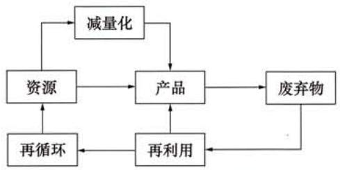

*图7.1-1 “3R”运行模式*

  “3R”原则主张源头减量优先于末端处理的优先级关系，实施的优先顺序通常为“减量化”“再利用”“再循环”。  

  也有观点认为，应在前述“3R”原则基础上增加“再制造”（Remanufacture）和“再生”（Recover），扩展为“5R”原则。所谓“再制造”，是指对废旧产品进行专业化加工改造，使其性能达到或超过原产品标准。所谓“再生”，是指通过能源回收或物质提取，将无法循环利用的废弃物转化为可用能源或原料。

**3）生命周期评估方法**

  生命周期评估（LifeCycleAssessment，LCA）是一种标准化方法，通过计算和评估从原材料提取到废物处理等产品／服务生命周期各阶段的自然资源消耗和对环境的产出，提供了一种评估与生产过程或服务相关的潜在环境影响方法。  

  LCA方法在工程建设领域可应用于材料和产品、建造及行业管理等不同层面： ① 在材料和产品层面，LCA方法可用来指导绿色材料和产品的选择过程； ② 在建造层面，LCA方法可用来描述拟建项目的环境足迹，以满足法规要求和寻求环境影响最小化的建造方案； ③ 在行业管理层面，采用LCA方法有利于政策制定和规划。  

  LCA方法应用可分为以下四个阶段：  

  （1）目的与范围确定：将生命周期评估研究的目的及范围予以清楚地确定，使其与预期的应用相一致。例如，明确评估对象（如某装配式建筑施工）、系统边界（如是否含部品部件运输）、功能单位（如 1m² 建筑面积），对比传统现浇与装配式混凝土结构施工的碳排放差异。  

  （2）清单分析：编制一份与研究的产品系统有关的投入产出清单，包含资料搜集及运算，以便量化一个产品系统的投入与产出，这些投入与产出包括资源的使用及对空气、水体及土地的污染排放等。例如，量化各阶段资源输入（如水泥用量）与环境输出（如碳排放），统计施工机械作业燃油/电力消耗与尾气排放数据。  

  （3）影响评估：针对生命周期清单分析得出的结果，来评估与这些投入产出相关的潜在环境影响。例如，将清单数据转化为环境影响指标（如全球变暖潜势GWP、酸化潜势AP），评估建材生产对不可再生资源耗竭（ADP）的影响率。  

  （4）解释说明：将清单分析及环境评估所发现的问题与研究目的相结合，得出结论与建议。例如，发现施工能耗偏高时，可建议采用光伏临时供电。

**2. 各方主体绿色施工具体职责**

  实施绿色施工，不仅要对施工策划、材料采购、现场施工、工程验收等各环节进行控制，还要落实工程建设各方主体的绿色施工职责。根据《建筑工程绿色施工规范》GB/T50905—2014，工程建设各方主体的绿色施工具体职责如下。

**1）建设单位绿色施工职责**

  （1）在编制工程概算和招标文件时，应明确绿色施工的要求，并提供包括场地、环境、工期、资金等方面的条件保障。  

  （2）应向施工单位提供建设工程绿色施工的设计文件、产品要求等相关资料，保证资料的真实性和完整性。  

  （3）应建立建设工程绿色施工的协调机制。

**2）设计单位绿色施工职责**

  （1）应按国家现行有关标准和建设单位的要求进行工程的绿色设计。  
  （2）应协助、支持、配合施工单位做好建设工程绿色施工的有关设计工作。

**3）工程监理单位绿色施工职责**

  （1）应对建设工程绿色施工承担监理责任。  

  （2）应审查绿色施工组织设计、绿色施工方案或绿色施工专项方案，并在实施过程中做好监督检查工作。

**4）施工单位绿色施工职责**

  （1）施工单位是建设工程绿色施工的实施主体，应组织绿色施工的全面实施。  

  （2）实行总承包管理的建设工程，总承包单位应对绿色施工负总责。  

  （3）总承包单位应对专业承包单位的绿色施工实施管理，专业承包单位应对工程承包范围的绿色施工负责。  

  （4）施工单位应建立以项目经理为第一责任人的绿色施工管理体系，制定绿色施工管理制度，负责绿色施工的组织实施，进行绿色施工教育培训，定期开展自检、联检和评价工作。  

  （5）绿色施工组织设计、绿色施工方案或绿色施工专项方案编制前，应进行绿色施工影响因素分析，并据此制定实施对策和绿色施工评价方案。

#### 7.1.2 绿色施工措施

**1. 绿色施工管理措施**

  1）绿色施工组织设计和绿色施工方案  

  绿色施工组织设计、绿色施工方案或绿色施工专项方案的编制应符合下列规定：  

  （1）应考虑施工现场的自然与人文环境特点。（2）应有减少资源浪费和环境污染的措施。（3）应明确绿色施工的组织管理体系、技术要求和措施。（4）应选用先进的产品、技术、设备、施工工艺和方法，利用规划区域内设施。（5）应包含改善作业条件、降低劳动强度、节约人力资源等内容。绿色施工方案应在施工组织设计中独立成章，并按有关规定进行审批。绿色施工  
  方案应包括以下内容：① 节材措施。在保证工程安全与质量的前提下，制定节材措施。如进行施工方案  
  的节材优化，建筑垃圾减量化，尽量利用可循环材料等。② 节水措施。根据工程所在地的水资源状况，制定节水措施。③ 节能措施。进行施工节能策划，确定目标，制定节能措施。  

  ④ 节地与施工用地保护措施。制定临时用地指标、施工总平面布置规划及临时用地节地措施等。  

  ⑤ 环境保护措施。制定环境管理计划及应急救援预案，采取有效措施，降低环境负荷，保护地下设施和文物等资源。

**2）人员安全与健康管理**

  对于人员安全与健康管理，应制定并落实好如下措施：  

  （1）制定施工防尘、防毒、防辐射等职业危害的措施，保障施工人员的长期职业健康。  

  （2）合理布置施工场地，保护生活及办公区不受施工活动的有害影响。施工现场建立卫生急救、保健防疫制度，在安全事故和疾病疫情出现时提供及时救助。  

  （3）提供卫生、健康的工作与生活环境，加强对施工人员的住宿、膳食、饮用水等生活与环境卫生等管理，明显改善施工人员的生活条件。

**3）设备材料管理**

  施工现场应建立机械设备保养、限额领料、建筑垃圾再利用的台账和清单，制定工程材料和机械设备的存放、运输保护措施，使现场材料堆放有序，储存环境适宜，措施得当。要健全保管制度并落实责任。  

  要建立施工机械设备管理制度，开展用电、用油计量，完善设备档案，及时做好维修保养工作，使机械设备保持低耗、高效的状态。

**4）用能用水管理**

  应制定合理的施工能耗指标，明确节能措施，提高施工能源利用率。施工现场分别设定生产、生活、办公和施工设备的用电控制指标，定期进行计量、核算、对比分析，并有预防与纠正措施。  

  施工现场应分别对生活用水与工程用水确定用水定额指标，并分别计量管理。大型工程的不同单项工程、不同标段、不同分包生活区，凡具备条件的应分别计量用水量。在签订不同标段分包或劳务合同时，将节水定额指标纳入合同条款，进行计量考核。

**5）排放和减量化管理**

  应按照分区划块原则，规范施工污染排放和资源消耗管理，进行定期检查或测量，实施预控和纠偏措施，保持现场良好的作业环境和卫生条件。  

  施工单位应制定建筑垃圾减量化计划，如每万平方米住宅建筑的建筑垃圾不宜超过400t；编制建筑垃圾处理方案，采取污染防治措施，设专人按规定处置有毒有害物质。

**6）环境监测管理**

  应积极开展并配合环境监测工作。环境监测是通过对影响环境质量要素代表值的测定，确定环境质量状况和污染程度，了解环境系统变化规律与发展趋势的活动。环境监测具有环节构成的系统性，监测对象和监测手段的综合性，环境状态随时间变化的时序性特征。  

  常规环境监测包括环境质量监测、污染源监测、生态环境监测；特殊目的监测包括研究型监测、污染事故监测和仲裁监测。

**2. 绿色施工技术措施**

**1）节材与材料资源利用**

  （1）结构材料利用。推广使用高强度钢筋和高性能混凝土；推广使用预拌混凝土和商品砂浆；利用粉煤灰、矿渣、外加剂及新材料，减少水泥用量；推广钢筋专业化加工和配送。准确计算采购数量、供应频率、施工速度，在施工过程中动态控制，减少资源消耗。  

  优化钢筋配料和钢构件下料方案，钢筋及钢结构制作前应对下料单及样品进行复核，无误后方可批量下料。钢筋连接采用对接、机械等低损耗连接方式。优化钢结构制作和安装方法，大型钢结构宜采用工厂制作，现场拼装。宜采用分段吊装、整体提升、滑移、顶升等安装方法，减少方案的措施用材量。  

  （2）围护材料利用。围护结构选用耐候性及耐久性良好的材料，其中门窗采用密封性、保温隔热性能、隔声性能良好的型材和玻璃等材料；屋面、外墙采用具有良好的防水性能和保温隔热性能的材料。施工应确保密封性、防水性和保温隔热性，屋面或墙体等部位采用基层加设保温隔热系统的方式施工时，应选择高效节能、耐久性好的保温隔热材料，以减小保温隔热层的厚度及材料用量。  

  根据建筑物的实际特点，优选屋面或外墙的保温隔热材料系统和施工方式，例如保温板粘贴、保温板干挂、聚氨酯硬泡喷涂、保温浆料涂抹等，以保证保温隔热效果，并减少材料浪费。要加强保温隔热系统与围护结构的节点处理，尽量降低热桥效应。针对建筑物的不同部位保温隔热特点，选用不同的保温隔热材料及系统，以做到经济适用。  

  （3）装饰装修材料利用。采用非木质的新材料或人造板材代替木质板材；木制品及木装饰用料、玻璃等各类板材等宜在工厂采购或定制。  

  贴面类材料在施工前，应进行总体排版策划，减少非整块材的数量。防水卷材、壁纸、油漆及各类涂料基层必须符合要求，避免起皮、脱落。  

  （4）周转材料利用。应选用耐用、维护与拆卸方便的周转材料和机具。其中，模板应以节约自然资源为原则，推广使用定型钢模、钢框竹模、竹胶板；推广采用外墙保温板替代混凝土施工模板的技术。施工前应对模板工程的方案进行优化，多层、高层建筑使用可重复利用的模板体系，模板支撑宜采用工具式支撑。优先选用制作、安装、拆除一体化的专业队伍进行模板工程施工。  

  现场办公和生活用房采用周转式活动房。现场围挡应最大限度地利用已有围墙，或采用装配式可重复使用围挡封闭。力争工地临房、临时围挡材料的可重复使用率达到 70% 。  

  （5）节材措施。鼓励就地取材，施工现场 500km 以内生产的建筑材料用量占建筑材料总重量的 70% 以上，宜优先选用获得绿色建材评价认证标识的建筑材料和产品。  

  应根据施工进度、库存情况等合理安排材料的采购、进场时间和批次，减少库存。材料运输工具适宜，装卸方法得当，防止损坏和遗洒。根据现场平面布置情况就近卸载，避免和减少二次搬运。  

  采取措施提高模板、脚手架等的周转次数，如采用管件合一的脚手架和支撑体系，采用工具式模板和新型模板材料，如铝合金、塑料、玻璃钢和其他可再生材质的大模板  

  和钢框镶边模板等。

**2）节水与水资源利用**

  （1）提高用水节水效率。应根据用水量设计布置施工现场供水管网，做到管径合理、管路简捷，还应采取有效措施（如阀门预设）减少管网和用水器具的漏损。  

  施工现场应建立可再利用水的收集处理系统，使水资源得到梯级循环利用，尤其是雨量充沛地区的大型施工现场应建立雨水收集利用系统。现场机具、设备、车辆冲洗用水必须设立循环用水装置。施工现场办公区、生活区的生活用水应采用节水系统和节水器具，提高节水器具配置比率。项目临时用水应使用节水型产品，安装计量装置，采取针对性的节水措施。  

  施工中应采用先进的节水施工工艺。混凝土养护采用覆膜、喷淋设备、养护液等节水工艺。现场搅拌用水、养护用水应采取有效的节水措施，优先采用中水搅拌、中水养护，有条件的地区和工程应收集雨水养护。雨水和基坑降水产生的地下水有收集管网、处理设施和利用措施。处于基坑降水阶段的工地，宜优先采用地下水作为混凝土搅拌用水、养护用水、冲洗用水和部分生活用水。现场机具、设备、车辆冲洗、喷洒路面、绿化浇灌等用水，优先采用非传统水源，尽量不使用市政自来水。力争施工中非传统水源和循环水的再利用量大于 30% 。  

  （2）保证用水安全。在非传统水源和现场循环再利用水使用过程中，应制定有效的水质检测与卫生保障措施，确保避免对人体健康、工程质量及周围环境产生不良影响。

**3）节能与能源利用**

  （1）可再生能源利用及设备节能。根据当地气候和自然资源条件，充分利用太阳能、地热、风能等可再生能源。  

  优先使用国家、行业推荐的节能、高效、环保的施工设备和机具，如选用变频技术的节能施工设备等。安排施工工艺时，应优先考虑耗用电能或其他能耗较少的施工工艺，如地下工程混凝土施工采用溜槽或串筒浇筑。应选择功率与负载相匹配的施工机械设备，避免设备额定功率远大于使用功率或超负荷使用设备，避免大功率施工机械设备低负载长时间运行。机电安装可采用节电型机械设备，如逆变式电焊机和能耗低、效率高的手持电动工具等。机械设备宜使用节能型油料添加剂，在可能的情况下，考虑回收利用，节约油量。  

  （2）生产、生活及办公临时设施节能。利用场地自然条件，合理设计生产、生活及办公临时设施的体形、朝向、间距和窗墙面积比，使其获得良好的日照、通风和采光。南方地区可根据需要在其外墙窗设遮阳设施；严寒和寒冷地区外门应采取防寒措施。  

  临时设施宜选用由高效保温、隔热、防火材料制成的复合墙体和屋面，以及密封保温隔热性能好的门窗。办公和生活临时用房应采用可重复利用的房屋。合理配置供暖、空调、风扇数量，规定使用时间，实行分段分时使用，节约用电。  

  （3）施工用电及照明节能。合理设计、布置临时用电线路，优先选用节能电线和节能灯具，临电设备宜采用自动控制装置。采用声控、光控等节能照明灯具。照明照度宜按最低合理照度设计。照明设计以满足最低照度为原则，照度超出部分不应超过最低照度的 20% 。施工现场宜错峰用电。

**4）节地与施工用地保护**

  在施工总平面设计时，应针对施工场地、环境和条件进行分析，制定具体实施方案。施工前应制定合理的场地使用计划；施工中应减少场地干扰，保护环境。施工现场平面布置应根据施工各阶段的特点和要求，实行动态管理。  

  （1）临时用地。根据施工规模及现场条件等因素合理确定临时设施，如临时加工厂、现场作业棚及材料堆场、办公生活设施等的占地指标。临时设施的占地面积应按用地指标所需的最低面积设计。要求平面布置合理、紧凑，在满足环境、职业健康与安全及文明施工要求的前提下尽可能减少废弃地和死角，临时设施占地面积有效利用率大于 90% 。  

  （2）临时用地保护。应对深基坑施工方案进行优化，减少土方开挖和回填量，最大限度地减少对土地的扰动，保护周边自然生态环境。  

  红线外临时占地应尽量使用荒地、废地，少占用农田和耕地。工程完工后，及时对红线外占地恢复原地形、地貌，使施工活动对周边环境的影响降至最低。施工现场应避让、保护场区及周边的古树名木。利用和保护施工用地范围内原有绿色植被。对于施工周期较长的现场，可按建筑永久绿化的要求，安排场地新建绿化。  

  （3）施工总平面布置和临时设施。施工总平面布置应做到科学、合理，充分利用原有建筑物、构筑物、道路、管线为施工服务。施工现场搅拌站、仓库、加工厂、作业棚、材料堆场等布置应尽量靠近已有交通线路或即将修建的正式或临时交通线路，缩短运输距离。施工现场的强噪声机械设备宜远离噪声敏感区。塔式起重机等垂直运输设施基座宜采用可重复利用的装配式基座或利用在建工程的结构。  

  临时办公和生活用房应采用经济、美观、占地面积小、对周边地貌环境影响较小，且适合于施工平面布置动态调整的多层轻钢活动板房、钢骨架水泥活动板房等标准化装配式结构。生活区与生产区应分开布置，并设置标准的分隔设施。  

  施工现场大门、围挡和围墙宜采用可重复利用的材料和部件，并应工具化、标准化，减少建筑垃圾，保护土地。施工现场入口应设置绿色施工制度图牌。施工现场围墙、大门和施工道路周边宜设绿化隔离带。施工现场道路按照永久道路和临时道路相结合的原则布置。施工现场内形成环形通路，减少道路占用土地。施工现场主要道路的硬化处理宜采用可周转使用的材料和构件。  

  临时设施布置应注意远近结合（本期与下期工程），努力减少和避免大量临时建筑拆迁和场地搬迁。

**5）环境保护**

  （1）扬尘控制。施工现场宜搭设封闭式垃圾站。运送土方、垃圾、设备及建筑材料等，不污损场外道路。运输容易散落、飞扬、流漏的物料车辆，必须采取措施封闭严密，保证车辆清洁。施工现场出口应设置洗车槽。  

  施工现场非作业区达到目测无扬尘的要求。对现场易飞扬物质采取有效措施，如洒水、地面硬化、围挡、密网覆盖、封闭等，防止扬尘产生。土方作业阶段，采取洒水、覆盖等措施，达到作业区目测扬尘高度小于 1.5m ，不扩散到场区外。在场界四周隔挡高度位置测得的大气总悬浮颗粒物（TSP）月平均浓度与城市背景值的差值不大于0.08mg/m³ 。  

  结构施工、安装装饰装修阶段，作业区目测扬尘高度小于 0.5m 。对易产生扬尘的堆放材料应采取覆盖措施；对粉末状材料应封闭存放；场区内可能引起扬尘的材料及建筑垃圾搬运应有降尘措施，如覆盖、洒水等；浇筑混凝土前清理灰尘和垃圾时尽量使用吸尘器，避免使用吹风器等易产生扬尘的设备；机械剔凿作业时可采用局部遮挡、掩盖、水淋等防护措施；高层或多层建筑清理垃圾应搭设封闭性临时专用道或采用容器吊运。  

  构筑物拆除前，做好扬尘控制计划。构筑物机械拆除可采取清理积尘、拆除体洒水、设置隔挡等措施；构筑物爆破拆除可采用清理积尘、淋湿地面、预湿墙体、屋面敷水袋、楼面蓄水、建筑外设高压喷雾状水系统、搭设防尘排栅和直升机投水弹等综合降尘。选择风力小的天气进行爆破作业。  

  施工现场使用的热水锅炉等宜使用清洁燃料。不得在施工现场融化沥青或烧油毡、油漆及产生有毒、有害烟尘和恶臭气体的其他物质。  

  （2）噪声与振动控制。现场噪声排放不得超过国家标准《建筑施工场界环境噪声排放标准》GB12523—2011的规定，昼间场界环境噪声不得超过70dB（A），夜间场界环境噪声不得超过55dB（A）。同时，夜间噪声最大声级超过限值的幅度不得高于15dB（A）。  

  在施工场界需对噪声进行实时监测。监测方法应执行国家标准《建筑施工场界环境噪声排放标准》GB12523一2011。噪声测量应根据施工场地周围噪声敏感建筑物位置和声源位置的布局，测点应设在对噪声敏感建筑物影响较大、距离较近的位置。测点通常应设在建筑施工场界外 1m 、高度 1.2m 以上的位置。测量应在无雨雪、无雷电天气，风速为 5m/s 以下时进行。施工期间，测量连续 20min 的等效声级，夜间同时测量最大声级。  

  施工现场应使用低噪声、低振动的机具，采取隔声与隔振措施，避免或减少施工噪声和振动。施工车辆进出现场，不宜鸣笛。  

  （3）光污染控制。尽量避免或减少施工过程中的光污染，应根据现场和周边环境采取限时施工、遮光和全封闭等措施。夜间室外照明灯加设灯罩，透光方向集中在施工范围。  

  在光线作用敏感区域施工时，电焊作业和大型照明灯具应采取防光外泄措施。  

  （4）水污染控制。施工现场污水排放应达到国家标准《污水综合排放标准》GB8978—1996的要求。  

  施工现场应针对不同的污水设置相应处理设施，如食堂、盥洗室、淋浴间的下水管线应设置过滤网，食堂应另设隔油池；施工现场宜采用移动式厕所，并应定期清理，固定厕所应设化粪池；隔油池和化粪池应做防渗处理，并应进行定期清运和消毒。施工机械设备使用和检修时，应控制油料污染；清洗机具的废水和废油不得直接排放。  

  污水排放应委托有资质的单位进行废水水质检测，提供相应的污水检测报告。使用非传统水源和现场循环水时，宜根据实际情况对水质进行检测。  

  保护地下水环境。采用隔水性能好的边坡支护技术。在缺水地区或地下水位持续下降的地区，基坑降水尽可能少地抽取地下水；当基坑开挖抽水量大于50万 m³ 时，应进行地下水回灌，并避免地下水被污染。  

  施工现场存放的油料和化学溶剂等物品应设专门库房，地面应做防渗漏处理。易挥发、易污染的液态材料，应使用密闭容器存放。废弃、渗漏的油料和化学溶剂应集中处理，不得随意倾倒。  

  （5）土壤保护。保护地表环境，防止土壤侵蚀、流失。因施工造成的裸土，及时覆盖砂石或种植速生草种，以减少土壤侵蚀；因施工造成容易发生地表径流土壤流失的情况，应采取设置地表排水系统、稳定斜坡、植被覆盖等措施，减少土壤流失。  

  对于电池、墨盒、油漆、涂料等有毒有害废弃物，应回收后交有资质的单位处理，不能作为建筑垃圾外运，避免污染土壤和地下水。  

  施工后应恢复施工活动破坏的植被（一般指临时占地内）。与当地园林、环保部门或当地植物研究机构进行合作，在先前开发地区种植当地或其他合适的植物，以恢复剩余空地地貌或科学绿化，补救施工活动中人为破坏植被和地貌造成的土壤侵蚀。  

  （6）垃圾回收利用和处置。应通过施工图纸深化、施工方案优化、永临结合、临时设施和周转材料重复利用、施工过程管控等措施，减少建筑垃圾的产生。  

  加强建筑垃圾的回收再利用，力争使建筑垃圾的再利用和回收率达到 30% ，建筑物拆除产生的废弃物再利用和回收率大于 40% 。对于碎石类、土石方类建筑垃圾，可采用地基填埋、铺路等方式提高再利用率，力争再利用率大于 50% 。  

  施工现场建筑垃圾的就地处置，应遵循因地制宜、分类利用原则，提高建筑垃圾处置利用水平。建筑垃圾的回收利用应符合现行国家标准《工程施工废弃物再生利用技术规范》GB/T50743—2012规定。工程渣土、工程泥浆采取土质改良措施，符合回填土质要求的，可用于土方回填；工程垃圾中的金属类垃圾，宜通过简单加工，作为施工材料或工具，直接回用于工程；工程垃圾和拆除垃圾中的无机非金属建筑垃圾，宜根据场地条件，设置场内处置设备，进行资源化再利用；施工现场难以就地利用的建筑垃圾，应制定合理的消防、防腐及环保措施，并按相关要求及时转运到建筑垃圾处置场所进行资源化处置和再利用。  

  施工现场生活区设置封闭式垃圾容器，施工场地生活垃圾实行袋装化，及时清运。对建筑垃圾进行分类，并收集到现场封闭式垃圾站，集中运出。现场清理时，不得将施工垃圾从窗口、洞口、阳台等处抛撒。  

  严禁将生活垃圾和危险废物混入建筑垃圾排放。生活垃圾和危险废物应按有关规定进行处置。有毒有害废弃物的分类率应达到 100% ；对有可能造成二次污染的废弃物应单独储存，并设置醒目标识。  

  （7）地下设施、文物和资源保护。施工前应调查清楚地下各种设施，做好保护计划，保证施工场地周边的各类管道、管线、建筑物、构筑物的安全运行。施工过程中一旦发现文物，立即停止施工，保护现场并通报文物管理部门，同时协助做好相关工作。要避让、保护施工场区及周边的古树名木。  

  逐步开展施工项目 CO2

 排放量及各种不同植被和树种的 CO2

 固定量的统计分析工作。

**6）采用“四新”发展绿色施工**

  国家鼓励各地区开展绿色施工的政策与技术研究，开发应用绿色施工的新技术、新设备、新材料与新工艺，推行应用示范工程。  

  施工方案应建立推广、限制、淘汰公布制度和管理办法。发展适合绿色施工的资源利用与环境保护技术，对落后的施工方案进行限制或淘汰，鼓励绿色施工技术的发展，推动绿色施工技术的创新。  

  大力发展现场监测技术、低噪声的施工技术、现场环境参数检测技术、自密实混凝土施工技术、清水混凝土施工技术、建筑固体废弃物再生产品在墙体材料中的应用技术、新型模板及脚手架技术的研究与应用。  

  加强信息技术应用，如绿色施工的虚拟现实技术、三维建筑模型的工程量自动统计、绿色施工组织设计数据库建立与应用系统、数字化工地、基于电子商务的建筑工程材料、设备与物流管理系统等。通过应用信息技术，进行精密规划、设计、精心建造和优化集成，实现与提高绿色施工的各项指标。

### 7.2 施工现场环境管理

#### 7.2.1 环境管理体系的建立和运行

  环境管理体系是一个组织内全面管理体系的组成部分，它包括为制定、实施、实现、评审和保持环境方针所需的组织机构、规划活动、机构职责、惯例、程序、过程和资源。国际标准化组织（ISO）颁布了《环境管理体系要求及使用指南》ISO14001：2015，旨在为各类组织提供管理框架，以加强环境保护意识、管理能力和保障措施，改善环境质量，同时与社会经济需求保持平衡。我国等同采用此标准，于2016年发布了《环境管理体系要求及使用指南》GB/T24001—2016。

**1. 环境管理体系的基本理念和核心内容**

  根据环境管理体系标准的要求，组织建立、实施、保持并持续改进环境管理体系，可以帮助组织实现提升环境绩效、履行合规义务、实现环境目标等预期结果，为环境、组织自身和相关方带来价值。

**1）环境管理体系的基本理念**

  环境管理体系旨在采用全面、系统化管理方法，帮助组织有效管理和改善其环境性能。环境管理体系有如下基本理念：  

  （1）持续改进。环境管理体系鼓励组织持续改进其环境性能。这包括识别和评估环境方面的风险和机会，并采取有效措施来减少不利影响，提高环境绩效。  

  （2）法律合规。环境管理体系强调遵守适用的环境法律、法规和其他要求。组织应了解并履行其法定义务，确保其活动在环境方面的合规性。  

  （3）风险管理。环境管理体系帮助组织识别、评估和管理与其活动相关的环境风险。组织通过制定适当的控制措施和应急响应计划，可以降低不良环境影响的潜在风险。  

  （4）绩效评估。环境管理体系鼓励组织进行环境绩效评估，以了解其环境方面的成就和改进机会。这包括制定目标和指标，收集和分析相关数据，并对绩效进行定期审查。  

  （5）沟通与参与。环境管理体系鼓励组织与内外部利益相关者进行有效的沟通和参与。这可以促进信息共享、意见收集和合作，以提高环境管理绩效。  

  （6）资源管理。环境管理体系强调有效管理资源，包括能源、水资源和原材料等。组织通过减少资源的使用和浪费，可以降低环境影响并提高资源效率。  

  （7）培训和意识。环境管理体系鼓励组织为员工提供必要的培训和意识教育。这有助于提高员工对环境问题的认识和理解，并使他们能够积极参与环境管理活动。  

  通过贯彻这些基本理念，环境管理体系可以帮助组织实现环境可持续发展，并在经济、社会和环境方面实现更好的综合绩效。

**2）环境管理体系的核心内容**

  《环境管理体系要求及使用指南》GB/T24001—2016包括以下10部分内容： ① 范围； ② 规范性引用文件； ③ 术语和定义； ④ 组织所处环境； ⑤ 领导作用； ⑥ 策划；⑦ 支持； ⑧ 运行； ⑨ 绩效评价； ⑩ 改进。其中，环境管理体系的核心内容如下。  

  （1）组织所处环境。组织所处环境是指与组织的宗旨相关、并影响其实现环境管理体系预期结果的能力问题。这些问题包括组织外部的环境状况，以及外部的文化、社会、政治、法律等问题和组织内部的特征或条件。  

  理解组织所处环境包括四方面内容： ① 理解组织及其所处的环境； ② 理解相关方的需求和期望； ③ 确定环境管理体系的范围； ④ 环境管理体系。  

  （2）领导作用。领导作用与环境管理体系中的“策划”“支持和运行”“绩效评价”及“改进”四大部分均紧密联系，且处于核心地位。领导作用包括三方面内容： ① 领导作用和承诺； ② 环境方针； ③ 组织的角色、职责和权限。  

  组织最高管理者在环境管理体系方面的领导作用和承诺包括：  

  A.对环境管理体系的有效性负责。  
  B.确保建立环境方针和环境目标，并确保其与组织的战略方向及所处环境相一致。  
  C.确保将环境管理体系要求融入组织的业务过程。  
  D.确保可获得环境管理体系所需的资源。  
  E.就有效环境管理的重要性和符合环境管理体系要求的重要性进行沟通。  
  F.确保环境管理体系实现其预期结果。  
  G.指导并支持员工对环境管理体系的有效性作出贡献。  
  H.促进持续改进。  

  I.支持其他相关管理人员在其职责范围内证实其领导作用。  

  （3）策划。策划是一个持续进行的过程，不但用于建立和实施环境管理体系，也用于保持和改进环境管理体系。策划过程能够帮助组织识别保护环境的最重要领域，以更好地使用其有限的资源；还有助于组织履行其合规性义务，实现其环境方针的承诺，并建立和实现其环境目标。策划过程产生的信息是确定必须控制的“运行”的重要输入，该信息同样可用于环境管理体系其他部分的建立和改进。  

  策划包括两方面内容： ① 应对风险和机遇的措施； ② 环境目标及其实现的策划。  

  （4）支持。支持是指对整个环境管理体系的策划、运行、检查和改进等起支持作用的条款。  

  支持包括五方面内容： ① 资源； ② 能力； ③ 意识； ④ 信息交流； ⑤ 文件化信息。  

  （5）运行。运行会直接影响组织环境绩效和环境管理体系预期结果的实现。运行包括两方面内容： ① 运行策划和控制； ② 应急准备和响应。  

  （6）绩效评价。组织在建立、实施、保持和持续改进环境管理体系过程中，要始终不间断地对环境目标、重要环境因素、合规义务和运行控制等进行监视、测量、分析和评价，通过对其环境管理体系自我检查的内部审核和总体性评价，以及改进的管理评审，确保及时发现问题，采取措施，持续改进，更好地实现其环境管理体系的预期结果和有效性。  

  绩效评价包括三方面内容： ① 监视、测量、分析和评价； ② 内部审核； ③ 管理评审。  

  （7）改进。组织在对其环境绩效进行监视、测量、分析和评价，进而开展内部审核和管理评审过程中，会发现一些改进的机会。组织应确定这些改进机会，实施必要的改进，从而实现环境目标。环境管理体系对改进提出要求，充分体现了组织建立环境管理体系的最终目的是持续改进环境管理体系的适宜性、充分性和有效性。  

  改进包括三方面内容： ① 总则； ② 不符合和纠正措施； ③ 持续改进。

**2. 环境管理体系的建立**

  建筑企业通常需要通过初始评审，确定建筑企业所处环境，并分析建筑企业现有环境管理基础与环境管理体系标准要求的差距后，有针对性地建立环境管理体系。

**1）准备工作**

  （1）最高管理者的承诺、责任和领导。建立环境管理体系首先需要建筑企业领导作出决策。最高管理者对环境管理体系的有效性负责，其承诺、责任和领导是环境管理体系建立和实施成功的关键，包括实现预期结果的能力。  

  （2）组建工作班子，制定计划和人员培训。根据建筑企业规模、管理水平和人员素质情况组成工作班子，并配备相应的资源，如办公设备、工作场所、活动经费及法律法规、标准文本、技术文件和相关基础资料等。工作班子应明确人员分工并就环境管理体系的建立制定详细的工作计划，包括目标要求、措施方案、时间进度等。  

  建筑企业应分层次对相应人员组织环境管理体系标准的培训。高层、中层和基层管理者需重点了解环境管理体系标准的理解要点及建立和实施环境管理体系的意义等；工作班子成员除了理解要点外，还需重点掌握初始环境评审、体系策划、文件化信息系统、体系试运行的基本要求和相关的法律法规知识等；与重要环境影响有关的人员应重点掌握其工作产生的环境因素及环境影响、相关的环境目标及监测和控制技术等；普通员工应侧重理解环保知识、环境管理体系标准知识、环保意识和建立环境管理体系的现实意义等。

**2）初始环境评审**

  （1）确定企业环境和确定相关方要求  

  ① 确定企业环境。为了建立、实施、保持和持续改进环境管理体系，首先应确定与其宗旨相关并影响其实现环境管理体系预期结果能力的问题。  

  建筑企业外部问题包括：政治、经济、社会、市场、金融、技术、竞争、文化、司法和自然环境等。  

  建筑企业内部问题包括：企业组织结构，企业战略方向，企业活动、产品和服务的性质、规模和环境影响，企业司法记录、现状及趋势，企业能力，企业信息系统，企业文化，企业管理制度，企业与相关方的合作等。  

  ② 确定相关方要求。相关方的需求和期望是建筑企业环境管理体系的输入，是企业确定环境管理体系范围、制定环境方针、确定合规义务、识别风险和机遇、建立环境目标的依据。  

  与环境管理体系有关的相关方类型不同，对环境管理的要求也有所不同：  

  A.影响建筑企业活动和决策的相关方（如政府、上级部门、媒体、非政府组织），要求必须遵守法律法规、建设环境友好的企业。B.受建筑企业活动和决策影响的相关方（如外部供方、社区公众、员工），要求企业积极保护环境，防治污染，稳定运行。C.自身感到受建筑企业活动和决策影响的相关方（如投资方、合作方、顾客），要求企业提供绿色消费，提升环境绩效，实现持续发展。  

  相关方要求不一定全部是建筑企业必须满足的要求，建筑企业应确定必须遵守的相关方的需求和期望，将其纳入合规义务。  

  （2）确定环境管理体系范围。环境管理体系范围应依据建筑企业所处环境，相关方需求和期望，组织机构、职能，组织活动、产品、服务，组织控制权限、能力等界定。  

  （3）确定环境管理体系过程。建筑企业应建立过程以确保其按策划得以控制和实施，并实现期望的结果。  

  （4）制定方针，确定岗位职责权限。环境方针是建筑企业承担环境责任和义务的公开声明和承诺，是建筑企业环境管理的纲领性文件。最高管理者应确保环境方针的建立，并与建筑企业的战略方向及所处的环境相一致。环境方针内容应当清晰易懂，具有实用性。  

  建筑企业在策划环境管理体系时，通常需要调整企业原有的管理机构，针对企业各个职能和不同层次人员确定其作用、规定其职责，授予其权限，将环境管理职能融入企业整体职能，以适应环境管理体系标准的需求。建筑企业应将对相关岗位职责和权限的确定结果形成文件化信息，例如形成环境管理体系职责分配的文字描述、环境管理组织机构图、环境管理体系标准条款职能分配表等。

**3）环境管理体系策划及体系文件编制**

  （1）体系策划。建筑企业通过策划来识别和集中资源在需要的领域，实现其合规义务和其他环境政策的承诺，并建立和实现其环境目标。  

  体系策划的内容包括：风险和机遇确定及应对措施策划；环境因素确定及控制措施策划；合规义务确定及履行措施策划；环境目标确定及实现措施策划。  

  （2）体系文件编制。建筑企业应制定并保持足够的证明性文件化信息，以确保其环境管理体系的有效运行。文件化信息能够沟通意图、统一行动、提供证据，是环境管理的重要组成部分和手段，也是规范环境管理体系实施和运行、提升环境绩效、评价和改善环境管理体系、最终实现预期结果的依据和见证。  

  《环境管理体系要求及使用指南》GB/T24001—2016要求保持的文件化信息包括：① 环境管理体系范围； ② 环境方针； ③ 环境目标； ④ 需要应对的风险和机遇确定及应对措施策划过程； ⑤ 环境因素及重要环境因素确定及控制措施策划过程； ⑥ 合规义务确定及履行措施策划过程； ⑦ 应急准备和响应过程。  

  《环境管理体系要求及使用指南》GB/T24001—2016要求保留的文件化信息包括：① 能力的证据； ② 信息交流的证据； ③ 监视、测量、分析和评价结果； ④ 合规性评价结果； ⑤ 内部审核方案实施和审核结果； ⑥ 管理评审结果； ⑦ 不符合的性质和所采取的任何后续措施； ⑧ 任何纠正措施的结果。

**3. 环境管理体系的运行**

  建筑企业环境管理体系建立后，即可进入试运行阶段，通过内部审核与管理评审，使环境管理体系持续改进和有效运行。

**1）试运行**

  为确保环境管理体系文件化信息的适用性和充分性，以手册、程序文件或其他形式呈现的环境管理体系文件化信息，经最高管理者评审和批准后正式发布。体系文件的发布意味着环境管理体系进人试运行阶段。通过实施体系文件，发挥体系自身各项功能，及时发现问题、找根源、纠正不符合，修改体系，尽快完善。通过试运行，在实践中检验体系的适宜性、符合性和有效性。

**2）采取对不符合的纠正措施**

  环境管理体系的试运行过程中，不可避免会出现不符合，也难免不发生事故或事件，要保证依据《环境管理体系要求及使用指南》GB/T24001—2016建立的管理体系能及时启动纠正措施，并保证不再出现或少出现类似的不符合、事故或事件。

**3）开展内部审核**

  环境管理体系试运行一段时间后，建筑企业应通过内部审核，确定过程建立和实施的有效性，并保留评价结果证据。通过内部审核判断文件化信息的环境管理体系是否按《环境管理体系要求及使用指南》GB/T24001—2016的要求实施和保持；各级文件化信息与标准之间是否符合；是否与企业的实际运行情况相适宜；相关要求是否得到有效贯彻等。内部审核是检查环境管理体系运行符合性和有效性的重要手段之一，企业应保留审核过程的文件化信息。

**4）开展管理评审**

  建筑企业最高管理者应在其确定的时间间隔，对其环境管理体系进行评审，以评估环境管理体系的持续适宜性、充分性和有效性。管理评审应覆盖组织环境管理体系范围内活动、产品和服务的环境因素。

**4. 环境事故应急响应**

  施工现场应成立应急响应组织，应制定“紧急事故处理流程”及“纠正和预防措施程序”，对应急响应的工作人员和管理人员进行岗位教育、消防知识教育、应急准备和响应培训，定期检查应急准备工作情况，并做好记录。发生紧急情况时，立即按“紧急事故处理流程”采取应急措施，防止扩散。当紧急事故威胁到人身安全时，必须首先确保人身安全，迅速组织人员脱离危险区域或场所，同时采取应急措施，以尽可能减少对环境的影响。紧急事故处理结束后，需填写应急准备和响应报告，经审批后报上级主管部门。施工项目部应召集有关人员分析发生事故的原因，按“纠正和预防措施程序”的有关规定制定和实施纠正措施，并进行跟踪验证。

#### 7.2.2 施工现场文明施工要求

  文明施工是指在工程施工生产过程中，按照规定采取措施，保障施工现场作业环境，维护施工人员身体健康，并有效减少对周边环境影响的施工活动。文明施工是现代物质文明和精神文明的体现，是企业文化和企业社会责任的体现，是建筑业高质量发展的内在要求。

**1. 文明施工的作用及管理理念**

**1）文明施工的主要作用**

  （1）文明施工是保证施工质量、施工安全的支持条件。文明施工有利于营造文明有序的氛围，形成良好整洁的施工环境，及时排除施工过程中存在的质量、安全隐患，减少质量缺陷，遏制质量事故、安全事故的发生。通过文明工地建设，可以强化企业内外部规范化、精细化管理，有助于各项施工生产工作井然有序、高效运行，提高施工项目综合效益，提升建筑企业市场竞争力。  

  （2）文明施工是以人为本、关心公众的现实需要。文明施工考虑了项目利益相关者诉求，保护公众的健康安全和福祉，体现了工程伦理的秩序规范意识。着力保障工程施工现场人员的身体健康和生命安全，减少对施工工地和周边环境的不利影响，确保现场内外环境符合国家和地方政府相关要求，力求为一线施工人员和周边民众提供安全、健康、卫生、便利的工作生活环境。  

  （3）文明施工是反映企业能力和企业形象的重要窗口。施工现场情况能够充分体现企业管理水平和综合治理能力，能够反映施工现场员工的精神风貌和整体素质。施工现场是企业形象和对外的重要窗口，安全文明、整洁有序的现场环境能够树立良好的企业形象，提升业主方、公众对企业的信任感和企业社会影响力。

**2）文明施工管理理念**

  （1）企业社会责任理念。企业社会责任是指企业在创造利润、对股东承担责任的同时，还要承担对股东以外的企业利益相关者的责任。企业社会责任是除经济责任、法律责任之外的“第三种”责任。建筑企业的社会责任表现为建筑企业在追求营利性目标的同时，应承担对环境、社会和其他利益相关者的责任或应尽的义务，文明施工是建筑企业对员工（如员工职业健康安全、权益保障）、业主（如质量安全保障、合规经营）、公众（如减少施工干扰、社区共建）、环境资源（如生态保护、资源节约）承担责任的良好体现。  

  （2）精益管理理念。精益管理要求企业对各项活动都必须运用精益思想，主张以较少资源投入（包括人力、设备、资金、材料、时间和空间），创造尽可能多的价值。精益管理中的“精”体现在质量上，追求“精益求精”；“益”体现在成本上，减少资源消耗和浪费，多产出效益。精益管理以“精确决策、精确计划、精确控制、精确考核”为手段，贯彻“管理以人为本，人以精益为本”的思想，遵循以结果为导向的管理理念。为此，应采用精益化方式，统筹管理施工相关要素和环节，提升施工现场文明施工管理水平。  

  （3）“8S”管理理念。文明施工作为施工现场管理的重要工作，应贯彻“8S”管理理念。首先，要对施工现场的各种要素进行整理（Seiri）（区分必要与冗余，如清除施工现场无用物品、减少废弃物与污染源等）、整顿（Seiton）（科学定置定位，如工具设备“三定管理”，即定点、定容、定量；采用色标管理；分类存放材料等）、清扫（Seiso）（保持现场洁净，如每日清理施工粉尘、积水，防止扬尘等）、清洁（Seiketsu）（标准化维持，如统一废弃物分类容器，设置四色垃圾桶等），并考虑人的素养（Shitsuke）（培养行为习惯，如培养工人正确佩戴防护用品、“人走场清”绿色习惯等）。上述五大要素在日语中罗马发音均以“S”打头，故称为“5S”。在此基础上，增加安全（Safety）要素（风险预控，如高风险作业“上锁挂牌”制度，应急演练常态化等），即称为“6S”。之后，又增加了节约（Save）（资源节约利用，如采用节水工艺、节能设备，提高资源回收率，降低能耗等）和学习（Study）（持续改进，如推广优秀班组经验，对标行业标杆，掌握先进管理理念和先进技术等）两大要素，即成为当今施工现场的“8S”管理理念。

**2. 文明施工管理目标及工作要求**

**1）文明施工管理目标**

  建筑企业及施工项目部应努力做到文明施工管理的“六化”：现场管理制度化、安全设施标准化、现场布置条理化、机料摆放定置化、作业行为规范化、环境协调和谐化。

**2）文明施工管理工作要求**

  （1）建立健全文明施工管理体系，落实管理责任。建立文明施工管理体系是落实项目管理目标和管理职责的基础。文明施工管理体系通常包括目标设置、组织机构、权责划分、管理流程、措施要求、规章制度、奖惩制度等，涉及技术类标准、管理类标准和行为类标准。管理体系的建立要考虑施工现场实际情况，确保文明施工管理体系能够真正应用到施工现场管理中，促进文明施工管理措施的顺利实施，并能根据情况变化适时进行调整。  

  针对文明施工管理体系实施要求，应根据施工现场组织架构，将管理责任在项目部各部门间进行划分，实现对施工现场整体工作的统一指导和严格把控，并具体落实到班组这一施工现场的最小单元，确保文明施工管理工作责任落实横向到边、纵向到底。  

  （2）抓好员工教育培训，树立文明施工理念。人是文明施工的决定性因素，对管理人员和施工人员的教育是做好文明施工工作的重点。应坚持“以人为本”的原则，采用不同形式、不同层次、不同方法对人员进行安全文明施工教育。例如，对管理人员及劳务工人进行全员安全文明意识教育和专业知识及技能培训。通过培训教育，提高现场人员的文明意识和素质。还应做好安全文明施工交底，如对劳务班组开展每日班前交底会，并可采用可视化安全交底等新方式。  

  项目管理者和一线施工人员应秉持文明施工观念，规范自身的工程实践行为。把“严禁违章、遵守规程”的理念上升到“以人为本的安全情怀”，将安全文明施工从强调“要我做”的外部要求，演化为“我要做”的内在动力和自觉行动。  

  （3）制定安全文明施工管理规划，优化对策方法。安全文明施工管理规划需要根据施工现场文明施工管理目标制定，使文明施工管理形成良好的运行模式。安全文明施工规划应在工程开工前编制，其主要内容有：工程概况；安全方针、目标；安全文明施工管理组织机构；安全文明施工责任制等各项规章制度；环境保护措施（包括粉尘、噪声控制措施，现场排水和污水处理措施，植被保护措施，施工区域内现有市政管网和周围的建、构筑物的保护）；应急预案等。  

  应根据施工项目特点和实际需求，制定文明施工对策和方法，例如：  

  ① 应合理规划作业区、办公区、生活区、休息区、材料区、设备区、加工区、通道等，降低交叉施工的干扰因素，促进文明施工。  

  ② 根据施工总平面布局，对设备类型、安全设施、安全警示标志等样式和标准进行规范化，以达到统一、整洁、醒目、美观的整体效果。  

  ③ 根据空间和场地内施工布局特点，可采用区域网格化、功能模块化管理方式，对工区进行区域划分，按照“谁区域、谁负责、谁管理”的原则，落实区域安全文明施工职责。  

  ④ 对于工程总承包项目，在施工图设计阶段完成工程地下设施规划和“五通一平”设计，做到“先地下，后地上”，避免现场道路二次重复开挖，满足现场文明施工的要求和条件。  

  ⑤ 在满足设计要求前提下，应充分考虑施工临时设施与永久性设施的结合利用，实现永临结合。如对主干道进行硬化处理，对某些设施考虑生产运营需求，进行定制化管理。  

  ⑥ 综合采用各类信息技术，围绕人员、机械设备、材料、方法、环境等施工现场关键要素，借助信息实时采集、互通共享、工作协同、智能决策分析、风险预控等功能手段开展数字化文明施工管理。  

  ⑦ 学习先进项目管理经验，如“施工组织专业化、资源组织集约化、管理手段智慧化、安全管理人本化、日常管理精细化、现场管理标准化”，以及“凡事有人负责，凡事有章可循，凡事有据可查，凡事有人监督”等经验，开展文明施工对策和方法创新。  

  （4）落实安全文明施工费，依规做好专款专用。安全文明施工费是指按照有关规定，购置和更新施工安全防护用具及设施、改善现场安全生产条件和作业环境所需要的费用。建设单位应及时足额向施工单位支付安全文明施工费，为施工单位采取完善的安全文明施工措施提供资金保证。施工单位应设立安全文明施工费专用账户，建立安全文明施工措施费台账，做到专款专用，确保按投标报价及相关标准要求投人，施工合同和实施过程中的费用核查情况是安全文明措施费的结算依据。

**3）文明施工具体要求**

  施工现场管理应以“科学规划、规范整齐、环保达标、整体和谐”为原则，结合施工环境条件，认真进行施工现场文明形象管理的总体策划、设计、布置、使用和管理，做到布局合理、文明施工、安全有序、整洁卫生、不扰民、不损害公众利益。施工现场文明施工具体要求见表7.2-1。

*表7.2-1施工现场文明施工具体要求*

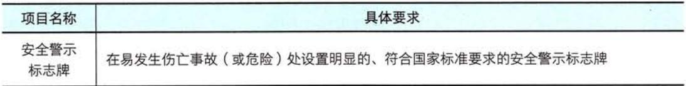

  续表

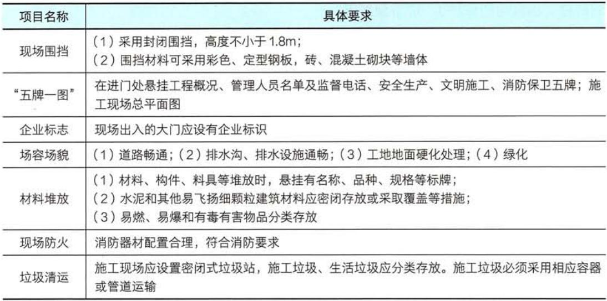

#### 7.2.3 施工现场环境保护措施

  制定和实施施工现场环境保护措施是施工管理的重要工作内容，我国相关法律法规及标准等均不同程度地明确规定了施工现场环境保护措施，形成了较为完整的施工现场环境保护措施体系。施工现场环境保护的具体措施已在本章7.1.2节详细阐述，此处不再赘述。这里仅根据国家标准《建筑与市政工程绿色施工评价标准》GB/T50640—2023，从绿色施工评价角度，摘要介绍施工现场应采取的环境保护措施要求。  

  施工现场环境保护评价由控制项、一般项和优选项三类指标组成，评价等级分为不合格、合格和优良三个等级。

**1. 控制项**

  这里的“控制项”是指绿色施工过程中必须达到的基本要求条款。对于施工现场环境保护而言，“控制项”包括以下内容：  

  （1）绿色施工策划文件中应包含环境保护内容，并建立环境保护管理制度。  

  （2）施工现场应在醒目位置设置环境保护标识。  

  （3）施工现场的古迹、文物、树木及生态环境等应采取有效保护措施，制定地下文物保护应急预案。

**2. 一般项**

  这里的“一般项”是指绿色施工过程中根据实施情况进行评价，难度和要求适中的条款。对于施工现场环境保护而言，“一般项”包括以下内容：  

  （1）扬尘控制应包括下列内容： ① 现场建立洒水清扫制度，配备洒水设备，并有专人负责； ② 对裸露地面、集中堆放的土方采取抑尘措施； ③ 现场进出口设车胎冲洗设施和吸湿垫，保持进出现场车辆清洁； ④ 易飞扬和细颗粒建筑材料封闭存放，余料回收； ⑤ 拆除、爆破、开挖、回填及易产生扬尘的施工作业有抑尘措施； ⑥ 高空垃圾清运采用封闭式管道或垂直运输机械； ⑦ 遇有六级及以上大风天气时，停止土方开挖、回填、转运及其他可能产生扬尘污染的施工活动； ⑧ 现场运送土石方、弃渣及易引起扬尘的材料时，车辆采取遮盖措施； ⑨ 弃土场封闭，并进行临时性绿化； ⑩ 现场搅拌设有密闭和防尘措施； ① 现场采用清洁燃料。  

  （2）废气排放控制应包括下列内容： ① 车辆及机械设备废气排放符合国家年检要求； ② 现场厨房烟气净化后排放； ③ 在敏感区域内的施工现场进行喷漆作业时，设有防挥发物扩散措施。  

  （3）建筑垃圾处置应包括下列内容： ① 制定建筑垃圾减量化专项方案，明确减量化、资源化具体指标及各项措施； ② 装配式建筑施工的垃圾排放量不大于200t/万 m² 非装配式建筑施工的垃圾排放量不大于 300t/ 万 m² ； ③ 建筑垃圾回收利用率达到 30% 建筑材料包装物回收利用率达到 100% ; ④ 现场垃圾分类、封闭、集中堆放； ⑤ 办理施工渣土、建筑废弃物等排放手续，按指定地点排放； ⑥ 碎石和土石方类等建筑垃圾用作地基和路基回填材料； ⑦ 土方回填不采用有毒有害废弃物； ⑧ 施工现场办公用纸两面使用，废纸回收，废电池、废硒鼓、废墨盒、剩油漆、剩涂料等有毒有害的废弃物封闭分类存放，设置醒目标志，并由符合要求的专业机构消纳处置； ⑨ 施工选用绿色、环保材料。  

  （4）污水排放应包括下列内容： ① 现场道路和材料堆放场地周边设置排水沟； ② 工程污水和试验室养护用水处理合格后，排入市政污水管道，检测频率不应少于1次／月；③ 现场厕所设置化粪池，化粪池定期清理； ④ 工地厨房设置隔油池，定期清理； ⑤ 工地生活污水、预制场和搅拌站等施工污水达标排放和利用； ⑥ 钻孔桩、顶管或盾构法作业采用泥浆循环利用系统，不得外溢漫流。  

  （5）光污染控制应包括下列内容： ① 施工现场采取限时施工、遮光或封闭等防治光污染措施； ② 焊接作业时，采取挡光措施； ③ 施工场区照明采取防止光线外泄措施。  

  （6）噪声控制应包括下列内容： ① 针对现场噪声源，采取隔声、吸声、消声等降噪措施； ② 采用低噪声施工设备； ③ 噪声较大的机械设备远离现场办公区、生活区和周边敏感区； ④ 混凝土输送泵、电锯等机械设备设置吸声降噪屏或其他降噪措施；⑤ 施工作业面设置降噪设施； ⑥ 材料装卸设置降噪垫层，轻拿轻放，控制材料撞击噪声； ⑦ 施工场界声强限值昼间不大于 70dB （A），夜间不大于55dB（A）。

**3. 优选项**

  这里的“优选项”是指绿色施工过程中实施难度较大、要求较高的条款。对于施工现场环境保护而言，“优选项”包括以下内容：  

  （1）施工现场宜设置可移动环保厕所，并定期清运、消毒。  

  （2）现场宜采用自动喷雾（淋）降尘系统。  

  （3）施工场界宜设置扬尘自动监测仪，动态连续定量监测扬尘（总悬浮颗粒物TSP, PM10

 ）。  

  （4）施工场界宜设置动态连续噪声监测设施，保存昼夜噪声曲线。  

  （5）装配式建筑施工的垃圾排放量不宜大于 140t/Ω 万 m² ，非装配式建筑施工的垃圾排放量不宜大于210t/万 m² 。  

  （6）建筑垃圾回收利用率宜达到 50% 。  

  （7）施工现场宜采用地磅或自动监测平台，动态计量建筑废弃物重量。  

  （8）施工现场宜采用雨水就地渗透措施。  

  （9）施工现场宜采用生态环保泥浆、泥浆净化器反循环快速清孔等环境保护技术。  

  10）施工现场宜采用水封爆破、静态爆破等高效降尘的先进工艺。  

  （11）土方施工宜采用水浸法湿润土壤等降尘方法。  

  （12）施工现场淤泥质渣土宜经脱水后外运。

## 第8章 施工文件归档管理及项目管理新发展

### 8.1 施工文件归档管理

#### 8.1.1 施工文件归档范围

  《建设工程文件归档规范》GB/T50328—2014（2019年版）明确规定了建筑工程和市政工程中与施工单位有关的工程文件归档范围，可供其他类别工程参考。

**1. 建筑工程施工文件归档范围**

  根据《建设工程文件归档规范》GB/T50328—2014（2019年版），施工单位必须归档保存的建筑工程文件（部分）见表8.1-1。

*表8.1-1施工单位必须归档保存的建筑工程文件（部分）*

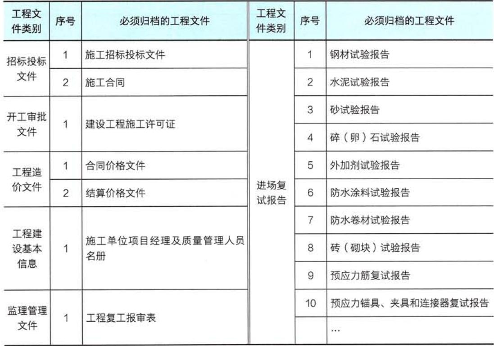

*续表*

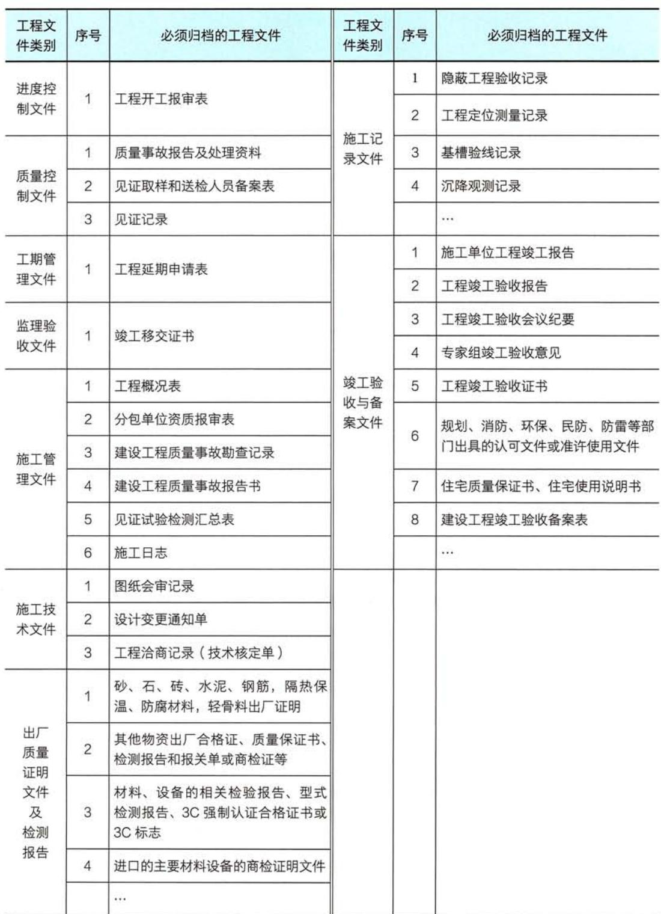

**2. 市政工程施工文件归档范围**

  根据《建设工程文件归档规范》GB/T50328—2014（2019年版），施工单位必须归档保存的市政工程文件（部分）见表8.1-2。

*表8.1-2施工单位必须归档保存的市政工程文件（部分）*

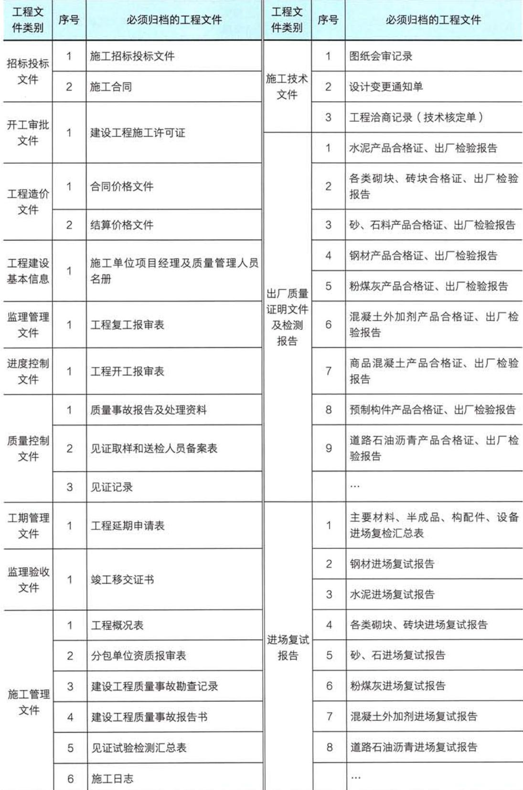

*续表*

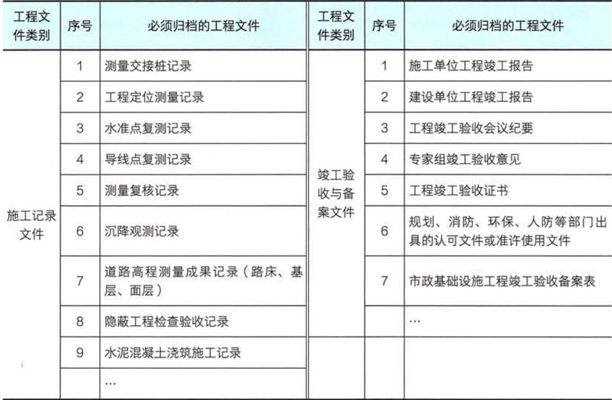

#### 8.1.2 施工文件立卷和归档要求

  《建设工程文件归档规范》GB/T50328—2014（2019年版）规定，建设工程文件应随工程建设进度同步形成，不得事后补编。建设单位在工程招标及与勘察、设计、施工、监理等单位签订协议、合同时，应明确竣工图的编制单位、工程档案的编制套数、编制费用及承担单位、工程档案的质量要求和移交时间等内容。  

  建设单位在组织工程竣工验收前，提请当地城建档案管理机构对工程档案进行预验收；未取得工程档案验收认可文件，不得组织工程竣工验收。对列入城建档案管理机构接收范围的工程，工程竣工验收后3个月内，应向当地城建档案管理机构移交一套符合规定的工程档案。  

  勘察、设计、施工、监理等单位应将本单位形成的工程文件立卷后向建设单位移交。建设工程实行总承包管理的，总包单位应负责收集、汇总各分包单位形成的工程档案，并应及时向建设单位移交；各分包单位应将本单位形成的工程文件整理、立卷后及时移交总承包单位。建设工程项目由几个单位承包的，各承包单位应负责收集、整理立卷其承包项目的工程文件，并应及时向建设单位移交。

**1. 施工文件立卷**

  施工文件的内容必须真实、准确，应与工程实际相符合。施工文件应字迹清楚，图样清晰，图表整洁，签字盖章手续应完备。

**1）施工文件立卷流程**

  施工文件立卷应按下列流程进行：  

  （1）对属于归档范围的施工文件进行分类，确定归入案卷的文件材料。  

  （2）对卷内文件材料进行排列、编目、装订（或装盒）。  

  （3）排列所有案卷，形成案卷目录。

**2）施工文件立卷原则**

  施工文件立卷应遵循以下原则：  

  （1）立卷应遵循施工文件的自然形成规律和工程专业特点，保持卷内文件的有机联系，便于档案保管和利用。  

  （2）施工文件应按施工准备、施工过程、竣工验收不同阶段分别进行立卷，并可根据数量多少组成一卷或多卷。  

  （3）专业承（分）包施工的分部、子分部（分项）工程应分别单独立卷；室外工程应按室外建筑环境和室外安装工程单独立卷。当施工文件中部分内容不能按一个单位工程分类立卷时，可按建设工程立卷。  

  （4）不同载体的文件应分别立卷。

**3）施工文件立卷方法**

  施工文件立卷应采用下列方法：  

  （1）施工文件应按单位工程、分部（分项）工程进行立卷。（2）竣工图应按单位工程分专业进行立卷。（3）竣工验收文件应按单位工程分专业进行立卷。（4）电子文件立卷时，每个工程（项目）应建立多级文件夹，应与纸质文件在案卷设置上一致，并应建立相应的标识关系。（5）声像资料应按工程建设各阶段立卷，重大事件及重要活动的声像资料应按专题立卷，声像档案与纸质档案应建立相应的标识关系。

**4）施工文件立卷要求**

  （1）不同幅面的工程图纸，应统一折叠成A4幅面（ 297mm×210mm ）。图面应朝内，首先沿标题栏的短边方向以W形折叠，然后再沿标题栏的长边方向以W形折叠，并使标题栏露在外面。  

  （2）案卷不宜过厚，文字材料卷厚度不宜超过 20mm ，图纸卷厚度不宜超过 50mm 。  

  （3）案卷内不应有重份文件。印刷成册的工程文件宜保持原状。  

  （4）电子文件的组织和排序可按纸质文件进行。  

  （5）图纸应按专业排列，同专业图纸应按图号顺序排列。当案卷内既有文字材料又有图纸时，文字材料应排在前面，图纸应排在后面。

**2. 施工文件归档**

**1）归档文件质量要求**

  （1）归档的纸质施工文件应为原件。施工文件内容及其深度应符合国家有关标准的规定。  

  （2）施工文件应采用碳素墨水、蓝黑墨水等耐久性强的书写材料，不得使用红色墨水、纯蓝墨水、圆珠笔、复写纸、铅笔等易褪色的书写材料。计算机输出文字和图件应使用激光打印机，不应使用色带式打印机、水性墨打印机和热敏打印机。  

  （3）施工文件中文字材料幅面尺寸规格宜为A4幅面（ 297mm×210mm 。图纸宜采用国家标准图幅。施工文件的纸张应采用能长期保存的韧力大、耐久性强的纸张。  

  （4）所有峻工图均应加盖竣工图章，并应符合下列规定：  

  ① 竣工图章的基本内容应包括：“竣工图”字样、施工单位、编制人、审核人、技术负责人、编制日期、监理单位、现场监理、总监。  

  ② 竣工图章尺寸应为： 50mm×80mm 。  

  ③ 竣工图章应使用不易褪色的印泥，应盖在图标栏上方空白处。  

  （5）竣工图的绘制与改绘应符合国家现行有关制图标准的规定。  

  （6）归档的电子文件应采用开放式文件格式或通用格式进行存储。专用软件产生的非通用格式的电子文件应转换成通用格式。  

  （7）归档的电子文件应采用电子签名等手段，所载内容应真实和可靠，且必须与其纸质档案一致。

**2）归档时间及移交要求**

  （1）施工单位应在工程竣工验收前，将其形成的有关工程档案向建设单位归档。  

  （2）工程档案的编制不得少于两套，一套应由建设单位保管，一套（原件）应移交当地城建档案管理机构保存。  

  （3）施工单位向建设单位移交档案时，应编制移交清单，双方签字、盖章后方可交接。

### 8.2 项目管理新发展

#### 8.2.1 项目管理标准及价值交付

  国内外项目管理标准有很多，工程项目管理者应充分了解国内外有影响力的项目管理标准，学习和践行价值交付等项目管理新理念，全面提升项目管理的规范化、科学化和国际化水平。

**1. 国内外项目管理标准**

**1）国际项目管理标准**

  国际上有较大影响力的项目管理标准有：美国项目管理协会（PMI）的项目管理知识体系（PMBOK）；国际项目管理协会（IPMA）的能力基准，包括个人能力基准（IPMAICB）和组织能力基准（IPMAOCB）；国际标准化组织（ISO）的项目管理系列标准。  

  （1）美国项目管理协会（PMI）的项目管理知识体系（PMBOK）。美国项目管理协会制定的项目管理知识体系（PMBOK），通过多年来不断的应用和完善，于2021年发布了《项目管理知识体系指南》（PMBOK®Guide）第7版。《项目管理知识体系指南》是美国项目管理协会（PMI）对项目管理所需知识、技能和工具进行的概括性描述，同时作为PMI考核认证项目管理专业人士（PMP，ProjectManagementProfessional）的基础依据。  

  在此之前，项目管理知识体系（PMBOK）以5个基本过程组和10个知识领域为基本架构。5大基本过程组包括：启动（Initiating）、计划（Planning）、执行（Executing）、监控（MonitoringandControlling）和收尾（Closing）。10个知识领域用来支撑基本过程组的执行，包括：项目集成管理（Project IntegrationManagement）、项目范围管理（ProjectScopeManagement）、项目进度管理（ProjectScheduleManagement）、项目费用管理（ProjectCostManagement）、项目质量管理（ProjectQualityManagement）、项目资源管理（ProjectResourceManagement）、项目沟通管理（ProjectCommunicationsManagement）、项目风险管理（ProjectRiskManagement）、项目采购管理（ProjectProcurement Management）、项目利益相关者管理（ProjectStakeholders Management）。  

  项目管理不仅是指单一项目管理，还包括多项目管理。多项目管理又可分为项目群管理（ProgramManagement）和项目组合管理（PortfolioManagement）。项目群管理是指组织为实现战略目标、获得收益而以一种综合协调方式对一组相关项目进行的管理。由多个项目组成的通信卫星系统就是一个典型的项目群实例，该项目群包括卫星和地面站的设计、卫星和地面站的施工、系统集成、卫星发射等多个项目。项目组合管理是指将若干项目或项目群与其他工作组合在一起进行有效管理，以实现组织的战略目标。项目组合中的项目或项目群之间没必要相互关联或直接相关。例如，一个基础设施公司为实现其投资回报最大化的战略目标，可将石油天然气、能源、水利、道路、铁道、机场等多个项目或项目群组合在一起实施项目组合管理。  

  《项目管理知识体系指南》（《PMBOKGuide》）第7版不再沿用过去的基本过程组和知识领域架构，而是提出了基于价值交付的12项原则和8个绩效域。  

  项目管理12项原则： ① 成为勤勉、尊重和关心他人的管家； ② 营造协作的项目团队环境； ③ 有效益相关者参与； ④ 聚焦于价值； ⑤ 识别、评估和响应系统交互； ⑥ 展现领导力行为； ⑦ 根据环境进行裁剪； ⑧ 将质量融人过程和可交付成果中； ⑨ 驾驭复杂性； ⑩ 优化风险应对； ① 拥抱适应性和韧性； ⑫ 为实现预期的未来状态而驱动变革。  

  项目管理8个绩效域： ① 利益相关者； ② 团队； ③ 开发方法和生命周期； ④ 规划； ⑤ 项目工作； ⑥ 交付； ⑦ 测量； ⑧ 不确定性。这些是有效交付项目成果至关重要的相关活动。  

  （2）国际项目管理协会（IPMA）的能力基准。国际项目管理协会（IPMA）是一个有全球影响力的项目管理专业组织。IPMA制定的个人能力基准（IPMAICB）和组织能力基准（IPMAOCB）在国际上有着广泛影响，对于促进个人和组织的项目管理能力具有重要参考。同时，个人能力基准（IPMAICB）也是IPMA考核认证国际项目管理专业人士（IPMP，InternationalProjectManagementProfessional）的主要标准。  

  ① 个人能力。个人能力是指知识、素质、思维、技能，以及在某些方面取得成功的相关经验的集合。IPMAICB4.0将个人能力分为如下3个维度：  

  A.环境能力。环境能力是指可用于支持个人与环境交互的方法、工具和技术，以及引领个人、组织和社会发起或支持项目、项目群和项目组合的理论依据。环境能力包含5个能力要素：战略，治理、架构与过程，遵循的要求、标准与规则，权利与利益，文化与价值。  

  B.行为能力。行为能力是指在项目、项目群或项目组合中工作的个人要取得成功所需的行为方面和处理人际关系的能力。行为能力包含10个能力要素：自我反思与自我管理、诚信与可靠、人际沟通、关系与参与度、领导力、团队工作、冲突与危机、谋略、谈判、结果导向。  

  C.技术能力。技术能力是指使项目、项目群或项目组合成功而使用的具体的方法、工具和技术。技术能力包含13个能力要素：项目策划、需求与目标、范围、时间（进度）、组织与信息、质量、财务（成本）、资源、采购、计划与控制、风险与机会、利益相关方、变化与变革。  

  ② 组织能力。组织能力是指可以快速、经济地整合资源，按特定流程实施业务活动，高效地获得成果，并实现可持续发展的一种客观衡量基准。IPMAOCB将组织的项目管理能力分为如下5项：  

  A.PP&P治理。涉及项目、项目群和项目组合（即“PP&P”），是组织整体协同管理的一部分。该能力应用于董事会最高层次的管理，帮助提出具有战略意义的观点、政策、方针、决策，以及对活动的监测和控制，并确定PP&P能力持续发展的方向。该能力包含4个能力要素：PP&P使命、愿景和策略，PP&P管理发展，领导力，绩效。  

  B.PP&P管理。这是组织管理系统中项目、项目群和项目组合管理的一部分。该能力应用于组织对不同层级的管理，支持提供资源、方法、工具、指导方针、决策、监测和控制，以及相关能力构成要素的持续发展方向。该能力包含3个能力要素：项目管理、项目群管理、项目组合管理。  

  C.PP&P组织一致性。这是解决高层管理者设定的组织目标和绩效期望的一部分。该能力在其他管理职能的支持下由PP&P管理者执行。该能力包含3个能力要素：过程一致、结构一致、文化一致。  

  D.PP&P资源。根据组织最高管理层设定的资源可利用性和最高利用率来设置目标和期望。该能力在其他管理职能（财务、法律、采购和技术）的支持下由PP&P管理者执行，为确定资源需求、采购和PP&P资源的可持续发展提供指导。该能力包含4个能力要素：资源需求、资源现状、资源获得、资源开发。  

  E.PP&P人员能力。这与相关人员的基本能力、实际绩效及酬劳等有关。其管理由PP&P管理者支持下的人力资源经理协同其他职能经理执行。该能力为定义能力需求、评估能力现状和PP&P能力可持续发展提供指导。该能力包含4个能力要素：人员能力需求、人员能力现状、人员能力获得、人员能力开发。  

  （3）国际标准化组织（ISO）的项目管理系列标准。国际标准化组织（ISO）所属的“项目、项目群及项目组合管理标准化技术委员会”（ISO/TC258）自2012年以来针对项目管理制定和发布了多项国际标准。这些标准包括：《项目管理指南》ISO21500：2021、《项目与项目组合管理指南》ISO21502：2014、《项目群管理指南》ISO21503：2022、《项目组合管理指南》ISO21504：2022、《项目、项目群和项目组合：治理指南》ISO21505：2017、《项目、项目群管理：挣值管理》IS021508：2018、《项目、项目群管理：工作分解结构》ISO21511：2018等。IPMA的个人能力基准（IPMAICB）和组织能力基准（IPMAOCB）都是基于ISO项目管理标准制定的。  

  2020年，ISO/TC258正式发布了最新的项目管理国际标准《项目管理指南：项目、项目群和项目组合管理》（Project，programmeandportfoliomanagement- -Guidanceonprojectmanagement）ISO21502：2020，全面改进了《项目管理指南》ISO21500：2012，旨在为所有组织（包括公共、私人和慈善机构）的项目管理提供指南。

**2）我国工程项目管理标准**

  我国工程项目管理标准主要有国家标准《建设工程项目管理规范》GB/T50326一2017和《建设项目工程总承包管理规范》GB/T50352—2018，还有相关行业标准。近年来，随着标准化管理体制改革的不断深化，工程项目管理团体标准也日渐增多。其中，团体标准《建设工程施工项目经理岗位职业标准》T/CCIAT0010—2019对建造师执业具有重要参考价值。  

  （1）《建设工程项目管理规范》GB/T50326—2017主要内容  

  ① 项目管理原理。企业应遵循策划、实施、检查、处置（PDCA）的动态管理原理，确定项目管理流程，建立项目管理制度，实施项目系统管理，持续改进管理绩效，提高相关方满意水平，确保实现项目管理目标。  

  ② 项目管理流程。项目管理机构应按项目管理流程实施项目管理。项目管理流程应包括启动、策划、实施、监控和收尾过程，各个过程之间相对独立，又相互联系。  

  A.启动过程：应明确项目概念，初步确定项目范围，识别影响项目最终结果的内外部相关方。B.策划过程：应明确项目范围，协调项目相关方期望，优化项目目标，为实现项目目标进行项目管理规划与项目管理配套策划。C.实施过程：应按照项目管理策划要求组织人员和资源，实施具体措施，完成项目管理策划中确定的工作。D.监控过程：应对照项目管理策划，监督项目活动，分析项目进展情况，识别必要的变更需求并实施变更。  

  E.收尾过程：应完成全部过程或阶段的所有活动，正式结束项目或阶段。  

  组织应确定项目系统管理方法，包括系统分析、系统设计、系统实施和系统综合评价方法。  

  ③ 项目相关方管理。企业应识别项目的所有相关方，了解其需求和期望，确保项目管理要求与相关方的期望相一致。企业应通过实施下列项目管理活动使相关方满意：  

  A.遵守国家有关法律和法规。  
  B.确保履行工程合同要求。  
  C.保障健康和安全，减少或消除项目对环境造成的影响。  
  D.与相关方建立互利共赢的合作关系。  
  E.构建良好的组织内部环境。  
  F.通过相关方满意度的测评，提升相关方管理水平。  

  ④ 项目管理责任制度。项目管理责任制度应作为项目管理的基本制度。项目经理责任制应是项目管理责任制度的核心内容。建设工程项目各实施主体和参与方应建立项目管理责任制度，明确项目管理组织和人员分工，建立各方相互协调的管理机制。  

  施工单位法定代表人应书面授权委托项目经理，并实行项目经理责任制。项目经理应取得相应资格，并按规定取得安全生产考核合格证书。项目经理应根据企业法定代表人的授权范围、期限和内容，履行管理职责，并按相关约定在岗履职，对项目实施全过程及全面管理。  

  ⑤ 项目管理机构。项目管理机构的建立应遵循下列规定：  

  A.结构应符合组织制度和项目实施要求。  
  B.应有明确的管理目标、运行程序和责任制度。  
  C.机构成员应满足项目管理要求及具备相应资格。  
  D.组织分工应相对稳定并可根据项目实施变化进行调整。  
  E.应确定机构成员的职责、权限、利益和需承担的风险。  

  ⑥ 项目管理策划。项目管理策划应由项目管理规划策划和项目管理配套策划组成。项目管理规划应包括项目管理规划大纲和项目管理实施规划，项目管理配套策划应包括项目管理规划以外的所有项目管理策划内容。  

  项目管理策划应遵循下列程序：  

  A.识别项目管理范围。  
  B.进行项目工作分解。  
  C.确定项目实施方法。  
  D.规定项目需要的各种资源。  
  E.测算项目成本。  
  F.对各个项目管理过程进行策划。  

  ⑦ 采购与投标管理。企业应建立采购管理制度，确定采购管理流程和实施方式，规定管理与控制的程序和方法。企业编制的采购计划应包括下列内容：  

  A.采购工作范围、内容及管理标准。  
  B.采购信息，包括产品或服务的数量、技术标准和质量规范。  
  C.检验方式和标准。  
  D.供方资质审查要求。  

  E.采购控制目标及措施。企业应按工程合同的约定和需要，订立采购合同或规定相关要求。采购合同或相关要求应明确双方责任、权限、范围和风险，并经组织授权人员审核批准，确保采购合同或要求内容的合法性。  

  企业在施工投标前，应进行投标策划，确定投标目标，并编制投标计划。企业应根据投标项目需求进行分析，确定下列投标计划内容：  

  A.投标目标、范围、要求与准备工作安排。  
  B.投标工作各过程及进度安排。  
  C.投标所需要的文件和资料。  
  D.与代理方及合作方的协作。  
  E.投标风险分析及信息沟通。  
  F.投标策略与应急措施。  
  G.投标监控要求。  

  企业应根据招标和竞争需求编制包括下列内容的投标文件：  

  A.响应招标要求的各项商务规定。  
  B.有竞争力的技术措施和管理方案。  

  C.有竞争力的报价。企业应保证投标文件符合发包方及相关要求，经过评审后投标，并保存投标文件评审的相关记录。  

  ⑧ 合同管理。企业应建立项目合同管理制度，明确合同管理责任，设立专门机构或人员负责合同管理工作。项目合同管理应遵循下列程序：  

  A.合同评审。  
  B.合同订立。  
  C.合同实施计划。  
  D.合同实施控制。  
  E.合同管理总结。  

  合同订立前，企业应进行合同评审。合同评审应包括下列内容：  

  A.合法性、合规性评审。  
  B.合理性、可行性评审。  
  C.合同严密性、完整性评审。  
  D.与产品或过程有关要求的评审。  
  E.合同风险评估。  

  项目管理机构应按约定全面履行合同。合同实施控制的日常工作应包括下列内容：  

  A.合同交底。  
  B.合同跟踪与诊断。  
  C.合同完善与补充。  
  D.信息反馈与协调。  
  E.其他应自主完成的合同管理工作。  

  ⑨ 技术管理。项目管理机构应实施项目技术管理策划，确定项目技术管理措施，进行项目技术应用活动。项目技术管理措施应包括下列主要内容：  

  A.技术规格书。  
  B.技术管理规划。  
  C.施工组织设计、施工措施、施工技术方案。  
  D.采购计划。  

  ⑩ 项目目标管理。企业应建立项目进度、质量、成本、安全生产、绿色建造及环境管理制度，明确项目目标管理程序，规定项目目标管理职责及工作要求，按照策划、实施、检查、处置的循环方式进行项目目标管理。  

  ① 资源管理。项目管理机构应根据项目目标管理的要求进行项目资源的计划、配置、控制，并根据授权进行考核和处置。项目资源管理应遵循下列程序：  

  A.明确项目的资源需求。  
  B.分析项目整体的资源状态。  
  C.确定资源的各种提供方式。  
  D.编制资源的相关配置计划。  
  E.提供并配置各种资源。  
  F.控制项目资源的使用过程。  
  G.跟踪分析并总结改进。  

  ⑫ 信息与知识管理。企业应建立项目信息与知识管理制度，及时、准确、全面地收集信息与知识，安全、可靠、方便、快捷地存储、传输信息和知识，有效、适宜地使用信息和知识。信息管理应包括下列内容：  

  A.信息计划管理。  
  B.信息过程管理。  
  C.信息安全管理。  
  D.文件与档案管理。  
  E.信息技术应用管理。  

  项目管理机构可应用项目信息化管理技术，采用专业信息系统，实施知识管理。  

  ⑬ 沟通管理。应建立项目相关方沟通管理机制，健全项目协调制度，确保组织内部与外部各个层面的交流与合作。项目沟通管理应按下列程序进行：  

  A.项目实施目标分解。  
  B.分析各分解目标自身需求和相关方需求。  
  C.评估各目标的需求差异。  
  D.制定项目沟通计划。  
  E.明确沟通责任人、沟通内容和沟通方案。  
  F.按既定方案进行沟通。  
  G.总结评价沟通效果。  

  ⑭ 风险管理。企业应建立风险管理制度，明确各层次管理人员的风险管理责任，管理各种不确定因素对项目的影响。项目风险管理应按下列程序进行：  

  A.风险识别。  
  B.风险评估。  
  C.风险应对。  
  D.风险监控。  

  ⑮ 收尾管理。企业应建立项目收尾管理制度，明确项目收尾管理的职责和工作程序。项目管理机构应实施下列项目收尾工作：  

  A.编制项目收尾计划。  
  B.提出有关收尾管理要求。  
  C.理顺、终结所涉及的对外关系。  
  D.执行相关标准与规定。  
  E.清算合同双方的债权债务。  

  ⑯ 管理绩效评价。企业应制定和实施项目管理绩效评价制度，规定相关职责和工作程序，吸收项目相关方的合理评价意见。项目管理绩效评价应采用适合工程项目特点的评价方法，过程评价与结果评价相配套，定性评价与定量评价相结合。项目管理绩效评价应包括下列内容：  

  A.项目管理特点。  
  B.项目管理理念、模式。  
  C.主要管理对策、调整和改进。  
  D.合同履行与相关方满意度。  

  E.项目管理过程检查、考核、评价。  

  F.项目管理实施成果。  

  （2）《建设工程施工项目经理岗位职业标准》T/CCIAT0010—2019主要内容  

  ① 施工准备管理。施工准备包括施工组织准备、施工技术准备、施工现场准备和施工资源准备。施工项目经理应根据施工合同约定，遵循动态管理原理，组织项目团队成员建立健全工程项目管理体系，制定和实施科学合理的保障措施，确保各类资源有序投入、高效利用。  

  施工项目经理应组织项目团队成员分析工程项目的特点、合同内容及经济、社会和自然环境条件，充分考虑工程项目相关方的利益需求，确定和分解项目管理目标和内容，进行项目实施策划，并分析风险因素，提出有效的控制措施和应急预案。  

  施工项目经理应参加由建设单位主持召开的工地会议，并按规定会签会议纪要。施工项目经理应按规定向项目监理机构或建设单位报送工程开工申请，待项目监理机构或建设单位签发工程开工令后方可进行施工。  

  ② 施工过程管理。施工项目经理应组织项目团队成员分析预测工程施工状况，结合工程项目目标制定和实施相关预控、预防措施。  

  施工项目经理应定期组织召开施工例会，并应参加建设单位或项目监理机构组织召开的专题会议，研究解决与工程施工相关的问题，并指定专人负责记录和形成会议纪要。  

  施工项目经理应组织项目团队成员跟踪检查工程项目实施情况，分析工程项目目标偏差及其原因，并采取有效措施调整工程项目实施计划。  

  施工项目经理应指派专人记录施工日志，定期编制施工月报，按规定向工程项目相关方提交施工进展分析报告。  

  ③ 竣工验收与结算管理。施工项目经理应按规定组织工程质量内部检验，参加工程竣工验收，在合同规定期限内组织工程交付。施工项目经理应依据施工合同、工程竣工结算有关规定，组织或参加工程竣工结算。施工项目经理应依据工程竣工验收与结算相关法规标准和施工合同约定，协调处理工程竣工验收与结算中的问题。  

  ④ 工程项目管理总结评价。施工项目经理应组织项目团队成员做好项目收尾工作，及时进行工程项目管理总结与项目团队成员绩效考核评价。工程项目管理总结报告应包括下列内容：  

  A.项目概况。  
  B.项目管理重点与难点。  
  C.项目管理主要措施及其成效。  
  D.实施过程遇到的问题及其应对措施。  
  E.项目管理成果。  
  F.项目管理经验。  
  G.项目管理教训。  
  H.项目管理效果总体评价。  

  施工项目经理应配合企业对其项目团队管理绩效进行考核评价，并根据需要提供相关资料或证据。

**2. 价值交付**

  面对复杂多变的项目环境，价值驱动型项目管理是项目管理的发展趋势。《项目管理知识体系指南》（第7版）提出了以价值为导向的项目管理，认为度量项目成功的指标应由传统项目管理所强调的范围、进度、成本三重要素约束下满足质量要求从而成功地交付项目可交付成果，转变为实现收益并获取价值。  

  项目成功与否并不在于项目成果是否交付、是否得到相关方验收，而在于项目完成时相关方对可交付成果的价值感知与价值认同，以及项目投入运营后可交付成果为组织和社会创造的价值。为此，应建立以交付价值为导向的项目管理理念，从项目需求提出开始到项目交付使用，以追求价值卓越为目标，最终完整实现项目价值。

**1）价值交付系统**

  《项目管理知识体系指南》（第7版）提出，一个符合组织战略的价值交付系统可有多种组件，包括项目组合、项目群、项目、产品和运营，可以单独或共同使用多种组件来创造价值，这些组件共同组成一个符合组织战略的价值交付系统。具体而言，价值交付系统需要考虑以下内容：  

  （1）创造价值（CreatingValue）。项目存在于更大的系统中，如政府机构、企业或合同安排中。为组织及利益相关者创造价值，运作项目的方式有：  

  ① 创造满足客户或最终用户需要的新产品、服务或结果。  

  ② 做出积极的社会或环境贡献。  

  ③ 提高效率、生产力、效果或响应能力。  

  ④ 推动必要的变革，以促进组织向期望的未来状态过渡。  

  ⑤ 维持以前的项目群、项目或业务运营所带来的收益。  

  （2）组织治理体系（OrganizationalGovernanceSystems）。组织治理体系包括监督、控制、价值评估及决策能力等要素。组织治理体系还提供了一个整合结构，用于评估与环境和价值交付系统组件相关的变更、问题和风险。这些组件包括项目组合目标、项目群收益和项目生成的可交付物。组织治理体系与价值交付系统协同运作，可实现流畅的工作流程、问题管理并支持决策。  

  （3）与项目有关的职能（FunctionsAssociatedwithProjects）。包括：提供监督和协调；提出目标和反馈；引导和支持；运用专业知识开展工作；提供资源、业务方向和洞察；维持治理等。  

  项目价值交付需要人们有效地履行相关职能来实现，因此，协调集体工作对于任何项目的成功都至关重要。项目组织方式不同，会有不同的协调方式。有些项目受益于去中心化的协调，项目团队成员会进行自组织和自管理。有些项目则受益于由委派的项目经理或类似角色领导和指导的集中化协调。当然，对于采用集中化协调的项目，也将自组织项目团队纳入进来，使其承担部分工作。无论采取何种协调方式，项目团队与其他利益相关者之间的支持型领导模式和有意义、持续的互动才是项目成功的基础。  

  （4）项目环境（ProjectEnvironment）。组织环境对价值交付有着不同程度的影响。组织的内外部环境可能会对项目特征、利益相关者或项目团队产生有利、不利或中性的影响。组织的内部环境因素可能来自组织自身、项目组合、项目群、其他项目或这些来源的组合。组织的外部环境因素可能会增强、限制项目成果或对项目成果产生中性  

  影响。  

  （5）产品管理考虑因素（ProductManagementConsiderations）。项目组合、项目群、项目与产品管理等领域的相互关联性正逐渐加强。产品既可以是最终制品，也可以是组件制品。产品管理是指将人员、数据、过程和业务系统整合，以便在整个产品生命周期中创建、维护和开发产品或服务。产品管理可以在产品生命周期（引入、成长、成熟到衰退）的任何时点启动项目群或项目，以创建或增强特定组件、职能或功能。因此，产品管理可以表现为不同形式，包括：产品生命周期中的项目群管理、项目管理；项目群中的产品管理。  

  总之，价值交付要求项目管理者具备更为全面的眼光和更为深远的洞察，不再局限于在项目范围内按时、按预算管理客户对质量的期望，或传统的关键绩效指标，而是要聚焦长远战略和可持续的收益。

**2）价值驱动型项目管理**

  价值驱动是项目管理领域的新发展，项目管理者应关注项目管理新发展。  

  （1）项目管理新理念。价值驱动型项目管理有如下基本理念：① 如果做的是错误的项目，那么项目执行得再完美也无关紧要。② 在预算范围内按时完成的项目并不一定是成功的项目。③ 满足进度（工期）、成本、范围和质量“铁三角”的项目并不一定在项目完成后产生必要的商业价值。④ 拥有成熟的项目管理实践并不能保证项目完成后会有商业价值。⑤ 价格是实施项目所付出的，价值是实施项目得到的。⑥ 商业价值是客户认为值得付出的东西。⑦ 当商业价值实现时，项目就成功了。（2）商业价值因素。价值驱动型项目管理应考虑以下商业价值因素：① 从商业角度看，一个预算超支的项目有时却是划算的。② 一组产生正现金流的项目，并不一定代表一家公司的总体最佳投资机会。③ 从数学上讲，不可能同时将所有项目列为第一优先级。④ 一个组织在同一时间做太多的项目，并不能真正完成更多的工作。⑤ 从商业角度看，强迫项目团队接受不切实际的最后期限是极其有害的。

#### 8.2.2 建筑信息模型（BIM）在工程项目管理中的应用

  建筑信息模型（BIM，BuildingInformationModeling或BuildingInformationModel）是指在建设工程全生命期内，对其物理和功能特性进行数字化表达，并依此进行设计、施工、运营的过程和结果的总称。BIM技术的广泛应用，给工程建设和管理带来深刻变革，大大推动了建筑业数字化发展。  

  BIM技术可应用于建设工程全生命期各个阶段，结合建设工程规划设计、施工及运营维护等不同阶段的特点和需求发挥其不同作用。仅对建设工程施工阶段而言，根据《建筑信息模型施工应用标准》GB/T51235—2017，BIM技术在工程施工阶段的应用宜覆盖深化设计、施工实施、竣工验收等全过程，也可根据工程项目实际需要应用于某些环节或任务。具体应用目标和范围应根据项目特点、合约要求及工程项目相关方BIM  

  应用水平等综合确定。

**1. BIM技术应用策划**

  施工BIM技术应用应事先制定施工BIM技术应用策划，并遵照策划进行BIM技术应用的过程管理。

**1）施工BIM技术应用策划程序**

  制定施工BIM技术应用策划可按下列步骤进行：  

  （1）确定BIM技术应用的范围和内容。  
  （2）以BIM技术应用流程图等形式明确BIM技术应用过程。  
  （3）规定BIM技术应用过程中的信息交换要求。  
  （4）确定BIM技术应用的基础条件，包括沟通途径及技术和质量保障措施等。

**2）施工BIM技术应用策划内容**

  施工BIM技术应用策划宜明确下列内容：  

  （1）BIM技术应用目标。  
  （2）BIM技术应用范围和内容。  
  （3）人员组织架构和相应职责。  
  （4）BIM技术应用流程。  
  （5）模型创建、使用和管理要求。  
  （6）信息交换要求。  
  （7）模型质量控制和信息安全要求。  
  （8）进度计划和应用成果要求。  
  （9）软硬件基础条件等。

**2. BIM技术在施工管理中的应用**

  （1）施工模型。施工模型可包括深化设计模型、施工过程模型和竣工验收模型。施工模型应根据BIM应用相关专业和任务的需要创建，其模型细度应满足深化设计、施工过程和竣工验收等任务的要求。  

  施工模型元素信息宜包括下列内容： ① 尺寸、定位、空间拓扑关系等几何信息；② 名称、规格型号、材料和材质、生产厂商、功能与性能技术参数，以及系统类型、施工段、施工方式、工程逻辑关系等非几何信息。  

  施工模型在满足模型细度要求的前提下，可使用文档、图形、图像、视频等扩展信息。  

  施工模型应满足工程项目相关方协同工作的需要，支持工程项目相关方获取、应用及更新信息。  

  （2）深化设计。现浇混凝土结构工程、装配式混凝土结构工程、钢结构工程、机电工程等深化设计宜应用BIM技术。深化设计BIM软件应具备空间协调、工程量统计、深化设计图和报表生成等功能。  

  （3）施工模拟。施工组织模拟和施工工艺模拟宜应用BIM技术。施工模拟前，应确定BIM技术应用内容、BIM技术应用成果分阶段或分期交付计划，并应分析和确定工程项目中需基于BIM技术进行施工模拟的重点和难点。  

  ① 在施工组织模拟BIM技术应用中，可基于施工图设计模型或深化设计模型和施工图、施工组织设计文档等创建施工组织模型，并应将工序安排、资源配置和平面布置等信息与模型关联，输出施工进度、资源配置等计划，指导和支持模型、视频、说明文档等成果的制作与方案交底。  

  ② 当施工难度大或采用新技术、新工艺、新设备、新材料时，宜应用BIM进行施工工艺模拟。在施工工艺模拟BIM技术应用中，可基于施工组织模型和施工图创建施工工艺模型，并将施工工艺信息与模型关联，输出资源配置计划、施工进度计划等，指导模型创建、视频制作、文档编制和方案交底。  

  （4）进度管理。施工进度计划编制和进度控制等宜应用BIM技术。在进度计划编制BIM技术应用中，可基于项目特点创建工作分解结构，编制进度计划，基于深化设计模型创建进度管理模型，基于定额完成工程量估算和资源配置、进度计划优化。在进度控制BIM技术应用中，应基于进度管理模型和实际进度信息完成进度对比分析，基于偏差分析结果更新进度管理模型。  

  （5）成本管理。在成本管理BIM技术应用中，宜基于深化设计模型或预制加工模型，以及清单规范和消耗量定额创建成本管理模型，通过计算合同预算成本和集成进度信息，定期进行计划成本与实际成本对比分析及纠偏等工作。  

  （6）质量与安全管理。在质量管理BIM技术应用中，宜基于深化设计模型或预制加工模型创建质量管理模型，基于质量验收标准和施工资料标准确定质量验收计划，进行质量验收、质量问题处理、质量问题分析。  

  在安全管理BIM技术应用中，宜基于深化设计或预制加工等模型创建安全管理模型，基于安全管理标准确定安全技术措施计划，采取安全技术措施，处理安全隐患和事故，分析安全问题。  

  （7）竣工验收。在竣工验收BIM技术应用中，应将竣工预验收与竣工验收合格后形成的验收信息和资料附加或关联到模型中，形成竣工验收模型，为数字交付奠定坚实基础。

*二级建造师考试大纲考点 · 提取自题库软件*
